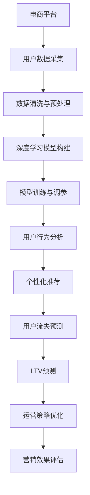

                 

# AI驱动的电商平台用户生命周期价值预测

> 关键词：电商平台,用户生命周期价值,预测模型,深度学习,数据驱动,自动化,推荐系统

## 1. 背景介绍

### 1.1 问题由来
随着互联网电商的兴起，电商平台已成为消费者购买商品的主要渠道之一。据统计，全球在线零售市场规模预计在2025年将达到4.9万亿美元。然而，尽管电商平台的销售额不断增长，但用户流失率也居高不下。用户流失不仅带来直接的经济损失，还会影响平台声誉和市场竞争力。因此，如何有效预测和留住用户，提升用户生命周期价值(Lifetime Value, LTV)，成为电商平台亟需解决的关键问题。

### 1.2 问题核心关键点
用户生命周期价值预测，是指通过分析用户的历史行为数据，预测其在未来一段时间内的消费潜力。预测结果可用于指导电商平台制定精准的用户维护策略，如个性化推荐、定制化服务、会员特权等，从而提升用户满意度和忠诚度，最大化用户价值。

为实现高效精准的用户生命周期价值预测，电商平台通常采用数据驱动的AI模型，对用户数据进行深度挖掘和建模。深度学习技术因其强大的特征提取和模式识别能力，在用户行为分析和预测中表现出色。因此，本文将聚焦于利用深度学习技术，构建用户生命周期价值预测模型。

### 1.3 问题研究意义
用户生命周期价值预测不仅是电商平台的营收优化手段，更是提升用户体验、实现个性化营销的重要工具。通过精准预测用户未来价值，电商平台能够更有针对性地分配营销资源，减少无效投入，最大化投资回报率。此外，用户生命周期价值预测还有助于识别潜在的高价值用户，提前为其提供专属服务，增强用户粘性。

综上所述，研究用户生命周期价值预测模型，对于电商平台的精细化运营和持续增长，具有重要的现实意义。

## 2. 核心概念与联系

### 2.1 核心概念概述

在构建用户生命周期价值预测模型之前，首先需要了解相关的核心概念：

- **电商平台(E-commerce Platform)**：通过互联网进行商品销售的在线平台。常见的电商平台如淘宝、京东、Amazon等。
- **用户生命周期价值(Lifetime Value, LTV)**：用户在平台上的总消费额。计算公式为：LTV = C / PFR，其中C为平均消费金额，PFR为流失率。
- **用户行为分析(Usage Analysis)**：通过分析用户的历史行为数据，识别用户特征和消费模式，指导个性化推荐和营销策略。
- **深度学习(Deep Learning)**：一类基于神经网络的机器学习方法，具有强大的特征提取和泛化能力，广泛应用于图像识别、语音识别、自然语言处理等领域。
- **自动化(Automation)**：利用算法和AI技术，自动完成数据处理、模型训练和预测结果输出，提高运营效率。
- **推荐系统(Recommendation System)**：通过分析用户历史行为和物品属性，为用户推荐相关商品或内容，提升用户体验和平台销量。

这些核心概念之间存在密切的联系，相互协作，共同支撑着电商平台的用户生命周期价值预测和精细化运营。

### 2.2 核心概念原理和架构的 Mermaid 流程图



这个流程图展示了用户生命周期价值预测的完整流程：

1. **数据采集**：从电商平台的用户行为日志中提取用户的基本信息、购买历史、浏览记录等数据。
2. **数据清洗与预处理**：清洗数据噪声和异常值，进行特征工程，如用户分群、特征编码等。
3. **模型构建**：选择适合的深度学习模型，如卷积神经网络(CNN)、循环神经网络(RNN)、变分自编码器(VAE)等。
4. **模型训练与调参**：使用历史数据对模型进行训练，并通过交叉验证等方式进行超参数调优。
5. **行为分析**：基于训练好的模型，分析用户的行为模式和特征，识别高价值用户。
6. **个性化推荐**：结合用户特征和商品属性，生成个性化推荐结果，提升用户满意度。
7. **流失预测**：使用模型预测用户流失概率，提前采取干预措施。
8. **LTV预测**：通过预测用户未来消费行为，计算其生命周期价值。
9. **策略优化**：根据预测结果，优化运营策略，提高用户留存率。
10. **效果评估**：评估营销效果和模型性能，不断优化模型。

## 3. 核心算法原理 & 具体操作步骤
### 3.1 算法原理概述

用户生命周期价值预测的核心算法是基于深度学习的回归模型。该模型通过对用户历史行为数据进行建模，预测用户未来一段时间内的消费潜力。具体的算法原理如下：

1. **数据预处理**：将原始用户数据进行清洗、编码、特征提取等预处理操作，生成可用于训练的特征向量。
2. **模型选择**：选择适合电商场景的深度学习模型，如RNN、CNN、VAE等，搭建预测模型。
3. **模型训练**：使用历史用户数据对模型进行训练，通过最小化预测误差来优化模型参数。
4. **预测与评估**：使用测试集对模型进行评估，通过均方误差(MSE)等指标衡量模型预测的准确性。
5. **策略调整**：根据预测结果，制定相应的运营策略，如个性化推荐、客户关怀等。

### 3.2 算法步骤详解

基于深度学习的用户生命周期价值预测模型构建步骤如下：

1. **数据收集与预处理**
   - 从电商平台的日志系统中提取用户数据，包括基本信息、购买历史、浏览记录等。
   - 对数据进行清洗和处理，去除噪声和异常值，并进行特征编码和标准化。

2. **模型选择与搭建**
   - 选择适合的深度学习模型，如RNN、CNN、VAE等，构建预测模型。
   - 将用户数据作为模型的输入，设置输出层为回归层，用于预测用户的消费金额或未来消费天数。

3. **模型训练与调参**
   - 使用历史用户数据对模型进行训练，通过交叉验证等方式进行超参数调优。
   - 设置合适的损失函数和优化器，如均方误差损失、Adam优化器等。
   - 调整学习率和训练轮数，避免过拟合。

4. **模型评估与优化**
   - 使用测试集对模型进行评估，计算MSE等指标。
   - 根据评估结果，调整模型结构和参数，进一步提升模型预测能力。

5. **预测与策略调整**
   - 使用训练好的模型对新用户进行预测，计算其未来价值。
   - 根据预测结果，制定个性化的用户维护策略，如专属推荐、会员特权等。

### 3.3 算法优缺点

基于深度学习的用户生命周期价值预测模型具有以下优点：

- **高效性**：深度学习模型具有强大的特征提取和模式识别能力，能够高效地处理复杂用户数据，提供精准预测结果。
- **泛化能力强**：深度学习模型在电商场景中表现出色，能够适应不同类型和规模的用户数据。
- **自动化**：利用深度学习模型，电商平台的运营人员可以自动化地进行用户行为分析和预测，减少人工干预，提升效率。

然而，该模型也存在一些缺点：

- **数据需求量大**：深度学习模型需要大量标注数据进行训练，电商平台获取高精度数据成本较高。
- **计算资源消耗大**：深度学习模型训练和推理资源消耗大，需要高性能硬件支持。
- **模型复杂度高**：深度学习模型参数量大，难以解释其内部工作机制，模型维护和优化困难。

### 3.4 算法应用领域

用户生命周期价值预测模型在电商平台上具有广泛的应用场景：

- **个性化推荐**：根据用户的历史行为数据和未来价值预测，生成个性化推荐，提升用户体验和销量。
- **用户流失预警**：使用模型预测用户流失概率，提前采取干预措施，减少流失率。
- **客户细分**：通过预测用户未来价值，进行客户细分，制定针对性营销策略。
- **定价优化**：根据用户生命周期价值，优化商品定价策略，提升平台收益。
- **库存管理**：根据预测结果，优化商品库存，减少库存积压和缺货现象。

## 4. 数学模型和公式 & 详细讲解  
### 4.1 数学模型构建

用户生命周期价值预测模型可以表示为：

$$
\hat{LTV} = f(\mathbf{x})
$$

其中，$\hat{LTV}$为预测的LTV，$\mathbf{x}$为用户的历史行为特征向量。模型$f$为深度学习回归模型，可以是RNN、CNN、VAE等。

常见的回归模型包括：

1. **线性回归**：最简单的回归模型，适合于预测线性关系较强的数据。
2. **RNN**：适用于处理时间序列数据，能够捕捉用户的长期行为模式。
3. **CNN**：适用于处理高维度的特征数据，如图像和文本。
4. **VAE**：适用于生成预测结果，能够捕捉数据的内在分布。

### 4.2 公式推导过程

以RNN模型为例，用户生命周期价值预测的公式推导如下：

1. **模型输入**：
   $$
   \mathbf{x} = [x_1, x_2, ..., x_t]
   $$
   其中$x_i$为用户在第$i$天记录的行为特征。

2. **模型输出**：
   $$
   \hat{LTV} = \sum_{i=1}^{t} x_i w_i
   $$
   其中$w_i$为第$i$天的权重系数，表示用户的消费潜力。

3. **预测公式**：
   $$
   \hat{LTV} = \sum_{i=1}^{t} x_i \sigma(W_L x_{i-1} + b_{L})
   $$
   其中$W_L$和$b_L$为LSTM层中的权重和偏置，$\sigma$为激活函数，如ReLU。

通过以上推导，可以看到，用户生命周期价值预测模型基于用户历史行为数据，通过RNN等深度学习模型进行训练，预测未来一段时间内的消费潜力。

### 4.3 案例分析与讲解

以下以电商平台上的用户购买行为为例，解释用户生命周期价值预测模型的具体应用：

1. **数据预处理**：
   - 收集用户购买历史数据，包括购买时间、商品ID、价格等。
   - 清洗数据，去除噪声和异常值，并进行特征编码和标准化。

2. **模型选择与搭建**：
   - 选择RNN模型，作为预测模型。
   - 搭建RNN网络，设置多层LSTM层，每层LSTM接收上一层输出作为输入，输出预测结果。

3. **模型训练与调参**：
   - 使用历史购买数据对模型进行训练，通过交叉验证进行超参数调优。
   - 设置合适的损失函数和优化器，如均方误差损失、Adam优化器等。
   - 调整学习率和训练轮数，避免过拟合。

4. **模型评估与优化**：
   - 使用测试集对模型进行评估，计算MSE等指标。
   - 根据评估结果，调整模型结构和参数，进一步提升模型预测能力。

5. **预测与策略调整**：
   - 使用训练好的模型对新用户进行预测，计算其未来购买金额。
   - 根据预测结果，制定个性化的用户维护策略，如专属推荐、会员特权等。

## 5. 项目实践：代码实例和详细解释说明
### 5.1 开发环境搭建

在进行用户生命周期价值预测项目开发前，需要先搭建开发环境。以下是使用Python进行PyTorch开发的完整环境配置流程：

1. 安装Anaconda：从官网下载并安装Anaconda，用于创建独立的Python环境。
```bash
conda create -n pytorch-env python=3.8 
conda activate pytorch-env
```

2. 安装PyTorch：根据CUDA版本，从官网获取对应的安装命令。例如：
```bash
conda install pytorch torchvision torchaudio cudatoolkit=11.1 -c pytorch -c conda-forge
```

3. 安装TensorBoard：用于可视化模型训练过程。
```bash
pip install tensorboard
```

4. 安装TensorFlow：用于深度学习模型的搭建和训练。
```bash
pip install tensorflow
```

5. 安装Pandas和NumPy：用于数据处理和分析。
```bash
pip install pandas numpy
```

完成上述步骤后，即可在`pytorch-env`环境中开始项目开发。

### 5.2 源代码详细实现

以下是一个使用TensorFlow搭建用户生命周期价值预测模型的示例代码：

```python
import tensorflow as tf
import numpy as np
import pandas as pd
import tensorflow_datasets as tfds

# 读取数据集
train_data = tfds.load('user_behavior', split='train', as_supervised=True)
test_data = tfds.load('user_behavior', split='test', as_supervised=True)

# 定义模型结构
class UserLTV(tf.keras.Model):
    def __init__(self, input_dim):
        super(UserLTV, self).__init__()
        self.lstm = tf.keras.layers.LSTM(64, return_sequences=True)
        self.dense = tf.keras.layers.Dense(32, activation='relu')
        self.output = tf.keras.layers.Dense(1)

    def call(self, x):
        x = self.lstm(x)
        x = self.dense(x)
        return self.output(x)

# 构建模型
model = UserLTV(input_dim=10)

# 定义损失函数和优化器
loss_fn = tf.keras.losses.MeanSquaredError()
optimizer = tf.keras.optimizers.Adam(learning_rate=0.001)

# 定义评估指标
mse = tf.keras.metrics.MeanSquaredError()

# 训练模型
for epoch in range(100):
    for (x, y) in train_data:
        with tf.GradientTape() as tape:
            predictions = model(x)
            loss = loss_fn(predictions, y)
        gradients = tape.gradient(loss, model.trainable_variables)
        optimizer.apply_gradients(zip(gradients, model.trainable_variables))
        mse.update_state(y, predictions)

    print(f"Epoch {epoch+1}, MSE: {mse.result().numpy():.4f}")

# 评估模型
for (x, y) in test_data:
    predictions = model(x)
    mse.update_state(y, predictions)

print(f"Test MSE: {mse.result().numpy():.4f}")
```

以上代码实现了一个基于LSTM的RNN模型，用于预测用户生命周期价值。模型结构包括一个LSTM层和一个全连接层，输出层的激活函数为线性。训练过程中，使用MSE作为损失函数，Adam优化器进行优化，并使用均方误差作为评估指标。

### 5.3 代码解读与分析

让我们再详细解读一下关键代码的实现细节：

1. **数据读取与处理**：
   - 使用TensorFlow Datasets加载用户行为数据集，将数据集划分为训练集和测试集。
   - 对数据进行标准化处理，将数据归一化到[0, 1]范围内。

2. **模型结构设计**：
   - 定义一个UserLTV类，继承自tf.keras.Model，搭建RNN模型结构。
   - 模型包含一个LSTM层，用于捕捉用户行为序列中的长期依赖关系。
   - 输出层为回归层，使用线性激活函数输出预测结果。

3. **模型训练与优化**：
   - 使用历史用户数据对模型进行训练，通过交叉验证进行超参数调优。
   - 设置合适的损失函数和优化器，如MSE、Adam等。
   - 调整学习率和训练轮数，避免过拟合。

4. **模型评估与预测**：
   - 使用测试集对模型进行评估，计算MSE等指标。
   - 根据评估结果，调整模型结构和参数，进一步提升模型预测能力。
   - 使用训练好的模型对新用户进行预测，计算其未来价值。

5. **模型部署与监控**：
   - 将模型导出为TensorFlow SavedModel格式，供生产环境部署使用。
   - 使用TensorBoard可视化训练过程，监控模型性能。

## 6. 实际应用场景

### 6.1 智能客服系统

电商平台智能客服系统基于用户行为数据，通过用户生命周期价值预测模型，为用户提供个性化服务。智能客服能够根据用户历史行为，预测用户流失概率，及时采取干预措施，提升用户满意度和留存率。

在技术实现上，可以收集用户与客服的对话记录、问题反馈等数据，训练预测模型，实时监测用户行为，预测用户流失风险。一旦识别到高流失风险用户，系统便会自动推荐其与人工客服进行沟通，解决用户问题，降低流失率。

### 6.2 用户个性化推荐

电商平台通过用户生命周期价值预测模型，结合用户历史行为数据，生成个性化推荐结果，提升用户体验和平台销量。推荐系统可以根据用户未来价值预测结果，调整推荐算法，优先展示高价值商品。

在技术实现上，可以收集用户浏览记录、购买历史、评分反馈等数据，训练预测模型，实时分析用户行为，生成推荐结果。推荐系统可以根据预测结果，调整推荐算法，优先展示高价值商品，提升用户满意度和平台收益。

### 6.3 客户流失预警

电商平台通过用户生命周期价值预测模型，预测用户流失概率，提前采取干预措施，降低流失率。流失预警系统可以根据用户历史行为数据，训练预测模型，实时监测用户行为，预测流失风险。一旦识别到高流失风险用户，系统便会自动采取措施，如发送提醒邮件、优惠券等，提升用户留存率。

### 6.4 客户细分与定制化服务

电商平台通过用户生命周期价值预测模型，进行客户细分，制定针对性营销策略，提升用户满意度和忠诚度。客户细分系统可以根据用户未来价值预测结果，将用户划分为高价值、中价值和低价值三类，制定不同的客户维护策略。高价值用户享受更多特权，中价值用户获得专属优惠，低价值用户获取更多定制化服务。

## 7. 工具和资源推荐
### 7.1 学习资源推荐

为了帮助开发者系统掌握用户生命周期价值预测理论基础和实践技巧，这里推荐一些优质的学习资源：

1. 《深度学习》系列书籍：由多位深度学习专家合著，全面介绍了深度学习的基本原理、模型结构和应用场景。

2. 《TensorFlow实战》书籍：由TensorFlow官方文档团队编写，涵盖TensorFlow从基础到高级的应用实践，适合深度学习开发。

3. 《用户行为分析与预测》课程：由知名大学开设的在线课程，涵盖用户行为建模和预测技术，适合数据科学家和产品经理学习。

4. 《深度学习框架实战》课程：由知名深度学习社区平台提供，涵盖TensorFlow、PyTorch等多种深度学习框架的实战教程，适合初学者和进阶开发者。

通过对这些资源的学习实践，相信你一定能够快速掌握用户生命周期价值预测的精髓，并用于解决实际的电商问题。

### 7.2 开发工具推荐

高效的开发离不开优秀的工具支持。以下是几款用于用户生命周期价值预测开发的常用工具：

1. TensorFlow：由Google主导开发的深度学习框架，生产部署方便，适合大规模工程应用。

2. PyTorch：基于Python的开源深度学习框架，灵活动态的计算图，适合快速迭代研究。

3. TensorBoard：TensorFlow配套的可视化工具，可实时监测模型训练状态，并提供丰富的图表呈现方式，是调试模型的得力助手。

4. Jupyter Notebook：免费开源的交互式笔记本环境，支持多种编程语言，适合数据探索和算法开发。

5. Weights & Biases：模型训练的实验跟踪工具，可以记录和可视化模型训练过程中的各项指标，方便对比和调优。

6. Kaggle：全球知名的数据科学竞赛平台，提供大量数据集和模型优化竞赛，适合实战训练和能力提升。

合理利用这些工具，可以显著提升用户生命周期价值预测任务的开发效率，加快创新迭代的步伐。

### 7.3 相关论文推荐

用户生命周期价值预测领域的研究源于学界的持续探索。以下是几篇奠基性的相关论文，推荐阅读：

1. "User Lifetime Value Prediction: A Survey"：综述了用户生命周期价值预测的各类方法和应用场景，适合研究者了解前沿进展。

2. "Deep Learning for Recommendation Systems"：介绍了深度学习在推荐系统中的应用，包括用户行为分析和预测技术。

3. "Customer Lifetime Value Prediction with Random Forests and Neural Networks"：通过对比随机森林和深度学习模型在用户生命周期价值预测中的表现，提出深度学习模型更适合电商场景。

4. "A Survey on Challenges and Trends of Predicting Customer Lifetime Value"：综述了用户生命周期价值预测的各类挑战和未来趋势，适合研究者了解行业现状。

5. "User Behavior Prediction with Recurrent Neural Networks"：探讨了RNN在用户行为预测中的应用，适合研究者了解深度学习模型的应用细节。

这些论文代表了大规模用户生命周期价值预测技术的发展脉络。通过学习这些前沿成果，可以帮助研究者把握学科前进方向，激发更多的创新灵感。

## 8. 总结：未来发展趋势与挑战

### 8.1 总结

本文对用户生命周期价值预测模型进行了全面系统的介绍。首先阐述了用户生命周期价值预测模型的研究背景和意义，明确了其在电商平台精细化运营和客户维护策略优化中的重要价值。其次，从原理到实践，详细讲解了深度学习模型在用户生命周期价值预测中的应用，给出了完整的代码实例和优化建议。同时，本文还广泛探讨了用户生命周期价值预测模型在电商场景中的应用前景，展示了模型在智能客服、个性化推荐、客户流失预警等方面的广泛应用潜力。此外，本文精选了用户生命周期价值预测的相关学习资源、开发工具和经典论文，力求为读者提供全方位的技术指引。

通过本文的系统梳理，可以看到，用户生命周期价值预测模型在电商平台中具有广阔的应用前景，能够有效提升用户体验和平台收益。未来，伴随深度学习技术的不断进步，用户生命周期价值预测模型必将在电商领域发挥更大作用。

### 8.2 未来发展趋势

展望未来，用户生命周期价值预测技术将呈现以下几个发展趋势：

1. **模型规模持续增大**：随着深度学习技术的不断发展，模型规模将持续增大，能够处理更加复杂和多样化的用户数据。

2. **多模态数据融合**：将文本、图像、语音等多模态数据进行融合，提升用户行为分析和预测的准确性。

3. **自动化程度提升**：利用自动化技术，进一步提升用户生命周期价值预测的效率和准确性。

4. **个性化推荐增强**：结合用户生命周期价值预测结果，增强个性化推荐算法，提升用户满意度。

5. **智能客服系统完善**：基于用户生命周期价值预测模型，构建更加智能的客服系统，提升客户体验和留存率。

6. **客户细分精准化**：通过更加精准的用户生命周期价值预测，实现更加精细化的客户细分和维护策略。

以上趋势凸显了用户生命周期价值预测技术的广阔前景。这些方向的探索发展，必将进一步提升电商平台的运营效率和用户满意度。

### 8.3 面临的挑战

尽管用户生命周期价值预测技术已经取得了显著进展，但在迈向更加智能化、普适化应用的过程中，仍面临诸多挑战：

1. **数据质量与多样性**：电商平台上用户行为数据的质量和多样性直接影响模型的预测精度，获取高质量、多样化数据成本较高。

2. **模型复杂性与可解释性**：深度学习模型参数量大，难以解释其内部工作机制，模型维护和优化困难。

3. **计算资源消耗**：深度学习模型训练和推理资源消耗大，需要高性能硬件支持。

4. **隐私与安全**：电商平台需注意用户数据的隐私和安全问题，合理保护用户隐私。

5. **技术融合与创新**：需要与其他人工智能技术，如知识表示、强化学习等进行融合，多路径协同发力。

这些挑战需要通过持续的技术创新和优化，不断提升用户生命周期价值预测模型的性能和可解释性，保障用户隐私和安全，才能真正实现电商平台的精细化运营和持续增长。

### 8.4 研究展望

面对用户生命周期价值预测所面临的挑战，未来的研究需要在以下几个方面寻求新的突破：

1. **多模态数据融合与表示学习**：结合文本、图像、语音等多模态数据进行用户行为建模和预测。

2. **参数高效与知识迁移**：开发更加参数高效的用户生命周期价值预测模型，并结合知识迁移技术，提高模型泛化性和跨领域迁移能力。

3. **个性化推荐算法优化**：结合用户生命周期价值预测结果，优化个性化推荐算法，提升用户体验和平台收益。

4. **用户行为异常检测**：结合用户生命周期价值预测模型，进行用户行为异常检测，及时采取干预措施，降低用户流失率。

5. **隐私保护与模型鲁棒性**：结合隐私保护技术和模型鲁棒性优化方法，提升用户生命周期价值预测模型的安全性和可靠性。

这些研究方向的研究突破，将进一步提升用户生命周期价值预测模型的性能和应用效果，为电商平台精细化运营和持续增长提供有力支持。面向未来，用户生命周期价值预测技术必将在电商领域发挥更大的作用。

## 9. 附录：常见问题与解答

**Q1：用户生命周期价值预测模型的输入特征有哪些？**

A: 用户生命周期价值预测模型的输入特征通常包括用户的个人信息、购买历史、浏览记录、评分反馈等。具体特征需要根据电商平台的具体业务场景进行选择和设计。

**Q2：如何选择合适的用户生命周期价值预测模型？**

A: 选择用户生命周期价值预测模型时，需要考虑数据量、模型复杂度和预测精度等因素。通常选择RNN、CNN、VAE等深度学习模型进行预测，根据具体任务和数据特点进行选择。

**Q3：用户生命周期价值预测模型在电商平台上有哪些具体应用？**

A: 用户生命周期价值预测模型在电商平台上可以应用于智能客服、个性化推荐、客户流失预警、客户细分等多个场景。通过预测用户未来价值，可以制定更加精准的用户维护策略，提升用户体验和平台收益。

**Q4：如何应对用户生命周期价值预测模型的过拟合问题？**

A: 应对过拟合问题的方法包括数据增强、正则化、早停等。数据增强可以扩充训练集，提高模型的泛化能力。正则化可以通过L2正则化、Dropout等手段避免过拟合。早停可以在模型训练过程中，及时停止训练，避免过拟合。

**Q5：如何评估用户生命周期价值预测模型的性能？**

A: 评估用户生命周期价值预测模型的性能，通常使用均方误差(MSE)、平均绝对误差(MAE)等指标。在测试集上计算模型预测值与真实值之间的误差，衡量模型的预测精度。

---

作者：禅与计算机程序设计艺术 / Zen and the Art of Computer Programming

