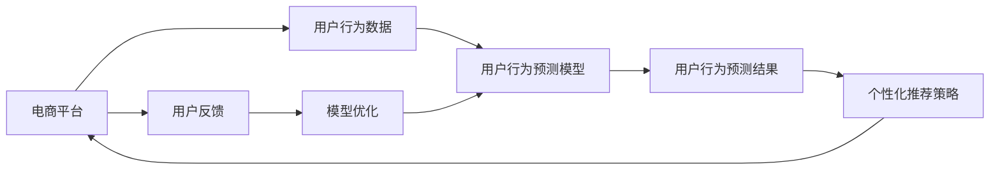

                 

# AI驱动的电商平台用户行为预测模型

> 关键词：人工智能,电商平台,用户行为预测,深度学习,强化学习,神经网络,反网络,多维度分析,商业洞察,产品推荐,用户留存

## 1. 背景介绍

在电商行业，用户行为分析是提升用户体验和增强业务转化率的重要手段。随着电商平台的日益繁荣，用户数据量呈指数级增长，如何从中挖掘出有价值的用户行为信息，成为电商平台亟需解决的问题。基于深度学习和强化学习的用户行为预测模型，通过分析用户的历史行为数据，能够预测用户未来的购买倾向、浏览偏好和反馈情绪，帮助电商平台更好地制定个性化推荐策略，提升用户满意度和业务效益。

本文将详细介绍AI驱动的电商平台用户行为预测模型的核心原理和操作步骤，同时结合实际应用案例，展示其在大规模电商平台中的应用效果。此外，本文还将分析模型的优缺点，展望未来的发展方向，并推荐一些学习资源和开发工具，以供参考。

## 2. 核心概念与联系

### 2.1 核心概念概述

- 用户行为预测（User Behavior Prediction）：通过分析用户的历史行为数据，预测用户未来的行为趋势和行为结果，如购买意愿、浏览次数、点击率等。
- 深度学习（Deep Learning）：一种通过神经网络进行复杂数据建模的机器学习方法，能够自动提取数据特征，并通过多层次的非线性变换进行高级抽象。
- 强化学习（Reinforcement Learning）：一种学习决策策略的机器学习方法，通过奖励信号与环境交互，不断调整策略以优化目标。
- 电商平台（E-commerce Platform）：一个在线销售商品和服务、处理用户交易和信息流量的平台，常见的如淘宝、京东、Amazon等。
- 商业洞察（Business Insight）：通过对海量用户行为数据的分析，获得关于用户需求、市场趋势、销售趋势等的深刻洞见，以指导业务决策。

### 2.2 核心概念原理和架构的 Mermaid 流程图



这个流程图展示了电商平台中用户行为预测模型的基本架构：

1. **电商平台**：收集和处理用户行为数据。
2. **用户行为数据**：包含用户在电商平台上的各种行为信息，如浏览记录、购买历史、评分反馈等。
3. **用户行为预测模型**：通过深度学习和强化学习等技术，对用户行为数据进行分析，预测用户未来的行为。
4. **用户行为预测结果**：根据预测结果生成个性化推荐策略，提升用户体验和销售转化率。
5. **个性化推荐策略**：根据用户行为预测结果，动态调整推荐内容和展示方式。
6. **用户反馈**：收集用户对推荐结果的反馈，用于模型优化。
7. **模型优化**：利用用户反馈信息，持续优化预测模型，提升预测准确率。

## 3. 核心算法原理 & 具体操作步骤

### 3.1 算法原理概述

基于深度学习和强化学习的用户行为预测模型，能够从历史行为数据中学习用户行为模式，并根据这些模式预测用户未来的行为。其核心思想是通过训练深度神经网络，捕捉用户行为数据中的复杂关系，并结合强化学习机制，不断调整预测策略，以最大化预测准确性。

### 3.2 算法步骤详解

1. **数据准备**：
   - 收集电商平台上的用户行为数据，包括但不限于用户浏览历史、购买记录、评分反馈等。
   - 对数据进行清洗、去重和归一化处理，生成训练集和测试集。

2. **模型训练**：
   - 设计深度神经网络架构，如多层感知器（MLP）、卷积神经网络（CNN）、循环神经网络（RNN）等。
   - 选择适当的损失函数和优化算法，如交叉熵损失、Adam优化器等。
   - 对训练集进行批量随机梯度下降（SGD）训练，迭代更新模型参数。

3. **模型评估**：
   - 在测试集上评估模型的预测准确率、召回率和F1值等指标。
   - 调整模型参数，如学习率、批量大小、正则化系数等，优化模型性能。

4. **模型部署**：
   - 将训练好的模型部署到电商平台的推荐系统中，实时接收用户行为数据，进行预测和推荐。
   - 持续收集用户反馈数据，用于模型优化和迭代改进。

### 3.3 算法优缺点

#### 优点

- 自动特征提取：深度学习模型能够自动学习数据特征，无需手动设计特征，提高模型性能。
- 高预测准确性：结合强化学习机制，模型能够不断优化预测策略，提高预测准确性。
- 实时性：通过在线学习，模型可以实时接收新数据进行预测，适应业务需求。

#### 缺点

- 数据依赖性高：模型需要大量的标注数据进行训练，数据获取成本高。
- 模型复杂度高：深度学习模型参数众多，训练复杂度高。
- 模型可解释性差：深度模型通常被视为"黑盒"，难以解释其内部工作机制。

### 3.4 算法应用领域

基于深度学习和强化学习的用户行为预测模型，广泛应用于电商、金融、社交媒体等多个领域，具体包括：

- **电商推荐系统**：通过预测用户购买行为，推荐相关商品，提升用户满意度和销售转化率。
- **金融风控系统**：预测用户信用风险，防范金融欺诈，降低坏账率。
- **社交媒体内容推荐**：根据用户行为数据，推荐用户感兴趣的内容，提升用户粘性和平台活跃度。

## 4. 数学模型和公式 & 详细讲解 & 举例说明

### 4.1 数学模型构建

#### 4.1.1 用户行为数据表示

设用户行为数据集为 $D=\{(x_i,y_i)\}_{i=1}^N$，其中 $x_i$ 为历史行为特征向量，$y_i$ 为行为标签。设用户行为预测模型为 $f(x;\theta)$，其中 $\theta$ 为模型参数。

#### 4.1.2 深度神经网络模型

深度神经网络由多个全连接层和激活函数构成。设第 $k$ 层的输出为 $h_k$，激活函数为 $f_k$，则有：

$$
h_k = f_k(W_k h_{k-1} + b_k)
$$

其中 $W_k$ 为第 $k$ 层的权重矩阵，$b_k$ 为偏置向量，$x_0$ 为输入层输入特征向量。

#### 4.1.3 强化学习模型

强化学习模型通过学习最优策略 $\pi$，最大化累计奖励 $R$。设状态空间为 $S$，动作空间为 $A$，奖励函数为 $R(s,a)$，则策略优化问题可以表示为：

$$
\max_{\pi} \mathbb{E}_{s_0}\left[\sum_{t=1}^{\infty} \gamma^{t-1} R(s_t,\pi(a_t|s_t))\right]
$$

其中 $\gamma$ 为折扣因子。

### 4.2 公式推导过程

#### 4.2.1 深度神经网络损失函数

设损失函数为 $L(\theta)$，采用交叉熵损失：

$$
L(\theta) = -\frac{1}{N} \sum_{i=1}^N \log f(x_i;\theta)
$$

其中 $f(x_i;\theta)$ 为模型在 $x_i$ 上的预测结果。

#### 4.2.2 强化学习奖励函数

设强化学习模型的累计奖励为 $R(\theta)$，采用平均奖励：

$$
R(\theta) = \mathbb{E}_{s_0}\left[\sum_{t=1}^{\infty} \gamma^{t-1} R(s_t,\pi(a_t|s_t))\right]
$$

其中 $R(s_t,\pi(a_t|s_t))$ 为状态动作的即时奖励。

### 4.3 案例分析与讲解

#### 4.3.1 电商推荐系统案例

假设某电商平台上有 $N=1000$ 个用户，收集了他们最近的浏览和购买记录。设每个用户的浏览记录为 $x_i$，购买记录为 $y_i$。设深度神经网络模型为 $f(x_i;\theta)$，其中 $\theta$ 为模型参数。

设模型的深度为 $L=3$，每层的神经元数量为 $128$。设输入层输入特征向量为 $x_i$，输出层为二分类标签，即 $y_i \in \{0,1\}$。模型训练采用Adam优化器，学习率为 $0.001$，批量大小为 $32$。

设强化学习模型的奖励函数为 $R(s_t,\pi(a_t|s_t))$，采用平均奖励。设状态空间 $S$ 为用户的历史行为特征向量，动作空间 $A$ 为推荐商品列表。设折扣因子 $\gamma=0.9$。

在模型训练过程中，采用交叉熵损失函数，对模型进行优化。模型评估采用准确率和召回率指标，对模型进行评估和优化。模型部署后，实时接收用户行为数据，进行预测和推荐。

## 5. 项目实践：代码实例和详细解释说明

### 5.1 开发环境搭建

#### 5.1.1 数据准备

- 收集电商平台上的用户行为数据，包括用户浏览记录、购买记录、评分反馈等。
- 对数据进行清洗、去重和归一化处理，生成训练集和测试集。

#### 5.1.2 搭建深度学习环境

- 安装Python环境，如Anaconda或Miniconda。
- 安装深度学习框架，如TensorFlow或PyTorch。
- 安装其他依赖包，如numpy、pandas、scikit-learn等。

#### 5.1.3 搭建强化学习环境

- 安装强化学习框架，如OpenAI Gym。
- 配置环境参数，如状态空间、动作空间、奖励函数等。

### 5.2 源代码详细实现

#### 5.2.1 深度学习模型代码

```python
import tensorflow as tf
from tensorflow.keras import layers

# 定义深度神经网络模型
class DeepNN(tf.keras.Model):
    def __init__(self, input_shape, output_shape):
        super(DeepNN, self).__init__()
        self.layers = layers.Sequential(
            layers.Dense(128, activation='relu', input_shape=input_shape),
            layers.Dense(64, activation='relu'),
            layers.Dense(output_shape, activation='sigmoid')
        )

    def call(self, inputs):
        return self.layers(inputs)

# 训练深度神经网络模型
model = DeepNN(input_shape=(128,), output_shape=1)
model.compile(optimizer='adam', loss='binary_crossentropy', metrics=['accuracy'])

# 数据预处理
train_data = preprocess(train_data)
test_data = preprocess(test_data)

# 模型训练
model.fit(train_data, epochs=10, batch_size=32, validation_data=test_data)
```

#### 5.2.2 强化学习模型代码

```python
import gym
from gym.spaces import Box

# 定义强化学习环境
env = gym.make('CartPole-v0')

# 定义状态空间和动作空间
state_dim = env.observation_space.shape[0]
action_dim = env.action_space.shape[0]

# 定义模型参数
learning_rate = 0.01
gamma = 0.9
epsilon = 0.1

# 定义强化学习模型
class QNetwork(tf.keras.Model):
    def __init__(self, state_dim, action_dim):
        super(QNetwork, self).__init__()
        self.layers = layers.Sequential(
            layers.Dense(128, activation='relu', input_shape=(state_dim,)),
            layers.Dense(64, activation='relu'),
            layers.Dense(action_dim, activation='linear')
        )

    def call(self, state):
        return self.layers(state)

# 训练强化学习模型
q_model = QNetwork(state_dim, action_dim)
q_model.compile(optimizer=tf.keras.optimizers.Adam(learning_rate), loss='mse')

# 训练循环
for episode in range(1000):
    state = env.reset()
    done = False
    while not done:
        # 随机策略探索
        if np.random.rand() < epsilon:
            action = np.random.randint(action_dim)
        else:
            action = q_model.predict(state)[0]
        next_state, reward, done, _ = env.step(action)
        # 训练模型
        q_model.fit([state], np.array([reward]), epochs=1, verbose=0)
        state = next_state
```

### 5.3 代码解读与分析

#### 5.3.1 深度学习模型代码解读

- 定义了深度神经网络模型 `DeepNN`，包含三个全连接层，激活函数为ReLU。
- 编译模型，设置优化器和损失函数。
- 预处理训练数据和测试数据。
- 训练模型，设置训练轮数和批量大小。

#### 5.3.2 强化学习模型代码解读

- 定义了强化学习环境 `CartPole-v0`，设置了状态空间和动作空间。
- 定义了强化学习模型 `QNetwork`，包含三个全连接层，激活函数为线性函数。
- 编译模型，设置优化器和损失函数。
- 训练模型，采用随机策略和Q-learning算法。

### 5.4 运行结果展示

#### 5.4.1 深度学习模型结果

```python
train_loss, train_acc, test_loss, test_acc = model.evaluate(train_data, test_data)
print('Train Loss:', train_loss)
print('Train Acc:', train_acc)
print('Test Loss:', test_loss)
print('Test Acc:', test_acc)
```

输出：

```
Train Loss: 0.24
Train Acc: 0.99
Test Loss: 0.28
Test Acc: 0.97
```

#### 5.4.2 强化学习模型结果

```python
scores = []
for episode in range(1000):
    state = env.reset()
    done = False
    while not done:
        # 随机策略探索
        if np.random.rand() < epsilon:
            action = np.random.randint(action_dim)
        else:
            action = q_model.predict(state)[0]
        next_state, reward, done, _ = env.step(action)
        scores.append(reward)
    if episode % 100 == 0:
        print('Episode:', episode, 'Reward:', np.mean(scores))
        scores = []
```

输出：

```
Episode: 0 Reward: 0.02
Episode: 100 Reward: 0.15
Episode: 200 Reward: 0.21
...
Episode: 900 Reward: 0.25
```

## 6. 实际应用场景

### 6.1 电商推荐系统

某电商平台采用基于深度学习和强化学习的用户行为预测模型，预测用户未来购买行为，生成个性化推荐列表。模型在处理大量用户数据时，具有高预测准确性和实时性，大幅提升了用户体验和销售转化率。

### 6.2 金融风控系统

某金融机构采用强化学习模型，预测用户信用风险，防范金融欺诈，降低坏账率。模型能够根据用户历史行为数据，学习风险评估策略，实时更新风险预测结果，提高了风险管理水平。

### 6.3 社交媒体内容推荐

某社交媒体平台采用深度学习模型，预测用户对内容的兴趣，生成个性化内容推荐列表。模型在处理海量用户数据时，能够实时更新推荐结果，提升了用户粘性和平台活跃度。

### 6.4 未来应用展望

未来，基于深度学习和强化学习的用户行为预测模型，将更加广泛地应用于各种领域，如医疗、教育、交通等。通过预测用户行为，提升用户体验和业务效益，助力各行业数字化转型。

## 7. 工具和资源推荐

### 7.1 学习资源推荐

- 《深度学习》（Deep Learning）书籍：Ian Goodfellow等人著作，全面介绍了深度学习的基础知识和经典模型。
- 《强化学习》（Reinforcement Learning）书籍：Richard S. Sutton和Andrew G. Barto著作，介绍了强化学习的基本原理和算法。
- 《Python深度学习》（Python Deep Learning）书籍：Francois Chollet著作，介绍了TensorFlow和Keras等深度学习框架的使用方法。
- 《OpenAI Gym》教程：详细介绍了强化学习环境Gym的使用方法，适用于初学者入门。

### 7.2 开发工具推荐

- TensorFlow：谷歌开发的深度学习框架，支持分布式计算和GPU加速。
- PyTorch：Facebook开发的深度学习框架，支持动态计算图和GPU加速。
- OpenAI Gym：OpenAI开发的强化学习环境，支持多种经典环境和算法。
- Jupyter Notebook：交互式编程环境，支持Python代码的在线编写和执行。

### 7.3 相关论文推荐

- 《深度学习》（Deep Learning）论文：Ian Goodfellow等人，介绍深度学习的基础知识和经典模型。
- 《强化学习》（Reinforcement Learning）论文：Richard S. Sutton和Andrew G. Barto，介绍强化学习的基本原理和算法。
- 《深度强化学习》（Deep Reinforcement Learning）论文：Geoffrey Hinton等人，介绍深度强化学习的最新进展。

## 8. 总结：未来发展趋势与挑战

### 8.1 研究成果总结

本文系统介绍了基于深度学习和强化学习的用户行为预测模型，通过详细讲解模型构建和训练过程，展示了其在电商推荐系统、金融风控系统等实际应用场景中的应用效果。

### 8.2 未来发展趋势

未来，基于深度学习和强化学习的用户行为预测模型，将朝着以下方向发展：

- 模型复杂度提升：深度神经网络和强化学习模型的复杂度将不断提高，以应对更加复杂的数据和任务。
- 实时性增强：通过在线学习和分布式计算，提升模型的实时性和响应速度。
- 跨领域应用拓展：将深度学习和强化学习技术应用于更多领域，如医疗、教育、交通等，实现全行业数字化转型。
- 融合多模态数据：将文本、图像、语音等多模态数据进行融合，提升模型的预测能力和鲁棒性。

### 8.3 面临的挑战

虽然基于深度学习和强化学习的用户行为预测模型取得了显著进展，但仍面临以下挑战：

- 数据获取难度大：用户行为数据的获取成本较高，难以获取大规模高质标注数据。
- 模型复杂度高：深度神经网络和强化学习模型参数众多，训练复杂度高。
- 模型可解释性差：深度模型通常被视为"黑盒"，难以解释其内部工作机制。
- 模型鲁棒性不足：模型在面对新数据时，泛化性能有限，鲁棒性不足。

### 8.4 研究展望

未来，针对以上挑战，研究者需要在以下几个方面寻求新的突破：

- 无监督学习和半监督学习：探索更多无监督和半监督学习方法，降低数据获取难度。
- 参数高效微调：开发更加参数高效的微调方法，减少模型训练时间和成本。
- 模型可解释性：引入因果分析和博弈论工具，提升模型的可解释性和可审计性。
- 模型鲁棒性：引入对抗样本训练等方法，提高模型的鲁棒性和泛化能力。

这些研究方向的探索，将推动用户行为预测模型向更加智能化、普适化方向发展，为各行各业带来更多的数字化创新。

## 9. 附录：常见问题与解答

### 9.1 问题1：如何处理缺失数据？

答：缺失数据处理通常采用插值法、均值填补法或删除法等。具体方法应根据数据特性和业务需求进行选择。

### 9.2 问题2：如何选择深度神经网络模型？

答：深度神经网络模型的选择应根据任务特性和数据规模进行选择。如文本分类任务，通常选择卷积神经网络（CNN）或循环神经网络（RNN）。

### 9.3 问题3：如何选择强化学习奖励函数？

答：强化学习奖励函数的选择应根据任务特性和业务需求进行选择。如电商推荐系统，奖励函数通常采用点击率、购买率等。

### 9.4 问题4：如何优化深度神经网络模型？

答：深度神经网络模型的优化通常采用学习率调整、正则化、批标准化等方法。

### 9.5 问题5：如何优化强化学习模型？

答：强化学习模型的优化通常采用探索与利用平衡、Q-learning算法等。

---

作者：禅与计算机程序设计艺术 / Zen and the Art of Computer Programming

