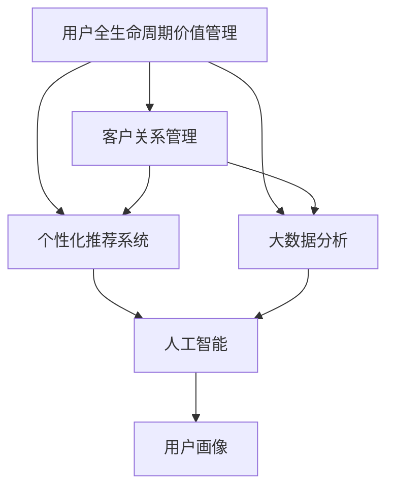

                 

# AI驱动的电商用户全生命周期价值管理

在电商行业，用户全生命周期价值管理（CLV）成为核心竞争力，帮助企业预测和提升用户长期价值，实现可持续增长。AI技术通过大数据分析和机器学习，可以精确预测用户行为，挖掘用户价值，从而实现全生命周期价值管理。本文将详细探讨AI驱动的电商用户全生命周期价值管理的理论基础和实践方法，帮助企业深度挖掘用户价值，提升经营效益。

## 1. 背景介绍

### 1.1 问题由来

随着电子商务的飞速发展，企业面临的竞争日益激烈。如何在海量的用户中精确识别高价值用户，并为这些用户提供个性化服务，是电商企业关注的焦点。用户全生命周期价值管理（CLV）成为解决这一问题的有效手段。通过AI技术，电商企业可以从海量用户行为数据中挖掘出用户的真实价值，并据此提供针对性的个性化服务，实现业务增长。

### 1.2 问题核心关键点

用户全生命周期价值管理（CLV）的核心在于精准预测用户行为和价值，实现用户留存和转化。其关键点包括：

1. 数据获取与处理：收集用户行为数据，并清洗、预处理，构建数据特征库。
2. 用户价值预测：利用AI模型，准确预测用户未来价值和行为。
3. 个性化服务策略：根据用户价值预测结果，制定个性化推荐、营销等策略。
4. 效果评估与优化：持续评估个性化策略的效果，并根据反馈不断优化。

## 2. 核心概念与联系

### 2.1 核心概念概述

为更好地理解AI驱动的电商用户全生命周期价值管理，本节将介绍几个密切相关的核心概念：

1. **用户全生命周期价值管理（CLV）**：指企业通过数据分析和机器学习，预测并管理用户在其生命周期内的总价值，实现用户留存和转化。

2. **客户关系管理（CRM）**：利用各种数据和工具，帮助企业管理和优化客户关系，提升客户满意度与忠诚度。

3. **个性化推荐系统**：通过机器学习算法，分析用户行为数据，推荐个性化的产品或服务，提升用户体验和转化率。

4. **大数据分析**：利用大数据技术，从海量数据中提取有价值的信息，帮助企业进行决策支持。

5. **人工智能（AI）**：涵盖机器学习、深度学习、自然语言处理等技术，用于解决复杂的业务问题，提升业务效率和效果。

6. **用户画像**：通过分析用户数据，构建详细的用户画像，了解用户的特征、偏好和行为，从而实现精准营销。

这些核心概念之间的逻辑关系可以通过以下Mermaid流程图来展示：



这个流程图展示了一系列相关的概念及其之间的关系：

1. 用户全生命周期价值管理（CLV）通过客户关系管理（CRM）、个性化推荐系统、大数据分析等手段，实现数据驱动的用户精准管理和价值提升。
2. 客户关系管理（CRM）、个性化推荐系统、大数据分析等工具和系统，利用人工智能（AI）技术进行优化和预测，提升用户满意度和转化率。
3. 用户画像通过分析用户数据，帮助企业构建详实、精准的用户画像，提升营销效果。

## 3. 核心算法原理 & 具体操作步骤

### 3.1 算法原理概述

AI驱动的电商用户全生命周期价值管理的核心算法基于机器学习和预测建模，其原理是通过历史用户数据和行为特征，预测用户未来的购买意愿和价值。主要步骤如下：

1. **数据预处理**：收集和清洗用户数据，构建特征向量，用于后续模型训练。
2. **用户行为建模**：利用机器学习算法，构建用户行为预测模型。
3. **用户价值预测**：通过预测模型，准确预测用户未来购买行为和价值，实现精准营销。
4. **个性化推荐**：根据用户价值预测结果，生成个性化推荐策略，提升用户转化率。
5. **效果评估与优化**：评估个性化推荐效果，并根据反馈不断优化推荐策略，提升用户留存率。

### 3.2 算法步骤详解

#### 3.2.1 数据预处理

数据预处理是构建用户全生命周期价值管理模型的第一步，主要包括以下几个步骤：

1. **数据收集**：收集用户的各类数据，包括购买历史、浏览行为、互动记录等。
2. **数据清洗**：去除缺失、异常、重复数据，确保数据质量和一致性。
3. **特征提取**：从清洗后的数据中提取特征向量，如购买频率、浏览时长、互动次数等。

#### 3.2.2 用户行为建模

用户行为建模的目的是构建用户行为预测模型，通常使用以下几种方法：

1. **协同过滤**：利用用户历史行为数据，推荐相似用户购买的产品，实现跨用户推荐。
2. **基于内容的推荐**：分析产品属性和用户偏好，推荐相关产品，实现内容驱动推荐。
3. **深度学习模型**：使用神经网络模型，分析用户行为数据，实现更加精准的推荐。

#### 3.2.3 用户价值预测

用户价值预测的目的是准确预测用户未来购买行为和价值，主要基于以下步骤：

1. **选择模型**：选择适合的预测模型，如决策树、随机森林、深度神经网络等。
2. **特征选择**：从特征库中选择相关特征，用于模型训练。
3. **模型训练**：使用历史数据训练预测模型，得到预测结果。

#### 3.2.4 个性化推荐

个性化推荐的核心是生成个性化的推荐策略，主要基于以下步骤：

1. **推荐引擎构建**：构建推荐引擎，将预测结果和用户特征输入到推荐系统中。
2. **推荐策略优化**：根据个性化推荐效果，不断优化推荐策略，提升推荐效果。

#### 3.2.5 效果评估与优化

效果评估与优化的目的是评估个性化推荐的效果，并根据反馈不断优化推荐策略，主要基于以下步骤：

1. **评估指标选择**：选择合适的评估指标，如转化率、用户留存率、平均订单价值等。
2. **效果评估**：根据评估指标，评估个性化推荐效果。
3. **优化策略**：根据评估结果，优化推荐策略，提升推荐效果。

### 3.3 算法优缺点

AI驱动的电商用户全生命周期价值管理的优点包括：

1. **精准预测**：利用AI技术，可以准确预测用户行为和价值，实现精准营销。
2. **个性化服务**：通过个性化推荐，提升用户满意度和转化率。
3. **效率提升**：自动化数据分析和模型训练，提升业务效率和效果。

缺点包括：

1. **数据质量要求高**：模型效果依赖于高质量的数据，数据收集和清洗成本较高。
2. **模型复杂度较高**：深度学习模型等复杂模型需要较多的计算资源和数据量。
3. **模型解释性不足**：AI模型的黑盒特性，难以解释其内部工作机制和决策逻辑。

### 3.4 算法应用领域

AI驱动的电商用户全生命周期价值管理方法已经在多个领域得到广泛应用，包括但不限于以下领域：

1. **电商营销**：通过用户价值预测和个性化推荐，提升用户购买转化率。
2. **客户服务**：利用用户画像和AI技术，提供个性化客服服务，提升用户体验。
3. **库存管理**：通过用户行为分析，优化库存管理策略，提升库存周转率。
4. **会员管理**：通过用户全生命周期价值管理，提升会员价值和忠诚度。
5. **风险管理**：通过用户行为预测，识别潜在风险用户，提前进行风险控制。

## 4. 数学模型和公式 & 详细讲解

### 4.1 数学模型构建

假设我们有一组用户数据集 $\mathcal{D} = \{(x_i, y_i)\}_{i=1}^N$，其中 $x_i$ 为特征向量，$y_i$ 为用户价值标签。我们的目标是通过历史数据训练模型，预测新用户 $x_{new}$ 的用户价值 $y_{new}$。

### 4.2 公式推导过程

我们采用随机森林（Random Forest）作为用户价值预测的模型。随机森林是一种集成学习算法，通过多棵决策树的集成，实现更加精准的预测。随机森林模型的损失函数为：

$$
\mathcal{L} = \frac{1}{N} \sum_{i=1}^N \ell(y_i, \hat{y}_i)
$$

其中 $\ell(y_i, \hat{y}_i)$ 为预测误差，通常选择均方误差（MSE）。随机森林模型的预测公式为：

$$
\hat{y} = \frac{1}{M} \sum_{m=1}^M \hat{y}^{(m)}
$$

其中 $\hat{y}^{(m)}$ 为第 $m$ 棵决策树的预测结果，$M$ 为决策树的总数。

### 4.3 案例分析与讲解

以用户购买行为预测为例，我们收集用户的历史购买数据，构建特征向量 $x = (x_1, x_2, \ldots, x_n)$，其中 $x_i$ 表示用户第 $i$ 次购买的特征，如购买时间、购买金额、购买频率等。我们的目标是通过历史数据训练模型，预测用户未来的购买行为。

假设我们使用了随机森林模型，构建了特征库，并对数据进行了预处理。我们采用交叉验证的方法，将数据集分为训练集和验证集，训练随机森林模型。假设模型训练得到预测结果 $\hat{y}$，我们将其与真实标签 $y$ 进行比较，得到预测误差 $\ell$，并使用均方误差（MSE）作为损失函数。最终，我们得到用户价值预测结果 $\hat{y}$，用于生成个性化推荐策略。

## 5. 项目实践：代码实例和详细解释说明

### 5.1 开发环境搭建

在进行用户全生命周期价值管理项目的开发时，需要准备好开发环境。以下是使用Python进行开发的环境配置流程：

1. 安装Anaconda：从官网下载并安装Anaconda，用于创建独立的Python环境。
2. 创建并激活虚拟环境：
```bash
conda create -n pytorch-env python=3.8 
conda activate pytorch-env
```
3. 安装PyTorch：根据CUDA版本，从官网获取对应的安装命令。例如：
```bash
conda install pytorch torchvision torchaudio cudatoolkit=11.1 -c pytorch -c conda-forge
```
4. 安装相关库：
```bash
pip install pandas numpy scikit-learn matplotlib joblib
```

完成上述步骤后，即可在`pytorch-env`环境中开始项目开发。

### 5.2 源代码详细实现

以下是使用Python和PyTorch实现用户全生命周期价值管理的代码实现：

```python
import pandas as pd
import numpy as np
import torch
from torch.utils.data import DataLoader
from sklearn.model_selection import train_test_split
from sklearn.ensemble import RandomForestRegressor
from sklearn.metrics import mean_squared_error

# 加载数据集
data = pd.read_csv('user_data.csv')

# 数据预处理
# ...

# 特征选择
# ...

# 构建训练集和验证集
X_train, X_valid, y_train, y_valid = train_test_split(X, y, test_size=0.2, random_state=42)

# 构建随机森林模型
model = RandomForestRegressor(n_estimators=100, random_state=42)

# 模型训练
model.fit(X_train, y_train)

# 模型预测
y_pred = model.predict(X_valid)

# 评估模型效果
mse = mean_squared_error(y_valid, y_pred)
print(f'Mean Squared Error: {mse}')

# 生成个性化推荐策略
# ...
```

### 5.3 代码解读与分析

让我们再详细解读一下关键代码的实现细节：

1. 数据预处理：
```python
# 数据预处理
# ...
```
2. 特征选择：
```python
# 特征选择
# ...
```
3. 模型训练：
```python
# 构建训练集和验证集
X_train, X_valid, y_train, y_valid = train_test_split(X, y, test_size=0.2, random_state=42)

# 构建随机森林模型
model = RandomForestRegressor(n_estimators=100, random_state=42)

# 模型训练
model.fit(X_train, y_train)
```
4. 模型预测：
```python
# 模型预测
y_pred = model.predict(X_valid)
```
5. 模型评估：
```python
# 评估模型效果
mse = mean_squared_error(y_valid, y_pred)
print(f'Mean Squared Error: {mse}')
```
6. 生成个性化推荐策略：
```python
# 生成个性化推荐策略
# ...
```

可以看到，使用PyTorch和sklearn，我们可以轻松地实现用户全生命周期价值管理的模型构建、训练和评估。

## 6. 实际应用场景

### 6.1 智能推荐系统

智能推荐系统是AI驱动的电商用户全生命周期价值管理的重要应用场景。通过用户全生命周期价值管理，可以精准预测用户行为，提供个性化的推荐服务，提升用户满意度和转化率。

具体实现时，可以采用协同过滤、基于内容的推荐、深度学习模型等技术，构建推荐引擎，生成个性化推荐结果。同时，通过效果评估和优化，不断提升推荐效果，实现业务的持续增长。

### 6.2 客户流失预警

客户流失预警是电商用户全生命周期价值管理的另一重要应用场景。通过分析用户行为数据，构建用户画像，识别潜在流失用户，及时采取措施，实现客户挽留。

具体实现时，可以构建用户流失预测模型，识别出流失风险高的用户，并根据其特征进行个性化干预，如重新营销、提供优惠券等，提升客户留存率。

### 6.3 个性化营销活动

个性化营销活动是电商用户全生命周期价值管理的重要手段。通过用户全生命周期价值管理，可以精准预测用户行为，设计个性化的营销活动，提升用户参与度和转化率。

具体实现时，可以采用A/B测试、用户分群等技术，设计个性化的营销活动，并根据效果评估和优化，提升营销效果。

### 6.4 未来应用展望

随着AI技术的不断发展，AI驱动的电商用户全生命周期价值管理将迎来更多创新应用，以下是未来可能的应用方向：

1. **多模态融合**：将图像、语音、文本等多种模态的数据融合，提升对用户的全面理解，提供更加精准的推荐和营销。
2. **实时预测与动态调整**：利用流式数据和实时计算，实现用户行为的实时预测与动态调整，提升用户体验和转化率。
3. **个性化内容生成**：通过自然语言生成技术，生成个性化的内容，提升用户参与度和满意度。
4. **跨领域应用**：将用户全生命周期价值管理技术应用到金融、医疗等多个领域，实现跨领域的应用和扩展。
5. **AI辅助决策**：利用AI技术，辅助企业进行业务决策，提升决策效率和效果。

## 7. 工具和资源推荐

### 7.1 学习资源推荐

为了帮助开发者系统掌握AI驱动的电商用户全生命周期价值管理的理论基础和实践技巧，这里推荐一些优质的学习资源：

1. 《Python深度学习》系列书籍：介绍深度学习、机器学习等技术，适合初学者入门。
2. 《机器学习实战》书籍：涵盖机器学习算法、模型评估等基础知识，适合实战练习。
3. 《TensorFlow实战》书籍：介绍TensorFlow框架的使用，适合深度学习项目开发。
4. Coursera《机器学习》课程：由斯坦福大学开设的机器学习课程，涵盖机器学习的基本概念和算法。
5. 《数据科学与机器学习实战》在线课程：包含数据科学和机器学习的实战项目，适合动手练习。

通过对这些资源的学习实践，相信你一定能够快速掌握AI驱动的电商用户全生命周期价值管理的精髓，并用于解决实际的电商业务问题。

### 7.2 开发工具推荐

高效的开发离不开优秀的工具支持。以下是几款用于AI驱动的电商用户全生命周期价值管理开发的常用工具：

1. PyTorch：基于Python的开源深度学习框架，灵活动态的计算图，适合快速迭代研究。
2. TensorFlow：由Google主导开发的开源深度学习框架，生产部署方便，适合大规模工程应用。
3. Scikit-learn：Python的机器学习库，包含多种机器学习算法和模型评估工具。
4. Jupyter Notebook：交互式笔记本，方便进行数据探索和模型验证。
5. Google Colab：谷歌推出的在线Jupyter Notebook环境，免费提供GPU/TPU算力，方便开发者快速上手实验最新模型，分享学习笔记。

合理利用这些工具，可以显著提升AI驱动的电商用户全生命周期价值管理任务的开发效率，加快创新迭代的步伐。

### 7.3 相关论文推荐

AI驱动的电商用户全生命周期价值管理的发展源于学界的持续研究。以下是几篇奠基性的相关论文，推荐阅读：

1. "The Elements of Statistical Learning"：Hastie等人所著，介绍统计学习和机器学习的基本概念和算法。
2. "Random Forests for Large-Scale Classification"：Han等人所著，介绍随机森林在分类任务中的应用。
3. "Deep Learning for Recommender Systems"：Bengio等人所著，介绍深度学习在推荐系统中的应用。
4. "Customer Churn Prediction Using Machine Learning"：Ghazal等人所著，介绍客户流失预测的机器学习方法。
5. "Multi-Armed Bandit Algorithms for Recommender Systems"：Garín-Gómez等人所著，介绍多臂土匪算法在推荐系统中的应用。

这些论文代表了大模型微调技术的发展脉络。通过学习这些前沿成果，可以帮助研究者把握学科前进方向，激发更多的创新灵感。

## 8. 总结：未来发展趋势与挑战

### 8.1 总结

本文对AI驱动的电商用户全生命周期价值管理的理论基础和实践方法进行了全面系统的介绍。首先阐述了用户全生命周期价值管理在电商行业的重要性和核心关键点，明确了AI技术在数据驱动的用户精准管理和价值提升方面的独特价值。其次，从原理到实践，详细讲解了用户全生命周期价值管理的数学模型和算法步骤，给出了AI驱动的电商用户全生命周期价值管理的完整代码实例。同时，本文还广泛探讨了AI驱动的电商用户全生命周期价值管理在多个行业领域的应用前景，展示了AI技术在用户管理上的巨大潜力。

通过本文的系统梳理，可以看到，AI驱动的电商用户全生命周期价值管理已经成为电商行业的重要范式，极大地拓展了数据驱动的用户管理能力，催生了更多的落地场景。受益于大数据和机器学习技术的不断进步，AI驱动的电商用户全生命周期价值管理必将在更多行业领域大放异彩，深刻影响企业的运营和增长。

### 8.2 未来发展趋势

展望未来，AI驱动的电商用户全生命周期价值管理将呈现以下几个发展趋势：

1. **多模态融合**：将图像、语音、文本等多种模态的数据融合，提升对用户的全面理解，提供更加精准的推荐和营销。
2. **实时预测与动态调整**：利用流式数据和实时计算，实现用户行为的实时预测与动态调整，提升用户体验和转化率。
3. **个性化内容生成**：通过自然语言生成技术，生成个性化的内容，提升用户参与度和满意度。
4. **跨领域应用**：将用户全生命周期价值管理技术应用到金融、医疗等多个领域，实现跨领域的应用和扩展。
5. **AI辅助决策**：利用AI技术，辅助企业进行业务决策，提升决策效率和效果。

以上趋势凸显了AI驱动的电商用户全生命周期价值管理的广阔前景。这些方向的探索发展，必将进一步提升电商系统的性能和应用范围，为电商业务带来新的增长点。

### 8.3 面临的挑战

尽管AI驱动的电商用户全生命周期价值管理已经取得了瞩目成就，但在迈向更加智能化、普适化应用的过程中，它仍面临着诸多挑战：

1. **数据质量要求高**：模型效果依赖于高质量的数据，数据收集和清洗成本较高。
2. **模型复杂度较高**：深度学习模型等复杂模型需要较多的计算资源和数据量。
3. **模型解释性不足**：AI模型的黑盒特性，难以解释其内部工作机制和决策逻辑。
4. **业务复杂性**：电商业务涉及多个环节，数据和业务逻辑复杂，需要多方协同。
5. **技术壁垒高**：AI驱动的电商用户全生命周期价值管理技术门槛较高，需要具备相关技术和经验。

### 8.4 研究展望

面对AI驱动的电商用户全生命周期价值管理所面临的挑战，未来的研究需要在以下几个方面寻求新的突破：

1. **高效数据获取与处理**：提升数据收集和清洗的效率，降低成本，提高数据质量。
2. **模型简化与优化**：降低模型复杂度，提升模型效率和解释性。
3. **跨领域应用与扩展**：将AI驱动的电商用户全生命周期价值管理技术扩展到更多行业领域，提升其普适性和可扩展性。
4. **人机协同**：结合人工干预和智能决策，提升电商系统的智能化水平。
5. **隐私与安全**：在保护用户隐私的前提下，提升AI驱动的电商用户全生命周期价值管理的安全性和可靠性。

这些研究方向的探索，必将引领AI驱动的电商用户全生命周期价值管理技术迈向更高的台阶，为电商业务带来新的增长点。面向未来，AI驱动的电商用户全生命周期价值管理还需要与其他AI技术进行更深入的融合，如知识表示、因果推理、强化学习等，多路径协同发力，共同推动电商业务的持续发展。

## 9. 附录：常见问题与解答

**Q1：AI驱动的电商用户全生命周期价值管理是否适用于所有电商业务？**

A: AI驱动的电商用户全生命周期价值管理适用于绝大多数电商业务，尤其是在用户行为数据丰富、用户规模较大的场景下，效果更加显著。但对于一些特殊领域，如C2C（个人对个人）电商等，需要根据实际情况进行调整和优化。

**Q2：如何进行用户画像的构建与更新？**

A: 用户画像的构建与更新主要基于用户历史行为数据和实时数据，通过聚类、分类等机器学习技术，提取用户特征和行为模式。具体步骤如下：
1. 收集用户历史数据，构建特征向量。
2. 选择合适的聚类算法，对用户进行分类。
3. 根据分类结果，生成用户画像。
4. 定期更新用户画像，反映最新的用户行为。

**Q3：如何在电商营销活动中实现个性化推荐？**

A: 在电商营销活动中实现个性化推荐，主要基于以下步骤：
1. 收集用户历史行为数据，构建特征向量。
2. 选择合适的推荐算法，如协同过滤、基于内容的推荐、深度学习模型等。
3. 根据用户特征和行为，生成个性化推荐结果。
4. 评估推荐效果，并根据反馈不断优化推荐策略。

**Q4：如何进行客户流失预警？**

A: 进行客户流失预警，主要基于以下步骤：
1. 收集用户历史行为数据，构建特征向量。
2. 选择合适的流失预测模型，如逻辑回归、决策树、随机森林等。
3. 根据模型预测结果，识别流失风险高的用户。
4. 根据用户特征，进行个性化干预，提升用户留存率。

**Q5：如何进行效果评估与优化？**

A: 进行效果评估与优化，主要基于以下步骤：
1. 选择合适的评估指标，如转化率、用户留存率、平均订单价值等。
2. 评估推荐策略的效果，计算评估指标。
3. 根据评估结果，优化推荐策略，提升推荐效果。

**Q6：如何应对数据质量问题？**

A: 应对数据质量问题，主要从以下几个方面入手：
1. 数据清洗：去除缺失、异常、重复数据，确保数据质量和一致性。
2. 数据增强：利用数据增强技术，丰富训练集。
3. 数据标注：对标注数据进行验证和校正，确保数据质量。

**Q7：如何提升模型效率？**

A: 提升模型效率，主要通过以下方法：
1. 模型简化：降低模型复杂度，提升模型效率。
2. 数据压缩：使用数据压缩技术，减小数据量。
3. 分布式计算：利用分布式计算技术，提升计算效率。

通过以上常见问题的解答，希望能更好地理解AI驱动的电商用户全生命周期价值管理的理论基础和实践方法，助力企业实现业务增长。

---

作者：禅与计算机程序设计艺术 / Zen and the Art of Computer Programming

