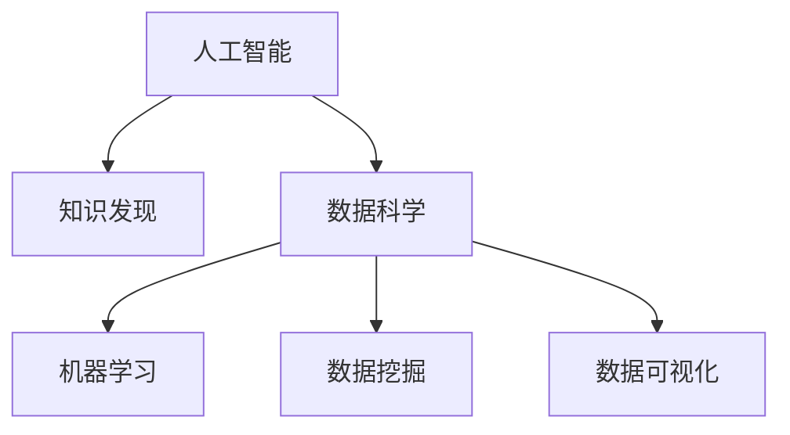

                 

# AI驱动的知识发现：程序员的新机遇

> 关键词：人工智能(AI),知识发现(Knowledge Discovery),数据科学(Data Science),机器学习(Machine Learning),数据挖掘(Data Mining),数据可视化(Data Visualization)

## 1. 背景介绍

### 1.1 问题由来
在过去几十年里，计算机科学和数据技术的迅猛发展极大地推动了人类对数据和知识的理解和应用。然而，随着数据量的激增和数据类型的多样化，传统的知识发现方法已经无法满足现代复杂数据的处理需求。

### 1.2 问题核心关键点
面对海量的数据和复杂的多源异构信息，如何从中挖掘出有价值的知识和信息，成为当前数据科学领域的一个重要研究课题。为了解决这个问题，人工智能（AI）技术，尤其是机器学习（ML）和数据挖掘（DM）技术，正在成为知识发现（KD）的重要工具。

## 2. 核心概念与联系

### 2.1 核心概念概述

为了更好地理解AI在知识发现中的应用，本节将介绍几个密切相关的核心概念：

- **人工智能(AI)**：利用计算机模拟人类智能，实现学习、推理、感知和决策等能力的技术领域。
- **知识发现(KD)**：从海量数据中自动或半自动地挖掘出有用的模式、规律和知识的过程。
- **数据科学(Data Science)**：运用统计学、机器学习、数据挖掘等方法，从数据中提取知识和洞察力的学科。
- **机器学习(ML)**：利用算法和统计模型，让计算机自动从数据中学习规律，并进行预测或决策。
- **数据挖掘(DM)**：从数据集中发现有趣的、未知的、潜在的模式的过程。
- **数据可视化(Data Visualization)**：利用图形或动画来直观展示数据。

这些核心概念之间的逻辑关系可以通过以下Mermaid流程图来展示：



这个流程图展示出人工智能、数据科学、机器学习和数据挖掘之间的关系：

1. **人工智能**提供了算法和模型来分析数据，实现知识的自动发现。
2. **数据科学**运用统计学和计算技术，提取和分析数据。
3. **机器学习**和**数据挖掘**则是数据科学中两个核心技术，用于从数据中提取和分析模式，并通过算法自动发现知识。
4. **数据可视化**则是呈现这些知识的一种方式，便于理解和分析。

这些核心概念共同构成了现代知识发现的技术框架，使得AI技术在知识发现中发挥出巨大的作用。

## 3. 核心算法原理 & 具体操作步骤

### 3.1 算法原理概述

AI驱动的知识发现通常依赖于以下核心原理：

- **数据预处理**：对原始数据进行清洗、归一化和转换，以确保数据质量和一致性。
- **特征工程**：从原始数据中提取有意义的特征，用于模型训练。
- **模型训练**：运用机器学习算法，如决策树、随机森林、神经网络等，对特征进行建模和训练。
- **模型评估与调优**：通过交叉验证、网格搜索等方法，评估模型性能并调整超参数。
- **结果解读**：将模型输出转化为可理解的洞察，如关联规则、分类树、神经网络等。
- **可视化展示**：使用图表、图形等手段，将知识发现结果直观展示给用户。

### 3.2 算法步骤详解

基于AI的知识发现算法通常包括以下几个关键步骤：

**Step 1: 数据收集与预处理**
- 收集相关数据，包括结构化和非结构化数据。
- 对数据进行清洗、转换和归一化，去除噪音和异常值。
- 对缺失值进行填充或删除，确保数据完整性。

**Step 2: 特征提取与选择**
- 从原始数据中提取特征，如数值型特征、分类特征、时间序列特征等。
- 选择重要的特征，去除冗余和无关的特征。
- 运用特征工程技术，将原始数据转化为更适合模型的格式。

**Step 3: 模型选择与训练**
- 根据数据类型和任务目标，选择适当的机器学习模型。
- 使用训练集数据训练模型，并调整超参数优化模型性能。
- 使用验证集数据评估模型泛化能力和性能。

**Step 4: 模型评估与调优**
- 在测试集数据上验证模型性能，计算准确率、召回率、F1分数等指标。
- 通过网格搜索、随机搜索等方法调整超参数，优化模型性能。
- 使用交叉验证等技术，评估模型的稳定性和泛化能力。

**Step 5: 结果展示与解读**
- 将模型输出转化为可视化图形、图表或报告，展示发现的知识和模式。
- 对模型结果进行解读，提炼出有价值的洞察和结论。
- 对发现的知识进行验证和确认，确保其真实性和可靠性。

### 3.3 算法优缺点

AI驱动的知识发现算法具有以下优点：
1. 自动化程度高。通过自动化的数据分析和建模过程，大幅降低了人工干预。
2. 可处理海量数据。能够处理大规模、多源异构数据，发现复杂模式。
3. 数据驱动。依赖于数据质量，能够发现数据中的潜在规律和关联。
4. 可扩展性强。可以应用于不同领域和不同规模的数据集。

同时，该方法也存在一定的局限性：
1. 对数据质量要求高。数据质量和特征工程对模型性能有很大影响，需要仔细处理。
2. 模型解释性不足。许多机器学习算法如神经网络，其内部工作机制难以解释，缺乏透明性。
3. 泛化能力有限。模型可能会过拟合训练集，泛化性能可能较差。
4. 计算资源需求大。复杂的模型需要大量的计算资源和时间，对硬件要求较高。

尽管存在这些局限性，但AI驱动的知识发现方法已经成为现代数据科学和知识发现的重要工具，广泛应用于商业决策、金融分析、生物医学、社会科学等多个领域。

### 3.4 算法应用领域

基于AI的知识发现方法在众多领域中得到了广泛应用，以下是几个典型应用场景：

1. **商业智能(Business Intelligence, BI)**：利用AI技术对企业数据进行挖掘和分析，辅助决策。包括客户行为分析、市场预测、销售趋势分析等。
2. **金融分析(Financial Analysis)**：运用AI对金融数据进行分析和建模，识别风险和机会。包括信用评分、投资组合优化、股票预测等。
3. **生物医学(Biomedical Science)**：利用AI对生物数据进行挖掘，发现疾病模式和治疗方案。包括基因组分析、药物发现、个性化医疗等。
4. **社会科学(Social Science)**：使用AI分析社会数据，进行社会科学研究。包括社交网络分析、人口统计分析、犯罪分析等。
5. **营销(Marketing)**：利用AI分析消费者行为数据，进行精准营销。包括广告投放优化、客户细分、品牌影响力分析等。
6. **零售(Retail)**：通过AI挖掘消费者购买行为，优化库存管理和供应链。包括商品推荐、价格优化、库存预测等。

## 4. 数学模型和公式 & 详细讲解 & 举例说明

### 4.1 数学模型构建

本节将使用数学语言对AI驱动的知识发现过程进行更加严格的刻画。

记数据集为 $D=\{(x_i,y_i)\}_{i=1}^N$，其中 $x_i$ 为输入特征， $y_i$ 为输出标签。假设我们利用机器学习模型 $M$ 对数据进行建模，模型输出为 $M(x_i)$。知识发现的目的是找到最优的模型参数 $\theta$，使得模型在数据集上的平均损失函数最小化。

定义损失函数为：

$$
\mathcal{L}(M,\theta) = \frac{1}{N}\sum_{i=1}^N \ell(M(x_i),y_i)
$$

其中 $\ell$ 为损失函数，如均方误差损失、交叉熵损失等。

知识发现的数学模型为：

$$
\theta^* = \mathop{\arg\min}_{\theta} \mathcal{L}(M,\theta)
$$

### 4.2 公式推导过程

以线性回归模型为例，推导最小二乘法求解的过程。

假设模型 $M$ 为线性回归模型，即：

$$
M(x_i) = \theta_0 + \theta_1 x_{i1} + \theta_2 x_{i2} + \cdots + \theta_p x_{ip}
$$

其中 $\theta_0,\theta_1,\cdots,\theta_p$ 为模型参数，$x_{i1},x_{i2},\cdots,x_{ip}$ 为输入特征。

我们采用最小二乘法来求解最优参数 $\theta$。

损失函数为：

$$
\mathcal{L}(M,\theta) = \frac{1}{2N} \sum_{i=1}^N (M(x_i) - y_i)^2
$$

对该损失函数求导，并令导数等于零，求解得：

$$
\theta_j = \frac{\sum_{i=1}^N (x_{ij} - \bar{x}_j)(y_i - \bar{y})}{\sum_{i=1}^N (x_{ij} - \bar{x}_j)^2}, \quad j=0,1,\cdots,p
$$

其中 $\bar{x}_j = \frac{1}{N} \sum_{i=1}^N x_{ij}$ 和 $\bar{y} = \frac{1}{N} \sum_{i=1}^N y_i$。

通过解方程，可以得到线性回归模型中各参数的值，从而构建出最优模型。

### 4.3 案例分析与讲解

我们以预测房价为例，说明知识发现的过程。

假设我们有一个包含房屋特征和房价的数据集 $D=\{(x_i,y_i)\}_{i=1}^N$，其中 $x_i$ 包含房屋面积、房间数、地理位置等特征， $y_i$ 为房价。我们的目标是构建一个能够预测房价的模型。

1. **数据收集与预处理**：
   - 收集历史房屋交易数据，包括房屋特征和房价。
   - 清洗数据，去除缺失值和异常值。
   - 将房价数据进行归一化处理。

2. **特征提取与选择**：
   - 提取房屋特征 $x_i$ 中的数值型特征，如面积、房间数等。
   - 选择合适的特征，去除无关特征，如房屋朝向等。
   - 将原始数据转化为数值型特征。

3. **模型选择与训练**：
   - 选择线性回归模型作为预测房价的模型。
   - 使用训练集数据 $D_{train}$ 训练模型，调整超参数优化性能。
   - 使用交叉验证评估模型性能。

4. **模型评估与调优**：
   - 在测试集数据 $D_{test}$ 上验证模型性能，计算平均误差。
   - 使用网格搜索等方法调整超参数，优化模型性能。
   - 使用交叉验证评估模型泛化能力和稳定性。

5. **结果展示与解读**：
   - 将模型输出转化为可视化图表，展示房价与房屋特征之间的关系。
   - 对模型结果进行解读，提炼出有价值的洞察，如房价受面积和房间数的影响较大。
   - 对模型结果进行验证，确保其真实性和可靠性。

## 5. 项目实践：代码实例和详细解释说明

### 5.1 开发环境搭建

在进行知识发现项目开发前，我们需要准备好开发环境。以下是使用Python进行Scikit-learn开发的环境配置流程：

1. 安装Anaconda：从官网下载并安装Anaconda，用于创建独立的Python环境。

2. 创建并激活虚拟环境：
```bash
conda create -n sklearn-env python=3.8 
conda activate sklearn-env
```

3. 安装Scikit-learn：
```bash
conda install scikit-learn
```

4. 安装各类工具包：
```bash
pip install numpy pandas matplotlib seaborn
```

完成上述步骤后，即可在`sklearn-env`环境中开始知识发现项目开发。

### 5.2 源代码详细实现

下面我们以房价预测为例，给出使用Scikit-learn对线性回归模型进行知识发现的PyTorch代码实现。

首先，定义数据处理函数：

```python
import numpy as np
import pandas as pd

def load_data(path):
    df = pd.read_csv(path)
    x = df.drop('price', axis=1)
    y = df['price']
    return x, y
```

然后，定义模型和优化器：

```python
from sklearn.linear_model import LinearRegression

model = LinearRegression()
```

接着，定义训练和评估函数：

```python
from sklearn.metrics import mean_squared_error
from sklearn.model_selection import train_test_split
from sklearn.model_selection import cross_val_score

def train_epoch(model, x, y, batch_size=32):
    x_train, x_val, y_train, y_val = train_test_split(x, y, test_size=0.2)
    model.fit(x_train, y_train)
    val_pred = model.predict(x_val)
    val_loss = mean_squared_error(y_val, val_pred)
    return val_loss

def evaluate(model, x, y):
    x_train, x_test, y_train, y_test = train_test_split(x, y, test_size=0.2)
    model.fit(x_train, y_train)
    test_pred = model.predict(x_test)
    test_loss = mean_squared_error(y_test, test_pred)
    return test_loss
```

最后，启动训练流程并在测试集上评估：

```python
from sklearn.model_selection import GridSearchCV

x, y = load_data('housing.csv')
param_grid = {'C': np.logspace(-4, 4, 20)}
grid_search = GridSearchCV(model, param_grid, cv=5, scoring='neg_mean_squared_error')
grid_search.fit(x, y)
best_model = grid_search.best_estimator_
best_loss = grid_search.best_score_

print(f"Best loss: {best_loss:.4f}")
print(f"Best parameters: {grid_search.best_params_}")
```

以上就是使用Scikit-learn对线性回归模型进行知识发现的完整代码实现。可以看到，通过Scikit-learn，我们可以快速搭建和训练线性回归模型，进行房价预测。

### 5.3 代码解读与分析

让我们再详细解读一下关键代码的实现细节：

**load_data函数**：
- 读取数据集，将其分为特征和标签。
- 使用Pandas库对数据进行处理，去除无关特征。

**train_epoch函数**：
- 对数据集进行切分，分为训练集和验证集。
- 在训练集上训练模型，计算验证集上的预测值和损失值。
- 返回验证集上的损失值。

**evaluate函数**：
- 对数据集进行切分，分为训练集和测试集。
- 在训练集上训练模型，计算测试集上的预测值和损失值。
- 返回测试集上的损失值。

**GridSearchCV**：
- 使用交叉验证和网格搜索优化模型参数，寻找最优参数组合。
- 返回最优模型和最佳损失值。

**train_epoch函数**：
- 使用交叉验证评估模型性能，计算平均损失值。

通过这些代码，我们可以对数据进行预处理、模型训练和评估，得到房价预测的模型，并验证其性能。

## 6. 实际应用场景

### 6.1 商业智能(BI)

商业智能(BI)是现代企业管理的重要手段，通过分析企业数据，发现隐藏在数据中的商业机会和风险。AI驱动的知识发现技术在BI中得到了广泛应用。

例如，一家电商公司可以通过用户行为数据，发现用户的购物偏好和购买习惯，从而制定针对性的营销策略。利用机器学习算法，公司可以从大量交易数据中挖掘出用户的行为模式，识别出潜在的高价值客户，提升销售转化率和客户满意度。

### 6.2 金融分析

金融行业对数据分析和预测的需求极为迫切。AI驱动的知识发现技术可以用于股票预测、风险评估、投资组合优化等多个领域。

例如，通过分析历史金融数据，AI模型可以预测股票价格趋势，识别市场中的风险和机会。金融公司可以利用这些预测结果，优化投资组合，降低风险，提升收益。

### 6.3 生物医学

在生物医学领域，AI驱动的知识发现技术可以用于疾病预测、基因分析、药物研发等多个方向。

例如，通过对基因组数据和临床数据的分析，AI模型可以发现疾病关联基因，预测疾病发生风险，为个性化医疗提供数据支持。同时，AI模型还可以分析药物效果和副作用，加速新药研发进程。

### 6.4 社会治理

在社会治理领域，AI驱动的知识发现技术可以用于公共安全、城市管理、社会服务等多个方面。

例如，通过分析城市交通数据，AI模型可以预测交通流量和拥堵情况，优化交通管理，提升城市运行效率。同时，AI模型还可以分析公共安全数据，预测潜在的安全风险，为政府决策提供依据。

## 7. 工具和资源推荐

### 7.1 学习资源推荐

为了帮助开发者系统掌握AI驱动的知识发现技术，这里推荐一些优质的学习资源：

1. **《机器学习实战》系列书籍**：适合初学者快速上手，涵盖机器学习算法和实现细节。
2. **Coursera《机器学习》课程**：斯坦福大学开设的机器学习课程，全面讲解机器学习理论和实践。
3. **Kaggle平台**：提供丰富的数据集和竞赛，帮助开发者实践和提升技能。
4. **Scikit-learn官方文档**：详细讲解Scikit-learn库的使用方法，适合深入学习。
5. **Google AI博客**：提供最新的AI研究进展和实用案例，适合前沿学习。

通过对这些资源的学习实践，相信你一定能够快速掌握AI驱动的知识发现技术，并用于解决实际的商业问题。

### 7.2 开发工具推荐

高效的开发离不开优秀的工具支持。以下是几款用于AI知识发现开发的常用工具：

1. **Scikit-learn**：Python数据科学库，包含丰富的机器学习算法和工具。
2. **TensorFlow**：Google开发的深度学习框架，支持大规模分布式训练。
3. **Keras**：高级神经网络API，易于使用和扩展。
4. **Jupyter Notebook**：交互式开发环境，方便数据处理和模型训练。
5. **RapidMiner**：数据挖掘和分析平台，支持可视化建模。

合理利用这些工具，可以显著提升AI知识发现任务的开发效率，加快创新迭代的步伐。

### 7.3 相关论文推荐

AI驱动的知识发现技术的发展源于学界的持续研究。以下是几篇奠基性的相关论文，推荐阅读：

1. **《Deep Learning》**：Goodfellow等著，深度学习领域的经典著作，涵盖深度学习算法和应用。
2. **《Pattern Recognition and Machine Learning》**：Christopher M. Bishop著，机器学习领域的经典教材。
3. **《Data Mining: Concepts and Techniques》**：Ian H. Witten等著，数据挖掘领域的经典教材。
4. **《On the Shoulder of Giants: The Great Works of Physics and Mathematics》**：Stephen Hawking等著，介绍经典科学著作的跨学科影响。

这些论文代表了大数据和AI技术的发展脉络。通过学习这些前沿成果，可以帮助研究者把握学科前进方向，激发更多的创新灵感。

## 8. 总结：未来发展趋势与挑战

### 8.1 总结

本文对AI驱动的知识发现方法进行了全面系统的介绍。首先阐述了知识发现的重要性和AI技术的优势，明确了AI在知识发现中的关键作用。其次，从原理到实践，详细讲解了知识发现的数学模型和算法步骤，给出了知识发现任务开发的完整代码实例。同时，本文还广泛探讨了知识发现技术在商业智能、金融分析、生物医学等多个领域的应用前景，展示了AI驱动的知识发现技术的巨大潜力。此外，本文精选了知识发现技术的各类学习资源，力求为读者提供全方位的技术指引。

通过本文的系统梳理，可以看到，AI驱动的知识发现技术正在成为现代数据科学和商业分析的重要工具，极大地拓展了数据处理和知识发现的边界，为AI技术在商业决策和应用落地提供了有力支撑。未来，伴随AI技术的发展和成熟，知识发现技术将在更多领域得到广泛应用，推动商业和社会的发展进步。

### 8.2 未来发展趋势

展望未来，AI驱动的知识发现技术将呈现以下几个发展趋势：

1. **自适应学习**：AI模型将能够自动调整学习策略，适应数据的多样性和复杂性。
2. **多模态学习**：将文本、图像、语音等多种数据类型融合，提升知识发现的能力。
3. **因果推断**：通过因果推断技术，增强模型对因果关系的理解，提升知识发现的准确性。
4. **联邦学习**：分布式协作学习，保护数据隐私和安全性。
5. **实时分析**：实现实时数据处理和分析，提升决策效率。
6. **自动化机器学习**：自动优化模型和算法，减少人工干预。

以上趋势凸显了AI驱动的知识发现技术的广阔前景。这些方向的探索发展，必将进一步提升知识发现的准确性、效率和应用范围，为商业和社会带来更大的价值。

### 8.3 面临的挑战

尽管AI驱动的知识发现技术已经取得了显著进展，但在迈向更加智能化、普适化应用的过程中，它仍面临着诸多挑战：

1. **数据质量问题**：高质量的数据是知识发现的基础，但实际应用中数据往往存在噪音、缺失和异常。
2. **模型复杂度**：复杂的模型需要大量计算资源和时间，对硬件要求较高。
3. **算法透明性**：许多机器学习算法缺乏解释性，难以理解内部工作机制。
4. **隐私和安全问题**：知识发现涉及大量敏感数据，如何保护隐私和数据安全是一个重要问题。
5. **鲁棒性和泛化能力**：模型面对新数据时可能出现泛化能力不足或鲁棒性差的问题。
6. **技术门槛高**：知识发现需要跨学科知识，技术门槛较高。

尽管存在这些挑战，但AI驱动的知识发现技术已经展示了其强大的潜力和广泛的应用前景。未来，通过更多的研究和实践，这些挑战有望被逐步克服，AI知识发现技术将在商业和社会中发挥更大的作用。

### 8.4 研究展望

面对AI知识发现所面临的挑战，未来的研究需要在以下几个方面寻求新的突破：

1. **增强数据处理能力**：开发更高效的数据清洗和预处理算法，提高数据质量。
2. **简化模型结构**：优化模型结构，减少计算资源消耗，提升实时性。
3. **提升算法透明性**：开发可解释性强的机器学习算法，增强模型透明度。
4. **强化隐私保护**：研究联邦学习等技术，保护数据隐私和安全性。
5. **优化模型鲁棒性**：增强模型的泛化能力和鲁棒性，提升模型的应用范围。
6. **跨学科融合**：结合计算机科学、统计学、运筹学等多学科知识，提升知识发现能力。

这些研究方向的探索，必将引领AI知识发现技术迈向更高的台阶，为商业和社会的发展提供更强大的技术支撑。总之，AI驱动的知识发现技术需要在数据处理、模型设计、算法优化等方面不断创新，才能更好地服务商业和社会，推动数据驱动的决策和应用。

## 9. 附录：常见问题与解答

**Q1：如何提升知识发现的准确性和鲁棒性？**

A: 提升知识发现的准确性和鲁棒性需要从多个方面进行优化：

1. **数据预处理**：对数据进行清洗、归一化和特征选择，去除噪音和异常值。
2. **模型选择**：选择合适的算法和模型，避免过拟合和欠拟合。
3. **超参数优化**：使用网格搜索、随机搜索等方法优化超参数，提升模型性能。
4. **交叉验证**：使用交叉验证评估模型性能，提高模型的泛化能力。
5. **集成学习**：通过集成多个模型的预测结果，提升整体的准确性和鲁棒性。

**Q2：如何在商业应用中利用知识发现技术？**

A: 商业应用中利用知识发现技术可以带来以下好处：

1. **市场预测**：利用历史数据和市场趋势，预测未来市场变化，制定策略。
2. **客户分析**：通过分析客户行为数据，发现客户需求和偏好，提升客户满意度。
3. **风险评估**：通过分析金融数据，识别风险和机会，优化投资组合。
4. **运营优化**：通过分析运营数据，优化生产流程，提高效率和效益。

**Q3：知识发现技术在医疗领域的应用场景有哪些？**

A: 知识发现技术在医疗领域的应用场景包括：

1. **疾病预测**：通过分析患者数据，预测疾病发生风险，提供预防建议。
2. **基因分析**：分析基因数据，发现疾病关联基因，指导个性化治疗。
3. **药物研发**：分析药物效果和副作用，加速新药研发进程。
4. **临床决策支持**：利用知识发现技术，辅助医生进行临床决策。

**Q4：知识发现技术在金融分析中的应用有哪些？**

A: 知识发现技术在金融分析中的应用包括：

1. **股票预测**：通过分析历史股票数据，预测股票价格趋势。
2. **信用评分**：通过分析客户数据，评估信用风险，制定贷款策略。
3. **风险评估**：分析金融数据，识别潜在风险，优化投资组合。
4. **市场分析**：分析市场数据，识别市场趋势，指导投资决策。

**Q5：知识发现技术在零售行业的应用有哪些？**

A: 知识发现技术在零售行业的应用包括：

1. **客户细分**：通过分析客户数据，识别不同客户群体，制定个性化营销策略。
2. **商品推荐**：利用用户行为数据，推荐商品，提升销售转化率。
3. **库存管理**：分析销售数据，优化库存，提高库存周转率。
4. **价格优化**：通过分析市场数据，调整商品价格，提升销售收入。

**Q6：知识发现技术在社交网络中的应用有哪些？**

A: 知识发现技术在社交网络中的应用包括：

1. **用户行为分析**：通过分析用户行为数据，发现用户兴趣和偏好。
2. **社交关系分析**：分析用户关系，发现关键意见领袖和社交网络结构。
3. **内容推荐**：利用用户行为数据，推荐相关内容，提升用户体验。
4. **舆情分析**：分析用户评论和反馈，了解公众情绪，优化产品和服务。

通过本文的系统梳理，可以看到，AI驱动的知识发现技术正在成为现代数据科学和商业分析的重要工具，极大地拓展了数据处理和知识发现的边界，为AI技术在商业决策和应用落地提供了有力支撑。未来，伴随AI技术的发展和成熟，知识发现技术将在更多领域得到广泛应用，推动商业和社会的发展进步。

