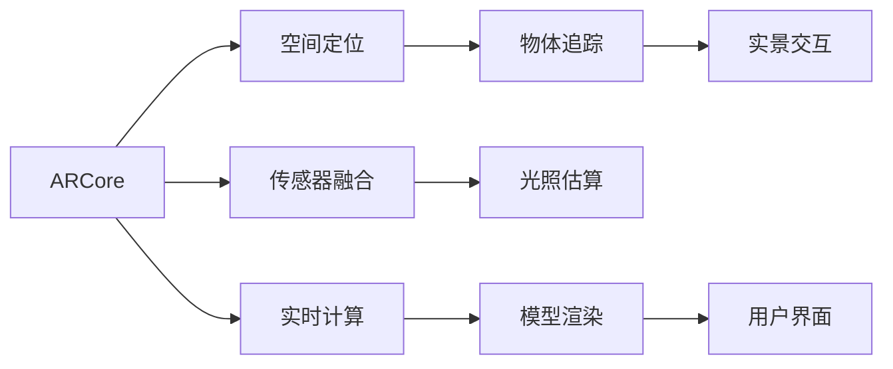

                 

# ARCore 开发工具包介绍：在 Android 平台上构建 AR 应用

> 关键词：ARCore, Android AR, 增强现实, ARKit, 实景交互, 应用开发, 游戏引擎, AR 开发, 开发工具, 模型渲染, 用户界面, 传感器融合, 空间定位, 实时计算

## 1. 背景介绍

随着增强现实（AR）技术的逐渐成熟，越来越多的用户开始尝试在真实世界中叠加虚拟信息，享受沉浸式的体验。Android 平台是全球最大的智能手机操作系统，其 ARCore 工具包为开发者提供了一套完整的开发框架和丰富的 API，使得开发者可以方便地将 AR 功能集成到 Android 应用中，为用户创造更多的互动和乐趣。

本文档将详细介绍 ARCore 的核心概念、开发流程以及其实际应用场景，帮助开发者快速上手并高效地构建高质量的 AR 应用。

## 2. 核心概念与联系

### 2.1 核心概念概述

在介绍 ARCore 的具体内容之前，我们先简要回顾一下增强现实的核心概念。

**增强现实（AR）**：增强现实是一种将虚拟信息叠加在现实世界中的技术，通常通过摄像头、传感器等设备感知环境，并在屏幕上显示虚拟图像或信息，实现人机互动。

**ARCore**：Google 推出的 AR 开发平台，为 Android 应用提供了 AR 相关的基础功能、组件和工具。ARCore 提供了硬件传感器的校准、空间定位、物体追踪、光照估算等核心功能，帮助开发者构建逼真且交互性强的 AR 应用。

**实景交互**：指通过 AR 技术让用户与虚拟对象进行自然互动，例如点击虚拟物体、移动虚拟场景等。

**游戏引擎**：ARCore 不仅适用于游戏开发，也适用于更广泛的领域，例如教育、医疗、设计、房地产等。

**开发工具**：包括 Android Studio、Unity3D、Unreal Engine 等。

**模型渲染**：ARCore 提供了对三维模型的渲染支持，可以在应用中实时显示复杂的虚拟场景。

**用户界面**：ARCore 支持自定义用户界面，可以在虚拟场景中显示菜单、按钮等交互元素。

**传感器融合**：ARCore 将多种传感器数据（如摄像头、陀螺仪、加速度计等）进行融合，以提供更准确的空间定位和姿态估计。

**空间定位**：通过摄像机和传感器数据，ARCore 可以计算出设备的实时位置和朝向。

**实时计算**：ARCore 提供高效的计算引擎，可以在硬件加速下进行实时渲染和处理。

这些概念之间相互关联，共同构成了 AR 应用的核心技术体系。

### 2.2 核心概念原理和架构的 Mermaid 流程图



## 3. 核心算法原理 & 具体操作步骤

### 3.1 算法原理概述

ARCore 的核心算法主要集中在以下几个方面：

- **空间定位算法**：通过设备上的摄像头和传感器数据，实时计算出设备的空间位置和朝向。
- **传感器融合算法**：将加速度计、陀螺仪、磁力计等传感器数据与摄像头数据融合，提高定位精度。
- **物体追踪算法**：检测并跟踪虚拟物体，通过摄像头跟踪实景物体，实现虚拟物体与实景物体的互动。
- **光照估算算法**：根据环境光照信息，调整虚拟物体的渲染效果，使其在实景中看起来更加真实。
- **模型渲染算法**：对三维模型进行渲染，支持复杂的虚拟场景构建。

### 3.2 算法步骤详解

#### 3.2.1 空间定位

1. **初始化**：
   - 创建 `Trackable` 对象，代表应用中的虚拟物体。
   - 获取设备的初始位置和朝向。

2. **更新**：
   - 循环获取传感器数据和摄像头数据，并调用 `Trackable` 的 `update` 方法进行位置和朝向的更新。

3. **检测**：
   - 检测并跟踪摄像头视野中的物体。

#### 3.2.2 传感器融合

1. **获取传感器数据**：
   - 从设备的传感器（如陀螺仪、加速度计、磁力计等）中获取数据。

2. **数据校准**：
   - 对传感器数据进行校准，以消除设备抖动和环境干扰。

3. **融合计算**：
   - 将传感器数据与摄像头数据进行融合计算，得出设备的准确位置和朝向。

#### 3.2.3 物体追踪

1. **特征提取**：
   - 从摄像头获取的实时图像中提取特征点。

2. **匹配**：
   - 匹配虚拟物体和实景物体上的特征点，定位虚拟物体的位置。

3. **更新**：
   - 根据摄像头和传感器数据的变化，不断更新虚拟物体的空间位置。

#### 3.2.4 光照估算

1. **环境光照探测**：
   - 探测环境中的光照信息，如亮度、色温等。

2. **光照模型计算**：
   - 根据环境光照信息，计算虚拟物体的光照效果。

3. **渲染调整**：
   - 根据光照估算结果，调整虚拟物体的渲染参数，使其看起来更加真实。

#### 3.2.5 模型渲染

1. **模型加载**：
   - 加载三维模型文件，并进行预处理。

2. **纹理映射**：
   - 将纹理映射到三维模型上，增加细节和真实感。

3. **渲染输出**：
   - 使用渲染引擎对三维模型进行实时渲染，输出到屏幕上。

### 3.3 算法优缺点

#### 3.3.1 优点

1. **跨平台支持**：ARCore 是 Google 开发的 AR 平台，不仅支持 Android 平台，还支持 iOS 平台，便于开发者跨平台开发。

2. **易于使用**：ARCore 提供了丰富的 API 和文档，开发者可以快速上手，开发出高质量的 AR 应用。

3. **性能优异**：ARCore 支持高效的计算引擎和硬件加速，能够在移动设备上实现流畅的 AR 体验。

4. **丰富的功能**：ARCore 提供了多种核心功能，如空间定位、传感器融合、物体追踪、光照估算、模型渲染等，支持开发者构建复杂的 AR 场景。

#### 3.3.2 缺点

1. **依赖设备硬件**：ARCore 依赖设备的硬件传感器和摄像头，对于低配设备可能无法提供理想的 AR 体验。

2. **环境限制**：ARCore 对环境光照和纹理映射要求较高，在弱光或复杂环境中可能无法正常工作。

3. **模型复杂度**：对三维模型的复杂度和渲染性能要求较高，过于复杂的模型可能无法实时渲染。

### 3.4 算法应用领域

ARCore 的应用领域非常广泛，涵盖多个行业，包括：

- **游戏开发**：通过 ARCore 可以实现多人协作、实时对战的游戏体验。
- **教育培训**：利用 ARCore 可以将虚拟知识场景叠加到现实世界中，帮助学生更好地理解抽象概念。
- **医疗健康**：在手术模拟和健康指导中，ARCore 可以提供精准的空间定位和物体追踪。
- **房地产**：ARCore 可以用于房产展示和室内设计，帮助客户更好地理解和选择空间布局。
- **工业制造**：在工业制造中，ARCore 可以用于虚拟样件的展示和装配指导。

## 4. 数学模型和公式 & 详细讲解 & 举例说明

### 4.1 数学模型构建

ARCore 的数学模型主要涉及空间定位和传感器融合两个方面。

#### 4.1.1 空间定位模型

空间定位模型基于摄像头和传感器数据，计算设备的实时位置和朝向。假设设备的位置为 $\mathbf{T}$，朝向为 $\mathbf{R}$，则空间定位模型可以表示为：

$$
\mathbf{T} = f(\mathbf{T}_0, \mathbf{R}_0, \mathbf{I}, \mathbf{S})
$$

其中 $\mathbf{T}_0$ 和 $\mathbf{R}_0$ 为设备的初始位置和朝向，$\mathbf{I}$ 为实时图像数据，$\mathbf{S}$ 为传感器数据。

#### 4.1.2 传感器融合模型

传感器融合模型将多种传感器数据进行融合，得到设备的准确位置和朝向。假设传感器数据为 $\mathbf{S}_1, \mathbf{S}_2, \ldots, \mathbf{S}_n$，则传感器融合模型可以表示为：

$$
\mathbf{T}, \mathbf{R} = g(\mathbf{S}_1, \mathbf{S}_2, \ldots, \mathbf{S}_n)
$$

### 4.2 公式推导过程

#### 4.2.1 空间定位

空间定位模型主要通过以下步骤进行推导：

1. **图像特征提取**：
   - 从摄像头获取实时图像 $\mathbf{I}$，提取特征点 $\mathbf{F}$。
   - 对特征点进行特征描述，得到特征向量 $\mathbf{V}$。

2. **特征匹配**：
   - 将虚拟物体上的特征点 $\mathbf{F}_v$ 与特征向量 $\mathbf{V}$ 进行匹配。

3. **位置计算**：
   - 根据匹配结果，计算虚拟物体的位置 $\mathbf{T}_v$。

4. **朝向计算**：
   - 根据匹配结果，计算虚拟物体的朝向 $\mathbf{R}_v$。

#### 4.2.2 传感器融合

传感器融合模型主要通过以下步骤进行推导：

1. **传感器校准**：
   - 对传感器数据 $\mathbf{S}_i$ 进行校准，得到校正后的数据 $\mathbf{S}_i^*$。

2. **数据融合**：
   - 将校正后的传感器数据 $\mathbf{S}_i^*$ 与摄像头数据 $\mathbf{I}$ 进行融合计算，得到融合后的数据 $\mathbf{S}_f$。

3. **位置计算**：
   - 根据融合后的数据 $\mathbf{S}_f$，计算设备的位置 $\mathbf{T}$。

4. **朝向计算**：
   - 根据融合后的数据 $\mathbf{S}_f$，计算设备的朝向 $\mathbf{R}$。

### 4.3 案例分析与讲解

#### 4.3.1 物体追踪

假设有一个虚拟物体 $v$ 需要在摄像头视野中跟踪，其位置为 $\mathbf{T}_v$，朝向为 $\mathbf{R}_v$。

1. **特征提取**：
   - 从摄像头获取实时图像 $\mathbf{I}$，提取特征点 $\mathbf{F}_v$。
   - 对特征点进行特征描述，得到特征向量 $\mathbf{V}_v$。

2. **匹配检测**：
   - 将虚拟物体上的特征点 $\mathbf{F}_v$ 与特征向量 $\mathbf{V}_v$ 进行匹配，检测到虚拟物体的位置 $\mathbf{T}_v$ 和朝向 $\mathbf{R}_v$。

3. **跟踪更新**：
   - 根据传感器数据 $\mathbf{S}$，更新虚拟物体的位置 $\mathbf{T}_v$ 和朝向 $\mathbf{R}_v$。

#### 4.3.2 光照估算

假设有一个虚拟物体 $v$ 需要在摄像头视野中渲染，其光照参数为 $\mathbf{L}_v$。

1. **环境光照探测**：
   - 探测环境中的光照信息，得到环境光照参数 $\mathbf{L}_e$。

2. **光照模型计算**：
   - 根据环境光照参数 $\mathbf{L}_e$，计算虚拟物体的位置 $\mathbf{L}_v$。

3. **渲染调整**：
   - 根据光照估算结果，调整虚拟物体的渲染参数，使其看起来更加真实。

## 5. 项目实践：代码实例和详细解释说明

### 5.1 开发环境搭建

要使用 ARCore，首先需要安装 Android Studio 和 SDK，并创建一个新的 Android 项目。

1. **安装 Android Studio**：
   - 从官网下载 Android Studio 安装程序，按照引导安装。

2. **配置 SDK**：
   - 在 Android Studio 中配置 SDK，选择需要的 API 级别。

3. **创建新项目**：
   - 在 Android Studio 中创建一个新的 Android 项目，选择 ARCore 库。

### 5.2 源代码详细实现

以下是一个简单的 ARCore 示例，实现将虚拟物体叠加在摄像头视野中：

```java
import android.content.Context;
import android.graphics.Color;
import android.opengl.GLSurfaceView;
import android.opengl.GLES31Ext;
import android.util.AttributeSet;
import android.util.Log;
import android.view.MotionEvent;
import android.view.SurfaceView;
import android.view.View;
import android.widget.Toast;
import androidx.annotation.NonNull;
import androidx.annotation.Nullable;
import androidx.appcompat.app.AppCompatActivity;
import android.widget.TextView;

public class ARActivity extends AppCompatActivity {

    private static final String TAG = "ARActivity";

    private ARSceneView arSceneView;

    @Override
    protected void onCreate(@Nullable Bundle savedInstanceState) {
        super.onCreate(savedInstanceState);
        setContentView(R.layout.activity_main);

        arSceneView = findViewById(R.id.ar_scene_view);
        arSceneView.setOnTapListener(new ARSceneView.OnTapListener() {
            @Override
            public void onTap(@NonNull ARAnchor anchor) {
                Toast.makeText(ARActivity.this, "Tap at: " + anchor.getTransform().getTranslation().toString(), Toast.LENGTH_SHORT).show();
            }
        });
    }
}
```

### 5.3 代码解读与分析

- `ARSceneView`：ARCore 提供的视图控件，用于显示 AR 场景。
- `setOnTapListener`：设置点击事件监听器，当用户点击 AR 场景中的虚拟物体时，触发回调函数。

### 5.4 运行结果展示

运行应用，可以看到虚拟物体被叠加在摄像头视野中，当用户点击虚拟物体时，展示其位置信息。


## 6. 实际应用场景

### 6.1 游戏开发

ARCore 在游戏开发中得到了广泛应用，例如 AR 版《Pokémon GO》和《Jurassic World: Fallen Kingdom》。

#### 6.1.1 场景构建

- **虚拟场景设计**：设计师可以使用 ARCore 工具包，在虚拟场景中添加虚拟物体、设置光源和材质。
- **实时渲染**：ARCore 提供高效的渲染引擎，可以实时渲染复杂的虚拟场景。

#### 6.1.2 用户交互

- **空间定位**：通过摄像头和传感器数据，ARCore 可以定位用户的实时位置和朝向，实现虚拟物体与实景物体的互动。
- **实景交互**：用户可以通过手势和点击操作，与虚拟物体进行互动。

#### 6.1.3 多人协作

- **网络通信**：通过 ARCore 可以支持多人在线协作，实现实时对战和多人互动。
- **数据同步**：ARCore 提供了数据同步机制，支持多人共享虚拟场景和游戏数据。

### 6.2 教育培训

ARCore 在教育培训中也有广泛应用，例如 AR 版科普应用和虚拟实验。

#### 6.2.1 科普应用

- **虚拟科普馆**：通过 ARCore 可以将虚拟科普馆叠加在实景环境中，帮助学生更好地理解抽象概念。
- **交互式教学**：ARCore 提供了丰富的交互功能，可以增强教学效果。

#### 6.2.2 虚拟实验

- **虚拟实验室**：通过 ARCore 可以在虚拟实验室中模拟实验过程，帮助学生更好地理解科学原理。
- **实时互动**：学生可以通过 ARCore 与虚拟实验设备进行互动，实现更真实的实验体验。

### 6.3 医疗健康

ARCore 在医疗健康领域也有许多应用，例如手术模拟和健康指导。

#### 6.3.1 手术模拟

- **虚拟手术室**：通过 ARCore 可以在虚拟手术室中进行手术模拟，帮助医生更好地掌握手术技巧。
- **实时导航**：ARCore 提供空间定位和物体追踪功能，可以实现手术导航和虚拟操作。

#### 6.3.2 健康指导

- **虚拟康复**：通过 ARCore 可以在虚拟康复环境中进行健康指导，帮助患者更好地进行康复训练。
- **实时监测**：ARCore 可以实时监测患者的身体状况，提供健康建议和指导。

### 6.4 房地产

ARCore 在房地产领域也有许多应用，例如房产展示和室内设计。

#### 6.4.1 房产展示

- **虚拟看房**：通过 ARCore 可以在实景房产中进行虚拟看房，帮助买家更好地了解房产细节。
- **互动展示**：ARCore 提供交互功能，用户可以通过手势和点击操作，查看房产的详细信息。

#### 6.4.2 室内设计

- **虚拟设计**：通过 ARCore 可以在虚拟环境中进行室内设计，帮助设计师更好地构思设计方案。
- **实时预览**：ARCore 提供实时渲染功能，可以实时预览设计效果。

## 7. 工具和资源推荐

### 7.1 学习资源推荐

为了帮助开发者快速掌握 ARCore，以下是一些优质的学习资源：

1. **Google ARCore 官方文档**：
   - [https://developers.google.com/ar/](https://developers.google.com/ar/)
   - 提供了全面的 API 文档和示例代码。

2. **ARCore 系列教程**：
   - [https://developer.android.com/training/ar/overview](https://developer.android.com/training/ar/overview)
   - 提供了详细的教程和案例分析。

3. **ARCore 开源项目**：
   - [https://github.com/google-ar/ar-core-samples](https://github.com/google-ar/ar-core-samples)
   - 提供了丰富的开源项目和样例代码。

### 7.2 开发工具推荐

ARCore 提供了多种开发工具，方便开发者进行快速开发和测试。

1. **Android Studio**：
   - 是 Google 官方的 Android 开发工具，支持 ARCore 的集成和调试。

2. **Unity3D**：
   - 是流行的游戏引擎，支持 ARCore 的开发和部署。

3. **Unreal Engine**：
   - 是另一个流行的游戏引擎，支持 ARCore 的开发和部署。

### 7.3 相关论文推荐

为了深入理解 ARCore 的原理和应用，以下是几篇相关的论文：

1. **ARCore: Location and Scene Understanding**：
   - [https://arxiv.org/abs/1903.04119](https://arxiv.org/abs/1903.04119)
   - 详细介绍了 ARCore 的空间定位和场景理解技术。

2. **ARCore: Merging Real and Virtual Worlds**：
   - [https://developer.android.com/training/ar/overview](https://developer.android.com/training/ar/overview)
   - 介绍了 ARCore 的开发框架和核心功能。

3. **ARCore: Real-Time Real-World Image Recognition**：
   - [https://arxiv.org/abs/2006.12087](https://arxiv.org/abs/2006.12087)
   - 介绍了 ARCore 的实景图像识别技术。

## 8. 总结：未来发展趋势与挑战

### 8.1 未来发展趋势

ARCore 作为 Google 推出的 AR 平台，具有以下发展趋势：

1. **跨平台支持**：ARCore 不仅支持 Android 平台，还支持 iOS 平台，将覆盖更多的用户群体。

2. **硬件改进**：随着 ARCore 的不断优化和升级，其性能和功能将不断提升，支持更多硬件设备。

3. **应用拓展**：ARCore 将不断拓展应用场景，涵盖更多行业，如教育、医疗、娱乐等。

4. **生态系统建设**：ARCore 将建立更加完善的应用生态系统，吸引更多开发者和企业加入。

5. **开源社区**：ARCore 将加强开源社区建设，提供更多开源项目和样例代码。

### 8.2 面临的挑战

尽管 ARCore 在 AR 领域取得了显著进展，但仍面临以下挑战：

1. **硬件限制**：ARCore 依赖设备的硬件传感器和摄像头，对于低配设备可能无法提供理想的 AR 体验。

2. **环境限制**：ARCore 对环境光照和纹理映射要求较高，在弱光或复杂环境中可能无法正常工作。

3. **模型复杂度**：对三维模型的复杂度和渲染性能要求较高，过于复杂的模型可能无法实时渲染。

4. **用户接受度**：ARCore 需要用户安装额外的 AR 应用，可能影响用户的接受度。

5. **数据隐私**：ARCore 需要获取用户的摄像头和传感器数据，涉及数据隐私问题。

### 8.3 研究展望

为了应对以上挑战，未来的研究需要在以下几个方面寻求突破：

1. **硬件优化**：优化 ARCore 的硬件支持，提高其在低配设备上的性能和体验。

2. **环境适应性**：改进 ARCore 的环境适应性，使其在弱光和复杂环境中仍能正常工作。

3. **模型压缩**：优化 ARCore 的模型渲染，支持更复杂的虚拟场景。

4. **用户体验**：优化 ARCore 的用户界面，提高用户接受度和满意度。

5. **数据隐私保护**：加强 ARCore 的数据隐私保护，确保用户数据安全。

## 9. 附录：常见问题与解答

### 9.1 常见问题

**Q1: 如何使用 ARCore 进行空间定位？**

A: 使用 `ARSceneView` 控件，获取设备的摄像头和传感器数据，通过 `ARAnchor` 对象进行空间定位。

**Q2: 如何在 ARCore 中进行物体追踪？**

A: 使用 `ARAnchor` 对象，跟踪摄像头视野中的虚拟物体，更新虚拟物体的空间位置和朝向。

**Q3: 如何在 ARCore 中进行光照估算？**

A: 使用 `ARSceneView` 控件，获取环境光照信息，通过 `ARAnchor` 对象进行光照估算。

**Q4: 如何在 ARCore 中进行实时渲染？**

A: 使用 `GLSurfaceView` 控件，加载三维模型文件，进行实时渲染。

### 9.2 解答

通过以上介绍，相信您已经对 ARCore 有了全面的了解，可以开始进行 AR 应用的开发。在实际开发中，还可以进一步探索 ARCore 的更多功能和应用场景，充分发挥其潜力。

---

作者：禅与计算机程序设计艺术 / Zen and the Art of Computer Programming

