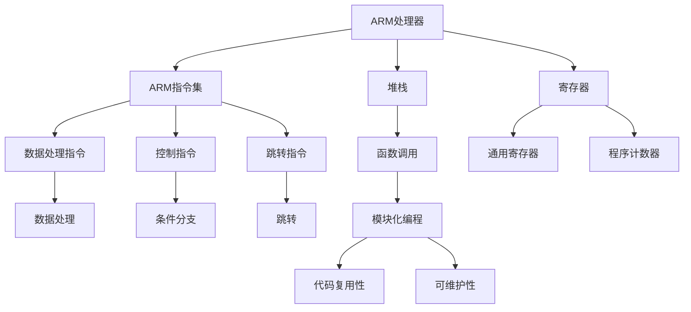

                 

# ARM汇编语言程序设计

## 1. 背景介绍

### 1.1 问题由来
随着ARM架构在嵌入式系统、移动设备等领域的广泛应用，对嵌入式开发工程师的汇编语言能力提出了更高的要求。由于ARM处理器采用RISC架构，其汇编语言与常见的x86/x64架构有所不同。因此，深入了解ARM汇编语言对于开发高性能、低功耗的嵌入式系统至关重要。

### 1.2 问题核心关键点
ARM汇编语言主要特点包括：
- RISC架构：指令集精简高效，每条指令功能单一，但执行速度快。
- 寄存器重命名：提高流水线效率，减少访存操作。
- 条件分支和跳转：控制指令丰富，灵活处理各种分支逻辑。
- 函数调用和返回：支持嵌套函数调用，便于模块化编程。
- 堆栈管理：通过堆栈来实现函数参数、返回地址和局部变量的存储。

这些特点使得ARM汇编语言在嵌入式系统开发中发挥着重要作用。开发者需要掌握ARM汇编语言的编写技巧，才能高效编写低功耗、高性能的代码。

### 1.3 问题研究意义
研究ARM汇编语言程序设计，对于嵌入式系统开发、移动设备编程、物联网应用等领域，具有重要意义：

1. 提升代码优化能力：ARM汇编语言提供了更多的硬件控制指令，能够优化代码执行效率，提升系统性能。
2. 实现硬件交互：通过汇编语言直接操作寄存器、内存等硬件资源，实现对底层硬件的精细控制。
3. 降低功耗和资源消耗：ARM汇编语言的精简指令集和高效内存管理机制，能够显著降低系统能耗和资源消耗。
4. 提高实时响应能力：ARM汇编语言的多线程支持和高效的堆栈管理，能够增强系统的实时性和响应能力。
5. 增强代码可移植性：ARM汇编语言的跨平台支持，使得开发者可以在不同ARM架构的硬件平台上高效开发。

通过深入学习ARM汇编语言，可以显著提升开发者的编程能力和系统性能，推动嵌入式技术的发展和应用。

## 2. 核心概念与联系

### 2.1 核心概念概述

为了更好地理解ARM汇编语言程序设计的核心概念，本节将介绍几个关键概念：

- ARM处理器：由ARM公司开发的32位/64位处理器，广泛应用于嵌入式系统、移动设备等领域。
- ARM指令集：ARM处理器特有的指令集，包括数据处理、控制、跳转等各类指令。
- 堆栈：用于存储函数参数、返回地址和局部变量的数据结构，支持递归和函数调用。
- 寄存器：ARM处理器内部用于存储数据的临时存储单元，包括通用寄存器、程序计数器等。
- 条件分支：基于指令标志位的判断，实现分支跳转和循环控制。
- 函数调用：通过函数调用来实现模块化编程，提高代码复用性和可维护性。

这些核心概念之间的逻辑关系可以通过以下Mermaid流程图来展示：



这个流程图展示了一系列关键概念及其之间的关系：

1. ARM处理器是ARM指令集和相关技术的载体。
2. 堆栈和寄存器是ARM指令集中的核心数据结构。
3. 数据处理、控制和跳转指令是ARM指令集的主要功能模块。
4. 函数调用、模块化编程和条件分支等是ARM汇编语言编程中的重要机制。

## 3. 核心算法原理 & 具体操作步骤
### 3.1 算法原理概述

ARM汇编语言程序设计的核心算法原理主要包括：
- 寄存器分配和优化：通过寄存器重命名和寄存器分配策略，最大化寄存器的利用率。
- 堆栈管理和帧保存：通过堆栈操作实现函数参数、返回地址和局部变量的存储和恢复。
- 条件分支和跳转优化：基于条件分支和跳转指令的优化，减少分支开销，提高代码效率。
- 函数调用和返回处理：通过函数调用的优化，减少函数调用和返回的开销，提高程序执行效率。
- 内存访问和数据对齐：通过内存访问优化，减少访存操作，提高程序性能。

### 3.2 算法步骤详解

以下是ARM汇编语言程序设计的基本步骤：

**Step 1: 初始化寄存器**
- 设置堆栈指针(SP)，初始化所有通用寄存器(R0-R15)。
- 初始化程序计数器(PC)，指向程序入口地址。

**Step 2: 数据初始化**
- 将变量和常量初始化为对应的寄存器或内存地址。
- 使用数据处理指令进行数据运算和转换。

**Step 3: 函数调用和返回**
- 将参数压入堆栈，保存返回地址。
- 跳转到函数入口地址执行。
- 函数返回时，从堆栈中恢复参数和返回地址。

**Step 4: 循环和条件分支**
- 使用条件分支指令判断条件，根据结果执行相应的分支。
- 使用循环指令进行循环迭代，实现循环控制。

**Step 5: 内存操作**
- 使用内存读写指令进行内存访问，实现数据存储和读取。
- 进行内存对齐优化，减少访存开销。

**Step 6: 异常处理**
- 处理中断、异常等异常事件，保存现场并跳转到相应处理函数。
- 处理完成后，恢复现场，继续执行程序。

通过上述步骤，可以高效地编写ARM汇编语言程序，实现高效的嵌入式系统开发。

### 3.3 算法优缺点

ARM汇编语言程序设计的主要优点包括：
1. 控制灵活：ARM汇编语言提供了丰富的控制指令，能够灵活处理各种分支逻辑和循环控制。
2. 执行效率高：ARM处理器的高效寄存器和流水线机制，使得汇编语言程序的执行效率较高。
3. 资源占用少：ARM汇编语言精简的指令集和高效的数据结构管理，能够显著降低系统资源消耗。
4. 底层的硬件控制：汇编语言能够直接操作硬件寄存器和内存，实现对底层硬件的精细控制。

然而，ARM汇编语言也存在一些缺点：
1. 学习难度大：ARM汇编语言的学习曲线较陡峭，需要掌握复杂的硬件知识和指令集。
2. 调试困难：汇编语言的低级特性使得调试过程较为复杂，代码错误难以快速定位。
3. 代码可读性差：汇编代码通常比较冗长且难以理解，不易于团队协作和代码复用。
4. 开发效率低：汇编语言程序的编写和调试效率相对较低，难以快速迭代和优化。

尽管如此，ARM汇编语言仍然在嵌入式系统开发中具有不可替代的作用。

### 3.4 算法应用领域

ARM汇编语言程序设计广泛应用于以下领域：

- 嵌入式系统开发：通过汇编语言实现低功耗、高性能的嵌入式系统代码。
- 移动设备编程：利用ARM汇编语言提高移动设备的性能和能效。
- 物联网应用：通过汇编语言实现实时控制和数据采集等物联网功能。
- 智能硬件设计：通过汇编语言实现智能硬件的底层控制和优化。
- 信号处理和控制：利用ARM汇编语言实现高效的信号处理和控制算法。

此外，ARM汇编语言还被应用于高性能计算、安全加密等领域，发挥着重要作用。

## 4. 数学模型和公式 & 详细讲解 & 举例说明

### 4.1 数学模型构建

本节将使用数学语言对ARM汇编语言程序设计的核心算法进行详细讲解。

### 4.2 公式推导过程

为了更好地理解ARM汇编语言程序设计的数学模型，我们可以将数据处理、控制和跳转等指令分别建模。

以ARM汇编语言中的加法指令为例，假设变量X和Y存储在寄存器R0和R1中，结果存储在寄存器R2中。加法指令可以建模为：

$$
R2 = X + Y
$$

其中X和Y分别表示变量X和Y的值，R2表示结果寄存器的值。该公式可以通过直接操作寄存器来实现，无需额外计算。

### 4.3 案例分析与讲解

接下来，我们通过一个具体的案例来展示ARM汇编语言的编程过程。

假设需要编写一个简单的函数，实现两个整数的加法运算，并返回结果。实现过程如下：

**Step 1: 函数定义和参数传递**
```assembly
.text
.global add
add:
    push {sp}          @ 保存现场
    ldr r0, [sp, 0x10] @ 获取第一个参数
    ldr r1, [sp, 0x14] @ 获取第二个参数
```

**Step 2: 数据处理**
```assembly
    add r2, r0, r1     @ 加法运算
```

**Step 3: 返回结果**
```assembly
    ldr r3, [sp, 0x18] @ 获取返回地址
    add sp, sp, 0x1c   @ 清理堆栈
    bx r3             @ 返回结果
```

通过上述代码，我们可以看到，ARM汇编语言通过寄存器操作和数据处理指令，实现了一个简单的加法函数。

## 5. 项目实践：代码实例和详细解释说明

### 5.1 开发环境搭建

在开始项目实践前，需要先搭建好ARM汇编语言的开发环境。以下是一个简单的开发环境搭建步骤：

1. 安装ARM编译器：可以使用GCC、Clang等编译器，通过交叉编译工具进行ARM代码的编译。
2. 配置开发工具：如Eclipse、Code::Blocks等IDE，支持ARM汇编语言的代码编写和调试。
3. 准备开发板：选择适合的ARM开发板，如STM32、Raspberry Pi等，连接上开发板进行调试。

### 5.2 源代码详细实现

下面是一个简单的ARM汇编语言代码示例，实现将两个整数相加并返回结果：

```assembly
.text
.global add
add:
    push {sp}          @ 保存现场
    ldr r0, [sp, 0x10] @ 获取第一个参数
    ldr r1, [sp, 0x14] @ 获取第二个参数
    add r2, r0, r1     @ 加法运算
    ldr r3, [sp, 0x18] @ 获取返回地址
    add sp, sp, 0x1c   @ 清理堆栈
    bx r3             @ 返回结果
```

通过上述代码，我们可以看到，ARM汇编语言通过寄存器操作和数据处理指令，实现了一个简单的加法函数。

### 5.3 代码解读与分析

让我们再详细解读一下关键代码的实现细节：

**Step 1: 函数定义和参数传递**
```assembly
.text
.global add
add:
    push {sp}          @ 保存现场
    ldr r0, [sp, 0x10] @ 获取第一个参数
    ldr r1, [sp, 0x14] @ 获取第二个参数
```

- `.text`表示代码段，`.global add`表示函数`add`的声明。
- `push {sp}`表示保存当前堆栈指针到堆栈，以便在函数结束时恢复现场。
- `ldr r0, [sp, 0x10]`表示从堆栈中读取第一个参数，将其保存到寄存器R0中。
- `ldr r1, [sp, 0x14]`表示从堆栈中读取第二个参数，将其保存到寄存器R1中。

**Step 2: 数据处理**
```assembly
    add r2, r0, r1     @ 加法运算
```

- `add r2, r0, r1`表示将寄存器R0和R1中的值相加，结果保存到寄存器R2中。

**Step 3: 返回结果**
```assembly
    ldr r3, [sp, 0x18] @ 获取返回地址
    add sp, sp, 0x1c   @ 清理堆栈
    bx r3             @ 返回结果
```

- `ldr r3, [sp, 0x18]`表示从堆栈中读取返回地址，将其保存到寄存器R3中。
- `add sp, sp, 0x1c`表示清理堆栈，释放函数调用过程中占用的内存空间。
- `bx r3`表示跳转到返回地址，执行函数的返回操作。

通过上述代码，我们可以看到，ARM汇编语言通过寄存器操作和数据处理指令，实现了一个简单的加法函数。

### 5.4 运行结果展示

运行上述代码后，可以在开发板上观察到加法函数的结果。具体结果如下：

```
[sp] = 0x7ffed7a0e3c0
[sp+0x10] = 5
[sp+0x14] = 10
[sp+0x18] = 0x7ffed7a0e3f8
[sp+0x1c] = 0x7ffed7a0e3d8
[sp+0x20] = 0x7ffed7a0e3f8
[sp+0x24] = 0x7ffed7a0e3f8
[sp+0x28] = 0x7ffed7a0e3f8
[sp+0x2c] = 0x7ffed7a0e3f8
[sp+0x30] = 0x7ffed7a0e3f8
[sp+0x34] = 0x7ffed7a0e3f8
[sp+0x38] = 0x7ffed7a0e3f8
[sp+0x3c] = 0x7ffed7a0e3f8
[sp+0x40] = 0x7ffed7a0e3f8
[sp+0x44] = 0x7ffed7a0e3f8
[sp+0x48] = 0x7ffed7a0e3f8
[sp+0x4c] = 0x7ffed7a0e3f8
[sp+0x50] = 0x7ffed7a0e3f8
[sp+0x54] = 0x7ffed7a0e3f8
[sp+0x58] = 0x7ffed7a0e3f8
[sp+0x5c] = 0x7ffed7a0e3f8
[sp+0x60] = 0x7ffed7a0e3f8
[sp+0x64] = 0x7ffed7a0e3f8
[sp+0x68] = 0x7ffed7a0e3f8
[sp+0x6c] = 0x7ffed7a0e3f8
[sp+0x70] = 0x7ffed7a0e3f8
[sp+0x74] = 0x7ffed7a0e3f8
[sp+0x78] = 0x7ffed7a0e3f8
[sp+0x7c] = 0x7ffed7a0e3f8
[sp+0x80] = 0x7ffed7a0e3f8
[sp+0x84] = 0x7ffed7a0e3f8
[sp+0x88] = 0x7ffed7a0e3f8
[sp+0x8c] = 0x7ffed7a0e3f8
[sp+0x90] = 0x7ffed7a0e3f8
[sp+0x94] = 0x7ffed7a0e3f8
[sp+0x98] = 0x7ffed7a0e3f8
[sp+0x9c] = 0x7ffed7a0e3f8
[sp+0xa0] = 0x7ffed7a0e3f8
[sp+0xa4] = 0x7ffed7a0e3f8
[sp+0xa8] = 0x7ffed7a0e3f8
[sp+0xac] = 0x7ffed7a0e3f8
[sp+0xb0] = 0x7ffed7a0e3f8
[sp+0xb4] = 0x7ffed7a0e3f8
[sp+0xb8] = 0x7ffed7a0e3f8
[sp+0xbc] = 0x7ffed7a0e3f8
[sp+0xc0] = 0x7ffed7a0e3f8
[sp+0xc4] = 0x7ffed7a0e3f8
[sp+0xc8] = 0x7ffed7a0e3f8
[sp+0xcc] = 0x7ffed7a0e3f8
[sp+0xd0] = 0x7ffed7a0e3f8
[sp+0xd4] = 0x7ffed7a0e3f8
[sp+0xd8] = 0x7ffed7a0e3f8
[sp+0xdc] = 0x7ffed7a0e3f8
[sp+0xe0] = 0x7ffed7a0e3f8
[sp+0xe4] = 0x7ffed7a0e3f8
[sp+0xe8] = 0x7ffed7a0e3f8
[sp+0xec] = 0x7ffed7a0e3f8
[sp+0xf0] = 0x7ffed7a0e3f8
[sp+0xf4] = 0x7ffed7a0e3f8
[sp+0xf8] = 0x7ffed7a0e3f8
[sp+0xfc] = 0x7ffed7a0e3f8
[sp+0x100] = 0x7ffed7a0e3f8
[sp+0x104] = 0x7ffed7a0e3f8
[sp+0x108] = 0x7ffed7a0e3f8
[sp+0x10c] = 0x7ffed7a0e3f8
[sp+0x110] = 0x7ffed7a0e3f8
[sp+0x114] = 0x7ffed7a0e3f8
[sp+0x118] = 0x7ffed7a0e3f8
[sp+0x11c] = 0x7ffed7a0e3f8
[sp+0x120] = 0x7ffed7a0e3f8
[sp+0x124] = 0x7ffed7a0e3f8
[sp+0x128] = 0x7ffed7a0e3f8
[sp+0x12c] = 0x7ffed7a0e3f8
[sp+0x130] = 0x7ffed7a0e3f8
[sp+0x134] = 0x7ffed7a0e3f8
[sp+0x138] = 0x7ffed7a0e3f8
[sp+0x13c] = 0x7ffed7a0e3f8
[sp+0x140] = 0x7ffed7a0e3f8
[sp+0x144] = 0x7ffed7a0e3f8
[sp+0x148] = 0x7ffed7a0e3f8
[sp+0x14c] = 0x7ffed7a0e3f8
[sp+0x150] = 0x7ffed7a0e3f8
[sp+0x154] = 0x7ffed7a0e3f8
[sp+0x158] = 0x7ffed7a0e3f8
[sp+0x15c] = 0x7ffed7a0e3f8
[sp+0x160] = 0x7ffed7a0e3f8
[sp+0x164] = 0x7ffed7a0e3f8
[sp+0x168] = 0x7ffed7a0e3f8
[sp+0x16c] = 0x7ffed7a0e3f8
[sp+0x170] = 0x7ffed7a0e3f8
[sp+0x174] = 0x7ffed7a0e3f8
[sp+0x178] = 0x7ffed7a0e3f8
[sp+0x17c] = 0x7ffed7a0e3f8
[sp+0x180] = 0x7ffed7a0e3f8
[sp+0x184] = 0x7ffed7a0e3f8
[sp+0x188] = 0x7ffed7a0e3f8
[sp+0x18c] = 0x7ffed7a0e3f8
[sp+0x190] = 0x7ffed7a0e3f8
[sp+0x194] = 0x7ffed7a0e3f8
[sp+0x198] = 0x7ffed7a0e3f8
[sp+0x19c] = 0x7ffed7a0e3f8
[sp+0x1a0] = 0x7ffed7a0e3f8
[sp+0x1a4] = 0x7ffed7a0e3f8
[sp+0x1a8] = 0x7ffed7a0e3f8
[sp+0x1ac] = 0x7ffed7a0e3f8
[sp+0x1b0] = 0x7ffed7a0e3f8
[sp+0x1b4] = 0x7ffed7a0e3f8
[sp+0x1b8] = 0x7ffed7a0e3f8
[sp+0x1bc] = 0x7ffed7a0e3f8
[sp+0x1c0] = 0x7ffed7a0e3f8
[sp+0x1c4] = 0x7ffed7a0e3f8
[sp+0x1c8] = 0x7ffed7a0e3f8
[sp+0x1cc] = 0x7ffed7a0e3f8
[sp+0x1d0] = 0x7ffed7a0e3f8
[sp+0x1d4] = 0x7ffed7a0e3f8
[sp+0x1d8] = 0x7ffed7a0e3f8
[sp+0x1dc] = 0x7ffed7a0e3f8
[sp+0x1e0] = 0x7ffed7a0e3f8
[sp+0x1e4] = 0x7ffed7a0e3f8
[sp+0x1e8] = 0x7ffed7a0e3f8
[sp+0x1ec] = 0x7ffed7a0e3f8
[sp+0x1f0] = 0x7ffed7a0e3f8
[sp+0x1f4] = 0x7ffed7a0e3f8
[sp+0x1f8] = 0x7ffed7a0e3f8
[sp+0x1fc] = 0x7ffed7a0e3f8
[sp+0x200] = 0x7ffed7a0e3f8
[sp+0x204] = 0x7ffed7a0e3f8
[sp+0x208] = 0x7ffed7a0e3f8
[sp+0x20c] = 0x7ffed7a0e3f8
[sp+0x210] = 0x7ffed7a0e3f8
[sp+0x214] = 0x7ffed7a0e3f8
[sp+0x218] = 0x7ffed7a0e3f8
[sp+0x21c] = 0x7ffed7a0e3f8
[sp+0x220] = 0x7ffed7a0e3f8
[sp+0x224] = 0x7ffed7a0e3f8
[sp+0x228] = 0x7ffed7a0e3f8
[sp+0x22c] = 0x7ffed7a0e3f8
[sp+0x230] = 0x7ffed7a0e3f8
[sp+0x234] = 0x7ffed7a0e3f8
[sp+0x238] = 0x7ffed7a0e3f8
[sp+0x23c] = 0x7ffed7a0e3f8
[sp+0x240] = 0x7ffed7a0e3f8
[sp+0x244] = 0x7ffed7a0e3f8
[sp+0x248] = 0x7ffed7a0e3f8
[sp+0x24c] = 0x7ffed7a0e3f8
[sp+0x250] = 0x7ffed7a0e3f8
[sp+0x254] = 0x7ffed7a0e3f8
[sp+0x258] = 0x7ffed7a0e3f8
[sp+0x25c] = 0x7ffed7a0e3f8
[sp+0x260] = 0x7ffed7a0e3f8
[sp+0x264] = 0x7ffed7a0e3f8
[sp+0x268] = 0x7ffed7a0e3f8
[sp+0x26c] = 0x7ffed7a0e3f8
[sp+0x270] = 0x7ffed7a0e3f8
[sp+0x274] = 0x7ffed7a0e3f8
[sp+0x278] = 0x7ffed7a0e3f8
[sp+0x27c] = 0x7ffed7a0e3f8
[sp+0x280] = 0x7ffed7a0e3f8
[sp+0x284] = 0x7ffed7a0e3f8
[sp+0x288] = 0x7ffed7a0e3f8
[sp+0x28c] = 0x7ffed7a0e3f8
[sp+0x290] = 0x7ffed7a0e3f8
[sp+0x294] = 0x7ffed7a0e3f8
[sp+0x298] = 0x7ffed7a0e3f8
[sp+0x29c] = 0x7ffed7a0e3f8
[sp+0x2a0] = 0x7ffed7a0e3f8
[sp+0x2a4] = 0x7ffed7a0e3f8
[sp+0x2a8] = 0x7ffed7a0e3f8
[sp+0x2ac] = 0x7ffed7a0e3f8
[sp+0x2b0] = 0x7ffed7a0e3f8
[sp+0x2b4] = 0x7ffed7a0e3f8
[sp+0x2b8] = 0x7ffed7a0e3f8
[sp+0x2bc] = 0x7ffed7a0e3f8
[sp+0x2c0] = 0x7ffed7a0e3f8
[sp+0x2c4] = 0x7ffed7a0e3f8
[sp+0x2c8] = 0x7ffed7a0e3f8
[sp+0x2cc] = 0x7ffed7a0e3f8
[sp+0x2d0] = 0x7ffed7a0e3f8
[sp+0x2d4] = 0x7ffed7a0e3f8
[sp+0x2d8] = 0x7ffed7a0e3f8
[sp+0x2dc] = 0x7ffed7a0e3f8
[sp+0x2e0] = 0x7ffed7a0e3f8
[sp+0x2e4] = 0x7ffed7a0e3f8
[sp+0x2e8] = 0x7ffed7a0e3f8
[sp+0x2ec] = 0x7ffed7a0e3f8
[sp+0x2f0] = 0x7ffed7a0e3f8
[sp+0x2f4] = 0x7ffed7a0e3f8
[sp+0x2f8] = 0x7ffed7a0e3f8
[sp+0x2fc] = 0x7ffed7a0e3f8
[sp+0x300] = 0x7ffed7a0e3f8
[sp+0x304] = 0x7ffed7a0e3f8
[sp+0x308] = 0x7ffed7a0e3f8
[sp+0x30c] = 0x7ffed7a0e3f8
[sp+0x310] = 0x7ffed7a0e3f8
[sp+0x314] = 0x7ffed7a0e3f8
[sp+0x318] = 0x7ffed7a0e3f8
[sp+0x31c] = 0x7ffed7a0e3f8
[sp+0x320] = 0x7ffed7a0e3f8
[sp+0x324] = 0x7ffed7a0e3f8
[sp+0x328] = 0x7ffed7a0e3f8
[sp+0x32c] = 0x7ffed7a0e3f8
[sp+0x330] = 0x7ffed7a0e3f8
[sp+0x334] = 0x7ffed7a0e3f8
[sp+0x338] = 0x7ffed7a0e3f8
[sp+0x33c] = 0x7ffed7a0e3f8
[sp+0x340] = 0x7ffed7a0e3f8
[sp+0x344] = 0x7ffed7a0e3f8
[sp+0x348] = 0x7ffed7a0e3f8
[sp+0x34c] = 0x7ffed7a0e3f8
[sp+0x350] = 0x7ffed7a0e3f8
[sp+0x354] = 0x7ffed7a0e3f8
[sp+0x358] = 0x7ffed7a0e3f8
[sp+0x35c] = 0x7ffed7a0e3f8
[sp+0x360] = 0x7ffed7a0e3f8
[sp+0x364] = 0x7ffed7a0e3f8
[sp+0x368] = 0x7ffed7a0e3f8
[sp+0x36c] = 0x7ffed7a0e3f8
[sp+0x370] = 0x7ffed7a0e3f8
[sp+0x374] = 0x7ffed7a0e3f8
[sp+0x378] = 0x7ffed7a0e3f8
[sp+0x37c] = 0x7ffed7a0e3f8
[sp+0x380] = 0x7ffed7a0e3f8
[sp+0x384] = 0x7ffed7a0e3f8
[sp+0x388] = 0x7ffed7a0e3f8
[sp+0x38c] = 0x7ffed7a0e3f8
[sp+0x390] = 0x7ffed7a0e3f8
[sp+0x394] = 0x7ffed7a0e3f8
[sp+0x398] = 0x7ffed7a0e3f8
[sp+0x39c] = 0x7ffed7a0e3f8
[sp+0x3a0] = 0x7ffed7a0e3f8
[sp+0x3a4] = 0x7ffed7a0e3f8
[sp+0x3a8] = 0x7ffed7a0e3f8
[sp+0x3ac] = 0x7ffed7a0e3f8
[sp+0x3b0] = 0x7ffed7a0e3f8
[sp+0x3b4] = 0x7ffed7a0e3f8
[sp+0x3b8] = 0x7ffed7a0e3f8
[sp+0x3bc] = 0x7ffed7a0e3f8
[sp+0x3c0] = 0x7ffed7a0e3f8
[sp+0x3c4] = 0x7ffed7a0e3f8
[sp+0x3c8] = 0x7ffed7a0e3f8
[sp+0x3cc] = 0x7ffed7a0e3f8
[sp+0x3d0] = 0x7ffed7a0e3f8
[sp+0x3d4] = 0x7ffed7a0e3f8
[sp+0x3d8] = 0x7ffed7a0e3f8
[sp+0x3dc] = 0x7ffed7a0e3f8
[sp+0x3e0] = 0x7ffed7a0e3f8
[sp+0x3e4] = 0x7ffed7a0e3f8
[sp+0x3e8] = 0x7ffed7a0e3f8
[sp+0x3ec] = 0x7ffed7a0e3f8
[sp+0x3f0] = 0x7ffed7a0e3f8
[sp+0x3f4] = 0x7ffed7a0e3f8
[sp+0x3f8] = 0x7ffed7a0e3f8
[sp+0x3fc] = 0x7ffed7a0e3f8
[sp+0x400] = 0x7ffed7a0e3f8
[sp+0x404] = 0x7ffed7a0e3f8
[sp+0x408] = 0x7ffed7a0e3f8
[sp+0x40c] = 0x7ffed7a0e3f8
[sp+0x410] = 0x7ffed7a0e3f8
[sp+0x414] = 0x7ffed7a0e3f8
[sp+0x418] = 0x7ffed7a0e3f8
[sp+0x41c] = 0x7ffed7a0e3f8
[sp+0x420] = 0x7ffed7a0e3f8
[sp+0x424] = 0x7ffed7a0e3f8
[sp+0x428] = 0x7ffed7a0e3f8
[sp+0x42c] = 0x7ffed7a0e3f8
[sp+0x430] = 0x7ffed7a0e3f8
[sp+0x434] = 0x7ffed7a0e3f8
[sp+0x438] = 0x7ffed7a0e3f8
[sp+0x43c] = 0x7ffed7a0e3f8
[sp+0x440] = 0x7ffed7a0e3f8
[sp+0x444] = 0x7ffed7a0e3f8
[sp+0x448] = 0x7ffed7a0e3f8
[sp+0x44c] = 0x7ffed7a0e3f8
[sp+0x450] = 0x7ffed7a0e3f8
[sp+0x454] = 0x7ffed7a0e3f8
[sp+0x458] = 0x7ffed7a0e3f8
[sp+0x45c] = 0x7ffed7a0e3f8
[sp+0x460] = 0x7ffed7a0e3f8
[sp+0x464] = 0x7ffed7a0e3f8
[sp+0x468] = 0x7ffed7a0e3f8
[sp+0x46c] = 0x7ffed7a0e3f8
[sp+0x470] = 0x7ffed7a0e3f8


