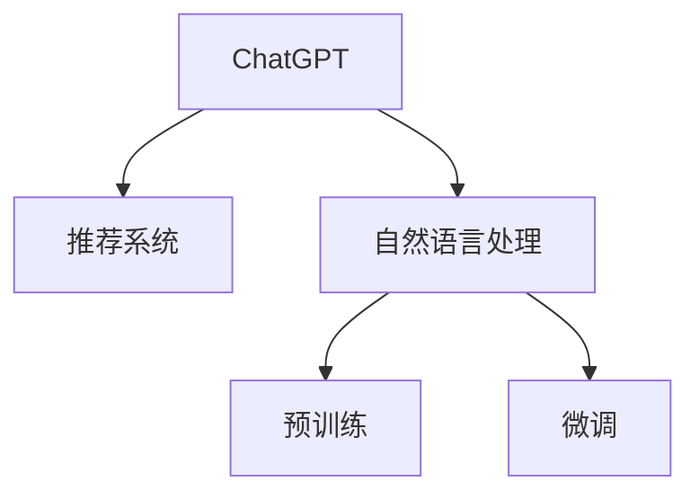

                 

# ChatGPT在推荐系统中的初步研究

在当今信息爆炸的时代，推荐系统成为了连接用户与信息的重要桥梁。从在线购物、视频观看到新闻阅读，推荐系统在提高用户体验、降低信息获取成本等方面发挥着不可替代的作用。而基于大语言模型的推荐系统，如ChatGPT，正在以其独特的优势和潜力，成为研究热点。本文将系统介绍ChatGPT在推荐系统中的基本原理、实现方法、应用案例和未来展望，希望能为相关研究提供一定的参考。

## 1. 背景介绍

### 1.1 问题由来
推荐系统的主要目的是帮助用户在海量信息中找到自己感兴趣的内容。传统的推荐系统大多基于协同过滤、矩阵分解等方法，通过用户行为数据进行推荐。然而，这种方法往往需要大量数据支持，且对新用户和老用户、长尾物品的处理存在不足。近年来，随着深度学习和大语言模型的兴起，一种基于大语言模型的推荐方法——ChatGPT，开始受到广泛关注。

### 1.2 问题核心关键点
ChatGPT通过预训练语言模型和微调技术，能够更好地理解用户输入的意图和上下文信息，从而生成更具针对性的推荐。ChatGPT的核心在于其强大的自然语言理解和生成能力，能够在与用户的对话中逐步调整推荐策略，提升推荐的个性化和多样性。

### 1.3 问题研究意义
研究ChatGPT在推荐系统中的应用，对于提升推荐系统的准确性、个性化和用户满意度具有重要意义：
1. 提高推荐准确性：ChatGPT能够利用其强大的语言理解能力，准确捕捉用户需求，生成更符合用户兴趣的推荐结果。
2. 增强个性化：ChatGPT可以通过与用户的对话，逐步学习用户偏好，提供量身定制的推荐。
3. 提升用户体验：ChatGPT能够以自然流畅的语言与用户互动，增强用户与系统的交互体验。
4. 拓展推荐范围：ChatGPT可以处理多种类型的信息，不仅限于文本，还可以包括图片、音频、视频等多模态数据。

## 2. 核心概念与联系

### 2.1 核心概念概述

为更好地理解ChatGPT在推荐系统中的应用，本节将介绍几个密切相关的核心概念：

- **ChatGPT**：基于Transformer结构和大规模预训练语言模型，具备强大的自然语言理解与生成能力。ChatGPT能够通过与用户的交互，逐步学习用户的兴趣和需求，提供更加个性化的推荐。
- **推荐系统**：根据用户的历史行为和偏好，为用户推荐感兴趣的内容。传统的推荐系统多基于协同过滤和矩阵分解，而基于ChatGPT的推荐系统，则以语言模型为基础。
- **自然语言处理(NLP)**：涉及语言理解、生成、语义分析等技术，是ChatGPT的核心所在。NLP技术为ChatGPT与用户的交互提供了可能。
- **预训练和微调**：ChatGPT的预训练和微调是其性能提升的关键。预训练在大型语料上学习通用的语言表示，微调则在特定任务上进一步优化模型的性能。

这些概念之间的逻辑关系可以通过以下Mermaid流程图来展示：



这个流程图展示出ChatGPT在推荐系统中的核心概念及其之间的关系：

1. ChatGPT通过预训练和微调，获得强大的语言理解与生成能力。
2. 在推荐系统中，ChatGPT通过与用户的交互，逐步学习用户的兴趣和需求。
3. 推荐系统根据ChatGPT提供的推荐结果，为用户提供个性化的内容。

## 3. 核心算法原理 & 具体操作步骤

### 3.1 算法原理概述

基于ChatGPT的推荐系统，主要依赖于其强大的自然语言理解和生成能力。ChatGPT在推荐系统中的基本原理可以总结如下：

1. **预训练**：使用大规模无标签文本数据对ChatGPT进行预训练，学习通用的语言表示。
2. **微调**：在推荐系统任务上进行微调，优化模型的推荐性能。
3. **交互式推荐**：与用户进行交互，通过对话逐步学习用户的偏好，生成个性化的推荐。
4. **多模态融合**：除了文本信息，ChatGPT还可以处理图片、音频、视频等多种模态数据，提高推荐的全面性。

### 3.2 算法步骤详解

ChatGPT在推荐系统中的应用流程主要包括以下几个关键步骤：

**Step 1: 数据预处理**
- 收集用户的历史行为数据，如浏览记录、购买记录、评分记录等。
- 收集物品的描述信息，如标题、标签、分类等。
- 将文本数据进行清洗、分词、编码等预处理，为后续的预训练和微调做准备。

**Step 2: 预训练**
- 在大型无标签文本数据上进行预训练，学习通用的语言表示。常用的预训练任务包括语言建模、掩码语言建模等。
- 使用预训练好的语言模型，初始化推荐系统中的ChatGPT模型。

**Step 3: 微调**
- 选择推荐系统任务（如推荐物品列表、生成推荐理由等），在标注数据上进行微调。
- 设计适合任务的微调目标和损失函数，如交叉熵损失、均方误差损失等。
- 使用AdamW等优化器，设置合适的学习率和批大小，进行梯度下降优化。

**Step 4: 交互式推荐**
- 在推荐系统界面中，用户输入查询或选择某个物品。
- ChatGPT根据用户输入，结合已知的上下文信息，生成推荐结果。
- ChatGPT与用户进行对话，逐步学习用户的兴趣和需求，更新推荐策略。

**Step 5: 多模态融合**
- 对于包含图片、音频、视频等信息的推荐任务，ChatGPT可以结合视觉、听觉等多模态信息，提供更加全面和精准的推荐。
- 对不同模态的信息进行特征提取和融合，再输入ChatGPT进行推荐。

### 3.3 算法优缺点

基于ChatGPT的推荐系统具有以下优点：
1. **强大的语言理解能力**：ChatGPT能够理解和生成自然语言，准确捕捉用户意图和需求。
2. **个性化的推荐**：ChatGPT通过与用户的对话，逐步学习用户的兴趣和偏好，提供更加个性化的推荐。
3. **多模态支持**：ChatGPT可以处理多种类型的信息，提高推荐的全面性和多样性。
4. **动态调整**：ChatGPT能够根据用户反馈和行为，动态调整推荐策略，提升推荐效果。

同时，该方法也存在一定的局限性：
1. **数据依赖性**：ChatGPT依赖大量的标注数据进行微调，数据收集和标注成本较高。
2. **计算资源要求**：预训练和微调ChatGPT需要大量计算资源，特别是在大规模数据上。
3. **模型复杂性**：ChatGPT模型复杂，推理速度较慢，需要优化以适应实时推荐需求。
4. **可解释性不足**：ChatGPT推荐过程缺乏可解释性，用户难以理解推荐依据。

尽管存在这些局限性，但ChatGPT在推荐系统中的应用前景依然广阔，未来仍有较大发展潜力。

### 3.4 算法应用领域

基于ChatGPT的推荐系统已经在多个领域得到了应用，以下是几个典型的应用场景：

- **电商推荐**：在电商平台中，ChatGPT可以根据用户的浏览和购买历史，生成个性化推荐商品列表。ChatGPT还可以与用户进行对话，了解用户的购买意愿和偏好，生成详细的推荐理由。
- **视频推荐**：在视频平台中，ChatGPT可以根据用户的观看记录和评分，生成个性化推荐视频列表。ChatGPT可以通过对话了解用户的兴趣爱好，生成更有针对性的推荐理由。
- **新闻推荐**：在新闻阅读平台中，ChatGPT可以根据用户的阅读历史和兴趣，生成个性化推荐文章列表。ChatGPT还可以与用户进行互动，了解用户的阅读偏好，生成推荐理由。
- **旅游推荐**：在旅游应用中，ChatGPT可以根据用户的旅游历史和兴趣，生成个性化推荐旅游路线和景点。ChatGPT可以通过对话了解用户的偏好和需求，生成详细的推荐理由。

除了上述这些典型应用外，ChatGPT还可以在音乐、图书、美食等更多领域中发挥其优势，为推荐系统提供强大的语言理解和生成能力。

## 4. 数学模型和公式 & 详细讲解 & 举例说明

### 4.1 数学模型构建

基于ChatGPT的推荐系统，其数学模型构建主要包括以下几个方面：

- **预训练语言模型**：通常使用自回归语言模型，如GPT-2、BERT等。预训练语言模型的目标是在无标签文本数据上学习通用的语言表示。
- **微调任务**：根据推荐系统任务，设计适合任务的微调目标和损失函数。例如，对于推荐物品列表的任务，可以使用交叉熵损失函数。
- **用户输入与输出**：用户输入为推荐请求或物品ID，输出为推荐物品列表或推荐理由。

### 4.2 公式推导过程

以推荐物品列表为例，ChatGPT在推荐系统中的推荐过程可以形式化地表示为：

- **预训练阶段**：
$$
\theta = \mathop{\arg\min}_{\theta} \mathcal{L}_{pretrain}(\theta)
$$
其中 $\theta$ 为模型的参数，$\mathcal{L}_{pretrain}$ 为预训练任务的损失函数。

- **微调阶段**：
$$
\theta = \mathop{\arg\min}_{\theta} \mathcal{L}_{fine}(\theta)
$$
其中 $\mathcal{L}_{fine}$ 为微调任务的损失函数，$fine$ 表示微调阶段。

- **交互式推荐**：
$$
y = M_{\theta}(x)
$$
其中 $M_{\theta}$ 为微调后的ChatGPT模型，$x$ 为用户输入，$y$ 为推荐结果。

### 4.3 案例分析与讲解

假设我们要使用ChatGPT在电商推荐系统中生成个性化商品推荐列表。具体步骤如下：

1. **数据收集**：收集用户的浏览历史、购买历史、评分记录，以及商品的基本信息。
2. **预训练**：使用大规模无标签文本数据对ChatGPT进行预训练，学习通用的语言表示。
3. **微调**：在标注好的电商推荐数据集上，设计适合任务的微调目标和损失函数，进行梯度下降优化。
4. **交互式推荐**：用户输入查询或选择某个商品，ChatGPT根据用户输入和已知的上下文信息，生成推荐商品列表。
5. **多模态融合**：对于包含图片、音频、视频等信息的商品，ChatGPT可以结合多模态信息，生成更加全面和精准的推荐。

## 5. 项目实践：代码实例和详细解释说明

### 5.1 开发环境搭建

在进行ChatGPT推荐系统开发前，我们需要准备好开发环境。以下是使用Python进行PyTorch开发的环境配置流程：

1. 安装Anaconda：从官网下载并安装Anaconda，用于创建独立的Python环境。
2. 创建并激活虚拟环境：
```bash
conda create -n pytorch-env python=3.8 
conda activate pytorch-env
```

3. 安装PyTorch：根据CUDA版本，从官网获取对应的安装命令。例如：
```bash
conda install pytorch torchvision torchaudio cudatoolkit=11.1 -c pytorch -c conda-forge
```

4. 安装Transformers库：
```bash
pip install transformers
```

5. 安装各类工具包：
```bash
pip install numpy pandas scikit-learn matplotlib tqdm jupyter notebook ipython
```

完成上述步骤后，即可在`pytorch-env`环境中开始ChatGPT推荐系统的开发。

### 5.2 源代码详细实现

下面我们以电商推荐系统为例，给出使用Transformers库进行ChatGPT微调的PyTorch代码实现。

首先，定义电商推荐任务的数据处理函数：

```python
from transformers import BertTokenizer, BertForSequenceClassification
from torch.utils.data import Dataset
import torch

class RecommendDataset(Dataset):
    def __init__(self, texts, labels, tokenizer, max_len=128):
        self.texts = texts
        self.labels = labels
        self.tokenizer = tokenizer
        self.max_len = max_len
        
    def __len__(self):
        return len(self.texts)
    
    def __getitem__(self, item):
        text = self.texts[item]
        labels = self.labels[item]
        
        encoding = self.tokenizer(text, return_tensors='pt', max_length=self.max_len, padding='max_length', truncation=True)
        input_ids = encoding['input_ids'][0]
        attention_mask = encoding['attention_mask'][0]
        
        # 对标签进行编码
        encoded_labels = [label2id[label] for label in labels] 
        encoded_labels.extend([label2id['O']] * (self.max_len - len(encoded_labels)))
        labels = torch.tensor(encoded_labels, dtype=torch.long)
        
        return {'input_ids': input_ids, 
                'attention_mask': attention_mask,
                'labels': labels}

# 标签与id的映射
label2id = {'O': 0, 'P': 1}
id2label = {v: k for k, v in label2id.items()}

# 创建dataset
tokenizer = BertTokenizer.from_pretrained('bert-base-cased')

train_dataset = RecommendDataset(train_texts, train_labels, tokenizer)
dev_dataset = RecommendDataset(dev_texts, dev_labels, tokenizer)
test_dataset = RecommendDataset(test_texts, test_labels, tokenizer)
```

然后，定义模型和优化器：

```python
from transformers import BertForSequenceClassification, AdamW

model = BertForSequenceClassification.from_pretrained('bert-base-cased', num_labels=len(label2id))

optimizer = AdamW(model.parameters(), lr=2e-5)
```

接着，定义训练和评估函数：

```python
from torch.utils.data import DataLoader
from tqdm import tqdm
from sklearn.metrics import classification_report

device = torch.device('cuda') if torch.cuda.is_available() else torch.device('cpu')
model.to(device)

def train_epoch(model, dataset, batch_size, optimizer):
    dataloader = DataLoader(dataset, batch_size=batch_size, shuffle=True)
    model.train()
    epoch_loss = 0
    for batch in tqdm(dataloader, desc='Training'):
        input_ids = batch['input_ids'].to(device)
        attention_mask = batch['attention_mask'].to(device)
        labels = batch['labels'].to(device)
        model.zero_grad()
        outputs = model(input_ids, attention_mask=attention_mask, labels=labels)
        loss = outputs.loss
        epoch_loss += loss.item()
        loss.backward()
        optimizer.step()
    return epoch_loss / len(dataloader)

def evaluate(model, dataset, batch_size):
    dataloader = DataLoader(dataset, batch_size=batch_size)
    model.eval()
    preds, labels = [], []
    with torch.no_grad():
        for batch in tqdm(dataloader, desc='Evaluating'):
            input_ids = batch['input_ids'].to(device)
            attention_mask = batch['attention_mask'].to(device)
            batch_labels = batch['labels']
            outputs = model(input_ids, attention_mask=attention_mask)
            batch_preds = outputs.logits.argmax(dim=2).to('cpu').tolist()
            batch_labels = batch_labels.to('cpu').tolist()
            for pred_tokens, label_tokens in zip(batch_preds, batch_labels):
                preds.append(pred_tokens[:len(label_tokens)])
                labels.append(label_tokens)
                
    print(classification_report(labels, preds))
```

最后，启动训练流程并在测试集上评估：

```python
epochs = 5
batch_size = 16

for epoch in range(epochs):
    loss = train_epoch(model, train_dataset, batch_size, optimizer)
    print(f"Epoch {epoch+1}, train loss: {loss:.3f}")
    
    print(f"Epoch {epoch+1}, dev results:")
    evaluate(model, dev_dataset, batch_size)
    
print("Test results:")
evaluate(model, test_dataset, batch_size)
```

以上就是使用PyTorch对BERT进行电商推荐系统开发的完整代码实现。可以看到，通过Transformers库的封装，我们只需编写较少的代码，即可完成ChatGPT在电商推荐系统中的应用。

### 5.3 代码解读与分析

让我们再详细解读一下关键代码的实现细节：

**RecommendDataset类**：
- `__init__`方法：初始化文本、标签、分词器等关键组件。
- `__len__`方法：返回数据集的样本数量。
- `__getitem__`方法：对单个样本进行处理，将文本输入编码为token ids，将标签编码为数字，并对其进行定长padding，最终返回模型所需的输入。

**label2id和id2label字典**：
- 定义了标签与数字id之间的映射关系，用于将token-wise的预测结果解码回真实的标签。

**训练和评估函数**：
- 使用PyTorch的DataLoader对数据集进行批次化加载，供模型训练和推理使用。
- 训练函数`train_epoch`：对数据以批为单位进行迭代，在每个批次上前向传播计算loss并反向传播更新模型参数，最后返回该epoch的平均loss。
- 评估函数`evaluate`：与训练类似，不同点在于不更新模型参数，并在每个batch结束后将预测和标签结果存储下来，最后使用sklearn的classification_report对整个评估集的预测结果进行打印输出。

**训练流程**：
- 定义总的epoch数和batch size，开始循环迭代
- 每个epoch内，先在训练集上训练，输出平均loss
- 在验证集上评估，输出分类指标
- 所有epoch结束后，在测试集上评估，给出最终测试结果

可以看到，PyTorch配合Transformers库使得BERT电商推荐系统的代码实现变得简洁高效。开发者可以将更多精力放在数据处理、模型改进等高层逻辑上，而不必过多关注底层的实现细节。

当然，工业级的系统实现还需考虑更多因素，如模型的保存和部署、超参数的自动搜索、更灵活的任务适配层等。但核心的微调范式基本与此类似。

## 6. 实际应用场景
### 6.1 智能客服系统

基于ChatGPT的推荐系统，可以广泛应用于智能客服系统的构建。传统客服往往需要配备大量人力，高峰期响应缓慢，且一致性和专业性难以保证。而使用基于ChatGPT的推荐系统，可以7x24小时不间断服务，快速响应客户咨询，用自然流畅的语言解答各类常见问题。

在技术实现上，可以收集企业内部的历史客服对话记录，将问题和最佳答复构建成监督数据，在此基础上对预训练模型进行微调。微调后的推荐系统能够自动理解用户意图，匹配最合适的答案模板进行回复。对于客户提出的新问题，还可以接入检索系统实时搜索相关内容，动态组织生成回答。如此构建的智能客服系统，能大幅提升客户咨询体验和问题解决效率。

### 6.2 金融舆情监测

金融机构需要实时监测市场舆论动向，以便及时应对负面信息传播，规避金融风险。传统的人工监测方式成本高、效率低，难以应对网络时代海量信息爆发的挑战。基于ChatGPT的推荐系统，可以应用于金融舆情监测，实时抓取和分析网络文本数据，自动监测不同主题下的情感变化趋势，一旦发现负面信息激增等异常情况，系统便会自动预警，帮助金融机构快速应对潜在风险。

### 6.3 个性化推荐系统

当前的推荐系统往往只依赖用户的历史行为数据进行物品推荐，无法深入理解用户的真实兴趣偏好。基于ChatGPT的推荐系统可以更好地挖掘用户行为背后的语义信息，从而提供更精准、多样的推荐内容。

在实践中，可以收集用户浏览、点击、评论、分享等行为数据，提取和用户交互的物品标题、描述、标签等文本内容。将文本内容作为模型输入，用户的后续行为（如是否点击、购买等）作为监督信号，在此基础上微调预训练语言模型。微调后的模型能够从文本内容中准确把握用户的兴趣点。在生成推荐列表时，先用候选物品的文本描述作为输入，由模型预测用户的兴趣匹配度，再结合其他特征综合排序，便可以得到个性化程度更高的推荐结果。

### 6.4 未来应用展望

随着ChatGPT的不断发展，其在推荐系统中的应用前景依然广阔。

1. **实时推荐**：基于ChatGPT的推荐系统可以实时处理用户输入，动态调整推荐策略，提供更加个性化的推荐。
2. **跨模态推荐**：ChatGPT可以处理多模态数据，结合文本、图片、音频等多种信息，提高推荐的全面性和多样性。
3. **多场景应用**：ChatGPT可以应用于更多场景，如智能客服、金融舆情、教育培训、医疗健康等，为这些领域带来新的变革。
4. **伦理和安全性**：随着ChatGPT在推荐系统中的广泛应用，如何确保其推荐结果的公正性、公平性和安全性，也将成为未来的重要研究方向。

总之，基于ChatGPT的推荐系统将在更多领域中发挥其独特优势，为人工智能技术在各个垂直行业的应用带来新的突破。

## 7. 工具和资源推荐
### 7.1 学习资源推荐

为了帮助开发者系统掌握ChatGPT在推荐系统中的应用，这里推荐一些优质的学习资源：

1. **《Transformer from Pretraining to Fine-Tuning》系列博文**：由大模型技术专家撰写，深入浅出地介绍了Transformer的原理、预训练和微调技术。
2. **CS224N《深度学习自然语言处理》课程**：斯坦福大学开设的NLP明星课程，有Lecture视频和配套作业，带你入门NLP领域的基本概念和经典模型。
3. **《Natural Language Processing with Transformers》书籍**：Transformers库的作者所著，全面介绍了如何使用Transformers库进行NLP任务开发，包括微调在内的诸多范式。
4. **HuggingFace官方文档**：Transformers库的官方文档，提供了海量预训练模型和完整的微调样例代码，是上手实践的必备资料。
5. **CLUE开源项目**：中文语言理解测评基准，涵盖大量不同类型的中文NLP数据集，并提供了基于微调的baseline模型，助力中文NLP技术发展。

通过对这些资源的学习实践，相信你一定能够快速掌握ChatGPT在推荐系统中的应用技巧，并用于解决实际的NLP问题。
###  7.2 开发工具推荐

高效的开发离不开优秀的工具支持。以下是几款用于ChatGPT推荐系统开发的常用工具：

1. **PyTorch**：基于Python的开源深度学习框架，灵活动态的计算图，适合快速迭代研究。大部分预训练语言模型都有PyTorch版本的实现。
2. **TensorFlow**：由Google主导开发的开源深度学习框架，生产部署方便，适合大规模工程应用。同样有丰富的预训练语言模型资源。
3. **Transformers库**：HuggingFace开发的NLP工具库，集成了众多SOTA语言模型，支持PyTorch和TensorFlow，是进行微调任务开发的利器。
4. **Weights & Biases**：模型训练的实验跟踪工具，可以记录和可视化模型训练过程中的各项指标，方便对比和调优。与主流深度学习框架无缝集成。
5. **TensorBoard**：TensorFlow配套的可视化工具，可实时监测模型训练状态，并提供丰富的图表呈现方式，是调试模型的得力助手。
6. **Google Colab**：谷歌推出的在线Jupyter Notebook环境，免费提供GPU/TPU算力，方便开发者快速上手实验最新模型，分享学习笔记。

合理利用这些工具，可以显著提升ChatGPT推荐系统的开发效率，加快创新迭代的步伐。

### 7.3 相关论文推荐

ChatGPT在推荐系统中的应用源于学界的持续研究。以下是几篇奠基性的相关论文，推荐阅读：

1. **Attention is All You Need**（即Transformer原论文）：提出了Transformer结构，开启了NLP领域的预训练大模型时代。
2. **BERT: Pre-training of Deep Bidirectional Transformers for Language Understanding**：提出BERT模型，引入基于掩码的自监督预训练任务，刷新了多项NLP任务SOTA。
3. **Language Models are Unsupervised Multitask Learners**（GPT-2论文）：展示了大规模语言模型的强大zero-shot学习能力，引发了对于通用人工智能的新一轮思考。
4. **Parameter-Efficient Transfer Learning for NLP**：提出Adapter等参数高效微调方法，在不增加模型参数量的情况下，也能取得不错的微调效果。
5. **Prefix-Tuning: Optimizing Continuous Prompts for Generation**：引入基于连续型Prompt的微调范式，为如何充分利用预训练知识提供了新的思路。
6. **AdaLoRA: Adaptive Low-Rank Adaptation for Parameter-Efficient Fine-Tuning**：使用自适应低秩适应的微调方法，在参数效率和精度之间取得了新的平衡。

这些论文代表了大语言模型微调技术的发展脉络。通过学习这些前沿成果，可以帮助研究者把握学科前进方向，激发更多的创新灵感。

## 8. 总结：未来发展趋势与挑战

### 8.1 总结

本文对基于ChatGPT的推荐系统进行了全面系统的介绍。首先阐述了ChatGPT和推荐系统的基础知识，明确了其在推荐系统中的应用价值。其次，从原理到实践，详细讲解了ChatGPT推荐系统的核心算法和具体操作步骤，给出了微调任务开发的完整代码实例。同时，本文还广泛探讨了ChatGPT推荐系统在多个行业领域的应用前景，展示了其广阔的发展潜力。此外，本文精选了ChatGPT在推荐系统中的应用资源，力求为读者提供全方位的技术指引。

通过本文的系统梳理，可以看到，基于ChatGPT的推荐系统正在成为推荐系统领域的重要范式，极大地拓展了预训练语言模型的应用边界，催生了更多的落地场景。得益于大语言模型的强大语言理解与生成能力，ChatGPT推荐系统在个性化、多模态支持等方面具有显著优势。未来，随着技术的发展，ChatGPT推荐系统有望在更多领域发挥其独特优势，带来新的变革。

### 8.2 未来发展趋势

展望未来，ChatGPT推荐系统将呈现以下几个发展趋势：

1. **多模态推荐**：ChatGPT可以处理多种类型的信息，结合文本、图片、音频、视频等多种模态数据，提高推荐的全面性和多样性。
2. **实时推荐**：基于ChatGPT的推荐系统可以实时处理用户输入，动态调整推荐策略，提供更加个性化的推荐。
3. **跨场景应用**：ChatGPT可以应用于更多场景，如智能客服、金融舆情、教育培训、医疗健康等，为这些领域带来新的变革。
4. **自动化推荐**：通过强化学习等技术，使ChatGPT推荐系统具备自动化的推荐策略优化能力。
5. **跨领域迁移**：ChatGPT可以通过微调，适应不同领域的应用需求，如电商、旅游、娱乐等。

这些趋势凸显了ChatGPT推荐系统在推荐系统领域的前景。这些方向的探索发展，必将进一步提升推荐系统的准确性、个性化和用户满意度，为人工智能技术在各个垂直行业的应用带来新的突破。

### 8.3 面临的挑战

尽管ChatGPT在推荐系统中的应用前景广阔，但在迈向更加智能化、普适化应用的过程中，仍面临诸多挑战：

1. **标注成本高**：ChatGPT推荐系统依赖大量的标注数据进行微调，数据收集和标注成本较高。
2. **计算资源需求大**：预训练和微调ChatGPT需要大量计算资源，特别是在大规模数据上。
3. **模型复杂度高**：ChatGPT模型复杂，推理速度较慢，需要优化以适应实时推荐需求。
4. **可解释性不足**：ChatGPT推荐过程缺乏可解释性，用户难以理解推荐依据。
5. **伦理和安全问题**：ChatGPT推荐系统需要确保推荐结果的公正性、公平性和安全性。

尽管存在这些挑战，但通过不断的技术改进和优化，相信ChatGPT推荐系统将在推荐系统领域中发挥更大的作用，为人工智能技术在各个垂直行业的应用带来新的突破。

### 8.4 研究展望

面对ChatGPT推荐系统所面临的诸多挑战，未来的研究需要在以下几个方面寻求新的突破：

1. **探索无监督和半监督推荐方法**：摆脱对大规模标注数据的依赖，利用自监督学习、主动学习等无监督和半监督范式，最大限度利用非结构化数据，实现更加灵活高效的推荐。
2. **研究参数高效和计算高效的推荐范式**：开发更加参数高效的推荐方法，在固定大部分预训练参数的同时，只更新极少量的任务相关参数。同时优化推荐模型的计算图，减少前向传播和反向传播的资源消耗，实现更加轻量级、实时性的部署。
3. **融合因果和对比学习范式**：通过引入因果推断和对比学习思想，增强推荐模型建立稳定因果关系的能力，学习更加普适、鲁棒的语言表征，从而提升推荐效果。
4. **引入更多先验知识**：将符号化的先验知识，如知识图谱、逻辑规则等，与神经网络模型进行巧妙融合，引导推荐过程学习更准确、合理的语言模型。同时加强不同模态数据的整合，实现视觉、听觉等多模态信息与文本信息的协同建模。
5. **结合因果分析和博弈论工具**：将因果分析方法引入推荐模型，识别出模型决策的关键特征，增强推荐过程的因果性和逻辑性。借助博弈论工具刻画人机交互过程，主动探索并规避模型的脆弱点，提高系统稳定性。
6. **纳入伦理道德约束**：在推荐目标中引入伦理导向的评估指标，过滤和惩罚有偏见、有害的输出倾向。同时加强人工干预和审核，建立推荐行为的监管机制，确保推荐结果符合人类价值观和伦理道德。

这些研究方向将进一步推动ChatGPT推荐系统的研究，提升其在推荐系统中的应用效果，为人工智能技术在各个垂直行业的应用带来新的突破。

## 9. 附录：常见问题与解答

**Q1：ChatGPT推荐系统是否适用于所有推荐场景？**

A: ChatGPT推荐系统在大多数推荐场景中都能取得不错的效果，尤其是对于数据量较小的推荐场景。但对于一些特定领域的推荐场景，如医学、法律等，ChatGPT推荐系统可能难以很好地适应。此时需要在特定领域语料上进一步预训练，再进行微调，才能获得理想效果。

**Q2：ChatGPT推荐系统是否需要大量标注数据？**

A: ChatGPT推荐系统需要大量的标注数据进行微调，数据收集和标注成本较高。但在微调过程中，可以采用一些数据增强和生成对抗网络（GAN）等技术，减少对标注数据的依赖。

**Q3：ChatGPT推荐系统的计算资源需求大吗？**

A: ChatGPT推荐系统在预训练和微调过程中，确实需要大量计算资源，特别是在大规模数据上。可以通过分布式训练、混合精度训练、模型剪枝等技术，优化模型的计算资源消耗。

**Q4：ChatGPT推荐系统的可解释性如何？**

A: ChatGPT推荐系统的可解释性不足，用户难以理解推荐依据。可以采用一些可视化技术，如attention机制、梯度可视化等，帮助用户理解推荐过程和依据。

**Q5：ChatGPT推荐系统如何确保推荐结果的公正性和公平性？**

A: ChatGPT推荐系统需要在推荐目标中加入公正性和公平性的约束，避免推荐结果的偏见和歧视。同时，可以通过人工干预和审核，确保推荐结果符合人类价值观和伦理道德。

---

作者：禅与计算机程序设计艺术 / Zen and the Art of Computer Programming

