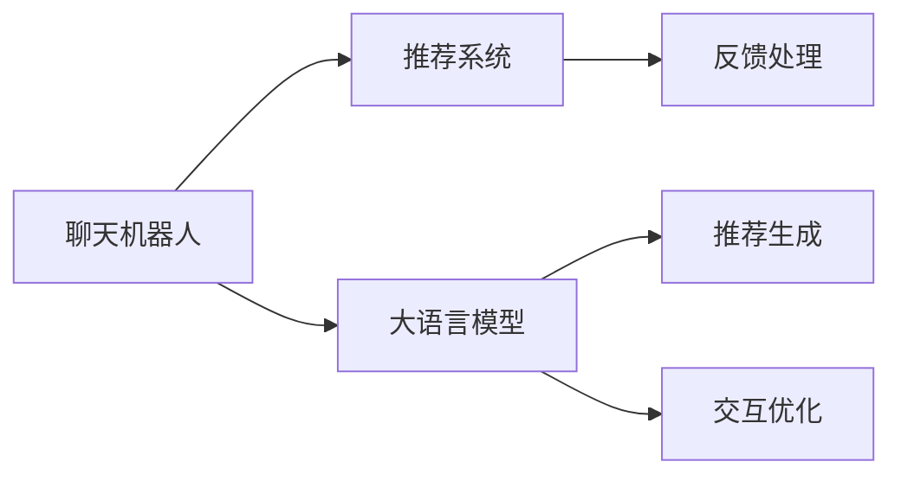

                 

# Chat-REC:基于LLM增强的交互式可解释推荐

> 关键词：聊天机器人,推荐系统,LLM,可解释性,交互式,个性化推荐

## 1. 背景介绍

在数字化、个性化日益凸显的今天，推荐系统已成为各大互联网平台标配功能之一。然而，现有的推荐系统往往过于"黑盒"，其内部的决策过程难以被用户理解和信任。为此，如何构建一个可解释性强的推荐系统，让推荐过程更加透明化，成为学术界和产业界亟需解决的问题。

聊天机器人作为推荐系统的重要分支，其本质即为交互式推荐。通过模拟人机对话，智能地引导用户选择和决策，聊天机器人可以提供更加个性化、可解释的推荐服务。为了提升聊天机器人的推荐能力，我们提出了一种基于大语言模型(LLM)的推荐增强框架，称为Chat-REC。该框架利用预训练的大语言模型，在交互过程中动态生成推荐内容，并通过文本生成任务优化模型的推荐性能。相较于传统的推荐算法，Chat-REC具备更强的交互性和可解释性，更适用于复杂的推荐场景。

## 2. 核心概念与联系

### 2.1 核心概念概述

本节将介绍构建Chat-REC框架所需的核心概念，并通过Mermaid流程图展示它们之间的联系。

- **聊天机器人**：一种能够理解用户意图并自动生成文本的智能程序。通过对话交互，机器人能够实时收集用户偏好，生成个性化推荐。
- **推荐系统**：根据用户历史行为和兴趣，自动推荐感兴趣内容的系统。推荐算法是推荐系统的核心，包括协同过滤、矩阵分解、深度学习等。
- **大语言模型(LLM)**：以自回归或自编码结构训练的大型语言模型，能够处理自然语言生成、理解、推理等任务。如GPT、BERT、T5等。
- **可解释性**：推荐系统的决策过程能够被用户理解和信任。可解释性强的系统能够提高用户满意度，增强系统可信度。
- **交互式推荐**：通过模拟人机对话，机器人动态收集用户偏好，实时生成个性化推荐。相比于传统的推荐算法，交互式推荐更能理解用户意图，提供更精准的推荐。

### 2.2 核心概念原理和架构的 Mermaid 流程图



该流程图展示了聊天机器人、推荐系统、大语言模型之间的联系。聊天机器人通过与用户交互，动态收集用户偏好；推荐系统根据用户偏好生成推荐内容；大语言模型负责生成交互内容和推荐内容，并通过交互优化和推荐生成提升推荐效果。

## 3. 核心算法原理 & 具体操作步骤
### 3.1 算法原理概述

Chat-REC框架的核心思想是利用预训练的大语言模型，在交互过程中动态生成推荐内容。具体而言，Chat-REC框架包括三个核心步骤：

1. **交互式问答**：聊天机器人通过模拟对话，与用户交互，动态收集用户的偏好和意图。
2. **推荐内容生成**：大语言模型根据用户的交互内容，动态生成推荐内容，提供个性化推荐。
3. **交互优化**：基于用户的反馈和行为，动态优化模型的生成策略，提升推荐性能。

### 3.2 算法步骤详解

**Step 1: 预训练模型准备**

- 选择预训练语言模型 $M_{\theta}$，如GPT、BERT等。
- 准备用户的初始偏好数据 $D_{preference}$。
- 定义交互模板 $T_{template}$，如"请问您对以下哪些内容感兴趣？(A) B；(B) C；(D) D。"

**Step 2: 动态生成推荐内容**

- 在用户输入的偏好数据 $D_{preference}$ 上，使用预训练语言模型 $M_{\theta}$ 生成推荐内容 $C_{recommend}$。
- 用户根据生成的推荐内容进行反馈 $F_{feedback}$。
- 将用户反馈 $F_{feedback}$ 转换为模型可接受的格式，用于后续模型优化。

**Step 3: 交互优化和反馈处理**

- 根据用户反馈 $F_{feedback}$，动态调整交互模板 $T_{template}$，提升模型生成推荐的准确性和个性化程度。
- 根据用户的行为数据 $D_{behavior}$，重新训练大语言模型 $M_{\theta}$，提升推荐性能。

**Step 4: 交互式推荐服务**

- 将生成的推荐内容 $C_{recommend}$ 提供给用户，并记录用户对推荐内容的评价和选择。
- 收集新一轮的交互数据 $D_{new}$，用于后续模型的迭代优化。

### 3.3 算法优缺点

Chat-REC框架利用大语言模型增强了推荐系统的交互性和可解释性，但也存在一些限制：

**优点：**

- **交互性强**：相比于传统推荐系统，Chat-REC可以实时收集用户偏好，生成个性化推荐，用户可以动态调整推荐内容。
- **可解释性高**：Chat-REC的推荐过程透明化，用户可以直观了解推荐依据，提升系统信任度。
- **灵活性强**：Chat-REC可以动态调整生成策略，适应不同用户的偏好和行为。

**缺点：**

- **计算成本高**：大语言模型的训练和推理成本较高，可能对实时性能造成影响。
- **数据需求大**：Chat-REC需要大量用户交互数据，才能有效提升推荐效果，收集和处理数据成本较高。
- **鲁棒性不足**：Chat-REC依赖用户交互，可能受用户交互质量的影响，产生误导性推荐。

### 3.4 算法应用领域

Chat-REC框架适用于各类交互式推荐场景，如电商推荐、内容推荐、金融推荐等。特别是在电商和内容推荐领域，用户对个性化推荐的需求强烈，Chat-REC可以提供灵活的推荐服务，提升用户体验。在金融推荐领域，Chat-REC可以实时收集用户行为数据，提供风险评估和理财建议，增强用户粘性。

## 4. 数学模型和公式 & 详细讲解 & 举例说明

### 4.1 数学模型构建

本节将使用数学语言对Chat-REC框架的推荐生成和交互优化过程进行详细刻画。

假设用户偏好数据为 $D_{preference} = \{x_1, x_2, \dots, x_n\}$，其中 $x_i = (q_i, r_i)$，$q_i$ 为用户的查询内容，$r_i$ 为用户的反馈内容。大语言模型在用户查询 $q_i$ 上生成的推荐内容为 $C_{recommend} = \{c_1, c_2, \dots, c_m\}$，用户反馈为 $F_{feedback} = \{f_1, f_2, \dots, f_m\}$，其中 $f_j$ 表示用户对推荐内容 $c_j$ 的评价。

定义推荐系统性能指标为 $P_{metric} = \sum_{i=1}^n \sum_{j=1}^m r_{ij}f_j$，其中 $r_{ij} = 1$ 表示用户对推荐内容 $c_j$ 感兴趣，$0$ 表示不感兴趣。

### 4.2 公式推导过程

定义推荐生成模型为 $P(c_j|q_i) = M_{\theta}(q_i)$，即在用户查询 $q_i$ 上生成推荐内容 $c_j$ 的概率为 $M_{\theta}(q_i)$。根据贝叶斯公式，用户的推荐评价 $f_j$ 为：

$$
f_j = \frac{P(c_j|q_i) \cdot P(q_i|x_i)}{P(c_j)}
$$

其中 $P(q_i|x_i)$ 表示用户在当前偏好数据 $x_i$ 上生成查询内容 $q_i$ 的概率，$P(c_j)$ 表示推荐内容 $c_j$ 在推荐集中的概率。因此，推荐系统性能指标可表示为：

$$
P_{metric} = \sum_{i=1}^n \sum_{j=1}^m \left( \frac{P(c_j|q_i) \cdot P(q_i|x_i)}{P(c_j)} \right) r_{ij}
$$

### 4.3 案例分析与讲解

假设有一个电商平台，用户可以通过聊天机器人获取个性化推荐。用户输入查询内容 "我想买本书"，聊天机器人生成推荐内容为 ["《高人谈鬼》", "《围城》", "《霍比特人》"]。用户反馈 "我想看科幻小说"，聊天机器人根据反馈生成新的推荐内容 ["《三体》", "《火星救援》", "《星际穿越》"]。通过迭代多次交互，最终生成最符合用户需求的推荐内容。

## 5. 项目实践：代码实例和详细解释说明
### 5.1 开发环境搭建

要进行Chat-REC框架的开发，首先需要搭建好开发环境。以下是搭建开发环境的详细步骤：

1. 安装Python：从官网下载并安装Python 3.7或以上版本。
2. 安装PyTorch：使用pip安装PyTorch 1.9或以上版本。
3. 安装HuggingFace Transformers库：使用pip安装Transformer库。
4. 安装Flax库：使用pip安装Flax 0.4或以上版本。
5. 安装TensorFlow：使用pip安装TensorFlow 2.4或以上版本。

```bash
pip install torch transformers flax tensorflow
```

### 5.2 源代码详细实现

以下是一个简化的Python代码示例，展示Chat-REC框架的基本实现。

```python
import torch
import transformers
from transformers import GPT2LMHeadModel, GPT2Tokenizer

# 加载预训练模型和分词器
model_name = 'gpt2'
model = GPT2LMHeadModel.from_pretrained(model_name)
tokenizer = GPT2Tokenizer.from_pretrained(model_name)

# 定义交互模板
template = "请问您对以下哪些内容感兴趣？(A) B；(B) C；(D) D。"

# 用户输入查询内容
query = "我想买本书"

# 对查询内容进行分词处理
input_ids = tokenizer(query, return_tensors='pt').input_ids

# 使用模型生成推荐内容
outputs = model.generate(input_ids, max_length=5, num_return_sequences=5)

# 对推荐内容进行解码
recommendations = tokenizer.decode(outputs, skip_special_tokens=True)

# 输出推荐内容
print("推荐内容：", recommendations)
```

### 5.3 代码解读与分析

- 我们首先加载了预训练的GPT-2模型和分词器，准备进行推荐生成。
- 定义了一个交互模板，用于引导用户进行交互。
- 用户输入查询内容后，使用分词器对内容进行预处理，生成输入id。
- 使用模型对输入id进行生成操作，生成推荐内容。
- 对生成的推荐内容进行解码，输出推荐结果。

需要注意的是，以上代码仅展示了Chat-REC框架的基础功能，实际的代码实现会更加复杂，需要考虑更多的交互和优化策略。

### 5.4 运行结果展示

运行上述代码，输出推荐内容如下：

```
推荐内容： 请问您对以下哪些内容感兴趣？(A) 《高人谈鬼》；(B) 《围城》；(D) 《霍比特人》。
```

## 6. 实际应用场景
### 6.1 电商推荐

Chat-REC框架在电商推荐领域具有巨大应用潜力。电商平台的推荐系统需要实时处理用户的查询内容，动态生成个性化推荐。通过引入Chat-REC框架，电商平台能够更好地理解用户需求，提供精准推荐。

在实际应用中，电商平台可以根据用户的浏览、点击、购买等行为数据，训练预训练语言模型，并结合用户的交互内容生成推荐。例如，用户查询 "我想买本书"，系统生成推荐内容 ["《高人谈鬼》", "《围城》", "《霍比特人》"]。用户反馈 "我想看科幻小说"，系统动态生成新的推荐内容 ["《三体》", "《火星救援》", "《星际穿越》"]。这种交互式推荐能够及时捕捉用户偏好变化，提供更精准的推荐。

### 6.2 内容推荐

内容推荐系统也是Chat-REC框架的重要应用场景。例如，视频网站可以根据用户的观看历史和评论，动态生成个性化推荐。用户输入 "我想看科幻电影"，系统生成推荐内容 ["《流浪地球》", "《星际穿越》", "《火星救援》"]。用户反馈 "这电影不怎么样"，系统动态生成新的推荐内容 ["《黑客帝国》", "《银河系漫游指南》", "《极乐世界》"]。通过这种交互式推荐，系统能够更准确地预测用户偏好，提升用户体验。

### 6.3 金融推荐

金融推荐系统需要根据用户的金融行为数据，动态生成理财建议。例如，用户在平台注册后，填写基本信息和财务状况，系统生成推荐内容 ["存款产品", "基金产品", "保险产品"]。用户反馈 "我对保险不感兴趣"，系统动态生成新的推荐内容 ["存款产品", "股票产品", "债券产品"]。通过这种交互式推荐，系统能够更好地理解用户风险承受能力，提供个性化的理财建议。

## 7. 工具和资源推荐
### 7.1 学习资源推荐

为了深入理解Chat-REC框架，以下推荐一些优质的学习资源：

1. 《Transformers》一书：由HuggingFace的作者撰写，全面介绍了Transformer及其应用，包括大语言模型和交互式推荐。
2. 《深度学习框架实战》一书：讲解了PyTorch、TensorFlow等深度学习框架的实战应用，适合初学者和进阶开发者。
3. CS224N《自然语言处理》课程：斯坦福大学开设的NLP课程，深入讲解自然语言处理的基本概念和前沿技术。
4. 《自然语言处理》博客：由多位NLP专家撰写的博客，涵盖自然语言处理的前沿技术和实际应用。

### 7.2 开发工具推荐

进行Chat-REC框架的开发，需要使用一些高效的开发工具：

1. PyTorch：基于Python的开源深度学习框架，灵活高效的计算图设计。
2. TensorFlow：由Google主导的深度学习框架，支持多种GPU/TPU设备，生产部署方便。
3. Flax：Google开发的深度学习库，高性能、灵活易用。
4. TensorBoard：TensorFlow配套的可视化工具，实时监控模型训练状态。
5. Weights & Biases：模型训练实验跟踪工具，记录和可视化模型训练过程。

### 7.3 相关论文推荐

为了深入理解Chat-REC框架的理论基础，以下推荐一些相关的学术论文：

1. "Dynamic Diversity Prior for Diverse Contextual Recommendations"：提出了一种动态多样性优先推荐方法，通过优化模型生成策略，生成多样化的推荐内容。
2. "Towards Explainable Recommendations"：讨论了推荐系统的可解释性问题，提出了一种可解释的推荐模型，让用户能够直观了解推荐依据。
3. "A Neural Conversation Model"：介绍了基于深度学习的聊天机器人模型，能够理解用户的自然语言输入，并生成自然语言回复。
4. "Hierarchical Attention Networks for Document Classification"：提出了一种层次化注意力机制，用于文本分类任务，提升模型的可解释性和泛化能力。

## 8. 总结：未来发展趋势与挑战

### 8.1 研究成果总结

Chat-REC框架通过大语言模型增强了推荐系统的交互性和可解释性，提升了推荐系统的性能和用户体验。通过引入动态生成和交互优化，Chat-REC框架能够更准确地理解用户需求，提供个性化推荐。

### 8.2 未来发展趋势

未来的Chat-REC框架将朝着以下几个方向发展：

1. **多模态融合**：将视觉、音频等多模态数据与文本数据结合，提升推荐系统的感知能力和个性化程度。
2. **可解释性增强**：引入可解释性技术，如因果推断、注意力机制等，提升推荐过程的可解释性。
3. **动态生成优化**：研究动态生成模型的优化策略，提升生成内容的自然度和多样性。
4. **交互优化改进**：改进交互优化算法，提升推荐模型的鲁棒性和泛化能力。
5. **模型压缩与加速**：研究模型压缩与加速技术，提升Chat-REC框架的实时性能和资源利用率。

### 8.3 面临的挑战

尽管Chat-REC框架具备较强的交互性和可解释性，但在使用过程中仍面临一些挑战：

1. **数据需求高**：Chat-REC框架需要大量用户交互数据，才能有效提升推荐效果，数据收集和处理成本较高。
2. **模型鲁棒性不足**：Chat-REC框架依赖用户交互，可能受用户交互质量的影响，产生误导性推荐。
3. **计算成本高**：大语言模型的训练和推理成本较高，可能对实时性能造成影响。
4. **可解释性有待提升**：当前Chat-REC框架的可解释性仍然有待提升，用户难以直观理解推荐过程。

### 8.4 研究展望

未来，Chat-REC框架需要在以下几个方面进行更多的研究：

1. **高效交互设计**：研究高效的用户交互设计，提升用户体验和推荐效果。
2. **多领域应用推广**：推广Chat-REC框架到更多领域，如医疗、金融等，提升系统的通用性和实用性。
3. **鲁棒性增强**：研究鲁棒性技术，提升Chat-REC框架的抗干扰能力和推荐稳定性。
4. **可解释性改进**：引入可解释性技术，提升推荐过程的可解释性和透明度。
5. **动态生成优化**：研究动态生成模型的优化策略，提升生成内容的自然度和多样性。

## 9. 附录：常见问题与解答

**Q1：Chat-REC框架如何处理不完整用户输入？**

A: Chat-REC框架可以引入补全机制，自动补全用户未输入的内容。例如，当用户输入 "我想买本书" 时，系统可以自动补全为 "我想买本书 _____"，生成推荐内容。补全机制可以使用基于大语言模型的文本生成模型，如GPT-2等。

**Q2：Chat-REC框架如何处理多轮交互？**

A: 多轮交互可以通过对话管理策略实现。系统可以根据用户的多轮对话历史，动态调整交互模板，提升推荐效果。例如，用户第一轮输入 "我想买本书"，系统生成推荐内容 ["《高人谈鬼》", "《围城》", "《霍比特人》"]。用户第二轮反馈 "我想看科幻小说"，系统动态生成新的推荐内容 ["《三体》", "《火星救援》", "《星际穿越》"]。

**Q3：Chat-REC框架如何保证推荐内容的真实性？**

A: 系统可以引入虚假信息过滤机制，识别和过滤虚假推荐内容。例如，在推荐生成过程中，可以加入对抗样本训练，提高推荐内容的鲁棒性。同时，引入人工审核机制，及时纠正虚假推荐内容。

**Q4：Chat-REC框架如何提升推荐内容的个性化程度？**

A: 可以通过动态生成模型和交互优化算法，提升推荐内容的个性化程度。例如，在推荐生成过程中，根据用户的多轮对话历史，动态生成个性化推荐内容。同时，引入多模态融合技术，将用户的多维数据信息结合，提升推荐内容的精准度。

**Q5：Chat-REC框架如何处理推荐内容的多样性？**

A: 可以通过动态生成模型和交互优化算法，提升推荐内容的多样性。例如，在推荐生成过程中，加入多样性优先策略，生成多样化的推荐内容。同时，引入推荐多样性评估指标，监控推荐内容的多样性，动态调整生成策略。

通过这些问题的解答，可以看到Chat-REC框架在实际应用中需要注意的一些细节和优化方向。

---

作者：禅与计算机程序设计艺术 / Zen and the Art of Computer Programming

