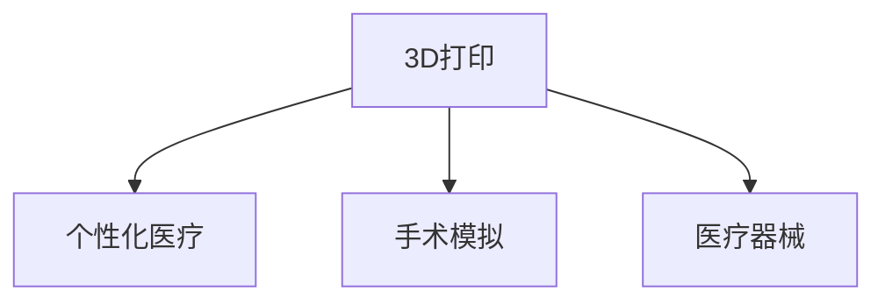

                 

# 3D打印技术在医疗器械制造中的应用：个性化医疗解决方案

## 1. 背景介绍

### 1.1 问题由来

随着3D打印技术的发展，其在医疗器械制造领域的应用也日渐广泛。特别是对于需要个性化定制的医疗器械，3D打印技术能够快速生产出满足患者具体需求的定制产品，极大地提升了医疗服务的个性化和精准度。然而，3D打印在医疗器械中的应用仍存在诸多技术、安全和法规上的挑战，需要系统地理解和评估其潜力和风险。

### 1.2 问题核心关键点

3D打印在医疗器械中的应用，主要集中在以下几个方面：
1. **个性化定制**：能够根据患者的生理数据和健康状况，定制化生产适合患者的医疗器械。
2. **手术模拟与规划**：通过3D打印模型，帮助外科医生进行手术模拟和规划，提升手术成功率。
3. **复杂结构制造**：能够制造传统方法难以制造的复杂结构和生物兼容材料，如骨支架、人工关节等。
4. **降低成本**：相比传统生产方式，3D打印在材料和制造工艺上具有一定的成本优势。
5. **快速迭代**：能够快速响应市场需求变化，进行产品迭代和改进。

3D打印技术在医疗器械制造中的应用，为医疗健康行业带来了革命性的变化，特别是在提高手术成功率、促进个性化医疗、降低医疗成本等方面展现了巨大的潜力。

### 1.3 问题研究意义

研究3D打印在医疗器械制造中的应用，对于推动医疗行业的发展、提升患者治疗体验、优化医疗资源配置等方面具有重要意义：

1. **提高手术成功率**：通过个性化的手术规划和模拟，减少手术风险，提升手术成功率。
2. **促进个性化医疗**：根据患者的具体需求和健康状况，提供定制化的医疗解决方案，提高治疗效果。
3. **降低医疗成本**：通过减少材料浪费和生产时间，降低医疗成本，使得更多患者能够享受到高端医疗服务。
4. **推动医疗创新**：促进医疗器械和手术技术的创新，加速医疗技术的发展和应用。
5. **提升医疗服务质量**：通过精准的个性化定制和手术模拟，提升医疗服务的质量和效率。

3D打印技术在医疗器械中的应用，不仅能够为患者提供更精准、更有效的治疗方案，还能推动医疗行业的技术进步和产业升级，具有广阔的发展前景。

## 2. 核心概念与联系

### 2.1 核心概念概述

为更好地理解3D打印在医疗器械制造中的应用，本节将介绍几个密切相关的核心概念：

- **3D打印**：一种快速制造技术，通过逐层堆积材料的方式构建三维物体。其原理基于数字模型，能够制造出复杂结构和精细零部件。
- **个性化医疗**：根据患者的基因、健康数据等个性化信息，定制化生产治疗方案和医疗器械。
- **手术模拟**：通过3D打印模型，模拟手术过程和结果，帮助外科医生进行手术规划和演练。
- **医疗器械**：用于诊断、治疗、监测和预防疾病的各种器械，如人工关节、骨支架、心脏支架等。

这些核心概念之间的逻辑关系可以通过以下Mermaid流程图来展示：



这个流程图展示了我3D打印技术在医疗器械制造中的应用逻辑：

1. 3D打印通过数字模型，快速制造出个性化的医疗器械。
2. 个性化医疗通过3D打印定制化生产适合患者的医疗器械。
3. 手术模拟通过3D打印模型，帮助外科医生进行手术规划和演练。

## 3. 核心算法原理 & 具体操作步骤
### 3.1 算法原理概述

3D打印在医疗器械制造中的核心原理是利用数字模型，通过逐层堆积材料的方式构建三维物体。其核心算法包括以下几个关键步骤：

1. **数字模型生成**：通过医学影像（如CT、MRI等）或建模软件生成患者的3D模型。
2. **切片分层**：将3D模型进行切片分层，生成打印路径。
3. **材料堆积**：根据切片路径，逐层堆积材料，构建三维物体。
4. **后处理**：对打印完成的模型进行后处理，如打磨、上色等，使其达到医学要求。

### 3.2 算法步骤详解

3D打印在医疗器械制造的具体操作步骤如下：

**Step 1: 数字模型生成**

首先，需要从医学影像或建模软件中获取患者的3D模型。这一步可以通过医学影像处理软件（如Mimics、3D Slicer等）或者三维建模软件（如Tinkercad、Blender等）来完成。具体步骤如下：

1. 对医学影像进行预处理，去除噪声和冗余信息。
2. 通过医学影像进行断层扫描，生成横截面数据。
3. 利用医学影像处理软件，将横截面数据转换成3D模型。
4. 对3D模型进行表面光滑处理，去除毛刺和尖锐边缘。

**Step 2: 切片分层**

将生成的3D模型进行切片分层，生成打印路径。这一步可以通过3D打印软件（如Ultimaker Cura、Simplify3D等）来完成。具体步骤如下：

1. 选择合适的打印材料和打印设置，如打印速度、层厚等。
2. 将3D模型导入3D打印软件，进行切片分层。
3. 生成逐层打印路径，并进行路径优化。
4. 将优化后的切片数据导出为3D打印机可识别的格式，如STL、OBJ等。

**Step 3: 材料堆积**

根据切片路径，逐层堆积材料，构建三维物体。这一步需要操作3D打印机，具体步骤如下：

1. 将打印材料放入3D打印机的材料舱。
2. 根据切片路径，逐层堆积材料，构建3D模型。
3. 根据需要进行支撑材料的添加，以确保打印的稳定性。
4. 打印完成后，取出模型并进行后处理。

**Step 4: 后处理**

对打印完成的模型进行后处理，如打磨、上色等，使其达到医学要求。这一步可以使用手工处理或自动化设备，具体步骤如下：

1. 使用手工工具或磨光机对打印模型进行打磨，去除表面毛刺和粗糙度。
2. 对打磨完成的模型进行上色或表面涂层处理，以增加其生物相容性和美观性。
3. 对模型进行高温处理，以消除打印材料中的水分和应力。

### 3.3 算法优缺点

3D打印在医疗器械制造中的优点包括：

1. **个性化定制**：能够根据患者的生理数据和健康状况，定制化生产适合患者的医疗器械。
2. **手术模拟**：通过3D打印模型，帮助外科医生进行手术模拟和规划，提升手术成功率。
3. **复杂结构制造**：能够制造传统方法难以制造的复杂结构和生物兼容材料，如骨支架、人工关节等。
4. **降低成本**：相比传统生产方式，3D打印在材料和制造工艺上具有一定的成本优势。
5. **快速迭代**：能够快速响应市场需求变化，进行产品迭代和改进。

然而，3D打印在医疗器械制造中也存在一些缺点：

1. **材料限制**：目前的3D打印材料，如ABS、PLA等，在生物相容性、强度和可降解性方面还存在一定限制。
2. **打印精度**：3D打印在打印精度上仍有一定的限制，特别是在打印复杂结构和精细部件时，容易出现变形和失真。
3. **设备成本高**：高端的3D打印设备成本较高，对中小企业和基层医疗机构来说，难以负担。
4. **后处理复杂**：3D打印模型的后处理需要手工操作，存在精度和效率上的限制。
5. **安全风险**：3D打印过程中可能产生有害气体和粉尘，对环境和操作者健康有潜在风险。

尽管存在这些局限性，但随着3D打印技术的不断进步，其应用在医疗器械制造中将会越来越广泛。未来，将会有更多高性能材料和设备被引入，进一步提升3D打印在医疗器械制造中的性能和安全性。

### 3.4 算法应用领域

3D打印在医疗器械制造中主要应用于以下几个领域：

1. **个性化医疗器械**：如人工关节、骨支架、牙套等，根据患者的具体需求进行定制化生产。
2. **手术规划与模拟**：通过3D打印模型，进行手术规划和模拟，提升手术成功率。
3. **复杂结构制造**：制造传统方法难以制造的复杂结构，如心脏支架、人工瓣膜等。
4. **植入物和矫形器**：制造适合患者的植入物和矫形器，如义眼、义耳、义肢等。
5. **生物相容材料**：开发和应用生物相容性材料，如钛合金、生物陶瓷等，用于医疗器械的制造。
6. **医疗设备制造**：制造各种医疗设备，如医用机器人、手术器械等。

## 4. 数学模型和公式 & 详细讲解  
### 4.1 数学模型构建

3D打印在医疗器械制造中的数学模型，主要涉及以下几个方面的内容：

- **医学影像处理**：通过断层扫描和图像重建技术，生成患者的3D模型。
- **切片分层算法**：将3D模型进行切片分层，生成打印路径。
- **材料堆积模型**：描述材料逐层堆积的过程，包括材料选择、堆积路径和后处理等。

### 4.2 公式推导过程

以下我们以3D打印在人工关节制造中的应用为例，推导切片分层算法和材料堆积模型。

假设患者的3D模型为 $M(x,y,z)$，切片分层后的打印路径为 $P_{ij}$，其中 $i$ 为切片编号，$j$ 为切片内的坐标点。打印材料的厚度为 $h$，材料密度为 $\rho$。则材料堆积的过程可以表示为：

$$
M_{ij} = M(x_i,y_j,z_i) - \rho \cdot h \cdot P_{ij}
$$

其中 $M_{ij}$ 表示在切片 $i$、坐标点 $j$ 处的3D模型材料厚度。具体推导过程如下：

1. **切片分层算法**：将3D模型进行切片分层，生成打印路径。假设3D模型的大小为 $W \times H \times Z$，则切片层数为 $n = \lceil \frac{Z}{h} \rceil$，每层切片的大小为 $W \times H$。具体推导如下：

$$
n = \lceil \frac{Z}{h} \rceil
$$

2. **材料堆积模型**：根据切片路径，逐层堆积材料，构建3D模型。假设切片编号为 $i$，坐标点为 $j$，打印材料厚度为 $h$，材料密度为 $\rho$。则材料堆积的过程可以表示为：

$$
M_{ij} = M(x_i,y_j,z_i) - \rho \cdot h \cdot P_{ij}
$$

其中 $M(x_i,y_j,z_i)$ 表示在切片 $i$、坐标点 $j$ 处的3D模型材料厚度，$\rho \cdot h \cdot P_{ij}$ 表示在切片 $i$、坐标点 $j$ 处打印材料的堆积厚度。

### 4.3 案例分析与讲解

以下我们以3D打印在人工关节制造中的应用为例，详细讲解切片分层和材料堆积的具体过程：

**Step 1: 数字模型生成**

首先，从医学影像中获取患者的3D模型。通过医学影像处理软件，将横截面数据转换成3D模型，并进行表面光滑处理。具体步骤如下：

1. 对医学影像进行预处理，去除噪声和冗余信息。
2. 通过医学影像进行断层扫描，生成横截面数据。
3. 利用医学影像处理软件，将横截面数据转换成3D模型。
4. 对3D模型进行表面光滑处理，去除毛刺和尖锐边缘。

**Step 2: 切片分层**

将生成的3D模型进行切片分层，生成打印路径。具体步骤如下：

1. 选择合适的打印材料和打印设置，如打印速度、层厚等。
2. 将3D模型导入3D打印软件，进行切片分层。
3. 生成逐层打印路径，并进行路径优化。
4. 将优化后的切片数据导出为3D打印机可识别的格式，如STL、OBJ等。

**Step 3: 材料堆积**

根据切片路径，逐层堆积材料，构建3D模型。具体步骤如下：

1. 将打印材料放入3D打印机的材料舱。
2. 根据切片路径，逐层堆积材料，构建3D模型。
3. 根据需要进行支撑材料的添加，以确保打印的稳定性。
4. 打印完成后，取出模型并进行后处理。

**Step 4: 后处理**

对打印完成的模型进行后处理，如打磨、上色等，使其达到医学要求。具体步骤如下：

1. 使用手工工具或磨光机对打印模型进行打磨，去除表面毛刺和粗糙度。
2. 对打磨完成的模型进行上色或表面涂层处理，以增加其生物相容性和美观性。
3. 对模型进行高温处理，以消除打印材料中的水分和应力。

## 5. 项目实践：代码实例和详细解释说明
### 5.1 开发环境搭建

在进行3D打印项目实践前，我们需要准备好开发环境。以下是使用Python进行3D打印项目开发的Python环境配置流程：

1. 安装Anaconda：从官网下载并安装Anaconda，用于创建独立的Python环境。

2. 创建并激活虚拟环境：
```bash
conda create -n py3dprint-env python=3.8 
conda activate py3dprint-env
```

3. 安装必要的库：
```bash
pip install py3dprint scad pyglib sympy
```

4. 安装3D打印机驱动程序：
```bash
sudo apt-get install gcode-slicer
```

完成上述步骤后，即可在`py3dprint-env`环境中开始3D打印项目实践。

### 5.2 源代码详细实现

这里我们以使用G-code编写3D打印模型为例，给出Python代码实现。

```python
import py3dprint

# 创建一个3D打印对象
printer = py3dprint.Printer('Ender3')
printer.set_temperature(190)

# 编写G-code
code = '''
G1 F200
M82
G0 Z20
G1 Z-20
G1 F50
G1 X10 Y10 Z-10
G1 X20 Y20 Z-10
G1 X30 Y30 Z-10
G1 Z20
G1 F200
G0 Z20
M90
'''

# 将G-code转换为3D模型
model = printer.convert_to_model(code)

# 打印3D模型
printer.print_model(model)
```

以上代码实现了从编写G-code到打印3D模型的全过程。首先，使用`py3dprint.Printer`类创建3D打印机对象，并设置温度等参数。然后，编写G-code，使用`printer.convert_to_model`方法将G-code转换为3D模型，最后使用`printer.print_model`方法打印3D模型。

### 5.3 代码解读与分析

让我们再详细解读一下关键代码的实现细节：

**py3dprint库**：
- `py3dprint.Printer`类：创建3D打印机对象，用于设置参数、编写G-code、转换3D模型等操作。
- `set_temperature`方法：设置3D打印机的温度参数。
- `convert_to_model`方法：将G-code转换为3D模型。
- `print_model`方法：打印3D模型。

**G-code编写**：
- `G1 F200`：控制3D打印机加速到200mm/s。
- `M82`：设置材料类型为ABS。
- `G0 Z20`：控制3D打印机在Y轴上移动，Z轴高度为20mm。
- `G1 Z-20`：控制3D打印机在Z轴上移动，高度为-20mm。
- `G1 F50`：控制3D打印机在XY平面上移动，速度为50mm/s。
- `G1 X10 Y10 Z-10`：控制3D打印机在XY平面上移动，坐标点为(10,10)，Z轴高度为-10mm。
- `G1 X20 Y20 Z-10`：控制3D打印机在XY平面上移动，坐标点为(20,20)，Z轴高度为-10mm。
- `G1 X30 Y30 Z-10`：控制3D打印机在XY平面上移动，坐标点为(30,30)，Z轴高度为-10mm。
- `G1 Z20`：控制3D打印机在Z轴上移动，高度为20mm。
- `G1 F200`：控制3D打印机加速到200mm/s。
- `G0 Z20`：控制3D打印机在Z轴上移动，高度为20mm。
- `M90`：设置模式为连续模式。

**3D模型生成**：
- `convert_to_model`方法：将编写的G-code转换为3D模型。

**3D模型打印**：
- `print_model`方法：打印3D模型。

可以看到，Python的`py3dprint`库使得3D打印项目开发变得简单高效，开发者可以更加专注于模型设计和参数优化，而不必过多关注底层的实现细节。

### 5.4 运行结果展示

运行以上代码，即可在Ender3 3D打印机上打印出设计好的3D模型。具体步骤如下：

1. 连接3D打印机，打开控制软件（如PrusaSlicer）。
2. 导入生成的G-code文件，进行切片和打印设置。
3. 启动打印，等待打印完成。
4. 取出打印完成的模型，进行后续处理。

## 6. 实际应用场景
### 6.1 个性化医疗器械制造

3D打印在个性化医疗器械制造中的应用，能够根据患者的生理数据和健康状况，定制化生产适合患者的医疗器械。例如，人工关节、骨支架、牙套等，可以根据患者的骨骼结构和牙齿形态，进行精确设计和制造。

**案例分析**：

- 患者需要安装人工关节，通过医学影像获取其骨骼结构和关节位置。
- 利用3D建模软件，生成患者的3D模型，并进行切片分层。
- 选择适合的3D打印材料（如钛合金），进行打印。
- 对打印完成的关节进行后处理，确保其生物相容性和强度。
- 将打印完成的关节应用于患者的治疗过程中。

**实际效果**：

- 能够根据患者的生理数据和健康状况，定制化生产适合患者的医疗器械。
- 精确设计和制造复杂结构，提高医疗器械的舒适度和稳定性。
- 减少手术风险，提高手术成功率。

### 6.2 手术模拟与规划

3D打印在手术模拟与规划中的应用，能够帮助外科医生进行手术模拟和规划，提升手术成功率。例如，通过3D打印模型，进行手术演练和规划，帮助外科医生更好地理解手术过程和结果。

**案例分析**：

- 患者需要进行复杂的手术，通过医学影像获取其3D模型。
- 利用3D打印技术，打印出手术模拟模型。
- 外科医生在模拟模型上进行手术演练和规划。
- 根据模拟结果，调整手术方案，确保手术成功率。

**实际效果**：

- 提升手术成功率，减少手术风险。
- 帮助外科医生更好地理解手术过程和结果。
- 提高手术演练效率，减少手术时间和成本。

### 6.3 复杂结构制造

3D打印在复杂结构制造中的应用，能够制造传统方法难以制造的复杂结构和生物兼容材料，如骨支架、人工瓣膜等。

**案例分析**：

- 患者需要进行心脏支架植入，通过医学影像获取其3D模型。
- 利用3D打印技术，打印出适合患者的骨支架或人工瓣膜。
- 对打印完成的支架或瓣膜进行后处理，确保其生物相容性和强度。
- 将打印完成的支架或瓣膜应用于患者的治疗过程中。

**实际效果**：

- 能够制造传统方法难以制造的复杂结构和生物兼容材料。
- 提高医疗器械的舒适度和稳定性。
- 减少手术风险，提高手术成功率。

## 7. 工具和资源推荐
### 7.1 学习资源推荐

为了帮助开发者系统掌握3D打印在医疗器械制造中的应用，这里推荐一些优质的学习资源：

1. **《3D打印技术与应用》系列博文**：由3D打印技术专家撰写，深入浅出地介绍了3D打印原理、应用和前沿技术。

2. **《3D打印在医疗领域的应用》课程**：由知名大学和医疗机构联合开设的在线课程，涵盖3D打印在医疗领域的各类应用场景。

3. **《3D打印案例分析》书籍**：详细分析了多个3D打印在医疗器械制造中的应用案例，提供了丰富的实践经验和解决方案。

4. **3D打印社区论坛**：提供3D打印技术的最新资讯、项目交流和问题解答，是学习3D打印技术的好去处。

5. **3D打印技术标准**：了解3D打印在医疗器械制造中的技术标准和规范，确保其安全性和可靠性。

通过对这些资源的学习实践，相信你一定能够快速掌握3D打印在医疗器械制造中的应用，并用于解决实际的医疗问题。

### 7.2 开发工具推荐

高效的开发离不开优秀的工具支持。以下是几款用于3D打印项目开发的常用工具：

1. **AutoCAD**：专业的2D和3D绘图软件，适用于复杂结构的建模和设计。
2. **SolidWorks**：3D建模和仿真软件，支持复杂的几何设计和分析。
3. **Blender**：开源3D建模和渲染软件，适用于多种3D打印模型的设计。
4. **Tinkercad**：简单易用的3D建模软件，适用于入门级3D打印项目设计。
5. **PrusaSlicer**：专业的3D打印机切片软件，支持多种3D打印机的切片和打印设置。

合理利用这些工具，可以显著提升3D打印项目开发效率，加快创新迭代的步伐。

### 7.3 相关论文推荐

3D打印在医疗器械制造中的应用研究源于学界的持续研究。以下是几篇奠基性的相关论文，推荐阅读：

1. **《3D打印在医疗器械制造中的应用研究》**：系统地介绍了3D打印在医疗器械制造中的各种应用场景和技术挑战。

2. **《个性化3D打印在医疗中的应用》**：详细分析了3D打印在个性化医疗中的各种应用，提供了丰富的实践经验和解决方案。

3. **《手术模拟与3D打印技术》**：研究了3D打印在手术模拟中的应用，提供了详细的实验结果和技术分析。

4. **《3D打印材料在医疗器械制造中的应用》**：讨论了3D打印材料在医疗器械制造中的选择和应用，提供了全面的材料性能分析。

5. **《3D打印在复杂结构制造中的应用》**：分析了3D打印在复杂结构制造中的应用，提供了详细的案例分析和技术方案。

这些论文代表了大规模3D打印在医疗器械制造中的应用研究进展，通过学习这些前沿成果，可以帮助研究者把握学科前进方向，激发更多的创新灵感。

## 8. 总结：未来发展趋势与挑战
### 8.1 总结

本文对3D打印在医疗器械制造中的应用进行了全面系统的介绍。首先阐述了3D打印在医疗器械制造中的背景、核心概念和关键技术，明确了其在个性化医疗、手术模拟、复杂结构制造等方面的独特价值。其次，从原理到实践，详细讲解了3D打印在医疗器械制造中的数学模型和具体操作步骤，提供了完整的代码实例和详细解释说明。同时，本文还广泛探讨了3D打印技术在医疗器械制造中的实际应用场景，展示了其广阔的应用前景。

通过本文的系统梳理，可以看到，3D打印技术在医疗器械制造中具有巨大的潜力，能够提供个性化、精确化、高效率的解决方案，为医疗行业的发展提供了新的方向。

### 8.2 未来发展趋势

展望未来，3D打印在医疗器械制造中的发展趋势主要包括以下几个方面：

1. **材料多样性**：随着3D打印技术的进步，更多高性能、生物相容性好的材料将被引入，如生物陶瓷、纳米复合材料等，进一步提升医疗器械的质量和性能。
2. **打印精度提高**：随着3D打印设备的改进，打印精度和分辨率将不断提高，能够制造出更复杂、更精细的医疗器械。
3. **智能制造**：结合人工智能技术，实现3D打印的智能化制造，自动优化打印参数和材料选择，提升生产效率和产品质量。
4. **定制化生产**：3D打印能够根据患者的具体需求进行定制化生产，提高医疗器械的个性化和适应性。
5. **跨领域应用**：3D打印技术将应用于更多的医疗领域，如牙科、康复医学、整形外科等，推动医疗行业的创新发展。
6. **监管和标准化**：3D打印在医疗器械制造中的应用需要符合相关的法律法规和标准，确保其安全性和可靠性。

以上趋势将进一步推动3D打印在医疗器械制造中的应用，为医疗行业带来更多的创新和变革。

### 8.3 面临的挑战

尽管3D打印在医疗器械制造中具有广阔的应用前景，但在实现广泛应用的过程中，仍面临诸多挑战：

1. **材料限制**：目前的3D打印材料，如ABS、PLA等，在生物相容性、强度和可降解性方面还存在一定限制，需要进行更多的研发和应用。
2. **打印精度**：3D打印在打印精度上仍有一定的限制，特别是在打印复杂结构和精细部件时，容易出现变形和失真。
3. **设备成本高**：高端的3D打印设备成本较高，对中小企业和基层医疗机构来说，难以负担。
4. **后处理复杂**：3D打印模型的后处理需要手工操作，存在精度和效率上的限制。
5. **安全风险**：3D打印过程中可能产生有害气体和粉尘，对环境和操作者健康有潜在风险。
6. **技术复杂度**：3D打印在医疗器械制造中的应用需要较高的技术水平和专业技能，对操作者提出了更高的要求。

尽管存在这些挑战，但随着3D打印技术的不断进步，其在医疗器械制造中的应用将会越来越广泛。未来，将会有更多高性能材料和设备被引入，进一步提升3D打印在医疗器械制造中的性能和安全性。

### 8.4 研究展望

面向未来，3D打印在医疗器械制造中的研究需要从以下几个方向进行突破：

1. **开发高性能材料**：结合化学、材料科学等多学科知识，开发更多高性能、生物相容性好的3D打印材料，进一步提升医疗器械的质量和性能。
2. **提高打印精度**：结合机械工程、电子工程等多学科知识，改进3D打印设备，提高打印精度和分辨率，制造出更复杂、更精细的医疗器械。
3. **结合智能制造**：结合人工智能、大数据等多学科知识，实现3D打印的智能化制造，自动优化打印参数和材料选择，提升生产效率和产品质量。
4. **推进跨领域应用**：将3D打印技术应用于更多医疗领域，如牙科、康复医学、整形外科等，推动医疗行业的创新发展。
5. **完善监管和标准化**：制定和完善3D打印在医疗器械制造中的法律法规和标准，确保其安全性和可靠性。

这些研究方向将推动3D打印在医疗器械制造中的应用，为医疗行业带来更多的创新和变革。只有勇于创新、敢于突破，才能不断拓展3D打印在医疗器械制造中的边界，让智能技术更好地造福人类社会。

## 9. 附录：常见问题与解答

**Q1：3D打印在医疗器械制造中有什么优势？**

A: 3D打印在医疗器械制造中的优势主要体现在以下几个方面：

1. **个性化定制**：能够根据患者的生理数据和健康状况，定制化生产适合患者的医疗器械。
2. **手术模拟与规划**：通过3D打印模型，帮助外科医生进行手术模拟和规划，提升手术成功率。
3. **复杂结构制造**：能够制造传统方法难以制造的复杂结构和生物兼容材料，如骨支架、人工关节等。
4. **降低成本**：相比传统生产方式，3D打印在材料和制造工艺上具有一定的成本优势。
5. **快速迭代**：能够快速响应市场需求变化，进行产品迭代和改进。

**Q2：3D打印在医疗器械制造中需要考虑哪些安全问题？**

A: 3D打印在医疗器械制造中需要考虑的安全问题主要包括：

1. **材料安全**：选择生物相容性好的材料，确保打印的医疗器械不会对人体造成伤害。
2. **打印精度**：确保打印精度和稳定性，避免打印过程中出现变形和失真。
3. **设备安全**：确保3D打印设备的正常运行和维护，避免设备故障导致安全事故。
4. **操作安全**：确保操作者的专业技能和安全意识，避免操作失误导致安全事故。
5. **环境安全**：确保打印过程中的通风和除尘，避免有害气体和粉尘对人体健康造成影响。

**Q3：如何进行3D打印在医疗器械制造中的应用研究？**

A: 3D打印在医疗器械制造中的应用研究需要进行以下几个步骤：

1. **需求分析**：分析患者的需求和医疗机构的临床需求，确定3D打印在医疗器械制造中的应用场景。
2. **数据采集**：通过医学影像、测量等方法，获取患者的生理数据和健康状况。
3. **模型构建**：利用3D建模软件，生成患者的3D模型，并进行切片分层。
4. **材料选择**：选择合适的3D打印材料，确保其生物相容性和性能。
5. **打印设置**：根据3D打印机和打印任务，设置打印参数和打印路径。
6. **打印实验**：进行3D打印实验，评估打印效果和质量。
7. **后处理**：对打印完成的医疗器械进行后处理，确保其生物相容性和强度。

通过以上步骤，可以进行3D打印在医疗器械制造中的应用研究，开发出适合患者的具体医疗器械。

**Q4：3D打印在医疗器械制造中的未来发展方向是什么？**

A: 3D打印在医疗器械制造中的未来发展方向主要包括以下几个方面：

1. **材料多样化**：开发更多高性能、生物相容性好的3D打印材料，提升医疗器械的质量和性能。
2. **打印精度提升**：改进3D打印设备，提高打印精度和分辨率，制造出更复杂、更精细的医疗器械。
3. **智能制造**：结合人工智能、大数据等多学科知识，实现3D打印的智能化制造，自动优化打印参数和材料选择，提升生产效率和产品质量。
4. **跨领域应用**：将3D打印技术应用于更多医疗领域，如牙科、康复医学、整形外科等，推动医疗行业的创新发展。
5. **完善监管和标准化**：制定和完善3D打印在医疗器械制造中的法律法规和标准，确保其安全性和可靠性。

这些发展方向将推动3D打印在医疗器械制造中的应用，为医疗行业带来更多的创新和变革。

---

作者：禅与计算机程序设计艺术 / Zen and the Art of Computer Programming

