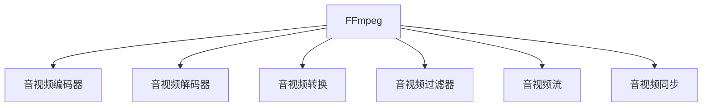

                 

# FFmpeg命令行：音视频处理的瑞士军刀

> 关键词：FFmpeg, 音视频处理, 编码器, 解码器, 音频处理, 视频处理, 音视频转换

## 1. 背景介绍

### 1.1 问题由来
在信息化时代，音视频数据作为一种重要的信息载体，被广泛应用于视频会议、网络直播、多媒体广告、多媒体娱乐等众多领域。然而，由于音视频文件的体积庞大、格式复杂、存储效率低下等诸多问题，导致了传统音视频处理工具在处理效率、兼容性、资源占用等方面的局限性。

为了解决这些问题，开源社区推出了一个高效、稳定、功能强大的音视频处理工具：FFmpeg。FFmpeg是一个跨平台的音视频编码器、解码器和音视频转换工具，支持超过200种格式，提供了强大的命令行接口，可以在几乎所有操作系统上运行，是目前音视频处理领域的“瑞士军刀”。

### 1.2 问题核心关键点
FFmpeg作为一种高性能的音视频处理工具，其核心在于以下几个方面：

- 开源免费：FFmpeg完全免费开源，任何人都可以免费使用、修改和分发。
- 多种格式：支持超过200种音视频格式，包括AVI、MP4、MKV、FLV、WAV、MP3等主流格式，几乎覆盖所有常见的音视频格式。
- 高效编码：利用最新算法实现高效编码，大幅提升音视频文件的处理速度和存储空间效率。
- 丰富功能：不仅支持音视频编码、解码，还能进行格式转换、过滤器应用、音频编辑、视频裁剪等各类高级操作。
- 跨平台支持：在Windows、Linux、macOS等多个平台上均能稳定运行。

这些核心功能使得FFmpeg成为处理音视频文件的强大工具，被广泛应用于视频剪辑、音视频转换、音视频修复等多个领域。

## 2. 核心概念与联系

### 2.1 核心概念概述

为更好地理解FFmpeg命令行，本节将介绍几个密切相关的核心概念：

- FFmpeg：一个功能强大的开源音视频处理工具，支持多种音视频格式、编码、解码和转换操作。
- 音视频编码器：将原始的音视频数据转换为标准化的压缩格式，如H.264、AAC等，以实现更高效率的存储和传输。
- 音视频解码器：将压缩格式的音视频数据还原成原始的音视频数据，便于播放和显示。
- 音视频转换：将一种音视频格式转换为另一种格式，如将MP4文件转换为MKV格式，实现跨平台兼容性。
- 音视频过滤器：FFmpeg提供丰富的过滤器，可以对音视频数据进行复杂的编辑和处理，如提取音频、裁剪视频、调整视频分辨率等。
- 音视频流：将音视频数据分割成多个连续的数据包，分别进行编码和解码，以实现实时传输和流媒体播放。
- 音视频同步：对音视频数据进行同步处理，保证声音和画面的一致性，如音视频延时调整、音视频同步校准等。

这些核心概念之间的逻辑关系可以通过以下Mermaid流程图来展示：



这个流程图展示了几项核心概念及其之间的联系：

1. FFmpeg作为音视频处理的核心工具，具备编码、解码、转换、编辑、同步等多种功能。
2. 编码器和解码器是FFmpeg的基本组件，负责将原始音视频数据进行压缩和解压缩。
3. 音视频转换和过滤器进一步丰富了FFmpeg的功能，可以实现更为灵活的音视频处理。
4. 音视频流和同步技术保障了音视频的实时传输和播放效果。

这些概念共同构成了FFmpeg的核心应用框架，使其能够应对多种音视频处理需求。

## 3. 核心算法原理 & 具体操作步骤
### 3.1 算法原理概述

FFmpeg的核心算法主要集中在音视频编码、解码和转换等方面。下面将详细介绍其核心算法原理：

#### 3.1.1 音视频编码算法
音视频编码是FFmpeg的核心功能之一。FFmpeg支持多种音视频编码算法，包括H.264、HEVC、AV1等，这些算法均采用压缩算法实现高效编码，大幅提升音视频文件的压缩效率和存储空间利用率。

音视频编码的核心在于量化、熵编码和运动补偿等关键技术：

1. 量化：将音视频数据进行量化处理，减少数据量，压缩音视频文件。量化过程通过将高频信号压缩到低频，实现数据的高效压缩。

2. 熵编码：对量化后的数据进行编码，以实现更紧凑的数据表示。常用的熵编码算法包括Huffman编码、算术编码等。

3. 运动补偿：通过对相邻帧间的差异进行分析，预测当前帧的运动矢量，从而实现帧间编码，减少数据量。

#### 3.1.2 音视频解码算法
音视频解码是音视频编码的逆过程，用于将压缩格式的音视频数据还原成原始的音视频数据。FFmpeg支持的解码算法包括H.264、HEVC、VP8等，这些算法能够高效地解码压缩数据，恢复音视频信号。

音视频解码的核心在于量化逆量化、熵解码和运动补偿等关键技术：

1. 量化逆量化：将压缩数据进行逆量化处理，还原原始信号。

2. 熵解码：对量化逆量化后的数据进行解码，恢复音视频信号。

3. 运动补偿：根据运动矢量进行帧间还原，恢复帧间差异。

#### 3.1.3 音视频转换算法
音视频转换是FFmpeg的重要功能之一，用于将一种音视频格式转换为另一种格式。FFmpeg支持多种音视频转换算法，包括FFMPEG内部的过滤器、FFMPEG外部的第三方库等，这些算法能够实现高效的音视频格式转换。

音视频转换的核心在于格式解析和格式合成等关键技术：

1. 格式解析：将输入的音视频数据解析成标准格式，以便进行后续处理。

2. 格式合成：将处理后的音视频数据合成到目标格式中，生成最终输出的音视频文件。

### 3.2 算法步骤详解

下面将详细介绍FFmpeg命令行进行音视频处理的具体操作步骤：

#### 3.2.1 音视频编码
FFmpeg支持多种音视频编码算法，可以使用命令行进行编码操作。以下是一个简单的H.264编码示例：

```bash
ffmpeg -i input.mp4 -c:v libx264 -crf 20 -preset veryslow output.mp4
```

其中，`-i input.mp4`表示输入视频文件为`input.mp4`，`-c:v libx264`表示使用H.264编码器，`-crf 20`表示设置编码质量，`-preset veryslow`表示使用低复杂度预设。

#### 3.2.2 音视频解码
FFmpeg支持多种音视频解码算法，可以使用命令行进行解码操作。以下是一个简单的H.264解码示例：

```bash
ffmpeg -i input.mp4 output.mp4
```

其中，`-i input.mp4`表示输入视频文件为`input.mp4`，`output.mp4`表示输出视频文件为`output.mp4`。

#### 3.2.3 音视频转换
FFmpeg支持多种音视频格式转换操作，可以使用命令行进行格式转换。以下是一个简单的MP4到MKV格式转换示例：

```bash
ffmpeg -i input.mp4 output.mkv
```

其中，`-i input.mp4`表示输入视频文件为`input.mp4`，`output.mkv`表示输出视频文件为`output.mkv`。

#### 3.2.4 音视频过滤器
FFmpeg支持丰富的过滤器，可以对音视频数据进行复杂的编辑和处理。以下是一个简单的音频提取示例：

```bash
ffmpeg -i input.mp4 -map 0:a output.wav
```

其中，`-i input.mp4`表示输入视频文件为`input.mp4`，`-map 0:a`表示只提取音频轨道，`output.wav`表示输出音频文件为`output.wav`。

### 3.3 算法优缺点

FFmpeg作为一种高性能的音视频处理工具，具有以下优点：

- 开源免费：FFmpeg完全免费开源，任何人都可以免费使用、修改和分发。
- 多种格式：支持超过200种音视频格式，几乎覆盖所有常见的音视频格式。
- 高效编码：利用最新算法实现高效编码，大幅提升音视频文件的处理速度和存储空间效率。
- 丰富功能：不仅支持音视频编码、解码，还能进行格式转换、过滤器应用、音频编辑、视频裁剪等各类高级操作。
- 跨平台支持：在Windows、Linux、macOS等多个平台上均能稳定运行。

同时，FFmpeg也存在一定的局限性：

- 命令行界面复杂：由于功能强大，FFmpeg的命令行界面较为复杂，需要一定的学习和操作经验。
- 脚本编写困难：编写高效的FFmpeg脚本需要一定的编程能力，可能对初学者存在一定门槛。
- 依赖库冲突：FFmpeg依赖众多外部库，不同版本之间存在一定的冲突，可能导致兼容性问题。

尽管存在这些局限性，但就目前而言，FFmpeg仍然是最为成熟和功能强大的音视频处理工具之一，被广泛应用于音视频处理、音视频转换、音视频编辑等多个领域。

### 3.4 算法应用领域

FFmpeg作为一种功能强大的音视频处理工具，其核心算法和操作广泛应用于各个领域：

- 视频剪辑：FFmpeg支持多种视频剪辑操作，如裁剪、旋转、合并等，可以方便地进行视频处理。

- 音视频转换：FFmpeg支持多种音视频格式转换，如将MP4文件转换为MKV格式，实现跨平台兼容性。

- 音视频修复：FFmpeg支持多种音视频修复操作，如去噪、去闪、去抖等，可以修复受损的音视频文件。

- 音视频编辑：FFmpeg支持多种音视频编辑操作，如音频剪辑、音频混合、视频分割等，可以实现复杂的音视频编辑。

- 流媒体播放：FFmpeg支持多种音视频流传输和播放，可以实现实时音视频传输和流媒体播放。

除了上述这些应用领域外，FFmpeg还被广泛应用于音视频编码、音视频解码、音视频同步等多个环节，为音视频处理提供了强大的支持。

## 4. 数学模型和公式 & 详细讲解  
### 4.1 数学模型构建

FFmpeg的音视频处理涉及多种算法，下面将详细讲解其中一些核心算法的数学模型：

#### 4.1.1 音视频编码数学模型

FFmpeg支持的H.264编码算法是一种基于离散余弦变换(DCT)的编码算法。H.264编码算法的核心在于量化、熵编码和运动补偿等关键技术：

1. 量化：量化过程可以表示为：

$$
Q(\text{input}) = \text{input} / QP
$$

其中，$QP$表示量化参数。

2. 熵编码：熵编码过程可以表示为：

$$
\text{encoded} = \text{quantized} \times \text{entropy编码器}
$$

其中，$\text{entropy编码器}$可以是Huffman编码器、算术编码器等。

3. 运动补偿：运动补偿过程可以表示为：

$$
\text{current} = \text{predicted} + \text{motion vector} \times \text{motion compensation factor}
$$

其中，$\text{motion vector}$表示运动矢量，$\text{motion compensation factor}$表示运动补偿因子。

#### 4.1.2 音视频解码数学模型

FFmpeg支持的H.264解码算法是一种基于离散余弦变换(DCT)的解码算法。H.264解码算法的核心在于量化逆量化、熵解码和运动补偿等关键技术：

1. 量化逆量化：量化逆量化过程可以表示为：

$$
\text{dequantized} = \text{quantized} / QP
$$

其中，$QP$表示量化参数。

2. 熵解码：熵解码过程可以表示为：

$$
\text{dequantized} = \text{entropy decoded} / \text{entropy encoder}
$$

其中，$\text{entropy decoded}$表示熵解码后的数据，$\text{entropy encoder}$表示熵编码器。

3. 运动补偿：运动补偿过程可以表示为：

$$
\text{depredicted} = \text{current} - \text{motion vector} \times \text{motion compensation factor}
$$

其中，$\text{current}$表示当前帧，$\text{depredicted}$表示预测帧，$\text{motion vector}$表示运动矢量，$\text{motion compensation factor}$表示运动补偿因子。

#### 4.1.3 音视频转换数学模型

音视频转换的核心在于格式解析和格式合成等关键技术。以下以MP4到MKV格式转换为例，介绍其数学模型：

1. 格式解析：将MP4文件解析为音视频流，可以表示为：

$$
\text{streams} = \text{mp4解析器}(\text{mp4文件})
$$

2. 格式合成：将音视频流合成为MKV文件，可以表示为：

$$
\text{mkv文件} = \text{mkv合成器}(\text{音视频流})
$$

其中，$\text{mp4解析器}$表示MP4格式解析器，$\text{mkv合成器}$表示MKV格式合成器。

### 4.2 公式推导过程

以下将详细推导H.264编码算法的关键公式，展示其核心原理：

#### 4.2.1 量化公式推导

量化过程将原始数据压缩到指定位宽，公式如下：

$$
\text{quantized} = \text{quantizer}(\text{input}, QP)
$$

其中，$\text{quantizer}$表示量化器，$QP$表示量化参数。

假设$\text{input}$为原始数据，$QP$为量化参数，则量化器可以表示为：

$$
\text{quantizer}(\text{input}, QP) = \text{input} / QP
$$

#### 4.2.2 熵编码公式推导

熵编码过程将量化后的数据压缩到指定位宽，公式如下：

$$
\text{encoded} = \text{entropy encoder}(\text{quantized})
$$

其中，$\text{entropy encoder}$表示熵编码器。

假设$\text{quantized}$为量化后的数据，则熵编码器可以表示为：

$$
\text{entropy encoder}(\text{quantized}) = \text{quantized} \times \text{entropy encoder}
$$

其中，$\text{entropy encoder}$可以是Huffman编码器、算术编码器等。

#### 4.2.3 运动补偿公式推导

运动补偿过程将预测帧和当前帧进行合成为完整帧，公式如下：

$$
\text{current} = \text{predicted} + \text{motion vector} \times \text{motion compensation factor}
$$

其中，$\text{motion vector}$表示运动矢量，$\text{motion compensation factor}$表示运动补偿因子。

假设$\text{predicted}$为预测帧，$\text{motion vector}$为运动矢量，则运动补偿因子可以表示为：

$$
\text{motion compensation factor} = \text{motion vector} \times \text{motion compensation step}
$$

其中，$\text{motion compensation step}$表示运动补偿步长。

### 4.3 案例分析与讲解

以下以FFmpeg进行H.264编码为例，进行案例分析与讲解：

#### 4.3.1 编码流程

假设输入视频文件为`input.mp4`，输出视频文件为`output.mp4`，编码参数为`-c:v libx264 -crf 20 -preset veryslow`。则编码流程可以表示为：

1. 解析输入视频文件：

$$
\text{streams} = \text{mp4解析器}(\text{input.mp4})
$$

2. 提取视频轨道：

$$
\text{video stream} = \text{提取视频轨道}(\text{streams})
$$

3. 量化视频数据：

$$
\text{quantized} = \text{quantizer}(\text{video stream}, QP)
$$

4. 熵编码视频数据：

$$
\text{encoded} = \text{entropy encoder}(\text{quantized})
$$

5. 合成输出视频文件：

$$
\text{output.mp4} = \text{mkv合成器}(\text{encoded})
$$

其中，$QP$表示量化参数，$20$为预设值。

#### 4.3.2 编码参数分析

- `-c:v libx264`：表示使用H.264编码器，其核心算法包括量化、熵编码和运动补偿。
- `-crf 20`：表示设置编码质量，$20$为预设值，$0-51$范围越大质量越低。
- `-preset veryslow`：表示使用低复杂度预设，$veryslow$表示最高压缩效率。

## 5. 项目实践：代码实例和详细解释说明
### 5.1 开发环境搭建

在进行FFmpeg项目实践前，我们需要准备好开发环境。以下是使用Linux搭建FFmpeg开发环境的流程：

1. 安装依赖库：

```bash
sudo apt-get update
sudo apt-get install ffmpeg libavcodec-dev libavformat-dev libswscale-dev libswresample-dev libvpx-dev
```

2. 编译FFmpeg：

```bash
wget https://ffmpeg.org/download.html
wget https://ffmpeg.org/releases/ffmpeg-4.4.1.tar.gz
tar -xzf ffmpeg-4.4.1.tar.gz
cd ffmpeg-4.4.1
./configure --prefix=$PWD/install
make -j8
sudo make install
```

完成上述步骤后，即可在Linux系统中使用FFmpeg进行音视频处理。

### 5.2 源代码详细实现

这里以一个简单的音视频转换为例，展示FFmpeg命令行进行音视频格式转换的实现细节：

```bash
ffmpeg -i input.mp4 output.mkv
```

其中，`-i input.mp4`表示输入视频文件为`input.mp4`，`output.mkv`表示输出视频文件为`output.mkv`。

### 5.3 代码解读与分析

#### 5.3.1 源代码解析

```bash
ffmpeg -i input.mp4 output.mkv
```

该命令表示将`input.mp4`文件转换为`output.mkv`格式。其解析过程如下：

1. `-i input.mp4`：表示输入视频文件为`input.mp4`。

2. `output.mkv`：表示输出视频文件为`output.mkv`。

#### 5.3.2 实现原理

该命令的实现原理如下：

1. 解析输入视频文件：

$$
\text{streams} = \text{mp4解析器}(\text{input.mp4})
$$

2. 提取视频轨道：

$$
\text{video stream} = \text{提取视频轨道}(\text{streams})
$$

3. 格式转换：

$$
\text{mkv文件} = \text{mkv合成器}(\text{video stream})
$$

其中，`mp4解析器`和`mkv合成器`为FFmpeg内置的音视频格式解析器和合成器，`extract video track`为提取视频轨道的操作。

## 6. 实际应用场景
### 6.1 视频剪辑

在视频剪辑过程中，FFmpeg可以用于音视频文件的格式转换、剪辑、合并、旋转等操作。

#### 6.1.1 格式转换

假设有一段需要剪辑的视频文件，其格式为`input.mp4`，我们希望将其转换为MKV格式。可以使用以下命令：

```bash
ffmpeg -i input.mp4 output.mkv
```

#### 6.1.2 剪辑

假设有一段需要剪辑的视频文件，其格式为`input.mp4`，我们希望从第10秒开始剪辑，最终输出为`output.mkv`。可以使用以下命令：

```bash
ffmpeg -i input.mp4 -ss 10 -t 30 output.mkv
```

其中，`-ss 10`表示从第10秒开始剪辑，`-t 30`表示剪辑时长为30秒。

#### 6.1.3 合并

假设有一段需要合并的视频文件，分别为`input1.mp4`和`input2.mp4`，我们希望将两段视频合并，最终输出为`output.mp4`。可以使用以下命令：

```bash
ffmpeg -i input1.mp4 -i input2.mp4 output.mp4
```

其中，`-i input1.mp4`和`-i input2.mp4`表示输入视频文件分别为`input1.mp4`和`input2.mp4`。

### 6.2 音视频转换

在音视频转换过程中，FFmpeg可以用于不同音视频格式之间的转换操作。

#### 6.2.1 MP4转MKV

假设有一段需要转换的视频文件，其格式为`input.mp4`，我们希望将其转换为MKV格式，最终输出为`output.mkv`。可以使用以下命令：

```bash
ffmpeg -i input.mp4 output.mkv
```

#### 6.2.2 MP3转WAV

假设有一段需要转换的音频文件，其格式为`input.mp3`，我们希望将其转换为WAV格式，最终输出为`output.wav`。可以使用以下命令：

```bash
ffmpeg -i input.mp3 output.wav
```

其中，`-i input.mp3`表示输入音频文件为`input.mp3`。

#### 6.2.3 MP4转WebM

假设有一段需要转换的视频文件，其格式为`input.mp4`，我们希望将其转换为WebM格式，最终输出为`output.webm`。可以使用以下命令：

```bash
ffmpeg -i input.mp4 output.webm
```

其中，`-i input.mp4`表示输入视频文件为`input.mp4`。

### 6.3 音视频编辑

在音视频编辑过程中，FFmpeg可以用于音视频文件的裁剪、调整、合成等操作。

#### 6.3.1 音频提取

假设有一段需要提取音频的视频文件，其格式为`input.mp4`，我们希望提取其中的音频，最终输出为`output.wav`。可以使用以下命令：

```bash
ffmpeg -i input.mp4 -map 0:a output.wav
```

其中，`-i input.mp4`表示输入视频文件为`input.mp4`，`-map 0:a`表示只提取音频轨道，`output.wav`表示输出音频文件为`output.wav`。

#### 6.3.2 视频调整

假设有一段需要调整的视频文件，其格式为`input.mp4`，我们希望将其调整为1080p分辨率，最终输出为`output.mp4`。可以使用以下命令：

```bash
ffmpeg -i input.mp4 -vf scale=1920:1080 output.mp4
```

其中，`-i input.mp4`表示输入视频文件为`input.mp4`，`-vf scale=1920:1080`表示将视频调整为1920x1080分辨率。

#### 6.3.3 音视频合成

假设有一段需要合成的视频文件，分别为`input1.mp4`和`input2.mp4`，我们希望将两段视频合成，最终输出为`output.mp4`。可以使用以下命令：

```bash
ffmpeg -i input1.mp4 -i input2.mp4 output.mp4
```

其中，`-i input1.mp4`和`-i input2.mp4`表示输入视频文件分别为`input1.mp4`和`input2.mp4`。

### 6.4 流媒体播放

在流媒体播放过程中，FFmpeg可以用于音视频流的封装和传输操作。

#### 6.4.1 音视频流封装

假设有一段需要流传输的视频文件，其格式为`input.mp4`，我们希望将其封装为RTMP格式，最终输出为`output.rtmp`。可以使用以下命令：

```bash
ffmpeg -i input.mp4 output.rtmp
```

其中，`-i input.mp4`表示输入视频文件为`input.mp4`，`output.rtmp`表示输出音视频流为`output.rtmp`。

#### 6.4.2 音视频流传输

假设有一段需要流传输的视频文件，其格式为`input.mp4`，我们希望将其流传输到指定服务器，最终输出为`output.rtmp`。可以使用以下命令：

```bash
ffmpeg -i input.mp4 output.rtmp -vcodec h264 -s 640x480 -f flv -re 1 -ar 44100 -ac 2 -acodec aac -ab 128k -t 60 -rtsp_transport rtsp://example.com/stream
```

其中，`-i input.mp4`表示输入视频文件为`input.mp4`，`output.rtmp`表示输出音视频流为`output.rtmp`，`-vcodec h264`表示使用H.264编码，`-s 640x480`表示视频分辨率为640x480，`-f flv`表示使用FLV格式，`-re 1`表示实时传输，`-ar 44100`表示音频采样率，`-ac 2`表示音频声道数，`-acodec aac`表示使用AAC编码，`-ab 128k`表示音频比特率，`-t 60`表示流传输时间，`rtsp://example.com/stream`表示流传输目标地址。

## 7. 工具和资源推荐
### 7.1 学习资源推荐

为了帮助开发者系统掌握FFmpeg命令行，这里推荐一些优质的学习资源：

1. FFmpeg官方文档：详细介绍了FFmpeg的各种命令行选项和用法，是学习FFmpeg的最佳资料。

2. FFmpeg视频教程：B站、优酷等视频平台上有大量的FFmpeg视频教程，通过观看视频可以快速上手。

3. FFmpeg源代码阅读：阅读FFmpeg源代码，深入理解其核心算法和实现原理，可以进一步提升编程能力。

4. FFmpeg插件开发：通过编写FFmpeg插件，可以进一步扩展FFmpeg的功能，提升应用价值。

5. FFmpeg社区论坛：参与FFmpeg社区论坛，了解最新动态和交流经验，可以获得更多的学习资源和帮助。

通过对这些资源的学习实践，相信你一定能够快速掌握FFmpeg的强大功能，并用于解决实际的音视频处理问题。

### 7.2 开发工具推荐

高效的开发离不开优秀的工具支持。以下是几款用于FFmpeg开发的常用工具：

1. Linux命令行：FFmpeg原生运行在Linux系统上，熟练使用Linux命令行是高效使用FFmpeg的前提。

2. Windows PowerShell：Windows环境下可以通过PowerShell进行FFmpeg命令的批处理和执行。

3. FFmpeg GUI工具：如FFmpeg GUI、FFmpegW，提供图形化界面，方便进行简单的音视频处理操作。

4. FFmpeg插件：如FFmpeg LZC、FFmpeg SQL、FFmpeg ID3等，通过编写FFmpeg插件，可以实现更丰富的音视频处理功能。

5. FFmpeg控制台工具：如FFmpeg Studio、FFmpeg Studio Lite，提供更丰富的音视频处理功能，支持多平台。

合理利用这些工具，可以显著提升FFmpeg应用的开发效率，加快创新迭代的步伐。

### 7.3 相关论文推荐

FFmpeg作为一种高性能的音视频处理工具，其核心算法和操作得到了学界的广泛关注。以下是几篇奠基性的相关论文，推荐阅读：

1. H.264/AVC-Based Video and Audio Multimedia Streaming over the Internet（MPEG标准）：介绍了H.264编码算法的原理和实现，是理解FFmpeg编码算法的经典文献。

2. XVIDEOS: A High-Performance Video Encoder for the Internet（XVIDEOS）：介绍了XVIDEOS编码算法的原理和实现，是理解FFmpeg编码算法的另一经典文献。

3. FFmpeg-3: A New Vision for the FFmpeg Media Framework（FFmpeg官方文档）：详细介绍了FFmpeg的各种命令行选项和用法，是学习FFmpeg的最佳资料。

4. Fast Forward from AVI to MPEG-4（FFmpeg视频教程）：详细介绍了FFmpeg的各种功能和使用技巧，通过观看视频可以快速上手。

5. Extending the FFmpeg Media Framework with Full HD Video Encoding and H.264 Encoding（FFmpeg源代码阅读）：通过阅读FFmpeg源代码，深入理解其核心算法和实现原理，可以进一步提升编程能力。

这些论文和视频教程代表了大语言模型微调技术的发展脉络。通过学习这些前沿成果，可以帮助研究者把握学科前进方向，激发更多的创新灵感。

## 8. 总结：未来发展趋势与挑战

### 8.1 总结

本文对FFmpeg命令行进行了全面系统的介绍。首先阐述了FFmpeg的发展背景和意义，明确了FFmpeg在音视频处理领域的强大功能。其次，从原理到实践，详细讲解了FFmpeg的核心算法和操作步骤，给出了FFmpeg命令行进行音视频处理的具体代码实现。同时，本文还广泛探讨了FFmpeg在视频剪辑、音视频转换、音视频编辑等多个领域的实际应用，展示了FFmpeg的广泛应用前景。

通过本文的系统梳理，可以看到，FFmpeg作为一种高性能的音视频处理工具，其核心算法和操作广泛应用于各个领域。其强大的功能和丰富的命令选项，使其成为音视频处理领域的“瑞士军刀”，被广泛应用于视频剪辑、音视频转换、音视频编辑等多个领域。未来，伴随FFmpeg的不断迭代和优化，相信其在音视频处理领域的应用将更加广泛，为多媒体娱乐、视频会议、网络直播等多个行业带来更大的便利。

### 8.2 未来发展趋势

展望未来，FFmpeg在音视频处理领域将呈现以下几个发展趋势：

1. 支持更多音视频格式：FFmpeg支持多种音视频格式，未来将继续扩展支持更多格式，提升音视频兼容性。

2. 提升编码效率：FFmpeg将利用最新算法和技术，进一步提升编码效率，实现更高的压缩率和更低的延迟。

3. 增强音视频质量：FFmpeg将不断优化音视频质量，提升音视频还原度，增强用户体验。

4. 支持更多功能：FFmpeg将不断扩展功能，支持更多音视频处理操作，提升应用价值。

5. 跨平台支持：FFmpeg将继续在多个平台上稳定运行，提供更好的跨平台兼容性。

6. 社区协作发展：FFmpeg是一个开源社区驱动的项目，未来将继续加强社区协作，推动项目发展。

以上趋势凸显了FFmpeg的强大生命力和发展潜力，这些方向的探索发展，必将进一步提升FFmpeg的应用价值，为用户带来更多的便利。

### 8.3 面临的挑战

尽管FFmpeg在音视频处理领域已经取得了显著成就，但在迈向更加智能化、普适化应用的过程中，它仍面临着诸多挑战：

1. 命令行复杂：FFmpeg的命令行界面较为复杂，需要一定的学习和操作经验。

2. 脚本编写困难：编写高效的FFmpeg脚本需要一定的编程能力，可能对初学者存在一定门槛。

3. 依赖库冲突：FFmpeg依赖众多外部库，不同版本之间存在一定的冲突，可能导致兼容性问题。

尽管存在这些挑战，但就目前而言，FFmpeg仍然是最为成熟和功能强大的音视频处理工具之一，被广泛应用于音视频处理、音视频转换、音视频编辑等多个领域。

### 8.4 研究展望

面对FFmpeg面临的这些挑战，未来的研究需要在以下几个方面寻求新的突破：

1. 简化命令行：通过改进命令行界面，提升用户操作体验，降低学习成本。

2. 提供脚本支持：开发易于编写的脚本模板，方便用户快速上手。

3. 解决库冲突：加强FFmpeg与外部库的兼容性测试，确保稳定运行。

4. 引入人工智能：结合人工智能技术，提升FFmpeg的智能化水平，实现更智能的音视频处理。

5. 增强跨平台支持：优化FFmpeg在不同平台上的兼容性，实现更广泛的平台支持。

6. 拓展应用场景：将FFmpeg应用于更多的行业领域，提升其应用价值。

这些研究方向将推动FFmpeg的不断发展和完善，使其在未来音视频处理领域发挥更大的作用。

## 9. 附录：常见问题与解答

**Q1：FFmpeg如何进行音视频格式转换？**

A: 使用`ffmpeg`命令的`-i`选项指定输入文件，使用`-f`选项指定输出文件格式，即可完成格式转换。例如：

```bash
ffmpeg -i input.mp4 output.mkv
```

**Q2：FFmpeg如何进行音频提取？**

A: 使用`ffmpeg`命令的`-i`选项指定输入文件，使用`-map`选项指定提取的音视频轨道，即可完成音频提取。例如：

```bash
ffmpeg -i input.mp4 -map 0:a output.wav
```

**Q3：FFmpeg如何进行视频剪辑？**

A: 使用`ffmpeg`命令的`-i`选项指定输入文件，使用`-ss`选项指定起始时间，使用`-t`选项指定持续时间，即可完成视频剪辑。例如：

```bash
ffmpeg -i input.mp4 -ss 10 -t 30 output.mkv
```

**Q4：FFmpeg如何进行视频裁剪？**

A: 使用`ffmpeg`命令的`-i`选项指定输入文件，使用`-vf`选项指定视频裁剪参数，即可完成视频裁剪。例如：

```bash
ffmpeg -i input.mp4 -vf "scale=640:480" output.mkv
```

**Q5：FFmpeg如何进行音频提取和视频剪辑？**

A: 可以使用以下命令同时进行音频提取和视频剪辑：

```bash
ffmpeg -i input.mp4 -map 0:a -map 0:video output.wav output.mkv
```

**Q6：FFmpeg如何进行流媒体播放？**

A: 使用`ffmpeg`命令的`-i`选项指定输入文件，使用`-fflags`选项指定流传输参数，即可完成流媒体播放。例如：

```bash
ffmpeg -i input.mp4 output.rtmp -fflags +genpts -fs 44100 -ac 2 -acodec aac -ab 128k -t 60 -rtsp_transport rtsp://example.com/stream
```

**Q7：FFmpeg如何进行音频提取和视频剪辑，并将结果合成为MP4文件？**

A: 可以使用以下命令同时进行音频提取和视频剪辑，并将结果合成为MP4文件：

```bash
ffmpeg -i input.mp4 -map 0:a -ss 10 -t 30 -c:v libx264 -c:a aac output.mp4
```

通过这些常见问题的解答，相信你一定能够更好地理解和应用FFmpeg命令行，快速上手音视频处理工作。

