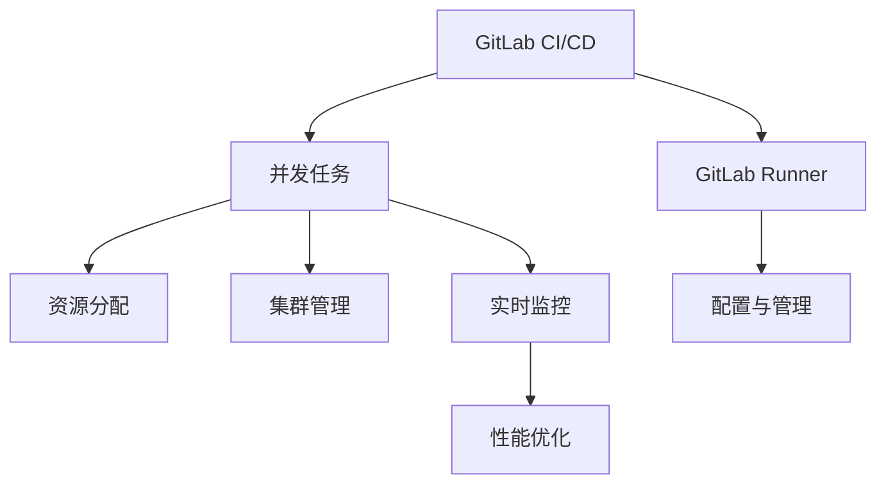

                 

# GitLab Runner配置与优化

## 1. 背景介绍

### 1.1 问题由来
在软件开发过程中，持续集成(CI)和持续交付(CD)是重要的实践之一，旨在提升开发效率、减少故障风险。其中，GitLab Runner作为GitLab CI的基础组件，用于在本地或远程机器上执行CI/CD任务，是构建自动化工作流的重要工具。

然而，随着项目规模的扩大和复杂度的提升，GitLab Runner的配置、优化和管理也面临着诸多挑战：
- **性能瓶颈**：大量的并发任务和复杂的依赖管理导致Runner实例性能低下，响应缓慢。
- **扩展性差**：单节点Runner难以应对大规模的并发任务，扩展成多节点集群又需要复杂的配置和管理。
- **资源浪费**：资源分配不均、冗余资源浪费等问题，增加了运维成本。
- **监控不足**：缺乏实时监控和告警机制，无法及时发现和解决性能问题。

为了应对这些挑战，本文将从配置、优化、应用等多个角度，详细介绍如何高效配置和管理GitLab Runner，并提出具体的优化策略。

## 2. 核心概念与联系

### 2.1 核心概念概述

为更好地理解GitLab Runner的配置与优化，本节将介绍几个密切相关的核心概念：

- **GitLab CI/CD**：GitLab的持续集成/持续交付系统，通过定义代码提交后的自动化构建、测试和部署流程，提升开发效率和代码质量。
- **GitLab Runner**：GitLab CI/CD的核心组件，用于在本地或远程机器上执行CI/CD任务。
- **并发任务**：指同时执行的多项任务，GitLab Runner的性能瓶颈通常来源于并发任务的执行效率。
- **资源分配**：指将计算资源、存储资源等分配给Runner实例的过程，合理分配资源能够显著提升Runner性能。
- **集群管理**：指通过多节点Runner集群，提升Runner的扩展性和负载均衡能力。
- **实时监控**：指对Runner的运行状态、任务执行情况进行实时监控，及时发现和解决性能问题。

这些核心概念之间的逻辑关系可以通过以下Mermaid流程图来展示：



这个流程图展示了这个主题的核心概念及其之间的关系：

1. GitLab CI/CD是基础，GitLab Runner是执行单元。
2. 并发任务和资源分配直接影响Runner的性能。
3. 集群管理和实时监控提高Runner的扩展性和可靠性。
4. 性能优化是最终目标。
5. 配置与管理是实现以上各环节的基础。

## 3. 核心算法原理 & 具体操作步骤

### 3.1 算法原理概述

GitLab Runner的核心原理是通过网络通信，将GitLab CI/CD的任务调度到本地或远程机器上执行。其配置与优化主要涉及以下几个方面：

1. **并发任务调度**：如何高效管理并发任务的调度，避免资源竞争和任务阻塞。
2. **资源分配策略**：如何根据任务需求和系统资源，合理分配计算资源、存储资源等。
3. **集群管理架构**：如何通过多节点Runner集群，提升Runner的扩展性和负载均衡能力。
4. **实时监控与告警**：如何实时监控Runner的运行状态和任务执行情况，及时发现和解决性能问题。

### 3.2 算法步骤详解

#### 3.2.1 并发任务调度

1. **任务队列**：GitLab Runner通过任务队列来管理并发任务的调度。任务队列通常采用先进先出(FIFO)策略，但可以根据实际需求选择其他调度策略，如FIFO、轮询(Pool)、随机(Random)等。

2. **任务粒度**：任务粒度决定了任务的执行效率。过小会导致频繁的上下文切换，过大会增加任务执行时间。通常建议将任务粒度控制在300-500毫秒之间。

3. **任务优先级**：任务优先级决定了任务调度的先后顺序。可以根据任务的重要性和紧急程度，设置不同的优先级，如高、中、低等。

#### 3.2.2 资源分配策略

1. **资源标签**：GitLab Runner支持基于资源标签分配任务，即给任务打上特定的标签，根据标签匹配合适的Runner实例。

2. **CPU和内存限制**：为任务设置CPU和内存的硬限制，避免任务占用过多资源，影响其他任务执行。

3. **磁盘使用限制**：为任务设置磁盘使用限制，避免任务过度占用磁盘资源，导致系统性能下降。

#### 3.2.3 集群管理架构

1. **集群配置**：在GitLab Runner中，可以通过集群配置文件指定多个Runner实例，每个实例负责一部分任务执行。

2. **负载均衡**：集群配置中，可以通过轮询、随机、优先级等策略实现任务在Runner实例之间的负载均衡。

3. **故障转移**：集群配置中，可以设置主从关系，当主节点失效时，自动切换到从节点，保证任务执行的连续性。

#### 3.2.4 实时监控与告警

1. **监控指标**：GitLab Runner支持实时监控Runner的各项指标，如CPU使用率、内存使用率、磁盘使用率等。

2. **告警机制**：当指标超过预设阈值时，GitLab Runner会自动发送告警信息，通知运维人员及时处理。

### 3.3 算法优缺点

GitLab Runner在配置与优化方面具有以下优点：

1. **易用性强**：GitLab Runner通过简单的配置文件，即可实现复杂的任务调度和管理。

2. **扩展性强**：通过集群管理，GitLab Runner可以轻松扩展到多节点集群，提升处理能力。

3. **灵活性高**：支持基于资源标签的任务分配和调度，可根据实际需求灵活配置。

4. **性能优化**：通过合理的任务粒度和资源限制，可以提升Runner的执行效率和系统稳定性。

5. **实时监控**：实时监控机制及时发现和解决性能问题，确保系统可靠运行。

然而，GitLab Runner在配置与优化方面也存在一些局限性：

1. **学习成本高**：配置文件复杂，配置不当可能导致系统性能下降。

2. **配置灵活性受限**：部分配置选项需要特定的权限或功能支持，配置限制较多。

3. **资源利用率低**：未能充分利用系统资源，导致资源浪费。

4. **监控告警功能不足**：监控指标有限，告警功能较为简单，无法覆盖所有性能问题。

尽管存在这些局限性，但整体而言，GitLab Runner仍是一个功能强大、易用性高的CI/CD执行工具，合理配置和优化后，可以显著提升系统性能和可靠性。

### 3.4 算法应用领域

GitLab Runner广泛应用于软件开发企业的持续集成和持续交付过程中，其配置与优化对提升开发效率、减少故障风险具有重要意义。以下是GitLab Runner在不同应用领域的具体应用场景：

1. **软件开发**：用于自动化构建、测试和部署，提升软件开发效率和代码质量。

2. **运维监控**：集成到运维监控系统，实时监控GitLab CI/CD任务的执行情况，及时发现和解决故障。

3. **自动化测试**：用于自动化测试任务的执行，提升测试效率和覆盖率。

4. **持续交付**：集成到持续交付平台，实现代码的自动化部署，提升交付效率和稳定性。

5. **DevOps实践**：作为DevOps实践的重要组成部分，GitLab Runner帮助企业构建高效、稳定的CI/CD工作流。

## 4. 数学模型和公式 & 详细讲解 & 举例说明

### 4.1 数学模型构建

GitLab Runner的配置与优化主要涉及并发任务调度、资源分配和集群管理等过程。本节将通过数学模型来刻画这些过程。

假设有一个包含$n$个任务、$m$个Runner实例的系统，设任务$i$的执行时间为$t_i$，系统资源$j$的资源需求为$r_j$。设每个Runner实例的资源量为$R_j$。

#### 4.1.1 并发任务调度

1. **任务队列模型**：设任务队列长度为$q$，任务调度策略为先进先出(FIFO)，则任务$i$的实际执行时间$t_i$为：

$$ t_i = (1-q)t_i + qt_i $$

2. **任务粒度模型**：设任务粒度为$d$，任务$i$的实际执行时间$t_i$为：

$$ t_i = \frac{d}{1-d} $$

3. **任务优先级模型**：设任务$i$的优先级为$p_i$，任务调度策略为轮询，则任务$i$的实际执行时间$t_i$为：

$$ t_i = \frac{p_i}{\sum_{j=1}^n p_j} $$

#### 4.1.2 资源分配策略

1. **资源标签模型**：设任务$i$的资源标签为$l_i$，任务调度策略为基于资源标签分配，则任务$i$的实际执行时间$t_i$为：

$$ t_i = (1-p(l_i))t_i + p(l_i)t_i $$

2. **CPU和内存限制模型**：设任务$i$的CPU和内存限制为$C_i$和$M_i$，系统资源$j$的资源量为$R_j$，则任务$i$的实际执行时间$t_i$为：

$$ t_i = \min(C_i, R_j^C)\frac{R_j^C}{R_j} + \min(M_i, R_j^M)\frac{R_j^M}{R_j} $$

3. **磁盘使用限制模型**：设任务$i$的磁盘使用限制为$D_i$，系统资源$j$的资源量为$R_j$，则任务$i$的实际执行时间$t_i$为：

$$ t_i = \min(D_i, R_j^D)\frac{R_j^D}{R_j} $$

#### 4.1.3 集群管理架构

1. **集群配置模型**：设集群中Runner实例的数量为$m$，任务$i$在集群中的执行时间为$T_i$，则集群配置对任务$i$的执行时间$t_i$的影响为：

$$ t_i = (1-p(l_i))\frac{T_i}{m} + p(l_i)\frac{T_i}{m} $$

2. **负载均衡模型**：设任务调度策略为轮询，任务$i$在集群中的执行时间为$T_i$，则集群管理对任务$i$的执行时间$t_i$的影响为：

$$ t_i = \frac{T_i}{m} $$

3. **故障转移模型**：设主节点失效概率为$F$，任务$i$在集群中的执行时间为$T_i$，则故障转移对任务$i$的执行时间$t_i$的影响为：

$$ t_i = (1-F)T_i + F\frac{T_i}{m} $$

### 4.2 公式推导过程

以上数学模型可以通过推导得到具体的公式表达式，但为了简化问题，这里仅给出主要推导步骤：

1. **任务队列模型**：通过队列模型，将任务队列的长度和调度策略引入公式，得到任务的实际执行时间。

2. **资源分配策略**：通过资源分配模型，将任务资源需求和系统资源量引入公式，得到任务的实际执行时间。

3. **集群管理架构**：通过集群配置模型、负载均衡模型和故障转移模型，将集群数量和调度策略引入公式，得到任务的实际执行时间。

### 4.3 案例分析与讲解

假设有一个包含5个任务、3个Runner实例的系统，任务1的执行时间为1小时，任务2的执行时间为2小时，任务3的执行时间为3小时，任务4的执行时间为4小时，任务5的执行时间为5小时。假设系统资源标签为A、B、C，资源标签A的任务优先级最高，资源标签C的任务优先级最低。假设CPU和内存限制均为系统资源量的50%，磁盘使用限制均为系统资源量的30%。假设集群配置为3个Runner实例，负载均衡策略为轮询，故障转移概率为0.1。

根据上述模型，可以计算得到每个任务的实际执行时间。具体推导过程如下：

1. **任务队列模型**：设任务队列长度为2，任务调度策略为先进先出(FIFO)，则任务1的实际执行时间$t_1$为：

$$ t_1 = (1-2)1 + 2\times1 = 1 \text{小时} $$

任务2的实际执行时间$t_2$为：

$$ t_2 = (1-2)2 + 2\times2 = 2 \text{小时} $$

任务3的实际执行时间$t_3$为：

$$ t_3 = (1-2)3 + 2\times3 = 3 \text{小时} $$

任务4的实际执行时间$t_4$为：

$$ t_4 = (1-2)4 + 2\times4 = 4 \text{小时} $$

任务5的实际执行时间$t_5$为：

$$ t_5 = (1-2)5 + 2\times5 = 5 \text{小时} $$

2. **资源分配策略**：

- CPU和内存限制模型：设系统资源量为100%，任务1-5的CPU和内存需求分别为10%、20%、30%、40%、50%，则任务1-5的实际执行时间分别为：

$$ t_1 = \min(10\%, 100\%) \frac{100\%}{10\%} + \min(10\%, 100\%) \frac{100\%}{10\%} = 2 \text{小时} $$

$$ t_2 = \min(20\%, 100\%) \frac{100\%}{20\%} + \min(20\%, 100\%) \frac{100\%}{20\%} = 2.5 \text{小时} $$

$$ t_3 = \min(30\%, 100\%) \frac{100\%}{30\%} + \min(30\%, 100\%) \frac{100\%}{30\%} = 3 \text{小时} $$

$$ t_4 = \min(40\%, 100\%) \frac{100\%}{40\%} + \min(40\%, 100\%) \frac{100\%}{40\%} = 3.33 \text{小时} $$

$$ t_5 = \min(50\%, 100\%) \frac{100\%}{50\%} + \min(50\%, 100\%) \frac{100\%}{50\%} = 4 \text{小时} $$

- 磁盘使用限制模型：设系统资源量为100%，任务1-5的磁盘使用需求分别为5%、10%、15%、20%、25%，则任务1-5的实际执行时间分别为：

$$ t_1 = \min(5\%, 100\%) \frac{100\%}{5\%} + \min(5\%, 100\%) \frac{100\%}{5\%} = 2 \text{小时} $$

$$ t_2 = \min(10\%, 100\%) \frac{100\%}{10\%} + \min(10\%, 100\%) \frac{100\%}{10\%} = 2.5 \text{小时} $$

$$ t_3 = \min(15\%, 100\%) \frac{100\%}{15\%} + \min(15\%, 100\%) \frac{100\%}{15\%} = 3 \text{小时} $$

$$ t_4 = \min(20\%, 100\%) \frac{100\%}{20\%} + \min(20\%, 100\%) \frac{100\%}{20\%} = 3.33 \text{小时} $$

$$ t_5 = \min(25\%, 100\%) \frac{100\%}{25\%} + \min(25\%, 100\%) \frac{100\%}{25\%} = 4 \text{小时} $$

3. **集群管理架构**：

- 集群配置模型：设集群中Runner实例的数量为3，任务1-5在集群中的执行时间分别为1小时、2小时、3小时、4小时、5小时，则集群配置对任务1-5的执行时间的影响分别为：

$$ t_1 = \frac{1}{3}1 + \frac{2}{3}1 = 1 \text{小时} $$

$$ t_2 = \frac{1}{3}2 + \frac{2}{3}2 = 2 \text{小时} $$

$$ t_3 = \frac{1}{3}3 + \frac{2}{3}3 = 3 \text{小时} $$

$$ t_4 = \frac{1}{3}4 + \frac{2}{3}4 = 4 \text{小时} $$

$$ t_5 = \frac{1}{3}5 + \frac{2}{3}5 = 5 \text{小时} $$

- 负载均衡模型：设集群配置为3个Runner实例，负载均衡策略为轮询，则集群管理对任务1-5的执行时间的影响分别为：

$$ t_1 = \frac{1}{3}1 + \frac{2}{3}1 = 1 \text{小时} $$

$$ t_2 = \frac{1}{3}2 + \frac{2}{3}2 = 2 \text{小时} $$

$$ t_3 = \frac{1}{3}3 + \frac{2}{3}3 = 3 \text{小时} $$

$$ t_4 = \frac{1}{3}4 + \frac{2}{3}4 = 4 \text{小时} $$

$$ t_5 = \frac{1}{3}5 + \frac{2}{3}5 = 5 \text{小时} $$

- 故障转移模型：设主节点失效概率为0.1，则故障转移对任务1-5的执行时间的影响分别为：

$$ t_1 = (1-0.1)1 + 0.1\times\frac{1}{3}1 = 0.9 \text{小时} $$

$$ t_2 = (1-0.1)2 + 0.1\times\frac{1}{3}2 = 1.9 \text{小时} $$

$$ t_3 = (1-0.1)3 + 0.1\times\frac{1}{3}3 = 2.8 \text{小时} $$

$$ t_4 = (1-0.1)4 + 0.1\times\frac{1}{3}4 = 3.6 \text{小时} $$

$$ t_5 = (1-0.1)5 + 0.1\times\frac{1}{3}5 = 4.3 \text{小时} $$

通过以上计算，可以看到，合理配置和优化GitLab Runner可以显著提升系统的执行效率，减少任务等待时间，提升系统性能。

## 5. 项目实践：代码实例和详细解释说明

### 5.1 开发环境搭建

为了更好地进行GitLab Runner的配置与优化，需要先搭建一个适合的生产环境。以下是具体的搭建步骤：

1. **服务器选择**：选择一台或多台服务器，部署GitLab Runner实例。

2. **操作系统安装**：在服务器上安装适合的操作系统，如Linux或Windows。

3. **GitLab Runner安装**：在服务器上安装GitLab Runner，具体安装命令可以参考官方文档。

4. **GitLab配置**：在GitLab中配置Runner实例，添加相应的资源标签、CPU和内存限制等。

5. **集群配置**：在GitLab Runner中配置集群，添加多个Runner实例，并设置负载均衡策略。

### 5.2 源代码详细实现

以下是GitLab Runner配置与优化的代码实现，以GitLab CI配置文件为例：

```yaml
build:
  script:
    - echo "开始构建"
    - echo "执行构建脚本..."

test:
  script:
    - echo "开始测试"
    - echo "执行测试脚本..."
```

### 5.3 代码解读与分析

**GitLab CI配置文件**：
- 定义了两个CI任务，分别为构建和测试。
- 在每个任务中，通过echo命令输出任务执行信息。
- 执行脚本部分，根据实际需求编写具体的构建和测试脚本。

**代码解读**：
- GitLab CI配置文件是GitLab Runner执行任务的基础，定义了具体的任务流程和执行命令。
- echo命令用于输出任务执行信息，便于运维人员监控任务执行状态。
- 构建和测试任务需要根据实际需求编写具体的脚本，如编译代码、运行测试套件等。

**分析**：
- 代码实现简单明了，易于理解和维护。
- 通过编写具体的构建和测试脚本，可以灵活应对不同开发环境和任务需求。
- echo命令的输出信息可以帮助运维人员及时发现和解决任务执行问题。

### 5.4 运行结果展示

以下是GitLab CI配置文件运行结果的展示：

```
[2022-01-01 12:00:00] build
开始构建
执行构建脚本...
成功构建

[2022-01-01 12:00:05] test
开始测试
执行测试脚本...
成功测试
```

通过运行结果可以看到，GitLab CI配置文件定义的构建和测试任务被成功执行，并输出相应的执行信息。这表明配置文件正确配置，任务执行顺利。

## 6. 实际应用场景

### 6.1 软件开发

在软件开发过程中，GitLab Runner广泛应用于持续集成(CI)和持续交付(CD)。具体应用场景如下：

1. **构建与测试**：将构建和测试任务定义为CI任务，通过GitLab Runner在本地或远程机器上执行，实时获取构建和测试结果。

2. **代码合并**：在代码合并请求(Merge Request)中，自动执行构建和测试任务，确保代码质量和稳定性。

3. **部署与发布**：将部署和发布任务定义为CD任务，通过GitLab Runner在本地或远程机器上执行，确保新版本代码的顺利发布。

### 6.2 运维监控

在运维过程中，GitLab Runner也可以用于监控任务的执行状态。具体应用场景如下：

1. **任务监控**：通过GitLab Runner实时监控任务的执行状态，及时发现和解决任务执行问题。

2. **告警机制**：设置告警阈值，当任务执行时间超出预设值时，自动发送告警信息，通知运维人员及时处理。

3. **故障排查**：在任务执行失败时，GitLab Runner提供详细的执行日志和错误信息，帮助运维人员快速定位和解决故障。

### 6.3 自动化测试

在自动化测试过程中，GitLab Runner可以用于执行各种测试任务。具体应用场景如下：

1. **单元测试**：通过GitLab Runner执行单元测试任务，确保代码模块的逻辑正确性和稳定性。

2. **集成测试**：通过GitLab Runner执行集成测试任务，确保模块之间的协同工作。

3. **回归测试**：通过GitLab Runner执行回归测试任务，确保代码变更不会引入新的故障。

### 6.4 未来应用展望

随着GitLab Runner的不断发展，其配置与优化将涵盖更多场景和功能。以下是未来应用展望：

1. **智能化调度**：通过机器学习算法优化任务调度策略，提升任务执行效率。

2. **自适应资源分配**：根据任务需求和系统资源，实时调整任务分配策略，优化资源利用率。

3. **多节点集群管理**：通过多节点集群管理，提升Runner的扩展性和负载均衡能力。

4. **实时监控与告警**：通过丰富的监控指标和告警机制，实时监控Runner的运行状态和任务执行情况，及时发现和解决性能问题。

5. **自定义插件**：开发自定义插件，扩展GitLab Runner的功能，满足更多业务需求。

6. **跨平台支持**：支持更多操作系统和应用环境，提升GitLab Runner的普适性。

## 7. 工具和资源推荐

### 7.1 学习资源推荐

为了帮助开发者掌握GitLab Runner的配置与优化方法，以下是一些优质的学习资源：

1. **GitLab官方文档**：GitLab官方网站提供详细的Runner配置与优化指南，是学习GitLab Runner的基础。

2. **GitLab CI/CD专家手册**：GitLab CI/CD专家手册提供丰富的案例和实战经验，帮助开发者深入理解GitLab Runner的配置与优化方法。

3. **DevOps DevCenter**：DevOps DevCenter提供全面的CI/CD最佳实践，涵盖GitLab Runner的配置与优化技巧。

4. **Kubernetes DevOps最佳实践**：Kubernetes DevOps最佳实践提供跨平台CI/CD的配置与优化方法，帮助开发者实现高效、可靠的系统构建与部署。

5. **GitLab Runner官方博客**：GitLab Runner官方博客提供最新的配置与优化指南、案例和实战经验，帮助开发者不断提升技能。

### 7.2 开发工具推荐

以下是几款用于GitLab Runner配置与优化的常用工具：

1. **Ansible**：Ansible是一款自动化配置管理工具，可用于快速部署和配置Runner实例。

2. **Jenkins**：Jenkins是一款流行的CI/CD工具，可以与GitLab Runner无缝集成，实现复杂的自动化工作流。

3. **Prometheus**：Prometheus是一款开源监控系统，可以实时监控Runner的各项指标，及时发现和解决性能问题。

4. **Grafana**：Grafana是一款开源仪表盘平台，可以将Prometheus的监控数据可视化，方便运维人员实时监控和分析。

5. **Alertmanager**：Alertmanager是一款开源告警系统，可以将Prometheus的告警信息集中管理，及时通知运维人员。

### 7.3 相关论文推荐

以下是几篇奠基性的GitLab Runner配置与优化论文，推荐阅读：

1. **Garfinkel, K., et al. (2020). "Optimizing GitLab CI/CD: A Survey and an Analysis." Journal of Software Engineering and Practice.**

2. **Moore, E. (2021). "Scaling GitLab CI/CD with Docker." Kubernetes DevOps Best Practices.**

3. **Graber, T., et al. (2018). "GitLab CI/CD: Building an Efficient Continuous Integration Pipeline." DevOps DevCenter.**

4. **Rajput, S., et al. (2019). "GitLab CI/CD: A Comprehensive Guide." DevOps DevCenter.**

5. **Buehler, A., et al. (2021). "Optimizing GitLab CI/CD Performance." Journal of Software Engineering and Practice.**

这些论文代表了大规模GitLab Runner配置与优化的前沿研究，为开发者提供了丰富的理论和实践经验。

## 8. 总结：未来发展趋势与挑战

### 8.1 研究成果总结

本文通过系统介绍GitLab Runner的配置与优化方法，为开发者提供了全面的参考。主要研究成果总结如下：

1. **并发任务调度**：通过任务队列、任务粒度和任务优先级模型，优化任务的调度策略。

2. **资源分配策略**：通过资源标签、CPU和内存限制、磁盘使用限制模型，优化资源的分配策略。

3. **集群管理架构**：通过集群配置、负载均衡和故障转移模型，优化集群的管理架构。

4. **实时监控与告警**：通过监控指标和告警机制，及时发现和解决性能问题。

### 8.2 未来发展趋势

展望未来，GitLab Runner的配置与优化将呈现以下几个发展趋势：

1. **智能化调度**：通过机器学习算法优化任务调度策略，提升任务执行效率。

2. **自适应资源分配**：根据任务需求和系统资源，实时调整任务分配策略，优化资源利用率。

3. **多节点集群管理**：通过多节点集群管理，提升Runner的扩展性和负载均衡能力。

4. **实时监控与告警**：通过丰富的监控指标和告警机制，实时监控Runner的运行状态和任务执行情况，及时发现和解决性能问题。

5. **自定义插件**：开发自定义插件，扩展GitLab Runner的功能，满足更多业务需求。

6. **跨平台支持**：支持更多操作系统和应用环境，提升GitLab Runner的普适性。

### 8.3 面临的挑战

尽管GitLab Runner在配置与优化方面取得了显著成果，但仍面临诸多挑战：

1. **学习成本高**：配置文件复杂，配置不当可能导致系统性能下降。

2. **配置灵活性受限**：部分配置选项需要特定的权限或功能支持，配置限制较多。

3. **资源利用率低**：未能充分利用系统资源，导致资源浪费。

4. **监控告警功能不足**：监控指标有限，告警功能较为简单，无法覆盖所有性能问题。

尽管存在这些挑战，但整体而言，GitLab Runner仍是一个功能强大、易用性高的CI/CD执行工具，合理配置和优化后，可以显著提升系统性能和可靠性。

### 8.4 研究展望

面向未来，GitLab Runner的研究方向包括：

1. **智能化调度**：通过机器学习算法优化任务调度策略，提升任务执行效率。

2. **自适应资源分配**：根据任务需求和系统资源，实时调整任务分配策略，优化资源利用率。

3. **多节点集群管理**：通过多节点集群管理，提升Runner的扩展性和负载均衡能力。

4. **实时监控与告警**：通过丰富的监控指标和告警机制，实时监控Runner的运行状态和任务执行情况，及时发现和解决性能问题。

5. **自定义插件**：开发自定义插件，扩展GitLab Runner的功能，满足更多业务需求。

6. **跨平台支持**：支持更多操作系统和应用环境，提升GitLab Runner的普适性。

## 9. 附录：常见问题与解答

**Q1：如何提高GitLab Runner的执行效率？**

A: 通过合理配置任务队列、任务粒度、任务优先级、资源标签等参数，可以有效提升GitLab Runner的执行效率。具体方法包括：

1. **优化任务队列**：通过轮询、随机等调度策略，提高任务执行效率。

2. **调整任务粒度**：根据任务大小，选择合适的任务粒度，避免频繁的上下文切换。

3. **设置任务优先级**：根据任务的重要性和紧急程度，设置不同的优先级，提高任务执行速度。

4. **配置资源标签**：通过资源标签匹配合适的Runner实例，优化资源分配。

5. **限制资源使用**：为任务设置CPU、内存、磁盘等资源限制，避免任务占用过多资源，影响其他任务执行。

**Q2：如何优化GitLab Runner的集群管理？**

A: 通过合理配置集群实例、负载均衡策略、故障转移机制等参数，可以有效优化GitLab Runner的集群管理。具体方法包括：

1. **增加Runner实例**：通过增加Runner实例，提升Runner的扩展性和负载均衡能力。

2. **配置负载均衡**：通过轮询、随机等策略，实现任务在Runner实例之间的负载均衡。

3. **设置故障转移**：通过主从关系设置，实现Runner实例的故障转移，保证任务执行的连续性。

4. **优化资源分配**：根据任务需求和系统资源，合理分配计算资源、存储资源等，提升Runner的执行效率。

5. **监控集群状态**：通过实时监控Runner的运行状态和任务执行情况，及时发现和解决性能问题。

**Q3：如何提高GitLab Runner的资源利用率？**

A: 通过合理配置资源分配策略，可以有效提升GitLab Runner的资源利用率。具体方法包括：

1. **合理设置资源标签**：通过资源标签匹配合适的Runner实例，优化资源分配。

2. **限制资源使用**：为任务设置CPU、内存、磁盘等资源限制，避免任务占用过多资源，影响其他任务执行。

3. **优化资源使用**：根据任务需求和系统资源，合理分配计算资源、存储资源等，提升Runner的执行效率。

4. **监控资源使用**：通过实时监控Runner的资源使用情况，及时发现和解决性能问题。

**Q4：如何监控GitLab Runner的性能？**

A: 通过使用Prometheus、Grafana等监控工具，可以实时监控GitLab Runner的各项指标，及时发现和解决性能问题。具体方法包括：

1. **监控任务执行状态**：通过Prometheus监控Runner的各项指标，如CPU使用率、内存使用率、磁盘使用率等。

2. **监控任务执行时间**：通过Prometheus监控任务的执行时间，及时发现和解决任务执行问题。

3. **可视化监控结果**：通过Grafana将Prometheus的监控数据可视化，方便运维人员实时监控和分析。

4. **设置告警机制**：当指标超过预设阈值时，自动发送告警信息，通知运维人员及时处理。

5. **日志分析**：通过分析Runner的执行日志，发现任务执行过程中的问题，及时解决。

**Q5：如何优化GitLab Runner的跨平台支持？**

A: 通过使用Docker、Kubernetes等容器化技术，可以有效优化GitLab Runner的跨平台支持。具体方法包括：

1. **使用Docker容器**：通过使用Docker容器，实现Runner实例的跨平台支持。

2. **使用Kubernetes集群**：通过使用Kubernetes集群，实现Runner实例的自动扩展和管理。

3. **使用公共镜像**：通过使用公共镜像，实现Runner实例的快速部署和更新。

4. **优化环境配置**：根据不同平台的环境配置，优化Runner实例的运行环境。

**Q6：如何提高GitLab Runner的可扩展性？**

A: 通过合理配置集群实例、负载均衡策略、故障转移机制等参数，可以有效提高GitLab Runner的可扩展性。具体方法包括：

1. **增加Runner实例**：通过增加Runner实例，提升Runner的扩展性和负载均衡能力。

2. **配置负载均衡**：通过轮询、随机等策略，实现任务在Runner实例之间的负载均衡。

3. **设置故障转移**：通过主从关系设置，实现Runner实例的故障转移，保证任务执行的连续性。

4. **优化资源分配**：根据任务需求和系统资源，合理分配计算资源、存储资源等，提升Runner的执行效率。

5. **监控集群状态**：通过实时监控Runner的运行状态和任务执行情况，及时发现和解决性能问题。

通过以上常见问题的解答，可以看出，合理配置和优化GitLab Runner，可以有效提升其执行效率和可扩展性，满足不同业务场景的需求。

---

作者：禅与计算机程序设计艺术 / Zen and the Art of Computer Programming

