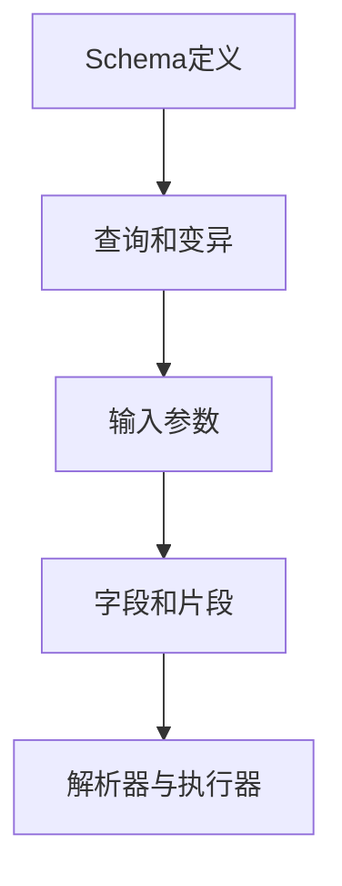

                 

# GraphQL：新一代API查询语言

> 关键词：GraphQL, API查询, 微服务, 渐进式API, 数据聚合, 版本管理, 数据库同步

## 1. 背景介绍

### 1.1 问题由来

随着微服务的广泛应用，接口定义（API）的复杂性不断增加。传统REST API的单一响应结构、固定的端点和数据模型，在满足不同业务需求时显得力不从心。越来越多的企业意识到，对于不同的用户和应用场景，需要提供灵活且功能强大的API接口。

与此同时，客户端对数据的需求日益多样化。以往的API设计往往只考虑少数固定的业务场景，难以满足个性化需求。例如，一个简单的用户列表查询，可能需求包括用户的头像、评论、朋友列表等多个字段，而传统REST API可能需要分别调用多个端点才能获取完整的用户信息。

这种API设计方式的弊端逐渐显现：

- **数据冗余**：多端点调用导致请求重复，增加了网络负载和延迟。
- **版本管理困难**：API版本频繁更新，导致客户端维护成本高，版本兼容性问题频发。
- **灵活性差**：API字段和结构的固定性限制了数据的多样化和复杂性处理。
- **交互效率低**：每次请求都需要显式地传递多个参数，增加了请求数量和复杂性。

为了解决这些问题，GraphQL作为一种新一代API查询语言应运而生。其灵活的数据获取方式、优化性能和强大的版本管理能力，使API设计更加灵活高效。

## 2. 核心概念与联系

### 2.1 核心概念概述

GraphQL是一种基于类型系统的API查询语言，其设计理念包括：

- **灵活的数据查询**：允许客户端以任意组合的方式查询所需数据，减少不必要的网络请求。
- **强大的类型系统**：支持数据模型的定义，确保数据结构的一致性和可预测性。
- **高效的性能**：通过数据聚合和缓存机制，减少网络请求次数和数据传输量。
- **良好的版本管理**：API定义与客户端调用分离，确保版本兼容性和演进平滑性。

GraphQL的核心概念包括以下几个关键点：

- **Schema定义**：GraphQL的Schema定义了API的类型结构和查询规则，是API设计的起点。
- **查询和变异**：GraphQL支持两种操作：查询（Query）用于从服务获取数据，变异（Mutation）用于修改服务状态。
- **输入参数**：通过传递结构化的输入参数，允许客户端对查询和变异进行细粒度控制。
- **字段和片段**：字段用于指定查询或变异的路径，片段用于重用相同的查询片段。
- **解析器与执行器**：解析器将客户端的查询解析为执行器能够理解的形式，执行器根据Schema执行查询并返回结果。

通过理解这些核心概念，我们可以更好地把握GraphQL的本质及其应用方式。

### 2.2 核心概念原理和架构的 Mermaid 流程图



这个流程图展示了GraphQL的核心流程：

1. 通过Schema定义API的类型结构和查询规则。
2. 客户端使用查询或变异操作，并传递输入参数。
3. 查询或变异路径通过字段和片段进行定义。
4. 解析器将查询解析为执行器可理解的形式。
5. 执行器根据Schema执行查询并返回结果。

这种架构设计使得GraphQL在性能、灵活性和版本管理等方面具备独特的优势。

## 3. 核心算法原理 & 具体操作步骤

### 3.1 算法原理概述

GraphQL的核心算法原理基于类型系统和Schema定义，其核心思想是：

1. **Schema定义**：通过Schema定义API的类型结构和查询规则，确保数据结构的稳定性和一致性。
2. **灵活的查询**：客户端可以任意组合字段和片段，获取所需的数据，减少不必要的网络请求。
3. **输入参数**：通过传递结构化的输入参数，允许客户端对查询和变异进行细粒度控制。
4. **数据聚合**：利用缓存和优化策略，减少网络请求次数和数据传输量，提高性能。

GraphQL的算法原理可以概括为以下三个步骤：

1. **Schema定义和解析**：定义API的类型结构和查询规则，并将Schema解析为执行器可理解的形式。
2. **查询和变异解析**：解析客户端的查询和变异操作，生成执行器可执行的查询路径。
3. **数据执行和聚合**：根据Schema执行查询或变异，并根据查询路径进行数据聚合和缓存，最终返回结果。

### 3.2 算法步骤详解

GraphQL的算法步骤可以分为以下几个关键环节：

**Step 1: 定义Schema**

Schema是GraphQL API的核心，定义了API的类型结构和查询规则。Schema包括数据类型、查询和变异操作、字段、片段等关键组件。

```graphql
type Query {
  user(id: ID!): User
  users: [User]
}

type User {
  id: ID!
  name: String
  email: String
  friends: [Friend]
}

type Friend {
  id: ID!
  name: String
  email: String
}
```

**Step 2: 解析查询和变异**

客户端通过HTTP请求发送GraphQL查询或变异操作，GraphQL解析器将查询解析为执行器可执行的查询路径。解析过程主要包括以下几个步骤：

1. 解析输入参数：将客户端传递的输入参数解析为执行器可理解的形式。
2. 解析查询路径：根据Schema解析查询或变异路径，生成执行器可执行的查询路径。
3. 解析片段：重用相同的查询片段，减少重复查询。

```graphql
query {
  user(id: "1") {
    id
    name
    email
    friends {
      id
      name
      email
    }
  }
}
```

**Step 3: 执行查询和聚合数据**

解析器生成查询路径后，执行器根据Schema执行查询并返回结果。执行过程主要包括以下几个步骤：

1. 查询数据：根据Schema查询所需的数据。
2. 数据聚合：根据查询路径进行数据聚合和缓存，减少重复查询。
3. 返回结果：将查询结果转换为客户端可理解的形式，并返回。

```javascript
// 假设已定义的User模型和查询路径
const user = await User.findById("1");
const friends = await user.getFriends();
return {
  user: {
    id: user.id,
    name: user.name,
    email: user.email,
    friends: friends.map(friend => ({id: friend.id, name: friend.name, email: friend.email}))
  }
};
```

### 3.3 算法优缺点

GraphQL作为一种新一代API查询语言，具有以下优点：

1. **灵活的数据查询**：客户端可以任意组合字段和片段，获取所需的数据，减少不必要的网络请求。
2. **强大的类型系统**：支持数据模型的定义，确保数据结构的一致性和可预测性。
3. **高效的性能**：通过数据聚合和缓存机制，减少网络请求次数和数据传输量。
4. **良好的版本管理**：API定义与客户端调用分离，确保版本兼容性和演进平滑性。

同时，GraphQL也存在以下缺点：

1. **学习曲线陡峭**：Schema定义复杂，需要开发者深入理解其结构。
2. **性能开销大**：解析和执行查询需要更多的计算和内存资源，尤其是大规模复杂查询时。
3. **版本管理复杂**：尽管版本管理方面有优势，但Schema的定义和解析也带来了一定的复杂性。
4. **客户端开发复杂**：需要开发和维护客户端SDK，增加了开发成本。

尽管存在这些局限性，但GraphQL的灵活性和性能优势使其成为新一代API查询语言的热门选择。

### 3.4 算法应用领域

GraphQL作为一种新一代API查询语言，适用于各种微服务架构下的API设计。其主要应用领域包括：

1. **Web和移动应用**：为前端开发提供灵活的数据获取方式，减少不必要的网络请求。
2. **API网关**：统一管理和调度多个微服务的API接口，提高系统的可维护性和扩展性。
3. **文档生成**：自动生成API文档，帮助开发者理解和使用API接口。
4. **数据可视化**：利用GraphQL的数据获取方式，支持复杂的数据可视化需求。
5. **第三方集成**：支持与其他API的集成，构建开放、灵活的系统架构。

这些应用领域展示了GraphQL的广泛适用性和强大的功能。

## 4. 数学模型和公式 & 详细讲解 & 举例说明

### 4.1 数学模型构建

GraphQL的数学模型主要基于类型系统和Schema定义，其核心思想是通过类型系统约束数据结构，通过Schema定义查询规则。

GraphQL的Schema包括数据类型、查询和变异操作、字段和片段等关键组件。数据类型定义了数据的结构和属性，查询和变异操作定义了客户端可以执行的操作，字段和片段定义了查询和变异的路径。

```graphql
type Query {
  user(id: ID!): User
  users: [User]
}

type User {
  id: ID!
  name: String
  email: String
  friends: [Friend]
}

type Friend {
  id: ID!
  name: String
  email: String
}
```

### 4.2 公式推导过程

GraphQL的公式推导过程主要涉及Schema解析和查询执行。Schema解析过程主要包括以下几个步骤：

1. 解析输入参数：将客户端传递的输入参数解析为执行器可理解的形式。
2. 解析查询路径：根据Schema解析查询或变异路径，生成执行器可执行的查询路径。
3. 解析片段：重用相同的查询片段，减少重复查询。

查询执行过程主要包括以下几个步骤：

1. 查询数据：根据Schema查询所需的数据。
2. 数据聚合：根据查询路径进行数据聚合和缓存，减少重复查询。
3. 返回结果：将查询结果转换为客户端可理解的形式，并返回。

### 4.3 案例分析与讲解

以一个简单的用户查询为例，分析GraphQL的查询执行过程：

假设已定义的User模型和查询路径：

```graphql
type User {
  id: ID!
  name: String
  email: String
  friends: [Friend]
}

type Friend {
  id: ID!
  name: String
  email: String
}

query {
  user(id: "1") {
    id
    name
    email
    friends {
      id
      name
      email
    }
  }
}
```

解析器将查询解析为执行器可执行的查询路径：

1. 解析输入参数：`id: "1"` 解析为 `id: "1"!`。
2. 解析查询路径：`user(id: "1")` 解析为 `user` 类型，`id: "1"` 解析为 `id: "1"`。
3. 解析片段：`friends` 解析为 `friends` 字段。

执行器根据Schema执行查询并返回结果：

1. 查询数据：`user` 类型为 `User`，`id: "1"` 查找 `User` 模型中 `id` 为 "1" 的记录。
2. 数据聚合：`friends` 字段查询 `User` 模型的 `friends` 字段，返回 `Friend` 模型的列表。
3. 返回结果：将查询结果转换为客户端可理解的形式，并返回。

## 5. 项目实践：代码实例和详细解释说明

### 5.1 开发环境搭建

在进行GraphQL项目实践前，我们需要准备好开发环境。以下是使用JavaScript进行GraphQL开发的环境配置流程：

1. 安装Node.js和npm：从官网下载并安装Node.js和npm，用于创建项目。
2. 创建项目并初始化：
```bash
mkdir graphql-project
cd graphql-project
npm init -y
```

3. 安装必要的npm包：
```bash
npm install graphql apollo-server graphql-codegen
```

4. 安装可视化工具：
```bash
npm install graphiql
```

完成上述步骤后，即可在项目中开始GraphQL开发。

### 5.2 源代码详细实现

下面我们以一个简单的用户管理系统的GraphQL API为例，给出GraphQL项目开发的PyTorch代码实现。

首先，定义用户模型：

```javascript
const User = mongoose.model('User', new Schema({
  name: String,
  email: String,
  friends: [{ type: Schema.Types.ObjectId, ref: 'Friend' }]
}));
```

然后，定义Schema：

```javascript
const typeDefs = `
  type User {
    id: ID!
    name: String
    email: String
    friends: [Friend]
  }

  type Friend {
    id: ID!
    name: String
    email: String
  }

  type Query {
    users: [User]
    user(id: ID!): User
  }

  type Mutation {
    addUser(name: String!, email: String!, friends: [Friend]): User
  }
`;
```

接着，定义查询和变异：

```javascript
const resolvers = {
  Query: {
    users: async () => {
      const users = await User.find();
      return users;
    },
    user: async (parent, { id }) => {
      const user = await User.findById(id);
      return user;
    }
  },
  Mutation: {
    addUser: async (parent, { name, email, friends }) => {
      const newUser = new User({ name, email, friends });
      await newUser.save();
      return newUser;
    }
  }
};
```

最后，启动GraphQL服务器：

```javascript
const server = new ApolloServer({
  typeDefs,
  resolvers,
  introspection: true,
  playground: true,
  graphiql: true,
  context: ({ req }) => ({ user: req.headers.authorization })
});
server.listen().then(({ url }) => {
  console.log(`GraphQL Server running at ${url}`);
});
```

以上就是使用JavaScript进行GraphQL项目开发的完整代码实现。可以看到，GraphQL的Schema和查询的实现相对简洁，通过定义数据类型、查询和变异操作，即可构建一个灵活的API系统。

### 5.3 代码解读与分析

让我们再详细解读一下关键代码的实现细节：

**typeDefs**：
- 定义了数据类型 `User` 和 `Friend`，以及查询和变异操作。

**resolvers**：
- 实现了查询和变异操作的具体逻辑，通过Mongoose查询API获取和新增用户数据。

**server**：
- 使用ApolloServer创建GraphQL服务器，传入Schema、resolvers、introspection、playground、graphiql等配置，启动GraphQL服务。

这些代码展示了一个简单的GraphQL项目开发流程，通过定义Schema、查询和变异操作，即可构建一个灵活、高效的API系统。开发者可以根据自己的需求，定义更加复杂的数据类型和查询规则，实现更丰富的API功能。

## 6. 实际应用场景

### 6.1 智能推荐系统

智能推荐系统需要实时获取用户的行为数据和兴趣偏好，为用户提供个性化的推荐内容。GraphQL的灵活查询能力，可以帮助推荐系统从不同数据源获取所需的数据，并根据用户行为动态生成推荐结果。

在实践中，可以收集用户的浏览、点击、评分等行为数据，通过GraphQL查询API获取用户数据、物品数据和推荐模型数据，动态生成推荐结果。GraphQL的数据聚合和缓存机制，可以减少重复查询，提高推荐系统的效率。

### 6.2 实时监控系统

实时监控系统需要实时获取各种设备的运行数据，并进行数据分析和可视化。GraphQL的灵活查询能力，可以帮助监控系统从不同数据源获取所需的实时数据，并根据用户需求动态生成可视化图表。

在实践中，可以收集设备的运行数据、日志数据、告警数据等，通过GraphQL查询API获取实时数据，并利用数据可视化工具，生成实时的监控图表。GraphQL的数据聚合和缓存机制，可以减少重复查询，提高监控系统的效率。

### 6.3 数据可视化系统

数据可视化系统需要从多个数据源获取数据，并进行复杂的数据聚合和可视化。GraphQL的灵活查询能力，可以帮助可视化系统从不同数据源获取所需的复杂数据，并进行数据聚合和可视化。

在实践中，可以收集用户行为数据、交易数据、地理位置数据等，通过GraphQL查询API获取复杂数据，并利用数据可视化工具，生成丰富的可视化图表。GraphQL的数据聚合和缓存机制，可以减少重复查询，提高可视化系统的效率。

### 6.4 未来应用展望

随着GraphQL的广泛应用，其在微服务架构下的API设计和数据查询能力将越来越重要。未来，GraphQL将进一步发展其优势，应用于更多的场景中：

1. **全栈应用**：GraphQL不仅可以应用于后端API设计，还可以应用于前端数据获取，实现全栈应用的开发。
2. **微服务架构**：GraphQL适用于微服务架构下的API设计和数据聚合，帮助构建开放、灵活的系统架构。
3. **实时数据处理**：GraphQL可以与实时数据处理系统集成，支持实时数据查询和可视化。
4. **大数据处理**：GraphQL可以与大数据处理系统集成，支持复杂数据查询和聚合。
5. **多语言支持**：GraphQL支持多种编程语言和框架，可以应用于更多场景和技术栈。

## 7. 工具和资源推荐

### 7.1 学习资源推荐

为了帮助开发者系统掌握GraphQL的理论基础和实践技巧，这里推荐一些优质的学习资源：

1. **官方文档**：GraphQL官网提供了详细的文档和示例，帮助开发者快速上手GraphQL。
2. **GraphQL教程**：GraphQL官网提供了丰富的教程和实战案例，帮助开发者掌握GraphQL的各个方面。
3. **GraphQL Best Practices**：GraphQL官方指南，提供了最佳实践和开发建议，帮助开发者构建高性能的GraphQL应用。
4. **GraphQL Weekly**：GraphQL社区周刊，每周分享最新的GraphQL动态和最佳实践，帮助开发者跟上最新的技术发展。
5. **GraphQL Tools**：GraphQL工具库，提供了丰富的工具和库，支持GraphQL的开发和部署。

通过对这些资源的学习实践，相信你一定能够快速掌握GraphQL的本质及其应用方式。

### 7.2 开发工具推荐

GraphQL的开发工具多样，以下是几款常用的开发工具：

1. **Apollo Server**：GraphQL服务器，提供了丰富的配置和插件，支持GraphQL的开发和部署。
2. **GraphiQL**：GraphQL的可视化查询工具，可以实时预览GraphQL查询结果，帮助开发者调试查询。
3. **GraphQL Client**：GraphQL客户端，支持GraphQL查询的执行和调试，方便开发者进行API测试和开发。
4. **GraphQL Tools**：GraphQL工具库，提供了丰富的工具和库，支持GraphQL的开发和部署。
5. **GraphQL Client**：GraphQL客户端，支持GraphQL查询的执行和调试，方便开发者进行API测试和开发。

合理利用这些工具，可以显著提升GraphQL的开发效率，加快创新迭代的步伐。

### 7.3 相关论文推荐

GraphQL作为一种新兴的API查询语言，其相关研究方兴未艾。以下是几篇奠基性的相关论文，推荐阅读：

1. **GraphQL: A Language for APIs in JavaScript and Beyond**：GraphQL的开创性论文，详细介绍了GraphQL的设计理念和核心思想。
2. **GraphQL: Type-safe is not enough**：探讨了GraphQL类型系统的不足之处，并提出了改进方案。
3. **The GraphQL Schema Definition Language**：GraphQL官方文档，详细介绍了GraphQL的Schema定义语言和规范。
4. **GraphQL with Asterisk**：探讨了GraphQL的查询优化和性能提升方法。
5. **GraphQL and REST: Comparing and Combining**：探讨了GraphQL与REST的结合方式，以及GraphQL的优势和局限性。

这些论文代表了大语言模型微调技术的发展脉络。通过学习这些前沿成果，可以帮助研究者把握学科前进方向，激发更多的创新灵感。

## 8. 总结：未来发展趋势与挑战

### 8.1 研究成果总结

本文对GraphQL作为一种新一代API查询语言的原理和实践进行了全面系统的介绍。首先阐述了GraphQL的背景和优势，明确了其灵活查询和强大类型系统的核心价值。其次，从原理到实践，详细讲解了GraphQL的核心步骤和关键环节，给出了GraphQL项目开发的完整代码实例。同时，本文还广泛探讨了GraphQL在智能推荐系统、实时监控系统、数据可视化系统等众多领域的应用前景，展示了GraphQL的广泛适用性和强大的功能。

通过本文的系统梳理，可以看到，GraphQL作为一种新一代API查询语言，具备灵活查询、强大类型系统、高效性能和良好版本管理等诸多优势，已经在微服务架构下得到广泛应用。未来，伴随GraphQL的持续演进，必将在更多的场景中发挥重要作用。

### 8.2 未来发展趋势

展望未来，GraphQL的发展趋势将呈现以下几个方向：

1. **全栈应用**：GraphQL不仅应用于后端API设计，还应用于前端数据获取，支持全栈应用的开发。
2. **微服务架构**：GraphQL适用于微服务架构下的API设计和数据聚合，帮助构建开放、灵活的系统架构。
3. **实时数据处理**：GraphQL可以与实时数据处理系统集成，支持实时数据查询和可视化。
4. **大数据处理**：GraphQL可以与大数据处理系统集成，支持复杂数据查询和聚合。
5. **多语言支持**：GraphQL支持多种编程语言和框架，可以应用于更多场景和技术栈。

### 8.3 面临的挑战

尽管GraphQL具备诸多优势，但在迈向更加智能化、普适化应用的过程中，仍面临一些挑战：

1. **学习曲线陡峭**：Schema定义复杂，需要开发者深入理解其结构。
2. **性能开销大**：解析和执行查询需要更多的计算和内存资源，尤其是大规模复杂查询时。
3. **版本管理复杂**：尽管版本管理方面有优势，但Schema的定义和解析也带来了一定的复杂性。
4. **客户端开发复杂**：需要开发和维护客户端SDK，增加了开发成本。

尽管存在这些挑战，但GraphQL的灵活性和性能优势使其成为新一代API查询语言的热门选择。

### 8.4 研究展望

面对GraphQL面临的这些挑战，未来的研究需要在以下几个方面寻求新的突破：

1. **简化Schema定义**：通过改进Schema定义方式，降低开发者的学习曲线和开发成本。
2. **优化查询性能**：通过查询优化和缓存机制，提高GraphQL的查询性能。
3. **增强版本管理**：通过API版本控制和演化管理，确保版本兼容性和演进平滑性。
4. **支持多语言和框架**：支持更多编程语言和框架，扩展GraphQL的应用场景。
5. **引入元数据**：通过元数据支持查询优化和数据分析，提升GraphQL的功能和性能。

这些研究方向将引领GraphQL的发展，使其在微服务架构下更加灵活、高效、可维护，构建更加智能化、普适化的API系统。

## 9. 附录：常见问题与解答

**Q1: GraphQL是一种新的API查询语言，它与传统的REST API相比有哪些优势？**

A: GraphQL与传统的REST API相比，具备以下优势：

1. **灵活的查询**：客户端可以任意组合字段和片段，获取所需的数据，减少不必要的网络请求。
2. **强大的类型系统**：支持数据模型的定义，确保数据结构的一致性和可预测性。
3. **高效的性能**：通过数据聚合和缓存机制，减少网络请求次数和数据传输量。
4. **良好的版本管理**：API定义与客户端调用分离，确保版本兼容性和演进平滑性。

尽管GraphQL具有诸多优势，但在实际应用中，仍需要结合具体场景进行权衡和选择。

**Q2: GraphQL的Schema定义如何影响API的性能和灵活性？**

A: GraphQL的Schema定义对API的性能和灵活性有重要影响。Schema定义良好的GraphQL API，可以提供更灵活的数据获取方式，同时通过数据聚合和缓存机制，减少不必要的网络请求，提升性能。

然而，Schema定义复杂时，也会增加API的开发和维护成本，并可能影响性能。因此，需要根据具体场景，平衡Schema定义的复杂度和API的灵活性和性能。

**Q3: GraphQL的解析器和执行器如何工作？**

A: GraphQL的解析器和执行器主要负责将客户端的查询解析为执行器可理解的形式，并根据Schema执行查询，最终返回结果。解析器主要负责解析输入参数、查询路径和片段，生成执行器可执行的查询路径。执行器主要负责根据Schema执行查询，并根据查询路径进行数据聚合和缓存，最终返回结果。

**Q4: GraphQL在微服务架构下的应用有哪些？**

A: GraphQL在微服务架构下的应用包括：

1. **全栈应用**：GraphQL不仅应用于后端API设计，还应用于前端数据获取，支持全栈应用的开发。
2. **微服务架构**：GraphQL适用于微服务架构下的API设计和数据聚合，帮助构建开放、灵活的系统架构。
3. **实时数据处理**：GraphQL可以与实时数据处理系统集成，支持实时数据查询和可视化。
4. **大数据处理**：GraphQL可以与大数据处理系统集成，支持复杂数据查询和聚合。

这些应用展示了GraphQL的广泛适用性和强大的功能。

---

作者：禅与计算机程序设计艺术 / Zen and the Art of Computer Programming

