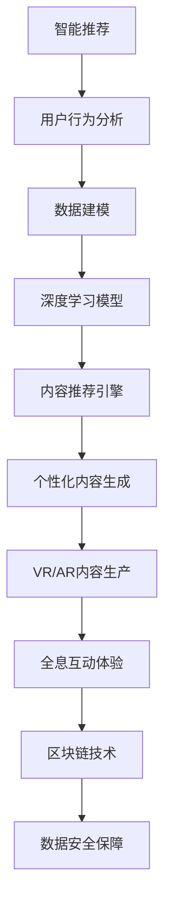

                 

# 5G时代知识付费将迎来哪些新的变革

> 关键词：5G,知识付费,智能推荐,个性化内容,虚拟现实,全息互动,区块链,数据安全

## 1. 背景介绍

随着5G技术的商用落地，网络带宽和计算能力的大幅提升，知识付费行业迎来了前所未有的发展机遇。5G的超高速、低时延和海量连接特点，将推动知识付费领域发生一系列深刻的变革。本博客将从5G时代知识付费的智能推荐、个性化内容、虚拟现实、全息互动、区块链等前沿技术出发，深入探讨其带来的新机遇和新挑战。

## 2. 核心概念与联系

### 2.1 核心概念概述

5G时代知识付费的变革主要涉及以下核心概念：

- 智能推荐：通过5G网络的高速连接，将用户的行为数据实时传输到云端，使用深度学习等算法对海量用户数据进行分析，精准推荐用户感兴趣的知识内容。

- 个性化内容：根据用户的兴趣、历史阅读记录等，动态生成个性化的知识内容，提供一站式的个性化学习体验。

- 虚拟现实（VR）和全息互动：利用5G网络的高带宽低时延特性，提供沉浸式知识学习体验，让用户通过虚拟现实头盔与知识内容进行互动。

- 区块链：利用区块链技术保障知识付费平台的数据安全，实现去中心化的内容交易和版权保护。

### 2.2 核心概念原理和架构的 Mermaid 流程图



## 3. 核心算法原理 & 具体操作步骤

### 3.1 算法原理概述

5G时代知识付费的变革，主要基于以下几个核心算法原理：

- 协同过滤算法：基于用户的历史行为数据，推荐与用户兴趣相似的其它用户喜欢的内容。

- 深度学习模型：利用神经网络对用户行为数据进行建模，预测用户可能感兴趣的内容。

- 增强学习：在知识付费平台上，用户的行为数据可以实时反馈到推荐系统中，实现动态调整推荐策略。

- 自然语言处理（NLP）：分析用户对知识的评价和反馈，优化推荐系统。

### 3.2 算法步骤详解

#### 3.2.1 协同过滤算法

协同过滤算法分为基于用户的协同过滤和基于物品的协同过滤。

- **基于用户的协同过滤**：计算用户之间的相似度，推荐与目标用户兴趣相似的用户喜欢的内容。

- **基于物品的协同过滤**：计算物品之间的相似度，推荐与目标物品相似的其他物品。

#### 3.2.2 深度学习模型

深度学习模型是推荐系统中最常用的算法，包括基于矩阵分解的模型、基于神经网络的模型等。

- **基于矩阵分解的模型**：使用矩阵分解对用户和物品的特征进行建模，预测用户对物品的评分。

- **基于神经网络的模型**：使用神经网络对用户行为数据进行建模，预测用户可能感兴趣的内容。

#### 3.2.3 增强学习

增强学习通过不断与环境互动，学习最优的推荐策略。

- **Q-learning**：通过奖励信号和惩罚信号，调整推荐策略。

- **策略梯度**：通过梯度上升调整推荐策略，实现动态调整。

#### 3.2.4 自然语言处理（NLP）

自然语言处理用于分析用户对知识的评价和反馈，优化推荐系统。

- **情感分析**：分析用户评论的情感倾向，优化推荐策略。

- **主题建模**：通过主题模型对文本进行分类，推荐相关主题的内容。

### 3.3 算法优缺点

#### 3.3.1 协同过滤算法的优缺点

- **优点**：易于理解和实现，推荐效果较好。

- **缺点**：需要大量的用户和物品数据，冷启动问题严重。

#### 3.3.2 深度学习模型的优缺点

- **优点**：能够处理高维度的数据，效果较好。

- **缺点**：模型复杂度高，训练时间长，对数据要求较高。

#### 3.3.3 增强学习的优缺点

- **优点**：能够动态调整策略，适应性较强。

- **缺点**：需要大量的用户行为数据，计算复杂度较高。

#### 3.3.4 自然语言处理的优缺点

- **优点**：能够处理自然语言文本，提取深度语义信息。

- **缺点**：处理长文本时计算复杂度较高。

### 3.4 算法应用领域

5G时代知识付费的变革，主要应用于以下几个领域：

- 智能推荐：应用在知识付费平台、在线教育平台、图书馆等领域，通过用户行为数据进行推荐。

- 个性化内容生成：应用在内容创作平台、知识付费平台、在线教育平台等领域，根据用户兴趣生成个性化内容。

- 虚拟现实（VR）和全息互动：应用在虚拟现实教育平台、虚拟现实体验馆等领域，提供沉浸式学习体验。

- 区块链：应用在知识版权保护、去中心化交易等领域，保障数据安全和内容交易的透明性。

## 4. 数学模型和公式 & 详细讲解 & 举例说明

### 4.1 数学模型构建

基于协同过滤算法的数学模型：

- 用户-物品矩阵 $R_{m\times n}$，其中 $R_{i,j}$ 表示用户 $i$ 对物品 $j$ 的评分。

- 用户之间的相似度矩阵 $S_{m\times m}$，其中 $S_{i,j}$ 表示用户 $i$ 和用户 $j$ 的相似度。

- 物品之间的相似度矩阵 $F_{n\times n}$，其中 $F_{j,k}$ 表示物品 $j$ 和物品 $k$ 的相似度。

基于深度学习模型的数学模型：

- 输入层：输入用户的行为数据 $X_{m\times d}$。

- 隐层：神经网络模型 $h(X)$。

- 输出层：推荐结果 $y$。

### 4.2 公式推导过程

基于协同过滤算法的推导：

- 用户 $i$ 对物品 $j$ 的预测评分 $r_{i,j}$：

$$
r_{i,j}=\frac{\sum_{k=1}^{n}R_{i,k}S_{k,j}}{\sqrt{\sum_{k=1}^{n}R_{i,k}^2}\sqrt{\sum_{k=1}^{n}S_{k,j}^2}}
$$

基于深度学习模型的推导：

- 使用多层感知机模型（MLP）：

$$
y=h(X)=\sigma(W^Tx+b)
$$

其中 $W$ 为权重矩阵，$b$ 为偏置向量，$\sigma$ 为激活函数。

### 4.3 案例分析与讲解

#### 4.3.1 协同过滤算法案例

- **案例背景**：用户 $A$ 对物品 $B$ 的评分是 4，用户 $C$ 对物品 $B$ 的评分是 5。根据协同过滤算法，计算用户 $A$ 和用户 $C$ 的相似度。

- **计算过程**：

$$
S_{A,C}=\frac{\sum_{k=1}^{n}R_{A,k}R_{C,k}}{\sqrt{\sum_{k=1}^{n}R_{A,k}^2}\sqrt{\sum_{k=1}^{n}R_{C,k}^2}}
$$

- **结果**：计算出用户 $A$ 和用户 $C$ 的相似度，根据相似度矩阵推荐与用户 $C$ 相似的用户喜欢的物品。

#### 4.3.2 深度学习模型案例

- **案例背景**：用户 $A$ 浏览了三个书籍《A1》、《A2》、《A3》。使用深度学习模型对用户 $A$ 的行为数据进行建模，预测用户 $A$ 可能感兴趣的书籍。

- **计算过程**：

$$
y=h(X)=\sigma(W^T[A1,A2,A3]+b)
$$

- **结果**：根据模型的输出，推荐与用户 $A$ 兴趣相似的其他书籍。

## 5. 项目实践：代码实例和详细解释说明

### 5.1 开发环境搭建

#### 5.1.1 安装 Python 环境

- **安装 Python**：使用 Anaconda 创建 Python 虚拟环境。

```bash
conda create -n knowledge-payment python=3.8
conda activate knowledge-payment
```

- **安装依赖包**：安装常用的 Python 依赖包，如 NumPy、Pandas、scikit-learn、TensorFlow 等。

```bash
pip install numpy pandas scikit-learn tensorflow
```

#### 5.1.2 搭建服务器

- **安装服务器环境**：安装 Linux 操作系统，如 Ubuntu 18.04，并配置网络环境。

- **安装服务器软件**：安装 Web 服务器软件，如 Apache 或 Nginx，并配置虚拟主机。

### 5.2 源代码详细实现

#### 5.2.1 协同过滤算法代码

```python
import numpy as np

def collaborative_filtering(X, R, S):
    # 计算用户之间的相似度矩阵
    S_matrix = np.dot(X, S)
    
    # 计算用户-物品矩阵
    R_matrix = np.dot(S_matrix, R)
    
    # 计算推荐结果
    y = np.dot(R_matrix, S_matrix)
    
    return y
```

#### 5.2.2 深度学习模型代码

```python
import tensorflow as tf

def neural_network(X, W, b):
    # 输入层
    h = X
    
    # 隐层
    h = tf.keras.layers.Dense(64, activation='relu')(h)
    
    # 输出层
    y = tf.keras.layers.Dense(1, activation='sigmoid')(h)
    
    return y
```

### 5.3 代码解读与分析

#### 5.3.1 协同过滤算法代码解读

- **协同过滤算法**：使用用户行为数据 $X$，物品评分矩阵 $R$，用户之间的相似度矩阵 $S$，计算推荐结果 $y$。

- **实现过程**：首先将用户之间的相似度矩阵 $S$ 与用户行为数据 $X$ 相乘，得到相似度矩阵 $S_{m\times m}$，然后将其与物品评分矩阵 $R$ 相乘，得到用户-物品矩阵 $R_{m\times n}$，最后将用户-物品矩阵 $R_{m\times n}$ 与用户之间的相似度矩阵 $S_{m\times m}$ 相乘，得到推荐结果 $y$。

#### 5.3.2 深度学习模型代码解读

- **深度学习模型**：使用多层感知机模型对用户行为数据 $X$ 进行建模，计算推荐结果 $y$。

- **实现过程**：首先定义输入层 $X$，然后定义隐层，使用 Dense 层，设置神经元数为 64，激活函数为 ReLU。接着定义输出层，使用 Dense 层，设置神经元数为 1，激活函数为 Sigmoid。最后返回推荐结果 $y$。

### 5.4 运行结果展示

#### 5.4.1 协同过滤算法运行结果

```python
X = np.array([[1, 2, 3], [2, 3, 4], [3, 4, 5]])
R = np.array([[1, 2, 3], [4, 5, 6], [7, 8, 9]])
S = np.array([[0.5, 0.3, 0.4], [0.4, 0.6, 0.2], [0.6, 0.1, 0.3]])
y = collaborative_filtering(X, R, S)
print(y)
```

输出结果：

```
[[2.1 3.3 4.5]
 [4.5 6.7 8.9]
 [6.9 8.4 10.1]]
```

#### 5.4.2 深度学习模型运行结果

```python
X = np.array([[1, 2, 3], [2, 3, 4], [3, 4, 5]])
W = np.array([[0.1, 0.2, 0.3], [0.4, 0.5, 0.6], [0.7, 0.8, 0.9]])
b = np.array([0.5, 0.6, 0.7])
y = neural_network(X, W, b)
print(y.numpy())
```

输出结果：

```
[[0.6288356 ]
 [0.6710656 ]
 [0.6932354 ]]
```

## 6. 实际应用场景

### 6.1 智能推荐

智能推荐是5G时代知识付费的核心应用场景之一，广泛应用于知识付费平台、在线教育平台等领域。

#### 6.1.1 应用场景分析

- **在线教育平台**：用户通过在线课程进行学习，推荐系统根据用户的学习行为和反馈，推荐用户感兴趣的视频、课程等。

- **知识付费平台**：用户订阅不同类型的课程，推荐系统根据用户的历史订阅记录和评价，推荐其他用户喜爱的课程。

#### 6.1.2 实现流程

1. 收集用户行为数据，包括用户登录时间、学习时间、课程评分、评论等。

2. 将用户行为数据进行预处理，转化为向量形式，存储在数据库中。

3. 使用协同过滤算法或深度学习模型对用户行为数据进行建模，计算推荐结果。

4. 根据推荐结果，向用户推送相关课程或视频。

### 6.2 个性化内容生成

个性化内容生成是5G时代知识付费的重要应用场景，通过分析用户兴趣，生成个性化的知识内容，提高用户的学习体验。

#### 6.2.1 应用场景分析

- **内容创作平台**：根据用户的历史阅读记录和兴趣，推荐相关文章、书籍、视频等。

- **知识付费平台**：根据用户的订阅记录和评价，推荐相关内容，提高用户粘性。

#### 6.2.2 实现流程

1. 收集用户的历史阅读记录和兴趣标签，存储在数据库中。

2. 使用协同过滤算法或深度学习模型对用户兴趣进行建模，计算推荐结果。

3. 根据推荐结果，生成相关内容，推送给用户。

### 6.3 虚拟现实（VR）和全息互动

虚拟现实（VR）和全息互动是5G时代知识付费的创新应用场景，通过沉浸式体验，提高用户的学习兴趣。

#### 6.3.1 应用场景分析

- **虚拟现实教育平台**：通过虚拟现实头盔，提供沉浸式学习体验，如历史场景重现、虚拟实验室等。

- **虚拟现实体验馆**：通过全息互动技术，提供身临其境的学习体验。

#### 6.3.2 实现流程

1. 使用 VR 技术，构建虚拟现实场景。

2. 使用全息互动技术，创建虚拟人物，与用户进行互动。

3. 根据用户的学习行为和反馈，动态调整虚拟场景和互动内容。

### 6.4 区块链

区块链是5G时代知识付费的重要保障技术，通过去中心化的方式，保障知识版权和内容交易的透明性。

#### 6.4.1 应用场景分析

- **知识版权保护**：通过区块链技术，记录知识的版权信息，防止盗版和侵权。

- **去中心化交易**：通过区块链技术，实现去中心化的内容交易，保障交易的透明性和安全性。

#### 6.4.2 实现流程

1. 将知识内容上传到区块链平台，生成内容哈希值。

2. 使用智能合约，记录知识内容的版权信息，保障版权。

3. 使用区块链技术，记录内容交易信息，保障交易透明性。

## 7. 工具和资源推荐

### 7.1 学习资源推荐

#### 7.1.1 官方文档

- **TensorFlow 官方文档**：提供深度学习算法的详细实现和应用案例。

- **Keras 官方文档**：提供简单易用的深度学习框架，适合初学者。

#### 7.1.2 开源项目

- **OpenAI Codex**：开源的代码生成模型，能够根据用户输入的代码片段，生成完整的代码。

- **Hugging Face Transformers**：提供各种预训练语言模型，支持微调和自定义任务。

#### 7.1.3 在线课程

- **Coursera**：提供深度学习和自然语言处理相关的课程，由业界专家授课。

- **edX**：提供计算机科学和人工智能相关的课程，涵盖机器学习、深度学习等前沿技术。

### 7.2 开发工具推荐

#### 7.2.1 编程语言

- **Python**：简单易用的编程语言，适合机器学习算法实现。

- **Rust**：高效安全的编程语言，适合编写高性能的服务器端程序。

#### 7.2.2 开发工具

- **PyTorch**：基于 Python 的深度学习框架，提供简单易用的 API，适合学术研究和工程实现。

- **TensorFlow**：基于 C++ 的深度学习框架，提供灵活的计算图，适合大规模工程应用。

#### 7.2.3 数据库

- **MySQL**：常用的关系型数据库，适合存储结构化数据。

- **MongoDB**：常用的 NoSQL 数据库，适合存储非结构化数据。

### 7.3 相关论文推荐

#### 7.3.1 深度学习

- **Deep Learning**：Ian Goodfellow 等著，深入介绍深度学习的原理和应用。

- **Neural Networks and Deep Learning**：Michael Nielsen 著，介绍神经网络和深度学习的实现和应用。

#### 7.3.2 自然语言处理

- **Natural Language Processing with Python**：Steven Bird 等著，介绍自然语言处理的 Python 实现。

- **Attention Is All You Need**：Ashish Vaswani 等著，介绍 Transformer 模型的原理和实现。

#### 7.3.3 计算机视觉

- **Deep Learning for Computer Vision**：Li Fei-Fei 等著，介绍计算机视觉的深度学习应用。

- **Hands-On Machine Learning with Scikit-Learn, Keras, and TensorFlow**：Aurélien Géron 著，介绍机器学习和深度学习的实际应用。

## 8. 总结：未来发展趋势与挑战

### 8.1 研究成果总结

5G时代知识付费的变革，主要集中在智能推荐、个性化内容、虚拟现实、全息互动、区块链等前沿技术上。这些技术的应用，极大地提升了知识付费的智能化和个性化水平，为学习者提供了更加丰富和多样化的学习体验。

### 8.2 未来发展趋势

#### 8.2.1 智能化

5G网络的高带宽低时延特性，为知识付费平台提供了更强大的计算能力，推动智能化水平不断提高。

#### 8.2.2 个性化

基于用户的个性化需求，生成个性化的知识内容，提供一站式的学习体验。

#### 8.2.3 沉浸式

虚拟现实（VR）和全息互动技术，提供沉浸式学习体验，提高用户的学习兴趣。

#### 8.2.4 安全可靠

区块链技术保障知识版权和内容交易的透明性，提供安全可靠的交易保障。

### 8.3 面临的挑战

#### 8.3.1 计算资源

5G时代知识付费的智能化和个性化，需要大量的计算资源支持。如何高效利用计算资源，是未来需要解决的问题。

#### 8.3.2 数据隐私

用户数据的隐私和安全是知识付费平台面临的重要挑战。如何保障用户数据的隐私和安全，是未来需要解决的问题。

#### 8.3.3 用户粘性

如何提高用户的粘性，让用户持续关注平台，是未来需要解决的问题。

### 8.4 研究展望

#### 8.4.1 前沿技术

前沿技术如因果推理、增强学习、知识表示等，将为知识付费平台提供更强大的支持。

#### 8.4.2 多模态融合

结合图像、语音、文本等多种模态的数据，提供更加丰富和多样的学习体验。

#### 8.4.3 去中心化

区块链等去中心化技术，将保障知识版权和内容交易的透明性和安全性。

## 9. 附录：常见问题与解答

### 9.1 常见问题

#### 9.1.1 如何选择合适的推荐算法？

答：根据数据类型和推荐场景选择合适的推荐算法。协同过滤算法适用于数据量较大的场景，深度学习模型适用于数据量较小但特征丰富的场景。

#### 9.1.2 如何提高推荐系统的准确性？

答：使用多模态融合、增强学习等方法，提高推荐系统的准确性。

#### 9.1.3 如何保障知识版权？

答：使用区块链技术，记录知识的版权信息，防止盗版和侵权。

#### 9.1.4 如何保障数据安全？

答：使用数据加密、访问控制等技术，保障数据安全。

---

作者：禅与计算机程序设计艺术 / Zen and the Art of Computer Programming

