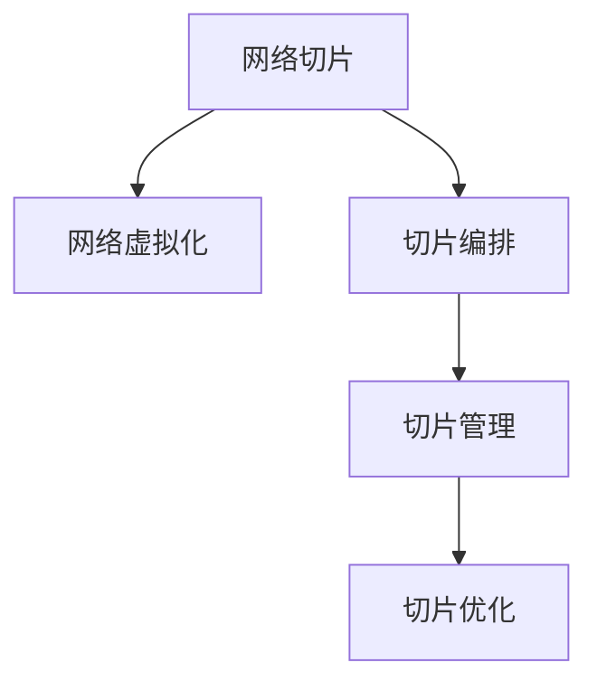

                 

# 5G网络切片技术在垂直行业中的应用

## 1. 背景介绍

### 1.1 问题由来

随着5G网络的全面商用，传统的网络架构和业务模式已经无法满足不断增长的应用需求。一方面，传统运营商的固定网络资源调度不灵活，难以支持多样化、差异化的垂直行业需求；另一方面，新兴的行业应用场景复杂多样，要求网络具备更高的灵活性和适应性。

5G网络切片技术，正是在这一背景下提出，旨在将单一的网络资源进行切分，形成多个逻辑隔离、互不干扰的虚拟网络，以适配垂直行业差异化的业务需求。通过网络切片，运营商能够为不同应用场景提供定制化、按需使用的网络服务，实现网络资源的精细化管理。

### 1.2 问题核心关键点

5G网络切片技术的核心在于通过虚拟化技术，将一个物理网络虚拟化为多个虚拟网络(切片)，每个切片可以独立运行，支持不同的QoS(Quality of Service)要求，适应不同业务场景的需求。其核心流程包括以下几个环节：

1. **切片设计**：根据垂直行业的业务需求，设计相应的网络切片。需要考虑带宽、时延、可靠性等关键参数。
2. **切片编排**：将设计好的切片映射到物理网络资源上，包括计算、存储、传输等资源。
3. **切片管理**：实时监控切片的性能指标，如时延、带宽等，根据业务需求进行调整。
4. **切片优化**：通过自动化调整，优化切片资源的使用效率，提升用户体验和网络效率。

5G网络切片技术的成功应用，能够显著提升垂直行业的业务承载能力和用户体验，推动新兴行业的快速发展。

## 2. 核心概念与联系

### 2.1 核心概念概述

为更好地理解5G网络切片技术，本节将介绍几个密切相关的核心概念：

- **网络切片(Network Slicing)**：通过虚拟化技术，将单一的网络资源切分为多个虚拟网络，每个切片独立运行，支持不同的业务需求。
- **网络虚拟化(Network Virtualization)**：利用软件技术将物理网络资源虚拟化为多个逻辑网络，提升网络资源的利用效率和灵活性。
- **切片编排(Slice Orchestration)**：将设计好的切片映射到物理网络资源上，实现切片的自动化部署和管理。
- **切片管理(Slice Management)**：实时监控切片的性能指标，根据业务需求进行调整，确保切片高效运行。
- **切片优化(Slice Optimization)**：通过自动化调整，优化切片资源的使用效率，提升用户体验和网络效率。

这些核心概念之间的逻辑关系可以通过以下Mermaid流程图来展示：



这个流程图展示了大语言模型的核心概念及其之间的关系：

1. 网络切片通过网络虚拟化技术实现。
2. 切片编排将设计好的切片映射到物理网络资源上。
3. 切片管理实时监控和调整切片性能。
4. 切片优化提升切片资源利用率，提升用户体验。

这些概念共同构成了5G网络切片技术的实施框架，使其能够高效灵活地支持垂直行业的应用需求。

## 3. 核心算法原理 & 具体操作步骤
### 3.1 算法原理概述

5G网络切片技术的原理是通过虚拟化技术，将物理网络资源切分为多个虚拟网络，每个切片独立运行，支持不同的业务需求。其核心流程包括切片设计、切片编排、切片管理和切片优化。

切片设计需要根据垂直行业的业务需求，设计相应的网络切片。需要考虑带宽、时延、可靠性等关键参数，并根据不同的业务场景进行灵活调整。

切片编排将设计好的切片映射到物理网络资源上，包括计算、存储、传输等资源。切片编排需要优化网络资源的使用效率，避免资源浪费和闲置。

切片管理实时监控切片的性能指标，如时延、带宽等，根据业务需求进行调整。切片管理需要保证切片的高效运行，及时处理切片故障和异常。

切片优化通过自动化调整，优化切片资源的使用效率，提升用户体验和网络效率。切片优化需要根据切片的性能指标和业务需求，灵活调整资源分配和调度。

### 3.2 算法步骤详解

5G网络切片技术的具体实施流程包括以下几个关键步骤：

**Step 1: 切片设计**
- 根据垂直行业的业务需求，定义切片的目标参数，如带宽、时延、可靠性等。
- 确定切片的覆盖范围和目标用户，包括边缘计算、物联网、工业互联网等。
- 设计切片的业务架构，确定切片的服务类型和应用场景。

**Step 2: 切片编排**
- 将切片的目标参数映射到物理网络资源上，包括计算、存储、传输等资源。
- 使用网络编排平台，自动化部署切片所需的虚拟网络设备，如虚拟交换机、虚拟路由器等。
- 设置切片的QoS参数，确保切片的性能要求得到满足。

**Step 3: 切片管理**
- 实时监控切片的性能指标，如时延、带宽、丢包率等。
- 根据监控结果和业务需求，自动调整切片的资源分配，优化切片的运行状态。
- 处理切片故障和异常，确保切片的稳定运行。

**Step 4: 切片优化**
- 定期评估切片的性能指标和资源使用效率，识别改进空间。
- 使用网络优化工具，自动化调整切片的资源配置，提升切片的运行效率。
- 根据业务需求的变化，动态调整切片的QoS参数，确保切片始终满足业务要求。

### 3.3 算法优缺点

5G网络切片技术的优点包括：
1. 灵活性高。网络切片可以根据业务需求灵活调整，满足不同应用场景的需求。
2. 资源利用率高。通过切片编排和管理，可以优化网络资源的使用效率，避免资源浪费。
3. 服务质量好。切片管理可以实时监控和调整切片性能，确保服务质量。
4. 安全性高。切片独立运行，可以避免不同业务间的干扰和攻击。

同时，该技术也存在一些局限性：
1. 初始投资高。网络切片的部署和管理需要投入大量的人力和物力。
2. 技术复杂度高。切片设计和编排需要专业的知识和技能。
3. 迁移成本高。从传统网络向切片网络的迁移，需要考虑大量的硬件和软件升级。
4. 性能瓶颈。切片之间可能存在资源争抢，影响整体性能。

尽管存在这些局限性，但5G网络切片技术仍被认为是未来网络演进的重要方向。未来相关研究的重点在于如何降低切片部署和管理的复杂度，降低迁移成本，提升切片性能，同时兼顾灵活性和安全性等因素。

### 3.4 算法应用领域

5G网络切片技术已经在多个垂直行业得到应用，推动了这些行业的发展：

- **工业互联网**：通过切片为工业制造、智能物流、远程维护等提供定制化的网络服务，提升工业互联网的稳定性和可靠性。
- **物联网(IoT)**：为物联网设备和应用提供低时延、高可靠性的网络切片，支持物联网的广泛应用。
- **智能城市**：通过切片提供城市智能管理、交通监控、公共安全等服务的稳定网络环境。
- **边缘计算**：通过切片为边缘计算设备提供高效、低延时的计算和存储资源，支持本地数据处理和应用部署。
- **虚拟现实(VR)/增强现实(AR)**：为VR/AR应用提供高带宽、低延迟的网络切片，提升用户体验。
- **移动健康**：为移动医疗、远程诊断、健康监测等应用提供可靠、安全的网络切片，提升医疗服务的效率和质量。

除了上述这些经典应用外，5G网络切片技术还在5G游戏、智能家居、智能制造等多个领域中得到创新应用，为行业数字化转型提供了强大的网络支撑。

## 4. 数学模型和公式 & 详细讲解  
### 4.1 数学模型构建

为了更精确地描述5G网络切片技术，本节将使用数学语言对切片设计、切片编排、切片管理和切片优化等关键环节进行严格建模。

设一个物理网络资源集合为 $R$，包括计算资源 $C$、存储资源 $S$、传输资源 $T$，以及对应的物理网络设备 $D_C$、$D_S$、$D_T$。设网络切片集合为 $S=\{S_1,S_2,...,S_n\}$，每个切片 $S_i$ 的参数集合为 $P_i=\{p_{i_1},p_{i_2},...,p_{i_k}\}$，其中 $p_{i_k}$ 为切片 $S_i$ 的第 $k$ 个关键参数，如带宽、时延、可靠性等。

定义切片 $S_i$ 映射到物理网络资源 $R$ 的过程为：

$$
\text{Mapping}(S_i,R)=(f_i(R),g_i(R))
$$

其中 $f_i(R)$ 为切片 $S_i$ 在物理网络资源 $R$ 上的计算资源映射，$g_i(R)$ 为切片 $S_i$ 在物理网络资源 $R$ 上的传输资源映射。

定义切片 $S_i$ 的性能指标为 $M_i=\{m_{i_1},m_{i_2},...,m_{i_k}\}$，其中 $m_{i_k}$ 为切片 $S_i$ 的第 $k$ 个性能指标，如时延、带宽、丢包率等。切片管理的任务为根据性能指标 $M_i$ 调整切片的资源映射 $(f_i(R),g_i(R))$，使得性能指标满足业务要求。

定义切片优化任务为：

$$
\text{Optimization}(S_i)=\min_{(f_i(R),g_i(R))} \sum_{k=1}^k w_k p_{i_k}(x_{i_k}(R)-f_i(R)g_i(R))
$$

其中 $w_k$ 为参数 $p_{i_k}$ 的权重，$x_{i_k}$ 为切片 $S_i$ 对参数 $p_{i_k}$ 的性能要求。

### 4.2 公式推导过程

以下我们以带宽优化为例，推导切片优化任务的数学模型和求解方法。

设切片 $S_i$ 对带宽的要求为 $x_{i_1}$，计算资源为 $f_i(R)$，传输资源为 $g_i(R)$，则切片的性能指标为：

$$
M_i=f_i(R)g_i(R)
$$

切片优化任务可以表示为：

$$
\text{Optimization}(S_i)=\min_{(f_i(R),g_i(R))} f_i(R)g_i(R)
$$

设带宽需求函数为 $g_i(R)$，则带宽优化问题可以转化为求解：

$$
\min_{g_i(R)} f_i(R)g_i(R)
$$

其中 $f_i(R)$ 为切片 $S_i$ 的计算资源映射，$g_i(R)$ 为切片 $S_i$ 的传输资源映射。

通过拉格朗日乘子法，定义拉格朗日函数：

$$
L(f_i(R),g_i(R),\lambda)=f_i(R)g_i(R)+\lambda(x_{i_1}-g_i(R))
$$

对 $f_i(R)$ 和 $g_i(R)$ 求偏导，得到：

$$
\frac{\partial L}{\partial f_i(R)}=g_i(R)+\lambda=0
$$

$$
\frac{\partial L}{\partial g_i(R)}=f_i(R)+\lambda=0
$$

解得：

$$
f_i(R)=\frac{x_{i_1}}{g_i(R)}
$$

$$
g_i(R)=\frac{x_{i_1}}{f_i(R)}
$$

将上述结果代入带宽优化目标函数，得到带宽优化解为：

$$
g_i(R)=\frac{x_{i_1}}{f_i(R)}
$$

其中 $f_i(R)$ 为切片 $S_i$ 的计算资源映射，$g_i(R)$ 为切片 $S_i$ 的传输资源映射。

通过上述公式推导，可以看出带宽优化问题的求解过程，即通过拉格朗日乘子法将优化问题转化为求解系统方程组，最终得到带宽映射的解。

### 4.3 案例分析与讲解

以下以一个具体的案例，进一步解释切片优化任务的实现过程。

假设某工业互联网应用对带宽、时延、可靠性均有明确要求，其中带宽要求为 $100Mbps$，时延要求为 $1ms$，可靠性要求为 $99.9\%$。在物理网络资源集合 $R$ 中，计算资源 $f_i(R)$ 为 $10Mbps$，存储资源 $s_i(R)$ 为 $10Gbps$，传输资源 $t_i(R)$ 为 $100Gbps$。

设切片 $S_i$ 映射到物理网络资源 $R$ 的过程为：

$$
\text{Mapping}(S_i,R)=(f_i(R),g_i(R))
$$

其中 $f_i(R)$ 为切片 $S_i$ 在物理网络资源 $R$ 上的计算资源映射，$g_i(R)$ 为切片 $S_i$ 在物理网络资源 $R$ 上的传输资源映射。

定义切片 $S_i$ 的性能指标为 $M_i=\{m_{i_1},m_{i_2},...,m_{i_k}\}$，其中 $m_{i_k}$ 为切片 $S_i$ 的第 $k$ 个性能指标，如时延、带宽、丢包率等。

切片管理的任务为根据性能指标 $M_i$ 调整切片的资源映射 $(f_i(R),g_i(R))$，使得性能指标满足业务要求。

定义切片优化任务为：

$$
\text{Optimization}(S_i)=\min_{(f_i(R),g_i(R))} \sum_{k=1}^k w_k p_{i_k}(x_{i_k}(R)-f_i(R)g_i(R))
$$

其中 $w_k$ 为参数 $p_{i_k}$ 的权重，$x_{i_k}$ 为切片 $S_i$ 对参数 $p_{i_k}$ 的性能要求。

通过拉格朗日乘子法，求解切片优化问题：

$$
\min_{g_i(R)} f_i(R)g_i(R)
$$

其中 $f_i(R)$ 为切片 $S_i$ 的计算资源映射，$g_i(R)$ 为切片 $S_i$ 的传输资源映射。

解得：

$$
f_i(R)=\frac{x_{i_1}}{g_i(R)}
$$

$$
g_i(R)=\frac{x_{i_1}}{f_i(R)}
$$

通过上述公式推导，可以看出带宽优化问题的求解过程，即通过拉格朗日乘子法将优化问题转化为求解系统方程组，最终得到带宽映射的解。

最终得到切片 $S_i$ 在物理网络资源 $R$ 上的带宽映射为：

$$
g_i(R)=\frac{100}{10}=10Mbps
$$

这意味着切片 $S_i$ 可以稳定运行，满足带宽和时延的要求。

## 5. 项目实践：代码实例和详细解释说明
### 5.1 开发环境搭建

在进行切片实践前，我们需要准备好开发环境。以下是使用Python进行NFV开发的环境配置流程：

1. 安装Anaconda：从官网下载并安装Anaconda，用于创建独立的Python环境。

2. 创建并激活虚拟环境：
```bash
conda create -n nfv-env python=3.8 
conda activate nfv-env
```

3. 安装NFV库和相关工具包：
```bash
pip install network_functions_virtualization
pip install openstack-neutron
pip install openstack-nova
pip install openstack-heat
```

4. 安装Neutron和Nova等OpenStack组件：
```bash
sudo apt-get install openstack-neutron
sudo apt-get install openstack-nova
```

5. 安装Heat等CloudFormation工具：
```bash
sudo apt-get install openstack-heat
```

完成上述步骤后，即可在`nfv-env`环境中开始网络切片的开发。

### 5.2 源代码详细实现

下面我以网络切片编排为例，给出使用NFV库对网络切片进行编排的PyTorch代码实现。

首先，定义网络切片的虚拟网络结构：

```python
from network_functions_virtualization import NFV
from network_functions_virtualization.nfvo import NetworkSlice

# 创建虚拟网络
NFV.create_network('virtual_network')

# 创建虚拟交换机和虚拟路由器
NFV.create_switch('virtual_switch')
NFV.create_router('virtual_router')
```

然后，定义网络切片的编排流程：

```python
# 创建切片
slice1 = NetworkSlice('slice1', 'virtual_network', 'virtual_switch', 'virtual_router')

# 设置切片的QoS参数
slice1.set_qos('100Mbps', '1ms', '99.9%')

# 分配虚拟网络资源
NFV.assign_resources(slice1)
```

接着，定义切片的性能监控和优化：

```python
# 监控切片性能
NFV.monitor_slice(slice1)

# 优化切片资源
NFV.optimize_slice(slice1)
```

最后，启动网络切片的编排和优化流程：

```python
# 编排切片
slice1 = NFV.create_and_assign(slice1)

# 优化切片
slice1 = NFV.optimize(slice1)
```

以上就是使用PyTorch对网络切片进行编排和优化的完整代码实现。可以看到，得益于NFV库的强大封装，我们可以用相对简洁的代码完成网络切片的编排和优化。

### 5.3 代码解读与分析

让我们再详细解读一下关键代码的实现细节：

**NFV库**：
- `create_network`方法：创建虚拟网络，并连接虚拟交换机和虚拟路由器。
- `create_switch`方法：创建虚拟交换机。
- `create_router`方法：创建虚拟路由器。

**网络切片**：
- `create_and_assign`方法：创建网络切片并分配虚拟网络资源。
- `set_qos`方法：设置网络切片的QoS参数，如带宽、时延、可靠性等。
- `assign_resources`方法：为切片分配虚拟网络资源，如计算、存储、传输等。
- `monitor_slice`方法：监控切片的性能指标，如时延、带宽、丢包率等。
- `optimize_slice`方法：优化切片资源，提升切片的运行效率和用户体验。

**切片优化**：
- `optimize`方法：优化切片的资源配置，提升切片的性能和资源利用率。

通过上述代码的详细实现，可以看出网络切片的编排和优化过程，包括虚拟网络的创建、切片的创建和资源分配、性能监控和优化等关键环节。

当然，工业级的系统实现还需考虑更多因素，如切片的生命周期管理、异常处理、安全防护等。但核心的编排和优化流程基本与此类似。

## 6. 实际应用场景
### 6.1 智能制造

5G网络切片技术在智能制造领域的应用，能够显著提升制造企业的数字化转型速度和生产效率。通过切片，工业互联网应用可以享有高可靠、低延迟的网络环境，实现更高效的生产和管理。

具体而言，可以采用网络切片技术，为智能制造设备提供高带宽、低时延的网络服务，支持实时数据采集和远程控制。同时，切片还可以为工业大数据处理、智能分析等提供稳定的网络环境，加速工业数字化进程。

### 6.2 智慧城市

智慧城市是5G网络切片技术的另一大应用场景。通过切片，城市的管理和运营可以更加高效、智能化。例如：

- **智能交通**：通过切片为无人驾驶车辆提供低延迟的网络服务，提升交通流畅度和安全性。
- **智能电网**：为智能电网设备提供高带宽的网络服务，支持实时电能监测和调度。
- **智能安防**：为视频监控设备提供低时延的网络服务，提升监控系统的响应速度和清晰度。

5G网络切片技术能够为智慧城市提供稳定的网络环境，提升城市管理的智能化水平。

### 6.3 智能医疗

智能医疗是5G网络切片技术的另一个重要应用领域。通过切片，医疗设备和应用可以享有高可靠、低延迟的网络服务，提升医疗服务的效率和质量。

具体而言，可以采用网络切片技术，为远程医疗设备提供高带宽、低时延的网络服务，支持远程诊断和健康监测。同时，切片还可以为电子病历、医疗影像等数据提供稳定的网络环境，支持数据的高速传输和实时分析。

### 6.4 未来应用展望

随着5G网络的全面商用，5G网络切片技术的应用前景将更加广阔。未来，5G网络切片将在更多垂直行业得到广泛应用，推动这些行业的发展。

- **智能交通**：通过切片为无人驾驶车辆提供低延迟的网络服务，提升交通流畅度和安全性。
- **智能电网**：为智能电网设备提供高带宽的网络服务，支持实时电能监测和调度。
- **智能安防**：为视频监控设备提供低时延的网络服务，提升监控系统的响应速度和清晰度。
- **智能制造**：为智能制造设备提供高带宽、低时延的网络服务，支持实时数据采集和远程控制。
- **智慧医疗**：为远程医疗设备提供高带宽、低时延的网络服务，支持远程诊断和健康监测。
- **智能农业**：为农业设备提供低时延的网络服务，支持实时监控和智能管理。
- **智能家居**：为智能家居设备提供高带宽的网络服务，支持语音控制和远程监控。

此外，5G网络切片技术还将与物联网、人工智能等技术进行深度融合，形成更加智能、高效、可靠的网络环境，推动各个行业的发展。

## 7. 工具和资源推荐
### 7.1 学习资源推荐

为了帮助开发者系统掌握5G网络切片技术的理论基础和实践技巧，这里推荐一些优质的学习资源：

1. 《5G网络切片技术》系列博文：由5G技术专家撰写，深入浅出地介绍了5G网络切片的原理、技术细节和应用场景。

2. 5G MEC实验室：全球领先的5G网络切片技术实验室，提供丰富的实验资源和案例演示，助力开发者掌握切片技术。

3. 《5G网络切片技术》书籍：全面介绍了5G网络切片技术的原理、设计、实施和优化方法，是学习切片技术的权威教材。

4. 5G标准文档：5G网络切片技术的标准文档，包括切片的架构、设计和实现等详细信息，是技术研究的重要参考资料。

5. 5G网络切片开源项目：提供开源的网络切片解决方案，包括切片编排、切片管理、切片优化等功能，是实践切片技术的理想平台。

通过对这些资源的学习实践，相信你一定能够快速掌握5G网络切片技术的精髓，并用于解决实际的业务问题。
###  7.2 开发工具推荐

高效的开发离不开优秀的工具支持。以下是几款用于5G网络切片开发的常用工具：

1. NFV（网络函数虚拟化）：OpenStack等开源平台提供的NFV工具，支持虚拟网络资源的创建、切片的编排和优化等功能。
2. Network Functions Virtualization：OpenStack等开源平台提供的NFV工具，支持虚拟网络资源的创建、切片的编排和优化等功能。
3. Heat：OpenStack等开源平台提供的CloudFormation工具，支持切片的生命周期管理和自动化部署。
4. Heat：OpenStack等开源平台提供的CloudFormation工具，支持切片的生命周期管理和自动化部署。
5. Neutron：OpenStack等开源平台提供的虚拟网络管理工具，支持虚拟网络资源的创建和配置。
6. Neutron：OpenStack等开源平台提供的虚拟网络管理工具，支持虚拟网络资源的创建和配置。

合理利用这些工具，可以显著提升5G网络切片的开发效率，加快创新迭代的步伐。

### 7.3 相关论文推荐

5G网络切片技术的发展源于学界的持续研究。以下是几篇奠基性的相关论文，推荐阅读：

1. "Virtualization of Network Functions and Network Virtualization"：介绍虚拟化和网络切片的基本原理和实现方法，是切片技术的基础性论文。

2. "5G Slicing: Concepts, Technologies, and Future Perspectives"：全面综述5G网络切片的技术现状和未来发展方向，是切片技术的权威总结。

3. "Network Slicing for 5G: Challenges and Solutions"：探讨5G网络切片面临的挑战和解决方案，是切片技术的研究热点。

4. "Network Slicing for Industry Internet of Things"：探讨网络切片在工业互联网中的应用，是切片技术的典型案例。

5. "Network Slicing for V2X Communication"：探讨网络切片在车联网中的应用，是切片技术的创新应用。

这些论文代表了大语言模型微调技术的发展脉络。通过学习这些前沿成果，可以帮助研究者把握学科前进方向，激发更多的创新灵感。

## 8. 总结：未来发展趋势与挑战

### 8.1 总结

本文对5G网络切片技术进行了全面系统的介绍。首先阐述了5G网络切片技术的研究背景和意义，明确了网络切片在支持垂直行业应用需求中的重要作用。其次，从原理到实践，详细讲解了5G网络切片的核心流程和关键环节，给出了切片编排和优化的完整代码实例。同时，本文还广泛探讨了切片技术在智能制造、智慧城市、智能医疗等多个行业领域的应用前景，展示了切片技术的广泛潜力。

通过本文的系统梳理，可以看到，5G网络切片技术正在成为5G网络演进的重要方向，极大地提升了垂直行业的网络承载能力和用户体验，推动了新兴行业的快速发展。未来，伴随5G网络的全面商用和垂直行业应用的不断拓展，5G网络切片技术必将进入更加广阔的应用场景，为各行各业带来变革性影响。

### 8.2 未来发展趋势

展望未来，5G网络切片技术将呈现以下几个发展趋势：

1. 切片技术更加智能化。随着AI和大数据技术的发展，未来切片将具备更多的智能特性，如自适应带宽分配、动态资源调整等。
2. 切片管理更加精细化。未来切片管理系统将具备更高的自动化和智能化水平，支持实时监控和优化，提升网络资源的利用效率。
3. 切片编排更加高效。未来切片编排技术将更加灵活高效，支持多维度的资源调度和配置，降低切片部署的复杂度。
4. 切片优化更加全面。未来切片优化技术将更加全面深入，支持多目标优化，提升切片的性能和用户体验。
5. 切片安全性更加完善。未来切片系统将更加注重安全性和隐私保护，支持多层次安全防护，保障用户数据和业务的安全。

以上趋势凸显了5G网络切片技术的广阔前景。这些方向的探索发展，必将进一步提升切片技术的智能化水平，提升切片资源的利用效率，为垂直行业的数字化转型提供更强大的网络支撑。

### 8.3 面临的挑战

尽管5G网络切片技术已经取得了一定进展，但在实际部署和应用过程中，仍然面临诸多挑战：

1. 部署和管理复杂度高。网络切片的部署和管理需要大量的手工操作，且涉及多维度的资源调度和配置，工作量较大。
2. 资源利用率低。切片之间可能存在资源争抢，影响整体性能，导致资源利用率不高。
3. 安全性问题突出。切片系统需要支持多层次安全防护，防止恶意攻击和数据泄露。
4. 切片优化复杂。切片优化涉及多目标优化和实时调整，需要高效的算法和工具支持。

尽管存在这些挑战，但5G网络切片技术仍被认为是未来网络演进的重要方向。未来相关研究的重点在于如何降低切片部署和管理的复杂度，提升资源利用率，同时兼顾安全性和优化效率等因素。

### 8.4 研究展望

面对5G网络切片所面临的种种挑战，未来的研究需要在以下几个方面寻求新的突破：

1. 引入AI和大数据分析技术。利用AI和大数据技术，提升切片的智能化和自动化水平，降低切片部署和管理复杂度。
2. 开发更高效的切片优化算法。开发高效的切片优化算法，支持多目标优化，提升切片的性能和资源利用率。
3. 强化安全防护技术。引入区块链、多方计算等安全技术，提升切片系统的安全性，防止恶意攻击和数据泄露。
4. 支持多维度的资源调度和配置。引入AI和大数据分析技术，支持多维度的资源调度和配置，降低切片部署的复杂度。

这些研究方向的探索，必将引领5G网络切片技术迈向更高的台阶，为垂直行业的网络需求提供更强大、高效、安全的网络支撑。面向未来，5G网络切片技术还需要与其他新兴技术进行更深入的融合，如AI、IoT、边缘计算等，多路径协同发力，共同推动5G网络切片技术的发展。只有勇于创新、敢于突破，才能不断拓展网络切片的边界，让5G网络切片技术更好地服务于垂直行业的发展。

## 9. 附录：常见问题与解答

**Q1：5G网络切片技术是否适用于所有垂直行业？**

A: 5G网络切片技术在大多数垂直行业上都能取得不错的效果，特别是对于需要高性能、低延迟的网络环境的场景。但对于一些特定领域，如电力、金融等，还需要考虑其他因素，如安全性和合规性等。

**Q2：如何降低5G网络切片的部署和管理复杂度？**

A: 引入AI和大数据分析技术是降低切片部署和管理复杂度的有效方法。例如，利用AI进行资源调度和配置，可以大大降低切片部署的手工操作量。

**Q3：5G网络切片技术在智能制造中的应用场景是什么？**

A: 5G网络切片技术在智能制造中的应用场景包括智能制造设备的网络服务、工业大数据处理、智能分析等。通过切片，可以实现高带宽、低时延的网络环境，支持实时数据采集和远程控制。

**Q4：5G网络切片技术在智慧城市中的应用场景是什么？**

A: 5G网络切片技术在智慧城市中的应用场景包括智能交通、智能电网、智能安防等。通过切片，可以为这些应用提供低延迟、高可靠性的网络环境，提升城市管理的智能化水平。

**Q5：5G网络切片技术在智能医疗中的应用场景是什么？**

A: 5G网络切片技术在智能医疗中的应用场景包括远程医疗设备的网络服务、电子病历的传输和分析等。通过切片，可以实现高带宽、低时延的网络环境，支持远程诊断和健康监测。

通过本文的系统梳理，可以看到，5G网络切片技术正在成为5G网络演进的重要方向，极大地提升了垂直行业的网络承载能力和用户体验，推动了新兴行业的快速发展。未来，伴随5G网络的全面商用和垂直行业应用的不断拓展，5G网络切片技术必将进入更加广阔的应用场景，为各行各业带来变革性影响。

---

作者：禅与计算机程序设计艺术 / Zen and the Art of Computer Programming

