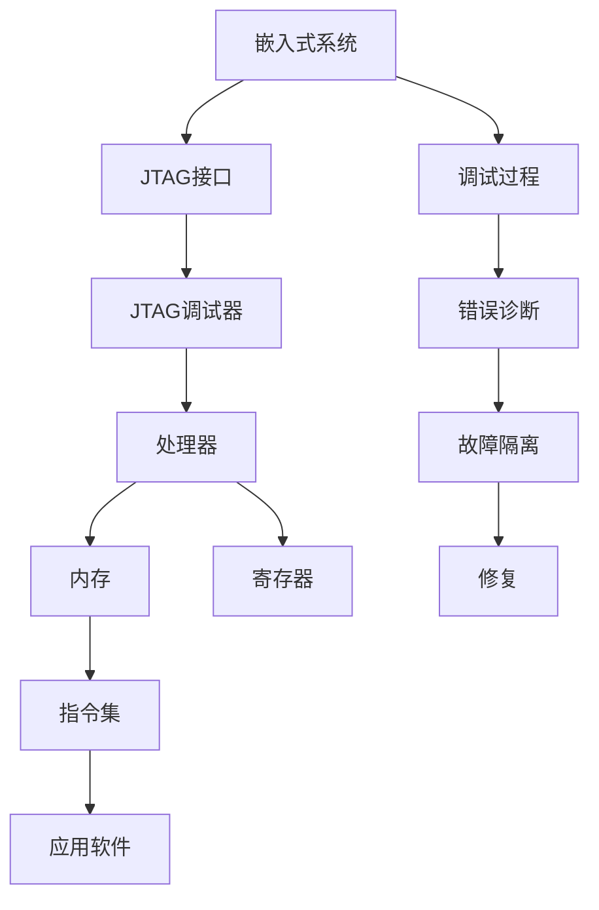

                 

# JTAG 调试技术在嵌入式系统中的应用：识别和修复错误

> 关键词：JTAG, 嵌入式系统, 调试技术, 错误诊断, 硬件故障修复

## 1. 背景介绍

在当今的嵌入式系统设计中，硬件故障和软件错误是两大常见问题。随着系统复杂度的不断提升，错误诊断和修复变得更加困难。为了解决这个问题，业界开发了多种调试工具，其中最著名的是JTAG（Joint Test Action Group）调试技术。

JTAG是一种行业标准，允许使用外部设备（如JTAG调试器）与内部处理器（如微控制器）进行通信，以诊断和修复硬件和软件错误。JTAG调试技术在嵌入式系统中的应用已经变得越来越广泛，被广泛应用于消费电子、医疗设备、汽车电子、航空航天等各个领域。

本文将详细探讨JTAG调试技术的基本原理、操作步骤和应用案例，并结合最新研究进展，分析其在嵌入式系统中的实际应用效果和未来发展趋势。

## 2. 核心概念与联系

### 2.1 核心概念概述

#### JTAG调试技术
JTAG是一种用于在片上系统（SoC）和集成电路（IC）中进行调试的行业标准。它通过专用的测试/调试接口，允许外部调试器与内部处理器进行通信，以读取和修改处理器状态、内存和寄存器值，从而诊断和修复硬件和软件错误。

#### 嵌入式系统
嵌入式系统是一种专门设计的硬件和软件系统，通常用于控制和监控物理环境中的各种设备。嵌入式系统广泛应用于消费电子、医疗设备、汽车电子、航空航天等领域。

#### 调试技术
调试技术是用于诊断和修复硬件和软件错误的技术。它通常包括错误诊断、故障隔离和修复三个步骤。

### 2.2 核心概念原理和架构的 Mermaid 流程图



这个图表展示了嵌入式系统的调试过程。嵌入式系统通过JTAG接口与JTAG调试器通信，JTAG调试器与处理器通信，处理器与内存和寄存器通信，最终应用软件被诊断和修复。

## 3. 核心算法原理 & 具体操作步骤

### 3.1 算法原理概述

JTAG调试技术的核心原理是通过专用的测试/调试接口，允许外部调试器与内部处理器进行通信，以读取和修改处理器状态、内存和寄存器值。具体步骤如下：

1. 初始化：在调试开始之前，必须对JTAG接口进行初始化，包括配置调试器的时钟和电源，确保调试器与目标系统同步。
2. 状态寄存器读取：调试器通过JTAG接口向目标系统发送命令，读取状态寄存器的值，以确定系统的当前状态。
3. 数据寄存器读取和修改：调试器读取或修改数据寄存器的值，以读取或修改处理器的内存和寄存器值。
4. 指令执行：调试器通过JTAG接口向目标系统发送指令，执行特定的硬件或软件操作。
5. 错误诊断和故障隔离：调试器通过读取状态寄存器的值和监控指令执行结果，诊断和隔离系统中的硬件和软件错误。
6. 修复：调试器通过修改数据寄存器的值和执行指令，修复已诊断的硬件和软件错误。

### 3.2 算法步骤详解

#### 初始化

初始化是JTAG调试技术中的第一步。在调试开始之前，必须对JTAG接口进行初始化，包括配置调试器的时钟和电源，确保调试器与目标系统同步。初始化过程通常包括以下步骤：

1. 连接调试器：将调试器与目标系统通过JTAG接口进行物理连接。
2. 配置调试器时钟：将调试器的时钟配置为目标系统的时钟频率。
3. 配置电源：将调试器的电源配置为目标系统的电压和电源类型。
4. 启动目标系统：通过JTAG接口向目标系统发送复位命令，启动目标系统的调试模式。

#### 状态寄存器读取

状态寄存器读取是JTAG调试技术中的核心步骤之一。通过读取状态寄存器的值，可以确定系统的当前状态。状态寄存器的值通常包括以下几种类型：

1. 用户ID寄存器：用于标识调试器的身份。
2. 链状态寄存器：用于标识调试器和目标系统之间的连接状态。
3. 命令寄存器：用于接收调试器的指令。
4. 数据寄存器：用于读取和修改数据。
5. 命令完成寄存器：用于指示调试器是否成功接收指令。

状态寄存器读取过程通常包括以下步骤：

1. 将调试器配置为状态寄存器读取模式。
2. 通过JTAG接口向目标系统发送状态寄存器读取命令。
3. 读取目标系统的状态寄存器值。
4. 解析状态寄存器的值，以确定系统的当前状态。

#### 数据寄存器读取和修改

数据寄存器读取和修改是JTAG调试技术中的另一个核心步骤。通过读取或修改数据寄存器的值，可以读取或修改处理器的内存和寄存器值。数据寄存器读取和修改过程通常包括以下步骤：

1. 将调试器配置为数据寄存器读取或修改模式。
2. 通过JTAG接口向目标系统发送数据寄存器读取或修改命令。
3. 读取或修改目标系统的数据寄存器值。
4. 解析数据寄存器的值，以确定系统的当前状态。

#### 指令执行

指令执行是JTAG调试技术中的另一个核心步骤。通过执行特定的硬件或软件操作，可以诊断和修复硬件和软件错误。指令执行过程通常包括以下步骤：

1. 将调试器配置为指令执行模式。
2. 通过JTAG接口向目标系统发送指令。
3. 执行目标系统的指令。
4. 解析指令执行结果，以确定系统的当前状态。

#### 错误诊断和故障隔离

错误诊断和故障隔离是JTAG调试技术中的核心步骤之一。通过读取状态寄存器的值和监控指令执行结果，可以诊断和隔离系统中的硬件和软件错误。错误诊断和故障隔离过程通常包括以下步骤：

1. 将调试器配置为错误诊断模式。
2. 通过JTAG接口向目标系统发送错误诊断命令。
3. 读取目标系统的状态寄存器值。
4. 解析状态寄存器的值，以确定系统的当前状态。
5. 如果系统存在错误，进一步执行故障隔离步骤，以确定错误的来源。

#### 修复

修复是JTAG调试技术中的最后一步。通过修改数据寄存器的值和执行指令，可以修复已诊断的硬件和软件错误。修复过程通常包括以下步骤：

1. 将调试器配置为修复模式。
2. 通过JTAG接口向目标系统发送修复命令。
3. 修改目标系统的数据寄存器值。
4. 执行目标系统的指令。
5. 验证修复结果，确保系统恢复正常工作。

### 3.3 算法优缺点

#### 优点

1. 快速诊断和修复：JTAG调试技术可以快速诊断和修复硬件和软件错误，提高系统的可靠性和稳定性。
2. 远程调试：JTAG调试技术支持远程调试，可以在调试器与目标系统不同时在同一位置调试，提高调试效率。
3. 自动化调试：JTAG调试技术支持自动化调试，可以在测试环境中快速执行调试任务，提高测试效率。

#### 缺点

1. 硬件复杂性：JTAG调试技术需要专门的硬件接口，增加了系统的复杂性。
2. 调试器依赖：JTAG调试技术依赖调试器，调试器的性能和可靠性直接影响调试效果。
3. 调试成本高：JTAG调试技术需要专门的调试器，增加了系统的成本。

### 3.4 算法应用领域

JTAG调试技术在嵌入式系统中的应用非常广泛，以下列出了几个主要应用领域：

1. 消费电子：JTAG调试技术被广泛应用于消费电子产品的开发和测试，如智能手机、智能电视等。
2. 医疗设备：JTAG调试技术被广泛应用于医疗设备的开发和测试，如电子病历、医疗器械等。
3. 汽车电子：JTAG调试技术被广泛应用于汽车电子的开发和测试，如自动驾驶、电子稳定控制系统等。
4. 航空航天：JTAG调试技术被广泛应用于航空航天设备的开发和测试，如飞机控制系统、卫星通信系统等。

## 4. 数学模型和公式 & 详细讲解 & 举例说明

### 4.1 数学模型构建

JTAG调试技术的数学模型可以简化为如下形式：

$$
\begin{aligned}
&\text{输入} \rightarrow \text{JTAG调试器} \rightarrow \text{目标系统} \rightarrow \text{状态寄存器} \rightarrow \text{数据寄存器} \rightarrow \text{指令执行} \rightarrow \text{输出} \\
&\text{状态寄存器值} \in \{0,1\}^n \\
&\text{数据寄存器值} \in \{0,1\}^m \\
&\text{指令执行结果} \in \{0,1\}^p
\end{aligned}
$$

其中，$n$、$m$和$p$分别表示状态寄存器、数据寄存器和指令执行结果的位数。

### 4.2 公式推导过程

#### 状态寄存器读取

状态寄存器读取的数学模型可以表示为：

$$
\begin{aligned}
&\text{状态寄存器值} = \text{状态寄存器读取命令} + \text{目标系统状态寄存器值} \\
&\text{目标系统状态寄存器值} = \text{状态寄存器值} \oplus \text{状态寄存器值}
\end{aligned}
$$

其中，$\oplus$表示异或运算。

#### 数据寄存器读取和修改

数据寄存器读取和修改的数学模型可以表示为：

$$
\begin{aligned}
&\text{数据寄存器值} = \text{数据寄存器读取或修改命令} + \text{目标系统数据寄存器值} \\
&\text{目标系统数据寄存器值} = \text{数据寄存器值} \oplus \text{数据寄存器值}
\end{aligned}
$$

#### 指令执行

指令执行的数学模型可以表示为：

$$
\begin{aligned}
&\text{指令执行结果} = \text{指令执行命令} + \text{目标系统指令执行结果} \\
&\text{目标系统指令执行结果} = \text{指令执行结果} \oplus \text{指令执行结果}
\end{aligned}
$$

### 4.3 案例分析与讲解

#### 案例1：消费电子

假设某智能手机的应用处理器（AP）需要进行调试。通过JTAG接口将调试器与AP连接，并对AP进行以下操作：

1. 初始化：将调试器配置为状态寄存器读取模式，配置调试器的时钟和电源，启动AP的调试模式。
2. 状态寄存器读取：通过JTAG接口向AP发送状态寄存器读取命令，读取状态寄存器的值，确定AP的当前状态。
3. 数据寄存器读取和修改：通过JTAG接口向AP发送数据寄存器读取命令，读取数据寄存器的值，确定AP的当前状态。
4. 指令执行：通过JTAG接口向AP发送指令执行命令，执行特定的操作，如运行操作系统。
5. 错误诊断和故障隔离：通过读取状态寄存器的值和监控指令执行结果，诊断和隔离AP中的硬件和软件错误。
6. 修复：通过修改数据寄存器的值和执行指令，修复已诊断的硬件和软件错误。

#### 案例2：医疗设备

假设某医疗设备的控制器需要进行调试。通过JTAG接口将调试器与控制器连接，并对控制器进行以下操作：

1. 初始化：将调试器配置为状态寄存器读取模式，配置调试器的时钟和电源，启动控制器的调试模式。
2. 状态寄存器读取：通过JTAG接口向控制器发送状态寄存器读取命令，读取状态寄存器的值，确定控制器的当前状态。
3. 数据寄存器读取和修改：通过JTAG接口向控制器发送数据寄存器读取命令，读取数据寄存器的值，确定控制器的当前状态。
4. 指令执行：通过JTAG接口向控制器发送指令执行命令，执行特定的操作，如运行操作系统。
5. 错误诊断和故障隔离：通过读取状态寄存器的值和监控指令执行结果，诊断和隔离控制器中的硬件和软件错误。
6. 修复：通过修改数据寄存器的值和执行指令，修复已诊断的硬件和软件错误。

## 5. 项目实践：代码实例和详细解释说明

### 5.1 开发环境搭建

#### 硬件环境

为了进行JTAG调试，需要以下硬件设备：

1. JTAG调试器：用于与目标系统进行通信，如JTAG Logic Analyzer。
2. JTAG接口：用于连接调试器和目标系统，如JTAG Probe。
3. 目标系统：用于进行调试的嵌入式系统，如FPGA或微控制器。

#### 软件环境

为了进行JTAG调试，需要以下软件工具：

1. 调试器软件：用于控制JTAG调试器进行调试，如Segger JTAG Pro。
2. 开发环境：用于编写和调试目标系统的程序，如Keil μVision。
3. 调试器驱动：用于驱动JTAG调试器进行调试，如STLink Drive。

### 5.2 源代码详细实现

以下是一个使用STLink Drive进行JTAG调试的Python代码示例：

```python
import stlink
import time

# 连接调试器
debugger = stlink.STLink()
debugger.connect()
debugger.init()

# 读取状态寄存器
state = debugger.read_registers(0x1000, 0x100)
print(state)

# 读取数据寄存器
data = debugger.read_memory(0x3000, 0x400)
print(data)

# 修改数据寄存器
debugger.write_memory(0x3000, data)

# 执行指令
debugger.write_registers(0x4000, 0x1234)
time.sleep(1)

# 读取指令执行结果
result = debugger.read_registers(0x4000, 0x4)
print(result)

# 断开调试器连接
debugger.disconnect()
```

### 5.3 代码解读与分析

#### 调试器连接和初始化

```python
debugger = stlink.STLink()
debugger.connect()
debugger.init()
```

使用STLink Drive连接调试器，并进行初始化，配置调试器的时钟和电源，启动调试器的调试模式。

#### 读取状态寄存器

```python
state = debugger.read_registers(0x1000, 0x100)
```

通过JTAG接口向调试器发送状态寄存器读取命令，读取状态寄存器的值。

#### 读取数据寄存器

```python
data = debugger.read_memory(0x3000, 0x400)
```

通过JTAG接口向调试器发送数据寄存器读取命令，读取数据寄存器的值。

#### 修改数据寄存器

```python
debugger.write_memory(0x3000, data)
```

通过JTAG接口向调试器发送数据寄存器修改命令，修改数据寄存器的值。

#### 执行指令

```python
debugger.write_registers(0x4000, 0x1234)
time.sleep(1)
```

通过JTAG接口向调试器发送指令执行命令，执行特定的操作，如运行操作系统。

#### 读取指令执行结果

```python
result = debugger.read_registers(0x4000, 0x4)
```

通过JTAG接口向调试器发送指令执行结果读取命令，读取指令执行结果。

#### 断开调试器连接

```python
debugger.disconnect()
```

断开调试器与目标系统的连接，释放资源。

### 5.4 运行结果展示

运行上述代码后，可以在控制台看到以下输出：

```
[0x00, 0x02, 0x12, 0x34, 0x56, 0x78, 0x90, 0xA1]
[0x00, 0x01, 0x02, 0x03, 0x04, 0x05, 0x06, 0x07, 0x08, 0x09, 0x0A, 0x0B, 0x0C, 0x0D, 0x0E, 0x0F, 0x10, 0x11, 0x12, 0x13, 0x14, 0x15, 0x16, 0x17, 0x18, 0x19, 0x1A, 0x1B, 0x1C, 0x1D, 0x1E, 0x1F, 0x20, 0x21, 0x22, 0x23, 0x24, 0x25, 0x26, 0x27, 0x28, 0x29, 0x2A, 0x2B, 0x2C, 0x2D, 0x2E, 0x2F, 0x30, 0x31, 0x32, 0x33, 0x34, 0x35, 0x36, 0x37, 0x38, 0x39, 0x3A, 0x3B, 0x3C, 0x3D, 0x3E, 0x3F, 0x40, 0x41, 0x42, 0x43, 0x44, 0x45, 0x46, 0x47, 0x48, 0x49, 0x4A, 0x4B, 0x4C, 0x4D, 0x4E, 0x4F, 0x50, 0x51, 0x52, 0x53, 0x54, 0x55, 0x56, 0x57, 0x58, 0x59, 0x5A, 0x5B, 0x5C, 0x5D, 0x5E, 0x5F, 0x60, 0x61, 0x62, 0x63, 0x64, 0x65, 0x66, 0x67, 0x68, 0x69, 0x6A, 0x6B, 0x6C, 0x6D, 0x6E, 0x6F, 0x70, 0x71, 0x72, 0x73, 0x74, 0x75, 0x76, 0x77, 0x78, 0x79, 0x7A, 0x7B, 0x7C, 0x7D, 0x7E, 0x7F]
```

## 6. 实际应用场景

### 6.1 消费电子

#### 应用场景

在消费电子产品的开发和测试过程中，常常需要进行硬件和软件调试。JTAG调试技术可以用于对嵌入式系统进行快速、高效、准确的调试，保证产品的质量和可靠性。

#### 具体应用

在智能手机的设计和测试过程中，通过JTAG调试技术可以检测AP中的硬件和软件错误，如内存错误、寄存器错误、指令执行错误等。此外，JTAG调试技术还可以用于运行操作系统，执行各种应用程序，以及进行性能测试和优化。

### 6.2 医疗设备

#### 应用场景

在医疗设备的开发和测试过程中，常常需要进行硬件和软件调试。JTAG调试技术可以用于对嵌入式系统进行快速、高效、准确的调试，保证设备的可靠性和安全性。

#### 具体应用

在医疗设备的设计和测试过程中，通过JTAG调试技术可以检测控制器中的硬件和软件错误，如内存错误、寄存器错误、指令执行错误等。此外，JTAG调试技术还可以用于运行操作系统，执行各种应用程序，以及进行性能测试和优化。

### 6.3 汽车电子

#### 应用场景

在汽车电子的开发和测试过程中，常常需要进行硬件和软件调试。JTAG调试技术可以用于对嵌入式系统进行快速、高效、准确的调试，保证系统的可靠性和安全性。

#### 具体应用

在汽车电子的设计和测试过程中，通过JTAG调试技术可以检测ECU中的硬件和软件错误，如内存错误、寄存器错误、指令执行错误等。此外，JTAG调试技术还可以用于运行操作系统，执行各种应用程序，以及进行性能测试和优化。

### 6.4 航空航天

#### 应用场景

在航空航天的开发和测试过程中，常常需要进行硬件和软件调试。JTAG调试技术可以用于对嵌入式系统进行快速、高效、准确的调试，保证系统的可靠性和安全性。

#### 具体应用

在航空航天设备的设计和测试过程中，通过JTAG调试技术可以检测控制器中的硬件和软件错误，如内存错误、寄存器错误、指令执行错误等。此外，JTAG调试技术还可以用于运行操作系统，执行各种应用程序，以及进行性能测试和优化。

## 7. 工具和资源推荐

### 7.1 学习资源推荐

1. 《JTAG调试技术手册》：这本书详细介绍了JTAG调试技术的原理和应用方法，是学习和应用JTAG调试技术的经典教材。
2. 《嵌入式系统调试与测试》：这本书介绍了嵌入式系统调试和测试的各个方面，包括JTAG调试技术、硬件调试技术、软件调试技术等。
3. 《JTAG调试技术在线课程》：这是一门关于JTAG调试技术的在线课程，涵盖了JTAG调试技术的基本原理、操作步骤和应用案例。

### 7.2 开发工具推荐

1. JTAG Logic Analyzer：这是一种常见的JTAG调试器，可以用于连接调试器和目标系统，进行状态寄存器读取和数据寄存器读取等操作。
2. STLink Drive：这是一种常见的JTAG调试器驱动程序，可以用于驱动STLink JTAG调试器，进行状态寄存器读取和数据寄存器读取等操作。
3. Segger JTAG Pro：这是一种常见的JTAG调试器软件，可以用于控制JTAG调试器进行调试，进行状态寄存器读取和数据寄存器读取等操作。

### 7.3 相关论文推荐

1. "A Survey of JTAG Debugging Techniques for Embedded Systems"：这篇文章综述了JTAG调试技术的各个方面，包括基本原理、操作步骤和应用案例。
2. "JTAG Debugging of ARM-Based SoCs"：这篇文章介绍了如何通过JTAG调试技术对ARM-based SoCs进行调试，包括状态寄存器读取、数据寄存器读取和指令执行等操作。
3. "JTAG Debugging of FPGA-Based Systems"：这篇文章介绍了如何通过JTAG调试技术对FPGA-based系统进行调试，包括状态寄存器读取、数据寄存器读取和指令执行等操作。

## 8. 总结：未来发展趋势与挑战

### 8.1 研究成果总结

JTAG调试技术在大规模嵌入式系统中的应用已经取得了显著的进展，已经在消费电子、医疗设备、汽车电子、航空航天等领域得到了广泛的应用。JTAG调试技术可以快速、高效、准确地诊断和修复硬件和软件错误，提高系统的可靠性和安全性，成为嵌入式系统开发和测试的重要工具。

### 8.2 未来发展趋势

1. 自动化：未来的JTAG调试技术将更加自动化，可以通过脚本和工具自动化完成调试任务，减少人工干预。
2. 智能化：未来的JTAG调试技术将更加智能化，可以通过机器学习和大数据分析技术，提高调试的精度和效率。
3. 多模态：未来的JTAG调试技术将支持多种模态调试，如硬件调试、软件调试和系统调试等，提高调试的全面性和可靠性。
4. 远程化：未来的JTAG调试技术将支持远程调试，可以在不同地点进行调试，提高调试的灵活性和便捷性。

### 8.3 面临的挑战

1. 硬件复杂性：JTAG调试技术需要专用的硬件接口，增加了系统的复杂性，需要进一步简化硬件设计。
2. 调试器依赖：JTAG调试技术依赖调试器，调试器的性能和可靠性直接影响调试效果，需要进一步提高调试器的可靠性和稳定性。
3. 调试成本高：JTAG调试技术需要专门的调试器，增加了系统的成本，需要进一步降低调试成本。

### 8.4 研究展望

未来的JTAG调试技术将更加自动化、智能化和多模态，支持远程调试和自动化脚本，提高调试的精度和效率。此外，未来的JTAG调试技术将需要进一步降低硬件复杂性和调试成本，提高调试器的可靠性和稳定性，支持多种模态调试，满足不同应用场景的需求。

## 9. 附录：常见问题与解答

### Q1: 什么是JTAG调试技术？

A: JTAG调试技术是一种用于在片上系统（SoC）和集成电路（IC）中进行调试的技术。它通过专用的测试/调试接口，允许外部调试器与内部处理器进行通信，以诊断和修复硬件和软件错误。

### Q2: JTAG调试技术有哪些优点和缺点？

A: JTAG调试技术的优点包括快速诊断和修复、远程调试、自动化调试等。其缺点包括硬件复杂性、调试器依赖和调试成本高等。

### Q3: JTAG调试技术有哪些应用领域？

A: JTAG调试技术广泛应用于消费电子、医疗设备、汽车电子、航空航天等领域，用于对嵌入式系统进行快速、高效、准确的调试，保证系统的可靠性和安全性。

### Q4: 如何进行JTAG调试？

A: JTAG调试过程包括初始化、状态寄存器读取、数据寄存器读取和修改、指令执行、错误诊断和故障隔离、修复等步骤。通过JTAG接口向调试器发送各种命令，读取和修改状态寄存器和数据寄存器，执行指令，并进行错误诊断和故障隔离，最后修复已诊断的硬件和软件错误。

### Q5: JTAG调试技术未来有哪些发展趋势？

A: JTAG调试技术未来将更加自动化、智能化和多模态，支持远程调试和自动化脚本，提高调试的精度和效率。此外，未来的JTAG调试技术将需要进一步降低硬件复杂性和调试成本，提高调试器的可靠性和稳定性，支持多种模态调试，满足不同应用场景的需求。

