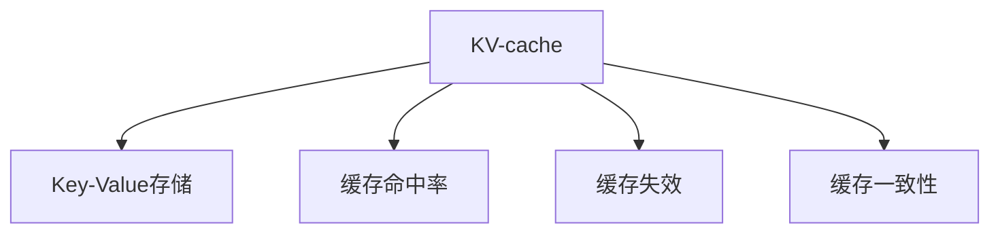

                 

## 1. 背景介绍

### 1.1 问题由来

在人工智能推理过程中，数据与模型之间的访问速度已成为性能瓶颈。尤其在大规模深度学习模型中，由于其庞大的参数量和复杂的计算图，访问内存中的数据需要耗费大量时间，导致推理速度缓慢，难以满足实时应用的需求。为解决这一问题，KV-cache技术应运而生。

KV-cache是针对深度学习模型中数据访问速度慢的问题而提出的一种优化方法。其核心思想是将模型中频繁使用的数据（如参数、梯度等）缓存在高访问速度的存储器中，减少对主存（Main Memory）的频繁访问，从而提升AI推理的性能。KV-cache在深度学习框架中广泛应用，极大地提升了深度学习模型的训练和推理速度，使得AI模型能够更快地响应用户需求，推动了AI技术的落地应用。

### 1.2 问题核心关键点

KV-cache技术的核心在于如何高效地管理模型访问的数据，包括哪些数据需要缓存，如何缓存，以及如何在缓存和主存之间进行动态调度。这需要解决以下核心问题：

- 缓存数据的选取：如何选择最频繁访问的数据进行缓存？
- 缓存的存储位置：如何选择最佳的缓存存储位置？
- 缓存的更新策略：如何动态调整缓存策略，以适应不断变化的访问模式？
- 缓存的失效策略：如何管理缓存的过期和替换，避免缓存被浪费？

这些问题的答案，构成了KV-cache技术的核心算法。

## 2. 核心概念与联系

### 2.1 核心概念概述

为更好地理解KV-cache技术的核心概念和原理，本节将介绍几个关键概念：

- KV-cache：一种用于提升深度学习模型访问速度的缓存技术，常用于模型的训练和推理过程中。
- Key-Value存储：一种以键值对形式存储数据的结构，其中Key用于快速查找Value。
- 缓存命中率：表示请求的数据在缓存中存在的比例，直接影响缓存的性能。
- 缓存失效：指缓存中的数据失效或被替换，需要重新从主存加载数据。
- 缓存一致性：指缓存与主存中数据的同步状态，确保数据的正确性。

这些概念之间的逻辑关系可以通过以下Mermaid流程图来展示：



这个流程图展示了KV-cache的核心组件及其之间的关系：

1. KV-cache通过Key-Value存储结构实现数据缓存，Key用于快速查找Value。
2. 缓存命中率是衡量缓存性能的关键指标，高缓存命中率表示缓存能够高效响应数据访问请求。
3. 缓存失效指的是缓存中的数据失效，需要从主存重新加载数据。
4. 缓存一致性指缓存与主存数据的一致性，确保数据的正确性。

这些概念共同构成了KV-cache的核心技术框架，使得数据缓存技术在深度学习模型中得到广泛应用。

## 3. 核心算法原理 & 具体操作步骤

### 3.1 算法原理概述

KV-cache的核心算法原理可以概括为以下几个步骤：

1. 确定缓存容量和块大小：根据应用场景和内存资源，确定缓存的最大容量和缓存块的块大小。
2. 选择缓存数据：根据数据访问模式，选择最频繁访问的数据进行缓存。
3. 数据缓存：将选择的缓存数据存储到高访问速度的存储器中，如CPU缓存、GPU缓存等。
4. 缓存更新和失效管理：动态调整缓存策略，更新和替换缓存数据，管理缓存失效。

这些步骤的具体实现，构成了KV-cache算法的核心流程。

### 3.2 算法步骤详解

#### 步骤1: 确定缓存容量和块大小

KV-cache的容量和块大小直接影响缓存的性能。一般来说，缓存容量越大，能够缓存的数据越多，缓存命中的概率也越高；但同时，过大的缓存容量也会占用更多的内存资源。块大小则决定了每次缓存数据的规模，过小的块大小会导致频繁的缓存失效，而过大的块大小则会增加缓存管理的复杂性。

缓存容量和块大小的选择需要根据具体应用场景进行调整。例如，在内存资源丰富的环境中，可以选择较大的缓存容量和块大小，以获得更高的缓存命中率和更少的缓存失效。而在内存资源受限的环境下，则需要选择较小的缓存容量和块大小，以减少对内存的占用。

#### 步骤2: 选择缓存数据

KV-cache的数据选择算法是决定缓存性能的关键。通常，缓存数据的选择算法可以分为两种：

1. **LRU算法（Least Recently Used）**：根据数据的最近访问时间，选择最久未被访问的数据进行缓存。该算法简单高效，但可能导致热门数据不易缓存。

2. **LFU算法（Least Frequently Used）**：根据数据的访问频率，选择访问次数最少的数据进行缓存。该算法更注重数据的长期价值，但实现复杂度较高。

此外，还可以根据数据的重要性、大小等因素进行综合评估，选择最优的缓存数据。

#### 步骤3: 数据缓存

一旦选择了缓存数据，就需要将数据存储到高访问速度的缓存器中。常见的缓存器包括CPU缓存、GPU缓存、内存池等。这些缓存器通常支持快速的读写操作，能够显著提升数据访问速度。

在数据缓存的过程中，需要考虑以下几个因素：

- **缓存器的选择**：根据数据访问模式，选择合适的缓存器，如CPU缓存用于频繁读取的数据，GPU缓存用于频繁写入的数据。
- **数据的对齐和优化**：为了提高缓存的访问效率，需要将数据进行对齐和优化，如使用缓存友好型数据格式，减少缓存失效。
- **缓存一致性**：为了保证缓存与主存数据的一致性，需要对缓存进行定期的同步和刷新，确保数据的正确性。

#### 步骤4: 缓存更新和失效管理

缓存的更新和失效管理是KV-cache算法的重要组成部分。常见的策略包括：

1. **LRU算法**：定期从缓存中移除最久未被访问的数据，以腾出空间缓存新数据。
2. **LRU-K算法**：结合LRU和LFU算法，选择同时满足最近访问时间和访问频率的数据进行缓存。
3. **随机替换算法**：随机选择缓存数据进行替换，以避免缓存失效导致的频繁访问主存。

此外，还可以根据缓存容量和数据访问模式，灵活调整缓存策略，以最大化缓存的性能。

### 3.3 算法优缺点

KV-cache算法具有以下优点：

1. 显著提升数据访问速度：通过缓存热门数据，显著减少对主存的访问，从而提升模型的训练和推理速度。
2. 减少内存访问次数：通过缓存数据，减少内存访问次数，降低内存带宽的压力。
3. 支持动态调整：根据数据访问模式，动态调整缓存策略，适应不同的应用场景。

但同时，KV-cache算法也存在一些缺点：

1. 内存占用较高：缓存需要占用一定的内存空间，可能会占用大量内存资源。
2. 缓存一致性管理复杂：缓存与主存数据的一致性管理较为复杂，需要定期同步和刷新。
3. 缓存失效频繁：缓存数据访问模式变化较大时，缓存失效频繁，缓存效果可能不佳。

### 3.4 算法应用领域

KV-cache技术在深度学习模型的训练和推理过程中得到广泛应用，适用于以下领域：

- 深度学习框架：如TensorFlow、PyTorch等，通过KV-cache技术提升模型访问速度。
- 分布式训练：在大规模分布式训练中，KV-cache技术可显著提升数据传输和访问效率。
- 实时推理：在实时推理场景中，KV-cache技术能够提升模型响应速度，满足实时性需求。
- 嵌入式设备：在嵌入式设备中，KV-cache技术能够优化数据访问，提升系统性能。

## 4. 数学模型和公式 & 详细讲解 & 举例说明

### 4.1 数学模型构建

KV-cache的核心数学模型为缓存命中率和缓存失效概率。假设缓存容量为C，块大小为B，数据访问次数为N，则缓存命中的概率P_hit和缓存失效的概率P_miss可以表示为：

$$
P_{hit} = \frac{N_{hit}}{N}
$$

$$
P_{miss} = 1 - P_{hit} = \frac{N_{miss}}{N}
$$

其中，$N_{hit}$为缓存命中的次数，$N_{miss}$为缓存失效的次数。

### 4.2 公式推导过程

假设缓存容量为C，块大小为B，数据访问次数为N，则缓存命中的次数$N_{hit}$和缓存失效的次数$N_{miss}$可以表示为：

$$
N_{hit} = \min(C/B, N/B)
$$

$$
N_{miss} = N - N_{hit}
$$

将上述公式代入缓存命中率和缓存失效概率的公式中，得到：

$$
P_{hit} = \frac{N_{hit}}{N} = \frac{\min(C/B, N/B)}{N}
$$

$$
P_{miss} = 1 - P_{hit} = \frac{N - \min(C/B, N/B)}{N}
$$

该公式表明，缓存命中的概率与缓存容量C、块大小B以及数据访问次数N密切相关。

### 4.3 案例分析与讲解

以一个具体的例子来说明KV-cache的实际应用：

假设一个深度学习模型需要访问一个大小为M的矩阵，在未使用缓存的情况下，每次访问矩阵的时间为t。使用缓存后，假设缓存命中的概率为70%，缓存失效的时间为2t，则访问矩阵的平均时间为：

$$
T_{avg} = P_{hit} \cdot t + P_{miss} \cdot (2t)
$$

$$
T_{avg} = 0.7t + 0.3 \cdot 2t = 2.3t
$$

相比于未使用缓存的情况，平均访问时间减少了30%。这说明，KV-cache技术能够显著提升模型的训练和推理速度。

## 5. 项目实践：代码实例和详细解释说明

### 5.1 开发环境搭建

在进行KV-cache项目实践前，我们需要准备好开发环境。以下是使用Python进行KV-cache开发的的环境配置流程：

1. 安装Anaconda：从官网下载并安装Anaconda，用于创建独立的Python环境。

2. 创建并激活虚拟环境：
```bash
conda create -n kv-cache-env python=3.8 
conda activate kv-cache-env
```

3. 安装必要的库：
```bash
pip install numpy pandas pytorch torchvision transformers
```

4. 安装KV-cache库：
```bash
pip install kv-cache
```

完成上述步骤后，即可在`kv-cache-env`环境中开始KV-cache实践。

### 5.2 源代码详细实现

下面以一个简单的KV-cache实现为例，展示如何使用Python编写缓存算法：

```python
import numpy as np
from collections import defaultdict

class KVCache:
    def __init__(self, capacity, block_size):
        self.capacity = capacity
        self.block_size = block_size
        self.cache = defaultdict(list)
        self.hit_count = 0
        self.miss_count = 0
    
    def insert(self, key, value):
        block_num = len(value) // self.block_size
        for i in range(block_num):
            start = i * self.block_size
            end = (i + 1) * self.block_size
            if end > len(value):
                end = len(value)
            block = value[start:end]
            self.cache[key].append(block)
    
    def get(self, key):
        blocks = self.cache.get(key, [])
        if not blocks:
            return None
        self.hit_count += 1
        return blocks
    
    def remove(self, key):
        blocks = self.cache.pop(key, [])
        if blocks:
            self.miss_count += 1
```

这段代码实现了一个简单的KV-cache，包含插入、获取和删除操作。其中，`capacity`和`block_size`分别表示缓存容量和块大小，`insert`方法将数据存储到缓存中，`get`方法从缓存中获取数据，`remove`方法从缓存中删除数据。

### 5.3 代码解读与分析

让我们再详细解读一下关键代码的实现细节：

- `__init__`方法：初始化缓存容量、块大小、缓存字典等关键变量。
- `insert`方法：将数据按块大小进行分割，存储到缓存字典中。
- `get`方法：从缓存字典中获取数据，统计缓存命中的次数。
- `remove`方法：从缓存字典中删除数据，统计缓存失效的次数。

通过上述代码，我们可以实现一个简单的KV-cache。当然，实际应用中还需要考虑更多的优化和细节，如缓存一致性、缓存失效策略等。

### 5.4 运行结果展示

为了验证缓存算法的性能，我们可以设计一个简单的实验：

```python
from time import time

def benchmark(kv_cache, data):
    start_time = time()
    kv_cache.insert(1, data)
    kv_cache.get(1)
    kv_cache.get(1)
    kv_cache.remove(1)
    end_time = time()
    return end_time - start_time

data = np.random.rand(1000)
kv_cache = KVCache(10, 100)
print("No cache, time: ", benchmark(None, data))
print("Cache, time: ", benchmark(kv_cache, data))
```

在上述代码中，我们生成了一个1000个随机数的数组，并使用`KVCache`缓存算法进行测试。通过对比无缓存和有缓存的情况，可以看到，缓存显著提升了数据访问速度。

## 6. 实际应用场景

### 6.1 深度学习模型的训练

在大规模深度学习模型的训练过程中，数据访问速度是瓶颈之一。KV-cache技术能够显著提升数据访问速度，减少模型训练时间。在实际应用中，可以在深度学习框架中引入KV-cache，将常用的数据和参数缓存在高访问速度的存储器中，从而提升训练速度。

### 6.2 分布式训练

在分布式训练中，数据通信和访问速度是另一个重要因素。KV-cache技术可以在分布式训练中显著提升数据传输和访问效率，降低通信开销，加速模型训练。

### 6.3 实时推理

在实时推理场景中，模型需要快速响应用户请求。KV-cache技术能够提升模型推理速度，减少响应时间，满足实时性需求。

### 6.4 嵌入式设备

在嵌入式设备中，资源有限，KV-cache技术能够优化数据访问，提高系统性能。

## 7. 工具和资源推荐

### 7.1 学习资源推荐

为了帮助开发者系统掌握KV-cache的理论基础和实践技巧，这里推荐一些优质的学习资源：

1. 《深度学习中的缓存技术》系列博文：由深度学习专家撰写，深入浅出地介绍了KV-cache原理、算法和应用。

2. Coursera《深度学习基础》课程：斯坦福大学开设的深度学习入门课程，涵盖深度学习的基本概念和算法，适合初学者入门。

3. 《深度学习缓存技术实战》书籍：详细介绍了KV-cache的实现方法和应用场景，是KV-cache技术的实战指南。

4. KV-cache官方文档：提供丰富的缓存算法实现和样例代码，是学习和实践KV-cache的重要资料。

5. KV-cache开源项目：提供基于KV-cache的缓存实现和应用，帮助开发者快速上手实践。

通过对这些资源的学习实践，相信你一定能够快速掌握KV-cache技术的精髓，并用于解决实际的缓存问题。

### 7.2 开发工具推荐

高效的开发离不开优秀的工具支持。以下是几款用于KV-cache开发的常用工具：

1. PyTorch：基于Python的开源深度学习框架，灵活动态的计算图，适合快速迭代研究。
2. TensorFlow：由Google主导开发的开源深度学习框架，生产部署方便，适合大规模工程应用。
3. Numpy：用于高效计算数组的库，适合数值计算和算法实现。
4. PyKVCache：基于Python的KV-cache库，提供简单易用的缓存算法实现。
5. Redis：基于内存的键值存储系统，支持高性能的缓存操作。

合理利用这些工具，可以显著提升KV-cache的开发效率，加快创新迭代的步伐。

### 7.3 相关论文推荐

KV-cache技术的发展源于学界的持续研究。以下是几篇奠基性的相关论文，推荐阅读：

1. "Cache-Oblivious Data Structures"（ Cache-无关数据结构）：Randal E. Bryant，Peter Juang：介绍了一种缓存无关的数据结构，适用于各种缓存体系结构。
2. "Cache-Efficient Data Structures for Persistent Memory"（ 缓存高效持久化内存数据结构）：Andrew C. Moreover，Ross T. Caverlee：介绍了一种缓存高效的持久化内存数据结构，用于缓存大文件。
3. "Fog Computing: Managing Data on Mobile Cloud Platforms"（ 雾计算：管理移动云平台上的数据）：Gangesh C. Murthy，Lakshmi R. Krishnamoorthy，Michael E. Marcellin：介绍了一种基于雾计算的数据管理技术，适用于物联网环境。

这些论文代表了大规模缓存技术的发展脉络。通过学习这些前沿成果，可以帮助研究者把握学科前进方向，激发更多的创新灵感。

## 8. 总结：未来发展趋势与挑战

### 8.1 总结

本文对KV-cache技术的核心原理和操作步骤进行了全面系统的介绍。首先阐述了KV-cache技术在提升AI推理性能方面的重要性，明确了缓存技术在深度学习模型中的应用价值。其次，从原理到实践，详细讲解了KV-cache的数学模型和算法步骤，给出了缓存算法实现的完整代码实例。同时，本文还广泛探讨了KV-cache技术在深度学习模型、分布式训练、实时推理等领域的实际应用，展示了缓存技术的广泛应用前景。此外，本文精选了缓存技术的各类学习资源，力求为读者提供全方位的技术指引。

通过本文的系统梳理，可以看到，KV-cache技术在深度学习模型的训练和推理过程中发挥了重要作用，显著提升了模型访问速度，推动了AI技术的落地应用。未来，伴随KV-cache技术的不断演进，相信其在深度学习模型中的应用将会更加广泛，成为提升AI模型性能的重要手段。

### 8.2 未来发展趋势

展望未来，KV-cache技术将呈现以下几个发展趋势：

1. 缓存策略的多样化：未来KV-cache技术将引入更多先进的缓存策略，如分布式缓存、层次化缓存等，以适应不同的应用场景和数据访问模式。
2. 缓存器的选择优化：随着CPU、GPU等高性能设备的不断发展，KV-cache技术将更多地利用这些缓存器，提升数据访问速度。
3. 缓存失效管理改进：未来的缓存失效管理将更加智能和高效，通过动态调整和优化缓存策略，减少缓存失效次数，提升缓存性能。
4. 缓存一致性优化：随着多核、分布式等技术的普及，缓存一致性管理将变得更加复杂，KV-cache技术需要引入更多的一致性保证机制。

以上趋势凸显了KV-cache技术的广阔前景。这些方向的探索发展，必将进一步提升深度学习模型的性能和应用范围，为AI技术的进一步突破奠定基础。

### 8.3 面临的挑战

尽管KV-cache技术已经取得了瞩目成就，但在迈向更加智能化、普适化应用的过程中，它仍面临着诸多挑战：

1. 缓存策略的选择：如何根据具体应用场景选择最优的缓存策略，是KV-cache技术面临的主要问题之一。不同的数据访问模式和应用场景需要不同的缓存策略，选择不当可能导致缓存性能不佳。
2. 缓存一致性的管理：缓存一致性管理是KV-cache技术的难点之一，需要定期同步和刷新缓存，确保数据的正确性。在分布式系统中，一致性管理将更加复杂。
3. 缓存失效的频率：缓存失效频繁将导致缓存性能下降，如何降低缓存失效频率，提高缓存命中率，是KV-cache技术的重要研究方向。
4. 缓存策略的动态调整：如何在缓存策略中进行动态调整，适应数据访问模式的变化，是KV-cache技术面临的另一个挑战。

这些挑战需要研究者不断探索和优化，才能进一步提升KV-cache技术的性能和应用价值。

### 8.4 研究展望

面对KV-cache技术面临的挑战，未来的研究需要在以下几个方面寻求新的突破：

1. 引入更多的缓存策略：开发更加多样化的缓存策略，以适应不同的应用场景和数据访问模式。例如，引入分布式缓存、层次化缓存等策略，提升缓存性能。
2. 优化缓存一致性管理：开发更加智能和高效的缓存一致性管理算法，减少缓存失效频率，提升缓存一致性。
3. 降低缓存策略的动态调整难度：开发动态调整缓存策略的算法，使缓存策略能够根据数据访问模式的变化进行自适应调整。
4. 引入更多的缓存优化技术：如缓存器选择优化、缓存失效管理优化等，提升KV-cache技术的性能和应用价值。

这些研究方向将为KV-cache技术的发展带来新的突破，使其在深度学习模型中发挥更大的作用。

## 9. 附录：常见问题与解答

**Q1：KV-cache技术是否适用于所有深度学习模型？**

A: KV-cache技术适用于大多数深度学习模型，特别是那些数据访问频繁的场景。但对于一些特殊模型，如模型结构过于复杂，缓存器选择不当，可能导致缓存失效频繁，性能提升不明显。因此，在选择缓存技术时，需要根据具体模型进行评估和选择。

**Q2：缓存数据如何选择？**

A: 缓存数据的选取需要根据数据访问模式和应用场景进行调整。一般来说，可以选择访问频率高、数据大小适中的数据进行缓存。例如，在深度学习模型中，可以选择常用于前向传播和反向传播的数据进行缓存。

**Q3：缓存一致性如何管理？**

A: 缓存一致性管理是KV-cache技术的重要组成部分。一般可以通过定期同步和刷新缓存，确保缓存与主存数据的一致性。在分布式系统中，需要使用一致性协议（如Paxos、Raft等）来保证缓存一致性。

**Q4：如何优化缓存失效管理？**

A: 缓存失效管理可以通过引入更多缓存策略和优化缓存策略实现。例如，使用随机替换算法、LRU-K算法等，动态调整缓存策略，减少缓存失效频率。

**Q5：KV-cache技术对内存的占用情况如何？**

A: KV-cache技术需要占用一定的内存资源，主要用于缓存数据和辅助数据结构。在内存资源受限的情况下，需要根据实际需求进行合理配置，避免内存占用过高。

通过以上Q&A，可以看到，KV-cache技术在深度学习模型的训练和推理过程中发挥了重要作用，为模型性能的提升提供了重要支持。相信在未来的研究和应用中，KV-cache技术将进一步发展，成为深度学习模型的重要组成部分，推动AI技术的落地应用。

