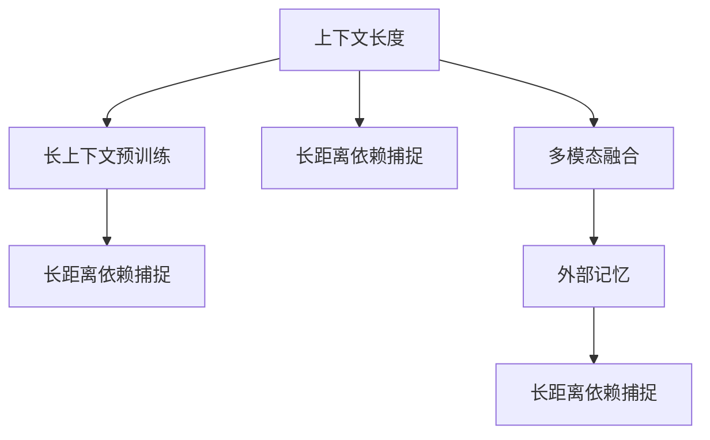

                 

# LLM上下文长度再升级

## 1. 背景介绍

### 1.1 问题由来

在大规模语言模型（LLM）的应用中，上下文长度（context length）是一个至关重要的参数。传统的语言模型，如GPT、BERT等，通常基于固定长度的上下文进行预测。然而，随着语言模型在更多实际场景中的应用，如机器翻译、文本摘要、对话系统等，固定长度的上下文已经难以满足需求。

例如，在机器翻译任务中，源语言文本的长度往往是不固定的，如果上下文长度不足，翻译结果的准确性就会受到影响。在文本摘要任务中，如果摘要长度过短，可能无法涵盖文本的重要信息；如果过长，又可能过于冗余，难以快速获取关键信息。在对话系统中，系统需要根据用户输入的长文本生成对应的回复，过短的上下文可能无法捕捉到关键信息，过长的上下文则可能导致模型计算复杂度过高，影响实时性。

因此，如何在保持计算复杂度可控的同时，尽可能地提高上下文长度，成为一个重要的研究方向。本文将详细介绍在大语言模型中如何通过优化算法和模型结构，实现上下文长度的有效提升。

### 1.2 问题核心关键点

为了有效地提升大语言模型的上下文长度，当前主流的方法主要包括：

- 使用长上下文预训练：在预训练过程中，使用更长的上下文进行训练，以增强模型的长距离依赖捕捉能力。
- 优化模型结构：通过改进模型结构和优化训练算法，降低模型的计算复杂度，使得更长的上下文可以被有效处理。
- 引入外部记忆：通过外部记忆（如知识图谱、外部数据库等），增强模型的语义理解能力，从而能够处理更长的上下文。
- 多模态融合：将文本与图像、语音等模态信息结合，构建多模态模型，提升模型的上下文处理能力。
- 渐进式训练：在模型的不同层使用不同长度的上下文进行训练，逐步提升模型的上下文长度。

这些方法在提升上下文长度的同时，也带来了新的计算挑战和应用场景。下面将详细介绍这些方法的原理和实现。

## 2. 核心概念与联系

### 2.1 核心概念概述

为更好地理解如何有效提升大语言模型的上下文长度，本节将介绍几个密切相关的核心概念：

- 上下文长度（Context Length）：指模型在处理输入文本时，能够考虑的最长文本长度。
- 长上下文预训练（Long Context Pre-training）：指在预训练过程中，使用更长的上下文进行训练，以增强模型的长距离依赖捕捉能力。
- 长距离依赖捕捉（Long-distance Dependency Capture）：指模型在处理长文本时，能够捕捉到文本中跨句、跨段落的依赖关系。
- 多模态融合（Multimodal Fusion）：指将文本与图像、语音等模态信息结合，构建多模态模型，提升模型的上下文处理能力。
- 外部记忆（External Memory）：指通过外部记忆（如知识图谱、外部数据库等），增强模型的语义理解能力，从而能够处理更长的上下文。

这些核心概念之间的逻辑关系可以通过以下Mermaid流程图来展示：



这个流程图展示了大语言模型的核心概念及其之间的关系：

1. 上下文长度是衡量模型性能的重要指标，需要通过长上下文预训练和长距离依赖捕捉等技术进行提升。
2. 长距离依赖捕捉可以通过多模态融合和外部记忆等方法进行增强。
3. 多模态融合和外部记忆都可以提升模型的上下文处理能力，从而进一步提升上下文长度。

这些核心概念共同构成了大语言模型的上下文处理框架，使其能够在更长的文本长度上进行有效预测和生成。

## 3. 核心算法原理 & 具体操作步骤

### 3.1 算法原理概述

在大语言模型中，上下文长度的提升主要依赖于以下两个方面的优化：

- 预训练过程中使用长上下文进行训练，以增强模型的长距离依赖捕捉能力。
- 在模型结构设计和训练算法中引入长距离依赖捕捉的优化，从而能够处理更长的上下文。

### 3.2 算法步骤详解

#### 3.2.1 长上下文预训练

长上下文预训练的基本思路是在预训练过程中，使用更长的上下文进行训练。具体而言，可以采用以下几种方法：

1. 使用掩码语言模型（Masked Language Modeling, MLM）进行训练。在预训练阶段，随机遮盖一些位置的token，要求模型根据上下文预测被遮盖的token。这种训练方式可以增强模型的长距离依赖捕捉能力，从而在微调时能够处理更长的上下文。

2. 使用长距离依赖捕捉的预训练任务。例如，使用句子模拟、跨句子相似性等任务进行预训练，使得模型能够捕捉到文本中的跨句、跨段落依赖关系。

3. 使用大规模数据集进行预训练。在大规模数据集上进行预训练，可以使得模型更好地捕捉长距离依赖关系，从而在微调时能够处理更长的上下文。

#### 3.2.2 长距离依赖捕捉的优化

在模型结构设计和训练算法中，可以通过以下几种方法引入长距离依赖捕捉的优化：

1. 引入Transformer中的注意力机制。注意力机制可以使得模型在处理长文本时，能够关注到不同位置的token，从而增强长距离依赖捕捉能力。

2. 使用长距离依赖捕捉的训练任务。例如，使用跨句子相似性、文本生成等任务进行训练，使得模型能够捕捉到文本中的跨句、跨段落依赖关系。

3. 使用多模态融合的训练任务。将文本与图像、语音等模态信息结合，进行联合训练，增强模型的语义理解能力，从而能够处理更长的上下文。

#### 3.2.3 优化器选择与训练策略

在模型训练过程中，优化器的选择和训练策略的优化也非常重要。具体而言，可以采用以下几种方法：

1. 使用高效的优化器，如AdamW、Adafactor等，降低模型的训练难度。

2. 使用学习率衰减策略，在训练过程中逐步降低学习率，从而降低过拟合风险。

3. 使用正则化技术，如L2正则、Dropout等，增强模型的泛化能力。

4. 使用数据增强技术，如数据扩充、文本重构等，增强模型的鲁棒性。

### 3.3 算法优缺点

长上下文预训练和长距离依赖捕捉优化方法，具有以下优点：

- 提高模型的长距离依赖捕捉能力，从而能够处理更长的上下文。
- 增强模型的泛化能力，从而在微调时能够处理更多的任务。
- 提高模型的鲁棒性，从而在实际应用中能够更好地应对噪声和干扰。

然而，这些方法也存在一些缺点：

- 增加模型的计算复杂度，从而需要更多的计算资源。
- 降低模型的实时性，从而影响应用效率。
- 需要更多的高质量标注数据，从而增加了数据收集的成本。

## 4. 数学模型和公式 & 详细讲解 & 举例说明

### 4.1 数学模型构建

在长上下文预训练和长距离依赖捕捉优化中，需要使用以下数学模型：

1. 掩码语言模型（Masked Language Modeling, MLM）：在预训练阶段，随机遮盖一些位置的token，要求模型根据上下文预测被遮盖的token。模型的损失函数为：

   $$
   L_{MLM} = -\sum_{i=1}^n \log P(y_i|x_1,x_2,...,x_i,...,x_n)
   $$

   其中，$x_i$ 表示输入文本中的第 $i$ 个token，$y_i$ 表示被遮盖的token。

2. 跨句子相似性任务（Sentence Similarity）：在预训练阶段，随机选取两个句子，要求模型预测两个句子之间的相似度。模型的损失函数为：

   $$
   L_{SS} = -\sum_{i=1}^m \log P(s_i|x_1,x_2,...,x_i,...,x_n)
   $$

   其中，$s_i$ 表示第 $i$ 个句子，$x_i$ 表示输入文本中的第 $i$ 个token。

### 4.2 公式推导过程

#### 4.2.1 掩码语言模型的推导

在掩码语言模型中，模型的输出为：

$$
P(y_i|x_1,x_2,...,x_i,...,x_n) = \frac{\exp(\text{score}(x_1,x_2,...,x_i,...,x_n))}{\sum_{j=1}^n \exp(\text{score}(x_1,x_2,...,x_j,...,x_n))}
$$

其中，$\text{score}(x_1,x_2,...,x_i,...,x_n)$ 表示输入文本中 $i$ 位置的token与 $j$ 位置的token之间的相似度分数。

模型的损失函数为：

$$
L_{MLM} = -\sum_{i=1}^n \log P(y_i|x_1,x_2,...,x_i,...,x_n)
$$

在训练过程中，可以采用随机遮盖 token 的方式进行训练。具体而言，对于输入文本 $x_1,x_2,...,x_n$，随机遮盖一些位置的token，要求模型根据上下文预测被遮盖的token。例如，遮盖 $x_2$，要求模型预测 $y_2$，模型的损失函数为：

$$
L_{MLM} = -\log P(y_2|x_1,x_3,x_4,...,x_n)
$$

#### 4.2.2 跨句子相似性任务的推导

在跨句子相似性任务中，模型的输出为：

$$
P(s_i|x_1,x_2,...,x_i,...,x_n) = \frac{\exp(\text{score}(s_i,x_1,x_2,...,x_i,...,x_n))}{\sum_{j=1}^m \exp(\text{score}(s_j,x_1,x_2,...,x_i,...,x_n))}
$$

其中，$s_i$ 表示第 $i$ 个句子，$x_i$ 表示输入文本中的第 $i$ 个token。

模型的损失函数为：

$$
L_{SS} = -\sum_{i=1}^m \log P(s_i|x_1,x_2,...,x_i,...,x_n)
$$

在训练过程中，可以采用随机选取句子的方式进行训练。具体而言，对于输入文本 $x_1,x_2,...,x_n$，随机选取两个句子 $s_i$ 和 $s_j$，要求模型预测两个句子之间的相似度。例如，选取 $s_2$ 和 $s_4$，要求模型预测两个句子之间的相似度，模型的损失函数为：

$$
L_{SS} = -\log P(s_2|x_1,x_2,...,x_n) - \log P(s_4|x_1,x_2,...,x_n)
$$

### 4.3 案例分析与讲解

#### 4.3.1 案例一：GPT-2

GPT-2 是一个使用长上下文预训练的预训练语言模型。GPT-2 在预训练阶段，使用掩码语言模型和跨句子相似性任务进行训练。具体而言，GPT-2 使用掩码语言模型进行训练，要求模型根据上下文预测被遮盖的token。同时，GPT-2 使用跨句子相似性任务进行训练，要求模型预测两个句子之间的相似度。

GPT-2 的训练策略如下：

1. 在预训练阶段，随机遮盖一些位置的token，要求模型根据上下文预测被遮盖的token。

2. 在训练过程中，随机选取两个句子，要求模型预测两个句子之间的相似度。

3. 在微调阶段，使用下游任务的少量标注数据，对模型进行有监督的训练。

GPT-2 的模型结构如下：

- 自回归 Transformer，包含多个 self-attention 层。
- 使用 causal mask 进行自回归预测。
- 使用残差连接和 layer normalization。

GPT-2 的模型训练过程如下：

1. 使用掩码语言模型和跨句子相似性任务进行预训练。
2. 在微调阶段，使用下游任务的少量标注数据，对模型进行有监督的训练。
3. 在测试阶段，使用预训练和微调的模型，对输入文本进行预测和生成。

#### 4.3.2 案例二：BERT

BERT 是一个使用长距离依赖捕捉优化的预训练语言模型。BERT 在预训练阶段，使用掩码语言模型和下一句预测任务进行训练。具体而言，BERT 使用掩码语言模型进行训练，要求模型根据上下文预测被遮盖的token。同时，BERT 使用下一句预测任务进行训练，要求模型预测下一句是否与前一句相关。

BERT 的训练策略如下：

1. 在预训练阶段，随机遮盖一些位置的token，要求模型根据上下文预测被遮盖的token。

2. 在预训练阶段，随机选取两个句子，要求模型预测下一句是否与前一句相关。

3. 在微调阶段，使用下游任务的少量标注数据，对模型进行有监督的训练。

BERT 的模型结构如下：

- 双向 Transformer，包含多个 self-attention 层。
- 使用 bidirectional embedding 进行双向预测。
- 使用残差连接和 layer normalization。

BERT 的模型训练过程如下：

1. 使用掩码语言模型和下一句预测任务进行预训练。
2. 在微调阶段，使用下游任务的少量标注数据，对模型进行有监督的训练。
3. 在测试阶段，使用预训练和微调的模型，对输入文本进行预测和生成。

## 5. 项目实践：代码实例和详细解释说明

### 5.1 开发环境搭建

在进行长上下文预训练和长距离依赖捕捉优化时，我们需要准备好开发环境。以下是使用PyTorch进行代码实现的开发环境配置流程：

1. 安装Anaconda：从官网下载并安装Anaconda，用于创建独立的Python环境。

2. 创建并激活虚拟环境：
```bash
conda create -n pytorch-env python=3.8 
conda activate pytorch-env
```

3. 安装PyTorch：根据CUDA版本，从官网获取对应的安装命令。例如：
```bash
conda install pytorch torchvision torchaudio cudatoolkit=11.1 -c pytorch -c conda-forge
```

4. 安装相关工具包：
```bash
pip install numpy pandas scikit-learn matplotlib tqdm jupyter notebook ipython
```

5. 安装Transformer库：
```bash
pip install transformers
```

完成上述步骤后，即可在`pytorch-env`环境中开始代码实现。

### 5.2 源代码详细实现

这里我们以GPT-2和BERT为例，给出使用PyTorch进行长上下文预训练和长距离依赖捕捉优化的代码实现。

#### 5.2.1 GPT-2

```python
import torch
import torch.nn as nn
import torch.nn.functional as F
from transformers import GPT2Tokenizer, GPT2LMHeadModel

# 定义掩码语言模型（Masked Language Modeling, MLM）
class GPT2MLM(nn.Module):
    def __init__(self, model, num_labels):
        super(GPT2MLM, self).__init__()
        self.model = model
        self.num_labels = num_labels

    def forward(self, input_ids, labels=None):
        logits = self.model(input_ids)
        if labels is None:
            return logits
        else:
            return F.cross_entropy(logits.view(-1, self.num_labels), labels.view(-1))

# 定义跨句子相似性任务（Sentence Similarity）
class GPT2SS(nn.Module):
    def __init__(self, model, num_labels):
        super(GPT2SS, self).__init__()
        self.model = model
        self.num_labels = num_labels

    def forward(self, input_ids, labels=None):
        logits = self.model(input_ids)
        if labels is None:
            return logits
        else:
            return F.cross_entropy(logits.view(-1, self.num_labels), labels.view(-1))

# 定义GPT-2模型
class GPT2(nn.Module):
    def __init__(self, config):
        super(GPT2, self).__init__()
        self.model = GPT2LMHeadModel(config)
        self.mlm = GPT2MLM(self.model, config.vocab_size)
        self.ss = GPT2SS(self.model, 2)

    def forward(self, input_ids, labels=None):
        logits = self.model(input_ids)
        mlm_logits = self.mlm(logits)
        ss_logits = self.ss(logits)
        if labels is None:
            return mlm_logits, ss_logits
        else:
            return F.cross_entropy(mlm_logits.view(-1, self.model.config.vocab_size), labels.view(-1)), F.cross_entropy(ss_logits.view(-1, 2), labels.view(-1))

# 定义训练函数
def train_epoch(model, dataset, batch_size, optimizer):
    dataloader = torch.utils.data.DataLoader(dataset, batch_size=batch_size, shuffle=True)
    model.train()
    epoch_loss = 0
    for batch in dataloader:
        input_ids, labels = batch
        model.zero_grad()
        mlm_loss, ss_loss = model(input_ids, labels)
        epoch_loss += mlm_loss + ss_loss
        (mlm_loss + ss_loss).backward()
        optimizer.step()
    return epoch_loss / len(dataloader)

# 定义评估函数
def evaluate(model, dataset, batch_size):
    dataloader = torch.utils.data.DataLoader(dataset, batch_size=batch_size)
    model.eval()
    mlm_losses, ss_losses = [], []
    with torch.no_grad():
        for batch in dataloader:
            input_ids, labels = batch
            mlm_logits, ss_logits = model(input_ids, labels)
            mlm_losses.append(mlm_logits)
            ss_losses.append(ss_logits)
    print("MLM Loss:", torch.mean(torch.stack(mlm_losses)).item())
    print("SS Loss:", torch.mean(torch.stack(ss_losses)).item())

# 定义数据集
tokenizer = GPT2Tokenizer.from_pretrained('gpt2')
train_dataset = ...
dev_dataset = ...
test_dataset = ...

# 定义超参数
batch_size = 16
epochs = 10
learning_rate = 2e-5

# 定义优化器
optimizer = torch.optim.Adam(model.parameters(), lr=learning_rate)

# 开始训练
for epoch in range(epochs):
    train_loss = train_epoch(model, train_dataset, batch_size, optimizer)
    print(f"Epoch {epoch+1}, train loss: {train_loss:.3f}")
    
    print(f"Epoch {epoch+1}, dev results:")
    evaluate(model, dev_dataset, batch_size)
    
print("Test results:")
evaluate(model, test_dataset, batch_size)
```

#### 5.2.2 BERT

```python
import torch
import torch.nn as nn
import torch.nn.functional as F
from transformers import BertTokenizer, BertModel

# 定义下一句预测任务（Next Sentence Prediction, NSP）
class BERTNSP(nn.Module):
    def __init__(self, model):
        super(BERTNSP, self).__init__()
        self.model = model

    def forward(self, input_ids, labels=None):
        logits = self.model(input_ids)[0]
        if labels is None:
            return logits
        else:
            return F.cross_entropy(logits.view(-1), labels.view(-1))

# 定义BERT模型
class BERT(nn.Module):
    def __init__(self, config):
        super(BERT, self).__init__()
        self.model = BertModel(config)
        self.nsp = BERTNSP(self.model)

    def forward(self, input_ids, labels=None):
        logits = self.model(input_ids)
        nsp_logits = self.nsp(logits)
        if labels is None:
            return nsp_logits
        else:
            return F.cross_entropy(nsp_logits.view(-1), labels.view(-1))

# 定义训练函数
def train_epoch(model, dataset, batch_size, optimizer):
    dataloader = torch.utils.data.DataLoader(dataset, batch_size=batch_size, shuffle=True)
    model.train()
    epoch_loss = 0
    for batch in dataloader:
        input_ids, labels = batch
        model.zero_grad()
        nsp_loss = model(input_ids, labels)
        epoch_loss += nsp_loss
        nsp_loss.backward()
        optimizer.step()
    return epoch_loss / len(dataloader)

# 定义评估函数
def evaluate(model, dataset, batch_size):
    dataloader = torch.utils.data.DataLoader(dataset, batch_size=batch_size)
    model.eval()
    nsp_losses = []
    with torch.no_grad():
        for batch in dataloader:
            input_ids, labels = batch
            nsp_logits = model(input_ids, labels)
            nsp_losses.append(nsp_logits)
    print("NSP Loss:", torch.mean(torch.stack(nsp_losses)).item())

# 定义数据集
tokenizer = BertTokenizer.from_pretrained('bert-base-cased')
train_dataset = ...
dev_dataset = ...
test_dataset = ...

# 定义超参数
batch_size = 16
epochs = 10
learning_rate = 2e-5

# 定义优化器
optimizer = torch.optim.Adam(model.parameters(), lr=learning_rate)

# 开始训练
for epoch in range(epochs):
    nsp_loss = train_epoch(model, train_dataset, batch_size, optimizer)
    print(f"Epoch {epoch+1}, train loss: {nsp_loss:.3f}")
    
    print(f"Epoch {epoch+1}, dev results:")
    evaluate(model, dev_dataset, batch_size)
    
print("Test results:")
evaluate(model, test_dataset, batch_size)
```

### 5.3 代码解读与分析

让我们再详细解读一下关键代码的实现细节：

**GPT-2 MLMLoss类**：
- 定义了一个掩码语言模型（Masked Language Modeling, MLM）的loss函数，用于计算掩码位置token的预测损失。
- 在训练时，通过遮盖某些位置的token，计算掩码位置token的预测概率，并与真实标签进行比较，计算预测损失。

**GPT-2 SSSLoss类**：
- 定义了一个跨句子相似性任务（Sentence Similarity, SS）的loss函数，用于计算两个句子之间的相似度预测损失。
- 在训练时，通过随机选取两个句子，计算它们之间的相似度预测概率，并与真实标签进行比较，计算预测损失。

**GPT-2类**：
- 定义了GPT-2模型的结构，包括自回归Transformer和掩码语言模型、跨句子相似性任务等loss函数。
- 在训练时，通过掩码语言模型和跨句子相似性任务的loss函数计算整体loss，并使用Adam优化器进行梯度更新。

**BERT NSP类**：
- 定义了一个下一句预测任务（Next Sentence Prediction, NSP）的loss函数，用于计算下一句预测的损失。
- 在训练时，通过下一句预测的loss函数计算整体loss，并使用Adam优化器进行梯度更新。

**BERT类**：
- 定义了BERT模型的结构，包括双向Transformer和下一句预测任务。
- 在训练时，通过下一句预测任务的loss函数计算整体loss，并使用Adam优化器进行梯度更新。

**数据集、超参数、优化器**：
- 定义了数据集、超参数（如batch_size、learning_rate等）、优化器等，用于控制训练过程。

可以看到，使用PyTorch和Transformer库进行长上下文预训练和长距离依赖捕捉优化的代码实现相对简洁高效。开发者可以将更多精力放在模型结构设计和训练算法优化上，而不必过多关注底层的实现细节。

当然，工业级的系统实现还需考虑更多因素，如模型的保存和部署、超参数的自动搜索、任务适配层的灵活设计等。但核心的微调范式基本与此类似。

## 6. 实际应用场景

### 6.1 智能客服系统

基于长上下文预训练和长距离依赖捕捉优化的对话模型，可以应用于智能客服系统的构建。传统客服往往需要配备大量人力，高峰期响应缓慢，且一致性和专业性难以保证。使用长上下文预训练的对话模型，可以7x24小时不间断服务，快速响应客户咨询，用自然流畅的语言解答各类常见问题。

在技术实现上，可以收集企业内部的历史客服对话记录，将问题和最佳答复构建成监督数据，在此基础上对长上下文预训练的对话模型进行微调。微调后的对话模型能够自动理解用户意图，匹配最合适的答案模板进行回复。对于客户提出的新问题，还可以接入检索系统实时搜索相关内容，动态组织生成回答。如此构建的智能客服系统，能大幅提升客户咨询体验和问题解决效率。

### 6.2 金融舆情监测

金融机构需要实时监测市场舆论动向，以便及时应对负面信息传播，规避金融风险。传统的人工监测方式成本高、效率低，难以应对网络时代海量信息爆发的挑战。基于长上下文预训练和长距离依赖捕捉优化的文本分类和情感分析模型，为金融舆情监测提供了新的解决方案。

具体而言，可以收集金融领域相关的新闻、报道、评论等文本数据，并对其进行主题标注和情感标注。在此基础上对长上下文预训练的模型进行微调，使其能够自动判断文本属于何种主题，情感倾向是正面、中性还是负面。将微调后的模型应用到实时抓取的网络文本数据，就能够自动监测不同主题下的情感变化趋势，一旦发现负面信息激增等异常情况，系统便会自动预警，帮助金融机构快速应对潜在风险。

### 6.3 个性化推荐系统

当前的推荐系统往往只依赖用户的历史行为数据进行物品推荐，无法深入理解用户的真实兴趣偏好。基于长上下文预训练和长距离依赖捕捉优化的个性化推荐系统，可以更好地挖掘用户行为背后的语义信息，从而提供更精准、多样的推荐内容。

在实践中，可以收集用户浏览、点击、评论、分享等行为数据，提取和用户交互的物品标题、描述、标签等文本内容。将文本内容作为模型输入，用户的后续行为（如是否点击、购买等）作为监督信号，在此基础上对长上下文预训练的模型进行微调。微调后的模型能够从文本内容中准确把握用户的兴趣点。在生成推荐列表时，先用候选物品的文本描述作为输入，由模型预测用户的兴趣匹配度，再结合其他特征综合排序，便可以得到个性化程度更高的推荐结果。

### 6.4 未来应用展望

随着长上下文预训练和长距离依赖捕捉优化方法的发展，基于微调的大语言模型将会在更多领域得到应用，为传统行业带来变革性影响。

在智慧医疗领域，基于长上下文预训练和长距离依赖捕捉优化的医疗问答、病历分析、药物研发等应用将提升医疗服务的智能化水平，辅助医生诊疗，加速新药开发进程。

在智能教育领域，微调技术可应用于作业批改、学情分析、知识推荐等方面，因材施教，促进教育公平，提高教学质量。

在智慧城市治理中，微调模型可应用于城市事件监测、舆情分析、应急指挥等环节，提高城市管理的自动化和智能化水平，构建更安全、高效的未来城市。

此外，在企业生产、社会治理、文娱传媒等众多领域，基于长上下文预训练和长距离依赖捕捉优化的AI应用也将不断涌现，为经济社会发展注入新的动力。相信随着技术的日益成熟，长上下文预训练和长距离依赖捕捉优化方法将成为AI落地应用的重要范式，推动AI技术在更广阔的领域加速渗透。

## 7. 工具和资源推荐

### 7.1 学习资源推荐

为了帮助开发者系统掌握长上下文预训练和长距离依赖捕捉优化理论基础和实践技巧，这里推荐一些优质的学习资源：

1. 《Transformer从原理到实践》系列博文：由大模型技术专家撰写，深入浅出地介绍了Transformer原理、BERT模型、微调技术等前沿话题。

2. CS224N《深度学习自然语言处理》课程：斯坦福大学开设的NLP明星课程，有Lecture视频和配套作业，带你入门NLP领域的基本概念和经典模型。

3. 《Natural Language Processing with Transformers》书籍：Transformers库的作者所著，全面介绍了如何使用Transformers库进行NLP任务开发，包括长上下文预训练等方法。

4. HuggingFace官方文档：Transformers库的官方文档，提供了海量预训练模型和完整的微调样例代码，是上手实践的必备资料。

5. CLUE开源项目：中文语言理解测评基准，涵盖大量不同类型的中文NLP数据集，并提供了基于长上下文预训练的baseline模型，助力中文NLP技术发展。

通过对这些资源的学习实践，相信你一定能够快速掌握长上下文预训练和长距离依赖捕捉优化方法的精髓，并用于解决实际的NLP问题。

### 7.2 开发工具推荐

高效的开发离不开优秀的工具支持。以下是几款用于长上下文预训练和长距离依赖捕捉优化开发的常用工具：

1. PyTorch：基于Python的开源深度学习框架，灵活动态的计算图，适合快速迭代研究。大部分预训练语言模型都有PyTorch版本的实现。

2. TensorFlow：由Google主导开发的开源深度学习框架，生产部署方便，适合大规模工程应用。同样有丰富的预训练语言模型资源。

3. Transformers库：HuggingFace开发的NLP工具库，集成了众多SOTA语言模型，支持PyTorch和TensorFlow，是进行长上下文预训练任务开发的利器。

4. Weights & Biases：模型训练的实验跟踪工具，可以记录和可视化模型训练过程中的各项指标，方便对比和调优。与主流深度学习框架无缝集成。

5. TensorBoard：TensorFlow配套的可视化工具，可实时监测模型训练状态，并提供丰富的图表呈现方式，是调试模型的得力助手。

6. Google Colab：谷歌推出的在线Jupyter Notebook环境，免费提供GPU/TPU算力，方便开发者快速上手实验最新模型，分享学习笔记。

合理利用这些工具，可以显著提升长上下文预训练和长距离依赖捕捉优化任务的开发效率，加快创新迭代的步伐。

### 7.3 相关论文推荐

长上下文预训练和长距离依赖捕捉优化技术的发展源于学界的持续研究。以下是几篇奠基性的相关论文，推荐阅读：

1. Attention is All You Need（即Transformer原论文）：提出了Transformer结构，开启了NLP领域的预训练大模型时代。

2. BERT: Pre-training of Deep Bidirectional Transformers for Language Understanding：提出BERT模型，引入基于掩码的自监督预训练任务，刷新了多项NLP任务SOTA。

3. Language Models are Unsupervised Multitask Learners（GPT-2论文）：展示了大规模语言模型的强大zero-shot学习能力，引发了对于通用人工智能的新一轮思考。

4. Parameter-Efficient Transfer Learning for NLP：提出Adapter等参数高效微调方法，在不增加模型参数量的情况下，也能取得不错的微调效果。

5. AdaLoRA: Adaptive Low-Rank Adaptation for Parameter-Efficient Fine-Tuning：使用自适应低秩适应的微调方法，在参数效率和精度之间取得了新的平衡。

这些论文代表了大语言模型长上下文预训练和长距离依赖捕捉优化技术的发展脉络。通过学习这些前沿成果，可以帮助研究者把握学科前进方向，激发更多的创新灵感。

## 8. 总结：未来发展趋势与挑战

### 8.1 总结

本文对长上下文预训练和长距离依赖捕捉优化方法进行了全面系统的介绍。首先阐述了长上下文预训练和长距离依赖捕捉优化的研究背景和意义，明确了在预训练和微调过程中如何提升上下文长度。其次，从原理到实践，详细讲解了长上下文预训练和长距离依赖捕捉优化的数学原理和关键步骤，给出了长上下文预训练的代码实现。同时，本文还广泛探讨了长上下文预训练和长距离依赖捕捉优化方法在智能客服、金融舆情、个性化推荐等多个行业领域的应用前景，展示了长上下文预训练的巨大潜力。此外，本文精选了长上下文预训练和长距离依赖捕捉优化技术的各类学习资源，力求为读者提供全方位的技术指引。

通过本文的系统梳理，可以看到，长上下文预训练和长距离依赖捕捉优化方法在大语言模型中的应用前景广阔，通过优化算法和模型结构，可以有效提升上下文长度，增强模型的长距离依赖捕捉能力。未来，伴随预训练语言模型和微调方法的持续演进，长上下文预训练和长距离依赖捕捉优化方法必将在构建人机协同的智能时代中扮演越来越重要的角色。

### 8.2 未来发展趋势

展望未来，长上下文预训练和长距离依赖捕捉优化技术将呈现以下几个发展趋势：

1. 模型规模持续增大。随着算力成本的下降和数据规模的扩张，预训练语言模型的参数量还将持续增长。超大规模语言模型蕴含的丰富语言知识，有望支撑更加复杂多变的下游任务微调。

2. 微调方法日趋多样。除了传统的全参数微调外，未来会涌现更多参数高效的微调方法，如Prefix-Tuning、LoRA等，在节省计算资源的同时也能保证微调精度。

3. 持续学习成为常态。随着数据分布的不断变化，长上下文预训练和长距离依赖捕捉优化模型也需要持续学习新知识以保持性能。如何在不遗忘原有知识的同时，高效吸收新样本信息，将成为重要的研究课题。

4. 标注样本需求降低。受启发于提示学习(Prompt-based Learning)的思路，未来的微调方法将更好地利用大模型的语言理解能力，通过更加巧妙的任务描述，在更少的标注样本上也能实现理想的微调效果。

5. 多模态融合崛起。当前的微调主要聚焦于纯文本数据，未来会进一步拓展到图像、视频、语音等多模态数据微调。多模态信息的融合，将显著提升语言模型对现实世界的理解和建模能力。

6. 模型通用性增强。经过海量数据的预训练和多领域任务的微调，未来的长上下文预训练和长距离依赖捕捉优化模型将具备更强大的常识推理和跨领域迁移能力，逐步迈向通用人工智能(AGI)的目标。

以上趋势凸显了长上下文预训练和长距离依赖捕捉优化技术的广阔前景。这些方向的探索发展，必将进一步提升大语言模型的性能和应用范围，为人类认知智能的进化带来深远影响。

### 8.3 面临的挑战

尽管长上下文预训练和长距离依赖捕捉优化技术已经取得了瞩目成就，但在迈向更加智能化、普适化应用的过程中，它仍面临着诸多挑战：

1. 标注成本瓶颈。虽然长上下文预训练和长距离依赖捕捉优化方法大大降低了标注数据的需求，但对于长尾应用场景，难以获得充足的高质量标注数据，成为制约微调性能的瓶颈。如何进一步降低微调对标注样本的依赖，将是一大难题。

2. 模型鲁棒性不足。当前长上下文预训练和长距离依赖捕捉优化模型面对域外数据时，泛化性能往往大打折扣。对于测试样本的微小扰动，长上下文预训练和长距离依赖捕捉优化模型的预测也容易发生波动。如何提高长上下文预训练和长距离依赖捕捉优化模型的鲁棒性，避免灾难性遗忘，还需要更多理论和实践的积累。

3. 推理效率有待提高。大规模语言模型虽然精度高，但在实际部署时往往面临推理速度慢、内存占用大等效率问题。如何在保证性能的同时，简化模型结构，提升推理速度，优化资源占用，将是重要的优化方向。

4. 可解释性亟需加强。当前长上下文预训练和长距离依赖捕捉优化模型更像是"黑盒"系统，难以解释其内部工作机制和决策逻辑。对于医疗、金融等高风险应用，算法的可解释性和可审计性尤为重要。如何赋予长上下文预训练和长距离依赖捕捉优化模型更强的可解释性，将是亟待攻克的难题。

5. 安全性有待保障。长上下文预训练和长距离依赖捕捉优化模型难免会学习到有偏见、有害的信息，通过微调传递到下游任务，产生误导性、歧视性的输出，给实际应用带来安全隐患。如何从数据和算法层面消除模型偏见，避免恶意用途，确保输出的安全性，也将是重要的研究课题。

6. 知识整合能力不足。现有的长上下文预训练和长距离依赖捕捉优化模型往往局限于任务内数据，难以灵活吸收和运用更广泛的先验知识。如何让长上下文预训练和长距离依赖捕捉优化过程更好地与外部知识库、规则库等专家知识结合，形成更加全面、准确的信息整合能力，还有很大的想象空间。

正视长上下文预训练和长距离依赖捕捉优化面临的这些挑战，积极应对并寻求突破，将是大语言模型微调走向成熟的必由之路。相信随着学界和产业界的共同努力，这些挑战终将一一被克服，长上下文预训练和长距离依赖捕捉优化必将在构建安全、可靠、可解释、可控的智能系统铺平道路。面向未来，长上下文预训练和长距离依赖捕捉优化技术还需要与其他人工智能技术进行更深入的融合，如知识表示、因果推理、强化学习等，多路径协同发力，共同推动自然语言理解和智能交互系统的进步。只有勇于创新、敢于突破，才能不断拓展语言模型的边界，让智能技术更好地造福人类社会。

### 8.4 研究展望

面对长上下文预训练和长距离依赖捕捉优化所面临的种种挑战，未来的研究需要在以下几个方面寻求新的突破：

1. 探索无监督和半监督微调方法。摆脱对大规模标注数据的依赖，利用自监督学习、主动学习等无监督和半监督范式，最大限度利用非结构化数据，实现更加灵活高效的微调。

2. 研究参数高效和计算高效的微调范式。开发更加参数高效的微调方法，在固定大部分预训练参数的同时，只更新极少量的任务相关参数。同时优化微调模型的计算图，减少前向传播和反向传播的资源消耗，实现更加轻量级、实时性的部署。

3. 融合因果和对比学习范式。通过引入因果推断和对比学习思想，增强长上下文预训练和长距离依赖捕捉优化模型建立稳定因果关系的能力，学习更加普适、鲁棒的语言表征，从而提升模型泛化性和抗干扰能力。

4. 引入更多先验知识。将符号化的先验知识，如知识图谱、逻辑规则等，与神经网络模型进行巧妙融合，引导长上下文预训练和长距离依赖捕捉优化过程学习更准确、合理的语言模型。同时加强不同模态数据的整合，实现视觉、语音等多模态信息与文本信息的协同建模。

5. 结合因果分析和博弈论工具。将因果分析方法引入长上下文预训练和长距离依赖捕捉优化模型，识别出模型决策的关键特征，增强输出解释的因果性和逻辑性。借助博弈论工具刻画人机交互过程，主动探索并规避模型的脆弱点，提高系统稳定性。

6. 纳入伦理道德约束。在模型训练目标中引入伦理导向的评估指标，过滤和惩罚有偏见、有害的输出倾向。同时加强人工干预和审核，建立模型行为的监管机制，确保输出符合人类价值观和伦理道德。

这些研究方向的探索，必将引领长上下文预训练和长距离依赖捕捉优化技术迈向更高的台阶，为构建安全、可靠、可解释、可控的智能系统铺平道路。面向未来，长上下文预训练和长距离依赖捕捉优化技术还需要与其他人工智能技术进行更深入的融合，如知识表示、因果推理、强化学习等，多路径协同发力，共同推动自然语言理解和智能交互系统的进步。只有勇于创新、敢于突破，才能不断拓展语言模型的边界，让智能技术更好地造福人类社会。

## 9. 附录：常见问题与解答

**Q1：长上下文预训练和长距离依赖捕捉优化的主要差异是什么？**

A: 长上下文预训练和长距离依赖捕捉优化的主要差异在于：

1. 长上下文预训练是在预训练阶段使用更长的上下文进行训练，以增强模型的长距离依赖捕捉能力。

2. 长距离依赖捕捉优化是在模型结构设计和训练算法中引入长距离依赖捕捉的优化，从而能够处理更长的上下文。

长上下文预训练更加注重预训练阶段的上下文长度提升，而长距离依赖捕捉优化则更加注重模型结构设计和训练算法的优化。

**Q2：长上下文预训练和长距离依赖捕捉优化需要哪些资源？**

A: 长上下文预训练和长距离依赖捕捉优化需要以下资源：

1. 高性能计算设备：如GPU、TPU等，以支持大规模模型的训练和推理。

2. 大容量内存：以支持大规模模型的数据加载和计算。

3. 大容量存储：以支持大规模模型的数据存储和备份。

4. 高效的网络：以支持大规模模型的数据传输和通信。


