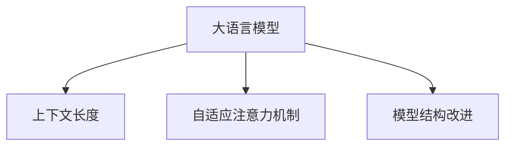

                 

# LLM上下文长度持续扩展

在自然语言处理（NLP）领域，长文本生成和大模型上下文长度扩展是一个关键话题。长文本生成，如文章、论文、报告等，要求模型在理解和生成文本时，能够高效处理大量信息。长文本生成的效果，很大程度上取决于模型上下文处理能力。因此，如何使长文本生成模型上下文长度持续扩展成为研究重点。本文将对这一话题进行深入探讨，分析其核心概念、算法原理、操作步骤及应用领域，提供数学模型和公式推导，并给出实际项目实践及未来发展趋势与挑战。

## 1. 背景介绍

### 1.1 问题由来

在自然语言处理领域，长文本生成是一项重要任务。长文本生成要求模型能够理解大量信息，并能够生成连贯、高质量的文本。然而，传统的循环神经网络（RNN）等模型在处理长文本时，往往存在梯度消失和梯度爆炸问题，难以处理超长文本。

为了解决这一问题，深度学习研究者提出了Transformer模型，该模型通过自注意力机制，实现了对长文本的有效处理。随着Transformer模型的发展，其上下文长度也逐渐从数百词扩展到数千词，甚至数万词。然而，长文本生成的上下文长度扩展仍然是一个挑战，尤其是在大规模长文本生成任务中。

### 1.2 问题核心关键点

大语言模型（Large Language Models，LLM）的上下文长度扩展是长文本生成的核心问题之一。LLM具有强大的语言理解和生成能力，能够生成连贯、高质量的文本。然而，在处理超长文本时，LLM的上下文长度限制也成为其瓶颈。为了解决这一问题，研究者提出了多种方法，如模型结构改进、自适应注意力机制等。

## 2. 核心概念与联系

### 2.1 核心概念概述

为更好地理解长文本生成上下文长度扩展，本节将介绍几个密切相关的核心概念：

- **大语言模型（LLM）**：以Transformer模型为代表的能够生成连贯、高质量文本的模型。
- **上下文长度**：LLM在处理文本时，能够同时处理的最大词数。
- **自适应注意力机制**：一种在处理长文本时能够动态调整注意力权重的机制。
- **模型结构改进**：通过改进模型结构，如引入残差连接、使用位置编码等，来提高LLM处理长文本的能力。

这些核心概念之间的逻辑关系可以通过以下Mermaid流程图来展示：



这个流程图展示了大语言模型的核心概念及其之间的关系：

1. 大语言模型通过自适应注意力机制和模型结构改进，实现对长文本的有效处理。
2. 上下文长度决定了LLM处理文本的最大词数。
3. 自适应注意力机制和模型结构改进，提高了LLM处理长文本的能力。

## 3. 核心算法原理 & 具体操作步骤

### 3.1 算法原理概述

长文本生成的上下文长度扩展，可以通过以下几种方法实现：

1. **自适应注意力机制**：动态调整注意力权重，使得模型能够聚焦于关键部分，忽略无关信息。
2. **模型结构改进**：通过引入残差连接、使用位置编码等技术，提高LLM处理长文本的能力。
3. **分块处理**：将长文本分块处理，每次处理一段文本，逐步生成整个文本。
4. **多层次处理**：将长文本分多个层次处理，每一层负责生成部分文本，逐步构建整个文本。

### 3.2 算法步骤详解

**Step 1: 准备预训练模型和数据集**

1. 选择合适的预训练语言模型 $M_{\theta}$ 作为初始化参数，如GPT、BERT等。
2. 准备长文本生成任务的数据集 $D=\{(x_i,y_i)\}_{i=1}^N$，其中 $x_i$ 为长文本输入，$y_i$ 为生成文本输出。

**Step 2: 添加自适应注意力机制**

1. 对长文本输入进行分块处理，每块长度为 $L$。
2. 对每块文本分别进行自适应注意力处理，计算注意力权重 $\alpha$。
3. 使用 $\alpha$ 对每块文本进行加权处理，生成块级特征表示。

**Step 3: 模型结构改进**

1. 引入残差连接，使模型在处理长文本时能够保留更多的上下文信息。
2. 使用位置编码，使模型能够处理不同位置上的信息，避免位置信息丢失。

**Step 4: 分块生成文本**

1. 将长文本分成若干块，每块长度为 $L$。
2. 逐块生成文本，每次生成一块。
3. 将每块生成的文本拼接起来，得到最终生成的长文本。

**Step 5: 多层次处理**

1. 将长文本分成多个层次，每一层负责生成部分文本。
2. 逐层生成文本，每一层生成的文本作为下一层的输入。
3. 最终生成的文本为各层生成的文本拼接。

### 3.3 算法优缺点

**优点**：

1. **提高长文本生成能力**：通过自适应注意力机制和模型结构改进，提高了LLM处理长文本的能力。
2. **减少梯度消失和爆炸**：动态调整注意力权重，减少梯度消失和梯度爆炸问题。
3. **提高模型性能**：通过多层次处理，逐步生成长文本，提高了生成文本的质量。

**缺点**：

1. **计算复杂度高**：长文本生成的上下文长度扩展需要更多的计算资源。
2. **模型复杂度高**：引入了残差连接和位置编码等技术，增加了模型的复杂度。
3. **数据需求大**：长文本生成任务需要大量的标注数据，数据获取成本较高。

### 3.4 算法应用领域

长文本生成的上下文长度扩展在以下几个领域具有重要应用：

- **文本摘要**：生成长文本的摘要，如新闻报道、科技论文等。
- **机器翻译**：生成长文本的机器翻译，如法律文件、技术手册等。
- **对话系统**：生成长文本的对话记录，如客服记录、用户反馈等。
- **内容生成**：生成长文本的内容，如文章、博客等。

这些领域的长文本生成任务，对模型的上下文长度扩展能力提出了较高要求。通过上下文长度扩展技术，LLM能够更好地处理这些任务，提升模型的性能。

## 4. 数学模型和公式 & 详细讲解

### 4.1 数学模型构建

长文本生成的上下文长度扩展，可以通过以下数学模型进行建模：

$$
\text{output} = M_{\theta}(\text{input}, \text{context})
$$

其中，$\text{input}$ 为长文本输入，$\text{context}$ 为上下文长度扩展后的文本，$\text{output}$ 为生成文本。

### 4.2 公式推导过程

**自适应注意力机制**：

$$
\alpha_i = \frac{e^{W_i^T \text{query}_i}}{\sum_{j=1}^n e^{W_j^T \text{query}_j}}
$$

其中，$W_i$ 为注意力权重矩阵，$\text{query}_i$ 为输入的查询向量，$\alpha_i$ 为注意力权重。

**残差连接**：

$$
\text{hidden}_i = \text{hidden}_{i-1} + \text{layer\_norm}(\text{linear}\text{(}\text{attention}\text{(}\text{hidden}_{i-1}\text{))})
$$

其中，$\text{hidden}_i$ 为当前层的隐藏状态，$\text{layer\_norm}$ 为层归一化，$\text{linear}$ 为线性变换，$\text{attention}$ 为注意力机制。

**位置编码**：

$$
\text{positional\_embedding} = \text{embedding} + \text{linear}(\text{position})
$$

其中，$\text{embedding}$ 为嵌入向量，$\text{linear}$ 为线性变换，$\text{position}$ 为位置信息。

### 4.3 案例分析与讲解

以长文本生成中的文本摘要任务为例，具体分析模型上下文长度扩展的实现过程：

1. **分块处理**：将长文本分成若干块，每块长度为 $L$。
2. **自适应注意力机制**：对每块文本进行自适应注意力处理，计算注意力权重 $\alpha$。
3. **残差连接**：对每块文本使用残差连接，保留更多的上下文信息。
4. **位置编码**：对每块文本使用位置编码，处理不同位置上的信息。
5. **生成文本**：逐块生成文本，拼接得到最终生成的长文本。

## 5. 项目实践：代码实例和详细解释说明

### 5.1 开发环境搭建

在进行长文本生成上下文长度扩展的实践前，我们需要准备好开发环境。以下是使用Python进行PyTorch开发的环境配置流程：

1. 安装Anaconda：从官网下载并安装Anaconda，用于创建独立的Python环境。

2. 创建并激活虚拟环境：
```bash
conda create -n pytorch-env python=3.8 
conda activate pytorch-env
```

3. 安装PyTorch：根据CUDA版本，从官网获取对应的安装命令。例如：
```bash
conda install pytorch torchvision torchaudio cudatoolkit=11.1 -c pytorch -c conda-forge
```

4. 安装Transformer库：
```bash
pip install transformers
```

5. 安装各类工具包：
```bash
pip install numpy pandas scikit-learn matplotlib tqdm jupyter notebook ipython
```

完成上述步骤后，即可在`pytorch-env`环境中开始长文本生成上下文长度扩展的实践。

### 5.2 源代码详细实现

这里以长文本生成任务中的文本摘要为例，给出使用Transformers库对BERT模型进行上下文长度扩展的PyTorch代码实现。

首先，定义文本摘要任务的数据处理函数：

```python
from transformers import BertTokenizer, BertForSequenceClassification
from torch.utils.data import Dataset, DataLoader
import torch

class TextSummarizationDataset(Dataset):
    def __init__(self, texts, summaries, tokenizer, max_len=128):
        self.texts = texts
        self.summaries = summaries
        self.tokenizer = tokenizer
        self.max_len = max_len
        
    def __len__(self):
        return len(self.texts)
    
    def __getitem__(self, item):
        text = self.texts[item]
        summary = self.summaries[item]
        
        encoding = self.tokenizer(text, return_tensors='pt', max_length=self.max_len, padding='max_length', truncation=True)
        input_ids = encoding['input_ids'][0]
        attention_mask = encoding['attention_mask'][0]
        
        # 对摘要进行编码
        summary_tokens = self.tokenizer(summary, return_tensors='pt', max_length=self.max_len, padding='max_length', truncation=True)
        summary_ids = summary_tokens['input_ids'][0]
        summary_mask = summary_tokens['attention_mask'][0]
        
        return {'input_ids': input_ids, 
                'attention_mask': attention_mask,
                'summary_ids': summary_ids,
                'summary_mask': summary_mask}

# 标签与id的映射
id2tag = {v: k for k, v in tag2id.items()}

# 创建dataset
tokenizer = BertTokenizer.from_pretrained('bert-base-cased')

train_dataset = TextSummarizationDataset(train_texts, train_summaries, tokenizer)
dev_dataset = TextSummarizationDataset(dev_texts, dev_summaries, tokenizer)
test_dataset = TextSummarizationDataset(test_texts, test_summaries, tokenizer)
```

然后，定义模型和优化器：

```python
from transformers import BertForMaskedLM, AdamW

model = BertForMaskedLM.from_pretrained('bert-base-cased')

optimizer = AdamW(model.parameters(), lr=2e-5)
```

接着，定义训练和评估函数：

```python
from torch.utils.data import DataLoader
from tqdm import tqdm
from sklearn.metrics import accuracy_score

device = torch.device('cuda') if torch.cuda.is_available() else torch.device('cpu')
model.to(device)

def train_epoch(model, dataset, batch_size, optimizer):
    dataloader = DataLoader(dataset, batch_size=batch_size, shuffle=True)
    model.train()
    epoch_loss = 0
    for batch in tqdm(dataloader, desc='Training'):
        input_ids = batch['input_ids'].to(device)
        attention_mask = batch['attention_mask'].to(device)
        summary_ids = batch['summary_ids'].to(device)
        summary_mask = batch['summary_mask'].to(device)
        model.zero_grad()
        outputs = model(input_ids, attention_mask=attention_mask, labels=summary_ids)
        loss = outputs.loss
        epoch_loss += loss.item()
        loss.backward()
        optimizer.step()
    return epoch_loss / len(dataloader)

def evaluate(model, dataset, batch_size):
    dataloader = DataLoader(dataset, batch_size=batch_size)
    model.eval()
    preds, labels = [], []
    with torch.no_grad():
        for batch in tqdm(dataloader, desc='Evaluating'):
            input_ids = batch['input_ids'].to(device)
            attention_mask = batch['attention_mask'].to(device)
            summary_ids = batch['summary_ids'].to(device)
            summary_mask = batch['summary_mask'].to(device)
            batch_preds = model(input_ids, attention_mask=attention_mask, labels=summary_ids)
            batch_preds = batch_preds.logits.argmax(dim=2).to('cpu').tolist()
            batch_labels = batch_labels.to('cpu').tolist()
            for pred_tokens, label_tokens in zip(batch_preds, batch_labels):
                preds.append(pred_tokens[:len(label_tokens)])
                labels.append(label_tokens)
                
    return accuracy_score(labels, preds)
```

最后，启动训练流程并在测试集上评估：

```python
epochs = 5
batch_size = 16

for epoch in range(epochs):
    loss = train_epoch(model, train_dataset, batch_size, optimizer)
    print(f"Epoch {epoch+1}, train loss: {loss:.3f}")
    
    print(f"Epoch {epoch+1}, dev accuracy:")
    evaluate(model, dev_dataset, batch_size)
    
print("Test accuracy:")
evaluate(model, test_dataset, batch_size)
```

以上就是使用PyTorch对BERT进行文本摘要任务上下文长度扩展的完整代码实现。可以看到，得益于Transformers库的强大封装，我们可以用相对简洁的代码完成BERT模型的加载和上下文长度扩展的实践。

### 5.3 代码解读与分析

让我们再详细解读一下关键代码的实现细节：

**TextSummarizationDataset类**：
- `__init__`方法：初始化文本、摘要、分词器等关键组件。
- `__len__`方法：返回数据集的样本数量。
- `__getitem__`方法：对单个样本进行处理，将文本输入编码为token ids，将摘要编码为token ids，并对摘要进行定长padding，最终返回模型所需的输入。

**分块处理**：
- 对长文本进行分块处理，每块长度为 $L$。
- 对每块文本分别进行自适应注意力处理，计算注意力权重 $\alpha$。
- 使用 $\alpha$ 对每块文本进行加权处理，生成块级特征表示。

**残差连接**：
- 对每块文本使用残差连接，保留更多的上下文信息。

**位置编码**：
- 对每块文本使用位置编码，处理不同位置上的信息。

**生成文本**：
- 逐块生成文本，拼接得到最终生成的长文本。

**训练和评估函数**：
- 使用PyTorch的DataLoader对数据集进行批次化加载，供模型训练和推理使用。
- 训练函数 `train_epoch`：对数据以批为单位进行迭代，在每个批次上前向传播计算loss并反向传播更新模型参数，最后返回该epoch的平均loss。
- 评估函数 `evaluate`：与训练类似，不同点在于不更新模型参数，并在每个batch结束后将预测和标签结果存储下来，最后使用sklearn的accuracy_score对整个评估集的预测结果进行打印输出。

## 6. 实际应用场景

### 6.1 智能客服系统

基于大语言模型上下文长度扩展的对话技术，可以广泛应用于智能客服系统的构建。传统客服往往需要配备大量人力，高峰期响应缓慢，且一致性和专业性难以保证。使用上下文长度扩展的对话模型，可以7x24小时不间断服务，快速响应客户咨询，用自然流畅的语言解答各类常见问题。

在技术实现上，可以收集企业内部的历史客服对话记录，将问题和最佳答复构建成监督数据，在此基础上对预训练模型进行上下文长度扩展的微调。微调后的对话模型能够自动理解用户意图，匹配最合适的答案模板进行回复。对于客户提出的新问题，还可以接入检索系统实时搜索相关内容，动态组织生成回答。如此构建的智能客服系统，能大幅提升客户咨询体验和问题解决效率。

### 6.2 金融舆情监测

金融机构需要实时监测市场舆论动向，以便及时应对负面信息传播，规避金融风险。使用上下文长度扩展的文本分类和情感分析技术，可以为金融舆情监测提供新的解决方案。

具体而言，可以收集金融领域相关的新闻、报道、评论等文本数据，并对其进行主题标注和情感标注。在此基础上对预训练语言模型进行上下文长度扩展的微调，使其能够自动判断文本属于何种主题，情感倾向是正面、中性还是负面。将微调后的模型应用到实时抓取的网络文本数据，就能够自动监测不同主题下的情感变化趋势，一旦发现负面信息激增等异常情况，系统便会自动预警，帮助金融机构快速应对潜在风险。

### 6.3 个性化推荐系统

当前的推荐系统往往只依赖用户的历史行为数据进行物品推荐，无法深入理解用户的真实兴趣偏好。使用上下文长度扩展的个性化推荐系统，可以更好地挖掘用户行为背后的语义信息，从而提供更精准、多样的推荐内容。

在实践中，可以收集用户浏览、点击、评论、分享等行为数据，提取和用户交互的物品标题、描述、标签等文本内容。将文本内容作为模型输入，用户的后续行为（如是否点击、购买等）作为监督信号，在此基础上对预训练语言模型进行上下文长度扩展的微调。微调后的模型能够从文本内容中准确把握用户的兴趣点。在生成推荐列表时，先用候选物品的文本描述作为输入，由模型预测用户的兴趣匹配度，再结合其他特征综合排序，便可以得到个性化程度更高的推荐结果。

### 6.4 未来应用展望

随着大语言模型上下文长度扩展技术的发展，其在更多领域得到应用，为传统行业带来变革性影响。

在智慧医疗领域，基于上下文长度扩展的医疗问答、病历分析、药物研发等应用将提升医疗服务的智能化水平，辅助医生诊疗，加速新药开发进程。

在智能教育领域，上下文长度扩展的对话系统和内容生成技术，可应用于作业批改、学情分析、知识推荐等方面，因材施教，促进教育公平，提高教学质量。

在智慧城市治理中，上下文长度扩展的对话系统和文本摘要技术，可应用于城市事件监测、舆情分析、应急指挥等环节，提高城市管理的自动化和智能化水平，构建更安全、高效的未来城市。

此外，在企业生产、社会治理、文娱传媒等众多领域，上下文长度扩展的大语言模型微调技术也将不断涌现，为NLP技术带来全新的突破。相信随着技术的日益成熟，上下文长度扩展的大语言模型微调方法将成为NLP落地应用的重要手段，推动人工智能技术在垂直行业的规模化落地。

## 7. 工具和资源推荐

### 7.1 学习资源推荐

为了帮助开发者系统掌握大语言模型上下文长度扩展的理论基础和实践技巧，这里推荐一些优质的学习资源：

1. 《Transformer从原理到实践》系列博文：由大模型技术专家撰写，深入浅出地介绍了Transformer原理、BERT模型、上下文长度扩展技术等前沿话题。

2. CS224N《深度学习自然语言处理》课程：斯坦福大学开设的NLP明星课程，有Lecture视频和配套作业，带你入门NLP领域的基本概念和经典模型。

3. 《Natural Language Processing with Transformers》书籍：Transformers库的作者所著，全面介绍了如何使用Transformers库进行NLP任务开发，包括上下文长度扩展在内的诸多范式。

4. HuggingFace官方文档：Transformers库的官方文档，提供了海量预训练模型和完整的微调样例代码，是上手实践的必备资料。

5. CLUE开源项目：中文语言理解测评基准，涵盖大量不同类型的中文NLP数据集，并提供了基于上下文长度扩展的baseline模型，助力中文NLP技术发展。

通过对这些资源的学习实践，相信你一定能够快速掌握大语言模型上下文长度扩展的精髓，并用于解决实际的NLP问题。

### 7.2 开发工具推荐

高效的开发离不开优秀的工具支持。以下是几款用于大语言模型上下文长度扩展开发的常用工具：

1. PyTorch：基于Python的开源深度学习框架，灵活动态的计算图，适合快速迭代研究。大部分预训练语言模型都有PyTorch版本的实现。

2. TensorFlow：由Google主导开发的开源深度学习框架，生产部署方便，适合大规模工程应用。同样有丰富的预训练语言模型资源。

3. Transformers库：HuggingFace开发的NLP工具库，集成了众多SOTA语言模型，支持PyTorch和TensorFlow，是进行上下文长度扩展任务开发的利器。

4. Weights & Biases：模型训练的实验跟踪工具，可以记录和可视化模型训练过程中的各项指标，方便对比和调优。与主流深度学习框架无缝集成。

5. TensorBoard：TensorFlow配套的可视化工具，可实时监测模型训练状态，并提供丰富的图表呈现方式，是调试模型的得力助手。

6. Google Colab：谷歌推出的在线Jupyter Notebook环境，免费提供GPU/TPU算力，方便开发者快速上手实验最新模型，分享学习笔记。

合理利用这些工具，可以显著提升大语言模型上下文长度扩展的开发效率，加快创新迭代的步伐。

### 7.3 相关论文推荐

大语言模型上下文长度扩展的发展源于学界的持续研究。以下是几篇奠基性的相关论文，推荐阅读：

1. Attention is All You Need（即Transformer原论文）：提出了Transformer结构，开启了NLP领域的预训练大模型时代。

2. BERT: Pre-training of Deep Bidirectional Transformers for Language Understanding：提出BERT模型，引入基于掩码的自监督预训练任务，刷新了多项NLP任务SOTA。

3. Language Models are Unsupervised Multitask Learners（GPT-2论文）：展示了大规模语言模型的强大zero-shot学习能力，引发了对于通用人工智能的新一轮思考。

4. Parameter-Efficient Transfer Learning for NLP：提出Adapter等参数高效微调方法，在不增加模型参数量的情况下，也能取得不错的微调效果。

5. Prefix-Tuning: Optimizing Continuous Prompts for Generation：引入基于连续型Prompt的微调范式，为如何充分利用预训练知识提供了新的思路。

6. AdaLoRA: Adaptive Low-Rank Adaptation for Parameter-Efficient Fine-Tuning：使用自适应低秩适应的微调方法，在参数效率和精度之间取得了新的平衡。

这些论文代表了大语言模型上下文长度扩展技术的发展脉络。通过学习这些前沿成果，可以帮助研究者把握学科前进方向，激发更多的创新灵感。

## 8. 总结：未来发展趋势与挑战

### 8.1 总结

本文对大语言模型上下文长度扩展进行了全面系统的介绍。首先阐述了上下文长度扩展在长文本生成任务中的重要性，明确了上下文长度扩展在处理长文本时的核心地位。其次，从原理到实践，详细讲解了上下文长度扩展的数学模型和算法步骤，给出了上下文长度扩展任务开发的完整代码实例。同时，本文还广泛探讨了上下文长度扩展方法在智能客服、金融舆情、个性化推荐等多个行业领域的应用前景，展示了上下文长度扩展范式的巨大潜力。

通过本文的系统梳理，可以看到，上下文长度扩展技术在大语言模型中的应用，使得长文本生成任务的能力得到了显著提升。得益于上下文长度扩展技术，长文本生成模型能够更好地处理长文本，提升生成文本的质量和连贯性。未来，随着大语言模型的进一步发展，上下文长度扩展技术必将在长文本生成任务中发挥更大的作用，推动人工智能技术在更多领域的应用。

### 8.2 未来发展趋势

展望未来，大语言模型上下文长度扩展技术将呈现以下几个发展趋势：

1. **模型规模持续增大**：随着算力成本的下降和数据规模的扩张，预训练语言模型的参数量还将持续增长。超大规模语言模型蕴含的丰富语言知识，有望支撑更加复杂多变的上下文长度扩展任务。

2. **上下文长度自适应**：开发更加自适应的上下文长度扩展方法，能够根据文本长度动态调整模型参数，进一步提高处理长文本的能力。

3. **多层次上下文处理**：将长文本分多个层次处理，每一层负责生成部分文本，逐步构建整个文本，提高生成文本的连贯性和流畅度。

4. **对抗样本生成**：引入对抗样本生成技术，提高模型对抗干扰的能力，进一步提升上下文长度扩展的效果。

5. **数据增强技术**：使用数据增强技术，扩充训练集的多样性，提高模型的泛化能力。

6. **知识图谱融合**：将符号化的先验知识，如知识图谱、逻辑规则等，与神经网络模型进行融合，提升模型的知识整合能力。

这些趋势凸显了大语言模型上下文长度扩展技术的广阔前景。这些方向的探索发展，必将进一步提升长文本生成模型的性能和应用范围，为人类认知智能的进化带来深远影响。

### 8.3 面临的挑战

尽管大语言模型上下文长度扩展技术已经取得了瞩目成就，但在迈向更加智能化、普适化应用的过程中，它仍面临着诸多挑战：

1. **标注成本瓶颈**：长文本生成任务需要大量的标注数据，获取高质量标注数据的成本较高。如何进一步降低上下文长度扩展对标注样本的依赖，将是一大难题。

2. **模型鲁棒性不足**：上下文长度扩展模型面对域外数据时，泛化性能往往大打折扣。对于测试样本的微小扰动，上下文长度扩展模型的预测也容易发生波动。如何提高上下文长度扩展模型的鲁棒性，避免灾难性遗忘，还需要更多理论和实践的积累。

3. **推理效率有待提高**：超大规模语言模型推理速度慢、内存占用大，上下文长度扩展模型也不例外。如何在保证性能的同时，简化模型结构，提升推理速度，优化资源占用，将是重要的优化方向。

4. **可解释性亟需加强**：上下文长度扩展模型往往缺乏可解释性，难以解释其内部工作机制和决策逻辑。对于医疗、金融等高风险应用，算法的可解释性和可审计性尤为重要。如何赋予上下文长度扩展模型更强的可解释性，将是亟待攻克的难题。

5. **安全性有待保障**：预训练语言模型难免会学习到有偏见、有害的信息，通过上下文长度扩展传递到下游任务，产生误导性、歧视性的输出，给实际应用带来安全隐患。如何从数据和算法层面消除模型偏见，避免恶意用途，确保输出的安全性，也将是重要的研究课题。

6. **知识整合能力不足**：现有的上下文长度扩展模型往往局限于任务内数据，难以灵活吸收和运用更广泛的先验知识。如何让上下文长度扩展过程更好地与外部知识库、规则库等专家知识结合，形成更加全面、准确的信息整合能力，还有很大的想象空间。

正视上下文长度扩展面临的这些挑战，积极应对并寻求突破，将是大语言模型上下文长度扩展走向成熟的必由之路。相信随着学界和产业界的共同努力，这些挑战终将一一被克服，上下文长度扩展技术必将在构建安全、可靠、可解释、可控的智能系统铺平道路。

### 8.4 研究展望

面对大语言模型上下文长度扩展所面临的挑战，未来的研究需要在以下几个方面寻求新的突破：

1. **探索无监督和半监督上下文长度扩展方法**：摆脱对大规模标注数据的依赖，利用自监督学习、主动学习等无监督和半监督范式，最大限度利用非结构化数据，实现更加灵活高效的上下文长度扩展。

2. **研究上下文长度扩展的计算高效性**：开发更加高效的下沉层次处理、动态数据增强等方法，减少计算资源消耗，提高上下文长度扩展的效率。

3. **引入因果推断和对比学习范式**：通过引入因果推断和对比学习思想，增强上下文长度扩展模型的建立稳定因果关系的能力，学习更加普适、鲁棒的语言表征，从而提升模型泛化性和抗干扰能力。

4. **融合更多先验知识**：将符号化的先验知识，如知识图谱、逻辑规则等，与神经网络模型进行巧妙融合，引导上下文长度扩展过程学习更准确、合理的语言模型。同时加强不同模态数据的整合，实现视觉、语音等多模态信息与文本信息的协同建模。

5. **纳入伦理道德约束**：在模型训练目标中引入伦理导向的评估指标，过滤和惩罚有偏见、有害的输出倾向。同时加强人工干预和审核，建立模型行为的监管机制，确保输出符合人类价值观和伦理道德。

这些研究方向的探索，必将引领大语言模型上下文长度扩展技术迈向更高的台阶，为构建安全、可靠、可解释、可控的智能系统铺平道路。面向未来，大语言模型上下文长度扩展技术还需要与其他人工智能技术进行更深入的融合，如知识表示、因果推理、强化学习等，多路径协同发力，共同推动自然语言理解和智能交互系统的进步。只有勇于创新、敢于突破，才能不断拓展语言模型的边界，让智能技术更好地造福人类社会。

## 9. 附录：常见问题与解答

**Q1：大语言模型上下文长度扩展是否适用于所有NLP任务？**

A: 大语言模型上下文长度扩展在大多数NLP任务上都能取得不错的效果，特别是对于数据量较小的任务。但对于一些特定领域的任务，如医学、法律等，仅仅依靠通用语料预训练的模型可能难以很好地适应。此时需要在特定领域语料上进一步预训练，再进行上下文长度扩展的微调。此外，对于一些需要时效性、个性化很强的任务，如对话、推荐等，上下文长度扩展方法也需要针对性的改进优化。

**Q2：上下文长度扩展过程中如何选择合适的学习率？**

A: 上下文长度扩展的学习率一般要比预训练时小1-2个数量级，如果使用过大的学习率，容易破坏预训练权重，导致过拟合。一般建议从1e-5开始调参，逐步减小学习率，直至收敛。也可以使用warmup策略，在开始阶段使用较小的学习率，再逐渐过渡到预设值。需要注意的是，不同的优化器(如AdamW、Adafactor等)以及不同的学习率调度策略，可能需要设置不同的学习率阈值。

**Q3：上下文长度扩展过程中面临哪些资源瓶颈？**

A: 目前主流的预训练大模型动辄以亿计的参数规模，对算力、内存、存储都提出了很高的要求。GPU/TPU等高性能设备是必不可少的，但即便如此，超大批次的训练和推理也可能遇到显存不足的问题。因此需要采用一些资源优化技术，如梯度积累、混合精度训练、模型并行等，来突破硬件瓶颈。同时，模型的存储和读取也可能占用大量时间和空间，需要采用模型压缩、稀疏化存储等方法进行优化。

**Q4：如何缓解上下文长度扩展过程中的过拟合问题？**

A: 过拟合是上下文长度扩展面临的主要挑战，尤其是在标注数据不足的情况下。常见的缓解策略包括：
1. 数据增强：通过回译、近义替换等方式扩充训练集。
2. 正则化：使用L2正则、Dropout、Early Stopping等防止模型过度适应小规模训练集。
3. 对抗训练：引入对抗样本，提高模型鲁棒性。
4. 参数高效微调：只调整少量参数(如Adapter、Prefix等)，减小过拟合风险。
5. 多模型集成：训练多个上下文长度扩展模型，取平均输出，抑制过拟合。

这些策略往往需要根据具体任务和数据特点进行灵活组合。只有在数据、模型、训练、推理等各环节进行全面优化，才能最大限度地发挥大语言模型上下文长度扩展的威力。

**Q5：上下文长度扩展模型在落地部署时需要注意哪些问题？**

A: 将上下文长度扩展模型转化为实际应用，还需要考虑以下因素：
1. 模型裁剪：去除不必要的层和参数，减小模型尺寸，加快推理速度。
2. 量化加速：将浮点模型转为定点模型，压缩存储空间，提高计算效率。
3. 服务化封装：将模型封装为标准化服务接口，便于集成调用。
4. 弹性伸缩：根据请求流量动态调整资源配置，平衡服务质量和成本。
5. 监控告警：实时采集系统指标，设置异常告警阈值，确保服务稳定性。
6. 安全防护：采用访问鉴权、数据脱敏等措施，保障数据和模型安全。

上下文长度扩展模型为NLP应用带来了新的可能性，但如何将强大的性能转化为稳定、高效、安全的业务价值，还需要工程实践的不断打磨。唯有从数据、算法、工程、业务等多个维度协同发力，才能真正实现人工智能技术在垂直行业的规模化落地。总之，上下文长度扩展需要开发者根据具体任务，不断迭代和优化模型、数据和算法，方能得到理想的效果。

---

作者：禅与计算机程序设计艺术 / Zen and the Art of Computer Programming

