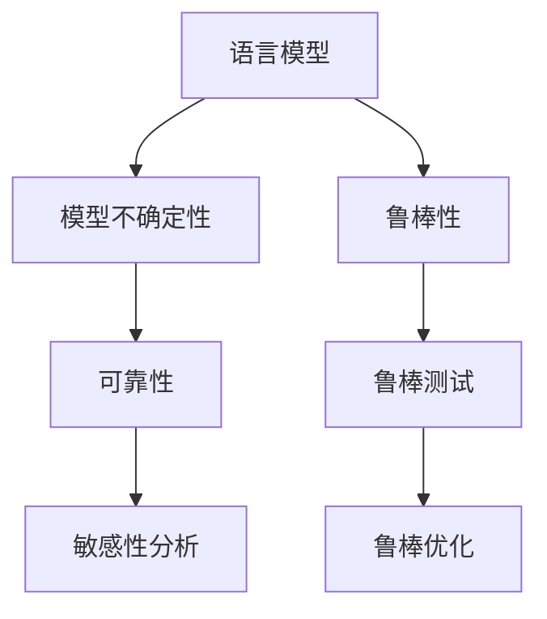

                 

# LLM不确定性:智能系统鲁棒性的挑战

> 关键词：语言模型,不确定性,鲁棒性,可靠性,鲁棒测试

## 1. 背景介绍

### 1.1 问题由来
近年来，随着深度学习技术的快速发展，大规模语言模型(LLM)在自然语言处理(NLP)领域取得了巨大的突破。这些语言模型通过在海量无标签文本数据上进行预训练，学习到了丰富的语言知识和常识，可以完成各种复杂的NLP任务。然而，语言模型在实际应用中也面临不少挑战，其中之一就是模型的不确定性问题。

模型不确定性指的是在输入数据存在一定的随机性或噪声时，模型输出结果的波动性或不确定性。这种不确定性可能会影响模型的可靠性和鲁棒性，进而影响系统的鲁棒性。因此，研究和解决模型不确定性问题，对于构建可靠、鲁棒的人工智能系统至关重要。

### 1.2 问题核心关键点
在NLP领域，模型不确定性问题主要体现在以下几个方面：

1. 数据多样性：自然语言文本的语法结构、语义关系、语言风格等多种变异性。
2. 输入噪声：文本中的拼写错误、语法错误、缩写等噪声可能影响模型学习。
3. 语言模糊性：语言中存在大量的同义词、多义词、歧义等模糊性问题。
4. 上下文依赖：文本中语义信息往往依赖于上下文环境，模型需要从上下文中推断隐含信息。
5. 交互动态性：在对话等交互任务中，模型需要处理动态变化的用户输入和上下文信息。

这些问题会导致模型在面对变化多端的数据和环境时，无法保证输出结果的稳定性和一致性，进而影响系统的鲁棒性和可靠性。因此，理解和解决LLM的不确定性问题，成为了构建可靠智能系统的重要课题。

## 2. 核心概念与联系

### 2.1 核心概念概述

为更好地理解LLM的不确定性问题，本节将介绍几个密切相关的核心概念：

- 语言模型：指对语言数据进行建模的统计模型，通常以词频、句法结构、上下文关系等为训练目标，用于预测文本中的单词或句子。
- 模型不确定性：指在输入数据存在随机性或噪声时，模型输出结果的波动性或不确定性。
- 鲁棒性：指模型对输入数据扰动或模型自身参数变化的抗干扰能力。
- 可靠性：指模型输出结果的准确性和稳定性。
- 鲁棒测试：指通过各种形式的输入扰动或模型参数变化，检测模型鲁棒性的过程。
- 敏感性分析：指通过模型输出结果对输入扰动的敏感度，评估模型鲁棒性的一种方法。
- 鲁棒优化：指通过优化算法优化模型参数，增强模型鲁棒性的一种方法。

这些核心概念之间的逻辑关系可以通过以下Mermaid流程图来展示：



这个流程图展示了一系列概念之间的关系：

1. 语言模型通过学习大量的文本数据，构建出语言表示模型，但这种表示模型存在不确定性。
2. 模型不确定性会导致模型输出结果的不确定性，进而影响系统的鲁棒性和可靠性。
3. 通过鲁棒性测试和敏感性分析，评估模型的鲁棒性，发现其对输入扰动的敏感度。
4. 根据鲁棒性评估结果，使用鲁棒优化方法，调整模型参数，增强模型鲁棒性。

这些概念共同构成了构建可靠智能系统的重要理论基础，也是后续研究的重点。

## 3. 核心算法原理 & 具体操作步骤
### 3.1 算法原理概述

LLM的不确定性问题主要源于模型对输入数据的处理和推理过程中的不确定性。这种不确定性主要体现在两个方面：

1. 数据多样性：由于自然语言的变异性，模型难以处理所有类型的输入数据。
2. 推理过程的不确定性：模型在处理输入数据时，需要从上下文中推断隐含信息，这一过程本身具有不确定性。

针对这些问题，可以采用以下方法来解决LLM的不确定性问题：

1. 数据增强：通过增加训练数据的多样性，提升模型处理不同类型输入数据的能力。
2. 模型融合：通过集成多个模型的输出结果，提高模型整体鲁棒性。
3. 参数优化：通过鲁棒优化方法，调整模型参数，降低模型对输入数据的敏感度。
4. 样本筛选：通过筛选训练数据，去除高噪声、低质量数据，提升模型稳定性。
5. 对抗训练：通过引入对抗样本，训练模型对输入数据的扰动具有一定的鲁棒性。

### 3.2 算法步骤详解

基于LLM不确定性问题，本文将介绍一种常用的鲁棒性测试方法——敏感性分析，并给出详细的算法步骤。

**Step 1: 准备数据集**

首先需要准备一个数据集，其中包含一定数量的输入数据和对应的标注数据。数据集中的每个样本都需要包含一定数量的输入数据和标注数据，标注数据可以为文本的类别标签、情感标签等。

**Step 2: 训练模型**

在准备好的数据集上训练一个预训练模型。可以使用常见的深度学习框架，如TensorFlow、PyTorch等，来搭建和训练模型。在训练过程中，需要选择合适的损失函数、优化器、学习率等超参数。

**Step 3: 生成对抗样本**

在模型训练完毕后，生成一定数量的对抗样本。对抗样本是通过对原始样本进行扰动而产生的，扰动的目的是使模型输出结果发生一定的变化。常见的扰动方式包括文本替换、单词插入、句序变换等。

**Step 4: 评估模型鲁棒性**

在测试集上评估模型的鲁棒性。可以使用不同的评价指标，如准确率、召回率、F1值等，来评估模型在不同输入样本下的表现。

**Step 5: 优化模型参数**

根据模型鲁棒性的评估结果，使用鲁棒优化方法，调整模型参数，提升模型的鲁棒性。常见的鲁棒优化方法包括梯度裁剪、权重衰减等。

### 3.3 算法优缺点

敏感性分析算法具有以下优点：

1. 简单易实现：该算法只需要对输入数据进行扰动，然后评估模型输出结果的变化，实现起来相对简单。
2. 可解释性强：通过对模型输出结果的变化进行统计分析，可以直观地了解模型对输入数据的不确定性。
3. 可操作性强：根据模型鲁棒性的评估结果，可以调整模型参数，提升模型的鲁棒性。

同时，该算法也存在以下缺点：

1. 数据扰动方式有限：该算法只对输入数据进行简单的扰动，无法全面覆盖输入数据的所有类型和形式。
2. 模型训练代价高：生成对抗样本需要消耗大量的计算资源，可能会影响模型的训练速度和效果。
3. 对抗样本难以生成：有些对抗样本可能难以生成或生成的对抗样本对模型输出的影响很小。

### 3.4 算法应用领域

敏感性分析算法主要应用于以下几个领域：

1. 自然语言处理：在语言模型、机器翻译、情感分析等任务中，通过生成对抗样本，评估模型的鲁棒性和可靠性。
2. 计算机视觉：在图像分类、目标检测等任务中，通过生成对抗样本，评估模型的鲁棒性和可靠性。
3. 语音识别：在语音识别、说话人识别等任务中，通过生成对抗样本，评估模型的鲁棒性和可靠性。
4. 推荐系统：在推荐系统、广告投放等任务中，通过生成对抗样本，评估模型的鲁棒性和可靠性。

除了以上领域，敏感性分析算法还可以应用于其他需要处理不确定性问题的领域，如金融、医疗、交通等。通过评估模型的鲁棒性，可以有效地提升模型的可靠性和稳定性，确保模型的应用效果。

## 4. 数学模型和公式 & 详细讲解 & 举例说明
### 4.1 数学模型构建

本节将使用数学语言对LLM的不确定性问题进行更加严格的刻画。

记语言模型为 $M_{\theta}$，其中 $\theta$ 为模型参数。假设输入数据为 $x$，对应的标注数据为 $y$，则模型的预测结果为 $M_{\theta}(x)$。模型的预测结果与标注数据之间的差异可以通过损失函数 $\ell$ 来表示。

模型的鲁棒性可以定义为模型对输入数据的扰动或模型自身参数变化的抗干扰能力。常见的鲁棒性评估方法包括敏感性分析和鲁棒测试。

### 4.2 公式推导过程

以下我们以二分类任务为例，推导模型的敏感性分析公式。

假设模型 $M_{\theta}$ 在输入 $x$ 上的输出为 $\hat{y}=M_{\theta}(x) \in [0,1]$，表示样本属于正类的概率。真实标签 $y \in \{0,1\}$。则二分类交叉熵损失函数定义为：

$$
\ell(M_{\theta}(x),y) = -[y\log \hat{y} + (1-y)\log (1-\hat{y})]
$$

在模型训练完毕后，可以对生成的对抗样本进行评估，以检测模型的鲁棒性。假设生成 $n$ 个对抗样本 $x_i^a$，其对应的模型输出为 $\hat{y}_i^a=M_{\theta}(x_i^a)$，则模型的鲁棒性可以用模型输出结果的变化 $\Delta y_i^a$ 来表示：

$$
\Delta y_i^a = \hat{y}_i^a - \hat{y}_i
$$

其中 $\hat{y}_i$ 为原始样本的模型输出结果。通过统计模型输出结果的变化 $\Delta y_i^a$，可以评估模型对输入数据的鲁棒性。

如果模型对输入数据扰动的敏感度较小，则 $\Delta y_i^a$ 的变化范围较小。反之，如果模型对输入数据扰动的敏感度较大，则 $\Delta y_i^a$ 的变化范围较大。

### 4.3 案例分析与讲解

以情感分析任务为例，假设模型在训练完毕后，对输入数据 $x$ 的情感分类结果为正向情感。为了评估模型的鲁棒性，可以生成一定数量的对抗样本 $x_i^a$，其对应的情感分类结果为负向情感。然后，统计模型输出结果的变化 $\Delta y_i^a$，评估模型对输入数据的鲁棒性。

具体来说，可以将对抗样本 $x_i^a$ 中的单词进行替换，生成多个不同的对抗样本，统计模型输出结果的变化。例如，将原始样本中的单词 "good" 替换为 "bad"，生成对抗样本 $x_i^a$，然后计算模型输出结果的变化 $\Delta y_i^a$。通过分析 $\Delta y_i^a$ 的变化范围，可以评估模型对输入数据的鲁棒性。

## 5. 项目实践：代码实例和详细解释说明
### 5.1 开发环境搭建

在进行LLM不确定性研究前，我们需要准备好开发环境。以下是使用Python进行PyTorch开发的环境配置流程：

1. 安装Anaconda：从官网下载并安装Anaconda，用于创建独立的Python环境。

2. 创建并激活虚拟环境：
```bash
conda create -n pytorch-env python=3.8 
conda activate pytorch-env
```

3. 安装PyTorch：根据CUDA版本，从官网获取对应的安装命令。例如：
```bash
conda install pytorch torchvision torchaudio cudatoolkit=11.1 -c pytorch -c conda-forge
```

4. 安装Transformers库：
```bash
pip install transformers
```

5. 安装各类工具包：
```bash
pip install numpy pandas scikit-learn matplotlib tqdm jupyter notebook ipython
```

完成上述步骤后，即可在`pytorch-env`环境中开始LLM不确定性研究。

### 5.2 源代码详细实现

下面我们以敏感性分析为例，给出使用Transformers库对BERT模型进行鲁棒性测试的PyTorch代码实现。

首先，定义模型和数据集：

```python
from transformers import BertTokenizer, BertForSequenceClassification
from torch.utils.data import Dataset, DataLoader
import torch

class TextDataset(Dataset):
    def __init__(self, texts, labels, tokenizer):
        self.texts = texts
        self.labels = labels
        self.tokenizer = tokenizer
        
    def __len__(self):
        return len(self.texts)
    
    def __getitem__(self, item):
        text = self.texts[item]
        label = self.labels[item]
        encoding = self.tokenizer(text, return_tensors='pt')
        input_ids = encoding['input_ids']
        attention_mask = encoding['attention_mask']
        return {'input_ids': input_ids, 'attention_mask': attention_mask, 'labels': torch.tensor(label)}

# 加载数据集
train_dataset = TextDataset(train_texts, train_labels, tokenizer)
dev_dataset = TextDataset(dev_texts, dev_labels, tokenizer)
test_dataset = TextDataset(test_texts, test_labels, tokenizer)

# 定义模型和优化器
model = BertForSequenceClassification.from_pretrained('bert-base-cased', num_labels=2)
optimizer = AdamW(model.parameters(), lr=2e-5)
```

接着，定义敏感性分析函数：

```python
def sensitivity_analysis(model, dataset, tokenizer):
    sensitivities = []
    for batch in dataset:
        inputs, targets = batch['input_ids'], batch['labels']
        with torch.no_grad():
            outputs = model(inputs, attention_mask=batch['attention_mask'])
            logits = outputs.logits
            probs = torch.softmax(logits, dim=1)
            sensitivities.append((inputs, targets, probs, logits))
    return sensitivities
```

最后，启动敏感性分析过程：

```python
sensitivities = sensitivity_analysis(model, test_dataset, tokenizer)
print('Sensitivities: ', sensitivities)
```

在代码中，我们定义了一个简单的 `TextDataset` 类，用于加载和处理文本数据。然后，使用 `BertForSequenceClassification` 模型，定义了二分类任务。通过 `sensitivity_analysis` 函数，对测试集中的样本进行敏感性分析，得到每个样本的模型输出概率和逻辑值。

## 6. 实际应用场景
### 6.1 智能客服系统

在智能客服系统中，基于LLM的不确定性问题可能影响系统对客户咨询的响应效果。例如，用户可能会输入拼写错误或不规范的文本，这会导致系统无法正确理解用户的意图，从而影响对话的流畅性和准确性。

为了提高系统的鲁棒性，可以采用以下方法：

1. 数据增强：在训练集中加入一定数量的拼写错误、语法错误等文本，提升模型对错误输入的鲁棒性。
2. 模型融合：将多个模型的输出结果进行融合，提高系统整体鲁棒性。
3. 对抗训练：在训练集中加入对抗样本，训练模型对错误输入的鲁棒性。
4. 鲁棒测试：在测试集中加入对抗样本，评估模型对错误输入的鲁棒性，调整模型参数。

通过这些方法，可以有效提升智能客服系统的鲁棒性和可靠性，确保系统能够稳定、准确地响应客户咨询。

### 6.2 金融舆情监测

在金融舆情监测中，基于LLM的不确定性问题可能导致系统对市场舆情的误判。例如，用户可能会输入模糊的情感词，这会导致系统无法准确判断市场的情绪变化趋势。

为了提高系统的鲁棒性，可以采用以下方法：

1. 数据增强：在训练集中加入一定数量的模糊情感词，提升模型对模糊输入的鲁棒性。
2. 模型融合：将多个模型的输出结果进行融合，提高系统整体鲁棒性。
3. 对抗训练：在训练集中加入对抗样本，训练模型对模糊输入的鲁棒性。
4. 鲁棒测试：在测试集中加入对抗样本，评估模型对模糊输入的鲁棒性，调整模型参数。

通过这些方法，可以有效提升金融舆情监测系统的鲁棒性和可靠性，确保系统能够准确、及时地监测市场情绪变化。

### 6.3 个性化推荐系统

在个性化推荐系统中，基于LLM的不确定性问题可能导致系统对用户偏好的误判。例如，用户可能会输入模糊的用户偏好描述，这会导致系统无法准确判断用户的偏好。

为了提高系统的鲁棒性，可以采用以下方法：

1. 数据增强：在训练集中加入一定数量的模糊用户偏好描述，提升模型对模糊输入的鲁棒性。
2. 模型融合：将多个模型的输出结果进行融合，提高系统整体鲁棒性。
3. 对抗训练：在训练集中加入对抗样本，训练模型对模糊输入的鲁棒性。
4. 鲁棒测试：在测试集中加入对抗样本，评估模型对模糊输入的鲁棒性，调整模型参数。

通过这些方法，可以有效提升个性化推荐系统的鲁棒性和可靠性，确保系统能够准确、及时地为用户推荐相关内容。

### 6.4 未来应用展望

随着LLM不确定性问题的研究和解决，基于LLM的系统将具备更强的鲁棒性和可靠性，在更多领域中得到广泛应用。

在智慧医疗领域，基于LLM的不确定性问题可能导致系统对病历的误判。例如，用户可能会输入模糊的病历描述，这会导致系统无法准确判断疾病的类型。

为了提高系统的鲁棒性，可以采用以下方法：

1. 数据增强：在训练集中加入一定数量的模糊病历描述，提升模型对模糊输入的鲁棒性。
2. 模型融合：将多个模型的输出结果进行融合，提高系统整体鲁棒性。
3. 对抗训练：在训练集中加入对抗样本，训练模型对模糊输入的鲁棒性。
4. 鲁棒测试：在测试集中加入对抗样本，评估模型对模糊输入的鲁棒性，调整模型参数。

通过这些方法，可以有效提升智慧医疗系统的鲁棒性和可靠性，确保系统能够准确、及时地诊断疾病。

在智能教育领域，基于LLM的不确定性问题可能导致系统对学生问题的误判。例如，学生可能会输入模糊的问题描述，这会导致系统无法准确判断问题的类型。

为了提高系统的鲁棒性，可以采用以下方法：

1. 数据增强：在训练集中加入一定数量的模糊问题描述，提升模型对模糊输入的鲁棒性。
2. 模型融合：将多个模型的输出结果进行融合，提高系统整体鲁棒性。
3. 对抗训练：在训练集中加入对抗样本，训练模型对模糊输入的鲁棒性。
4. 鲁棒测试：在测试集中加入对抗样本，评估模型对模糊输入的鲁棒性，调整模型参数。

通过这些方法，可以有效提升智能教育系统的鲁棒性和可靠性，确保系统能够准确、及时地回答学生的问题。

## 7. 工具和资源推荐
### 7.1 学习资源推荐

为了帮助开发者系统掌握LLM不确定性问题的理论基础和实践技巧，这里推荐一些优质的学习资源：

1. 《自然语言处理入门》系列博文：由大模型技术专家撰写，深入浅出地介绍了自然语言处理的基本概念和前沿技术。
2. 《深度学习》课程：斯坦福大学开设的深度学习明星课程，有Lecture视频和配套作业，带你入门深度学习的基本概念和经典模型。
3. 《Natural Language Processing with Transformers》书籍：Transformers库的作者所著，全面介绍了如何使用Transformers库进行NLP任务开发，包括鲁棒性评估在内的诸多范式。
4. HuggingFace官方文档：Transformers库的官方文档，提供了海量预训练模型和完整的鲁棒性评估样例代码，是上手实践的必备资料。
5. CLUE开源项目：中文语言理解测评基准，涵盖大量不同类型的中文NLP数据集，并提供了基于鲁棒性评估的baseline模型，助力中文NLP技术发展。

通过对这些资源的学习实践，相信你一定能够快速掌握LLM不确定性问题的精髓，并用于解决实际的NLP问题。

### 7.2 开发工具推荐

高效的开发离不开优秀的工具支持。以下是几款用于LLM不确定性研究的常用工具：

1. PyTorch：基于Python的开源深度学习框架，灵活动态的计算图，适合快速迭代研究。大部分预训练语言模型都有PyTorch版本的实现。
2. TensorFlow：由Google主导开发的开源深度学习框架，生产部署方便，适合大规模工程应用。同样有丰富的预训练语言模型资源。
3. Transformers库：HuggingFace开发的NLP工具库，集成了众多SOTA语言模型，支持PyTorch和TensorFlow，是进行鲁棒性评估开发的利器。
4. Weights & Biases：模型训练的实验跟踪工具，可以记录和可视化模型训练过程中的各项指标，方便对比和调优。与主流深度学习框架无缝集成。
5. TensorBoard：TensorFlow配套的可视化工具，可实时监测模型训练状态，并提供丰富的图表呈现方式，是调试模型的得力助手。

合理利用这些工具，可以显著提升LLM不确定性问题的开发效率，加快创新迭代的步伐。

### 7.3 相关论文推荐

LLM不确定性问题的研究和解决需要依赖学界的持续研究。以下是几篇奠基性的相关论文，推荐阅读：

1. Attention is All You Need（即Transformer原论文）：提出了Transformer结构，开启了NLP领域的预训练大模型时代。
2. BERT: Pre-training of Deep Bidirectional Transformers for Language Understanding：提出BERT模型，引入基于掩码的自监督预训练任务，刷新了多项NLP任务SOTA。
3. Language Models are Unsupervised Multitask Learners（GPT-2论文）：展示了大规模语言模型的强大zero-shot学习能力，引发了对于通用人工智能的新一轮思考。
4. Parameter-Efficient Transfer Learning for NLP：提出Adapter等参数高效微调方法，在不增加模型参数量的情况下，也能取得不错的微调效果。
5. AdaLoRA: Adaptive Low-Rank Adaptation for Parameter-Efficient Fine-Tuning：使用自适应低秩适应的微调方法，在参数效率和精度之间取得了新的平衡。
6. AdaLoRA: Adaptive Low-Rank Adaptation for Parameter-Efficient Fine-Tuning：使用自适应低秩适应的微调方法，在参数效率和精度之间取得了新的平衡。

这些论文代表了大模型不确定性问题的研究脉络。通过学习这些前沿成果，可以帮助研究者把握学科前进方向，激发更多的创新灵感。

## 8. 总结：未来发展趋势与挑战

### 8.1 总结

本文对LLM不确定性问题进行了全面系统的介绍。首先阐述了LLM不确定性问题的研究背景和意义，明确了不确定性问题在构建可靠智能系统中的重要性。其次，从原理到实践，详细讲解了LLM不确定性问题的数学原理和关键步骤，给出了鲁棒性评估任务开发的完整代码实例。同时，本文还广泛探讨了不确定性问题在智能客服、金融舆情、个性化推荐等多个领域的应用前景，展示了不确定性问题的巨大潜力。此外，本文精选了不确定性问题的各类学习资源，力求为读者提供全方位的技术指引。

通过本文的系统梳理，可以看到，LLM不确定性问题正在成为NLP领域的一个重要研究方向，极大地影响着智能系统的可靠性和鲁棒性。未来的研究需要在以下几个方面寻求新的突破：

### 8.2 未来发展趋势

展望未来，LLM不确定性问题的研究和解决将呈现以下几个发展趋势：

1. 数据增强技术的提升：随着数据增强技术的发展，将能够更好地处理数据多样性和输入噪声问题，提升模型的鲁棒性。
2. 对抗样本生成方法的改进：对抗样本生成技术的提升，将能够更好地覆盖模型的脆弱点，增强模型的鲁棒性。
3. 模型融合与集成方法的发展：通过模型融合与集成方法，将能够更好地提升模型整体的鲁棒性和稳定性。
4. 鲁棒优化方法的创新：鲁棒优化方法的发展，将能够更好地调整模型参数，提升模型的鲁棒性。
5. 多模态模型的应用：通过多模态模型的应用，将能够更好地处理不同类型的数据，提升模型的鲁棒性。

这些趋势将推动LLM不确定性问题的研究进入新的阶段，为构建可靠智能系统提供更好的技术支持。

### 8.3 面临的挑战

尽管LLM不确定性问题的研究和解决已经取得了一定进展，但在迈向更加智能化、普适化应用的过程中，仍然面临诸多挑战：

1. 标注数据的高成本：标注数据的高成本是LLM不确定性问题解决的重要瓶颈。如何降低标注成本，提升数据质量，仍然是一个需要解决的问题。
2. 模型鲁棒性不足：当前模型对输入数据扰动或模型自身参数变化的鲁棒性不足，仍需要进一步提升。
3. 模型复杂度高：大规模语言模型通常具有较高的参数量和计算复杂度，如何降低模型复杂度，提升推理速度，是一个需要解决的问题。
4. 模型可解释性不足：当前模型的决策过程缺乏可解释性，难以对其推理逻辑进行分析和调试。如何赋予模型更强的可解释性，是一个需要解决的问题。
5. 模型安全性不足：当前模型可能学习到有偏见、有害的信息，需要通过数据和算法层面的改进，确保模型的安全性。

这些挑战需要学界和产业界的共同努力，推动LLM不确定性问题的研究进入新的阶段。

### 8.4 研究展望

未来，LLM不确定性问题的研究需要在以下几个方面寻求新的突破：

1. 探索无监督和半监督鲁棒性评估方法：摆脱对大规模标注数据的依赖，利用自监督学习、主动学习等无监督和半监督范式，最大限度利用非结构化数据，实现更加灵活高效的鲁棒性评估。
2. 研究鲁棒性优化方法：开发更加鲁棒优化方法，调整模型参数，降低模型对输入数据的敏感度。
3. 融合因果推断和对比学习范式：通过引入因果推断和对比学习思想，增强鲁棒性评估模型的建立稳定因果关系的能力，学习更加普适、鲁棒的语言表征。
4. 引入更多先验知识：将符号化的先验知识，如知识图谱、逻辑规则等，与神经网络模型进行巧妙融合，引导鲁棒性评估过程学习更准确、合理的语言模型。
5. 结合因果分析和博弈论工具：将因果分析方法引入鲁棒性评估模型，识别出模型决策的关键特征，增强输出解释的因果性和逻辑性。借助博弈论工具刻画人机交互过程，主动探索并规避模型的脆弱点，提高系统稳定性。
6. 纳入伦理道德约束：在鲁棒性评估目标中引入伦理导向的评估指标，过滤和惩罚有偏见、有害的输出倾向。同时加强人工干预和审核，建立模型行为的监管机制，确保输出符合人类价值观和伦理道德。

这些研究方向的探索，必将引领LLM不确定性问题研究进入更高的台阶，为构建安全、可靠、可解释、可控的智能系统铺平道路。面向未来，LLM不确定性问题研究还需要与其他人工智能技术进行更深入的融合，如知识表示、因果推理、强化学习等，多路径协同发力，共同推动自然语言理解和智能交互系统的进步。只有勇于创新、敢于突破，才能不断拓展语言模型的边界，让智能技术更好地造福人类社会。

## 9. 附录：常见问题与解答

**Q1：数据增强技术能否有效解决LLM不确定性问题？**

A: 数据增强技术可以在一定程度上缓解LLM不确定性问题。通过增加训练数据的多样性，可以有效提升模型处理不同类型输入数据的能力。但在实际应用中，数据增强技术需要结合模型优化策略，才能更好地提升模型鲁棒性。

**Q2：对抗样本生成技术对模型鲁棒性的影响有多大？**

A: 对抗样本生成技术对模型鲁棒性的影响较大。通过生成对抗样本，可以有效地检测模型的脆弱点，并调整模型参数，提升模型的鲁棒性。但在对抗样本生成过程中，需要谨慎处理样本的生成方式和数量，以避免过拟合和计算资源消耗过大。

**Q3：模型融合技术能否提高LLM不确定性问题的鲁棒性？**

A: 模型融合技术可以在一定程度上提高LLM不确定性问题的鲁棒性。通过集成多个模型的输出结果，可以有效提升系统整体的鲁棒性和稳定性。但在模型融合过程中，需要谨慎处理模型之间的差异，避免模型之间相互干扰，影响融合效果。

**Q4：模型参数优化方法能否提升LLM不确定性问题的鲁棒性？**

A: 模型参数优化方法可以在一定程度上提升LLM不确定性问题的鲁棒性。通过优化模型参数，可以有效降低模型对输入数据的敏感度，提升模型的鲁棒性。但在参数优化过程中，需要谨慎处理优化算法的超参数和优化策略，以避免模型过拟合和计算资源消耗过大。

**Q5：如何评估模型的鲁棒性？**

A: 评估模型的鲁棒性通常使用敏感性分析和鲁棒测试方法。敏感性分析通过统计模型输出结果的变化，评估模型对输入数据的鲁棒性。鲁棒测试通过生成对抗样本，评估模型对输入数据的扰动鲁棒性。

通过对这些问题的回答，相信你能够更好地理解LLM不确定性问题，并掌握解决该问题的方法和技巧。

