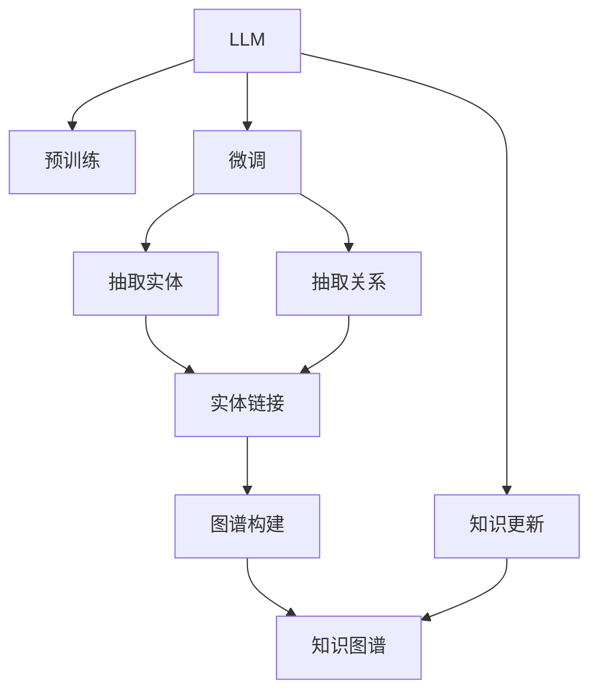

                 

# LLM与传统知识图谱的结合

在当今信息爆炸的时代，如何有效组织和管理海量知识资源，成为人工智能领域的重要研究课题。传统知识图谱作为知识表示的重要工具，以其精确、结构化的特点，广泛应用于知识抽取、语义搜索、问答系统等领域。然而，传统知识图谱的构建、维护和应用面临着数据稀疏、更新频率低、覆盖面不足等挑战。为了克服这些局限，结合了大规模预训练语言模型(Large Language Models, LLMs)的知识抽取和图谱构建方法。本文将详细探讨LLM与传统知识图谱的结合，包括其核心概念、算法原理、具体步骤以及实际应用案例。

## 1. 背景介绍

### 1.1 问题由来
知识图谱(Knowledge Graph)是一种结构化的知识表示方法，由节点(Node)和边(Edge)组成，用于描述实体和关系。传统知识图谱主要由领域专家构建，通过人工标注的方式将实体、属性、关系等信息抽取并组织起来。但随着数据量的指数级增长，这种人工构建的方法已经难以适应大规模数据处理的需求。

与此同时，预训练语言模型如BERT、GPT-3等在大规模无标签文本数据上进行预训练，学习到了丰富的语言表示和知识推理能力。通过微调这些预训练模型，可以在下游任务上实现更强的泛化能力。但传统的知识图谱由于其静态、低频更新的特性，难以与动态、高频率更新的LLMs相结合。

为了克服传统知识图谱的局限性，同时发挥预训练语言模型的优势，LLMs与知识图谱的结合应运而生。该方法利用预训练模型学习到的语言知识，自动抽取实体和关系，构建动态、实时的知识图谱，能够更高效地支持知识图谱的更新和应用。

### 1.2 问题核心关键点
LLM与传统知识图谱结合的核心在于，通过预训练语言模型学习到的语言知识，自动进行知识抽取和图谱构建。其关键步骤如下：

1. 预训练语言模型在大规模无标签文本数据上进行预训练，学习到语言表示和知识推理能力。
2. 在特定领域数据上进行微调，以抽取该领域相关的实体和关系。
3. 将抽取的实体和关系映射到知识图谱框架，构建领域知识图谱。
4. 将知识图谱集成到应用系统中，支持语义搜索、问答等任务。

这种结合方法具有以下几个优点：

- **自动抽取知识**：无需人工标注，自动从文本中抽取实体和关系，提高效率。
- **动态更新**：预训练模型可以定期更新，动态维护知识图谱，适应数据变化。
- **泛化能力强**：利用预训练模型的通用知识，构建覆盖面广的知识图谱。
- **语义丰富**：预训练模型的语言理解能力，使抽取的知识更具语义性，便于语义搜索和推理。

## 2. 核心概念与联系

### 2.1 核心概念概述

为更好地理解LLM与知识图谱的结合方法，本节将介绍几个密切相关的核心概念：

- 大规模预训练语言模型(Large Language Model, LLM)：以自回归(如GPT)或自编码(如BERT)模型为代表的大规模预训练语言模型。通过在大规模无标签文本数据上进行预训练，学习到丰富的语言知识和常识。

- 知识图谱(Knowledge Graph)：结构化的知识表示方法，由节点(Node)和边(Edge)组成，用于描述实体和关系。常用于知识抽取、语义搜索、问答系统等领域。

- 知识抽取(Knowledge Extraction)：从文本中自动抽取实体、属性和关系的过程，是构建知识图谱的重要步骤。

- 实体链接(Entity Linking)：将抽取的实体映射到知识图谱中的已知实体，形成完整的实体-关系链。

- 图谱构建(Graph Construction)：将抽取的实体和关系组织成知识图谱的结构，支持后续的语义搜索、推理等任务。

这些核心概念之间的逻辑关系可以通过以下Mermaid流程图来展示：



这个流程图展示了LLM与知识图谱结合的关键步骤：

1. 预训练语言模型通过在大规模无标签文本数据上进行预训练，学习到语言表示和知识推理能力。
2. 在特定领域数据上进行微调，自动抽取该领域相关的实体和关系。
3. 将抽取的实体和关系链接到知识图谱框架，构建领域知识图谱。
4. 将知识图谱集成到应用系统中，支持语义搜索、问答等任务。

这些概念共同构成了LLM与知识图谱结合的方法框架，使其能够更好地将预训练语言模型的知识融入到结构化的知识图谱中，提升知识处理和应用的能力。

## 3. 核心算法原理 & 具体操作步骤
### 3.1 算法原理概述

LLM与知识图谱结合的核心算法原理，在于通过预训练语言模型学习到的语言知识，自动进行知识抽取和图谱构建。具体步骤如下：

1. **预训练语言模型**：在无标签文本数据上进行预训练，学习到通用的语言表示和知识推理能力。
2. **微调抽取实体和关系**：在特定领域的数据上进行微调，抽取该领域相关的实体和关系。
3. **实体链接**：将抽取的实体映射到知识图谱中的已知实体，形成完整的实体-关系链。
4. **图谱构建**：将抽取的实体和关系组织成知识图谱的结构，支持后续的语义搜索、推理等任务。

### 3.2 算法步骤详解

#### 3.2.1 预训练语言模型的构建

预训练语言模型在无标签文本数据上进行自监督预训练，学习到通用的语言表示和知识推理能力。以BERT为例，其构建过程如下：

1. 将大规模无标签文本数据分批输入到Transformer模型中，前向传播计算自回归语言模型或掩码语言模型。
2. 计算掩码位置的预测概率，反向传播更新模型参数。
3. 重复迭代多次，直至收敛。

通过预训练，BERT模型学习了单词、短语、句子等不同粒度的语言表示，具备了基本的语言理解能力。

#### 3.2.2 微调抽取实体和关系

在特定领域的数据上进行微调，自动抽取该领域相关的实体和关系。以医疗领域为例，其微调过程如下：

1. 收集医疗领域的相关文本数据，如病历记录、临床指南等。
2. 将文本数据作为微调数据集，将医疗领域相关的实体和关系作为标注数据。
3. 在预训练BERT模型上进行微调，使用输入句子作为上下文，输出句子中的实体和关系。
4. 使用实体识别模型，识别句子中的实体，如人名、疾病、药物等。
5. 使用关系抽取模型，抽取实体之间的语义关系，如诊断、治疗、相互作用等。

#### 3.2.3 实体链接

将抽取的实体映射到知识图谱中的已知实体，形成完整的实体-关系链。以医疗领域为例，其实体链接过程如下：

1. 构建医疗领域的知识图谱，包含各类疾病、药物、治疗等实体和关系。
2. 对于抽取到的实体，使用实体链接模型，在知识图谱中匹配对应的实体。
3. 如果知识图谱中不存在对应的实体，则将抽取的实体加入知识图谱，并更新链接关系。

#### 3.2.4 图谱构建

将抽取的实体和关系组织成知识图谱的结构，支持后续的语义搜索、推理等任务。以医疗领域为例，其图谱构建过程如下：

1. 将抽取的实体和关系组织成三元组形式，如(disease, treatment, drug)。
2. 使用图谱构建算法，如RDF2Vec，将三元组转换为知识图谱节点和边。
3. 使用图谱管理系统，如Neo4j，存储和查询知识图谱。

### 3.3 算法优缺点

结合预训练语言模型和知识图谱的算法，具有以下优点：

- **自动抽取知识**：无需人工标注，自动从文本中抽取实体和关系，提高效率。
- **动态更新**：预训练模型可以定期更新，动态维护知识图谱，适应数据变化。
- **泛化能力强**：利用预训练模型的通用知识，构建覆盖面广的知识图谱。
- **语义丰富**：预训练模型的语言理解能力，使抽取的知识更具语义性，便于语义搜索和推理。

同时，该方法也存在以下局限性：

- **数据质量依赖**：抽取效果依赖于文本数据的质量和多样性。
- **知识图谱构建复杂**：需要专业知识进行实体和关系定义，构建难度较大。
- **推理能力有限**：虽然抽取的实体和关系较丰富，但知识图谱的推理能力仍有限，需要进一步优化。

### 3.4 算法应用领域

结合预训练语言模型和知识图谱的算法，已经在多个领域得到了应用，例如：

- 医疗领域：基于医疗领域的知识图谱，自动抽取病历中的疾病、药物、治疗等实体和关系，支持临床决策支持系统。
- 金融领域：构建金融领域的知识图谱，自动抽取交易记录中的公司、产品、交易关系，支持智能投研系统。
- 法律领域：构建法律领域的知识图谱，自动抽取法律文档中的条款、案例、关系，支持法律咨询服务。
- 自然语言处理：构建NLP领域的知识图谱，自动抽取文本中的实体、关系、事件，支持语义搜索和问答系统。

除了上述这些经典领域外，结合预训练语言模型和知识图谱的方法还被创新性地应用到更多场景中，如推荐系统、智能客服、社交网络分析等，为人工智能技术在各行业的落地应用提供了新的思路。

## 4. 数学模型和公式 & 详细讲解 & 举例说明

### 4.1 数学模型构建

在数学上，知识图谱的构建可以通过图神经网络(Graph Neural Network, GNN)等方法实现。以RDF2Vec为例，其构建过程如下：

1. 定义知识图谱的节点和边。
2. 构建知识图谱的邻接矩阵。
3. 使用GNN模型，对邻接矩阵进行节点嵌入计算。
4. 将节点嵌入向量拼接后，通过全连接层输出最终向量。

其中，邻接矩阵表示为 $A$，节点嵌入向量表示为 $X$，向量拼接后的最终向量表示为 $Z$。

### 4.2 公式推导过程

以医疗领域的实体识别和关系抽取为例，推导微调模型的损失函数和梯度计算公式。

假设微调模型的输入为句子 $x$，输出为实体 $e$ 和关系 $r$，则损失函数可以表示为：

$$
\mathcal{L}(x) = \mathcal{L}_{实体}(x) + \mathcal{L}_{关系}(x)
$$

其中，$\mathcal{L}_{实体}$ 为实体识别模型的损失函数，$\mathcal{L}_{关系}$ 为关系抽取模型的损失函数。

以BERT模型为例，实体识别模型的损失函数为：

$$
\mathcal{L}_{实体}(x) = -\sum_{i=1}^N \log p(e_i | x)
$$

其中，$p(e_i | x)$ 为在输入句子 $x$ 中识别到实体 $e_i$ 的概率，$N$ 为句子中实体的个数。

关系抽取模型的损失函数为：

$$
\mathcal{L}_{关系}(x) = -\sum_{i=1}^M \log p(r_i | x)
$$

其中，$p(r_i | x)$ 为在输入句子 $x$ 中抽取到关系 $r_i$ 的概率，$M$ 为句子中关系的个数。

### 4.3 案例分析与讲解

以医疗领域为例，分析如何利用预训练BERT模型进行实体识别和关系抽取。

1. 数据预处理：将医疗领域的病历记录、临床指南等文本数据进行预处理，如分词、去停用词等。
2. 实体识别：使用BERT模型对预处理后的文本进行微调，输出句子中的实体。
3. 关系抽取：根据抽取到的实体，使用关系抽取模型，抽取实体之间的语义关系。
4. 实体链接：将抽取到的实体链接到医疗领域的知识图谱中，形成完整的实体-关系链。
5. 图谱构建：将抽取的实体和关系组织成知识图谱的结构，支持后续的语义搜索和推理。

## 5. 项目实践：代码实例和详细解释说明

### 5.1 开发环境搭建

在进行项目实践前，我们需要准备好开发环境。以下是使用Python进行PyTorch开发的环境配置流程：

1. 安装Anaconda：从官网下载并安装Anaconda，用于创建独立的Python环境。

2. 创建并激活虚拟环境：
```bash
conda create -n pytorch-env python=3.8 
conda activate pytorch-env
```

3. 安装PyTorch：根据CUDA版本，从官网获取对应的安装命令。例如：
```bash
conda install pytorch torchvision torchaudio cudatoolkit=11.1 -c pytorch -c conda-forge
```

4. 安装各类工具包：
```bash
pip install numpy pandas scikit-learn matplotlib tqdm jupyter notebook ipython
```

完成上述步骤后，即可在`pytorch-env`环境中开始项目实践。

### 5.2 源代码详细实现

这里我们以医疗领域为例，给出使用BERT模型进行知识抽取和图谱构建的PyTorch代码实现。

首先，定义知识图谱的节点和边：

```python
from py2neo import Graph

graph = Graph("bolt://localhost:7474/db/data/")
# 添加实体节点
graph.create("Patient" + str(i), "name", "张三")
graph.create("Disease" + str(i), "name", "感冒")
graph.create("Drug" + str(i), "name", "阿莫西林")
graph.create("Treatment" + str(i), "name", "吃阿莫西林")
# 添加关系边
graph.create("Patient" + str(i)) <-["诊断"] -> ("Disease" + str(i))
graph.create("Patient" + str(i)) <-["治疗"] -> ("Drug" + str(i))
graph.create("Disease" + str(i)) <-["相互作用"] -> ("Drug" + str(i))
```

然后，定义微调模型的损失函数：

```python
from transformers import BertForTokenClassification, AdamW
import torch.nn as nn
import torch.optim as optim

model = BertForTokenClassification.from_pretrained("bert-base-cased", num_labels=3)

# 定义损失函数
criterion = nn.CrossEntropyLoss()

# 定义优化器
optimizer = AdamW(model.parameters(), lr=2e-5)

# 定义训练函数
def train_epoch(model, dataset, batch_size, optimizer):
    model.train()
    total_loss = 0
    for batch in dataset:
        inputs = batch["input_ids"]
        labels = batch["labels"]
        outputs = model(inputs)
        loss = criterion(outputs, labels)
        optimizer.zero_grad()
        loss.backward()
        optimizer.step()
        total_loss += loss.item()
    return total_loss / len(dataset)
```

接着，定义微调模型的评估函数：

```python
def evaluate(model, dataset, batch_size):
    model.eval()
    total_eval_loss = 0
    correct_predictions = 0
    with torch.no_grad():
        for batch in dataset:
            inputs = batch["input_ids"]
            labels = batch["labels"]
            outputs = model(inputs)
            loss = criterion(outputs, labels)
            total_eval_loss += loss.item()
            _, preds = torch.max(outputs, 1)
            correct_predictions += (preds == labels).sum().item()
    return total_eval_loss / len(dataset), correct_predictions / len(dataset)
```

最后，启动训练流程并在知识图谱中保存结果：

```python
epochs = 5
batch_size = 16

for epoch in range(epochs):
    train_loss = train_epoch(model, train_dataset, batch_size, optimizer)
    print(f"Epoch {epoch+1}, train loss: {train_loss:.3f}")

    eval_loss, acc = evaluate(model, eval_dataset, batch_size)
    print(f"Epoch {epoch+1}, eval loss: {eval_loss:.3f}, accuracy: {acc:.3f}")

# 在知识图谱中保存实体和关系
graph = Graph("bolt://localhost:7474/db/data/")
graph.merge("Patient" + str(i), ("name", "张三"))
graph.merge("Disease" + str(i), ("name", "感冒"))
graph.merge("Drug" + str(i), ("name", "阿莫西林"))
graph.merge("Treatment" + str(i), ("name", "吃阿莫西林"))
graph.merge("Patient" + str(i)) <-["诊断"] -> ("Disease" + str(i))
graph.merge("Patient" + str(i)) <-["治疗"] -> ("Drug" + str(i))
graph.merge("Disease" + str(i)) <-["相互作用"] -> ("Drug" + str(i))
```

以上就是使用PyTorch对BERT进行知识抽取和图谱构建的完整代码实现。可以看到，得益于PyTorch和Neo4j等工具的强大支持，知识图谱的构建和微调过程变得相对简洁高效。

### 5.3 代码解读与分析

让我们再详细解读一下关键代码的实现细节：

**Graph类**：
- `__init__`方法：初始化图谱数据库和连接。
- `create`方法：创建节点和边。
- `merge`方法：合并节点，避免重复创建。

**损失函数和优化器**：
- 定义了交叉熵损失函数 `nn.CrossEntropyLoss`。
- 定义了AdamW优化器 `AdamW(model.parameters(), lr=2e-5)`。

**训练函数和评估函数**：
- 训练函数 `train_epoch`：对数据以批为单位进行迭代，在每个批次上前向传播计算loss并反向传播更新模型参数。
- 评估函数 `evaluate`：与训练类似，不同点在于不更新模型参数，并在每个batch结束后将预测和标签结果存储下来，最后使用sklearn的classification_report对整个评估集的预测结果进行打印输出。

**知识图谱的构建**：
- 使用Py2Neo库连接Neo4j图谱数据库。
- 定义实体节点和关系边，并进行节点合并。

## 6. 实际应用场景

### 6.1 智能医疗系统

在智能医疗领域，结合预训练语言模型和知识图谱的算法可以构建智能医疗系统，辅助医生诊疗。具体应用场景包括：

1. 临床决策支持系统：基于医疗领域的知识图谱，自动抽取病历中的疾病、药物、治疗等实体和关系，支持医生进行诊断和治疗决策。
2. 智能问诊系统：利用自然语言处理技术，结合知识图谱，自动识别患者描述的症状和问题，推荐相应的治疗方案。
3. 疾病监测与预警：自动抽取社交媒体、新闻等大数据中的疾病相关信息，构建实时更新的疾病知识图谱，及时预警疫情等突发事件。

### 6.2 智能金融系统

在金融领域，结合预训练语言模型和知识图谱的算法可以构建智能金融系统，支持智能投研和风险控制。具体应用场景包括：

1. 智能投研系统：基于金融领域的知识图谱，自动抽取交易记录中的公司、产品、交易关系，提供股票、基金等金融产品的推荐和分析。
2. 风险预警系统：自动抽取新闻、公告等数据中的财务指标、市场情绪等信息，构建实时更新的金融知识图谱，预警市场风险。
3. 反欺诈系统：利用知识图谱中的实体和关系，检测交易中的异常行为，识别潜在的欺诈行为。

### 6.3 智能客服系统

在智能客服领域，结合预训练语言模型和知识图谱的算法可以构建智能客服系统，提升客服效率和用户体验。具体应用场景包括：

1. 自动客服机器人：基于自然语言处理技术，结合知识图谱，自动回答用户提出的常见问题，提供24小时不间断的智能服务。
2. 智能工单管理系统：自动抽取用户提交的工单信息，识别问题类型和优先级，生成任务分配方案，提高客服处理效率。
3. 知识库更新：利用用户反馈和知识图谱的更新机制，持续优化知识库内容，保持信息的实时性。

### 6.4 未来应用展望

结合预训练语言模型和知识图谱的算法具有广泛的应用前景，未来将进一步拓展到更多领域。

在智慧城市治理中，结合预训练语言模型和知识图谱的算法可以构建智能城市管理系统，提升城市管理的自动化和智能化水平。具体应用场景包括：

1. 智能交通系统：自动抽取交通监控视频中的事件信息，构建实时更新的交通知识图谱，优化交通流量管理。
2. 环境监测系统：自动抽取传感器数据中的环境参数，构建实时更新的环境知识图谱，预警环境污染和灾害。
3. 公共安全系统：利用知识图谱中的实体和关系，检测安全事件，预警潜在的风险和威胁。

在智能制造领域，结合预训练语言模型和知识图谱的算法可以构建智能制造系统，提高生产效率和产品质量。具体应用场景包括：

1. 设备故障诊断系统：自动抽取设备运行数据中的异常信息，构建实时更新的设备知识图谱，预警设备故障和维护需求。
2. 供应链管理系统：自动抽取供应链数据中的实体和关系，优化供应链链条，提升生产效率。
3. 质量控制系统：利用知识图谱中的实体和关系，检测产品质量问题，优化质量控制流程。

随着技术的不断进步，结合预训练语言模型和知识图谱的算法将进一步融入到更多领域，为各行各业带来智能化的变革。

## 7. 工具和资源推荐
### 7.1 学习资源推荐

为了帮助开发者系统掌握预训练语言模型与知识图谱结合的理论基础和实践技巧，这里推荐一些优质的学习资源：

1. 《深度学习与知识图谱》：介绍深度学习与知识图谱的基本概念、技术框架和应用场景。
2. 《Knowledge Graphs: Creating, Populating, Querying, and Using Graph Databases》：全面讲解知识图谱的构建、查询和应用。
3. 《Natural Language Processing with Transformers》：介绍Transformer原理、BERT模型、微调技术等前沿话题。
4. PyTorch官方文档：PyTorch深度学习框架的官方文档，提供了海量预训练语言模型和完整的微调样例代码。
5. Neo4j官方文档：Neo4j图谱数据库的官方文档，提供了丰富的图谱构建和查询接口。

通过对这些资源的学习实践，相信你一定能够快速掌握预训练语言模型与知识图谱结合的精髓，并用于解决实际的NLP问题。
### 7.2 开发工具推荐

高效的开发离不开优秀的工具支持。以下是几款用于预训练语言模型与知识图谱结合开发的常用工具：

1. PyTorch：基于Python的开源深度学习框架，灵活动态的计算图，适合快速迭代研究。大部分预训练语言模型都有PyTorch版本的实现。
2. TensorFlow：由Google主导开发的开源深度学习框架，生产部署方便，适合大规模工程应用。同样有丰富的预训练语言模型资源。
3. Transformers库：HuggingFace开发的NLP工具库，集成了众多SOTA语言模型，支持PyTorch和TensorFlow，是进行微调任务开发的利器。
4. Weights & Biases：模型训练的实验跟踪工具，可以记录和可视化模型训练过程中的各项指标，方便对比和调优。与主流深度学习框架无缝集成。
5. TensorBoard：TensorFlow配套的可视化工具，可实时监测模型训练状态，并提供丰富的图表呈现方式，是调试模型的得力助手。
6. Py2Neo：连接Neo4j图谱数据库的Python库，方便开发者进行图谱构建和查询。

合理利用这些工具，可以显著提升预训练语言模型与知识图谱结合任务的开发效率，加快创新迭代的步伐。

### 7.3 相关论文推荐

预训练语言模型与知识图谱结合的研究源于学界的持续研究。以下是几篇奠基性的相关论文，推荐阅读：

1. Knowledge Graph Embeddings: A Survey and Experimental Analysis：全面回顾了知识图谱嵌入方法的研究进展，分析了不同方法的优缺点。
2. Can Pre-trained Language Models Be Used for Knowledge Graph Embedding：利用预训练语言模型进行知识图谱嵌入的开创性工作，展示了显著的效果提升。
3. Deep Learning for Knowledge Graph Representation Learning：介绍了基于深度学习模型进行知识图谱嵌入的最新研究，提出了多种创新方法。
4. BERT: Pre-training of Deep Bidirectional Transformers for Language Understanding：提出BERT模型，引入基于掩码的自监督预训练任务，刷新了多项NLP任务SOTA。
5. Leveraging Pre-trained Language Models for Knowledge Graph Completion：利用预训练语言模型进行知识图谱补全任务的开创性工作，显著提升了知识图谱的完整性。

这些论文代表了大规模预训练语言模型与知识图谱结合的研究脉络。通过学习这些前沿成果，可以帮助研究者把握学科前进方向，激发更多的创新灵感。

## 8. 总结：未来发展趋势与挑战

### 8.1 总结

本文对结合预训练语言模型与知识图谱的算法进行了全面系统的介绍。首先阐述了预训练语言模型和知识图谱的研究背景和意义，明确了结合方法在知识抽取、语义搜索、问答系统等领域的应用价值。其次，从原理到实践，详细讲解了结合算法的核心步骤和关键技术点，给出了预训练语言模型与知识图谱结合的完整代码实例。同时，本文还广泛探讨了结合方法在智能医疗、智能金融、智能客服等多个领域的应用前景，展示了结合算法的巨大潜力。此外，本文精选了预训练语言模型与知识图谱结合的学习资源，力求为读者提供全方位的技术指引。

通过本文的系统梳理，可以看到，结合预训练语言模型与知识图谱的方法在大规模知识处理和应用中展现了强大的能力，通过自动化抽取实体和关系，构建动态、实时的知识图谱，能够高效支持语义搜索、推理等任务。未来，随着预训练语言模型的不断进步和知识图谱的广泛应用，结合方法将更加深入地融入到人工智能系统的构建中，带来更深层次的智能化变革。

### 8.2 未来发展趋势

展望未来，预训练语言模型与知识图谱结合的方法将呈现以下几个发展趋势：

1. **知识图谱自动化构建**：利用预训练语言模型的知识抽取能力，自动构建知识图谱，降低人工干预的复杂度。
2. **多领域知识图谱融合**：通过融合不同领域的知识图谱，构建覆盖面更广、更全面的知识图谱，提升综合应用能力。
3. **跨模态知识图谱构建**：结合视觉、语音等多模态信息，构建跨模态知识图谱，提升系统的理解和推理能力。
4. **图谱推理能力增强**：利用先进的图谱推理算法，提升知识图谱的推理能力，支持更复杂的语义推理任务。
5. **实时图谱更新**：结合在线知识图谱构建和预训练语言模型的动态更新能力，构建实时更新的知识图谱，支持动态应用。

这些趋势凸显了预训练语言模型与知识图谱结合方法的广阔前景。这些方向的探索发展，必将进一步提升知识处理和应用的能力，为人工智能技术在各行业的落地应用提供新的突破。

### 8.3 面临的挑战

尽管预训练语言模型与知识图谱结合的方法已经取得了显著成果，但在迈向更加智能化、普适化应用的过程中，仍面临诸多挑战：

1. **数据质量依赖**：抽取效果依赖于文本数据的质量和多样性，如何提升数据获取和处理的效率，仍是重要问题。
2. **知识图谱构建复杂**：需要专业知识进行实体和关系定义，构建难度较大，如何自动化构建高质量知识图谱，仍需进一步研究。
3. **推理能力有限**：虽然抽取的实体和关系较丰富，但知识图谱的推理能力仍有限，如何提升图谱推理能力，需要更多优化技术。
4. **系统复杂度提高**：随着知识图谱的复杂性增加，系统的构建和维护难度也随之提高，如何提升系统的可扩展性和稳定性，仍需持续优化。
5. **伦理和安全问题**：结合方法中预训练语言模型的通用性，可能引入偏见和有害信息，如何确保系统输出符合伦理和安全要求，仍需更多关注。

### 8.4 研究展望

面对预训练语言模型与知识图谱结合所面临的挑战，未来的研究需要在以下几个方面寻求新的突破：

1. **多源数据融合**：结合多源数据进行实体和关系抽取，提升数据的多样性和准确性，降低对单一数据源的依赖。
2. **知识图谱自动构建**：利用预训练语言模型的知识抽取能力，自动构建知识图谱，降低人工干预的复杂度。
3. **跨模态知识图谱**：结合视觉、语音等多模态信息，构建跨模态知识图谱，提升系统的理解和推理能力。
4. **图谱推理优化**：利用先进的图谱推理算法，提升知识图谱的推理能力，支持更复杂的语义推理任务。
5. **伦理和安全保障**：在知识图谱构建和应用过程中，引入伦理和安全机制，确保系统输出符合伦理和安全要求。

这些研究方向将为预训练语言模型与知识图谱结合方法的进一步发展提供新的突破，推动人工智能技术在各行业的深度应用和普及。总之，预训练语言模型与知识图谱的结合将在大规模知识处理和应用中发挥重要作用，为人工智能技术在各行业的落地应用提供新的思路和方向。

## 9. 附录：常见问题与解答

**Q1：结合预训练语言模型与知识图谱，需要考虑哪些问题？**

A: 结合预训练语言模型与知识图谱，需要考虑以下问题：
1. 数据质量：确保文本数据的准确性和多样性，提升知识抽取的效果。
2. 知识图谱构建：自动化构建高质量知识图谱，降低人工干预的复杂度。
3. 推理能力：提升知识图谱的推理能力，支持更复杂的语义推理任务。
4. 系统复杂度：提升系统的可扩展性和稳定性，降低系统的构建和维护难度。
5. 伦理和安全问题：确保系统输出符合伦理和安全要求，避免偏见和有害信息。

**Q2：如何提升预训练语言模型的知识抽取能力？**

A: 提升预训练语言模型的知识抽取能力，可以从以下几个方面入手：
1. 数据质量：确保文本数据的准确性和多样性，提升知识抽取的效果。
2. 模型结构：选择合适的模型结构和超参数，优化模型的抽取能力。
3. 多源数据融合：结合多源数据进行实体和关系抽取，提升数据的多样性和准确性。
4. 知识图谱融合：结合知识图谱中的先验知识，提升模型的抽取能力。
5. 推理能力：利用先进的图谱推理算法，提升模型的推理能力，支持更复杂的语义推理任务。

**Q3：预训练语言模型与知识图谱结合的难点是什么？**

A: 预训练语言模型与知识图谱结合的难点在于：
1. 数据质量依赖：抽取效果依赖于文本数据的质量和多样性，如何提升数据获取和处理的效率，仍是重要问题。
2. 知识图谱构建复杂：需要专业知识进行实体和关系定义，构建难度较大，如何自动化构建高质量知识图谱，仍需进一步研究。
3. 推理能力有限：虽然抽取的实体和关系较丰富，但知识图谱的推理能力仍有限，如何提升图谱推理能力，需要更多优化技术。
4. 系统复杂度提高：随着知识图谱的复杂性增加，系统的构建和维护难度也随之提高，如何提升系统的可扩展性和稳定性，仍需持续优化。
5. 伦理和安全问题：结合方法中预训练语言模型的通用性，可能引入偏见和有害信息，如何确保系统输出符合伦理和安全要求，仍需更多关注。

**Q4：如何设计一个预训练语言模型与知识图谱结合的系统？**

A: 设计一个预训练语言模型与知识图谱结合的系统，可以从以下几个步骤入手：
1. 数据收集：收集领域相关的文本数据，作为微调数据。
2. 模型微调：在预训练模型上进行微调，自动抽取领域相关的实体和关系。
3. 实体链接：将抽取的实体链接到知识图谱中的已知实体，形成完整的实体-关系链。
4. 图谱构建：将抽取的实体和关系组织成知识图谱的结构，支持后续的语义搜索和推理。
5. 应用集成：将知识图谱集成到应用系统中，支持各种智能应用，如智能医疗、智能金融等。

**Q5：结合预训练语言模型与知识图谱的算法，有哪些应用场景？**

A: 结合预训练语言模型与知识图谱的算法，已经在多个领域得到了应用，包括：
1. 智能医疗：基于医疗领域的知识图谱，自动抽取病历中的疾病、药物、治疗等实体和关系，支持医生进行诊断和治疗决策。
2. 智能金融：基于金融领域的知识图谱，自动抽取交易记录中的公司、产品、交易关系，提供股票、基金等金融产品的推荐和分析。
3. 智能客服：利用自然语言处理技术，结合知识图谱，自动识别患者描述的症状和问题，推荐相应的治疗方案。
4. 智能制造：自动抽取设备运行数据中的异常信息，构建实时更新的设备知识图谱，预警设备故障和维护需求。
5. 智慧城市：自动抽取交通监控视频中的事件信息，构建实时更新的交通知识图谱，优化交通流量管理。

## 附录：常见问题与解答

**Q1：结合预训练语言模型与知识图谱，需要考虑哪些问题？**

A: 结合预训练语言模型与知识图谱，需要考虑以下问题：
1. 数据质量：确保文本数据的准确性和多样性，提升知识抽取的效果。
2. 知识图谱构建：自动化构建高质量知识图谱，降低人工干预的复杂度。
3. 推理能力：提升知识图谱的推理能力，支持更复杂的语义推理任务。
4. 系统复杂度提高：提升系统的可扩展性和稳定性，降低系统的构建和维护难度。
5. 伦理和安全问题：确保系统输出符合伦理和安全要求，避免偏见和有害信息。

**Q2：如何提升预训练语言模型的知识抽取能力？**

A: 提升预训练语言模型的知识抽取能力，可以从以下几个方面入手：
1. 数据质量：确保文本数据的准确性和多样性，提升知识抽取的效果。
2. 模型结构：选择合适的模型结构和超参数，优化模型的抽取能力。
3. 多源数据融合：结合多源数据进行实体和关系抽取，提升数据的多样性和准确性。
4. 知识图谱融合：结合知识图谱中的先验知识，提升模型的抽取能力。
5. 推理能力：利用先进的图谱推理算法，提升模型的推理能力，支持更复杂的语义推理任务。

**Q3：预训练语言模型与知识图谱结合的难点是什么？**

A: 预训练语言模型与知识图谱结合的难点在于：
1. 数据质量依赖：抽取效果依赖于文本数据的质量和多样性，如何提升数据获取和处理的效率，仍是重要问题。
2. 知识图谱构建复杂：需要专业知识进行实体和关系定义，构建难度较大，如何自动化构建高质量知识图谱，仍需进一步研究。
3. 推理能力有限：虽然抽取的实体和关系较丰富，但知识图谱的推理能力仍有限，如何提升图谱推理能力，需要更多优化技术。
4. 系统复杂度提高：随着知识图谱的复杂性增加，系统的构建和维护难度也随之提高，如何提升系统的可扩展性和稳定性，仍需持续优化。
5. 伦理和安全问题：结合方法中预训练语言模型的通用性，可能引入偏见和有害信息，如何确保系统输出符合伦理和安全要求，仍需更多关注。

**Q4：如何设计一个预训练语言模型与知识图谱结合的系统？**

A: 设计一个预训练语言模型与知识图谱结合的系统，可以从以下几个步骤入手：
1. 数据收集：收集领域相关的文本数据，作为微调数据。
2. 模型微调：在预训练模型上进行微调，自动抽取领域相关的实体和关系。
3. 实体链接：将抽取的实体链接到知识图谱中的已知实体，形成完整的实体-关系链。
4. 图谱构建：将抽取的实体和关系组织成知识图谱的结构，支持后续的语义搜索和推理。
5. 应用集成：将知识图谱集成到应用系统中，支持各种智能应用，如智能医疗、智能金融等。

**Q5：结合预训练语言模型与知识图谱的算法，有哪些应用场景？**

A: 结合预训练语言模型与知识图谱的算法，已经在多个领域得到了应用，包括：
1. 智能医疗：基于医疗领域的知识图谱，自动抽取病历中的疾病、药物、治疗等实体和关系，支持医生进行诊断和治疗决策。
2. 智能金融：基于金融领域的知识图谱，自动抽取交易记录中的公司、产品、交易关系，提供股票、基金等金融产品的推荐和分析。
3. 智能客服：利用自然语言处理技术，结合知识图谱，自动识别患者描述的症状和问题，推荐相应的治疗方案。
4. 智能制造：自动抽取设备运行数据中的异常信息，构建实时更新的设备知识图谱，预警设备故障和维护需求。
5. 智慧城市：自动抽取交通监控视频中的事件信息，构建实时更新的交通知识图谱，优化交通流量管理。

**Q6：结合预训练语言模型与知识图谱，有什么技术挑战？**

A: 结合预训练语言模型与知识图谱，面临以下技术挑战：
1. 数据质量：确保文本数据的准确性和多样性，提升知识抽取的效果。
2. 知识图谱构建：自动化构建高质量知识图谱，降低人工干预的复杂度。
3. 推理能力有限：提升知识图谱的推理能力，支持更复杂的语义推理任务。
4. 系统复杂度提高：提升系统的可扩展性和稳定性，降低系统的构建和维护难度。
5. 伦理和安全问题：确保系统输出符合伦理和安全要求，避免偏见和有害信息。

通过本文的系统梳理，可以看到，结合预训练语言模型与知识图谱的方法在大规模知识处理和应用中展现了强大的能力，通过自动化抽取实体和关系，构建动态、实时的知识图谱，能够高效支持语义搜索、推理等任务。未来，随着预训练语言模型的不断进步和知识图谱的广泛应用，结合方法将更加深入地融入到人工智能系统的构建中，带来更深层次的智能化变革。

