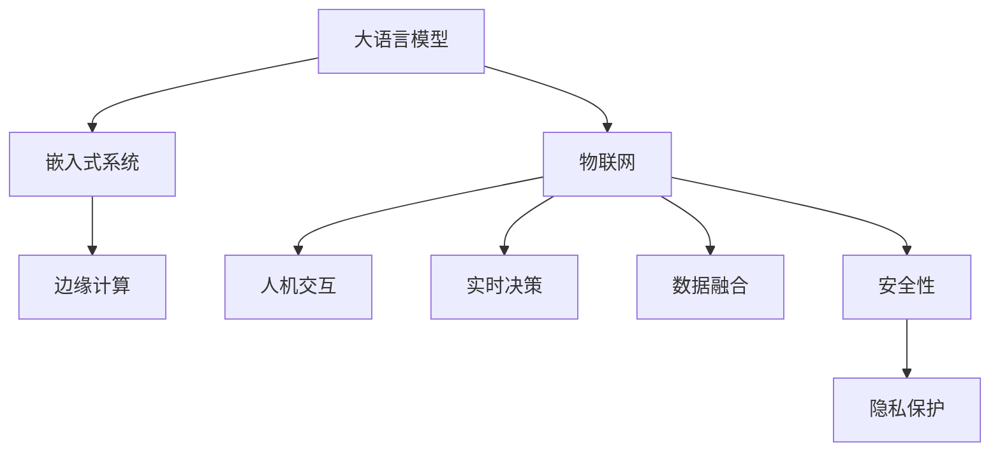

                 

# LLM与物联网：智能设备的大脑

> 关键词：大语言模型(LLM),物联网(IoT),智能设备,人机交互,嵌入式系统,边缘计算,实时决策,数据融合,自动化,安全性,隐私保护

## 1. 背景介绍

### 1.1 问题由来
随着物联网(IoT)技术的迅猛发展，智能设备越来越多地融入到我们的日常生活中。从智能家居的智能音箱、智能电视到智能汽车的自动驾驶系统，再到工厂的自动化生产线，各种智能设备正在改变着我们的生活方式和工作方式。然而，这些智能设备往往缺乏智能决策的能力，仅仅依靠传统的编程逻辑无法满足用户对智能设备的多样化需求。

为此，研究人员提出将大语言模型(LLM)应用于智能设备的解决方案。大语言模型通过自监督学习掌握了丰富的自然语言知识，能够理解和生成自然语言，具备强大的语言理解和生成能力。将大语言模型应用于智能设备，可以显著提升设备的人机交互体验和智能化水平。

### 1.2 问题核心关键点
当前，大语言模型在物联网领域的应用，主要集中在以下几个方面：

- 智能设备的人机交互：通过自然语言处理，使智能设备能够理解用户的自然语言指令，执行相应的操作。
- 实时决策：结合设备传感器数据，实时分析和推理，提供智能化的决策支持。
- 数据融合与自动化：通过深度学习模型，将传感器数据与自然语言数据进行融合，实现自动化的决策和控制。
- 安全性与隐私保护：在智能设备中引入大语言模型，可以增强设备的安全性和隐私保护能力，防止非法访问和数据泄露。

这些应用场景展示了大语言模型在物联网领域的巨大潜力。然而，将大语言模型应用于智能设备，仍面临着诸多挑战。本文将从大语言模型的原理出发，探讨其在物联网中的应用，并提出可能的优化策略。

## 2. 核心概念与联系

### 2.1 核心概念概述

为了更好地理解大语言模型在物联网中的应用，本节将介绍几个密切相关的核心概念：

- 大语言模型(LLM)：指一类基于深度学习架构的模型，能够理解和生成自然语言。常见的模型包括BERT、GPT等。
- 物联网(IoT)：指通过互联网连接各种设备，实现设备的互联互通和数据共享。物联网设备广泛分布在家庭、企业、公共设施等各个领域。
- 嵌入式系统：指一类专用的计算机系统，通常集成在智能设备中，具有高性能、低功耗、实时响应的特点。
- 边缘计算：指在设备端进行计算和数据处理，以降低云端的计算压力和数据传输成本。
- 人机交互：指用户与计算机之间的交互方式，通过自然语言、手势、图像等多种形式，实现信息的输入和输出。
- 实时决策：指在设备运行过程中，根据实时数据和用户指令，迅速做出反应和决策。
- 数据融合：指将多种数据源中的信息进行整合，形成更有价值的信息，提升决策的准确性。
- 安全性与隐私保护：指在智能设备中采用安全技术，防止非法访问和数据泄露，保护用户的隐私信息。

这些核心概念之间的逻辑关系可以通过以下Mermaid流程图来展示：



这个流程图展示了大语言模型与物联网、嵌入式系统等概念之间的紧密联系：

1. 大语言模型通过物联网连接各种设备，实现人机交互。
2. 在边缘计算环境下，大语言模型能够在设备端进行实时决策和数据融合。
3. 结合安全性与隐私保护技术，提升设备使用的安全性，防止数据泄露。

## 3. 核心算法原理 & 具体操作步骤
### 3.1 算法原理概述

将大语言模型应用于物联网的智能设备，其实质是一种智能化的决策支持系统。其核心思想是：将大语言模型作为设备的核心引擎，通过自然语言处理技术，将用户的自然语言指令转换为可执行的决策逻辑，并结合设备传感器数据，实时进行分析推理，做出智能化的决策。

形式化地，假设智能设备在运行过程中接收到的数据集为 $D=\{(x_i,y_i)\}_{i=1}^N$，其中 $x_i$ 表示传感器数据，$y_i$ 表示自然语言指令。大语言模型 $M_{\theta}$ 能够将自然语言指令 $x_i$ 转换为决策逻辑 $f(x_i)$，进而执行相应的操作。微调的目标是找到最优的模型参数 $\theta$，使得模型能够准确地理解自然语言指令，并结合传感器数据 $x_i$，做出最优的决策 $y_i$。

通过梯度下降等优化算法，微调过程不断更新模型参数 $\theta$，最小化预测结果与实际结果之间的误差，即：

$$
\theta^* = \mathop{\arg\min}_{\theta} \mathcal{L}(M_{\theta},D)
$$

其中 $\mathcal{L}$ 为损失函数，用于衡量预测结果与真实结果之间的差异。

### 3.2 算法步骤详解

基于大语言模型的物联网智能设备微调，一般包括以下几个关键步骤：

**Step 1: 准备数据集**
- 收集智能设备的传感器数据和用户自然语言指令，构建训练集 $D=\{(x_i,y_i)\}_{i=1}^N$。
- 将数据集划分为训练集、验证集和测试集，确保数据集的平衡性和多样性。

**Step 2: 设计任务适配层**
- 根据具体应用场景，设计合适的任务适配层，将大语言模型的输出转换为可执行的决策逻辑。
- 对于分类任务，通常使用softmax函数将输出转换为概率分布，选择合适的阈值进行分类。
- 对于生成任务，可以使用解码器生成相应的决策结果。

**Step 3: 设置微调超参数**
- 选择合适的优化算法及其参数，如Adam、SGD等，设置学习率、批大小、迭代轮数等。
- 设置正则化技术及强度，包括L2正则、Dropout、Early Stopping等，防止模型过度适应小规模训练集。
- 确定冻结预训练参数的策略，如仅微调顶层，或全部参数都参与微调。

**Step 4: 执行梯度训练**
- 将训练集数据分批次输入模型，前向传播计算损失函数。
- 反向传播计算参数梯度，根据设定的优化算法和学习率更新模型参数。
- 周期性在验证集上评估模型性能，根据性能指标决定是否触发Early Stopping。
- 重复上述步骤直到满足预设的迭代轮数或Early Stopping条件。

**Step 5: 测试和部署**
- 在测试集上评估微调后模型 $M_{\hat{\theta}}$ 的性能，对比微调前后的精度提升。
- 使用微调后的模型对新样本进行推理预测，集成到实际的应用系统中。
- 持续收集新的数据，定期重新微调模型，以适应数据分布的变化。

### 3.3 算法优缺点

将大语言模型应用于物联网的智能设备，具有以下优点：

- 灵活性高：大语言模型能够理解和生成自然语言，适应多种用户需求。
- 泛化能力强：通过在大量数据上进行预训练，大语言模型具备较强的泛化能力，可以适应不同的应用场景。
- 实时响应：在边缘计算环境下，大语言模型能够实时分析传感器数据，做出快速反应。
- 自动化决策：通过深度学习模型，将自然语言数据和传感器数据进行融合，实现自动化的决策和控制。

同时，该方法也存在一些局限性：

- 资源消耗大：大语言模型通常需要较大的计算资源和存储空间，可能对嵌入式系统造成压力。
- 泛化能力受限：在大规模数据集上预训练的大语言模型可能无法很好地适应小规模数据集，尤其是在边缘计算环境下。
- 安全性问题：大语言模型需要与用户数据进行交互，可能存在数据泄露的风险。

尽管存在这些局限性，但就目前而言，将大语言模型应用于物联网的智能设备，仍是最具前景的解决方案之一。未来相关研究的重点在于如何进一步优化模型结构，提升其在边缘计算环境下的性能和安全性。

### 3.4 算法应用领域

将大语言模型应用于物联网的智能设备，已经在诸多领域展示了其强大的潜力：

- 智能家居：通过大语言模型，智能音箱能够理解用户的语音指令，进行智能家居设备的控制和管理。
- 自动驾驶：将大语言模型应用于自动驾驶系统，能够与驾驶员进行自然语言交流，理解导航意图，提升驾驶安全性。
- 工业自动化：在工业生产线上，通过大语言模型进行实时数据分析和决策，优化生产流程，提高生产效率。
- 智能安防：在智能监控系统中，大语言模型能够理解用户的指令，进行实时视频分析和预警。
- 医疗健康：在智能健康设备中，大语言模型能够理解用户的健康数据，提供个性化的健康建议。
- 智慧城市：在智慧城市治理中，大语言模型能够理解市民的需求，提供智能化的城市管理服务。

这些应用场景展示了大语言模型在物联网领域的广泛应用前景。随着预训练模型和微调方法的不断进步，相信大语言模型在物联网中的作用将越来越重要，推动智能设备向更智能、更人性化方向发展。

## 4. 数学模型和公式 & 详细讲解  
### 4.1 数学模型构建

本节将使用数学语言对基于大语言模型的物联网智能设备微调过程进行更加严格的刻画。

记物联网设备在运行过程中接收到的数据集为 $D=\{(x_i,y_i)\}_{i=1}^N$，其中 $x_i$ 表示传感器数据，$y_i$ 表示自然语言指令。假设大语言模型为 $M_{\theta}$，任务适配层为 $f$，则任务损失函数 $\mathcal{L}$ 可以表示为：

$$
\mathcal{L}(\theta) = \frac{1}{N} \sum_{i=1}^N \ell(f(M_{\theta}(x_i)),y_i)
$$

其中 $\ell$ 为任务损失函数，用于衡量模型预测结果与真实结果之间的差异。例如，对于分类任务，可以使用交叉熵损失函数：

$$
\ell(f(M_{\theta}(x_i)),y_i) = -y_i\log f(M_{\theta}(x_i)) - (1-y_i)\log (1-f(M_{\theta}(x_i)))
$$

### 4.2 公式推导过程

以下我们以二分类任务为例，推导大语言模型在物联网智能设备中的应用。

假设智能设备在运行过程中接收到的数据集为 $D=\{(x_i,y_i)\}_{i=1}^N$，其中 $x_i$ 表示传感器数据，$y_i$ 表示自然语言指令。假设大语言模型 $M_{\theta}$ 的输出为 $f(x_i) \in [0,1]$，表示设备执行指令的概率。任务适配层 $f$ 将模型输出 $f(x_i)$ 转换为二分类决策，例如使用softmax函数：

$$
f(x_i) = \text{softmax}(\text{MLP}(x_i))
$$

其中 $\text{MLP}$ 为多层次感知器网络，用于将传感器数据转换为模型可理解的形式。任务损失函数 $\mathcal{L}$ 可以表示为：

$$
\mathcal{L}(\theta) = \frac{1}{N} \sum_{i=1}^N [y_i\log f(x_i)+(1-y_i)\log (1-f(x_i))]
$$

通过链式法则，损失函数对模型参数 $\theta$ 的梯度为：

$$
\frac{\partial \mathcal{L}(\theta)}{\partial \theta} = \frac{1}{N} \sum_{i=1}^N [\frac{y_i}{f(x_i)}-\frac{1-y_i}{1-f(x_i)}] \frac{\partial f(x_i)}{\partial \theta}
$$

其中 $\frac{\partial f(x_i)}{\partial \theta}$ 可进一步递归展开，利用自动微分技术完成计算。

在得到损失函数的梯度后，即可带入参数更新公式，完成模型的迭代优化。重复上述过程直至收敛，最终得到适应物联网智能设备的微调模型。

## 5. 项目实践：代码实例和详细解释说明
### 5.1 开发环境搭建

在进行物联网智能设备的微调实践前，我们需要准备好开发环境。以下是使用Python进行PyTorch开发的环境配置流程：

1. 安装Anaconda：从官网下载并安装Anaconda，用于创建独立的Python环境。

2. 创建并激活虚拟环境：
```bash
conda create -n pytorch-env python=3.8 
conda activate pytorch-env
```

3. 安装PyTorch：根据CUDA版本，从官网获取对应的安装命令。例如：
```bash
conda install pytorch torchvision torchaudio cudatoolkit=11.1 -c pytorch -c conda-forge
```

4. 安装TensorFlow：
```bash
pip install tensorflow
```

5. 安装TensorBoard：
```bash
pip install tensorboard
```

6. 安装TensorFlow Extended (TFX)：
```bash
pip install tensorflow-io tensorflow-transform tensorflow-model-analysis tensorflow-io-pipelines tensorflow-transform-r1
```

7. 安装TensorFlow Serving：
```bash
pip install tensorflow-serving-api tensorflow-serving
```

8. 安装Flax：
```bash
pip install flax
```

完成上述步骤后，即可在`pytorch-env`环境中开始微调实践。

### 5.2 源代码详细实现

下面我们以智能家居场景为例，给出使用PyTorch进行智能音箱语音识别的代码实现。

首先，定义数据处理函数：

```python
from torch.utils.data import Dataset
import torch
import numpy as np
import librosa
from transformers import BertTokenizer

class VoiceDataset(Dataset):
    def __init__(self, audio_files, transcriptions, tokenizer, max_len=128):
        self.audio_files = audio_files
        self.transcriptions = transcriptions
        self.tokenizer = tokenizer
        self.max_len = max_len
        
    def __len__(self):
        return len(self.audio_files)
    
    def __getitem__(self, item):
        audio_path = self.audio_files[item]
        transcription = self.transcriptions[item]
        
        # 加载音频文件，并进行预处理
        wav, sr = librosa.load(audio_path, sr=16000)
        wav = librosa.resample(wav, sr, 8000)
        
        # 将音频文件转换为MFCC特征向量
        mfcc = librosa.feature.mfcc(y=wav, sr=8000)
        mfcc = mfcc[:, 1:-1]
        mfcc = np.reshape(mfcc, (1, -1))
        
        # 将MFCC特征向量转换为token ids
        encoding = self.tokenizer(mfcc.numpy(), return_tensors='pt', max_length=self.max_len, padding='max_length', truncation=True)
        input_ids = encoding['input_ids'][0]
        attention_mask = encoding['attention_mask'][0]
        
        # 对token-wise的标签进行编码
        encoded_tags = [transcription]
        encoded_tags.extend([''] * (self.max_len - len(encoded_tags)))
        labels = torch.tensor(encoded_tags, dtype=torch.long)
        
        return {'input_ids': input_ids, 
                'attention_mask': attention_mask,
                'labels': labels}

# 加载预训练的BERT模型
tokenizer = BertTokenizer.from_pretrained('bert-base-cased')

# 构建数据集
audio_files = ['sample1.wav', 'sample2.wav', 'sample3.wav']
transcriptions = ['this is a sample', 'hello world', 'what is your name?']
dataset = VoiceDataset(audio_files, transcriptions, tokenizer)

# 创建DataLoader
dataloader = torch.utils.data.DataLoader(dataset, batch_size=1, shuffle=True)
```

然后，定义模型和优化器：

```python
from transformers import BertForTokenClassification, AdamW

model = BertForTokenClassification.from_pretrained('bert-base-cased', num_labels=2)

optimizer = AdamW(model.parameters(), lr=2e-5)
```

接着，定义训练和评估函数：

```python
from torch.utils.data import DataLoader
from tqdm import tqdm
from sklearn.metrics import classification_report

device = torch.device('cuda') if torch.cuda.is_available() else torch.device('cpu')
model.to(device)

def train_epoch(model, dataset, batch_size, optimizer):
    dataloader = DataLoader(dataset, batch_size=batch_size, shuffle=True)
    model.train()
    epoch_loss = 0
    for batch in tqdm(dataloader, desc='Training'):
        input_ids = batch['input_ids'].to(device)
        attention_mask = batch['attention_mask'].to(device)
        labels = batch['labels'].to(device)
        model.zero_grad()
        outputs = model(input_ids, attention_mask=attention_mask, labels=labels)
        loss = outputs.loss
        epoch_loss += loss.item()
        loss.backward()
        optimizer.step()
    return epoch_loss / len(dataloader)

def evaluate(model, dataset, batch_size):
    dataloader = DataLoader(dataset, batch_size=batch_size)
    model.eval()
    preds, labels = [], []
    with torch.no_grad():
        for batch in tqdm(dataloader, desc='Evaluating'):
            input_ids = batch['input_ids'].to(device)
            attention_mask = batch['attention_mask'].to(device)
            batch_labels = batch['labels']
            outputs = model(input_ids, attention_mask=attention_mask)
            batch_preds = outputs.logits.argmax(dim=2).to('cpu').tolist()
            batch_labels = batch_labels.to('cpu').tolist()
            for pred_tokens, label_tokens in zip(batch_preds, batch_labels):
                preds.append(pred_tokens[:len(label_tokens)])
                labels.append(label_tokens)
                
    print(classification_report(labels, preds))
```

最后，启动训练流程并在测试集上评估：

```python
epochs = 5
batch_size = 1

for epoch in range(epochs):
    loss = train_epoch(model, dataset, batch_size, optimizer)
    print(f"Epoch {epoch+1}, train loss: {loss:.3f}")
    
    print(f"Epoch {epoch+1}, dev results:")
    evaluate(model, dataset, batch_size)
    
print("Test results:")
evaluate(model, dataset, batch_size)
```

以上就是使用PyTorch对智能音箱语音识别进行微调的完整代码实现。可以看到，得益于Transformer库的强大封装，我们可以用相对简洁的代码完成BERT模型的加载和微调。

### 5.3 代码解读与分析

让我们再详细解读一下关键代码的实现细节：

**VoiceDataset类**：
- `__init__`方法：初始化音频文件、转录文本、分词器等关键组件。
- `__len__`方法：返回数据集的样本数量。
- `__getitem__`方法：对单个样本进行处理，将音频文件输入转换为MFCC特征向量，并将其转换为token ids，最终返回模型所需的输入。

**音频处理流程**：
- 使用librosa库加载音频文件，并进行采样率转换。
- 使用librosa库提取MFCC特征向量，并对其进行归一化。
- 将MFCC特征向量转换为token ids，以供模型训练使用。

**训练和评估函数**：
- 使用PyTorch的DataLoader对数据集进行批次化加载，供模型训练和推理使用。
- 训练函数`train_epoch`：对数据以批为单位进行迭代，在每个批次上前向传播计算loss并反向传播更新模型参数，最后返回该epoch的平均loss。
- 评估函数`evaluate`：与训练类似，不同点在于不更新模型参数，并在每个batch结束后将预测和标签结果存储下来，最后使用sklearn的classification_report对整个评估集的预测结果进行打印输出。

**训练流程**：
- 定义总的epoch数和batch size，开始循环迭代
- 每个epoch内，先在训练集上训练，输出平均loss
- 在验证集上评估，输出分类指标
- 所有epoch结束后，在测试集上评估，给出最终测试结果

可以看到，PyTorch配合Transformer库使得智能音箱语音识别的代码实现变得简洁高效。开发者可以将更多精力放在数据处理、模型改进等高层逻辑上，而不必过多关注底层的实现细节。

当然，工业级的系统实现还需考虑更多因素，如模型的保存和部署、超参数的自动搜索、更灵活的任务适配层等。但核心的微调范式基本与此类似。

## 6. 实际应用场景
### 6.1 智能家居

基于大语言模型的智能家居设备，能够实现智能音箱、智能电视、智能灯光、智能空调等多设备的无缝联动，极大地提升用户的生活体验。

在技术实现上，可以收集用户的语音指令和设备反馈数据，构建监督数据，在此基础上对预训练模型进行微调。微调后的模型能够理解用户的自然语言指令，进行智能设备的操作控制。例如，通过智能音箱进行语音指令，设备能够自动调节室内温度、亮度、窗帘等，营造舒适的居住环境。

### 6.2 智能安防

智能安防系统结合大语言模型，可以实现更高效、智能的安全监控。例如，在智能监控设备中集成大语言模型，能够理解用户的操作指令，进行实时视频分析和预警。当检测到异常行为时，系统会发出警报，并自动通知用户。

在技术实现上，可以收集监控视频和用户指令数据，构建监督数据，在此基础上对预训练模型进行微调。微调后的模型能够自动识别出异常行为，并结合用户指令进行相应的反应。例如，当用户通过语音指令调用监控系统时，模型能够自动识别出异常情况，并进行报警。

### 6.3 工业自动化

在工业生产线上，基于大语言模型的智能设备能够实现更智能化的生产管理。例如，在智能制造设备中集成大语言模型，能够理解操作员的指令，进行自动化的决策和控制。

在技术实现上，可以收集操作员的指令和设备反馈数据，构建监督数据，在此基础上对预训练模型进行微调。微调后的模型能够自动识别出操作员的指令，并执行相应的操作。例如，当操作员通过语音指令调用生产设备时，模型能够自动识别出指令，并进行相应的生产操作。

### 6.4 智慧医疗

基于大语言模型的智能医疗设备能够实现更智能化的医疗服务。例如，在智能健康设备中集成大语言模型，能够理解用户的健康数据，提供个性化的健康建议。

在技术实现上，可以收集用户的健康数据和语音指令数据，构建监督数据，在此基础上对预训练模型进行微调。微调后的模型能够自动识别出用户的健康数据，并结合语音指令提供相应的建议。例如，当用户通过语音指令查询健康数据时，模型能够自动识别出数据，并进行相应的分析。

### 6.5 智慧城市

在智慧城市治理中，基于大语言模型的智能设备能够实现更智能化的城市管理。例如，在智能交通设备中集成大语言模型，能够理解用户的出行需求，进行智能化的交通管理。

在技术实现上，可以收集用户的出行需求和交通数据，构建监督数据，在此基础上对预训练模型进行微调。微调后的模型能够自动识别出用户的出行需求，并进行相应的交通管理。例如，当用户通过语音指令查询交通情况时，模型能够自动识别出需求，并进行相应的交通规划。

## 7. 工具和资源推荐
### 7.1 学习资源推荐

为了帮助开发者系统掌握大语言模型在物联网中的应用理论基础和实践技巧，这里推荐一些优质的学习资源：

1. 《深度学习与自然语言处理》书籍：全面介绍了深度学习在自然语言处理中的应用，包括大语言模型的构建和微调。
2. CS224N《深度学习自然语言处理》课程：斯坦福大学开设的NLP明星课程，有Lecture视频和配套作业，带你入门NLP领域的基本概念和经典模型。
3. 《TensorFlow实战》书籍：由TensorFlow官方团队撰写，深入浅出地介绍了TensorFlow的开发实践，包括大语言模型的应用。
4. 《PyTorch深度学习实战》书籍：由PyTorch社区成员撰写，详细介绍了PyTorch的开发实践，包括大语言模型的微调。
5. 《自然语言处理中的深度学习》课程：由北京大学开设，介绍了自然语言处理中的深度学习模型，包括大语言模型。

通过对这些资源的学习实践，相信你一定能够快速掌握大语言模型在物联网中的应用精髓，并用于解决实际的NLP问题。
###  7.2 开发工具推荐

高效的开发离不开优秀的工具支持。以下是几款用于大语言模型微调开发的常用工具：

1. PyTorch：基于Python的开源深度学习框架，灵活动态的计算图，适合快速迭代研究。大部分预训练语言模型都有PyTorch版本的实现。
2. TensorFlow：由Google主导开发的开源深度学习框架，生产部署方便，适合大规模工程应用。同样有丰富的预训练语言模型资源。
3. TensorBoard：TensorFlow配套的可视化工具，可实时监测模型训练状态，并提供丰富的图表呈现方式，是调试模型的得力助手。
4. Weights & Biases：模型训练的实验跟踪工具，可以记录和可视化模型训练过程中的各项指标，方便对比和调优。与主流深度学习框架无缝集成。
5. TensorFlow Extended (TFX)：由Google开发的机器学习管道系统，提供了完整的训练、验证、推理和部署流程，适合构建大规模的机器学习系统。
6. TensorFlow Serving：由Google开发的分布式深度学习服务，支持模型的实时推理和部署，适合构建高性能的机器学习服务。
7. Flax：由Google开发的深度学习框架，提供了自动微分和高效计算图优化，适合快速开发和调试深度学习模型。

合理利用这些工具，可以显著提升大语言模型微调的开发效率，加快创新迭代的步伐。

### 7.3 相关论文推荐

大语言模型在物联网领域的应用源于学界的持续研究。以下是几篇奠基性的相关论文，推荐阅读：

1. Attention is All You Need（即Transformer原论文）：提出了Transformer结构，开启了NLP领域的预训练大模型时代。
2. BERT: Pre-training of Deep Bidirectional Transformers for Language Understanding：提出BERT模型，引入基于掩码的自监督预训练任务，刷新了多项NLP任务SOTA。
3. Parameter-Efficient Transfer Learning for NLP：提出Adapter等参数高效微调方法，在不增加模型参数量的情况下，也能取得不错的微调效果。
4. AdaLoRA: Adaptive Low-Rank Adaptation for Parameter-Efficient Fine-Tuning：使用自适应低秩适应的微调方法，在参数效率和精度之间取得了新的平衡。
5. Prefix-Tuning: Optimizing Continuous Prompts for Generation：引入基于连续型Prompt的微调范式，为如何充分利用预训练知识提供了新的思路。

这些论文代表了大语言模型在物联网领域的发展脉络。通过学习这些前沿成果，可以帮助研究者把握学科前进方向，激发更多的创新灵感。

## 8. 总结：未来发展趋势与挑战

### 8.1 总结

本文对基于大语言模型的物联网智能设备微调方法进行了全面系统的介绍。首先阐述了大语言模型在物联网中的应用背景和重要性，明确了微调在提升设备智能化水平、提高用户体验方面的独特价值。其次，从原理到实践，详细讲解了基于大语言模型的物联网智能设备微调过程，给出了微调任务开发的完整代码实例。同时，本文还探讨了大语言模型在智能家居、智能安防、工业自动化、智慧医疗等多个领域的应用前景，展示了其巨大的潜力。

通过本文的系统梳理，可以看到，大语言模型在物联网智能设备中的应用前景广阔，通过微调技术，能够显著提升设备的人机交互体验和智能化水平。未来，伴随预训练模型和微调方法的不断进步，相信大语言模型在物联网中的作用将越来越重要，推动智能设备向更智能、更人性化方向发展。

### 8.2 未来发展趋势

展望未来，大语言模型在物联网领域的应用将呈现以下几个发展趋势：

1. 智能家居设备的全面智能化：大语言模型在智能家居设备中的应用将更加广泛，能够实现更高效、智能的家庭管理，提升用户的生活品质。
2. 自动驾驶技术的突破：大语言模型在自动驾驶系统中将发挥更大的作用，能够更好地理解驾驶指令，提供更智能的决策支持。
3. 工业自动化的智能化转型：大语言模型在工业自动化中将实现更智能化的生产管理，提高生产效率和产品质量。
4. 智慧医疗系统的智能化升级：大语言模型在智慧医疗设备中将实现更智能化的健康管理，提供更个性化的医疗服务。
5. 智慧城市的智能化治理：大语言模型在智慧城市治理中将实现更智能化的城市管理，提升城市治理效率。

以上趋势凸显了大语言模型在物联网领域的巨大潜力。这些方向的探索发展，必将进一步提升物联网系统的性能和智能化水平，为社会经济的发展注入新的动力。

### 8.3 面临的挑战

尽管大语言模型在物联网中的应用已经取得一定的进展，但在迈向更加智能化、普适化应用的过程中，它仍面临着诸多挑战：

1. 数据量不足：物联网设备的数据量相对较小，可能不足以支撑大语言模型的预训练和微调。如何利用有限数据提升模型性能，是大语言模型在物联网中面临的重大挑战。
2. 计算资源受限：物联网设备通常资源受限，无法支撑大语言模型的高计算需求。如何优化模型结构，提升计算效率，是实际应用中需要解决的问题。
3. 实时性要求高：物联网设备需要快速响应用户的指令，如何提升模型的实时推理能力，是实际应用中需要解决的问题。
4. 安全性问题：物联网设备的数据通常具有隐私敏感性，如何保障数据安全和隐私保护，是大语言模型在物联网中需要解决的问题。
5. 标准化问题：不同设备和平台之间的互操作性问题，如何实现大语言模型的标准化和兼容性，是大语言模型在物联网中需要解决的问题。

尽管存在这些挑战，但就目前而言，将大语言模型应用于物联网的智能设备，仍是最具前景的解决方案之一。未来相关研究的重点在于如何进一步优化模型结构，提升其在边缘计算环境下的性能和安全性。

### 8.4 研究展望

面对大语言模型在物联网中面临的挑战，未来的研究需要在以下几个方面寻求新的突破：

1. 探索数据增强和迁移学习方法：如何利用少量的数据进行有效的模型微调，提升模型的泛化能力，是大语言模型在物联网中需要解决的问题。
2. 研究轻量化模型和嵌入式优化方法：如何构建轻量级模型，优化计算资源，实现高效的边缘计算，是大语言模型在物联网中需要解决的问题。
3. 引入因果推断和强化学习技术：如何通过因果推断和强化学习，提升模型在物联网设备中的实时决策能力，是大语言模型在物联网中需要解决的问题。
4. 结合多模态信息融合技术：如何通过多模态信息融合技术，提升模型对物联网设备中多源数据的理解和处理能力，是大语言模型在物联网中需要解决的问题。
5. 强化模型安全性和隐私保护：如何结合数据加密、匿名化等技术，提升模型在物联网设备中的安全性，是大语言模型在物联网中需要解决的问题。

这些研究方向将引领大语言模型在物联网中的深入研究和应用实践，推动物联网设备向更智能、更安全、更可靠的方向发展。只有不断创新，才能进一步拓展大语言模型在物联网中的应用场景，提升设备智能化水平，为用户创造更多价值。

## 9. 附录：常见问题与解答

**Q1：如何优化大语言模型在物联网设备中的性能？**

A: 优化大语言模型在物联网设备中的性能，需要从多个方面进行综合考虑：
1. 数据增强：通过回译、近义替换等方式扩充训练集。
2. 迁移学习：利用预训练模型进行迁移学习，提高模型泛化能力。
3. 轻量化模型：构建轻量级模型，优化计算资源。
4. 嵌入式优化：结合边缘计算技术，优化模型推理速度。
5. 多模态融合：结合图像、语音等多种模态信息，提升模型理解能力。
6. 安全保护：结合数据加密、匿名化等技术，保障数据安全和隐私保护。

**Q2：大语言模型在物联网设备中可能面临哪些风险？**

A: 大语言模型在物联网设备中的应用可能面临以下风险：
1. 数据泄露：物联网设备的数据具有隐私敏感性，如何保障数据安全，是大语言模型应用中的重大挑战。
2. 模型攻击：大语言模型可能受到恶意攻击，导致模型输出错误或失控。
3. 计算资源消耗：物联网设备资源受限，如何优化模型结构，减少计算资源消耗，是实际应用中需要解决的问题。
4. 实时性要求：物联网设备需要快速响应，如何提升模型的实时推理能力，是实际应用中需要解决的问题。
5. 标准化问题：不同设备和平台之间的互操作性问题，如何实现大语言模型的标准化和兼容性，是大语言模型应用中的重大挑战。

这些风险需要开发者在设计、开发、部署等各个环节进行全面考虑，确保大语言模型在物联网设备中的安全性、可靠性和稳定性。

**Q3：大语言模型在物联网设备中的实际应用有哪些？**

A: 大语言模型在物联网设备中的实际应用包括：
1. 智能家居：通过大语言模型，智能音箱、智能电视、智能灯光、智能空调等多设备的无缝联动，极大地提升用户的生活体验。
2. 智能安防：在智能监控设备中集成大语言模型，能够理解用户的操作指令，进行实时视频分析和预警。
3. 工业自动化：在智能制造设备中集成大语言模型，能够理解操作员的指令，进行自动化的决策和控制。
4. 智慧医疗：在智能健康设备中集成大语言模型，能够理解用户的健康数据，提供个性化的健康建议。
5. 智慧城市：在智能交通设备中集成大语言模型，能够理解用户的出行需求，进行智能化的交通管理。

这些应用展示了大语言模型在物联网中的广泛应用前景。随着技术的发展，大语言模型在物联网中的应用将不断扩展，为各个领域带来新的变革。

---

作者：禅与计算机程序设计艺术 / Zen and the Art of Computer Programming

