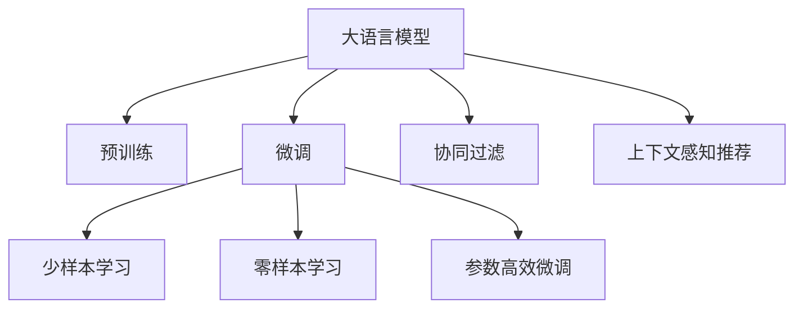

                 

# LLM在个性化推荐系统中的应用

> 关键词：大语言模型,推荐系统,用户画像,协同过滤,上下文感知,推荐逻辑

## 1. 背景介绍

### 1.1 问题由来

个性化推荐系统已经成为各大电商、社交媒体、视频平台的核心功能之一。通过分析用户的历史行为数据，推荐系统能够预测用户对未知物品的偏好，提升用户体验和平台转化率。然而，传统的推荐系统往往依赖于稀疏的明文反馈数据，难以捕捉用户行为背后的复杂语义信息。

随着深度学习技术的快速发展，基于大语言模型(Large Language Model, LLM)的推荐系统应运而生。通过在LLM上进行微调，将用户的输入文本转化为向量表示，能够捕获用户兴趣和上下文语义，从而显著提升推荐系统的准确性和用户体验。

### 1.2 问题核心关键点

目前，LLM在推荐系统中的应用主要围绕以下几个关键点展开：

1. **用户画像构建**：通过微调LLM，将用户的输入文本转化为向量表示，生成用户画像，捕捉用户兴趣和行为模式。
2. **上下文感知推荐**：利用微调后的LLM，对用户输入的文本进行上下文理解，生成更加精准和多样化的推荐结果。
3. **推荐逻辑融合**：将微调LLM与传统的协同过滤、内容推荐等算法结合，构建多模态融合的推荐逻辑。
4. **少样本学习与零样本学习**：在用户输入数据不足的情况下，通过提示学习等技术，实现少样本或零样本下的推荐效果。
5. **参数高效微调**：在固定大部分预训练参数的情况下，通过微调顶层或部分参数，实现高效且精准的推荐模型。

本文将围绕这些核心关键点，对LLM在推荐系统中的应用进行详细探讨，力求为推荐系统的设计和优化提供有力支持。

## 2. 核心概念与联系

### 2.1 核心概念概述

为更好地理解LLM在推荐系统中的应用，本节将介绍几个密切相关的核心概念：

- **大语言模型(LLM)**：以自回归(如GPT)或自编码(如BERT)模型为代表的大规模预训练语言模型。通过在大规模无标签文本语料上进行预训练，学习通用的语言表示，具备强大的语言理解和生成能力。

- **个性化推荐系统**：通过分析用户的历史行为数据，预测用户对未知物品的偏好，并实时推荐给用户。个性化推荐系统能够显著提升用户体验和平台转化率。

- **协同过滤**：一种基于用户行为数据的推荐算法，通过分析用户-物品矩阵，找到与目标用户相似的其他用户，推荐他们喜欢的物品。

- **上下文感知推荐**：通过考虑用户输入的上下文信息，提升推荐的个性化和多样化。

- **少样本学习**：在用户输入数据不足的情况下，通过提示学习等技术，实现少样本或零样本下的推荐效果。

- **零样本学习**：在用户未提供任何历史数据的情况下，仅凭任务描述就能够执行推荐任务。

- **参数高效微调**：在固定大部分预训练参数的情况下，只更新极少量的任务相关参数，以提高微调效率，避免过拟合。

这些核心概念之间的逻辑关系可以通过以下Mermaid流程图来展示：



这个流程图展示了大语言模型的核心概念及其之间的关系：

1. 大语言模型通过预训练获得基础能力。
2. 微调使得通用大模型更好地适应特定任务。
3. 协同过滤和上下文感知推荐利用微调结果进行推荐。
4. 少样本和零样本学习依赖于微调的通用性。
5. 参数高效微调在保持模型鲁棒性的同时，提高推荐效率。

这些概念共同构成了LLM在推荐系统中的应用框架，使其能够在各种推荐场景下发挥强大的语言理解和生成能力。通过理解这些核心概念，我们可以更好地把握LLM的工作原理和优化方向。

## 3. 核心算法原理 & 具体操作步骤
### 3.1 算法原理概述

基于LLM的推荐系统，本质上是一个有监督的细粒度迁移学习过程。其核心思想是：将预训练的LLM视作一个强大的"特征提取器"，通过在推荐系统的标注数据上进行有监督的微调，使得模型输出能够匹配推荐任务的目标，从而获得针对特定推荐任务优化的模型。

形式化地，假设预训练模型为 $M_{\theta}$，其中 $\theta$ 为预训练得到的模型参数。给定推荐任务 $T$ 的标注数据集 $D=\{(x_i,y_i)\}_{i=1}^N, x_i \in \mathcal{X}, y_i \in \mathcal{Y}$，推荐任务的标注数据集 $D$ 中的 $y_i$ 可以是一个物品ID或物品列表。微调的目标是找到新的模型参数 $\hat{\theta}$，使得：

$$
\hat{\theta}=\mathop{\arg\min}_{\theta} \mathcal{L}(M_{\theta},D)
$$

其中 $\mathcal{L}$ 为针对任务 $T$ 设计的损失函数，用于衡量模型预测输出与真实标签之间的差异。常见的损失函数包括交叉熵损失、均方误差损失等。

通过梯度下降等优化算法，微调过程不断更新模型参数 $\theta$，最小化损失函数 $\mathcal{L}$，使得模型输出逼近真实标签。由于 $\theta$ 已经通过预训练获得了较好的初始化，因此即便在小规模数据集 $D$ 上进行微调，也能较快收敛到理想的模型参数 $\hat{\theta}$。

### 3.2 算法步骤详解

基于监督学习的大语言模型推荐，一般包括以下几个关键步骤：

**Step 1: 准备预训练模型和数据集**
- 选择合适的预训练语言模型 $M_{\theta}$ 作为初始化参数，如 BERT、GPT等。
- 准备推荐任务 $T$ 的标注数据集 $D$，划分为训练集、验证集和测试集。一般要求标注数据与预训练数据的分布不要差异过大。

**Step 2: 添加推荐适配层**
- 根据推荐任务类型，在预训练模型顶层设计合适的输出层和损失函数。
- 对于物品推荐任务，通常在顶层添加线性分类器和交叉熵损失函数。
- 对于列表推荐任务，通常使用多目标损失函数，如BCE With Logits损失。

**Step 3: 设置微调超参数**
- 选择合适的优化算法及其参数，如 AdamW、SGD 等，设置学习率、批大小、迭代轮数等。
- 设置正则化技术及强度，包括权重衰减、Dropout、Early Stopping等。
- 确定冻结预训练参数的策略，如仅微调顶层，或全部参数都参与微调。

**Step 4: 执行梯度训练**
- 将训练集数据分批次输入模型，前向传播计算损失函数。
- 反向传播计算参数梯度，根据设定的优化算法和学习率更新模型参数。
- 周期性在验证集上评估模型性能，根据性能指标决定是否触发 Early Stopping。
- 重复上述步骤直到满足预设的迭代轮数或 Early Stopping 条件。

**Step 5: 测试和部署**
- 在测试集上评估微调后模型 $M_{\hat{\theta}}$ 的性能，对比微调前后的推荐精度提升。
- 使用微调后的模型对新样本进行推理预测，集成到实际的应用系统中。
- 持续收集新的数据，定期重新微调模型，以适应数据分布的变化。

以上是基于监督学习微调LLM进行推荐的一般流程。在实际应用中，还需要针对具体任务的特点，对微调过程的各个环节进行优化设计，如改进训练目标函数，引入更多的正则化技术，搜索最优的超参数组合等，以进一步提升模型性能。

### 3.3 算法优缺点

基于监督学习的大语言模型推荐方法具有以下优点：
1. 简单高效。只需准备少量标注数据，即可对预训练模型进行快速适配，获得较大的性能提升。
2. 通用适用。适用于各种推荐任务，包括物品推荐、列表推荐、个性化搜索等，设计简单的任务适配层即可实现微调。
3. 参数高效。利用参数高效微调技术，在固定大部分预训练权重不变的情况下，仍可取得不错的推荐效果。
4. 效果显著。在学术界和工业界的诸多推荐任务上，基于微调的方法已经刷新了多项SOTA。

同时，该方法也存在一定的局限性：
1. 依赖标注数据。推荐的效果很大程度上取决于标注数据的质量和数量，获取高质量标注数据的成本较高。
2. 迁移能力有限。当目标任务与预训练数据的分布差异较大时，微调的性能提升有限。
3. 负面效果传递。预训练模型的固有偏见、有害信息等，可能通过微调传递到下游任务，造成负面影响。
4. 可解释性不足。微调模型的决策过程通常缺乏可解释性，难以对其推理逻辑进行分析和调试。

尽管存在这些局限性，但就目前而言，基于监督学习的微调方法仍是大语言模型推荐的主流范式。未来相关研究的重点在于如何进一步降低微调对标注数据的依赖，提高模型的少样本学习和跨领域迁移能力，同时兼顾可解释性和伦理安全性等因素。

### 3.4 算法应用领域

基于LLM的推荐系统在电商、社交媒体、视频平台等多个领域已经得到了广泛的应用，覆盖了推荐系统的主要场景：

- **电商推荐系统**：推荐用户可能感兴趣的商品。将用户浏览历史、购买记录、评价反馈等作为微调数据，训练模型学习用户兴趣模式。
- **视频推荐系统**：推荐用户可能感兴趣的视频。将用户观看历史、点赞记录、评论反馈等作为微调数据，训练模型学习视频内容特征。
- **社交推荐系统**：推荐用户可能感兴趣的朋友或内容。将用户互动数据、兴趣标签、社交关系等作为微调数据，训练模型学习用户关系网络。
- **个性化搜索系统**：推荐用户可能感兴趣的结果。将用户查询输入、浏览记录、点击行为等作为微调数据，训练模型学习查询意图。

除了这些经典任务外，LLM在推荐系统的创新应用中还包括：

- **创意内容推荐**：推荐用户可能感兴趣的内容创意。将用户对现有内容的评价、反馈、互动等作为微调数据，训练模型学习创意特征。
- **情境推荐系统**：推荐用户可能感兴趣的场景或情境。将用户所在地理位置、时间、天气等情境信息作为微调数据，训练模型学习情境特征。
- **智能客服推荐系统**：推荐用户可能感兴趣的服务或商品。将用户与智能客服的对话记录作为微调数据，训练模型学习服务意图。

## 4. 数学模型和公式 & 详细讲解  
### 4.1 数学模型构建

本节将使用数学语言对基于监督学习的大语言模型推荐过程进行更加严格的刻画。

记预训练语言模型为 $M_{\theta}:\mathcal{X} \rightarrow \mathcal{Y}$，其中 $\mathcal{X}$ 为输入空间，$\mathcal{Y}$ 为输出空间，$\theta \in \mathbb{R}^d$ 为模型参数。假设推荐任务 $T$ 的训练集为 $D=\{(x_i,y_i)\}_{i=1}^N, x_i \in \mathcal{X}, y_i \in \mathcal{Y}$。

定义模型 $M_{\theta}$ 在数据样本 $(x,y)$ 上的损失函数为 $\ell(M_{\theta}(x),y)$，则在数据集 $D$ 上的经验风险为：

$$
\mathcal{L}(\theta) = \frac{1}{N} \sum_{i=1}^N \ell(M_{\theta}(x_i),y_i)
$$

微调的优化目标是最小化经验风险，即找到最优参数：

$$
\theta^* = \mathop{\arg\min}_{\theta} \mathcal{L}(\theta)
$$

在实践中，我们通常使用基于梯度的优化算法（如SGD、Adam等）来近似求解上述最优化问题。设 $\eta$ 为学习率，$\lambda$ 为正则化系数，则参数的更新公式为：

$$
\theta \leftarrow \theta - \eta \nabla_{\theta}\mathcal{L}(\theta) - \eta\lambda\theta
$$

其中 $\nabla_{\theta}\mathcal{L}(\theta)$ 为损失函数对参数 $\theta$ 的梯度，可通过反向传播算法高效计算。

### 4.2 公式推导过程

以下我们以物品推荐任务为例，推导交叉熵损失函数及其梯度的计算公式。

假设模型 $M_{\theta}$ 在输入 $x$ 上的输出为 $\hat{y}=M_{\theta}(x) \in [0,1]$，表示物品推荐结果的概率。真实标签 $y \in \{1,0\}$。则二分类交叉熵损失函数定义为：

$$
\ell(M_{\theta}(x),y) = -[y\log \hat{y} + (1-y)\log (1-\hat{y})]
$$

将其代入经验风险公式，得：

$$
\mathcal{L}(\theta) = -\frac{1}{N}\sum_{i=1}^N [y_i\log M_{\theta}(x_i)+(1-y_i)\log(1-M_{\theta}(x_i))]
$$

根据链式法则，损失函数对参数 $\theta_k$ 的梯度为：

$$
\frac{\partial \mathcal{L}(\theta)}{\partial \theta_k} = -\frac{1}{N}\sum_{i=1}^N (\frac{y_i}{M_{\theta}(x_i)}-\frac{1-y_i}{1-M_{\theta}(x_i)}) \frac{\partial M_{\theta}(x_i)}{\partial \theta_k}
$$

其中 $\frac{\partial M_{\theta}(x_i)}{\partial \theta_k}$ 可进一步递归展开，利用自动微分技术完成计算。

在得到损失函数的梯度后，即可带入参数更新公式，完成模型的迭代优化。重复上述过程直至收敛，最终得到适应推荐任务的最优模型参数 $\theta^*$。

## 5. 项目实践：代码实例和详细解释说明
### 5.1 开发环境搭建

在进行推荐系统开发前，我们需要准备好开发环境。以下是使用Python进行PyTorch开发的环境配置流程：

1. 安装Anaconda：从官网下载并安装Anaconda，用于创建独立的Python环境。

2. 创建并激活虚拟环境：
```bash
conda create -n pytorch-env python=3.8 
conda activate pytorch-env
```

3. 安装PyTorch：根据CUDA版本，从官网获取对应的安装命令。例如：
```bash
conda install pytorch torchvision torchaudio cudatoolkit=11.1 -c pytorch -c conda-forge
```

4. 安装Transformers库：
```bash
pip install transformers
```

5. 安装各类工具包：
```bash
pip install numpy pandas scikit-learn matplotlib tqdm jupyter notebook ipython
```

完成上述步骤后，即可在`pytorch-env`环境中开始推荐系统开发。

### 5.2 源代码详细实现

这里我们以物品推荐任务为例，给出使用Transformers库对BERT模型进行物品推荐任务的PyTorch代码实现。

首先，定义推荐任务的数据处理函数：

```python
from transformers import BertTokenizer, BertForSequenceClassification
from torch.utils.data import Dataset
import torch

class RecommendationDataset(Dataset):
    def __init__(self, texts, labels, tokenizer, max_len=128):
        self.texts = texts
        self.labels = labels
        self.tokenizer = tokenizer
        self.max_len = max_len
        
    def __len__(self):
        return len(self.texts)
    
    def __getitem__(self, item):
        text = self.texts[item]
        label = self.labels[item]
        
        encoding = self.tokenizer(text, return_tensors='pt', max_length=self.max_len, padding='max_length', truncation=True)
        input_ids = encoding['input_ids'][0]
        attention_mask = encoding['attention_mask'][0]
        
        # 对标签进行编码
        encoded_labels = [1 if label == '1' else 0 for label in labels] 
        encoded_labels.extend([0]*(self.max_len - len(encoded_labels)))
        labels = torch.tensor(encoded_labels, dtype=torch.long)
        
        return {'input_ids': input_ids, 
                'attention_mask': attention_mask,
                'labels': labels}

# 标签与id的映射
label2id = {'1': 1, '0': 0}
id2label = {v: k for k, v in label2id.items()}

# 创建dataset
tokenizer = BertTokenizer.from_pretrained('bert-base-cased')

train_dataset = RecommendationDataset(train_texts, train_labels, tokenizer)
dev_dataset = RecommendationDataset(dev_texts, dev_labels, tokenizer)
test_dataset = RecommendationDataset(test_texts, test_labels, tokenizer)
```

然后，定义模型和优化器：

```python
from transformers import AdamW

model = BertForSequenceClassification.from_pretrained('bert-base-cased', num_labels=2)

optimizer = AdamW(model.parameters(), lr=2e-5)
```

接着，定义训练和评估函数：

```python
from torch.utils.data import DataLoader
from tqdm import tqdm
from sklearn.metrics import classification_report

device = torch.device('cuda') if torch.cuda.is_available() else torch.device('cpu')
model.to(device)

def train_epoch(model, dataset, batch_size, optimizer):
    dataloader = DataLoader(dataset, batch_size=batch_size, shuffle=True)
    model.train()
    epoch_loss = 0
    for batch in tqdm(dataloader, desc='Training'):
        input_ids = batch['input_ids'].to(device)
        attention_mask = batch['attention_mask'].to(device)
        labels = batch['labels'].to(device)
        model.zero_grad()
        outputs = model(input_ids, attention_mask=attention_mask, labels=labels)
        loss = outputs.loss
        epoch_loss += loss.item()
        loss.backward()
        optimizer.step()
    return epoch_loss / len(dataloader)

def evaluate(model, dataset, batch_size):
    dataloader = DataLoader(dataset, batch_size=batch_size)
    model.eval()
    preds, labels = [], []
    with torch.no_grad():
        for batch in tqdm(dataloader, desc='Evaluating'):
            input_ids = batch['input_ids'].to(device)
            attention_mask = batch['attention_mask'].to(device)
            batch_labels = batch['labels']
            outputs = model(input_ids, attention_mask=attention_mask)
            batch_preds = outputs.logits.argmax(dim=2).to('cpu').tolist()
            batch_labels = batch_labels.to('cpu').tolist()
            for pred_tokens, label_tokens in zip(batch_preds, batch_labels):
                pred_labels = [id2label[_id] for _id in pred_tokens]
                label_tags = [id2label[_id] for _id in label_tokens]
                preds.append(pred_labels[:len(label_tags)])
                labels.append(label_tags)
                
    print(classification_report(labels, preds))
```

最后，启动训练流程并在测试集上评估：

```python
epochs = 5
batch_size = 16

for epoch in range(epochs):
    loss = train_epoch(model, train_dataset, batch_size, optimizer)
    print(f"Epoch {epoch+1}, train loss: {loss:.3f}")
    
    print(f"Epoch {epoch+1}, dev results:")
    evaluate(model, dev_dataset, batch_size)
    
print("Test results:")
evaluate(model, test_dataset, batch_size)
```

以上就是使用PyTorch对BERT进行物品推荐任务微调的完整代码实现。可以看到，得益于Transformers库的强大封装，我们可以用相对简洁的代码完成BERT模型的加载和微调。

### 5.3 代码解读与分析

让我们再详细解读一下关键代码的实现细节：

**RecommendationDataset类**：
- `__init__`方法：初始化文本、标签、分词器等关键组件。
- `__len__`方法：返回数据集的样本数量。
- `__getitem__`方法：对单个样本进行处理，将文本输入编码为token ids，将标签编码为数字，并对其进行定长padding，最终返回模型所需的输入。

**label2id和id2label字典**：
- 定义了标签与数字id之间的映射关系，用于将标签转化为模型可接受的格式。

**训练和评估函数**：
- 使用PyTorch的DataLoader对数据集进行批次化加载，供模型训练和推理使用。
- 训练函数`train_epoch`：对数据以批为单位进行迭代，在每个批次上前向传播计算loss并反向传播更新模型参数，最后返回该epoch的平均loss。
- 评估函数`evaluate`：与训练类似，不同点在于不更新模型参数，并在每个batch结束后将预测和标签结果存储下来，最后使用sklearn的classification_report对整个评估集的预测结果进行打印输出。

**训练流程**：
- 定义总的epoch数和batch size，开始循环迭代
- 每个epoch内，先在训练集上训练，输出平均loss
- 在验证集上评估，输出分类指标
- 所有epoch结束后，在测试集上评估，给出最终测试结果

可以看到，PyTorch配合Transformers库使得BERT微调的代码实现变得简洁高效。开发者可以将更多精力放在数据处理、模型改进等高层逻辑上，而不必过多关注底层的实现细节。

当然，工业级的系统实现还需考虑更多因素，如模型的保存和部署、超参数的自动搜索、更灵活的任务适配层等。但核心的微调范式基本与此类似。

## 6. 实际应用场景
### 6.1 电商推荐系统

基于LLM的推荐系统在电商领域的应用极为广泛。传统的电商推荐系统往往依赖于用户历史浏览、购买等行为数据，难以捕捉用户复杂语义和情感信息。通过微调LLM，将用户输入的评论、评价等文本数据转化为向量表示，能够更好地理解用户偏好和情感倾向，从而提升推荐效果。

在技术实现上，可以收集用户对商品的所有评论和评价，构建训练集。将文本输入LLM进行编码，输出表示用户对商品的评分。在训练集上对预训练模型进行微调，使得模型能够学习用户情感和语义信息，提升推荐准确性。微调后的模型能够实时处理用户输入的评论，动态生成个性化推荐结果，极大地提升用户购物体验和转化率。

### 6.2 视频推荐系统

视频推荐系统是LLM在推荐领域的重要应用之一。视频网站通常会收集用户观看历史、点赞、评论等行为数据，作为微调数据。将用户输入的视频标题、简介等文本数据作为输入，通过微调后的LLM，学习视频内容的语义特征，从而提升推荐效果。

具体而言，可以构建视频推荐数据集，将视频标题、简介、标签等文本数据作为输入，用户的观看历史、点赞记录、评论反馈等行为数据作为标注，对预训练模型进行微调。微调后的模型能够根据用户输入的视频信息，生成个性化推荐结果，提升用户观看体验和视频质量。

### 6.3 社交推荐系统

社交推荐系统利用LLM在语义理解上的优势，能够更好地捕捉用户行为背后的复杂语义信息。在社交网络中，用户通常会发布评论、点赞、分享等互动行为，这些行为数据可以用于微调LLM。

具体而言，可以将用户评论、点赞、分享等互动数据作为微调数据，构建社交推荐数据集。将用户输入的文本数据作为输入，用户的互动数据作为标注，对预训练模型进行微调。微调后的模型能够根据用户输入的文本信息，生成个性化推荐结果，提升用户互动体验和平台粘性。

### 6.4 个性化搜索系统

个性化搜索系统利用LLM在语义理解和生成上的优势，能够更好地捕捉用户查询背后的意图和上下文信息。用户输入的查询语句通常包含明确的意图和上下文信息，这些信息可以用于微调LLM。

具体而言，可以将用户输入的查询语句作为输入，搜索结果的摘要信息作为标注，对预训练模型进行微调。微调后的模型能够根据用户输入的查询信息，生成个性化搜索结果，提升用户体验和搜索效率。

## 7. 工具和资源推荐
### 7.1 学习资源推荐

为了帮助开发者系统掌握LLM在推荐系统中的应用，这里推荐一些优质的学习资源：

1. 《Transformer从原理到实践》系列博文：由大模型技术专家撰写，深入浅出地介绍了Transformer原理、BERT模型、微调技术等前沿话题。

2. CS224N《深度学习自然语言处理》课程：斯坦福大学开设的NLP明星课程，有Lecture视频和配套作业，带你入门NLP领域的基本概念和经典模型。

3. 《Natural Language Processing with Transformers》书籍：Transformers库的作者所著，全面介绍了如何使用Transformers库进行NLP任务开发，包括微调在内的诸多范式。

4. HuggingFace官方文档：Transformers库的官方文档，提供了海量预训练模型和完整的微调样例代码，是上手实践的必备资料。

5. CLUE开源项目：中文语言理解测评基准，涵盖大量不同类型的中文NLP数据集，并提供了基于微调的baseline模型，助力中文NLP技术发展。

通过对这些资源的学习实践，相信你一定能够快速掌握LLM在推荐系统中的应用精髓，并用于解决实际的推荐问题。
###  7.2 开发工具推荐

高效的开发离不开优秀的工具支持。以下是几款用于LLM在推荐系统中的应用开发的常用工具：

1. PyTorch：基于Python的开源深度学习框架，灵活动态的计算图，适合快速迭代研究。大部分预训练语言模型都有PyTorch版本的实现。

2. TensorFlow：由Google主导开发的开源深度学习框架，生产部署方便，适合大规模工程应用。同样有丰富的预训练语言模型资源。

3. Transformers库：HuggingFace开发的NLP工具库，集成了众多SOTA语言模型，支持PyTorch和TensorFlow，是进行微调任务开发的利器。

4. Weights & Biases：模型训练的实验跟踪工具，可以记录和可视化模型训练过程中的各项指标，方便对比和调优。与主流深度学习框架无缝集成。

5. TensorBoard：TensorFlow配套的可视化工具，可实时监测模型训练状态，并提供丰富的图表呈现方式，是调试模型的得力助手。

6. Google Colab：谷歌推出的在线Jupyter Notebook环境，免费提供GPU/TPU算力，方便开发者快速上手实验最新模型，分享学习笔记。

合理利用这些工具，可以显著提升LLM在推荐系统中的应用开发效率，加快创新迭代的步伐。

### 7.3 相关论文推荐

LLM在推荐系统中的应用源于学界的持续研究。以下是几篇奠基性的相关论文，推荐阅读：

1. Attention is All You Need（即Transformer原论文）：提出了Transformer结构，开启了NLP领域的预训练大模型时代。

2. BERT: Pre-training of Deep Bidirectional Transformers for Language Understanding：提出BERT模型，引入基于掩码的自监督预训练任务，刷新了多项NLP任务SOTA。

3. Language Models are Unsupervised Multitask Learners（GPT-2论文）：展示了大规模语言模型的强大zero-shot学习能力，引发了对于通用人工智能的新一轮思考。

4. Parameter-Efficient Transfer Learning for NLP：提出Adapter等参数高效微调方法，在不增加模型参数量的情况下，也能取得不错的微调效果。

5. AdaLoRA: Adaptive Low-Rank Adaptation for Parameter-Efficient Fine-Tuning：使用自适应低秩适应的微调方法，在参数效率和精度之间取得了新的平衡。

6. Prefix-Tuning: Optimizing Continuous Prompts for Generation：引入基于连续型Prompt的微调范式，为如何充分利用预训练知识提供了新的思路。

这些论文代表了大语言模型微调技术的发展脉络。通过学习这些前沿成果，可以帮助研究者把握学科前进方向，激发更多的创新灵感。

## 8. 总结：未来发展趋势与挑战

### 8.1 总结

本文对基于LLM的推荐系统进行了全面系统的介绍。首先阐述了LLM和推荐系统的研究背景和意义，明确了推荐系统设计和优化的关键点。其次，从原理到实践，详细讲解了推荐系统构建的数学模型和关键步骤，给出了微调任务开发的完整代码实例。同时，本文还广泛探讨了LLM在推荐系统中的应用场景，展示了其广泛的应用前景。

通过本文的系统梳理，可以看到，LLM在推荐系统中的应用具有广泛的应用潜力和理论价值。LLM的强大语义理解能力，使其在用户画像构建、上下文感知推荐、个性化搜索等方面，能够显著提升推荐系统的性能和用户体验。未来，伴随LLM和推荐系统技术的不断发展，相信推荐系统将在更多领域大放异彩，带来更丰富的应用场景和更高的经济效益。

### 8.2 未来发展趋势

展望未来，LLM在推荐系统中的应用将呈现以下几个发展趋势：

1. **深度融合多模态数据**：未来的推荐系统将越来越多地融合视觉、语音等多模态数据，利用多模态信息提升推荐效果。
2. **强化学习与深度学习的结合**：通过强化学习算法，训练用户-环境交互过程，进一步优化推荐策略。
3. **用户情感理解和行为预测**：利用LLM对用户情感和行为进行深度理解，提升推荐系统的个性化和多样化。
4. **联邦学习与隐私保护**：通过联邦学习技术，在保护用户隐私的前提下，利用分布式数据进行模型微调。
5. **实时性和可解释性**：提升推荐系统的实时性和可解释性，帮助用户理解推荐结果的依据，增强用户体验。
6. **多任务学习与迁移学习**：利用多任务学习技术，同时训练多个推荐任务，提升模型泛化能力。
7. **自适应推荐逻辑**：根据用户行为和场景动态调整推荐策略，提升推荐效果。

以上趋势凸显了LLM在推荐系统中的应用前景。这些方向的探索发展，必将进一步提升推荐系统的性能和用户体验，为社会和经济带来更广泛的影响。

### 8.3 面临的挑战

尽管LLM在推荐系统中的应用已经取得了显著成果，但在迈向更加智能化、普适化应用的过程中，它仍面临着诸多挑战：

1. **数据隐私与安全**：用户数据的隐私保护和安全性是推荐系统面临的重要挑战，如何在确保用户数据隐私的同时，提供高质量的推荐服务，需要更多的技术手段和法律法规支持。
2. **模型泛化能力不足**：当前LLM在推荐任务上的泛化能力仍有提升空间，面对新的数据分布，模型性能可能出现波动。如何增强模型的泛化能力，避免模型过拟合，仍然是一个难题。
3. **计算资源消耗大**：LLM在推荐系统中的应用需要大量的计算资源支持，如何在保证推荐效果的前提下，降低计算资源消耗，提高系统效率，是未来发展的重要方向。
4. **模型解释性不足**：LLM在推荐系统中的应用缺乏可解释性，难以解释模型内部的决策逻辑，给用户和开发者带来了困惑和困扰。如何增强模型的可解释性，提升用户信任，是亟待解决的问题。
5. **多场景适应性差**：LLM在推荐系统中的应用需要考虑不同场景的多样性，如电商、视频、社交等，如何在不同场景下，实现模型的高效适配，也是未来的挑战之一。

### 8.4 研究展望

面对LLM在推荐系统中的应用所面临的挑战，未来的研究需要在以下几个方面寻求新的突破：

1. **自适应推荐系统**：开发能够根据用户行为和场景动态调整推荐策略的推荐系统，提升推荐效果和用户体验。
2. **多模态融合推荐系统**：利用多模态信息提升推荐系统的性能，扩展推荐系统的应用范围。
3. **联邦学习推荐系统**：通过联邦学习技术，在保护用户隐私的前提下，利用分布式数据进行模型微调，提升推荐系统的效果和公平性。
4. **强化学习推荐系统**：通过强化学习算法，训练用户-环境交互过程，优化推荐策略。
5. **实时性推荐系统**：开发实时性高的推荐系统，提升推荐系统的实时性和响应速度。
6. **可解释性推荐系统**：增强推荐系统的可解释性，帮助用户理解推荐结果的依据，提升用户信任。
7. **隐私保护推荐系统**：在保护用户隐私的前提下，提升推荐系统的效果和公平性。

这些研究方向的研究，必将引领LLM在推荐系统中的应用走向更高的台阶，为推荐系统的发展提供新的突破口。面向未来，LLM在推荐系统中的应用需要与其他人工智能技术进行更深入的融合，如知识表示、因果推理、强化学习等，多路径协同发力，共同推动推荐系统的进步。

## 9. 附录：常见问题与解答

**Q1：LLM在推荐系统中如何构建用户画像？**

A: 通过微调LLM，将用户输入的文本数据转化为向量表示，生成用户画像，捕捉用户兴趣和行为模式。具体而言，可以使用用户的评论、评价、搜索记录等文本数据，输入LLM进行编码，得到用户向量表示。该向量表示能够反映用户对物品的兴趣和情感倾向，可用于推荐系统中的用户画像构建。

**Q2：在微调LLM进行推荐时，如何选择超参数？**

A: 超参数的选择通常需要通过实验进行调参，常用的超参数包括学习率、批大小、迭代轮数、正则化系数等。常用的调参方法包括网格搜索、随机搜索、贝叶斯优化等。在调参过程中，还需要关注模型在验证集上的性能表现，选择最优的超参数组合。

**Q3：LLM在推荐系统中的应用，是否需要大量的标注数据？**

A: 虽然标注数据对推荐系统的重要性不言而喻，但LLM在推荐系统中的应用，可以在一定程度上利用少样本或零样本学习技术，即通过精心设计的提示模板，实现基于用户输入文本的推荐。这种方法可以在用户数据不足的情况下，获得较好的推荐效果。

**Q4：LLM在推荐系统中，如何提高模型的实时性？**

A: 提高推荐系统的实时性，可以从以下几个方面入手：1) 使用GPU/TPU等高性能设备，加速模型推理过程；2) 对模型进行剪枝和量化，减少内存占用和计算量；3) 采用模型并行技术，提高模型推理效率；4) 使用缓存技术，减少重复计算；5) 采用增量学习技术，实时更新模型参数。

**Q5：LLM在推荐系统中，如何提高模型的可解释性？**

A: 提高推荐系统的可解释性，可以从以下几个方面入手：1) 使用可解释性较强的模型结构，如基于规则的模型；2) 引入自然语言解释技术，帮助用户理解推荐结果；3) 增加模型的可解释性特性，如可视化工具和解释接口；4) 设计易于理解的推荐逻辑，帮助用户理解推荐依据；5) 引入多模态信息，增强推荐系统的解释性。

通过回答这些问题，希望能为你更好地理解LLM在推荐系统中的应用提供帮助。相信随着LLM技术的不断发展，LLM在推荐系统中的应用将更加广泛，带来更加智能和人性化的推荐体验。

---

作者：禅与计算机程序设计艺术 / Zen and the Art of Computer Programming

