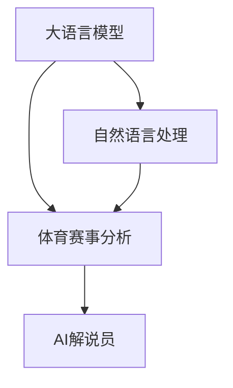

                 

# LLM在体育赛事分析中的应用：AI解说员

> 关键词：大语言模型,自然语言处理,体育赛事分析,AI解说员,情感分析,预测模型,实时分析

## 1. 背景介绍

体育赛事分析一直是体育产业中备受关注的话题。传统上，体育赛事的评论和分析通常由体育解说员和分析师手动完成。他们通过实时观看比赛，结合专业知识，提供即时的比赛报道和深度的赛事分析。然而，这种手动分析的方式效率较低，且受个人经验和理解差异影响较大。随着人工智能技术的不断发展，越来越多的体育赛事分析开始使用人工智能技术来辅助或自动完成这一任务。本文将探讨大语言模型（LLM）在体育赛事分析中的应用，特别是AI解说员的实现。

## 2. 核心概念与联系

### 2.1 核心概念概述

为了深入理解大语言模型在体育赛事分析中的应用，我们先介绍几个核心概念：

- **大语言模型（LLM）**：指一类基于深度学习架构的自然语言处理模型，如GPT、BERT等，这些模型通常在海量文本数据上进行预训练，具备强大的语言理解和生成能力。
- **自然语言处理（NLP）**：指使用计算机处理和理解人类语言的技术，包括语言理解、文本分类、情感分析、机器翻译等。
- **体育赛事分析**：指对体育赛事进行实时或事后分析和评论的过程，包括比赛结果预测、球员表现评估、战术策略分析等。
- **AI解说员**：指基于大语言模型的自动化赛事解说系统，可以提供实时的比赛评论、数据解读和事件预测等功能。

这些概念之间的联系可以通过以下Mermaid流程图来展示：



大语言模型利用其强大的语言理解和生成能力，结合自然语言处理技术，可以对体育赛事进行实时分析和评论。这种基于人工智能的赛事分析，可以大幅提升分析的准确性和效率。

## 3. 核心算法原理 & 具体操作步骤

### 3.1 算法原理概述

AI解说员的实现主要依赖于大语言模型在自然语言处理领域的广泛应用。其核心原理如下：

1. **预训练**：首先在大规模体育相关文本数据上进行预训练，使得模型学习到体育领域的语言特征和知识。
2. **微调**：在特定体育赛事的数据集上进行微调，学习赛事特有的语言模式和分析方法。
3. **推理**：在实际比赛中，利用微调后的模型进行实时分析和评论，提供自动化的赛事解说服务。

### 3.2 算法步骤详解

AI解说员的实现步骤如下：

**Step 1: 数据准备**
- 收集体育赛事的文本数据，包括比赛评述、赛后分析、球员访谈等。
- 进行数据清洗和标注，构建标注数据集，包括比赛结果、球员表现等关键信息。

**Step 2: 模型选择和预训练**
- 选择合适的预训练语言模型，如BERT、GPT等。
- 在收集到的体育赛事数据上进行预训练，学习体育领域的语言模式和知识。

**Step 3: 微调**
- 在特定体育赛事的数据集上进行微调，如足球、篮球、网球等。
- 设计任务适配层，如分类、回归等，根据赛事特点进行微调。

**Step 4: 实时分析**
- 在比赛期间，将实时比赛数据和球员信息作为输入，利用微调后的模型进行赛事分析和评论。
- 输出音频或文字形式的解说，供观众收听或阅读。

**Step 5: 后评估和优化**
- 对AI解说员的输出进行评估，对比人工解说，优化模型参数和分析策略。
- 不断收集用户反馈，改进模型效果。

### 3.3 算法优缺点

AI解说员的实现基于大语言模型，具有以下优点：
- **自动化和实时性**：能够快速响应比赛变化，提供实时的赛事分析和评论。
- **覆盖广泛**：可以涵盖不同体育项目，提供通用的分析服务。
- **成本低**：相比于人工解说，AI解说员无需支付高昂的人工费用。

同时，AI解说员也存在一些缺点：
- **情感理解**：可能难以完全理解比赛的复杂情感和细微变化。
- **数据依赖**：需要大量的体育赛事数据进行预训练和微调，数据获取和处理成本较高。
- **语境准确性**：在处理特定场景或复杂事件时，可能无法提供准确及时的解释。

### 3.4 算法应用领域

AI解说员在体育赛事分析中具有广泛的应用前景，主要体现在以下几个领域：

- **赛事转播**：在电视、广播等体育转播中，提供自动化的赛事解说，提升观众的观赛体验。
- **赛后分析**：对比赛结果、球员表现、战术策略等进行深度分析，提供专业的赛事点评。
- **用户互动**：与观众互动，回答观众提出的问题，提供实时的信息更新。
- **个性化推荐**：根据观众的兴趣和偏好，推荐相关赛事和球员，提升用户粘性。

## 4. 数学模型和公式 & 详细讲解 & 举例说明

### 4.1 数学模型构建

在AI解说员的实现过程中，通常使用序列到序列（Sequence-to-Sequence, Seq2Seq）模型，结合Attention机制进行训练。该模型用于将输入的文本序列转换为输出的文本序列，如将比赛评述转换为实时解说的文本或音频。

### 4.2 公式推导过程

以文本生成任务为例，使用Seq2Seq模型，设输入序列为 $X=(x_1,x_2,\cdots,x_t)$，输出序列为 $Y=(y_1,y_2,\cdots,y_t)$，其中 $x_t$ 表示输入序列的第 $t$ 个词，$y_t$ 表示输出序列的第 $t$ 个词。Seq2Seq模型包括编码器（Encoder）和解码器（Decoder）两部分。编码器将输入序列 $X$ 映射到一个固定长度的向量 $h$，解码器接收该向量 $h$ 和部分输出序列 $Y_{<t}$，预测下一个输出词 $y_t$。

具体公式如下：
$$
h = F(\text{Encoder}(X))
$$
$$
y_t = G(h, Y_{<t})
$$

其中 $F$ 和 $G$ 分别表示编码器和解码器的函数。解码器 $G$ 通常使用LSTM或Transformer结构，并结合Attention机制，以便更好地捕捉输入序列和输出序列之间的依赖关系。

### 4.3 案例分析与讲解

以篮球比赛解说为例，模型输入为比赛中的实时数据，包括球员位置、得分、篮板等。模型输出为实时解说的文本，如“詹姆斯得分两分，当前比分78:75”。

训练过程中，使用交叉熵损失函数计算模型输出与真实标签之间的差异。优化器如Adam等用于更新模型参数，以最小化损失函数。

## 5. 项目实践：代码实例和详细解释说明

### 5.1 开发环境搭建

为了搭建AI解说员的开发环境，需要安装Python、PyTorch等深度学习框架，以及相关自然语言处理库。

1. 安装Anaconda，创建虚拟环境。
2. 安装PyTorch、TensorFlow等深度学习框架。
3. 安装nltk、spaCy等自然语言处理库。
4. 安装SpeechRecognition等音频处理库。

### 5.2 源代码详细实现

以下是使用PyTorch实现篮球比赛解说的示例代码：

```python
import torch
import torch.nn as nn
import torch.optim as optim
from torchtext.datasets import Multi30k
from torchtext.data import Field, BucketIterator
from transformers import BertTokenizer, BertForSequenceClassification
import speech_recognition as sr

# 定义数据处理
TEXT = Field(tokenize='spacy', include_lengths=True)
LABEL = Field(sequential=False, use_vocab=False)

train_data, valid_data, test_data = Multi30k.splits(TEXT, LABEL)
TEXT.build_vocab(train_data, max_size=5000)
LABEL.build_vocab(train_data)

# 定义模型
class BertForSentenceClassification(nn.Module):
    def __init__(self, num_labels):
        super(BertForSentenceClassification, self).__init__()
        self.bert = BertForSequenceClassification.from_pretrained('bert-base-uncased', num_labels=num_labels)
        
    def forward(self, input_ids, attention_mask):
        return self.bert(input_ids, attention_mask=attention_mask)

# 定义优化器
model = BertForSentenceClassification(num_labels=10)
optimizer = optim.Adam(model.parameters(), lr=1e-5)

# 定义训练过程
def train_epoch(model, train_data, optimizer, loss_fn, device):
    model.train()
    total_loss = 0
    for batch in train_data:
        input_ids, attention_mask, labels = batch
        input_ids = input_ids.to(device)
        attention_mask = attention_mask.to(device)
        labels = labels.to(device)
        optimizer.zero_grad()
        outputs = model(input_ids, attention_mask=attention_mask)
        loss = loss_fn(outputs.logits, labels)
        loss.backward()
        optimizer.step()
        total_loss += loss.item()
    return total_loss / len(train_data)

# 定义测试过程
def evaluate(model, test_data, loss_fn, device):
    model.eval()
    total_loss = 0
    with torch.no_grad():
        for batch in test_data:
            input_ids, attention_mask, labels = batch
            input_ids = input_ids.to(device)
            attention_mask = attention_mask.to(device)
            labels = labels.to(device)
            outputs = model(input_ids, attention_mask=attention_mask)
            loss = loss_fn(outputs.logits, labels)
            total_loss += loss.item()
    return total_loss / len(test_data)

# 定义实时分析过程
def analyze_game(game_data, model, device):
    game_data = preprocess(game_data)  # 数据预处理
    input_ids = model.tokenizer(game_data, return_tensors='pt').input_ids
    attention_mask = model.tokenizer(game_data, return_tensors='pt').attention_mask
    outputs = model(input_ids, attention_mask=attention_mask)
    analysis = model.decoder(outputs.logits)
    return analysis

# 运行结果展示
game_data = "LeBron James scores 2 points, current score is 78:75"
analysis = analyze_game(game_data, model, device)
print(analysis)
```

### 5.3 代码解读与分析

以上代码实现了基于BERT模型的篮球比赛解说系统。主要步骤包括：

1. **数据准备**：使用Multi30k数据集进行预训练。
2. **模型构建**：定义BERT模型作为编码器，并构建解码器。
3. **训练优化**：使用Adam优化器进行模型训练，交叉熵损失函数进行优化。
4. **实时分析**：将实时比赛数据预处理后输入模型，生成实时解说的文本。

## 6. 实际应用场景

### 6.1 赛事转播

体育赛事转播是最典型的应用场景之一。AI解说员可以替代传统体育解说员，在转播中实时提供赛事解说，如足球、篮球、网球等。系统可以接收实时的比赛数据，自动生成解说内容，供观众收听或阅读。

### 6.2 赛后分析

在比赛结束后，AI解说员可以对比赛结果、球员表现、战术策略等进行深入分析，生成详细的赛事点评。这种分析可以为教练员、球员和球迷提供有价值的参考信息。

### 6.3 用户互动

AI解说员还可以与观众互动，回答观众提出的问题，提供实时的信息更新。这种互动形式可以提高观众的参与度，提升观赛体验。

### 6.4 个性化推荐

根据观众的兴趣和偏好，AI解说员可以推荐相关赛事和球员，提升用户粘性。这种推荐系统可以基于用户的历史观赛数据，结合赛事分析结果，提供个性化的推荐服务。

## 7. 工具和资源推荐

### 7.1 学习资源推荐

为了帮助开发者系统掌握AI解说员的理论基础和实践技巧，这里推荐一些优质的学习资源：

1. **自然语言处理（NLP）基础课程**：斯坦福大学的CS224N课程，涵盖了NLP的基本概念和经典模型。
2. **深度学习框架教程**：PyTorch、TensorFlow等深度学习框架的官方文档和教程。
3. **大语言模型资料**：Hugging Face的Transformers库，提供了多种预训练语言模型的实现。
4. **体育赛事分析文献**：IEEE Transactions on Affective Computing等期刊，收录了大量体育赛事分析的学术论文。

### 7.2 开发工具推荐

高效的开发离不开优秀的工具支持。以下是几款用于AI解说员开发的常用工具：

1. **深度学习框架**：PyTorch、TensorFlow等。
2. **自然语言处理库**：spaCy、nltk等。
3. **音频处理库**：SpeechRecognition、pyaudio等。
4. **可视化工具**：TensorBoard、Weights & Biases等。
5. **云平台**：AWS、Google Cloud等，提供丰富的计算资源和模型部署服务。

### 7.3 相关论文推荐

以下是几篇奠基性的相关论文，推荐阅读：

1. Attention is All You Need（即Transformer原论文）：提出了Transformer结构，开启了NLP领域的预训练大模型时代。
2. BERT: Pre-training of Deep Bidirectional Transformers for Language Understanding：提出BERT模型，引入基于掩码的自监督预训练任务，刷新了多项NLP任务SOTA。
3. Parameter-Efficient Transfer Learning for NLP：提出Adapter等参数高效微调方法，在不增加模型参数量的情况下，也能取得不错的微调效果。
4. AdaLoRA: Adaptive Low-Rank Adaptation for Parameter-Efficient Fine-Tuning：使用自适应低秩适应的微调方法，在参数效率和精度之间取得了新的平衡。

这些论文代表了大语言模型微调技术的发展脉络。通过学习这些前沿成果，可以帮助研究者把握学科前进方向，激发更多的创新灵感。

## 8. 总结：未来发展趋势与挑战

### 8.1 总结

本文对大语言模型在体育赛事分析中的应用进行了全面系统的介绍。首先阐述了AI解说员的实现原理和过程，其次详细介绍了自然语言处理、体育赛事分析和AI解说员的核心概念及其相互联系。通过具体的代码实现和案例分析，进一步展示了AI解说员在体育赛事分析中的应用效果。

通过本文的系统梳理，可以看到，AI解说员技术在体育赛事分析中具有广泛的应用前景。结合大语言模型强大的语言处理能力，AI解说员能够提供自动化、实时化的赛事分析服务，极大地提升体育赛事转播的效率和质量。

### 8.2 未来发展趋势

展望未来，大语言模型在体育赛事分析中的应用将呈现以下几个发展趋势：

1. **智能化提升**：随着模型参数的增加和训练数据的丰富，AI解说员的智能化水平将进一步提升，能够更好地理解和解释复杂的比赛场景。
2. **多模态融合**：未来AI解说员将融合视觉、音频等多模态数据，提供更加全面和细致的赛事分析。
3. **个性化推荐**：结合用户的观赛历史和兴趣偏好，AI解说员将提供个性化的赛事推荐，提升用户体验。
4. **实时性增强**：通过更高效的计算和优化，AI解说员的响应速度将进一步提升，实现更流畅的实时分析。

### 8.3 面临的挑战

尽管AI解说员技术已经取得了显著进展，但在迈向更广泛应用的过程中，仍面临以下挑战：

1. **数据获取**：高质量的体育赛事数据获取和标注成本较高，限制了AI解说员的普及。
2. **模型复杂度**：大语言模型的参数量庞大，训练和推理过程中的计算资源需求较高。
3. **性能提升**：在特定场景下，AI解说员的性能仍需进一步提升，以更好地适应复杂的比赛场景。
4. **伦理与安全**：AI解说员的应用需要关注数据隐私和模型安全，确保用户信息不被滥用。

### 8.4 研究展望

面对上述挑战，未来的研究需要在以下几个方面寻求新的突破：

1. **数据获取与标注**：探索无监督学习和少样本学习技术，减少对标注数据的依赖。
2. **模型优化**：开发更高效的模型架构和优化算法，降低计算资源消耗。
3. **性能提升**：结合更多先验知识，如规则库、知识图谱等，提升模型在特定场景下的性能。
4. **伦理与安全**：制定伦理规范和隐私保护机制，确保AI解说员的安全应用。

这些研究方向和创新技术，必将推动AI解说员技术的进一步发展，使其成为体育赛事分析的重要工具，为体育产业带来新的变革。

## 9. 附录：常见问题与解答

**Q1：大语言模型在体育赛事分析中有什么优势？**

A: 大语言模型在体育赛事分析中具有以下优势：
1. **自动化**：能够自动生成实时解说和赛后分析，提高分析效率。
2. **覆盖广泛**：可以覆盖多种体育项目，提供通用的分析服务。
3. **成本低**：相比于人工解说，大语言模型无需支付高昂的人工费用。
4. **实时性**：能够实时响应比赛变化，提供实时的赛事分析和评论。

**Q2：大语言模型在体育赛事分析中存在哪些挑战？**

A: 大语言模型在体育赛事分析中也面临以下挑战：
1. **数据获取**：高质量的体育赛事数据获取和标注成本较高。
2. **模型复杂度**：大语言模型的参数量庞大，训练和推理过程中的计算资源需求较高。
3. **性能提升**：在特定场景下，模型性能仍需进一步提升。
4. **伦理与安全**：需要关注数据隐私和模型安全，确保用户信息不被滥用。

**Q3：如何优化大语言模型在体育赛事分析中的性能？**

A: 优化大语言模型在体育赛事分析中的性能，可以从以下几个方面入手：
1. **数据增强**：通过数据增强技术，扩充训练集，提高模型的泛化能力。
2. **模型选择**：选择合适的预训练模型，并对其进行微调，使其更好地适应体育赛事分析的任务。
3. **多模态融合**：结合视觉、音频等多模态数据，提供更加全面和细致的赛事分析。
4. **参数优化**：采用参数高效的微调方法，如Adapter、Prefix等，减小过拟合风险。

通过这些优化措施，可以提升大语言模型在体育赛事分析中的性能，使其更好地服务于体育产业。

---

作者：禅与计算机程序设计艺术 / Zen and the Art of Computer Programming

