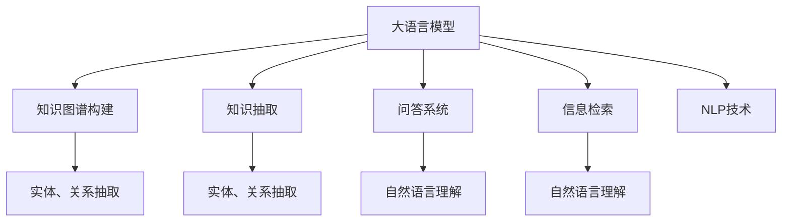

                 

# LLM在智能知识管理中的应用

> 关键词：大语言模型,知识图谱,知识抽取,问答系统,信息检索,自然语言处理(NLP)

## 1. 背景介绍

### 1.1 问题由来

随着知识经济的蓬勃发展，智能知识管理在各行各业中的应用越来越广泛。企业、机构、个人都在寻求更高效、更智能的方式来管理和利用知识资源。传统的信息管理系统往往依赖于人工标注和分类，不仅成本高，效率低，而且容易出错。而大语言模型（Large Language Models, LLMs）的崛起，为智能知识管理提供了全新的可能。

大语言模型通过在海量文本数据上进行预训练，学习到了丰富的语言知识和常识，具备强大的语言理解和生成能力。这些模型在知识图谱构建、知识抽取、问答系统、信息检索等多个知识管理任务上展现出卓越的表现。

### 1.2 问题核心关键点

大语言模型在智能知识管理中的应用主要体现在以下几个方面：

- **知识图谱构建**：利用大语言模型提取实体、关系等知识元素，构建结构化的知识图谱。
- **知识抽取**：从非结构化文本中抽取出结构化的实体、关系等信息。
- **问答系统**：通过大语言模型理解和回答用户提出的复杂问题。
- **信息检索**：通过自然语言处理（NLP）技术，从海量文档数据中检索出最相关的信息。

这些技术手段的应用，使得智能知识管理变得更加高效、智能、个性化。

## 2. 核心概念与联系

### 2.1 核心概念概述

为更好地理解大语言模型在智能知识管理中的应用，本节将介绍几个密切相关的核心概念：

- **大语言模型**：以自回归（如GPT）或自编码（如BERT）模型为代表的大规模预训练语言模型。通过在大规模无标签文本语料上进行预训练，学习通用的语言表示。

- **知识图谱**：一种结构化的知识表示方式，由实体、关系、属性等组成，用于描述实体间的语义关系。

- **知识抽取**：从非结构化文本中抽取出结构化的实体、关系等信息，并构建知识图谱。

- **问答系统**：通过自然语言理解和生成技术，自动回答用户提出的问题。

- **信息检索**：通过文本匹配、语义分析等技术，从大量文本数据中检索出相关的信息。

- **自然语言处理(NLP)**：研究如何让计算机理解、处理和生成自然语言的技术。

这些核心概念之间的逻辑关系可以通过以下Mermaid流程图来展示：



这个流程图展示了大语言模型在智能知识管理中的核心概念及其之间的关系：

1. 大语言模型通过预训练获得基础能力。
2. 知识图谱构建、知识抽取、问答系统、信息检索等多个任务都可以基于大语言模型的能力进行设计和实现。
3. NLP技术是大语言模型的基础，从语言表示到自然语言理解与生成，都依赖于NLP技术。

## 3. 核心算法原理 & 具体操作步骤

### 3.1 算法原理概述

大语言模型在智能知识管理中的应用，主要是通过其强大的语言理解和生成能力，对结构化知识进行提取、构建和检索。核心思想是：将大语言模型作为知识提取和转换的工具，通过文本解析、关系推理等技术，构建和维护知识图谱，并通过自然语言处理技术，检索和生成相关信息。

具体来说，知识图谱构建和知识抽取任务主要依赖于文本解析和实体关系抽取技术。问答系统和信息检索任务则主要依赖于自然语言理解与生成技术。

### 3.2 算法步骤详解

基于大语言模型的智能知识管理过程可以分为以下几个关键步骤：

**Step 1: 准备知识管理数据集**
- 收集包含实体、关系等知识元素的文本数据，构建知识抽取的训练集和验证集。
- 构建问答系统的训练数据集，包括问题和答案对。

**Step 2: 构建知识图谱**
- 使用大语言模型对文本数据进行解析，抽取出实体、关系等知识元素。
- 将这些知识元素存储到知识图谱中，形成结构化的知识表示。

**Step 3: 进行知识抽取**
- 对知识抽取训练集进行训练，得到模型参数。
- 使用训练好的模型对文本数据进行解析，抽取出结构化知识。

**Step 4: 构建问答系统**
- 将问答训练数据集输入大语言模型进行训练，得到模型参数。
- 构建自然语言理解与生成模块，实现对用户问题的自动理解和回答。

**Step 5: 实现信息检索**
- 对信息检索训练数据集进行训练，得到模型参数。
- 使用训练好的模型对用户查询进行语义分析，从知识图谱中检索相关信息。

### 3.3 算法优缺点

基于大语言模型的智能知识管理方法具有以下优点：
1. 高效自动化。大语言模型能够自动解析和抽取知识，无需人工标注，节省大量时间和成本。
2. 泛化能力强。预训练语言模型在多领域数据上进行训练，具备较强的泛化能力，可以适应不同领域和语言环境。
3. 实时性强。通过实时查询和推理，能够快速响应用户需求，提供即时的知识服务。
4. 扩展灵活。知识图谱和模型可以根据需求进行动态扩展和更新，适应复杂多变的知识场景。

同时，该方法也存在一定的局限性：
1. 数据依赖性强。知识图谱构建和知识抽取依赖于高质量的文本数据，数据获取和预处理难度较大。
2. 模型复杂度高。大语言模型参数量庞大，需要较高的计算资源进行训练和推理。
3. 数据隐私问题。从文本中抽取出的知识可能包含敏感信息，如何保护数据隐私和安全是重要挑战。
4. 知识可信度问题。模型抽取出的知识需要经过人工审核和验证，确保其可信度。
5. 技术门槛高。需要掌握深度学习、自然语言处理、知识图谱等多个领域的知识。

尽管存在这些局限性，但就目前而言，基于大语言模型的智能知识管理方法仍是大数据时代知识管理的有效手段。未来相关研究的重点在于如何进一步降低数据依赖，提高模型的实时性和扩展性，同时兼顾数据隐私和知识可信度等关键问题。

### 3.4 算法应用领域

基于大语言模型的智能知识管理方法已经在多个领域得到了广泛应用，如：

- **医疗知识管理**：从医学文献中抽取实体和关系，构建医疗知识图谱，用于疾病诊断、药物研发等。
- **金融知识管理**：从金融新闻、报告中抽取关键信息，构建金融知识图谱，用于市场分析、风险预警等。
- **教育知识管理**：从教材、论文中抽取知识点，构建教育知识图谱，用于个性化教学、智能推荐等。
- **政府知识管理**：从政府文件、公开数据中抽取信息，构建政府知识图谱，用于政策分析、智能辅助决策等。

除了上述这些经典应用外，大语言模型在更多新兴领域也展现出巨大的潜力，如智慧城市、智能制造、社会治理等，为各行各业的知识管理提供了新的解决方案。

## 4. 数学模型和公式 & 详细讲解 & 举例说明

### 4.1 数学模型构建

以知识抽取任务为例，大语言模型可以采用序列标注模型（Sequence Labeling Model）来抽取实体和关系。序列标注模型将文本视为一个序列，通过标注每个位置上的实体类型和关系类型，实现对文本中信息的抽取。

假设输入文本为 $X$，实体标签为 $Y$，关系标签为 $R$。设 $X$ 的长度为 $n$，则序列标注模型的目标是最小化交叉熵损失函数：

$$
\mathcal{L}(\theta) = -\frac{1}{N}\sum_{i=1}^N [\log p(Y_i|X_i;\theta) + \log p(R_i|X_i;\theta)]
$$

其中 $p(Y_i|X_i;\theta)$ 和 $p(R_i|X_i;\theta)$ 分别为预测实体标签和关系标签的概率。$\theta$ 为模型参数，$N$ 为样本数量。

### 4.2 公式推导过程

以BERT为例，序列标注模型的实现过程如下：

1. 将输入文本 $X$ 转化为BERT的向量表示 $Z$。
2. 对向量 $Z$ 进行线性变换和softmax操作，得到实体标签 $Y$ 和关系标签 $R$ 的概率分布。
3. 通过交叉熵损失函数计算模型预测与真实标签之间的差距。

具体公式如下：

$$
Z = BERT_{\theta}(X)
$$

$$
p(Y_i|X_i;\theta) = softmax(W_1 Z_i + b_1)
$$

$$
p(R_i|X_i;\theta) = softmax(W_2 Z_i + b_2)
$$

其中 $W_1$ 和 $b_1$ 为实体标签的权重矩阵和偏置向量，$W_2$ 和 $b_2$ 为关系标签的权重矩阵和偏置向量。

### 4.3 案例分析与讲解

以构建医疗知识图谱为例，利用大语言模型进行知识抽取的过程如下：

1. 收集医疗文献、病历等文本数据。
2. 使用大语言模型对文本进行解析，抽取出实体（如疾病、药物）和关系（如治疗、副作用）。
3. 将抽取出的实体和关系存储到知识图谱中，形成结构化的知识表示。
4. 利用构建好的知识图谱，实现疾病诊断、药物推荐等功能。

例如，可以构建一个包含疾病、药物、基因等元素的医疗知识图谱，并通过查询图谱，自动推荐针对特定疾病的治疗方案。这种智能知识管理方法可以显著提升医疗服务的效率和质量，帮助医生做出更精准的诊断和治疗决策。

## 5. 项目实践：代码实例和详细解释说明

### 5.1 开发环境搭建

在进行知识抽取和构建知识图谱的实践前，我们需要准备好开发环境。以下是使用Python进行PyTorch开发的环境配置流程：

1. 安装Anaconda：从官网下载并安装Anaconda，用于创建独立的Python环境。

2. 创建并激活虚拟环境：
```bash
conda create -n pytorch-env python=3.8 
conda activate pytorch-env
```

3. 安装PyTorch：根据CUDA版本，从官网获取对应的安装命令。例如：
```bash
conda install pytorch torchvision torchaudio cudatoolkit=11.1 -c pytorch -c conda-forge
```

4. 安装Transformers库：
```bash
pip install transformers
```

5. 安装各类工具包：
```bash
pip install numpy pandas scikit-learn matplotlib tqdm jupyter notebook ipython
```

完成上述步骤后，即可在`pytorch-env`环境中开始知识抽取和知识图谱构建的实践。

### 5.2 源代码详细实现

这里我们以知识抽取任务为例，给出使用Transformers库对BERT模型进行知识抽取的PyTorch代码实现。

首先，定义知识抽取的任务描述：

```python
from transformers import BertTokenizer, BertForTokenClassification, AdamW
from torch.utils.data import Dataset, DataLoader
import torch

class KnowledgeExtractionDataset(Dataset):
    def __init__(self, texts, tags, tokenizer, max_len=128):
        self.texts = texts
        self.tags = tags
        self.tokenizer = tokenizer
        self.max_len = max_len
        
    def __len__(self):
        return len(self.texts)
    
    def __getitem__(self, item):
        text = self.texts[item]
        tags = self.tags[item]
        
        encoding = self.tokenizer(text, return_tensors='pt', max_length=self.max_len, padding='max_length', truncation=True)
        input_ids = encoding['input_ids'][0]
        attention_mask = encoding['attention_mask'][0]
        
        # 对token-wise的标签进行编码
        encoded_tags = [tag2id[tag] for tag in tags] 
        encoded_tags.extend([tag2id['O']] * (self.max_len - len(encoded_tags)))
        labels = torch.tensor(encoded_tags, dtype=torch.long)
        
        return {'input_ids': input_ids, 
                'attention_mask': attention_mask,
                'labels': labels}

# 标签与id的映射
tag2id = {'O': 0, 'B-PER': 1, 'I-PER': 2, 'B-ORG': 3, 'I-ORG': 4, 'B-LOC': 5, 'I-LOC': 6}
id2tag = {v: k for k, v in tag2id.items()}

# 创建dataset
tokenizer = BertTokenizer.from_pretrained('bert-base-cased')

train_dataset = KnowledgeExtractionDataset(train_texts, train_tags, tokenizer)
dev_dataset = KnowledgeExtractionDataset(dev_texts, dev_tags, tokenizer)
test_dataset = KnowledgeExtractionDataset(test_texts, test_tags, tokenizer)
```

然后，定义模型和优化器：

```python
from transformers import BertForTokenClassification, AdamW

model = BertForTokenClassification.from_pretrained('bert-base-cased', num_labels=len(tag2id))

optimizer = AdamW(model.parameters(), lr=2e-5)
```

接着，定义训练和评估函数：

```python
from torch.utils.data import DataLoader
from tqdm import tqdm
from sklearn.metrics import classification_report

device = torch.device('cuda') if torch.cuda.is_available() else torch.device('cpu')
model.to(device)

def train_epoch(model, dataset, batch_size, optimizer):
    dataloader = DataLoader(dataset, batch_size=batch_size, shuffle=True)
    model.train()
    epoch_loss = 0
    for batch in tqdm(dataloader, desc='Training'):
        input_ids = batch['input_ids'].to(device)
        attention_mask = batch['attention_mask'].to(device)
        labels = batch['labels'].to(device)
        model.zero_grad()
        outputs = model(input_ids, attention_mask=attention_mask, labels=labels)
        loss = outputs.loss
        epoch_loss += loss.item()
        loss.backward()
        optimizer.step()
    return epoch_loss / len(dataloader)

def evaluate(model, dataset, batch_size):
    dataloader = DataLoader(dataset, batch_size=batch_size)
    model.eval()
    preds, labels = [], []
    with torch.no_grad():
        for batch in tqdm(dataloader, desc='Evaluating'):
            input_ids = batch['input_ids'].to(device)
            attention_mask = batch['attention_mask'].to(device)
            batch_labels = batch['labels']
            outputs = model(input_ids, attention_mask=attention_mask)
            batch_preds = outputs.logits.argmax(dim=2).to('cpu').tolist()
            batch_labels = batch_labels.to('cpu').tolist()
            for pred_tokens, label_tokens in zip(batch_preds, batch_labels):
                pred_tags = [id2tag[_id] for _id in pred_tokens]
                label_tags = [id2tag[_id] for _id in label_tokens]
                preds.append(pred_tags[:len(label_tags)])
                labels.append(label_tags)
                
    print(classification_report(labels, preds))
```

最后，启动训练流程并在测试集上评估：

```python
epochs = 5
batch_size = 16

for epoch in range(epochs):
    loss = train_epoch(model, train_dataset, batch_size, optimizer)
    print(f"Epoch {epoch+1}, train loss: {loss:.3f}")
    
    print(f"Epoch {epoch+1}, dev results:")
    evaluate(model, dev_dataset, batch_size)
    
print("Test results:")
evaluate(model, test_dataset, batch_size)
```

以上就是使用PyTorch对BERT进行知识抽取任务的完整代码实现。可以看到，得益于Transformers库的强大封装，我们可以用相对简洁的代码完成BERT模型的加载和知识抽取。

### 5.3 代码解读与分析

让我们再详细解读一下关键代码的实现细节：

**KnowledgeExtractionDataset类**：
- `__init__`方法：初始化文本、标签、分词器等关键组件。
- `__len__`方法：返回数据集的样本数量。
- `__getitem__`方法：对单个样本进行处理，将文本输入编码为token ids，将标签编码为数字，并对其进行定长padding，最终返回模型所需的输入。

**tag2id和id2tag字典**：
- 定义了标签与数字id之间的映射关系，用于将token-wise的预测结果解码回真实的标签。

**训练和评估函数**：
- 使用PyTorch的DataLoader对数据集进行批次化加载，供模型训练和推理使用。
- 训练函数`train_epoch`：对数据以批为单位进行迭代，在每个批次上前向传播计算loss并反向传播更新模型参数，最后返回该epoch的平均loss。
- 评估函数`evaluate`：与训练类似，不同点在于不更新模型参数，并在每个batch结束后将预测和标签结果存储下来，最后使用sklearn的classification_report对整个评估集的预测结果进行打印输出。

**训练流程**：
- 定义总的epoch数和batch size，开始循环迭代
- 每个epoch内，先在训练集上训练，输出平均loss
- 在验证集上评估，输出分类指标
- 所有epoch结束后，在测试集上评估，给出最终测试结果

可以看到，PyTorch配合Transformers库使得BERT知识抽取的代码实现变得简洁高效。开发者可以将更多精力放在数据处理、模型改进等高层逻辑上，而不必过多关注底层的实现细节。

当然，工业级的系统实现还需考虑更多因素，如模型的保存和部署、超参数的自动搜索、更灵活的任务适配层等。但核心的知识抽取范式基本与此类似。

## 6. 实际应用场景
### 6.1 医疗知识管理

基于大语言模型的知识抽取技术，可以在医疗领域构建高效的医疗知识图谱。传统医疗知识管理依赖于专家团队手动标注和构建，不仅成本高，效率低，且难以应对医疗知识的多样性和复杂性。而利用大语言模型自动抽取知识，能够显著降低人工成本，提高知识管理效率。

例如，可以利用BERT模型对医学文献、病历等文本数据进行解析，抽取出疾病、药物、基因等知识元素，构建包含丰富医疗知识的大型知识图谱。这种智能知识管理方法可以提升医生对疾病的诊断和治疗决策，加速新药研发进程，为患者提供更精准的医疗服务。

### 6.2 金融知识管理

金融领域的数据量庞大且复杂多变，传统金融知识管理依赖于人工标注和专家知识库，难以满足实时性和动态性需求。而大语言模型在金融知识抽取和构建上展现出卓越的能力。

例如，可以从金融新闻、报告等文本中自动抽取关键信息，如公司财务状况、市场走势、宏观经济指标等，构建动态更新的金融知识图谱。这种智能知识管理方法能够帮助投资者快速做出投资决策，降低金融风险，提升投资收益。

### 6.3 教育知识管理

教育领域的数据往往以非结构化形式存在，传统教育知识管理依赖于人工分析和标注，效率低且容易出错。利用大语言模型进行知识抽取，可以显著提升教育知识管理的自动化程度。

例如，可以从教材、论文等文本中抽取知识点、概念、定理等，构建教育知识图谱。这种智能知识管理方法可以辅助教师进行教学设计，提升课堂效率和教学质量，促进学生的自主学习。

### 6.4 未来应用展望

随着大语言模型和知识抽取技术的不断发展，智能知识管理在更多领域将得到应用，为各行各业带来变革性影响。

在智慧城市治理中，利用大语言模型自动抽取各类公共服务信息，构建智能城市知识图谱，用于城市管理、应急响应、资源调配等环节，提升城市管理的自动化和智能化水平。

在智能制造中，利用大语言模型自动抽取设备、材料、工艺等信息，构建工业知识图谱，用于生产调度、质量监控、故障预测等，提升制造业的智能化水平和生产效率。

在社会治理中，利用大语言模型自动抽取各类社会事件信息，构建社会治理知识图谱，用于舆情分析、公共决策、事件管理等，提升社会治理的科学性和公平性。

此外，在企业知识管理、环境保护、灾害预警等领域，大语言模型的应用也展现出巨大的潜力，为各行各业的知识管理提供了新的解决方案。

## 7. 工具和资源推荐
### 7.1 学习资源推荐

为了帮助开发者系统掌握大语言模型在智能知识管理中的应用，这里推荐一些优质的学习资源：

1. 《Transformers from Scratch》系列博文：由大模型技术专家撰写，深入浅出地介绍了Transformer原理、BERT模型、知识抽取等前沿话题。

2. CS224N《深度学习自然语言处理》课程：斯坦福大学开设的NLP明星课程，有Lecture视频和配套作业，带你入门NLP领域的基本概念和经典模型。

3. 《Knowledge Graphs: From Concepts to Industry》书籍：详细介绍了知识图谱的概念、构建和应用，是知识图谱领域的经典入门读物。

4. 《Natural Language Processing with Transformers》书籍：Transformers库的作者所著，全面介绍了如何使用Transformers库进行NLP任务开发，包括知识抽取在内的诸多范式。

5. HuggingFace官方文档：Transformers库的官方文档，提供了海量预训练模型和完整的知识抽取样例代码，是上手实践的必备资料。

通过对这些资源的学习实践，相信你一定能够快速掌握大语言模型在智能知识管理中的应用，并用于解决实际的NLP问题。
###  7.2 开发工具推荐

高效的开发离不开优秀的工具支持。以下是几款用于大语言模型知识抽取开发的常用工具：

1. PyTorch：基于Python的开源深度学习框架，灵活动态的计算图，适合快速迭代研究。大部分预训练语言模型都有PyTorch版本的实现。

2. TensorFlow：由Google主导开发的开源深度学习框架，生产部署方便，适合大规模工程应用。同样有丰富的预训练语言模型资源。

3. Transformers库：HuggingFace开发的NLP工具库，集成了众多SOTA语言模型，支持PyTorch和TensorFlow，是进行知识抽取任务开发的利器。

4. Weights & Biases：模型训练的实验跟踪工具，可以记录和可视化模型训练过程中的各项指标，方便对比和调优。与主流深度学习框架无缝集成。

5. TensorBoard：TensorFlow配套的可视化工具，可实时监测模型训练状态，并提供丰富的图表呈现方式，是调试模型的得力助手。

6. Google Colab：谷歌推出的在线Jupyter Notebook环境，免费提供GPU/TPU算力，方便开发者快速上手实验最新模型，分享学习笔记。

合理利用这些工具，可以显著提升大语言模型知识抽取任务的开发效率，加快创新迭代的步伐。

### 7.3 相关论文推荐

大语言模型在智能知识管理中的应用源于学界的持续研究。以下是几篇奠基性的相关论文，推荐阅读：

1. Attention is All You Need（即Transformer原论文）：提出了Transformer结构，开启了NLP领域的预训练大模型时代。

2. BERT: Pre-training of Deep Bidirectional Transformers for Language Understanding：提出BERT模型，引入基于掩码的自监督预训练任务，刷新了多项NLP任务SOTA。

3. Knowledge Graph Embeddings and Their Application to Recommender Systems：详细介绍了知识图谱嵌入技术和推荐系统中的应用，是知识图谱领域的经典论文。

4. Cascading Attention Networks for Semantic Discovery in Knowledge Bases：提出了一种基于序列标注的实体关系抽取方法，适用于从大规模语料中抽取结构化知识。

5. Sequence-to-Sequence Attention Models with Feature Encoders for Knowledge Extraction：提出了一种序列到序列的注意力模型，用于从非结构化文本中抽取结构化知识。

这些论文代表了大语言模型在智能知识管理领域的研究进展，通过学习这些前沿成果，可以帮助研究者把握学科前进方向，激发更多的创新灵感。

## 8. 总结：未来发展趋势与挑战

### 8.1 研究成果总结

本文对大语言模型在智能知识管理中的应用进行了全面系统的介绍。首先阐述了知识管理的重要性和当前面临的挑战，明确了知识抽取、知识图谱构建、问答系统、信息检索等关键技术手段。其次，从原理到实践，详细讲解了大语言模型在知识管理中的应用流程和核心算法，给出了知识抽取任务完整的代码实例。同时，本文还探讨了知识管理在医疗、金融、教育、智慧城市等多个领域的应用前景，展示了大语言模型的巨大潜力。

通过本文的系统梳理，可以看到，大语言模型在智能知识管理中的应用正成为行业智能化转型的重要引擎，为各行各业的知识管理提供了全新的解决方案。未来，随着大语言模型和知识抽取技术的进一步发展，智能知识管理将变得更加高效、智能、灵活，为各行各业带来深远的变革。

### 8.2 未来发展趋势

展望未来，大语言模型在智能知识管理中的应用将呈现以下几个发展趋势：

1. **多模态知识抽取**：利用大语言模型整合文本、图像、视频等多种模态数据，构建更加全面、精细的知识图谱。

2. **知识图谱动态更新**：利用大语言模型自动跟踪最新数据和知识，实现知识图谱的动态更新和维护。

3. **实时知识抽取**：利用大语言模型实时处理输入数据，快速抽取和生成知识，满足即时知识需求。

4. **知识图谱自动化构建**：利用大语言模型自动构建知识图谱，降低人工标注和维护成本。

5. **跨领域知识迁移**：利用大语言模型的泛化能力，实现不同领域知识的迁移和融合。

6. **知识图谱协同计算**：利用分布式计算技术，提高知识图谱的查询效率和计算速度。

以上趋势凸显了大语言模型在智能知识管理中的广阔前景。这些方向的探索发展，必将进一步提升知识管理系统的性能和应用范围，为各行各业的知识管理提供新的动力。

### 8.3 面临的挑战

尽管大语言模型在智能知识管理中的应用已经取得了显著进展，但在迈向更加智能化、普适化应用的过程中，仍面临诸多挑战：

1. **数据获取难度大**：高质量的知识抽取和构建依赖于大量的文本数据，获取和预处理数据难度较大。

2. **模型计算资源高**：大语言模型参数量庞大，训练和推理需要较高的计算资源。

3. **数据隐私和安全**：知识抽取和构建过程中涉及敏感信息，如何保护数据隐私和安全是重要挑战。

4. **知识可信度**：自动抽取的知识需要经过人工审核和验证，确保其可信度。

5. **技术门槛高**：需要掌握深度学习、自然语言处理、知识图谱等多个领域的知识。

尽管存在这些挑战，但通过持续的创新和实践，大语言模型在智能知识管理中的应用将不断提升，为各行各业的知识管理提供新的解决方案。

### 8.4 研究展望

面向未来，大语言模型在智能知识管理领域的研究将在以下几个方面寻求新的突破：

1. **少样本学习**：利用大语言模型的泛化能力，从少量样本中抽取和构建知识，降低数据获取和标注成本。

2. **知识图谱生成**：结合图神经网络等技术，利用大语言模型自动生成知识图谱，提高知识管理的自动化程度。

3. **知识推理**：利用大语言模型的推理能力，构建更加智能的知识管理模型，实现知识的自动推理和预测。

4. **跨模态知识融合**：利用多模态数据融合技术，构建跨模态知识管理系统，提升知识的全面性和准确性。

5. **知识图谱隐私保护**：研究如何在大规模知识抽取和构建过程中保护数据隐私和安全。

6. **知识管理伦理**：研究如何在大规模知识管理中保证伦理和公平性，避免算法偏见和有害信息传播。

这些研究方向将进一步推动大语言模型在智能知识管理中的应用，为各行各业的知识管理提供更加全面、智能、可靠的技术支持。

## 9. 附录：常见问题与解答

**Q1：大语言模型在知识抽取过程中如何提高准确率？**

A: 提高知识抽取准确率主要依赖于以下几个方面：

1. **数据质量**：确保标注数据的质量和多样性，涵盖不同领域、不同语境下的数据。

2. **模型选择**：选择合适的预训练模型，如BERT、GPT等，并在训练集上微调，优化模型参数。

3. **模型融合**：利用多模型集成技术，通过投票、加权平均等方式提高模型预测准确率。

4. **数据增强**：通过数据扩充、回译等方式，增加训练集的多样性，提升模型泛化能力。

5. **正则化技术**：应用L2正则、Dropout等正则化技术，防止模型过拟合。

6. **超参数调优**：通过超参数调优，找到最优的学习率、批次大小等参数组合。

通过综合考虑以上因素，可以显著提升大语言模型在知识抽取任务中的准确率。

**Q2：知识图谱构建过程中如何处理实体关系抽取的歧义性问题？**

A: 实体关系抽取中的歧义性问题可以通过以下方法来解决：

1. **上下文分析**：利用上下文信息消除歧义，结合语境理解实体之间的关系。

2. **多模型融合**：通过多模型集成技术，结合不同模型的预测结果，降低单个模型的误判率。

3. **规则库引入**：结合人工编写的规则库，提高实体关系抽取的准确性和鲁棒性。

4. **标注数据增加**：通过增加标注数据，训练模型学习更多场景和语境下的实体关系抽取规则。

5. **神经网络结构优化**：优化神经网络结构，提高模型的表达能力和泛化能力，降低歧义性问题的影响。

6. **领域特定模型**：针对特定领域，构建领域特定的知识图谱和抽取模型，提升其在特定领域的抽取能力。

通过综合运用以上方法，可以有效地处理实体关系抽取中的歧义性问题，构建更准确、可靠的知识图谱。

**Q3：大语言模型在知识图谱构建过程中如何处理实体和关系抽取的双向关系？**

A: 实体和关系抽取的双向关系可以通过以下方法来解决：

1. **双向RNN**：使用双向循环神经网络(Bi-RNN)，同时考虑前后文信息，提高实体和关系的抽取准确性。

2. **Transformer模型**：利用Transformer结构，捕捉长距离依赖关系，提高双向关系的抽取能力。

3. **联合训练**：在训练过程中，同时训练实体和关系抽取模型，利用它们之间的关联性，提高双向关系的抽取能力。

4. **多任务学习**：利用多任务学习技术，同时训练实体和关系抽取模型，提升双向关系的抽取能力。

5. **跨层关系建模**：利用跨层关系建模技术，捕捉不同层级之间的关系，提高双向关系的抽取能力。

6. **混合模型**：结合不同模型的优势，如Bi-LSTM、Bi-GRU等，构建混合模型，提高双向关系的抽取能力。

通过综合运用以上方法，可以有效地处理实体和关系抽取的双向关系，构建更全面、准确的知识图谱。

**Q4：知识图谱在实际应用中如何保证数据隐私和安全？**

A: 知识图谱在实际应用中保证数据隐私和安全主要依赖于以下几个方面：

1. **数据脱敏**：对敏感信息进行脱敏处理，去除或匿名化敏感数据，保护数据隐私。

2. **访问控制**：设置访问权限，限制对知识图谱的访问和操作，防止未经授权的访问和数据泄露。

3. **加密技术**：对知识图谱进行加密处理，确保数据在传输和存储过程中的安全性。

4. **联邦学习**：利用联邦学习技术，在多个客户端上进行知识图谱的联合训练和更新，保护数据隐私。

5. **差分隐私**：在知识图谱构建和更新过程中，采用差分隐私技术，确保个体数据的隐私性。

6. **区块链技术**：利用区块链技术，记录知识图谱的更新和访问记录，确保数据的安全性和透明性。

通过综合运用以上方法，可以有效地保证知识图谱在实际应用中的数据隐私和安全。

**Q5：大语言模型在知识图谱构建过程中如何处理长尾实体和关系？**

A: 大语言模型在知识图谱构建过程中处理长尾实体和关系主要依赖于以下几个方面：

1. **样本增加**：增加长尾实体和关系的训练样本，提高模型对长尾数据的学习能力。

2. **模型优化**：优化模型结构，引入注意力机制、自适应学习等技术，提高模型对长尾数据的表达能力。

3. **知识库引入**：结合外部知识库，引入更多的长尾实体和关系，提高知识图谱的全面性和准确性。

4. **跨领域迁移**：利用大语言模型的泛化能力，从其他领域迁移知识，提高长尾实体和关系的抽取能力。

5. **多模型集成**：利用多模型集成技术，结合不同模型的预测结果，降低单个模型的误判率。

6. **数据增强**：通过数据扩充、回译等方式，增加训练集的多样性，提升模型泛化能力。

通过综合运用以上方法，可以有效地处理长尾实体和关系，构建更全面、准确的知识图谱。

**Q6：如何构建高质量的知识图谱？**

A: 构建高质量的知识图谱主要依赖于以下几个方面：

1. **高质量数据**：确保标注数据的质量和多样性，涵盖不同领域、不同语境下的数据。

2. **模型选择**：选择合适的预训练模型，如BERT、GPT等，并在训练集上微调，优化模型参数。

3. **模型融合**：利用多模型集成技术，通过投票、加权平均等方式提高模型预测准确率。

4. **数据增强**：通过数据扩充、回译等方式，增加训练集的多样性，提升模型泛化能力。

5. **正则化技术**：应用L2正则、Dropout等正则化技术，防止模型过拟合。

6. **超参数调优**：通过超参数调优，找到最优的学习率、批次大小等参数组合。

通过综合考虑以上因素，可以显著提升知识图谱的质量和准确性，为知识管理系统的应用提供可靠的数据支持。

---

作者：禅与计算机程序设计艺术 / Zen and the Art of Computer Programming

