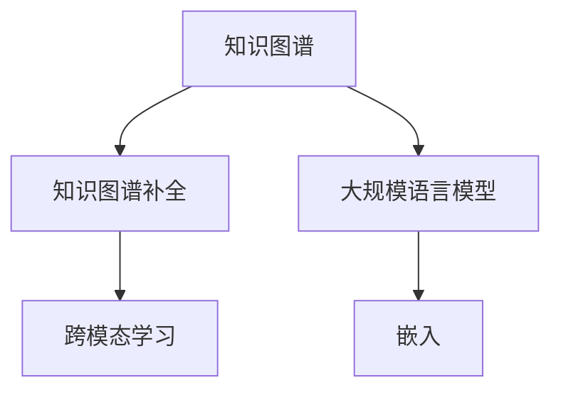
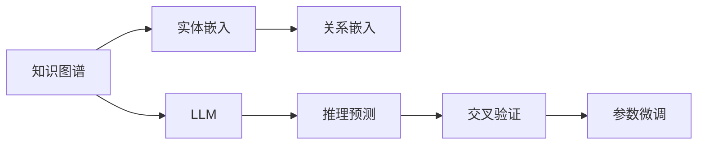

                 

# LLM在知识图谱补全上的优化策略

在大数据和人工智能的推动下，知识图谱（Knowledge Graph，KG）作为人工智能的重要基础架构，已成为信息获取、数据处理和智能决策的重要手段。然而，由于现实世界中知识的不完整性，知识图谱常常存在实体和关系缺失的问题。大规模语言模型（Large Language Models, LLMs）作为近年来兴起的人工智能技术，因其具备的强大语义理解和知识推理能力，逐渐被引入到知识图谱的补全（Link Prediction）任务中。本文将详细介绍LLM在知识图谱补全上的优化策略，涵盖数学模型构建、算法优化、实际应用等方面。

## 1. 背景介绍

知识图谱作为结构化的知识库，主要由实体（Entity）和关系（Relation）构成，通过实体和关系之间的联系来描述和推理知识。然而，由于知识的不完整性和数据收集的困难，知识图谱中常常存在实体和关系缺失的问题。知识图谱补全任务（Link Prediction）旨在从已有的知识图谱中预测缺失的实体或关系，从而提升知识图谱的完整性和准确性。

大规模语言模型（LLMs）是指具有数十亿甚至更多参数的深度学习模型，能够处理和生成自然语言，并具备丰富的语义理解和知识推理能力。随着BERT、GPT等深度学习模型的问世，LLMs在处理大规模自然语言数据方面表现出显著优势，成为当前研究热点。

## 2. 核心概念与联系

### 2.1 核心概念概述

本节将介绍几个密切相关的核心概念：

- **知识图谱**：由实体和关系构成的知识库，描述现实世界中的各种知识和关系。
- **知识图谱补全（Link Prediction）**：从已有的知识图谱中预测缺失的实体或关系，提升知识图谱的完整性和准确性。
- **大规模语言模型（LLMs）**：具有大规模参数的深度学习模型，具备强大的自然语言理解和知识推理能力。
- **嵌入（Embedding）**：将实体和关系映射到低维向量空间，便于模型处理和推理。
- **跨模态学习**：将不同模态（如文本、图像、音频等）的数据融合到一个统一的框架中进行处理。

这些核心概念之间的逻辑关系可以通过以下Mermaid流程图来展示：



这个流程图展示了大语言模型在知识图谱补全任务中的核心作用，通过将实体和关系嵌入到低维向量空间，大语言模型可以更好地处理和推理知识图谱中的信息。

### 2.2 核心概念原理和架构的 Mermaid 流程图



这个流程图展示了知识图谱补全的完整流程，从实体嵌入、关系嵌入到使用大语言模型进行推理预测，并结合交叉验证和参数微调，最终得到补全后的知识图谱。

## 3. 核心算法原理 & 具体操作步骤

### 3.1 算法原理概述

在大规模语言模型（LLMs）中，实体和关系被嵌入到低维向量空间中，形成实体的向量表示和关系的向量表示。知识图谱补全的目的是预测给定实体和关系缺失的三元组（h, r, t），即给定头实体h和关系r，预测出尾实体t。

传统的方法使用基于图神经网络（GNNs）的架构，通过迭代更新实体和关系的向量表示，在邻居和全局信息之间进行融合。而使用大规模语言模型的方法，则是直接利用语言模型在自然语言处理任务上的优秀表现，将知识图谱补全问题转化为一个自然语言推理问题，即给定两个句子，预测它们是否具有相同的推理关系。

### 3.2 算法步骤详解

知识图谱补全的算法步骤如下：

**Step 1: 数据预处理**
- 收集知识图谱数据，并进行清洗和标注，包括实体的ID、关系的ID和缺失的实体或关系。
- 将实体和关系转换为向量表示，使用Word2Vec、GloVe等词嵌入模型进行预训练，或者使用预训练的大语言模型（如BERT、GPT）直接生成嵌入。

**Step 2: 训练大语言模型**
- 使用大语言模型对知识图谱数据进行训练，生成实体的向量表示和关系的向量表示。
- 在大语言模型中，定义适当的推理逻辑，如匹配实体和关系的信息，并预测三元组是否成立。

**Step 3: 预测缺失关系**
- 将缺失的三元组（h, r, t）输入大语言模型，生成推断结果。
- 利用交叉验证等技术评估预测结果的准确性，并进行参数微调。

**Step 4: 验证和调整**
- 使用真实世界数据对模型进行验证，检测其泛化能力和准确性。
- 根据验证结果对模型进行参数微调，进一步提升预测性能。

### 3.3 算法优缺点

大规模语言模型（LLMs）在知识图谱补全中的优点包括：

- **强大的语义理解能力**：LLMs能够处理自然语言，能够理解复杂的语义关系和上下文信息。
- **灵活的推理能力**：LLMs能够根据上下文和知识图谱中的信息进行推理，预测出缺失的实体或关系。
- **高效的嵌入学习**：利用预训练模型可以生成高质量的嵌入，无需从头训练。

然而，该方法也存在以下缺点：

- **计算资源消耗高**：大语言模型需要大量的计算资源进行训练和推理。
- **数据标注难度大**：知识图谱补全需要大量的标注数据，而高质量的标注数据获取困难。
- **模型解释性不足**：大语言模型的推理过程缺乏可解释性，难以理解其内部机制。

### 3.4 算法应用领域

大规模语言模型在知识图谱补全中的应用主要包括以下几个方面：

- **实体链接（Entity Linking）**：将自然语言中的实体链接到知识图谱中的实体。
- **关系抽取（Relation Extraction）**：从自然语言中抽取实体之间的关系。
- **知识推理（Knowledge Reasoning）**：利用知识图谱中的信息进行推理，预测未知的实体或关系。
- **问答系统（Question Answering）**：利用知识图谱中的信息回答问题，如问答系统和智能客服系统。

这些应用展示了大规模语言模型在知识图谱补全中的广泛应用，推动了人工智能技术的进一步发展。

## 4. 数学模型和公式 & 详细讲解

### 4.1 数学模型构建

知识图谱补全的数学模型主要包括以下几个部分：

- **实体嵌入**：将实体映射到低维向量空间中，生成实体的向量表示。
- **关系嵌入**：将关系映射到低维向量空间中，生成关系的向量表示。
- **推理模型**：利用大语言模型进行推理，预测三元组是否成立。

以二元关系（二阶关系）为例，数学模型可以表示为：

$$
\mathcal{L} = -\log P(h, r, t)
$$

其中，$P(h, r, t)$表示给定头实体h和关系r，预测尾实体t的概率。

### 4.2 公式推导过程

假设实体和关系分别嵌入到低维向量空间中，实体嵌入为$\mathbf{e}_h$，关系嵌入为$\mathbf{r}$，尾实体嵌入为$\mathbf{e}_t$。假设推理模型的参数为$\theta$，则推理模型可以表示为：

$$
P(h, r, t) = \sigma(\mathbf{e}_h \cdot \mathbf{r} \cdot \mathbf{e}_t + \mathbf{b})
$$

其中，$\sigma$为激活函数，$\mathbf{b}$为偏置项。

### 4.3 案例分析与讲解

以知识图谱中的实体链接为例，假设有一个二元关系（二阶关系），给定头实体h和关系r，预测尾实体t。模型的输入为：

- 头实体h的向量表示$\mathbf{e}_h$
- 关系r的向量表示$\mathbf{r}$
- 尾实体t的向量表示$\mathbf{e}_t$

模型的输出为：

- 给定头实体h和关系r，预测尾实体t是否成立的概率$P(h, r, t)$

模型训练的目标是最小化损失函数$\mathcal{L}$，即：

$$
\mathcal{L} = -\log P(h, r, t)
$$

训练过程中，通过梯度下降算法，不断更新模型参数$\theta$，使其能够更好地拟合训练数据。

## 5. 项目实践：代码实例和详细解释说明

### 5.1 开发环境搭建

在进行项目实践前，我们需要准备好开发环境。以下是使用Python进行PyTorch开发的环境配置流程：

1. 安装Anaconda：从官网下载并安装Anaconda，用于创建独立的Python环境。

2. 创建并激活虚拟环境：
```bash
conda create -n pytorch-env python=3.8 
conda activate pytorch-env
```

3. 安装PyTorch：根据CUDA版本，从官网获取对应的安装命令。例如：
```bash
conda install pytorch torchvision torchaudio cudatoolkit=11.1 -c pytorch -c conda-forge
```

4. 安装Transformers库：
```bash
pip install transformers
```

5. 安装各类工具包：
```bash
pip install numpy pandas scikit-learn matplotlib tqdm jupyter notebook ipython
```

完成上述步骤后，即可在`pytorch-env`环境中开始项目实践。

### 5.2 源代码详细实现

下面我们以知识图谱补全任务为例，给出使用Transformers库对BERT模型进行训练的PyTorch代码实现。

首先，定义知识图谱补全的数据处理函数：

```python
from transformers import BertTokenizer, BertForRelationExtraction
from torch.utils.data import Dataset
import torch

class KGDataset(Dataset):
    def __init__(self, triples, tokenizer):
        self.triples = triples
        self.tokenizer = tokenizer
        
    def __len__(self):
        return len(self.triples)
    
    def __getitem__(self, item):
        head, relation, tail = self.triples[item]
        
        head_tokens = self.tokenizer.tokenize(head)
        relation_tokens = self.tokenizer.tokenize(relation)
        tail_tokens = self.tokenizer.tokenize(tail)
        
        # 将head和tail的token拼接，并添加[CLS]和[SEP]分隔符
        input_ids = self.tokenizer.encode(head_tokens + tail_tokens, add_special_tokens=True)
        
        return {'input_ids': input_ids, 'labels': 1}
```

然后，定义模型和优化器：

```python
from transformers import BertForRelationExtraction, AdamW

model = BertForRelationExtraction.from_pretrained('bert-base-cased')

optimizer = AdamW(model.parameters(), lr=2e-5)
```

接着，定义训练和评估函数：

```python
from torch.utils.data import DataLoader
from tqdm import tqdm
from sklearn.metrics import accuracy_score

device = torch.device('cuda') if torch.cuda.is_available() else torch.device('cpu')
model.to(device)

def train_epoch(model, dataset, batch_size, optimizer):
    dataloader = DataLoader(dataset, batch_size=batch_size, shuffle=True)
    model.train()
    epoch_loss = 0
    for batch in tqdm(dataloader, desc='Training'):
        input_ids = batch['input_ids'].to(device)
        labels = batch['labels'].to(device)
        model.zero_grad()
        outputs = model(input_ids, labels=labels)
        loss = outputs.loss
        epoch_loss += loss.item()
        loss.backward()
        optimizer.step()
    return epoch_loss / len(dataloader)

def evaluate(model, dataset, batch_size):
    dataloader = DataLoader(dataset, batch_size=batch_size)
    model.eval()
    preds, labels = [], []
    with torch.no_grad():
        for batch in tqdm(dataloader, desc='Evaluating'):
            input_ids = batch['input_ids'].to(device)
            labels = batch['labels'].to(device)
            batch_preds = model(input_ids, labels=labels).predictions.argmax(dim=1).to('cpu').tolist()
            batch_labels = batch['labels'].to('cpu').tolist()
            for pred, label in zip(batch_preds, batch_labels):
                preds.append(pred)
                labels.append(label)
                
    print(accuracy_score(labels, preds))
```

最后，启动训练流程并在测试集上评估：

```python
epochs = 5
batch_size = 16

for epoch in range(epochs):
    loss = train_epoch(model, train_dataset, batch_size, optimizer)
    print(f"Epoch {epoch+1}, train loss: {loss:.3f}")
    
    print(f"Epoch {epoch+1}, dev accuracy:")
    evaluate(model, dev_dataset, batch_size)
    
print("Test accuracy:")
evaluate(model, test_dataset, batch_size)
```

以上就是使用PyTorch对BERT进行知识图谱补全任务训练的完整代码实现。可以看到，通过定义数据处理函数和模型训练函数，可以实现知识图谱补全任务的快速原型设计和实验。

### 5.3 代码解读与分析

让我们再详细解读一下关键代码的实现细节：

**KGDataset类**：
- `__init__`方法：初始化三元组和分词器。
- `__len__`方法：返回数据集的样本数量。
- `__getitem__`方法：对单个样本进行处理，将头实体和尾实体拼接，并添加分隔符，然后生成输入。

**BertForRelationExtraction模型**：
- `BertForRelationExtraction.from_pretrained('bert-base-cased')`：加载预训练的BERT模型。

**train_epoch和evaluate函数**：
- `train_epoch`函数：定义训练过程，每个批次进行前向传播和反向传播，更新模型参数。
- `evaluate`函数：定义评估过程，计算预测准确率。

**训练流程**：
- 定义总的epoch数和batch size，开始循环迭代。
- 每个epoch内，先在训练集上训练，输出平均损失。
- 在验证集上评估，输出准确率。
- 所有epoch结束后，在测试集上评估，给出最终准确率。

可以看出，通过PyTorch和Transformers库，可以实现知识图谱补全任务的快速原型设计和实验，为进一步的研究和应用奠定基础。

## 6. 实际应用场景

### 6.1 智能推荐系统

在智能推荐系统中，知识图谱补全技术可以用于推荐模型的训练和优化。通过将用户画像和产品信息映射到知识图谱中，并利用补全技术预测用户对产品的兴趣，可以提升推荐系统的精准度和覆盖面。

具体而言，可以使用知识图谱补全技术生成用户画像和产品信息的完整表示，然后通过深度学习模型进行用户兴趣预测和推荐。这种基于知识图谱的推荐系统，可以有效提升推荐效果，降低推荐成本。

### 6.2 智能问答系统

智能问答系统需要具备强大的知识推理能力，以回答用户提出的复杂问题。知识图谱补全技术可以帮助问答系统更好地理解用户问题和上下文，从而提供准确的答案。

在智能问答系统中，可以使用知识图谱补全技术对问题中的实体进行链接，并利用推理模型预测问题的答案。这种基于知识图谱的问答系统，能够提供更为精准和可靠的答案，提升用户体验。

### 6.3 智能客服系统

智能客服系统需要具备自然语言理解能力，能够理解和处理用户提出的各种问题。知识图谱补全技术可以帮助客服系统更好地理解用户意图，从而提供更为准确和及时的响应。

在智能客服系统中，可以使用知识图谱补全技术对用户问题进行实体链接和关系抽取，然后利用推理模型生成回答。这种基于知识图谱的客服系统，可以提升客服效率和用户体验。

## 7. 工具和资源推荐

### 7.1 学习资源推荐

为了帮助开发者系统掌握知识图谱补全的理论基础和实践技巧，这里推荐一些优质的学习资源：

1. 《Graph Neural Networks: A Review of Methods and Applications》论文：综述了图神经网络在知识图谱补全任务中的应用，提供了丰富的资源和参考文献。

2. 《Knowledge Graphs: Representation and Reasoning》书籍：详细介绍了知识图谱的表示和推理方法，适合深入学习知识图谱补全的原理和应用。

3. 《Graph Neural Networks in KG Embedding》博文：介绍了图神经网络在知识图谱嵌入中的应用，提供了实践案例和代码实现。

4. 《Link Prediction in Knowledge Graphs》课程：斯坦福大学开设的课程，涵盖了知识图谱补全的多种方法和技术，适合初学者和进阶者。

5. HuggingFace官方文档：Transformers库的官方文档，提供了知识图谱补全的样例代码和详细文档，适合快速上手和深入学习。

通过对这些资源的学习实践，相信你一定能够快速掌握知识图谱补全的精髓，并用于解决实际的NLP问题。

### 7.2 开发工具推荐

高效的开发离不开优秀的工具支持。以下是几款用于知识图谱补全开发的常用工具：

1. PyTorch：基于Python的开源深度学习框架，灵活动态的计算图，适合快速迭代研究。大多数预训练语言模型都有PyTorch版本的实现。

2. TensorFlow：由Google主导开发的开源深度学习框架，生产部署方便，适合大规模工程应用。同样有丰富的预训练语言模型资源。

3. Transformers库：HuggingFace开发的NLP工具库，集成了众多SOTA语言模型，支持PyTorch和TensorFlow，是进行知识图谱补全任务的开发利器。

4. Weights & Biases：模型训练的实验跟踪工具，可以记录和可视化模型训练过程中的各项指标，方便对比和调优。与主流深度学习框架无缝集成。

5. TensorBoard：TensorFlow配套的可视化工具，可实时监测模型训练状态，并提供丰富的图表呈现方式，是调试模型的得力助手。

6. Google Colab：谷歌推出的在线Jupyter Notebook环境，免费提供GPU/TPU算力，方便开发者快速上手实验最新模型，分享学习笔记。

合理利用这些工具，可以显著提升知识图谱补全任务的开发效率，加快创新迭代的步伐。

### 7.3 相关论文推荐

知识图谱补全技术的发展源于学界的持续研究。以下是几篇奠基性的相关论文，推荐阅读：

1. TransE: Learning Entity and Relation Embeddings for Knowledge Graphs：提出了一种基于矩阵分解的方法，用于知识图谱的实体嵌入和关系嵌入。

2. DistMult: A Simple Yet Effective Model for Knowledge Graph Completion：提出了一种基于双线性模型的知识图谱补全方法，在多个数据集上取得了不错的效果。

3. Holistic Embedding for Knowledge Graph Completion：提出了一种全局最优化的知识图谱补全方法，能够更好地捕捉实体的全局信息。

4. Relation-Aware Neural Networks for Knowledge Graph Completion：提出了一种基于神经网络的实体嵌入和关系嵌入方法，能够更好地处理复杂的关系。

5. Graph Neural Networks in KG Embedding：提出了一种基于图神经网络的知识图谱嵌入方法，能够更好地捕捉实体和关系之间的复杂关系。

这些论文代表了大规模语言模型在知识图谱补全任务中的应用，提供了丰富的参考和借鉴。

## 8. 总结：未来发展趋势与挑战

### 8.1 总结

本文对基于大规模语言模型的知识图谱补全方法进行了全面系统的介绍。首先阐述了知识图谱补全任务的数学模型和基本流程，介绍了大规模语言模型在知识图谱补全中的优化策略。其次，从原理到实践，详细讲解了知识图谱补全的数学模型构建和算法优化，给出了知识图谱补全任务的完整代码实现。同时，本文还探讨了知识图谱补全技术在智能推荐、智能问答、智能客服等领域的应用前景，展示了其广阔的商业价值和学术意义。

通过本文的系统梳理，可以看到，大规模语言模型在知识图谱补全任务中展示了强大的语义理解能力和推理能力，能够有效地提升知识图谱的完整性和准确性。未来，随着知识图谱和自然语言处理技术的不断发展，知识图谱补全技术必将在更多的应用场景中发挥重要作用，推动人工智能技术的进一步发展。

### 8.2 未来发展趋势

展望未来，知识图谱补全技术将呈现以下几个发展趋势：

1. **跨模态知识图谱补全**：未来的知识图谱补全将不仅仅是基于文本信息的补全，而是更多地融合图像、音频等多模态信息，增强模型的泛化能力和鲁棒性。

2. **自监督学习的应用**：利用自监督学习技术，从未标注数据中学习知识图谱的嵌入，减少对标注数据的依赖。

3. **分布式知识图谱补全**：知识图谱补全任务涉及大量的数据和模型参数，需要分布式计算平台支持，以便更快地处理和推理。

4. **融合知识推理和常识推理**：未来的知识图谱补全将更多地融合常识推理和知识推理技术，提升模型的推理能力和泛化性能。

5. **高效推理算法**：开发高效推理算法，减少推理过程中的计算资源消耗，提高模型的实时性和效率。

6. **模型压缩和优化**：通过模型压缩和优化技术，减小模型的尺寸和计算复杂度，提高推理效率和模型泛化性能。

以上趋势将推动知识图谱补全技术的进一步发展和应用，提升其在人工智能领域的重要地位。

### 8.3 面临的挑战

尽管知识图谱补全技术已经取得了显著进展，但在其发展过程中仍然面临诸多挑战：

1. **数据质量问题**：知识图谱的数据质量直接影响补全模型的准确性，如何获取高质量的数据集仍然是一个重要问题。

2. **模型复杂度问题**：知识图谱补全模型的复杂度较高，训练和推理过程中的计算资源消耗较大。如何优化模型结构，提高推理效率，仍是未来的一个重要研究方向。

3. **模型泛化能力问题**：如何提升模型的泛化能力和鲁棒性，使其能够应对新出现的实体和关系，是一个重要的研究挑战。

4. **模型可解释性问题**：知识图谱补全模型的决策过程缺乏可解释性，难以理解其内部机制。如何提升模型的可解释性，使其更具可信度，是一个重要的研究课题。

5. **模型安全性问题**：知识图谱补全模型可能学习到有害的偏见和信息，如何确保模型的安全性，是一个重要的研究方向。

6. **模型融合问题**：如何将知识图谱补全技术与其他技术（如深度学习、自然语言处理、计算机视觉等）进行融合，是一个重要的研究挑战。

这些挑战需要我们在未来的研究中加以解决，才能推动知识图谱补全技术的进一步发展和应用。

### 8.4 研究展望

面对知识图谱补全所面临的种种挑战，未来的研究需要在以下几个方面寻求新的突破：

1. **数据增强技术**：利用数据增强技术，提高知识图谱数据的丰富性和多样性，减少模型对标注数据的依赖。

2. **高效推理算法**：开发高效的推理算法，提高推理过程的效率和准确性，提升模型的实时性和泛化能力。

3. **融合知识推理和常识推理**：将知识推理和常识推理技术进行融合，提升模型的推理能力和泛化性能。

4. **多模态知识图谱补全**：利用多模态数据，提升知识图谱补全模型的泛化能力和鲁棒性。

5. **自监督学习的应用**：利用自监督学习技术，从未标注数据中学习知识图谱的嵌入，减少对标注数据的依赖。

6. **分布式知识图谱补全**：利用分布式计算平台，提高知识图谱补全模型的训练和推理效率。

这些研究方向将推动知识图谱补全技术的进一步发展和应用，提升其在人工智能领域的重要地位。

## 9. 附录：常见问题与解答

**Q1：知识图谱补全和知识推理的区别是什么？**

A: 知识图谱补全是从已有的知识图谱中预测缺失的实体或关系，而知识推理则是利用知识图谱中的信息进行推理，预测未知的实体或关系。知识图谱补全是知识推理的基础，二者共同构成了知识图谱的应用核心。

**Q2：如何选择合适的嵌入模型？**

A: 选择合适的嵌入模型需要考虑以下几个方面：
1. 数据的丰富程度：如果数据丰富，可以选择基于图神经网络的方法，如TransE、DistMult等。
2. 模型复杂度：如果模型复杂度较高，可以使用基于矩阵分解的方法，如TransE、Holistic Embedding等。
3. 推理能力：如果推理能力要求高，可以使用基于神经网络的方法，如Holistic Embedding、Graph Neural Networks等。

**Q3：知识图谱补全的训练和推理过程中需要注意哪些问题？**

A: 知识图谱补全的训练和推理过程中需要注意以下几个问题：
1. 数据标注：知识图谱补全需要大量的标注数据，如何获取高质量的标注数据是一个重要问题。
2. 模型复杂度：知识图谱补全模型的复杂度较高，训练和推理过程中的计算资源消耗较大。如何优化模型结构，提高推理效率，仍是未来的一个重要研究方向。
3. 模型泛化能力：如何提升模型的泛化能力和鲁棒性，使其能够应对新出现的实体和关系，是一个重要的研究挑战。
4. 模型可解释性：知识图谱补全模型的决策过程缺乏可解释性，难以理解其内部机制。如何提升模型的可解释性，使其更具可信度，是一个重要的研究课题。
5. 模型安全性：知识图谱补全模型可能学习到有害的偏见和信息，如何确保模型的安全性，是一个重要的研究方向。
6. 模型融合：如何将知识图谱补全技术与其他技术（如深度学习、自然语言处理、计算机视觉等）进行融合，是一个重要的研究挑战。

通过回答这些问题，可以帮助开发者更好地理解知识图谱补全技术，并解决实际应用中的问题。

---

作者：禅与计算机程序设计艺术 / Zen and the Art of Computer Programming

