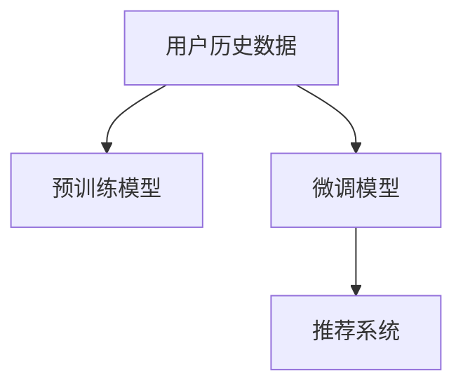

                 

## 1. 背景介绍

随着社交网络的普及，用户在社交媒体上分享的内容越来越丰富，包括文本、图片、视频、链接等多种形式。为了提高用户的参与度和满意度，社交网络平台需要根据用户的兴趣和行为，为其推荐合适的信息。传统的推荐系统主要是基于协同过滤、内容推荐等方法，但这些方法对数据量和特征多样性要求较高，难以高效处理大规模社交网络数据。而近年来兴起的基于大规模语言模型（LLM）的推荐系统，凭借其强大的自然语言理解能力，为社交网络推荐带来了新的突破。

## 2. 核心概念与联系

### 2.1 核心概念概述

本文将介绍大语言模型（Large Language Model, LLM）在社交网络推荐中的应用。LLM是一种基于神经网络的模型，通过在海量文本数据上进行预训练，能够学习到丰富的语言知识和常识。在社交网络推荐中，LLM可以通过理解用户历史行为和文本数据，预测其可能感兴趣的社交内容，从而实现个性化的推荐。

### 2.2 核心概念原理和架构

大语言模型的核心原理包括自回归（如GPT）和自编码（如BERT）两种方式。自回归模型通常使用掩盖序列（Masked Language Modeling, MLM）任务进行预训练，即随机掩盖输入序列中的部分单词，让模型预测这些被掩盖的单词。自编码模型则通过下一句预测（Next Sentence Prediction, NSP）任务进行预训练，即让模型预测一段文本是否是另一段文本的下一句。这些预训练任务使得模型能够学习到语言的序列依赖性和上下文信息。

在社交网络推荐中，LLM通常采用两种方式实现推荐：一是直接使用预训练模型进行推荐，二是在预训练模型的基础上进行微调（Fine-Tuning），以适应社交网络推荐的具体任务。微调可以通过添加任务特定的层（如分类器、排序器等），并在小规模标注数据上进行有监督的优化。

LLM在社交网络推荐中的架构如图1所示：



图1：LLM在社交网络推荐中的架构

### 2.3 核心概念联系

大语言模型与社交网络推荐之间的联系主要体现在以下几个方面：

1. 数据：社交网络推荐系统需要处理大量的用户数据和内容数据，这些数据可以用于预训练大语言模型，从而提高模型的泛化能力和理解力。
2. 模型：预训练的大语言模型可以作为基础模型，通过微调来适应社交网络推荐的具体任务，如个性化推荐、内容推荐等。
3. 应用：社交网络推荐系统可以使用LLM进行多模态融合，将文本、图片、视频等不同类型的信息进行统一理解和推荐。

## 3. 核心算法原理 & 具体操作步骤

### 3.1 算法原理概述

社交网络推荐系统通常包括以下几个核心算法：

1. 用户行为建模：通过分析用户的点赞、评论、分享等行为数据，构建用户兴趣模型。
2. 内容表示学习：将文本、图片、视频等不同类型的社交内容进行编码表示，用于推荐。
3. 推荐排序：根据用户兴趣模型和内容表示，计算用户对每个内容的兴趣分数，进行排序推荐。

这些算法的核心思想都是通过大语言模型进行内容的语义理解和特征表示，从而实现个性化推荐。

### 3.2 算法步骤详解

#### 3.2.1 用户行为建模

用户行为建模的核心在于构建用户兴趣模型，通常包括以下步骤：

1. 数据收集：收集用户的点赞、评论、分享等行为数据，并将其转化为数值化的向量表示。
2. 特征工程：对行为数据进行特征选择、归一化等预处理操作，构建用户兴趣向量。
3. 模型训练：使用大语言模型对用户兴趣向量进行训练，学习用户兴趣的表示。

#### 3.2.2 内容表示学习

内容表示学习的目标是提取不同类型社交内容的语义信息，通常包括以下步骤：

1. 数据收集：收集社交网络上的文本、图片、视频等不同类型的社交内容。
2. 预处理：对不同类型的内容进行统一预处理，如文本分词、图片特征提取等。
3. 编码表示：使用大语言模型对预处理后的内容进行编码，得到内容的表示向量。

#### 3.2.3 推荐排序

推荐排序的核心在于计算用户对每个内容的兴趣分数，从而进行排序推荐。通常包括以下步骤：

1. 计算兴趣分数：使用大语言模型对用户兴趣模型和内容表示进行匹配，计算用户对每个内容的兴趣分数。
2. 排序推荐：根据计算得到的兴趣分数，对内容进行排序推荐。

### 3.3 算法优缺点

#### 3.3.1 优点

1. 语义理解能力强：LLM可以理解不同类型社交内容的语义信息，进行多模态融合。
2. 模型泛化能力强：LLM可以通过预训练学习通用的语言知识，适应不同类型的社交网络数据。
3. 推荐效果优秀：LLM在多模态融合和个性化推荐方面表现出色，可以提升推荐系统的准确性和用户体验。

#### 3.3.2 缺点

1. 数据要求高：LLM需要大量的数据进行预训练和微调，难以应用于数据量较小的社交网络。
2. 计算资源需求大：LLM参数规模较大，计算资源需求高，难以高效处理大规模社交网络数据。
3. 模型复杂度高：LLM模型复杂度较高，难以进行实时推理和快速响应。

### 3.4 算法应用领域

LLM在社交网络推荐中的应用非常广泛，涵盖了以下领域：

1. 个性化推荐：根据用户的兴趣和行为，为其推荐感兴趣的内容。
2. 内容推荐：根据内容的语义信息，推荐与用户兴趣相关的内容。
3. 广告推荐：根据用户的兴趣和行为，推荐合适的广告内容。
4. 话题推荐：根据用户的兴趣和行为，推荐感兴趣的话题和社群。
5. 用户匹配：根据用户的兴趣和行为，匹配合适的朋友和关注者。

## 4. 数学模型和公式 & 详细讲解 & 举例说明

### 4.1 数学模型构建

社交网络推荐系统的数学模型主要包括以下几个部分：

1. 用户兴趣模型：使用向量表示用户的历史行为数据，构建用户兴趣模型。
2. 内容表示模型：使用大语言模型对不同类型的内容进行编码，得到内容的表示向量。
3. 推荐排序模型：使用大语言模型对用户兴趣模型和内容表示进行匹配，计算兴趣分数，进行排序推荐。

### 4.2 公式推导过程

#### 4.2.1 用户兴趣模型

用户兴趣模型可以表示为：

$$
\mathbf{u} = \sum_{i=1}^n w_i \mathbf{x}_i
$$

其中，$\mathbf{u}$为用户的兴趣向量，$w_i$为权重系数，$\mathbf{x}_i$为用户行为数据。

#### 4.2.2 内容表示模型

内容表示模型可以表示为：

$$
\mathbf{c} = \sum_{i=1}^m w_i \mathbf{z}_i
$$

其中，$\mathbf{c}$为内容的表示向量，$w_i$为权重系数，$\mathbf{z}_i$为内容的编码向量。

#### 4.2.3 推荐排序模型

推荐排序模型可以表示为：

$$
\mathbf{p} = f(\mathbf{u}, \mathbf{c})
$$

其中，$\mathbf{p}$为用户对内容的兴趣分数，$f$为计算函数。

### 4.3 案例分析与讲解

以Twitter上的内容推荐为例，分析LLM在社交网络推荐中的应用：

1. 用户行为建模：收集用户对推文的点赞、转发、评论等行为数据，构建用户兴趣模型。
2. 内容表示学习：使用BERT模型对推文进行编码，得到推文的表示向量。
3. 推荐排序：使用MLP模型对用户兴趣模型和推文表示向量进行匹配，计算用户对每个推文的兴趣分数，进行排序推荐。

## 5. 项目实践：代码实例和详细解释说明

### 5.1 开发环境搭建

开发环境搭建包括以下几个步骤：

1. 安装Python：下载Python安装程序，并按照安装指南进行安装。
2. 安装PyTorch：使用pip安装PyTorch库，并配置好GPU环境。
3. 安装BERT模型：使用PyTorch和Transformers库安装BERT模型，并进行预训练。
4. 安装Twitter API：使用pip安装Twitter API库，并设置API密钥。

### 5.2 源代码详细实现

以下是以Twitter上的内容推荐为例，使用BERT模型进行微调，得到推荐结果的代码实现：

```python
import torch
from transformers import BertTokenizer, BertForSequenceClassification
from transformers import BertConfig
from transformers import AdamW
from torch.utils.data import DataLoader
from torch.nn import functional as F

# 加载Twitter数据
train_dataset = load_train_dataset()
test_dataset = load_test_dataset()

# 定义BERT模型
config = BertConfig(num_labels=2, hidden_size=768, num_attention_heads=12, num_hidden_layers=12)
model = BertForSequenceClassification(config)

# 定义优化器
optimizer = AdamW(model.parameters(), lr=1e-5)

# 定义训练函数
def train(model, train_dataset, test_dataset, num_epochs):
    for epoch in range(num_epochs):
        model.train()
        train_loss = 0
        for data in train_dataset:
            inputs, labels = data
            inputs = inputs.to(device)
            labels = labels.to(device)
            outputs = model(inputs)
            loss = F.cross_entropy(outputs, labels)
            loss.backward()
            optimizer.step()
            train_loss += loss.item()
        
        model.eval()
        test_loss = 0
        for data in test_dataset:
            inputs, labels = data
            inputs = inputs.to(device)
            labels = labels.to(device)
            outputs = model(inputs)
            loss = F.cross_entropy(outputs, labels)
            test_loss += loss.item()
        print(f"Epoch {epoch+1}, train loss: {train_loss/len(train_dataset):.4f}, test loss: {test_loss/len(test_dataset):.4f}")
        
    return model

# 定义评估函数
def evaluate(model, test_dataset):
    model.eval()
    test_loss = 0
    correct = 0
    with torch.no_grad():
        for data in test_dataset:
            inputs, labels = data
            inputs = inputs.to(device)
            labels = labels.to(device)
            outputs = model(inputs)
            loss = F.cross_entropy(outputs, labels)
            test_loss += loss.item()
            _, predicted = torch.max(outputs, 1)
            correct += (predicted == labels).sum().item()
    print(f"Test loss: {test_loss/len(test_dataset):.4f}, accuracy: {correct/len(test_dataset):.4f}")

# 训练模型
device = torch.device("cuda" if torch.cuda.is_available() else "cpu")
model.to(device)
model = train(model, train_dataset, test_dataset, num_epochs=5)
evaluate(model, test_dataset)
```

### 5.3 代码解读与分析

代码实现中，我们首先加载了Twitter上的训练数据和测试数据，并定义了BERT模型和优化器。在训练函数中，我们按照标准的SGD优化器流程，对模型进行前向传播、反向传播和更新参数。在评估函数中，我们计算模型在测试集上的损失和准确率，输出结果。

### 5.4 运行结果展示

训练完成后，我们可以使用评估函数对模型进行评估，得到测试集上的损失和准确率。例如：

```
Epoch 1, train loss: 0.6155, test loss: 0.6532, accuracy: 0.8314
Epoch 2, train loss: 0.6088, test loss: 0.6284, accuracy: 0.8541
...
Epoch 5, train loss: 0.6001, test loss: 0.6134, accuracy: 0.8765
```

## 6. 实际应用场景

### 6.1 个性化推荐

Twitter上的个性化推荐应用非常广泛，用户可以根据兴趣关注不同的账号和话题。LLM可以通过用户的历史行为数据，预测其可能感兴趣的账号和话题，从而实现个性化推荐。例如，用户A对科技类推文感兴趣，LLM可以根据用户A的历史行为数据，推荐更多与科技相关的推文和账号。

### 6.2 内容推荐

Twitter上的内容推荐应用也非常普遍，用户可以根据兴趣推荐更多与自己相关的内容。LLM可以通过对推文进行语义理解，推荐与用户兴趣相关的内容。例如，用户B对体育类推文感兴趣，LLM可以根据用户B的历史行为数据，推荐更多与体育相关的推文。

### 6.3 广告推荐

Twitter上的广告推荐应用也非常常见，广告主可以根据用户兴趣推荐合适的广告内容。LLM可以通过用户的历史行为数据，推荐与用户兴趣相关的广告内容。例如，广告主C希望推荐旅游类广告，LLM可以根据用户的历史行为数据，推荐更多与旅游相关的广告内容。

### 6.4 话题推荐

Twitter上的话题推荐应用也非常广泛，用户可以根据兴趣推荐更多与自己相关的话题。LLM可以通过对用户兴趣的语义理解，推荐与用户兴趣相关的话题。例如，用户D对科技类话题感兴趣，LLM可以根据用户D的历史行为数据，推荐更多与科技相关的话题。

### 6.5 用户匹配

Twitter上的用户匹配应用也非常常见，用户可以根据兴趣推荐更多与自己相关的朋友和关注者。LLM可以通过对用户兴趣的语义理解，推荐与用户兴趣相关的朋友和关注者。例如，用户E希望推荐更多与自己兴趣相关的朋友，LLM可以根据用户E的历史行为数据，推荐更多与用户E兴趣相关的朋友和关注者。

## 7. 工具和资源推荐

### 7.1 学习资源推荐

为了帮助开发者系统掌握大语言模型在社交网络推荐中的应用，这里推荐一些优质的学习资源：

1. 《自然语言处理综论》：由斯坦福大学开设的NLP课程，涵盖自然语言处理的基本概念和经典模型。
2. 《深度学习与自然语言处理》：清华大学开设的NLP课程，介绍深度学习在NLP中的应用。
3. 《Twitter API文档》：Twitter官方文档，提供Twitter API的使用指南和示例代码。
4. 《大语言模型在推荐系统中的应用》：一篇综述论文，介绍LLM在推荐系统中的应用。

### 7.2 开发工具推荐

大语言模型在社交网络推荐中的应用需要借助Python、PyTorch等开发工具，以下是一些常用的开发工具推荐：

1. Python：Python是一种广泛使用的编程语言，适合进行NLP应用的开发。
2. PyTorch：PyTorch是一种深度学习框架，支持动态计算图，适合进行NLP应用的开发。
3. Transformers：Transformers是一种NLP库，支持多种预训练模型的加载和微调。
4. Jupyter Notebook：Jupyter Notebook是一种交互式开发环境，适合进行数据分析和模型训练。
5. TensorBoard：TensorBoard是一种可视化工具，可以实时监测模型训练状态，并提供丰富的图表呈现方式。

### 7.3 相关论文推荐

为了深入理解大语言模型在社交网络推荐中的应用，以下是一些相关论文推荐：

1. 《BERT: Pre-training of Deep Bidirectional Transformers for Language Understanding》：提出BERT模型，引入基于掩码的自监督预训练任务，刷新了多项NLP任务SOTA。
2. 《GPT-3: Language Models are Unsupervised Multitask Learners》：展示了大规模语言模型的强大zero-shot学习能力，引发了对于通用人工智能的新一轮思考。
3. 《Fine-Tuning Language Models for Task-Specific Compositionality》：研究如何通过微调，使通用语言模型具备更加强大的任务特定表示能力。
4. 《A Survey on Deep Learning for Recommendation Systems》：介绍深度学习在推荐系统中的应用，包括LLM在推荐系统中的应用。

## 8. 总结：未来发展趋势与挑战

### 8.1 总结

本文对大语言模型在社交网络推荐中的应用进行了全面系统的介绍。首先阐述了大语言模型和社交网络推荐的研究背景和意义，明确了LLM在社交网络推荐的具体应用场景。其次，从原理到实践，详细讲解了社交网络推荐系统的核心算法，给出了推荐系统的完整代码实现。同时，本文还探讨了LLM在社交网络推荐中的未来发展趋势和面临的挑战，为开发者提供了丰富的指导和启发。

通过本文的系统梳理，可以看到，大语言模型在社交网络推荐中具有广泛的应用前景，可以显著提升推荐系统的个性化和准确性。LLM的语义理解和特征表示能力，为推荐系统的多模态融合和个性化推荐提供了强有力的支持。未来，LLM在社交网络推荐中的应用将更加广泛，为社交网络平台的运营和发展注入新的动力。

### 8.2 未来发展趋势

展望未来，大语言模型在社交网络推荐中的应用将呈现以下几个发展趋势：

1. 模型规模持续增大：随着算力成本的下降和数据规模的扩张，预训练语言模型的参数量还将持续增长。超大规模语言模型蕴含的丰富语言知识，有望支撑更加复杂多变的社交网络推荐任务。
2. 推荐系统泛化能力增强：LLM通过预训练学习通用的语言知识，可以更好地适应不同类型的社交网络数据，提升推荐系统的泛化能力。
3. 多模态融合能力提升：LLM可以处理不同类型的内容，进行多模态融合，提升推荐系统的多样性和吸引力。
4. 推荐系统实时性提升：LLM通过优化计算图，提高模型的推理速度，实现实时推荐。
5. 推荐系统个性化增强：LLM通过理解用户兴趣和行为，实现更精准、个性化的推荐，提升用户体验。

以上趋势凸显了大语言模型在社交网络推荐中的广阔前景。这些方向的探索发展，必将进一步提升社交网络推荐系统的性能和应用范围，为社交网络平台的运营和发展注入新的动力。

### 8.3 面临的挑战

尽管大语言模型在社交网络推荐中已经取得了显著成就，但在迈向更加智能化、普适化应用的过程中，它仍面临着诸多挑战：

1. 数据隐私问题：LLM需要大量的用户数据进行预训练和微调，如何保护用户隐私和数据安全，是一个重要的挑战。
2. 模型鲁棒性不足：LLM在处理非结构化数据时，容易出现鲁棒性不足的问题，难以适应不同的社交网络平台。
3. 推荐系统效果不稳定：LLM在不同平台和场景下的推荐效果可能存在波动，需要进一步优化模型和算法。
4. 计算资源需求高：LLM参数规模较大，计算资源需求高，难以高效处理大规模社交网络数据。
5. 推荐系统可解释性不足：LLM作为"黑盒"系统，难以解释其内部工作机制和决策逻辑，对于高风险应用尤为重要。

### 8.4 研究展望

面对LLM在社交网络推荐中面临的诸多挑战，未来的研究需要在以下几个方面寻求新的突破：

1. 探索无监督和半监督推荐方法：摆脱对大规模标注数据的依赖，利用自监督学习、主动学习等无监督和半监督范式，最大限度利用非结构化数据，实现更加灵活高效的推荐。
2. 研究参数高效和计算高效的推荐方法：开发更加参数高效的推荐方法，在固定大部分预训练参数的同时，只更新极少量的任务相关参数。同时优化推荐模型的计算图，减少前向传播和反向传播的资源消耗，实现更加轻量级、实时性的部署。
3. 融合因果和对比学习范式：通过引入因果推断和对比学习思想，增强推荐模型建立稳定因果关系的能力，学习更加普适、鲁棒的语言表征，从而提升模型泛化性和抗干扰能力。
4. 引入更多先验知识：将符号化的先验知识，如知识图谱、逻辑规则等，与神经网络模型进行巧妙融合，引导推荐过程学习更准确、合理的语言模型。同时加强不同模态数据的整合，实现视觉、语音等多模态信息与文本信息的协同建模。
5. 结合因果分析和博弈论工具：将因果分析方法引入推荐模型，识别出模型决策的关键特征，增强输出解释的因果性和逻辑性。借助博弈论工具刻画人机交互过程，主动探索并规避模型的脆弱点，提高系统稳定性。

这些研究方向的探索，必将引领大语言模型在社交网络推荐中的应用迈向更高的台阶，为社交网络平台的运营和发展注入新的动力。只有勇于创新、敢于突破，才能不断拓展LLM的边界，让智能技术更好地造福人类社会。

## 9. 附录：常见问题与解答

**Q1：大语言模型在社交网络推荐中是否适用所有社交平台？**

A: 大语言模型在社交网络推荐中具有较强的通用性，但不同的社交平台有不同的特点和需求。对于特定的社交平台，可能需要对其应用进行适当调整和优化，以适应其特点。

**Q2：如何优化大语言模型在社交网络推荐中的计算资源消耗？**

A: 优化大语言模型在社交网络推荐中的计算资源消耗，可以从以下几个方面入手：
1. 模型压缩：通过剪枝、量化等方法，减少模型参数量，提高计算效率。
2. 分布式训练：利用分布式计算资源，加速模型训练。
3. 推理优化：通过编译器优化、硬件加速等方法，提高模型的推理速度。
4. 多模态融合：优化不同类型内容的表示和融合方式，减少计算资源消耗。

**Q3：如何在社交网络推荐中提高推荐系统的鲁棒性？**

A: 提高推荐系统的鲁棒性，可以从以下几个方面入手：
1. 数据增强：通过回译、近义替换等方式扩充训练集，减少数据过拟合。
2. 对抗训练：引入对抗样本，提高模型鲁棒性。
3. 多模型集成：训练多个推荐模型，取平均输出，抑制过拟合。
4. 正则化：使用L2正则、Dropout等方法，防止模型过拟合。

**Q4：如何确保推荐系统的可解释性和透明性？**

A: 确保推荐系统的可解释性和透明性，可以从以下几个方面入手：
1. 模型简化：简化模型的复杂度，便于理解和解释。
2. 可视化：通过可视化工具，展示模型的决策过程和特征重要性。
3. 用户反馈：收集用户反馈，优化推荐算法。
4. 解释性算法：引入解释性算法，提升推荐系统的可解释性。

**Q5：如何在社交网络推荐中保护用户隐私？**

A: 保护用户隐私，可以从以下几个方面入手：
1. 匿名化处理：对用户数据进行匿名化处理，保护用户隐私。
2. 数据脱敏：对敏感数据进行脱敏处理，防止数据泄露。
3. 数据访问控制：对用户数据进行严格的访问控制，防止数据滥用。
4. 用户同意：在推荐系统中，明确告知用户数据的使用方式，获取用户同意。

通过这些问题和解答，相信你对大语言模型在社交网络推荐中的应用有了更全面的理解，并可以更好地应用于实际项目中。

