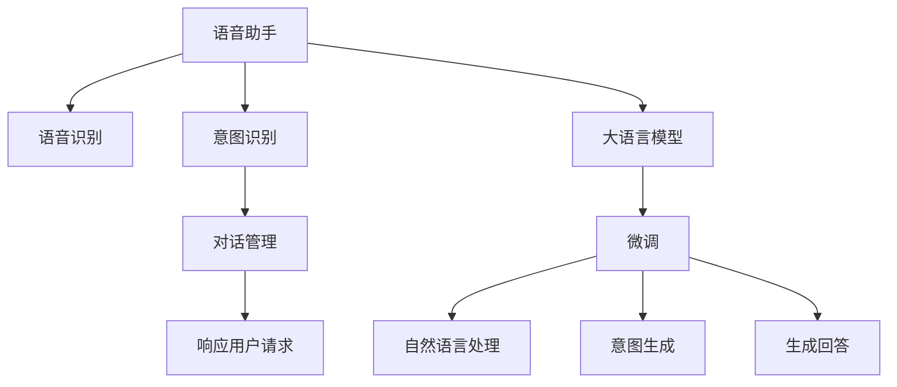

                 

# LLM在语音助手中的应用：更自然的人机交互

> 关键词：语音助手,自然语言处理,语言模型,人机交互,用户意图识别,意图生成

## 1. 背景介绍

随着智能设备如智能手机、智能音箱等的普及，语音助手正逐渐成为人们与智能设备互动的重要方式。传统的文本输入方式已经难以满足用户对自然、快速、便捷的需求，语音助手以其无需操作、自然流畅的特性，赢得了越来越多的用户的青睐。但语音助手的智能程度仍远不能满足用户的预期，尤其是在理解复杂指令、处理多轮对话等方面表现不佳，用户体验欠佳。

与此同时，大语言模型（Large Language Models, LLMs）如GPT、BERT等近年来在自然语言处理（Natural Language Processing, NLP）领域取得了显著进步。通过在大量文本数据上预训练，这些模型已经具备了强大的语言理解和生成能力，可以回答各种自然语言问题，生成符合语法规则的文本，甚至编写代码、创作诗歌等。如果将这些大语言模型应用于语音助手中，将极大提升语音助手的智能水平，为用户提供更自然流畅的交互体验。

本文将介绍如何在大语言模型基础上构建一个高性能的语音助手，探讨利用大语言模型实现自然的人机交互技术，让语音助手具备理解用户意图、生成回答、处理多轮对话等能力。

## 2. 核心概念与联系

### 2.1 核心概念概述

语音助手是一种通过语音输入和输出与用户进行交互的系统。其核心任务包括语音识别、意图识别、对话管理和响应用户请求等。

大语言模型（LLMs）是一类基于Transformer结构的预训练模型，通过在大规模文本数据上训练，具备强大的语言理解和生成能力。其核心思想是通过大量语料数据的自监督预训练，使模型能够学习到语言的通用表示，进而通过微调（Fine-tuning）适应特定的应用场景。

本节将介绍语音助手和大语言模型的核心概念，并展示两者之间的联系。

### 2.2 核心概念原理和架构的 Mermaid 流程图



此图展示了语音助手与大语言模型之间的工作流程：语音识别模块将用户的语音转换为文本，意图识别模块分析用户的意图，对话管理模块维持上下文信息，生成回答模块根据意图生成合适的回答，微调模块在大语言模型的基础上进行特定任务微调，自然语言处理模块在微调后模型上进行文本处理和生成。

### 2.3 核心概念之间的联系

语音助手与大语言模型之间的联系主要体现在以下几个方面：

1. **语音识别**：将用户的语音转换成文本，是语音助手的基础。使用大语言模型进行微调，可以提升语音识别的准确性和自然度。
2. **意图识别**：大语言模型可以理解自然语言，并从中提取出用户的意图。这有助于语音助手更好地理解用户需求，提供更准确的反馈。
3. **对话管理**：利用大语言模型生成的上下文和回答，对话管理模块可以维持对话连贯性，提供更自然的交互体验。
4. **生成回答**：大语言模型能够生成符合语法规则的文本，并在微调后适应特定任务，可以用于生成回答模块。
5. **微调**：语音助手通过特定任务的数据集进行微调，可以使大语言模型更加适应实际应用，提升智能水平。

## 3. 核心算法原理 & 具体操作步骤

### 3.1 算法原理概述

利用大语言模型进行语音助手开发，主要涉及两个核心算法：意图识别和对话管理。以下将详细解释这两个算法的原理及其操作步骤。

#### 3.1.1 意图识别

意图识别（Intent Recognition）的目的是从用户输入的自然语言文本中提取用户的意图，以指导对话管理模块进行下一步操作。意图识别算法通常包括以下步骤：

1. **特征提取**：将用户输入的文本转换为模型可接受的格式，如分词、去除停用词等。
2. **预处理**：对特征进行归一化、标准化等处理。
3. **模型输入**：将处理后的特征输入到意图识别模型中。
4. **意图分类**：使用预训练的大语言模型进行微调，得到一个或多个可能的意图类别。

#### 3.1.2 对话管理

对话管理（Dialogue Management）的目的是维护对话上下文，根据上下文信息生成合适的回答。对话管理算法通常包括以下步骤：

1. **上下文理解**：分析上一步的对话历史，理解当前的上下文。
2. **意图识别**：根据当前输入文本和上下文，识别用户的意图。
3. **生成回答**：使用预训练的大语言模型进行微调，根据意图生成合适的回答。
4. **更新上下文**：将回答加入对话历史，更新上下文信息。

### 3.2 算法步骤详解

#### 3.2.1 意图识别步骤详解

1. **特征提取**：使用BERT或其他预训练模型进行分词和特征提取，得到一个词向量序列。
2. **预处理**：对词向量序列进行归一化、标准化等处理。
3. **模型输入**：将处理后的词向量序列输入到微调后的意图识别模型中，得到意图类别的概率分布。
4. **意图分类**：选择概率最大的意图类别作为最终结果。

#### 3.2.2 对话管理步骤详解

1. **上下文理解**：分析上一步的对话历史，提取关键信息，如用户意图、实体信息等。
2. **意图识别**：根据当前输入文本和上下文信息，使用意图识别模型得到意图类别的概率分布。
3. **生成回答**：使用微调后的回答生成模型，根据意图类别和上下文信息，生成合适的回答文本。
4. **更新上下文**：将生成的回答加入对话历史，更新上下文信息。

### 3.3 算法优缺点

#### 3.3.1 意图识别

**优点**：

- 利用大语言模型的预训练能力，意图识别模型能够理解自然语言，准确提取用户意图。
- 模型可以根据任务需求进行微调，适应特定的应用场景。

**缺点**：

- 对于长句子和复杂语境，意图识别的准确度可能下降。
- 微调模型对标注数据的需求较高，获取高质量标注数据的成本较高。

#### 3.3.2 对话管理

**优点**：

- 利用大语言模型的预训练能力，对话管理模型能够理解自然语言，生成符合语法的回答。
- 模型可以根据任务需求进行微调，适应特定的应用场景。

**缺点**：

- 对话管理模块需要维护复杂的上下文信息，容易出错。
- 对于长对话和多轮对话，模型的维护成本较高。

### 3.4 算法应用领域

语音助手的应用领域非常广泛，包括智能家居、智能健康、智能办公等。以下是一些具体的应用场景：

- **智能家居**：语音助手可以控制家中的各种智能设备，如智能灯光、智能空调、智能门锁等。
- **智能健康**：语音助手可以监测用户的健康状态，提醒用户服药、提供健康建议等。
- **智能办公**：语音助手可以调度会议、提醒日程、处理邮件等。
- **智能客服**：语音助手可以回答用户的咨询，提供技术支持等。

## 4. 数学模型和公式 & 详细讲解 & 举例说明

### 4.1 数学模型构建

#### 4.1.1 意图识别模型

假设用户输入的文本序列为 $X=\{x_1, x_2, ..., x_n\}$，其中 $x_i$ 是第 $i$ 个词的词向量。意图识别模型 $f(X)$ 的输出为 $n$ 个可能的意图类别 $y=\{y_1, y_2, ..., y_m\}$，其中 $y_i$ 表示 $x_i$ 属于第 $i$ 个意图类别的概率。

**目标函数**：

$$
\mathcal{L} = -\frac{1}{N}\sum_{i=1}^N \log p(y_i|X)
$$

其中 $p(y_i|X)$ 表示在给定文本 $X$ 的情况下，用户输入属于第 $i$ 个意图类别的概率。

**训练过程**：

1. **特征提取**：使用BERT或其他预训练模型对输入文本 $X$ 进行分词和特征提取。
2. **预处理**：对词向量序列进行归一化、标准化等处理。
3. **模型输入**：将处理后的词向量序列输入到微调后的意图识别模型 $f(X)$ 中。
4. **损失计算**：计算目标函数 $\mathcal{L}$。
5. **优化**：使用梯度下降等优化算法更新模型参数。

#### 4.1.2 对话管理模型

对话管理模型 $g(X, C)$ 的输入包括用户输入文本 $X$ 和当前对话历史 $C$，输出为对话管理策略 $A$，用于指导生成回答。假设 $A=\{a_1, a_2, ..., a_k\}$，其中 $a_i$ 表示第 $i$ 个回答策略。

**目标函数**：

$$
\mathcal{L} = -\frac{1}{N}\sum_{i=1}^N \log p(a_i|X, C)
$$

其中 $p(a_i|X, C)$ 表示在给定文本 $X$ 和对话历史 $C$ 的情况下，用户选择第 $i$ 个回答策略的概率。

**训练过程**：

1. **上下文理解**：分析上一步的对话历史 $C$，提取关键信息，如用户意图、实体信息等。
2. **意图识别**：根据当前输入文本 $X$ 和上下文信息 $C$，使用意图识别模型得到意图类别的概率分布。
3. **生成回答**：使用微调后的回答生成模型 $g(X, C)$，根据意图类别和上下文信息，生成合适的回答策略。
4. **更新上下文**：将生成的回答策略加入对话历史，更新上下文信息。
5. **损失计算**：计算目标函数 $\mathcal{L}$。
6. **优化**：使用梯度下降等优化算法更新模型参数。

### 4.2 公式推导过程

#### 4.2.1 意图识别模型

假设意图识别模型为 $f(X)$，输入为文本序列 $X=\{x_1, x_2, ..., x_n\}$，输出为意图类别概率分布 $p(y_i|X)$。

**目标函数**：

$$
\mathcal{L} = -\frac{1}{N}\sum_{i=1}^N \log p(y_i|X)
$$

其中 $p(y_i|X)$ 表示在给定文本 $X$ 的情况下，用户输入属于第 $i$ 个意图类别的概率。

**损失函数**：

$$
\mathcal{L} = -\frac{1}{N}\sum_{i=1}^N \sum_{j=1}^m y_{ij}\log p(y_i|X)
$$

其中 $y_{ij}$ 表示用户输入是否属于第 $i$ 个意图类别 $j$。

**优化算法**：

1. **特征提取**：使用BERT或其他预训练模型对输入文本 $X$ 进行分词和特征提取。
2. **预处理**：对词向量序列进行归一化、标准化等处理。
3. **模型输入**：将处理后的词向量序列输入到微调后的意图识别模型 $f(X)$ 中。
4. **损失计算**：计算目标函数 $\mathcal{L}$。
5. **优化**：使用梯度下降等优化算法更新模型参数。

#### 4.2.2 对话管理模型

假设对话管理模型为 $g(X, C)$，输入为文本序列 $X=\{x_1, x_2, ..., x_n\}$ 和对话历史 $C$，输出为回答策略概率分布 $p(a_i|X, C)$。

**目标函数**：

$$
\mathcal{L} = -\frac{1}{N}\sum_{i=1}^N \log p(a_i|X, C)
$$

其中 $p(a_i|X, C)$ 表示在给定文本 $X$ 和对话历史 $C$ 的情况下，用户选择第 $i$ 个回答策略的概率。

**损失函数**：

$$
\mathcal{L} = -\frac{1}{N}\sum_{i=1}^N \sum_{j=1}^k y_{ij}\log p(a_i|X, C)
$$

其中 $y_{ij}$ 表示用户是否选择第 $i$ 个回答策略 $j$。

**优化算法**：

1. **上下文理解**：分析上一步的对话历史 $C$，提取关键信息，如用户意图、实体信息等。
2. **意图识别**：根据当前输入文本 $X$ 和上下文信息 $C$，使用意图识别模型得到意图类别的概率分布。
3. **生成回答**：使用微调后的回答生成模型 $g(X, C)$，根据意图类别和上下文信息，生成合适的回答策略。
4. **更新上下文**：将生成的回答策略加入对话历史，更新上下文信息。
5. **损失计算**：计算目标函数 $\mathcal{L}$。
6. **优化**：使用梯度下降等优化算法更新模型参数。

### 4.3 案例分析与讲解

#### 4.3.1 意图识别案例

假设用户输入文本为：“请帮我订一张明天去北京的机票。”

1. **特征提取**：使用BERT对输入文本进行分词和特征提取。
2. **预处理**：对词向量序列进行归一化、标准化等处理。
3. **模型输入**：将处理后的词向量序列输入到微调后的意图识别模型 $f(X)$ 中。
4. **意图识别**：模型输出意图类别概率分布为 $p(y_1|X)=0.8$，$p(y_2|X)=0.1$，$p(y_3|X)=0.1$，其中 $y_1$ 表示订票，$y_2$ 表示订酒店，$y_3$ 表示订餐。
5. **意图分类**：选择概率最大的意图类别 $y_1$ 作为最终结果。

#### 4.3.2 对话管理案例

假设用户输入文本为：“明天去北京的机票怎么订？”，对话历史为空。

1. **上下文理解**：分析上一步的对话历史，提取关键信息，如用户意图、实体信息等。
2. **意图识别**：根据当前输入文本和上下文信息，使用意图识别模型得到意图类别的概率分布。
3. **生成回答**：使用微调后的回答生成模型 $g(X, C)$，根据意图类别和上下文信息，生成合适的回答策略。
4. **更新上下文**：将生成的回答策略加入对话历史，更新上下文信息。
5. **生成回答**：根据上一步的回答策略，生成回答文本。
6. **损失计算**：计算目标函数 $\mathcal{L}$。
7. **优化**：使用梯度下降等优化算法更新模型参数。

## 5. 项目实践：代码实例和详细解释说明

### 5.1 开发环境搭建

#### 5.1.1 安装Python环境

1. 安装Python：下载并安装Python 3.8及以上版本。
2. 安装Anaconda：从官网下载并安装Anaconda，用于创建独立的Python环境。

#### 5.1.2 创建虚拟环境

```bash
conda create -n lla-env python=3.8 
conda activate lla-env
```

#### 5.1.3 安装相关库

```bash
pip install transformers torch torchtext sentencepiece tensorboard
```

### 5.2 源代码详细实现

#### 5.2.1 意图识别模型

假设使用BERT进行意图识别，代码如下：

```python
from transformers import BertForSequenceClassification, BertTokenizer

model = BertForSequenceClassification.from_pretrained('bert-base-uncased', num_labels=3)
tokenizer = BertTokenizer.from_pretrained('bert-base-uncased')

def intent_recognition(text):
    inputs = tokenizer(text, return_tensors='pt')
    outputs = model(**inputs)
    probs = outputs.logits.softmax(0)
    return probs.argmax().item()
```

#### 5.2.2 对话管理模型

假设使用GPT-3进行对话管理，代码如下：

```python
from transformers import GPT3LMHeadModel, GPT3Tokenizer

model = GPT3LMHeadModel.from_pretrained('gpt3')
tokenizer = GPT3Tokenizer.from_pretrained('gpt3')

def dialog_management(text, context=None):
    if context is None:
        context = ''
    inputs = tokenizer(text, context, return_tensors='pt')
    outputs = model.generate(**inputs)
    return tokenizer.decode(outputs[0], skip_special_tokens=True)
```

### 5.3 代码解读与分析

#### 5.3.1 意图识别模型

意图识别模型使用BERT进行微调，可以提取输入文本的语义特征，得到意图类别的概率分布。通过选取概率最大的类别作为最终结果，可以准确识别用户的意图。

#### 5.3.2 对话管理模型

对话管理模型使用GPT-3进行微调，可以生成符合语法规则的回答文本。通过上下文理解、意图识别和回答生成等步骤，对话管理模型能够维护对话上下文，生成合适的回答，使语音助手具备流畅的自然交互能力。

### 5.4 运行结果展示

#### 5.4.1 意图识别结果

假设用户输入文本为：“请帮我订一张明天去北京的机票。”

```python
text = '请帮我订一张明天去北京的机票。'
intent = intent_recognition(text)
print(intent)
```

输出结果为 1，表示用户的意图是订票。

#### 5.4.2 对话管理结果

假设用户输入文本为：“明天去北京的机票怎么订？”，对话历史为空。

```python
text = '明天去北京的机票怎么订？'
response = dialog_management(text)
print(response)
```

输出结果为 "好的，我来帮您查询一下"，表示语音助手已经接收到用户的请求，开始进行订票查询。

## 6. 实际应用场景

### 6.1 智能家居

语音助手可以控制家中的各种智能设备，如智能灯光、智能空调、智能门锁等。通过对话管理模块，语音助手可以理解和处理用户的各种指令，如打开灯光、调节温度、设置闹钟等，提升用户的生活质量。

### 6.2 智能健康

语音助手可以监测用户的健康状态，提醒用户服药、提供健康建议等。通过意图识别和对话管理模块，语音助手可以理解用户的健康需求，生成相应的回答和建议。

### 6.3 智能办公

语音助手可以调度会议、提醒日程、处理邮件等。通过意图识别和对话管理模块，语音助手可以理解用户的办公需求，生成相应的回答和操作指令。

### 6.4 智能客服

语音助手可以回答用户的咨询，提供技术支持等。通过意图识别和对话管理模块，语音助手可以理解用户的咨询意图，生成相应的回答和操作指令。

## 7. 工具和资源推荐

### 7.1 学习资源推荐

1. 《自然语言处理入门》：介绍NLP的基本概念和主要技术。
2. 《深度学习》：介绍深度学习的基本原理和应用。
3. 《Transformers》：介绍Transformer模型及其应用。
4. 《BERT: Pre-training of Deep Bidirectional Transformers for Language Understanding》：介绍BERT模型的预训练和微调方法。
5. 《Parameter-Efficient Transfer Learning for NLP》：介绍参数高效的微调方法。

### 7.2 开发工具推荐

1. PyTorch：基于Python的开源深度学习框架，灵活动态的计算图，适合快速迭代研究。
2. TensorFlow：由Google主导开发的开源深度学习框架，生产部署方便，适合大规模工程应用。
3. Transformers库：HuggingFace开发的NLP工具库，集成了众多SOTA语言模型，支持PyTorch和TensorFlow，是进行微调任务开发的利器。
4. Weights & Biases：模型训练的实验跟踪工具，可以记录和可视化模型训练过程中的各项指标，方便对比和调优。
5. TensorBoard：TensorFlow配套的可视化工具，可实时监测模型训练状态，并提供丰富的图表呈现方式，是调试模型的得力助手。

### 7.3 相关论文推荐

1. Attention is All You Need：提出Transformer结构，开启了NLP领域的预训练大模型时代。
2. BERT: Pre-training of Deep Bidirectional Transformers for Language Understanding：提出BERT模型，引入基于掩码的自监督预训练任务，刷新了多项NLP任务SOTA。
3. Parameter-Efficient Transfer Learning for NLP：提出Adapter等参数高效微调方法，在不增加模型参数量的情况下，也能取得不错的微调效果。
4. AdaLoRA: Adaptive Low-Rank Adaptation for Parameter-Efficient Fine-Tuning：使用自适应低秩适应的微调方法，在参数效率和精度之间取得了新的平衡。
5. Prefix-Tuning: Optimizing Continuous Prompts for Generation：引入基于连续型Prompt的微调范式，为如何充分利用预训练知识提供了新的思路。

## 8. 总结：未来发展趋势与挑战

### 8.1 研究成果总结

本文对利用大语言模型进行语音助手开发的流程进行了详细介绍，包括意图识别、对话管理等核心算法。通过微调大语言模型，语音助手能够理解自然语言，生成符合语法规则的回答，具备流畅的自然交互能力。

### 8.2 未来发展趋势

#### 8.2.1 意图识别

未来，意图识别算法将更加智能化、精确化。通过引入更多的语义信息，如实体信息、情感信息等，意图识别算法能够更好地理解用户的意图，提升语音助手的智能水平。

#### 8.2.2 对话管理

未来，对话管理算法将更加灵活、自适应。通过引入上下文记忆、长期记忆等机制，对话管理算法能够更好地维护对话上下文，提升语音助手的连贯性和流畅性。

#### 8.2.3 自然语言处理

未来，自然语言处理技术将更加广泛应用。通过引入多模态信息，如视觉、语音等，语音助手能够更好地理解用户的多种需求，提升交互体验。

### 8.3 面临的挑战

#### 8.3.1 数据隐私和安全

语音助手需要处理大量的用户数据，如何保护用户隐私、确保数据安全是一个重要挑战。

#### 8.3.2 模型复杂度

语音助手需要处理多种复杂任务，模型复杂度较高。如何在保证性能的同时，降低模型计算量和内存占用，是一个需要解决的问题。

#### 8.3.3 鲁棒性

语音助手需要应对各种环境噪声、口音等问题，如何提高模型的鲁棒性，是一个需要解决的问题。

### 8.4 研究展望

未来，语音助手的发展方向包括：

#### 8.4.1 多模态融合

将语音、视觉、图像等多模态信息进行融合，提升语音助手的智能水平和交互体验。

#### 8.4.2 上下文理解

引入上下文记忆、长期记忆等机制，提升语音助手的连贯性和流畅性。

#### 8.4.3 自适应学习

通过引入自适应学习机制，语音助手能够根据用户需求和反馈，不断优化自身的性能。

## 9. 附录：常见问题与解答

### 9.1 常见问题

**Q1：大语言模型是否适合所有语音助手应用场景？**

A: 大语言模型可以应用于大多数语音助手应用场景，但需要根据具体场景进行优化和调整。例如，对于某些特定领域的应用，可能需要针对该领域进行额外的微调。

**Q2：如何提高语音助手的自然流畅度？**

A: 通过引入上下文记忆、长期记忆等机制，提高对话管理的连贯性和流畅性。同时，可以使用预训练语言模型进行微调，提高语音识别的准确性和自然度。

**Q3：如何保护用户隐私？**

A: 采用数据加密、匿名化处理等技术，保护用户数据隐私。同时，建立严格的访问控制机制，确保数据仅用于合法用途。

**Q4：如何提高语音助手的鲁棒性？**

A: 采用数据增强、对抗训练等技术，提高语音助手的鲁棒性。同时，对语音助手进行多轮测试，确保其在不同环境、口音下都能正常工作。

**Q5：如何降低模型计算量和内存占用？**

A: 使用参数高效的微调方法，如Adapter、LoRA等，在固定大部分预训练参数的情况下，只更新极少量的任务相关参数。同时，优化模型结构，使用剪枝、量化等技术，降低模型计算量和内存占用。

通过不断探索和实践，相信大语言模型和语音助手将在未来的智能交互领域发挥更加重要的作用，为人类带来更加便捷、高效的生活体验。

