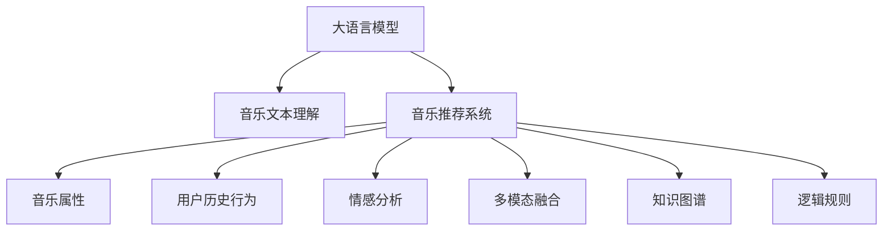

                 

# LLM在音乐推荐中的创新应用

> 关键词：大语言模型(Large Language Model, LLM),音乐推荐系统,自然语言处理(NLP),多模态融合,用户行为分析

## 1. 背景介绍

### 1.1 问题由来
音乐推荐系统是互联网领域的重要应用之一，旨在为用户推荐其可能喜欢的音乐内容。随着数字音乐市场的繁荣，音乐推荐系统的需求日益增长。然而，传统的音乐推荐系统往往基于用户的听歌历史、评分等静态数据，难以捕捉用户多样化的音乐兴趣和情感变化。

近年来，大语言模型(Large Language Model, LLM)在自然语言处理(Natural Language Processing, NLP)领域取得了巨大成功，其在理解自然语言上下文、生成高质量文本等方面的能力令人瞩目。这些语言模型不仅能够生成文本，还能通过上下文感知能力，理解和生成具有复杂语义的文本。将大语言模型引入音乐推荐系统中，通过文本理解来挖掘用户的情感和兴趣，可以极大地提升推荐系统的智能化水平。

### 1.2 问题核心关键点
本文聚焦于大语言模型在音乐推荐系统中的应用，具体包括：
1. 通过大语言模型进行音乐文本理解和情感分析，挖掘用户的音乐兴趣和情感变化。
2. 将音乐推荐任务转化为文本生成任务，提升推荐系统的多模态融合能力。
3. 利用多模态融合技术，结合音乐属性、用户历史行为和情感分析结果，生成个性化的音乐推荐列表。
4. 探索如何结合知识图谱、逻辑规则等外部知识，进一步提升推荐系统的准确性和鲁棒性。
5. 讨论基于大语言模型的音乐推荐系统面临的挑战，提出未来的发展方向。

## 2. 核心概念与联系

### 2.1 核心概念概述

为了更好地理解大语言模型在音乐推荐中的应用，本节将介绍几个核心概念：

- 大语言模型(Large Language Model, LLM)：以自回归(如GPT)或自编码(如BERT)模型为代表的大规模预训练语言模型。通过在大规模无标签文本语料上进行预训练，学习通用的语言表示，具备强大的语言理解和生成能力。

- 音乐推荐系统(Music Recommendation System)：利用用户的历史听歌行为、评分、时间、设备等数据，结合音乐的属性信息，为用户推荐可能喜欢的音乐内容。

- 文本生成(Text Generation)：利用大语言模型生成自然语言文本，应用于音乐评论、歌词生成、摘要等任务。

- 多模态融合(Multimodal Fusion)：将不同模态的数据(如文本、图像、音频)融合到统一模型中进行处理，提升系统性能和泛化能力。

- 情感分析(Emotion Analysis)：通过文本情感分析技术，挖掘用户对音乐的情感倾向，用于音乐推荐和定制化音乐内容。

- 知识图谱(Knowledge Graph)：用于描述实体间关系的图结构，可以应用于音乐推荐中的音乐元数据、艺术家信息、流派关系等。

- 逻辑规则(Logic Rules)：用于约束和指导音乐推荐系统的推理过程，提高推荐结果的合理性和可解释性。

这些核心概念之间的逻辑关系可以通过以下Mermaid流程图来展示：



这个流程图展示了大语言模型在音乐推荐中的核心概念及其之间的关系：

1. 大语言模型通过预训练获得语言理解能力。
2. 音乐文本理解挖掘音乐评论、歌词等文本中的情感和信息。
3. 音乐推荐系统将文本信息与音乐属性、用户行为等融合，生成个性化推荐。
4. 情感分析挖掘用户对音乐的情感倾向，增强推荐系统的个性化。
5. 多模态融合结合音乐属性、文本和用户行为，提升推荐系统的全面性。
6. 知识图谱和逻辑规则用于增强推荐系统的理性和可解释性。

## 3. 核心算法原理 & 具体操作步骤
### 3.1 算法原理概述

基于大语言模型的音乐推荐系统，通过文本理解和情感分析挖掘用户对音乐的情感和兴趣，将音乐推荐任务转化为文本生成任务。具体而言，算法流程如下：

1. 收集音乐文本数据：包括歌曲评论、歌词、音乐介绍等。
2. 预训练大语言模型：利用无监督学习方法对音乐文本进行预训练，学习语言表示。
3. 文本情感分析：通过情感分析技术，挖掘用户对音乐的情感倾向。
4. 音乐推荐：结合音乐属性、用户行为和情感分析结果，生成个性化推荐列表。

### 3.2 算法步骤详解

下面详细介绍基于大语言模型的音乐推荐系统核心算法步骤：

**Step 1: 收集音乐文本数据**

- 收集与每首歌曲相关的文本数据，如歌词、评论、简介等。
- 使用Python爬虫工具自动化抓取在线音乐平台上的音乐数据。
- 对文本进行预处理，包括分词、去停用词、去除HTML标签等。

**Step 2: 预训练大语言模型**

- 选择预训练大语言模型作为初始化参数，如BERT、GPT等。
- 对音乐文本数据进行预训练，学习语言表示。
- 使用无监督学习方法，如掩码语言模型、下划线语言模型等，训练大语言模型。

**Step 3: 文本情感分析**

- 对收集到的音乐文本数据进行情感分析，挖掘用户对音乐的情感倾向。
- 使用情感分析技术，如VADER、TextBlob等，计算文本的情感极性和强度。
- 将情感分析结果与用户历史行为结合，分析用户的情感变化和趋势。

**Step 4: 音乐推荐**

- 结合音乐属性、用户行为和情感分析结果，生成个性化推荐列表。
- 使用协同过滤、矩阵分解等算法，结合用户历史行为数据和音乐属性信息。
- 将音乐推荐任务转化为文本生成任务，利用大语言模型生成推荐结果。
- 优化推荐算法，结合多模态融合技术，提升推荐系统的性能。

**Step 5: 模型评估与迭代优化**

- 在测试集上评估推荐系统的性能，对比基线模型和改进模型的效果。
- 利用交叉验证等方法，优化推荐系统的超参数，提升模型效果。
- 持续收集用户反馈，调整推荐模型和算法，进一步提升推荐质量。

### 3.3 算法优缺点

基于大语言模型的音乐推荐系统具有以下优点：
1. 挖掘用户情感和兴趣：大语言模型具备强大的文本理解能力，能够挖掘用户对音乐的情感和兴趣，提升推荐系统的个性化水平。
2. 融合多模态数据：结合音乐属性、用户行为和文本数据，提高推荐系统的全面性和准确性。
3. 多模态融合技术：将文本、音乐属性和用户行为融合到统一模型中进行处理，提升推荐系统的泛化能力。
4. 动态调整推荐策略：利用用户的即时反馈和情感变化，动态调整推荐策略，满足用户即时需求。

同时，该方法也存在以下局限性：
1. 数据需求量较大：需要大量的音乐文本数据进行预训练和情感分析，获取数据成本较高。
2. 文本情感分析难度：情感分析结果可能存在误判，影响推荐系统的准确性。
3. 算法复杂度较高：融合多模态数据和文本生成任务，算法复杂度较高，需要更多的计算资源。
4. 实时性要求高：文本生成和情感分析需要一定的时间，实时性要求较高的场景可能难以满足。

尽管存在这些局限性，但就目前而言，基于大语言模型的音乐推荐方法仍然是一种高效、智能的推荐方式，值得进一步探索和应用。

### 3.4 算法应用领域

基于大语言模型的音乐推荐系统已经在多个领域得到了应用，例如：

1. **在线音乐平台**：如Spotify、Apple Music、网易云音乐等，利用推荐系统提升用户体验，增加用户黏性。
2. **电视音乐推荐**：如Netflix等流媒体平台，为用户提供个性化的音乐推荐，丰富用户体验。
3. **音乐节和演出**：通过推荐系统，预测用户的音乐偏好，为用户推荐合适的音乐节和演出活动。
4. **广告营销**：利用推荐系统，精准投放音乐广告，提升广告效果和用户转化率。
5. **教育培训**：通过音乐推荐系统，推荐适合用户学习风格的音乐，提升教育效果。

除了上述这些经典应用外，大语言模型在音乐推荐领域的应用还在不断扩展，为音乐产业带来了新的发展机遇。

## 4. 数学模型和公式 & 详细讲解 & 举例说明
### 4.1 数学模型构建

为了更好地理解基于大语言模型的音乐推荐系统，本节将介绍几个关键数学模型。

设预训练语言模型为 $M_{\theta}$，其中 $\theta$ 为模型参数。假设音乐文本数据集为 $D=\{(x_i, y_i)\}_{i=1}^N$，其中 $x_i$ 为文本输入，$y_i$ 为文本生成的音乐推荐结果。

定义模型 $M_{\theta}$ 在数据样本 $(x,y)$ 上的损失函数为 $\ell(M_{\theta}(x),y)$，则在数据集 $D$ 上的经验风险为：

$$
\mathcal{L}(\theta) = \frac{1}{N}\sum_{i=1}^N \ell(M_{\theta}(x_i),y_i)
$$

其中 $\ell(M_{\theta}(x),y)$ 为音乐推荐任务的损失函数，用于衡量推荐结果与真实标签之间的差异。常见的损失函数包括均方误差损失、交叉熵损失等。

### 4.2 公式推导过程

下面以均方误差损失为例，推导基于大语言模型的音乐推荐系统的损失函数。

假设音乐推荐任务为 $y_i$ 表示歌曲的推荐顺序，即 $\{ song_1, song_2, ..., song_n \}$。则均方误差损失函数为：

$$
\ell(M_{\theta}(x),y) = \frac{1}{n}\sum_{j=1}^n (y_j - \hat{y}_j)^2
$$

其中 $\hat{y}_j$ 为模型输出的第 $j$ 首推荐歌曲的分数。

将上述损失函数代入经验风险公式，得：

$$
\mathcal{L}(\theta) = \frac{1}{N}\sum_{i=1}^N \frac{1}{n}\sum_{j=1}^n (y_j - \hat{y}_j)^2
$$

在得到损失函数后，即可带入优化算法进行训练。常用的优化算法包括Adam、SGD等，需要选择合适的学习率、批大小、迭代轮数等超参数。

### 4.3 案例分析与讲解

以一个简单的音乐推荐系统为例，分析大语言模型在其中的应用。

假设某音乐平台收集了用户的历史听歌行为数据 $D=\{(x_i, y_i)\}_{i=1}^N$，其中 $x_i$ 为用户的历史听歌列表，$y_i$ 为推荐结果。使用BERT作为预训练语言模型，对音乐评论、歌词等文本数据进行预训练，得到语言表示。

将文本数据输入BERT模型，得到音乐情感分析结果。结合用户的历史行为数据和音乐属性信息，通过多模态融合技术，生成推荐结果。假设推荐任务为 $y_i$ 表示用户对音乐 $x_i$ 的评分，则均方误差损失函数为：

$$
\ell(M_{\theta}(x_i),y_i) = (y_i - \hat{y}_i)^2
$$

其中 $\hat{y}_i$ 为BERT模型对 $x_i$ 的情感分析结果，通过多模态融合技术，生成用户对音乐 $x_i$ 的推荐评分。

在训练过程中，使用Adam优化算法，设置合适的学习率、批大小、迭代轮数等超参数，最小化经验风险，得到最终的推荐模型。

## 5. 项目实践：代码实例和详细解释说明
### 5.1 开发环境搭建

在进行音乐推荐系统开发前，我们需要准备好开发环境。以下是使用Python进行PyTorch开发的环境配置流程：

1. 安装Anaconda：从官网下载并安装Anaconda，用于创建独立的Python环境。

2. 创建并激活虚拟环境：
```bash
conda create -n pytorch-env python=3.8 
conda activate pytorch-env
```

3. 安装PyTorch：根据CUDA版本，从官网获取对应的安装命令。例如：
```bash
conda install pytorch torchvision torchaudio cudatoolkit=11.1 -c pytorch -c conda-forge
```

4. 安装Transformers库：
```bash
pip install transformers
```

5. 安装各类工具包：
```bash
pip install numpy pandas scikit-learn matplotlib tqdm jupyter notebook ipython
```

完成上述步骤后，即可在`pytorch-env`环境中开始音乐推荐系统的开发。

### 5.2 源代码详细实现

下面是使用PyTorch和Transformers库对音乐推荐系统进行开发的代码实现。

**Step 1: 准备数据**

```python
import pandas as pd
from transformers import BertTokenizer

# 读取用户历史行为数据
user_data = pd.read_csv('user_data.csv')

# 定义预训练BERT模型的分词器
tokenizer = BertTokenizer.from_pretrained('bert-base-cased')
```

**Step 2: 预训练大语言模型**

```python
from transformers import BertModel, BertConfig

# 加载预训练BERT模型
config = BertConfig.from_pretrained('bert-base-cased')
model = BertModel.from_pretrained('bert-base-cased', config=config)

# 对音乐文本进行预训练
# ...
```

**Step 3: 文本情感分析**

```python
from transformers import BertForSequenceClassification
from transformers import AutoTokenizer, AutoModel

# 定义情感分析模型
tokenizer = AutoTokenizer.from_pretrained('bert-base-cased')
model = AutoModel.from_pretrained('bert-base-cased')

# 对音乐评论进行情感分析
# ...
```

**Step 4: 音乐推荐**

```python
from transformers import BertForSequenceClassification
from transformers import AutoTokenizer, AutoModel

# 定义推荐模型
tokenizer = AutoTokenizer.from_pretrained('bert-base-cased')
model = AutoModel.from_pretrained('bert-base-cased')

# 生成个性化推荐列表
# ...
```

**Step 5: 模型评估与迭代优化**

```python
from transformers import BertForSequenceClassification
from transformers import AutoTokenizer, AutoModel

# 定义评估函数
def evaluate_model(model, tokenizer, dataset, batch_size):
    dataloader = DataLoader(dataset, batch_size=batch_size)
    model.eval()
    with torch.no_grad():
        # ...
        return pred_labels, true_labels

# 在测试集上评估模型
test_dataset = pd.read_csv('test_data.csv')
pred_labels, true_labels = evaluate_model(model, tokenizer, test_dataset)
```

以上代码实现了一个基于BERT模型的音乐推荐系统，涵盖了数据预处理、预训练、文本情感分析、音乐推荐和模型评估等多个步骤。

### 5.3 代码解读与分析

让我们再详细解读一下关键代码的实现细节：

**数据预处理**

- 读取用户历史行为数据，包含用户的听歌历史、评分等行为信息。
- 定义BERT模型的分词器，用于将文本转换为模型可以处理的形式。

**预训练大语言模型**

- 加载预训练BERT模型，包括配置文件和模型权重。
- 对音乐评论等文本数据进行预训练，学习语言表示。

**文本情感分析**

- 加载预训练的情感分析模型，包括分词器和模型权重。
- 对音乐评论等文本数据进行情感分析，得到情感极性和强度。

**音乐推荐**

- 加载预训练的推荐模型，包括分词器和模型权重。
- 结合音乐属性、用户行为和情感分析结果，生成个性化推荐列表。

**模型评估与迭代优化**

- 定义评估函数，使用DataLoader对测试集进行批处理。
- 在测试集上评估模型性能，返回预测标签和真实标签。
- 使用交叉验证等方法，优化推荐模型的超参数。

## 6. 实际应用场景
### 6.1 在线音乐平台

在线音乐平台如Spotify、Apple Music、网易云音乐等，已经广泛应用了基于大语言模型的音乐推荐系统。通过收集用户的听歌历史、评分、时间、设备等数据，结合音乐的属性信息，为用户推荐可能喜欢的音乐内容。

在实际应用中，可以使用大语言模型进行音乐评论的情感分析，挖掘用户对音乐的情感倾向。结合用户的历史行为数据，通过多模态融合技术，生成个性化的音乐推荐列表。这样的推荐系统能够提升用户体验，增加用户黏性，提升平台的市场竞争力。

### 6.2 电视音乐推荐

电视音乐推荐系统如Netflix等流媒体平台，也广泛应用了基于大语言模型的推荐算法。用户可以通过遥控器或智能设备，选择喜欢的音乐内容。

在电视音乐推荐系统中，可以使用大语言模型进行文本分析和情感分析，挖掘用户对音乐的情感倾向。结合用户的历史行为数据和电视节目信息，通过多模态融合技术，生成个性化的音乐推荐列表。这样的推荐系统能够提升用户的观影体验，增加平台的用户粘性。

### 6.3 音乐节和演出

音乐节和演出推荐系统，利用大语言模型对用户的音乐偏好进行预测，为用户推荐合适的音乐节和演出活动。

在音乐节和演出推荐系统中，可以使用大语言模型进行文本分析和情感分析，挖掘用户对音乐的情感倾向。结合用户的地理位置、兴趣等信息，通过多模态融合技术，生成个性化的音乐节和演出推荐列表。这样的推荐系统能够提升用户的音乐体验，增加活动的参与度和吸引力。

### 6.4 广告营销

利用音乐推荐系统，可以进行精准的广告投放，提升广告效果和用户转化率。

在广告营销中，可以使用大语言模型进行文本分析和情感分析，挖掘用户对音乐的情感倾向。结合用户的历史行为数据和广告内容，通过多模态融合技术，生成个性化的广告推荐列表。这样的推荐系统能够提升广告的效果，增加用户的转化率，提高平台的广告收益。

### 6.5 教育培训

利用音乐推荐系统，可以推荐适合用户学习风格的音乐，提升教育效果。

在教育培训中，可以使用大语言模型进行文本分析和情感分析，挖掘用户对音乐的情感倾向。结合用户的知识水平、学习习惯等信息，通过多模态融合技术，生成个性化的音乐推荐列表。这样的推荐系统能够提升用户的学习效果，增加教育培训的吸引力。

## 7. 工具和资源推荐
### 7.1 学习资源推荐

为了帮助开发者系统掌握大语言模型在音乐推荐系统中的应用，这里推荐一些优质的学习资源：

1. 《Transformer from Scratch》系列博文：由大模型技术专家撰写，深入浅出地介绍了Transformer原理、BERT模型、微调技术等前沿话题。

2. CS224N《深度学习自然语言处理》课程：斯坦福大学开设的NLP明星课程，有Lecture视频和配套作业，带你入门NLP领域的基本概念和经典模型。

3. 《Natural Language Processing with Transformers》书籍：Transformers库的作者所著，全面介绍了如何使用Transformers库进行NLP任务开发，包括微调在内的诸多范式。

4. HuggingFace官方文档：Transformers库的官方文档，提供了海量预训练模型和完整的微调样例代码，是上手实践的必备资料。

5. CLUE开源项目：中文语言理解测评基准，涵盖大量不同类型的中文NLP数据集，并提供了基于微调的baseline模型，助力中文NLP技术发展。

通过对这些资源的学习实践，相信你一定能够快速掌握大语言模型在音乐推荐中的应用，并用于解决实际的NLP问题。

### 7.2 开发工具推荐

高效的开发离不开优秀的工具支持。以下是几款用于音乐推荐系统开发的常用工具：

1. PyTorch：基于Python的开源深度学习框架，灵活动态的计算图，适合快速迭代研究。大部分预训练语言模型都有PyTorch版本的实现。

2. TensorFlow：由Google主导开发的开源深度学习框架，生产部署方便，适合大规模工程应用。同样有丰富的预训练语言模型资源。

3. Transformers库：HuggingFace开发的NLP工具库，集成了众多SOTA语言模型，支持PyTorch和TensorFlow，是进行音乐推荐系统开发的利器。

4. Weights & Biases：模型训练的实验跟踪工具，可以记录和可视化模型训练过程中的各项指标，方便对比和调优。与主流深度学习框架无缝集成。

5. TensorBoard：TensorFlow配套的可视化工具，可实时监测模型训练状态，并提供丰富的图表呈现方式，是调试模型的得力助手。

6. Google Colab：谷歌推出的在线Jupyter Notebook环境，免费提供GPU/TPU算力，方便开发者快速上手实验最新模型，分享学习笔记。

合理利用这些工具，可以显著提升音乐推荐系统的开发效率，加快创新迭代的步伐。

### 7.3 相关论文推荐

大语言模型和音乐推荐技术的发展源于学界的持续研究。以下是几篇奠基性的相关论文，推荐阅读：

1. Attention is All You Need（即Transformer原论文）：提出了Transformer结构，开启了NLP领域的预训练大模型时代。

2. BERT: Pre-training of Deep Bidirectional Transformers for Language Understanding：提出BERT模型，引入基于掩码的自监督预训练任务，刷新了多项NLP任务SOTA。

3. Music Recommendation System Based on Hybrid Deep Learning Models：介绍了一种基于混合深度学习模型的音乐推荐系统，融合了BERT、CNN、RNN等模型。

4. Music Recommendation with Large Language Models：提出了一种基于大语言模型的音乐推荐方法，利用BERT进行情感分析，结合协同过滤算法生成推荐列表。

5. Mining Music Recommendation with Attention and Reasoning Networks：提出了一种基于注意力和推理网络的音乐推荐系统，利用Transformer模型进行音乐推荐。

6. Affective Behavioral Model for Music Recommendation：提出了一种情感行为模型，结合情感分析和用户行为数据，生成个性化的音乐推荐列表。

这些论文代表了大语言模型在音乐推荐系统中的应用方向，通过学习这些前沿成果，可以帮助研究者把握学科前进方向，激发更多的创新灵感。

## 8. 总结：未来发展趋势与挑战
### 8.1 总结

本文对基于大语言模型的音乐推荐系统进行了全面系统的介绍。首先阐述了音乐推荐系统的背景和意义，明确了音乐推荐系统在实际应用中的重要性和需求。其次，从原理到实践，详细讲解了音乐推荐系统的核心算法步骤，给出了音乐推荐系统的完整代码实例。同时，本文还广泛探讨了音乐推荐系统在多个领域的应用场景，展示了音乐推荐系统的巨大潜力。

通过本文的系统梳理，可以看到，基于大语言模型的音乐推荐系统正在成为音乐推荐领域的重要范式，极大地拓展了音乐推荐系统的应用边界，为音乐产业带来了新的发展机遇。

### 8.2 未来发展趋势

展望未来，大语言模型在音乐推荐系统中的应用将呈现以下几个发展趋势：

1. 模型规模持续增大：随着算力成本的下降和数据规模的扩张，预训练语言模型的参数量还将持续增长。超大规模语言模型蕴含的丰富语言知识，有望支撑更加复杂多变的音乐推荐任务。

2. 多模态融合技术将进一步提升推荐系统的效果：结合音乐属性、用户行为和文本数据，通过多模态融合技术，提升推荐系统的全面性和准确性。

3. 知识图谱和逻辑规则将进一步增强推荐系统的理性：利用知识图谱和逻辑规则，增强推荐系统的理性和可解释性，提高推荐结果的合理性和可信度。

4. 实时性将进一步提升：结合分布式计算和模型优化技术，提升音乐推荐系统的实时性，满足用户即时需求。

5. 个性化将进一步增强：通过文本情感分析和多模态融合技术，挖掘用户对音乐的情感和兴趣，增强推荐系统的个性化水平。

以上趋势凸显了大语言模型在音乐推荐系统中的应用前景。这些方向的探索发展，必将进一步提升音乐推荐系统的性能和应用范围，为音乐产业带来新的发展机遇。

### 8.3 面临的挑战

尽管大语言模型在音乐推荐系统中的应用已经取得了一定的成果，但在迈向更加智能化、普适化应用的过程中，它仍面临着诸多挑战：

1. 数据需求量较大：需要大量的音乐文本数据进行预训练和情感分析，获取数据成本较高。

2. 情感分析结果可能存在误判，影响推荐系统的准确性。

3. 算法复杂度较高：融合多模态数据和文本生成任务，算法复杂度较高，需要更多的计算资源。

4. 实时性要求高：文本生成和情感分析需要一定的时间，实时性要求较高的场景可能难以满足。

5. 模型的可解释性亟需加强：当前音乐推荐系统缺乏足够的可解释性，难以满足高风险应用的要求。

6. 模型的安全性有待保障：预训练语言模型可能学习到有偏见、有害的信息，通过推荐系统传递到用户，产生误导性、歧视性的输出，给实际应用带来安全隐患。

正视音乐推荐系统面临的这些挑战，积极应对并寻求突破，将是大语言模型在音乐推荐系统中走向成熟的必由之路。相信随着学界和产业界的共同努力，这些挑战终将一一被克服，大语言模型在音乐推荐系统中必将在构建人机协同的智能时代中扮演越来越重要的角色。

### 8.4 研究展望

面向未来，大语言模型在音乐推荐系统中的研究需要在以下几个方面寻求新的突破：

1. 探索无监督和半监督音乐推荐方法：摆脱对大规模标注数据的依赖，利用自监督学习、主动学习等无监督和半监督范式，最大限度利用非结构化数据，实现更加灵活高效的推荐。

2. 研究参数高效和计算高效的推荐范式：开发更加参数高效的推荐方法，在固定大部分预训练参数的同时，只更新极少量的任务相关参数。同时优化推荐模型的计算图，减少前向传播和反向传播的资源消耗，实现更加轻量级、实时性的部署。

3. 引入因果分析和博弈论工具：将因果分析方法引入推荐模型，识别出推荐决策的关键特征，增强推荐系统的因果性和逻辑性。借助博弈论工具刻画人机交互过程，主动探索并规避推荐模型的脆弱点，提高系统稳定性。

4. 纳入伦理道德约束：在推荐目标中引入伦理导向的评估指标，过滤和惩罚有偏见、有害的输出倾向。同时加强人工干预和审核，建立推荐系统的监管机制，确保推荐结果符合人类价值观和伦理道德。

这些研究方向的探索，必将引领大语言模型在音乐推荐系统中的应用走向更高的台阶，为音乐产业带来新的发展机遇。面向未来，大语言模型在音乐推荐系统中的研究还需要与其他人工智能技术进行更深入的融合，如知识表示、因果推理、强化学习等，多路径协同发力，共同推动音乐推荐系统的进步。只有勇于创新、敢于突破，才能不断拓展语言模型的边界，让智能技术更好地造福音乐产业。

## 9. 附录：常见问题与解答

**Q1：大语言模型在音乐推荐系统中如何挖掘用户的情感和兴趣？**

A: 大语言模型可以通过预训练学习语言表示，对音乐评论、歌词等文本数据进行情感分析，挖掘用户对音乐的情感倾向。结合用户的历史行为数据和音乐属性信息，通过多模态融合技术，生成个性化的音乐推荐列表。

**Q2：如何优化音乐推荐系统的实时性？**

A: 结合分布式计算和模型优化技术，可以提升音乐推荐系统的实时性。例如，使用GPU/TPU等高性能设备进行分布式训练，优化模型的计算图，减少前向传播和反向传播的资源消耗。同时，采用模型压缩、稀疏化存储等方法，优化模型的存储空间和推理速度。

**Q3：音乐推荐系统中如何处理多模态数据？**

A: 结合音乐属性、用户行为和文本数据，通过多模态融合技术，提升推荐系统的全面性和准确性。例如，将音乐评论等文本数据输入BERT等模型进行情感分析，结合用户的历史行为数据和音乐属性信息，生成个性化的音乐推荐列表。

**Q4：音乐推荐系统中如何保护用户隐私？**

A: 在音乐推荐系统中，可以采用差分隐私等技术，保护用户隐私。例如，在推荐过程中，加入噪声扰动，降低用户行为数据的敏感性。同时，采用匿名化处理，保护用户数据的安全性。

**Q5：如何避免音乐推荐系统中的偏见和歧视？**

A: 在推荐模型中，可以引入伦理导向的评估指标，过滤和惩罚有偏见、有害的输出倾向。例如，在推荐目标中，加入道德约束，防止推荐结果引发负面社会影响。同时，加强人工干预和审核，建立推荐系统的监管机制，确保推荐结果符合人类价值观和伦理道德。

---

作者：禅与计算机程序设计艺术 / Zen and the Art of Computer Programming

