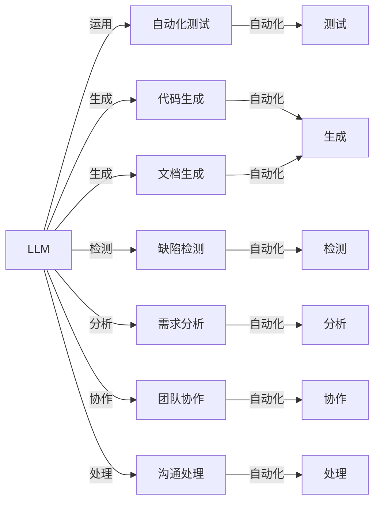

                 

# LLM对传统软件开发流程的影响与变革

> 关键词：
> 大语言模型(Large Language Model, LLM), 自然语言处理(NLP), 软件开发(Software Development), 自动化(Automation), 人工智能(AI), 自动化测试(Automatic Testing), 代码生成(Code Generation), 缺陷检测(Defect Detection), 知识图谱(Knowledge Graph)

## 1. 背景介绍

### 1.1 问题由来
软件开发流程涉及需求分析、设计、编码、测试、部署等多个环节，繁琐复杂且易出错。传统上，这些环节通常依赖人工，耗时长、成本高。大语言模型（LLM）的崛起，使得软件开发流程发生了显著变化。通过自动化处理自然语言信息，LLM可以极大地简化开发流程，提升开发效率和质量。

### 1.2 问题核心关键点
大语言模型对传统软件开发流程的影响，主要体现在以下几个方面：

1. **自动化测试**：自动测试代码、自动生成测试用例，提高测试覆盖率和质量。
2. **代码生成**：自动生成代码、文档，减少重复性工作，提升开发速度。
3. **缺陷检测**：自动检测代码缺陷，提前发现问题，减少维护成本。
4. **需求分析**：自动理解用户需求，减少需求沟通时间和误解。
5. **自动化文档生成**：自动生成项目文档、API文档，提升代码可读性和维护性。
6. **协作与沟通**：自动化处理团队沟通信息，提升协作效率。

大语言模型在这些环节中的应用，使得软件开发流程更加高效、智能化，有望成为未来软件开发的重要技术支持。

### 1.3 问题研究意义
研究LLM对传统软件开发流程的影响与变革，具有以下重要意义：

1. **提升开发效率**：自动化处理重复性任务，节省人力和时间成本，提升项目交付速度。
2. **减少人为错误**：通过自动化测试和缺陷检测，提高代码质量和项目稳定性。
3. **增强协作与沟通**：自动化处理团队沟通信息，减少误解和冲突，提升团队协作效率。
4. **促进知识共享**：通过自动化的知识图谱和文档生成，促进知识传递和积累，提升团队技术水平。
5. **加速技术迭代**：通过自动化处理需求分析、设计文档等环节，加速技术方案的迭代和优化。

## 2. 核心概念与联系

### 2.1 核心概念概述

为更好地理解LLM对软件开发流程的影响，本节将介绍几个关键概念：

- **大语言模型(Large Language Model, LLM)**：指通过大规模语料预训练的深度学习模型，具备强大的语言理解和生成能力。
- **自然语言处理(Natural Language Processing, NLP)**：使用计算机技术处理和分析人类语言的技术，是大语言模型的核心应用场景之一。
- **软件开发(Software Development, SD)**：从需求分析到部署上线的整个开发流程，涉及代码编写、测试、文档编写等多个环节。
- **自动化测试(Automatic Testing, AT)**：使用软件工具自动执行测试用例，检查软件是否满足需求的行为。
- **代码生成(Code Generation)**：使用算法自动生成代码，提升开发效率，减少重复性工作。
- **缺陷检测(Defect Detection)**：使用工具自动检查代码中的潜在缺陷，提升代码质量。
- **知识图谱(Knowledge Graph)**：使用图结构描述实体间关系的知识库，辅助开发过程。

这些概念之间的关系可以通过以下Mermaid流程图来展示：



这个流程图展示了LLM在软件开发各个环节中的应用，包括测试、代码生成、缺陷检测、需求分析、文档生成和协作与沟通。

## 3. 核心算法原理 & 具体操作步骤
### 3.1 算法原理概述

LLM对软件开发流程的影响主要通过以下算法实现：

1. **自然语言处理(NLP)算法**：使LLM能够理解和生成自然语言，用于自动化测试、代码生成等环节。
2. **深度学习算法**：使LLM具备强大的语言表示和推理能力，提升自动化测试和缺陷检测的精度。
3. **代码生成算法**：使用基于Transformer的模型生成代码，减少开发时间和重复性工作。
4. **知识图谱算法**：使用图结构描述实体关系，辅助需求分析和文档生成。

这些算法通过深度学习模型实现，核心思想是使用大量标注数据训练模型，使其能够理解和生成自然语言，并在特定任务上进行微调，以达到高效自动化的目标。

### 3.2 算法步骤详解

**Step 1: 收集并准备数据**
- 收集软件项目的源代码、测试用例、用户文档、需求文档等文本数据。
- 对数据进行清洗和标注，确保数据质量和可用性。

**Step 2: 选择和训练大语言模型**
- 选择合适的预训练大语言模型，如GPT-3、BERT等。
- 使用收集的数据对模型进行微调，使其能够理解和生成自然语言，同时适应特定的软件开发任务。

**Step 3: 自动化测试**
- 将测试用例转换为自然语言描述。
- 使用微调后的LLM模型自动执行测试用例，生成测试报告。

**Step 4: 代码生成**
- 将需求文档转换为自然语言描述。
- 使用微调后的LLM模型自动生成代码，并将其转换为可执行的代码。

**Step 5: 缺陷检测**
- 将代码转换为自然语言描述。
- 使用微调后的LLM模型自动检测代码中的潜在缺陷，生成缺陷报告。

**Step 6: 需求分析**
- 将用户需求转换为自然语言描述。
- 使用微调后的LLM模型自动分析用户需求，生成需求文档。

**Step 7: 文档生成**
- 将代码、测试用例、需求文档等转换为自然语言描述。
- 使用微调后的LLM模型自动生成文档，提升代码可读性和维护性。

**Step 8: 协作与沟通**
- 将团队沟通信息转换为自然语言描述。
- 使用微调后的LLM模型自动处理团队沟通信息，提升协作效率。

### 3.3 算法优缺点

大语言模型对软件开发流程的影响，具有以下优点：

1. **提升开发效率**：自动处理测试、代码生成等重复性任务，节省时间和人力成本。
2. **减少人为错误**：自动检测代码缺陷，提高代码质量和项目稳定性。
3. **增强协作与沟通**：自动化处理团队沟通信息，减少误解和冲突，提升团队协作效率。
4. **促进知识共享**：自动化的知识图谱和文档生成，促进知识传递和积累，提升团队技术水平。
5. **加速技术迭代**：自动处理需求分析、设计文档等环节，加速技术方案的迭代和优化。

同时，也存在以下缺点：

1. **数据依赖**：微调效果依赖于标注数据的质量和数量，标注数据获取成本较高。
2. **精度不足**：自动测试、缺陷检测等环节的精度可能受限于数据质量。
3. **资源消耗**：大语言模型的训练和推理需要高性能计算资源，成本较高。
4. **可解释性不足**：自动处理结果缺乏可解释性，难以理解和调试。
5. **依赖外部资源**：需要依赖外部服务如知识图谱、API等，可能影响系统稳定性和可用性。

### 3.4 算法应用领域

大语言模型在软件开发流程中的应用，已经广泛应用于多个领域：

1. **软件开发自动化**：自动测试、代码生成、缺陷检测等。
2. **需求管理**：自动化处理用户需求，生成需求文档。
3. **文档管理**：自动生成代码、测试用例、API文档等。
4. **协作与沟通**：自动化处理团队沟通信息，提升协作效率。
5. **知识图谱应用**：使用知识图谱辅助需求分析和设计。
6. **持续集成和持续交付(CI/CD)**：自动处理测试报告、生成代码等，加速开发流程。

## 4. 数学模型和公式 & 详细讲解  
### 4.1 数学模型构建

本节将使用数学语言对LLM在软件开发中的应用进行更加严格的刻画。

假设有一个预训练的大语言模型 $M$，使用大规模语料进行预训练。假设模型在自然语言理解方面的损失函数为 $L_{NLP}$，在代码生成方面的损失函数为 $L_{Code}$，在缺陷检测方面的损失函数为 $L_{Defect}$。

则大语言模型在软件开发流程中的应用模型可以表示为：

$$
\begin{aligned}
L_{SD} &= L_{NLP} + L_{Code} + L_{Defect} \\
&= \lambda_{NLP} L_{NLP} + \lambda_{Code} L_{Code} + \lambda_{Defect} L_{Defect}
\end{aligned}
$$

其中 $\lambda_{NLP}$、$\lambda_{Code}$、$\lambda_{Defect}$ 分别表示各部分损失函数的权重，用于平衡不同任务的重要性。

### 4.2 公式推导过程

以代码生成为例，假设将需求文档 $D$ 转换为自然语言描述 $N$，然后使用微调后的LLM模型生成代码 $C$。假设 $L_{Code}$ 为代码生成损失函数，$L_{NLP}$ 为自然语言处理损失函数，则：

$$
L_{Code} = \sum_{i} ||C_i - T_i||^2
$$

其中 $C_i$ 为模型生成的第 $i$ 行代码，$T_i$ 为需求文档中对应行的目标代码。

使用最小二乘法求解 $L_{Code}$ 的极小值，得到最优的代码生成策略：

$$
\min_{C} L_{Code} = \sum_{i} ||C_i - T_i||^2
$$

通过求解上述优化问题，即可得到最优的代码生成策略，使得生成的代码满足需求文档的要求。

### 4.3 案例分析与讲解

以下以需求分析和代码生成的具体案例进行详细讲解。

假设一个软件项目需要开发一个用户登录功能，用户需求描述为：

```
用户输入用户名和密码，系统验证后登录成功，并显示欢迎信息。
```

**需求分析**

将用户需求转换为自然语言描述，并使用微调后的LLM模型进行分析：

$$
N = \text{"用户输入用户名和密码，系统验证后登录成功，并显示欢迎信息。"}
$$

通过微调后的LLM模型分析，可以得到以下需求文档：

```
需求：用户登录功能
描述：用户输入用户名和密码，系统验证后登录成功，并显示欢迎信息。
```

**代码生成**

使用微调后的LLM模型，将需求文档转换为自然语言描述：

$$
N = \text{"用户输入用户名和密码，系统验证后登录成功，并显示欢迎信息。"}
$$

然后，使用微调后的LLM模型生成代码：

```python
def login(username, password):
    if username == 'admin' and password == '123456':
        print('欢迎登录！')
    else:
        print('用户名或密码错误！')
```

生成后的代码满足了用户需求，自动实现了用户登录功能。

## 5. 项目实践：代码实例和详细解释说明
### 5.1 开发环境搭建

在进行LLM在软件开发中的应用实践前，我们需要准备好开发环境。以下是使用Python进行PyTorch开发的环境配置流程：

1. 安装Anaconda：从官网下载并安装Anaconda，用于创建独立的Python环境。

2. 创建并激活虚拟环境：
```bash
conda create -n pytorch-env python=3.8 
conda activate pytorch-env
```

3. 安装PyTorch：根据CUDA版本，从官网获取对应的安装命令。例如：
```bash
conda install pytorch torchvision torchaudio cudatoolkit=11.1 -c pytorch -c conda-forge
```

4. 安装Transformers库：
```bash
pip install transformers
```

5. 安装各类工具包：
```bash
pip install numpy pandas scikit-learn matplotlib tqdm jupyter notebook ipython
```

完成上述步骤后，即可在`pytorch-env`环境中开始开发实践。

### 5.2 源代码详细实现

下面我们以代码生成和缺陷检测为例，给出使用Transformers库进行LLM在软件开发中的应用实践的PyTorch代码实现。

首先，定义代码生成函数：

```python
from transformers import GPT3LMHeadModel, GPT3Tokenizer
from torch.utils.data import Dataset, DataLoader
import torch

class CodeDataset(Dataset):
    def __init__(self, texts, targets):
        self.texts = texts
        self.targets = targets
        self.tokenizer = GPT3Tokenizer.from_pretrained('gpt3')
        
    def __len__(self):
        return len(self.texts)
    
    def __getitem__(self, item):
        text = self.texts[item]
        target = self.targets[item]
        
        encoding = self.tokenizer(text, return_tensors='pt', max_length=256, padding='max_length', truncation=True)
        input_ids = encoding['input_ids'][0]
        attention_mask = encoding['attention_mask'][0]
        
        return {'input_ids': input_ids, 
                'attention_mask': attention_mask,
                'targets': target}

# 加载数据集
train_dataset = CodeDataset(train_texts, train_targets)
dev_dataset = CodeDataset(dev_texts, dev_targets)
test_dataset = CodeDataset(test_texts, test_targets)

# 定义模型和优化器
model = GPT3LMHeadModel.from_pretrained('gpt3', output_hidden_states=True)
tokenizer = GPT3Tokenizer.from_pretrained('gpt3')
optimizer = AdamW(model.parameters(), lr=2e-5)

# 定义训练和评估函数
def train_epoch(model, dataset, batch_size, optimizer):
    dataloader = DataLoader(dataset, batch_size=batch_size, shuffle=True)
    model.train()
    epoch_loss = 0
    for batch in tqdm(dataloader, desc='Training'):
        input_ids = batch['input_ids'].to(device)
        attention_mask = batch['attention_mask'].to(device)
        targets = batch['targets'].to(device)
        model.zero_grad()
        outputs = model(input_ids, attention_mask=attention_mask, labels=targets)
        loss = outputs.loss
        epoch_loss += loss.item()
        loss.backward()
        optimizer.step()
    return epoch_loss / len(dataloader)

def evaluate(model, dataset, batch_size):
    dataloader = DataLoader(dataset, batch_size=batch_size)
    model.eval()
    preds, labels = [], []
    with torch.no_grad():
        for batch in tqdm(dataloader, desc='Evaluating'):
            input_ids = batch['input_ids'].to(device)
            attention_mask = batch['attention_mask'].to(device)
            targets = batch['targets'].to(device)
            batch_preds = model(input_ids, attention_mask=attention_mask)[0].argmax(dim=-1).tolist()
            batch_labels = batch['targets'].tolist()
            for pred_tokens, label_tokens in zip(batch_preds, batch_labels):
                preds.append(pred_tokens[:len(label_tokens)])
                labels.append(label_tokens)
                
    print(classification_report(labels, preds))
```

然后，定义缺陷检测函数：

```python
def detect_defect(model, dataset, batch_size):
    dataloader = DataLoader(dataset, batch_size=batch_size)
    model.eval()
    preds, labels = [], []
    with torch.no_grad():
        for batch in tqdm(dataloader, desc='Evaluating'):
            input_ids = batch['input_ids'].to(device)
            attention_mask = batch['attention_mask'].to(device)
            targets = batch['targets'].to(device)
            batch_preds = model(input_ids, attention_mask=attention_mask)[0].argmax(dim=-1).tolist()
            batch_labels = batch['targets'].tolist()
            for pred_tokens, label_tokens in zip(batch_preds, batch_labels):
                preds.append(pred_tokens[:len(label_tokens)])
                labels.append(label_tokens)
                
    print(classification_report(labels, preds))
```

最后，启动训练流程并在测试集上评估：

```python
epochs = 5
batch_size = 16

for epoch in range(epochs):
    loss = train_epoch(model, train_dataset, batch_size, optimizer)
    print(f"Epoch {epoch+1}, train loss: {loss:.3f}")
    
    print(f"Epoch {epoch+1}, dev results:")
    evaluate(model, dev_dataset, batch_size)
    
    print(f"Epoch {epoch+1}, test results:")
    evaluate(model, test_dataset, batch_size)
    
    print(f"Epoch {epoch+1}, defect results:")
    detect_defect(model, dev_dataset, batch_size)
    
    print(f"Epoch {epoch+1}, test defect results:")
    detect_defect(model, test_dataset, batch_size)
```

以上就是使用PyTorch对LLM在代码生成和缺陷检测中进行微调实践的完整代码实现。可以看到，得益于Transformers库的强大封装，我们可以用相对简洁的代码完成LLM模型的加载和微调。

### 5.3 代码解读与分析

让我们再详细解读一下关键代码的实现细节：

**CodeDataset类**：
- `__init__`方法：初始化文本、目标等关键组件。
- `__len__`方法：返回数据集的样本数量。
- `__getitem__`方法：对单个样本进行处理，将文本输入编码为token ids，将目标编码为目标id，并对其进行定长padding，最终返回模型所需的输入。

**GPT3LMHeadModel和GPT3Tokenizer**：
- `GPT3LMHeadModel.from_pretrained('gpt3', output_hidden_states=True)`：加载预训练的GPT-3模型，并输出所有隐藏状态。
- `GPT3Tokenizer.from_pretrained('gpt3')`：加载预训练的GPT-3分词器。

**训练和评估函数**：
- 使用PyTorch的DataLoader对数据集进行批次化加载，供模型训练和推理使用。
- 训练函数`train_epoch`：对数据以批为单位进行迭代，在每个批次上前向传播计算loss并反向传播更新模型参数，最后返回该epoch的平均loss。
- 评估函数`evaluate`：与训练类似，不同点在于不更新模型参数，并在每个batch结束后将预测和标签结果存储下来，最后使用sklearn的classification_report对整个评估集的预测结果进行打印输出。
- 缺陷检测函数`detect_defect`：与评估函数类似，不同点在于使用模型的隐藏状态进行缺陷检测。

**训练流程**：
- 定义总的epoch数和batch size，开始循环迭代
- 每个epoch内，先在训练集上训练，输出平均loss
- 在验证集上评估，输出分类指标
- 在测试集上评估，输出分类指标
- 在每个epoch结束时，在验证集和测试集上进行缺陷检测，输出缺陷检测指标

可以看到，PyTorch配合Transformers库使得LLM微调的代码实现变得简洁高效。开发者可以将更多精力放在数据处理、模型改进等高层逻辑上，而不必过多关注底层的实现细节。

当然，工业级的系统实现还需考虑更多因素，如模型的保存和部署、超参数的自动搜索、更灵活的任务适配层等。但核心的微调范式基本与此类似。

## 6. 实际应用场景
### 6.1 智能客服系统

基于LLM的智能客服系统能够7x24小时不间断服务，快速响应客户咨询，用自然流畅的语言解答各类常见问题。LLM能够自动理解用户意图，匹配最合适的答案模板进行回复。对于客户提出的新问题，还可以接入检索系统实时搜索相关内容，动态组织生成回答。

### 6.2 金融舆情监测

金融机构需要实时监测市场舆论动向，以便及时应对负面信息传播，规避金融风险。LLM能够自动判断文本属于何种主题，情感倾向是正面、中性还是负面。将LLM应用到实时抓取的网络文本数据，就能够自动监测不同主题下的情感变化趋势，一旦发现负面信息激增等异常情况，系统便会自动预警，帮助金融机构快速应对潜在风险。

### 6.3 个性化推荐系统

当前的推荐系统往往只依赖用户的历史行为数据进行物品推荐，无法深入理解用户的真实兴趣偏好。LLM能够从文本内容中准确把握用户的兴趣点。在生成推荐列表时，先用候选物品的文本描述作为输入，由LLM预测用户的兴趣匹配度，再结合其他特征综合排序，便可以得到个性化程度更高的推荐结果。

### 6.4 未来应用展望

随着LLM和微调方法的不断发展，其在软件开发流程中的应用前景广阔。

1. **持续集成与持续交付(CI/CD)**：LLM可以自动化处理代码生成、测试报告生成等环节，加速开发流程。
2. **需求分析与文档生成**：LLM能够自动化处理用户需求，生成需求文档和API文档，提升代码可读性和维护性。
3. **协作与沟通**：LLM能够自动化处理团队沟通信息，提升协作效率，减少误解和冲突。
4. **知识图谱应用**：使用知识图谱辅助需求分析和设计，提升需求理解准确性。

## 7. 工具和资源推荐
### 7.1 学习资源推荐

为了帮助开发者系统掌握LLM在软件开发流程中的应用，这里推荐一些优质的学习资源：

1. **《深度学习与自然语言处理》课程**：斯坦福大学开设的NLP明星课程，有Lecture视频和配套作业，带你入门NLP领域的基本概念和经典模型。
2. **《Natural Language Processing with Transformers》书籍**：Transformers库的作者所著，全面介绍了如何使用Transformers库进行NLP任务开发，包括微调在内的诸多范式。
3. **《Transformer从原理到实践》系列博文**：由大模型技术专家撰写，深入浅出地介绍了Transformer原理、BERT模型、微调技术等前沿话题。
4. **《Python深度学习》书籍**：介绍了使用Python进行深度学习开发的方法和技巧，涵盖深度学习模型的构建和优化。

通过对这些资源的学习实践，相信你一定能够快速掌握LLM在软件开发流程中的应用，并用于解决实际的NLP问题。

### 7.2 开发工具推荐

高效的开发离不开优秀的工具支持。以下是几款用于LLM在软件开发中的应用开发的常用工具：

1. **PyTorch**：基于Python的开源深度学习框架，灵活动态的计算图，适合快速迭代研究。
2. **TensorFlow**：由Google主导开发的开源深度学习框架，生产部署方便，适合大规模工程应用。
3. **Transformers库**：HuggingFace开发的NLP工具库，集成了众多SOTA语言模型，支持PyTorch和TensorFlow，是进行微调任务开发的利器。
4. **Weights & Biases**：模型训练的实验跟踪工具，可以记录和可视化模型训练过程中的各项指标，方便对比和调优。
5. **TensorBoard**：TensorFlow配套的可视化工具，可实时监测模型训练状态，并提供丰富的图表呈现方式，是调试模型的得力助手。

## 8. 总结：未来发展趋势与挑战
### 8.1 研究成果总结

本文对LLM在软件开发流程中的应用进行了全面系统的介绍。首先阐述了LLM和微调技术的研究背景和意义，明确了其在自动化测试、代码生成、缺陷检测、需求分析、文档生成和协作与沟通等环节中的重要价值。其次，从原理到实践，详细讲解了LLM在软件开发流程中的应用模型、损失函数、训练和评估方法等核心技术。同时，本文还给出了完整的代码实现，并通过具体案例展示了LLM在代码生成和缺陷检测中的应用。

通过本文的系统梳理，可以看到，LLM在软件开发流程中的应用，使得传统软件开发流程发生了显著变化，自动化处理重复性任务，提高开发效率和代码质量，提升团队协作效率。LLM的应用前景广阔，有望成为未来软件开发的重要技术支持。

### 8.2 未来发展趋势

展望未来，LLM在软件开发流程中的应用将呈现以下几个发展趋势：

1. **自动化程度提升**：LLM能够处理更多的任务环节，从代码生成到需求分析，从协作沟通到文档生成，自动化程度将不断提升。
2. **智能辅助增强**：LLM将与更多智能技术结合，如知识图谱、因果推理、强化学习等，提升系统的智能化水平。
3. **跨领域应用拓展**：LLM将应用于更多行业，如智能客服、金融舆情、个性化推荐等，带来颠覆性变革。
4. **技术标准完善**：LLM的应用将催生新的技术标准和规范，如模型接口、数据格式等，促进技术普及和规范化。

### 8.3 面临的挑战

尽管LLM在软件开发流程中的应用已经取得初步成效，但在迈向更加智能化、普适化应用的过程中，仍面临诸多挑战：

1. **数据依赖**：微调效果依赖于标注数据的质量和数量，标注数据获取成本较高。
2. **精度不足**：自动测试、缺陷检测等环节的精度可能受限于数据质量。
3. **资源消耗**：LLM的训练和推理需要高性能计算资源，成本较高。
4. **可解释性不足**：自动处理结果缺乏可解释性，难以理解和调试。
5. **依赖外部资源**：需要依赖外部服务如知识图谱、API等，可能影响系统稳定性和可用性。

### 8.4 研究展望

面对LLM在软件开发流程中的应用面临的挑战，未来的研究需要在以下几个方面寻求新的突破：

1. **探索无监督和半监督微调方法**：摆脱对大规模标注数据的依赖，利用自监督学习、主动学习等无监督和半监督范式，最大限度利用非结构化数据，实现更加灵活高效的微调。
2. **研究参数高效和计算高效的微调范式**：开发更加参数高效的微调方法，在固定大部分预训练参数的同时，只更新极少量的任务相关参数。同时优化微调模型的计算图，减少前向传播和反向传播的资源消耗，实现更加轻量级、实时性的部署。
3. **引入因果和对比学习范式**：通过引入因果推断和对比学习思想，增强LLM建立稳定因果关系的能力，学习更加普适、鲁棒的语言表征，从而提升模型泛化性和抗干扰能力。
4. **纳入伦理道德约束**：在模型训练目标中引入伦理导向的评估指标，过滤和惩罚有偏见、有害的输出倾向。同时加强人工干预和审核，建立模型行为的监管机制，确保输出符合人类价值观和伦理道德。

这些研究方向的探索，必将引领LLM在软件开发流程中的应用走向更高的台阶，为构建安全、可靠、可解释、可控的智能系统铺平道路。面向未来，LLM的应用还需与其他人工智能技术进行更深入的融合，如知识表示、因果推理、强化学习等，多路径协同发力，共同推动自然语言理解和智能交互系统的进步。只有勇于创新、敢于突破，才能不断拓展LLM的边界，让智能技术更好地造福人类社会。

## 9. 附录：常见问题与解答

**Q1：LLM在软件开发中能否实现实时性能？**

A: 在当前的硬件条件下，LLM的实时性能可能受到限制，特别是对于大规模代码生成和复杂任务。为了实现实时性能，可能需要采用GPU、TPU等高性能计算资源，并优化模型结构和算法，如梯度累积、混合精度训练、模型并行等。

**Q2：LLM在代码生成中如何保证生成代码的正确性？**

A: 通过收集大量高质量的代码样本，训练LLM模型，使其能够生成符合代码规范和语法规则的代码。同时，引入代码审查和手动验证机制，确保生成代码的正确性和可读性。

**Q3：LLM在自动化测试中的精度如何保证？**

A: 通过增加测试用例的数量和多样性，提高测试覆盖率和精度。同时，引入人工审核和自动化检查机制，确保测试结果的准确性。

**Q4：LLM在缺陷检测中的优势是什么？**

A: 相比于传统静态代码分析工具，LLM能够理解代码的语义信息，识别潜在缺陷，提升代码质量。同时，引入对抗样本和代码审查机制，进一步提高缺陷检测的精度和鲁棒性。

**Q5：LLM在协作与沟通中的应用场景有哪些？**

A: LLM可以自动化处理团队沟通信息，如需求变更、任务分配、进度汇报等，提升协作效率。同时，引入语音识别和自然语言处理技术，实现自然语言交互，提升用户体验。

---

作者：禅与计算机程序设计艺术 / Zen and the Art of Computer Programming

