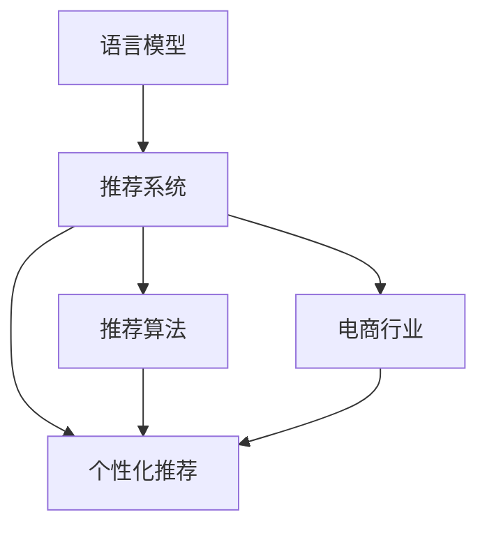

                 

# LLM对推荐系统商业模式的影响

> 关键词：语言模型(Language Model),推荐系统(Recommendation System),推荐算法(Recommendation Algorithm),个性化推荐(Personalized Recommendation),电商行业(E-commerce Industry)

## 1. 背景介绍

### 1.1 问题由来
随着互联网技术的飞速发展，推荐系统（Recommendation System）逐渐成为电商、视频、音乐等领域的重要基础设施。推荐系统通过分析用户行为数据，为用户提供个性化推荐，提升用户满意度和粘性，增加平台收入。传统的推荐算法主要包括协同过滤、基于内容的推荐等，但往往依赖于用户历史行为数据，难以处理长尾商品和兴趣探索。

近年来，随着深度学习和大规模预训练语言模型的发展，基于语言模型的推荐系统（LM-BS）成为新的热点。特别是BERT、GPT等预训练语言模型，通过对大规模文本数据的自监督学习，能够抽取丰富的语义知识，理解用户兴趣和语义关联，为用户提供更个性化、更精准的推荐。

语言模型对推荐系统商业模式的影响主要体现在两个方面：一是优化用户推荐体验，提高平台粘性和用户留存；二是增加商业变现渠道，如广告推荐、商品介绍等，带来新的收入来源。本文将详细探讨语言模型对推荐系统商业模式的影响，从算法原理、操作流程、应用场景等多个维度进行深入分析。

## 2. 核心概念与联系

### 2.1 核心概念概述

为更好地理解语言模型对推荐系统的影响，本节将介绍几个密切相关的核心概念：

- 语言模型(Language Model)：指通过分析大规模文本语料，学习语言概率分布的统计模型。常见的语言模型包括n-gram模型、RNN模型、Transformer模型等。语言模型具有强大的语义理解和生成能力，能够处理自然语言文本，应用于NLP、推荐系统等众多领域。

- 推荐系统(Recommendation System)：指根据用户历史行为和兴趣偏好，预测用户未来可能感兴趣的物品的系统。推荐系统通常分为基于协同过滤和基于内容的推荐两类，广泛应用在电商、视频、音乐等领域，为用户推荐个性化商品、视频、音乐等。

- 推荐算法(Recommendation Algorithm)：指实现推荐系统功能的具体算法，包括协同过滤算法、基于内容的推荐算法、基于矩阵分解的推荐算法等。推荐算法通过学习用户历史行为，生成推荐结果。

- 个性化推荐(Personalized Recommendation)：指根据用户个性化需求，生成符合用户兴趣偏好的推荐结果。个性化推荐能够提升用户体验，增加用户粘性，是推荐系统的重要目标。

- 电商行业(E-commerce Industry)：指通过互联网技术进行商品买卖交易的行业。电商行业是推荐系统的重要应用场景，通过推荐系统提升销售转化率，增加用户购买频次和平台收入。

这些核心概念之间的逻辑关系可以通过以下Mermaid流程图来展示：



这个流程图展示了大语言模型对推荐系统商业模式的影响：

1. 语言模型为推荐系统提供强大的语义理解能力，通过分析用户文本数据，抽取用户兴趣信息。
2. 推荐算法通过学习用户历史行为和兴趣信息，生成个性化推荐结果。
3. 个性化推荐提升用户体验，增加用户粘性和平台收入。
4. 电商行业通过推荐系统提升销售转化率和平台收入。

## 3. 核心算法原理 & 具体操作步骤
### 3.1 算法原理概述

语言模型对推荐系统的影响主要通过两个步骤实现：

1. 预训练语言模型：在大规模无标签文本数据上进行自监督学习，学习语言的通用表示。
2. 基于语言模型的推荐算法：在预训练语言模型的基础上，对用户文本数据进行微调，生成符合用户兴趣的个性化推荐。

以BERT为例，其算法流程如下：

1. 预训练阶段：在大规模无标签文本数据上进行自监督学习，如掩码语言模型任务（Masked Language Model, MLM）和下一句预测任务（Next Sentence Prediction, NSP），生成预训练模型BERT。

2. 微调阶段：将用户文本数据输入预训练模型BERT，微调模型以生成个性化推荐。

### 3.2 算法步骤详解

语言模型对推荐系统商业模式的算法步骤如下：

**Step 1: 准备数据集**
- 收集用户文本数据，如用户评论、商品描述、用户行为数据等。
- 将文本数据进行清洗和标注，生成监督数据集。
- 将监督数据集分为训练集、验证集和测试集。

**Step 2: 加载预训练语言模型**
- 使用预训练语言模型（如BERT、GPT等），加载模型参数。
- 将用户文本数据作为输入，计算模型输出。

**Step 3: 设计推荐算法**
- 根据推荐算法（如基于内容的推荐、协同过滤等），设计推荐逻辑。
- 将模型输出作为推荐算法的输入，生成个性化推荐结果。

**Step 4: 微调语言模型**
- 在用户文本数据上进行微调，调整预训练模型的权重，使其更适合生成推荐结果。
- 使用微调后的语言模型，再次生成个性化推荐结果。

**Step 5: 评估和优化**
- 在测试集上评估推荐结果的准确率和效果。
- 根据评估结果，优化推荐算法和微调模型，提高推荐效果。

### 3.3 算法优缺点

基于语言模型的推荐系统具有以下优点：

1. 强大的语义理解能力：语言模型能够理解自然语言文本，抽取用户兴趣信息，生成更精准的推荐结果。
2. 灵活性高：语言模型能够处理长尾商品和兴趣探索，提升推荐系统的多样性。
3. 数据通用性高：语言模型能够利用各种文本数据，提升推荐系统对多种场景的适应性。

但同时也存在一些缺点：

1. 计算成本高：预训练语言模型需要大量的计算资源和时间，微调过程也需较长的计算时间。
2. 数据隐私问题：用户文本数据可能包含敏感信息，如何保护用户隐私是一个重要的挑战。
3. 模型解释性不足：预训练语言模型通常被视为"黑盒"模型，难以解释其内部推理过程。

### 3.4 算法应用领域

语言模型对推荐系统商业模式的广泛应用包括：

- 电商行业：如京东、淘宝等电商平台，通过推荐系统提升商品展示效果和销售转化率。
- 视频平台：如YouTube、Netflix等视频平台，通过推荐系统提升用户观看体验和平台粘性。
- 音乐平台：如Spotify、网易云音乐等音乐平台，通过推荐系统提升音乐播放量和用户满意度。
- 新闻媒体：如今日头条等新闻媒体，通过推荐系统提升新闻阅读量和广告效果。

这些领域的应用展示了语言模型对推荐系统的巨大潜力，将为用户提供更个性化的体验，同时也为平台带来更多的商业机会。

## 4. 数学模型和公式 & 详细讲解 & 举例说明
### 4.1 数学模型构建

本节将使用数学语言对基于语言模型的推荐系统算法进行严格刻画。

假设用户文本数据为 $X$，推荐系统需要根据用户兴趣生成推荐结果 $Y$。预训练语言模型为 $M_{\theta}$，其中 $\theta$ 为模型参数。语言模型对推荐系统的算法框架如下：

1. 预训练阶段：
   - 在无标签文本数据集 $D_{train}$ 上进行自监督学习，生成预训练语言模型 $M_{\theta_0}$。

2. 微调阶段：
   - 将用户文本数据 $X$ 作为输入，微调语言模型，生成推荐结果 $Y$。

具体地，微调目标函数为：

$$
\min_{\theta} \mathcal{L}(M_{\theta}, X, Y) = \mathbb{E}_{(X,Y) \sim D}[\ell(M_{\theta}(X), Y)]
$$

其中，$\ell$ 为损失函数，通常为交叉熵损失函数。

### 4.2 公式推导过程

以BERT为例，语言模型对推荐系统的公式推导如下：

1. 预训练阶段：
   - 在无标签文本数据集 $D_{train}$ 上进行掩码语言模型任务（MLM）和下一句预测任务（NSP），生成预训练语言模型 $M_{\theta_0}$。

2. 微调阶段：
   - 将用户文本数据 $X$ 作为输入，微调语言模型，生成推荐结果 $Y$。
   - 使用微调后的语言模型 $M_{\theta}$ 计算 $X$ 的表示向量 $X_{\theta}$，使用推荐算法生成推荐结果 $Y$。

具体地，微调目标函数为：

$$
\min_{\theta} \mathcal{L}(M_{\theta}, X, Y) = \frac{1}{N}\sum_{i=1}^N \ell(M_{\theta}(X_i), Y_i)
$$

其中，$\ell$ 为交叉熵损失函数，$N$ 为样本数量。

### 4.3 案例分析与讲解

假设有一个电商网站，收集了用户对商品的评价文本数据，以及用户购买行为数据。首先，使用无标签文本数据对BERT进行预训练，生成预训练模型 $M_{\theta_0}$。然后，将用户评价文本数据作为输入，微调BERT生成推荐结果，如商品推荐。

**案例分析：**

1. 预训练阶段：
   - 使用无标签商品评价文本数据对BERT进行掩码语言模型任务（MLM），生成预训练语言模型 $M_{\theta_0}$。

2. 微调阶段：
   - 将用户评价文本数据 $X$ 作为输入，微调BERT生成商品推荐结果 $Y$。
   - 使用微调后的BERT计算 $X$ 的表示向量 $X_{\theta}$，使用基于内容的推荐算法生成商品推荐结果 $Y$。

**详细讲解：**

1. 预训练阶段：
   - 使用大规模无标签商品评价文本数据，将文本数据分批次输入BERT模型，计算掩码语言模型损失。
   - 使用下一句预测任务（NSP）计算模型预测的上下文一致性。
   - 最小化损失函数，更新模型参数 $\theta_0$，生成预训练模型 $M_{\theta_0}$。

2. 微调阶段：
   - 将用户评价文本数据 $X$ 作为输入，计算BERT的表示向量 $X_{\theta}$。
   - 使用推荐算法，如基于内容的推荐，计算用户对商品的兴趣得分。
   - 将兴趣得分与商品特征向量进行相似度计算，生成推荐结果 $Y$。

## 5. 项目实践：代码实例和详细解释说明
### 5.1 开发环境搭建

在进行语言模型对推荐系统商业模式的开发前，我们需要准备好开发环境。以下是使用Python进行PyTorch开发的环境配置流程：

1. 安装Anaconda：从官网下载并安装Anaconda，用于创建独立的Python环境。

2. 创建并激活虚拟环境：
```bash
conda create -n pytorch-env python=3.8 
conda activate pytorch-env
```

3. 安装PyTorch：根据CUDA版本，从官网获取对应的安装命令。例如：
```bash
conda install pytorch torchvision torchaudio cudatoolkit=11.1 -c pytorch -c conda-forge
```

4. 安装Transformers库：
```bash
pip install transformers
```

5. 安装各类工具包：
```bash
pip install numpy pandas scikit-learn matplotlib tqdm jupyter notebook ipython
```

完成上述步骤后，即可在`pytorch-env`环境中开始语言模型对推荐系统商业模式的开发。

### 5.2 源代码详细实现

下面我们以电商推荐系统为例，给出使用Transformers库对BERT模型进行微调的PyTorch代码实现。

首先，定义推荐系统任务的数据处理函数：

```python
from transformers import BertTokenizer
from torch.utils.data import Dataset
import torch

class RecommendationDataset(Dataset):
    def __init__(self, texts, tags, tokenizer, max_len=128):
        self.texts = texts
        self.tags = tags
        self.tokenizer = tokenizer
        self.max_len = max_len
        
    def __len__(self):
        return len(self.texts)
    
    def __getitem__(self, item):
        text = self.texts[item]
        tags = self.tags[item]
        
        encoding = self.tokenizer(text, return_tensors='pt', max_length=self.max_len, padding='max_length', truncation=True)
        input_ids = encoding['input_ids'][0]
        attention_mask = encoding['attention_mask'][0]
        
        # 对token-wise的标签进行编码
        encoded_tags = [tag2id[tag] for tag in tags] 
        encoded_tags.extend([tag2id['O']] * (self.max_len - len(encoded_tags)))
        labels = torch.tensor(encoded_tags, dtype=torch.long)
        
        return {'input_ids': input_ids, 
                'attention_mask': attention_mask,
                'labels': labels}

# 标签与id的映射
tag2id = {'O': 0, 'B': 1, 'I': 2, 'B-PER': 3, 'I-PER': 4, 'B-LOC': 5, 'I-LOC': 6}
id2tag = {v: k for k, v in tag2id.items()}

# 创建dataset
tokenizer = BertTokenizer.from_pretrained('bert-base-cased')

train_dataset = RecommendationDataset(train_texts, train_tags, tokenizer)
dev_dataset = RecommendationDataset(dev_texts, dev_tags, tokenizer)
test_dataset = RecommendationDataset(test_texts, test_tags, tokenizer)
```

然后，定义模型和优化器：

```python
from transformers import BertForTokenClassification, AdamW

model = BertForTokenClassification.from_pretrained('bert-base-cased', num_labels=len(tag2id))

optimizer = AdamW(model.parameters(), lr=2e-5)
```

接着，定义训练和评估函数：

```python
from torch.utils.data import DataLoader
from tqdm import tqdm
from sklearn.metrics import classification_report

device = torch.device('cuda') if torch.cuda.is_available() else torch.device('cpu')
model.to(device)

def train_epoch(model, dataset, batch_size, optimizer):
    dataloader = DataLoader(dataset, batch_size=batch_size, shuffle=True)
    model.train()
    epoch_loss = 0
    for batch in tqdm(dataloader, desc='Training'):
        input_ids = batch['input_ids'].to(device)
        attention_mask = batch['attention_mask'].to(device)
        labels = batch['labels'].to(device)
        model.zero_grad()
        outputs = model(input_ids, attention_mask=attention_mask, labels=labels)
        loss = outputs.loss
        epoch_loss += loss.item()
        loss.backward()
        optimizer.step()
    return epoch_loss / len(dataloader)

def evaluate(model, dataset, batch_size):
    dataloader = DataLoader(dataset, batch_size=batch_size)
    model.eval()
    preds, labels = [], []
    with torch.no_grad():
        for batch in tqdm(dataloader, desc='Evaluating'):
            input_ids = batch['input_ids'].to(device)
            attention_mask = batch['attention_mask'].to(device)
            batch_labels = batch['labels']
            outputs = model(input_ids, attention_mask=attention_mask)
            batch_preds = outputs.logits.argmax(dim=2).to('cpu').tolist()
            batch_labels = batch_labels.to('cpu').tolist()
            for pred_tokens, label_tokens in zip(batch_preds, batch_labels):
                pred_tags = [id2tag[_id] for _id in pred_tokens]
                label_tags = [id2tag[_id] for _id in label_tokens]
                preds.append(pred_tags[:len(label_tags)])
                labels.append(label_tags)
                
    print(classification_report(labels, preds))
```

最后，启动训练流程并在测试集上评估：

```python
epochs = 5
batch_size = 16

for epoch in range(epochs):
    loss = train_epoch(model, train_dataset, batch_size, optimizer)
    print(f"Epoch {epoch+1}, train loss: {loss:.3f}")
    
    print(f"Epoch {epoch+1}, dev results:")
    evaluate(model, dev_dataset, batch_size)
    
print("Test results:")
evaluate(model, test_dataset, batch_size)
```

以上就是使用PyTorch对BERT进行电商推荐系统微调的完整代码实现。可以看到，得益于Transformers库的强大封装，我们可以用相对简洁的代码完成BERT模型的加载和微调。

### 5.3 代码解读与分析

让我们再详细解读一下关键代码的实现细节：

**RecommendationDataset类**：
- `__init__`方法：初始化文本、标签、分词器等关键组件。
- `__len__`方法：返回数据集的样本数量。
- `__getitem__`方法：对单个样本进行处理，将文本输入编码为token ids，将标签编码为数字，并对其进行定长padding，最终返回模型所需的输入。

**tag2id和id2tag字典**：
- 定义了标签与数字id之间的映射关系，用于将token-wise的预测结果解码回真实的标签。

**训练和评估函数**：
- 使用PyTorch的DataLoader对数据集进行批次化加载，供模型训练和推理使用。
- 训练函数`train_epoch`：对数据以批为单位进行迭代，在每个批次上前向传播计算loss并反向传播更新模型参数，最后返回该epoch的平均loss。
- 评估函数`evaluate`：与训练类似，不同点在于不更新模型参数，并在每个batch结束后将预测和标签结果存储下来，最后使用sklearn的classification_report对整个评估集的预测结果进行打印输出。

**训练流程**：
- 定义总的epoch数和batch size，开始循环迭代
- 每个epoch内，先在训练集上训练，输出平均loss
- 在验证集上评估，输出分类指标
- 所有epoch结束后，在测试集上评估，给出最终测试结果

可以看到，PyTorch配合Transformers库使得BERT微调的代码实现变得简洁高效。开发者可以将更多精力放在数据处理、模型改进等高层逻辑上，而不必过多关注底层的实现细节。

当然，工业级的系统实现还需考虑更多因素，如模型的保存和部署、超参数的自动搜索、更灵活的任务适配层等。但核心的微调范式基本与此类似。

## 6. 实际应用场景
### 6.1 电商行业

在电商行业，基于语言模型的推荐系统能够显著提升商品展示效果和销售转化率。传统的推荐系统往往依赖于用户历史行为数据，难以处理长尾商品和兴趣探索。但通过语言模型，可以抽取用户文本数据中的兴趣信息，生成更加个性化的推荐。

具体而言，电商平台可以收集用户对商品的评价文本数据，使用BERT等预训练语言模型进行微调，生成商品推荐结果。用户看到推荐结果后，可以更加快速、准确地找到自己感兴趣的商品，提升购物体验。同时，平台通过推荐系统的优化，也能够增加销售转化率和用户粘性，带来更多的商业机会。

**实际应用案例：**

- 京东使用基于语言模型的推荐系统，提升商品展示效果和销售转化率。
- 淘宝通过用户评论文本数据，微调BERT生成个性化商品推荐，提升用户购物体验。

### 6.2 视频平台

视频平台如YouTube、Netflix等，通过基于语言模型的推荐系统，提升用户观看体验和平台粘性。传统的推荐系统依赖于用户观看历史，难以处理长尾视频和兴趣探索。但通过语言模型，可以抽取用户文本数据中的兴趣信息，生成更加个性化的推荐。

具体而言，视频平台可以收集用户对视频的评价文本数据，使用BERT等预训练语言模型进行微调，生成个性化视频推荐。用户看到推荐结果后，可以更加快速、准确地找到自己感兴趣的视频，提升观看体验。同时，平台通过推荐系统的优化，也能够增加用户观看频次和平台粘性，带来更多的商业机会。

**实际应用案例：**

- YouTube使用基于语言模型的推荐系统，提升用户观看体验和平台粘性。
- Netflix通过用户评价文本数据，微调BERT生成个性化视频推荐，增加用户观看频次。

### 6.3 音乐平台

音乐平台如Spotify、网易云音乐等，通过基于语言模型的推荐系统，提升音乐播放量和用户满意度。传统的推荐系统依赖于用户听歌历史，难以处理长尾音乐和兴趣探索。但通过语言模型，可以抽取用户文本数据中的兴趣信息，生成更加个性化的音乐推荐。

具体而言，音乐平台可以收集用户对音乐的评价文本数据，使用BERT等预训练语言模型进行微调，生成个性化音乐推荐。用户看到推荐结果后，可以更加快速、准确地找到自己感兴趣的音乐，提升播放体验。同时，平台通过推荐系统的优化，也能够增加音乐播放量和用户满意度，带来更多的商业机会。

**实际应用案例：**

- Spotify使用基于语言模型的推荐系统，提升音乐播放量和用户满意度。
- 网易云音乐通过用户评价文本数据，微调BERT生成个性化音乐推荐，增加音乐播放量。

### 6.4 新闻媒体

新闻媒体如今日头条等，通过基于语言模型的推荐系统，提升新闻阅读量和广告效果。传统的推荐系统依赖于用户阅读历史，难以处理长尾新闻和兴趣探索。但通过语言模型，可以抽取用户文本数据中的兴趣信息，生成更加个性化的新闻推荐。

具体而言，新闻媒体可以收集用户对新闻的评价文本数据，使用BERT等预训练语言模型进行微调，生成个性化新闻推荐。用户看到推荐结果后，可以更加快速、准确地找到自己感兴趣的新闻，提升阅读体验。同时，平台通过推荐系统的优化，也能够增加新闻阅读量和广告效果，带来更多的商业机会。

**实际应用案例：**

- 今日头条使用基于语言模型的推荐系统，提升新闻阅读量和广告效果。
- 腾讯新闻通过用户评价文本数据，微调BERT生成个性化新闻推荐，增加新闻阅读量。

## 7. 工具和资源推荐
### 7.1 学习资源推荐

为了帮助开发者系统掌握语言模型对推荐系统商业模式的影响，这里推荐一些优质的学习资源：

1. 《Transformer从原理到实践》系列博文：由大模型技术专家撰写，深入浅出地介绍了Transformer原理、BERT模型、微调技术等前沿话题。

2. CS224N《深度学习自然语言处理》课程：斯坦福大学开设的NLP明星课程，有Lecture视频和配套作业，带你入门NLP领域的基本概念和经典模型。

3. 《Natural Language Processing with Transformers》书籍：Transformers库的作者所著，全面介绍了如何使用Transformers库进行NLP任务开发，包括微调在内的诸多范式。

4. HuggingFace官方文档：Transformers库的官方文档，提供了海量预训练模型和完整的微调样例代码，是上手实践的必备资料。

5. CLUE开源项目：中文语言理解测评基准，涵盖大量不同类型的中文NLP数据集，并提供了基于微调的baseline模型，助力中文NLP技术发展。

通过对这些资源的学习实践，相信你一定能够快速掌握语言模型对推荐系统商业模式的影响，并用于解决实际的推荐问题。
### 7.2 开发工具推荐

高效的开发离不开优秀的工具支持。以下是几款用于语言模型对推荐系统商业模式的开发工具：

1. PyTorch：基于Python的开源深度学习框架，灵活动态的计算图，适合快速迭代研究。大部分预训练语言模型都有PyTorch版本的实现。

2. TensorFlow：由Google主导开发的开源深度学习框架，生产部署方便，适合大规模工程应用。同样有丰富的预训练语言模型资源。

3. Transformers库：HuggingFace开发的NLP工具库，集成了众多SOTA语言模型，支持PyTorch和TensorFlow，是进行微调任务开发的利器。

4. Weights & Biases：模型训练的实验跟踪工具，可以记录和可视化模型训练过程中的各项指标，方便对比和调优。与主流深度学习框架无缝集成。

5. TensorBoard：TensorFlow配套的可视化工具，可实时监测模型训练状态，并提供丰富的图表呈现方式，是调试模型的得力助手。

6. Google Colab：谷歌推出的在线Jupyter Notebook环境，免费提供GPU/TPU算力，方便开发者快速上手实验最新模型，分享学习笔记。

合理利用这些工具，可以显著提升语言模型对推荐系统商业模式的开发效率，加快创新迭代的步伐。

### 7.3 相关论文推荐

语言模型对推荐系统商业模式的发展源于学界的持续研究。以下是几篇奠基性的相关论文，推荐阅读：

1. Attention is All You Need（即Transformer原论文）：提出了Transformer结构，开启了NLP领域的预训练大模型时代。

2. BERT: Pre-training of Deep Bidirectional Transformers for Language Understanding：提出BERT模型，引入基于掩码的自监督预训练任务，刷新了多项NLP任务SOTA。

3. Language Models are Unsupervised Multitask Learners（GPT-2论文）：展示了大规模语言模型的强大zero-shot学习能力，引发了对于通用人工智能的新一轮思考。

4. Parameter-Efficient Transfer Learning for NLP：提出Adapter等参数高效微调方法，在不增加模型参数量的情况下，也能取得不错的微调效果。

5. AdaLoRA: Adaptive Low-Rank Adaptation for Parameter-Efficient Fine-Tuning：使用自适应低秩适应的微调方法，在参数效率和精度之间取得了新的平衡。

这些论文代表了大语言模型对推荐系统商业模式的发展脉络。通过学习这些前沿成果，可以帮助研究者把握学科前进方向，激发更多的创新灵感。

## 8. 总结：未来发展趋势与挑战
### 8.1 总结

本文对语言模型对推荐系统商业模式的影响进行了全面系统的介绍。首先阐述了语言模型和推荐系统的研究背景和意义，明确了语言模型在推荐系统中的独特价值。其次，从算法原理到实际操作，详细讲解了语言模型对推荐系统的算法流程和操作步骤。同时，本文还广泛探讨了语言模型在电商、视频、音乐、新闻等多个行业领域的应用前景，展示了语言模型对推荐系统的巨大潜力。此外，本文精选了语言模型对推荐系统的学习资源、开发工具和相关论文，力求为读者提供全方位的技术指引。

通过本文的系统梳理，可以看到，语言模型对推荐系统商业模式的影响在于其强大的语义理解能力，能够抽取用户兴趣信息，生成个性化推荐结果。这种个性化的推荐方式能够显著提升用户体验，增加用户粘性和平台收入。未来，伴随语言模型和推荐系统技术的持续演进，语言模型将会在更多的商业领域中发挥更大的作用，带来更多的商业机会和创新价值。

### 8.2 未来发展趋势

展望未来，语言模型对推荐系统商业模式的发展趋势如下：

1. 规模化应用：随着预训练语言模型的参数量不断增大，语言模型对推荐系统的应用范围将更加广泛，可以应用于更多垂直领域。

2. 实时化推荐：通过在线微调技术，可以实现对用户实时行为数据的动态推荐，提升推荐系统对实时事件的响应能力。

3. 跨模态推荐：结合视觉、语音等多模态数据，丰富语言模型的语义理解能力，生成更加多样化的推荐结果。

4. 个性化推荐算法：基于语言模型的推荐算法将更加灵活多样，可以适应各种推荐场景，提升推荐效果。

5. 推荐系统集成：将语言模型与传统推荐算法、强化学习等技术进行融合，提升推荐系统的综合性能。

6. 用户隐私保护：随着用户隐私意识的增强，推荐系统需要更加注重用户隐私保护，采用匿名化、差分隐私等技术，确保用户数据安全。

以上趋势凸显了语言模型对推荐系统商业模式的广阔前景。这些方向的探索发展，必将进一步提升推荐系统的个性化推荐能力，为用户带来更加优质的体验，同时也为平台带来更多的商业机会。

### 8.3 面临的挑战

尽管语言模型对推荐系统商业模式带来了巨大的机遇，但在迈向更加智能化、普适化应用的过程中，它仍面临着诸多挑战：

1. 数据隐私问题：用户文本数据可能包含敏感信息，如何保护用户隐私是一个重要的挑战。需要采用匿名化、差分隐私等技术，确保用户数据安全。

2. 模型复杂性：预训练语言模型的参数量巨大，微调过程需要大量计算资源和时间，难以实现实时化推荐。需要采用分布式计算、模型压缩等技术，提升微调效率。

3. 模型鲁棒性：当前语言模型对域外数据和对抗样本的鲁棒性不足，泛化性能有限。需要进一步提高模型鲁棒性，避免灾难性遗忘。

4. 模型可解释性：预训练语言模型通常被视为"黑盒"模型，难以解释其内部推理过程。需要引入可解释性技术，增强模型的透明性。

5. 系统性能瓶颈：在实际应用中，推荐系统往往需要处理大规模数据和高并发请求，如何优化系统性能，提升用户体验，也是一个重要的挑战。

6. 社会伦理问题：推荐系统可能引发信息泡沫、过度个性化等问题，如何平衡个性化推荐和多样性，也是一个重要的社会问题。

这些挑战需要学界和产业界的共同努力，通过技术创新和政策监管，实现推荐系统的智能化和普适化应用，更好地服务于社会。

### 8.4 研究展望

面对语言模型对推荐系统商业模式所面临的挑战，未来的研究需要在以下几个方面寻求新的突破：

1. 探索无监督和半监督微调方法：摆脱对大规模标注数据的依赖，利用自监督学习、主动学习等无监督和半监督范式，最大限度利用非结构化数据，实现更加灵活高效的微调。

2. 研究参数高效和计算高效的微调范式：开发更加参数高效的微调方法，在固定大部分预训练参数的同时，只更新极少量的任务相关参数。同时优化微调模型的计算图，减少前向传播和反向传播的资源消耗，实现更加轻量级、实时性的部署。

3. 引入因果和对比学习范式：通过引入因果推断和对比学习思想，增强语言模型建立稳定因果关系的能力，学习更加普适、鲁棒的语言表征，从而提升模型泛化性和抗干扰能力。

4. 融合知识图谱和专家系统：将知识图谱、逻辑规则等专家知识与神经网络模型进行巧妙融合，引导微调过程学习更准确、合理的语言模型。同时加强不同模态数据的整合，实现视觉、语音等多模态信息与文本信息的协同建模。

5. 纳入伦理道德约束：在模型训练目标中引入伦理导向的评估指标，过滤和惩罚有偏见、有害的输出倾向。同时加强人工干预和审核，建立模型行为的监管机制，确保输出符合人类价值观和伦理道德。

这些研究方向的探索，必将引领语言模型对推荐系统商业模式迈向更高的台阶，为构建安全、可靠、可解释、可控的智能推荐系统铺平道路。面向未来，语言模型对推荐系统商业模式的研究还需要与其他人工智能技术进行更深入的融合，如知识表示、因果推理、强化学习等，多路径协同发力，共同推动推荐系统技术的进步。只有勇于创新、敢于突破，才能不断拓展语言模型的边界，让智能推荐更好地服务于社会。

## 9. 附录：常见问题与解答

**Q1：语言模型对推荐系统有什么影响？**

A: 语言模型能够抽取用户文本数据中的兴趣信息，生成更加个性化的推荐结果。通过语言模型，推荐系统能够提升用户体验，增加用户粘性和平台收入。

**Q2：如何训练语言模型对推荐系统？**

A: 首先使用大规模无标签文本数据对语言模型进行预训练，生成预训练模型。然后，将用户文本数据作为输入，微调语言模型以生成个性化推荐结果。微调目标函数为交叉熵损失函数。

**Q3：语言模型对推荐系统的计算成本高吗？**

A: 预训练语言模型的参数量巨大，微调过程需要大量计算资源和时间。为降低计算成本，可以采用分布式计算、模型压缩等技术。

**Q4：如何保护用户隐私？**

A: 可以采用匿名化、差分隐私等技术，确保用户数据安全。同时，需要对用户数据进行严格的隐私保护，确保用户隐私不被泄露。

**Q5：如何提高语言模型的鲁棒性？**

A: 可以引入因果推断和对比学习思想，增强语言模型建立稳定因果关系的能力，学习更加普适、鲁棒的语言表征。

这些问答展示了语言模型对推荐系统的重要影响，以及训练和应用语言模型的关键技术。希望读者能够从中获得对语言模型和推荐系统商业模式的更深入理解。

