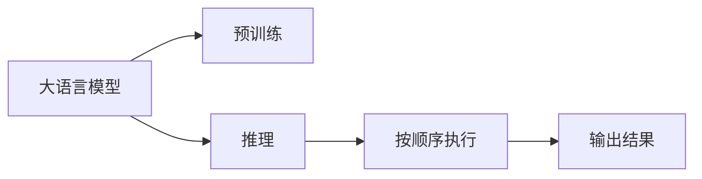

                 

## 1. 背景介绍

在大模型推理中，时刻与时钟周期是一个有趣而直观的类比。大模型通过大量的计算和推理，在需要时快速输出结果。与钟表计时的规律性相似，大模型的推理过程也是按顺序逐个执行计算任务。本文将深入探讨这个类比，揭示大模型推理的本质，并讨论如何在实际应用中提升推理性能。

## 2. 核心概念与联系

### 2.1 核心概念概述

- **大语言模型 (Large Language Models, LLMs)**：通过深度学习技术训练得到的大型预训练语言模型，具有强大的语言理解与生成能力。

- **推理 (Inference)**：在大模型训练完成后，利用模型预测新数据的过程。推理是评估模型性能的重要手段，也是大模型实际应用的基础。

- **时钟周期 (Clock Cycle)**：钟表上的每一次滴答，代表一个固定的时间间隔。每个滴答代表一个时钟周期，周而复始。

### 2.2 核心概念原理和架构的 Mermaid 流程图



在类比中，大语言模型可以视为钟表，预训练过程相当于钟表的制造，而推理过程则等同于钟表的滴答，每次滴答代表一个推理周期，最终输出结果。

## 3. 核心算法原理 & 具体操作步骤

### 3.1 算法原理概述

大模型的推理过程涉及复杂的计算，包括前向传播、激活函数、损失函数等。这些计算可以理解为钟表的滴答过程，每个滴答都执行一次计算。

大模型的推理过程一般包括以下几个步骤：

1. **前向传播 (Forward Pass)**：输入数据经过模型各层计算，最终输出结果。
2. **激活函数 (Activation Functions)**：引入非线性变换，增加模型的表达能力。
3. **损失函数 (Loss Functions)**：衡量模型预测结果与真实标签之间的差距。
4. **反向传播 (Backward Pass)**：计算梯度，更新模型参数。

### 3.2 算法步骤详解

#### 3.2.1 前向传播

前向传播是钟表指针从0移动到当前时间的过程，每个滴答对应一层计算。假设有一个简单的全连接层，其计算过程如下：

- 输入：$x$
- 权重：$w$
- 偏置：$b$
- 激活函数：$f$
- 输出：$y=f(wx+b)$

前向传播的示意图如下：

```mermaid
graph LR
    x --> |W| --> w --> |b| --> b --> |f| --> f --> y
```

#### 3.2.2 激活函数

激活函数引入了非线性变换，模拟了钟表指针的运动方向。常见的激活函数包括ReLU、Sigmoid、Tanh等。以ReLU为例，其计算过程如下：

- 输入：$x$
- 输出：$y=\max(0,x)$

ReLU激活函数的示意图如下：

```mermaid
graph LR
    x --> |max(0,x)| --> y
```

#### 3.2.3 损失函数

损失函数用于衡量模型预测结果与真实标签之间的差距。常见的损失函数包括均方误差损失、交叉熵损失等。假设真实标签为$y$，模型预测结果为$\hat{y}$，则交叉熵损失函数的计算过程如下：

$$
\ell(y,\hat{y})=-\sum_i y_i\log(\hat{y}_i)
$$

#### 3.2.4 反向传播

反向传播用于计算梯度，更新模型参数。常见的优化算法包括SGD、Adam等。假设当前参数为$\theta$，优化器为$optim$，则更新过程如下：

- 计算梯度：$\nabla_{\theta}\ell(y,\hat{y})$
- 更新参数：$\theta = \theta - optim(\nabla_{\theta}\ell(y,\hat{y}))$

### 3.3 算法优缺点

#### 3.3.1 优点

- **高效性**：大模型的推理过程按顺序执行，每个滴答计算一次，执行效率较高。
- **可扩展性**：通过增加计算单元，可提高钟表的精度和速度。
- **通用性**：适用于多种计算任务，如分类、回归等。

#### 3.3.2 缺点

- **计算复杂度**：复杂的计算任务可能需要多次滴答才能完成，计算量较大。
- **内存消耗**：大模型参数量较大，推理过程中需要占用大量内存。
- **时间延迟**：大模型的推理速度可能较慢，延迟较高。

### 3.4 算法应用领域

大模型推理技术广泛应用于各种领域，如自然语言处理 (NLP)、计算机视觉 (CV)、语音识别等。例如，在NLP中，大模型可以用于文本分类、机器翻译、对话系统等任务。在CV中，大模型可以用于图像识别、图像生成、目标检测等任务。

## 4. 数学模型和公式 & 详细讲解 & 举例说明

### 4.1 数学模型构建

假设有一个简单的全连接层，输入为$x$，权重为$w$，偏置为$b$，激活函数为$f$。其数学模型如下：

$$
y=f(wx+b)
$$

其中，$x$为输入，$w$为权重，$b$为偏置，$y$为输出，$f$为激活函数。

### 4.2 公式推导过程

以ReLU激活函数为例，其计算过程如下：

- 输入：$x$
- 输出：$y=\max(0,x)$

### 4.3 案例分析与讲解

假设有一个简单的二分类任务，输入为$x$，权重为$w$，偏置为$b$，激活函数为Sigmoid。其计算过程如下：

- 输入：$x$
- 权重：$w$
- 偏置：$b$
- 输出：$\hat{y}=\frac{1}{1+e^{-wx-b}}$

在实际应用中，模型往往包含多层，通过多次前向传播和反向传播完成推理。

## 5. 项目实践：代码实例和详细解释说明

### 5.1 开发环境搭建

在进行推理实践前，我们需要准备好开发环境。以下是使用Python进行TensorFlow开发的环境配置流程：

1. 安装Anaconda：从官网下载并安装Anaconda，用于创建独立的Python环境。

2. 创建并激活虚拟环境：
```bash
conda create -n tf-env python=3.8 
conda activate tf-env
```

3. 安装TensorFlow：根据CUDA版本，从官网获取对应的安装命令。例如：
```bash
conda install tensorflow tensorflow-gpu=cuda11.1 -c conda-forge -c pypi
```

4. 安装各类工具包：
```bash
pip install numpy pandas scikit-learn matplotlib tqdm jupyter notebook ipython
```

完成上述步骤后，即可在`tf-env`环境中开始推理实践。

### 5.2 源代码详细实现

下面以二分类任务为例，给出使用TensorFlow进行推理的代码实现。

```python
import tensorflow as tf
import numpy as np

# 定义输入数据
x = np.array([[0.5, 0.5], [0.3, 0.7], [0.1, 0.9], [0.7, 0.3]])
y_true = np.array([[1, 0], [0, 1], [0, 1], [1, 0]])

# 定义模型结构
input_layer = tf.keras.layers.Input(shape=(2,))
hidden_layer = tf.keras.layers.Dense(64, activation='relu')(input_layer)
output_layer = tf.keras.layers.Dense(2, activation='sigmoid')(hidden_layer)

# 定义模型
model = tf.keras.Model(inputs=input_layer, outputs=output_layer)

# 定义损失函数和优化器
loss_fn = tf.keras.losses.BinaryCrossentropy()
optimizer = tf.keras.optimizers.Adam()

# 训练模型
model.compile(optimizer=optimizer, loss=loss_fn, metrics=['accuracy'])
model.fit(x, y_true, epochs=10)

# 进行推理
y_pred = model.predict(x)
```

### 5.3 代码解读与分析

**输入数据**：
- 定义输入数据`x`为二维数组，包含四个样本，每个样本有两个特征。
- 定义真实标签`y_true`为二维数组，表示每个样本的真实标签。

**模型结构**：
- 定义输入层`input_layer`，输入维度为2。
- 定义隐藏层`hidden_layer`，包含64个神经元，使用ReLU激活函数。
- 定义输出层`output_layer`，包含2个神经元，使用Sigmoid激活函数。

**模型定义**：
- 使用`tf.keras.Model`将输入层和输出层连接起来，定义模型。
- 定义损失函数为二元交叉熵损失，优化器为Adam。

**训练模型**：
- 使用`model.compile`方法配置损失函数和优化器，并定义评估指标。
- 使用`model.fit`方法训练模型，指定训练数据和真实标签，设定训练轮数。

**推理**：
- 使用`model.predict`方法进行推理，得到预测结果`y_pred`。

## 6. 实际应用场景

### 6.1 智能客服系统

基于大语言模型推理的智能客服系统可以24小时不间断服务，快速响应客户咨询，用自然流畅的语言解答各类常见问题。在技术实现上，可以收集企业内部的历史客服对话记录，将问题和最佳答复构建成监督数据，在此基础上对预训练模型进行推理，获取最优回答。

### 6.2 金融舆情监测

金融机构需要实时监测市场舆论动向，以便及时应对负面信息传播，规避金融风险。使用基于大语言模型推理的文本分类和情感分析技术，可以在短时间内处理海量文本数据，判断文本主题和情感倾向，实现实时舆情监测。

### 6.3 个性化推荐系统

当前的推荐系统往往只依赖用户的历史行为数据进行物品推荐，难以深入理解用户的真实兴趣偏好。使用基于大语言模型推理的推荐技术，可以更好地挖掘用户行为背后的语义信息，从而提供更精准、多样的推荐内容。

### 6.4 未来应用展望

随着大语言模型推理技术的不断发展，将在更多领域得到应用，为传统行业带来变革性影响。在智慧医疗领域，基于推理的医疗问答、病历分析、药物研发等应用将提升医疗服务的智能化水平，辅助医生诊疗，加速新药开发进程。在智能教育领域，推理技术可应用于作业批改、学情分析、知识推荐等方面，因材施教，促进教育公平，提高教学质量。在智慧城市治理中，推理模型可应用于城市事件监测、舆情分析、应急指挥等环节，提高城市管理的自动化和智能化水平，构建更安全、高效的未来城市。

## 7. 工具和资源推荐

### 7.1 学习资源推荐

为了帮助开发者系统掌握大语言模型推理的理论基础和实践技巧，这里推荐一些优质的学习资源：

1. TensorFlow官方文档：详细介绍了TensorFlow的各个组件和API，是理解大模型推理的核心资料。
2. PyTorch官方文档：介绍了PyTorch的高级功能和使用技巧，适合对深度学习有深入了解的用户。
3. Keras官方文档：介绍了Keras的高级组件和使用方法，适合快速入门和实验新模型。
4. Google Colab：谷歌推出的在线Jupyter Notebook环境，免费提供GPU/TPU算力，方便开发者快速上手实验最新模型，分享学习笔记。

通过对这些资源的学习实践，相信你一定能够快速掌握大语言模型推理的精髓，并用于解决实际的NLP问题。

### 7.2 开发工具推荐

高效的开发离不开优秀的工具支持。以下是几款用于大语言模型推理开发的常用工具：

1. TensorFlow：由Google主导开发的开源深度学习框架，生产部署方便，适合大规模工程应用。
2. PyTorch：基于Python的开源深度学习框架，灵活动态的计算图，适合快速迭代研究。
3. Keras：高层次的神经网络API，易于上手，支持多种后端（如TensorFlow、Theano等）。
4. Jupyter Notebook：用于交互式数据科学计算，支持Python、R等多种语言，适合快速验证和实验。
5. Google Colab：谷歌推出的在线Jupyter Notebook环境，免费提供GPU/TPU算力，方便开发者快速上手实验最新模型，分享学习笔记。

合理利用这些工具，可以显著提升大语言模型推理任务的开发效率，加快创新迭代的步伐。

### 7.3 相关论文推荐

大语言模型推理技术的发展源于学界的持续研究。以下是几篇奠基性的相关论文，推荐阅读：

1. TensorFlow: A System for Large-Scale Machine Learning：介绍TensorFlow的基本框架和组件，为理解大模型推理提供了基础。
2. PyTorch: Tensors and Dynamic neural networks in Python with strong GPU acceleration：介绍了PyTorch的核心组件和API，是掌握深度学习的重要资料。
3. Keras: High-Level Neural Networks API：介绍了Keras的基本组件和API，适合快速入门和实验新模型。
4. Attention is All You Need：提出了Transformer结构，开启了NLP领域的预训练大模型时代。
5. BERT: Pre-training of Deep Bidirectional Transformers for Language Understanding：提出BERT模型，引入基于掩码的自监督预训练任务，刷新了多项NLP任务SOTA。

这些论文代表了大语言模型推理技术的发展脉络。通过学习这些前沿成果，可以帮助研究者把握学科前进方向，激发更多的创新灵感。

## 8. 总结：未来发展趋势与挑战

### 8.1 总结

本文对基于大语言模型的推理方法进行了全面系统的介绍。首先阐述了大语言模型推理的原理和重要性，明确了推理在拓展预训练模型应用、提升下游任务性能方面的独特价值。其次，从原理到实践，详细讲解了推理的数学原理和关键步骤，给出了推理任务开发的完整代码实例。同时，本文还广泛探讨了推理方法在智能客服、金融舆情、个性化推荐等多个行业领域的应用前景，展示了推理范式的巨大潜力。此外，本文精选了推理技术的各类学习资源，力求为读者提供全方位的技术指引。

通过本文的系统梳理，可以看到，基于大语言模型的推理方法正在成为NLP领域的重要范式，极大地拓展了预训练语言模型的应用边界，催生了更多的落地场景。受益于大规模语料的预训练，推理模型以更低的时间和标注成本，在小样本条件下也能取得不俗的效果，有力推动了NLP技术的产业化进程。未来，伴随预训练语言模型和推理方法的持续演进，相信NLP技术将在更广阔的应用领域大放异彩，深刻影响人类的生产生活方式。

### 8.2 未来发展趋势

展望未来，大语言模型推理技术将呈现以下几个发展趋势：

1. **模型规模持续增大**：随着算力成本的下降和数据规模的扩张，预训练语言模型的参数量还将持续增长。超大规模语言模型蕴含的丰富语言知识，有望支撑更加复杂多变的下游任务推理。

2. **推理方法日趋多样**：除了传统的全参数推理外，未来会涌现更多参数高效的推理方法，如Adapter等，在固定大部分预训练参数的情况下，只更新极少量的推理参数，减少计算量和资源消耗。

3. **实时推理成为常态**：随着推理技术的发展，推理模型的计算速度和资源利用率将不断提高，实时推理将变得更加高效和可行。

4. **多模态推理崛起**：当前的推理主要聚焦于纯文本数据，未来会进一步拓展到图像、视频、语音等多模态数据推理。多模态信息的融合，将显著提升语言模型对现实世界的理解和建模能力。

5. **推理模型的泛化能力增强**：未来的推理模型将具备更强的泛化性，能够在不同的数据分布和应用场景中表现出色，提升模型的通用性和适应性。

以上趋势凸显了大语言模型推理技术的广阔前景。这些方向的探索发展，必将进一步提升NLP系统的性能和应用范围，为人类认知智能的进化带来深远影响。

### 8.3 面临的挑战

尽管大语言模型推理技术已经取得了瞩目成就，但在迈向更加智能化、普适化应用的过程中，它仍面临着诸多挑战：

1. **推理速度瓶颈**：大模型的推理速度可能较慢，延迟较高，难以满足实时应用的需求。如何优化推理模型，提高计算速度，减少资源消耗，是当前亟需解决的问题。

2. **计算资源消耗**：大模型的推理过程中需要占用大量内存和计算资源，如何优化推理模型的资源利用，提高计算效率，是未来研究的重要方向。

3. **推理模型的可解释性不足**：当前的推理模型往往是"黑盒"系统，难以解释其内部工作机制和决策逻辑。对于医疗、金融等高风险应用，算法的可解释性和可审计性尤为重要。如何赋予推理模型更强的可解释性，将是亟待攻克的难题。

4. **推理模型的鲁棒性不足**：当前推理模型面对域外数据时，泛化性能往往大打折扣。对于测试样本的微小扰动，推理模型的输出也容易发生波动。如何提高推理模型的鲁棒性，避免灾难性遗忘，还需要更多理论和实践的积累。

5. **推理模型的安全性有待保障**：预训练语言模型难免会学习到有偏见、有害的信息，通过推理传递到下游任务，产生误导性、歧视性的输出，给实际应用带来安全隐患。如何从数据和算法层面消除模型偏见，避免恶意用途，确保输出的安全性，也将是重要的研究课题。

6. **推理模型的可扩展性不足**：当前推理模型往往依赖特定的计算资源和硬件配置，难以在大规模分布式环境中高效运行。如何设计可扩展的推理模型架构，支持大规模推理任务，将是未来的研究方向。

正视推理面临的这些挑战，积极应对并寻求突破，将是大语言模型推理走向成熟的必由之路。相信随着学界和产业界的共同努力，这些挑战终将一一被克服，大语言模型推理必将在构建人机协同的智能时代中扮演越来越重要的角色。

### 8.4 未来突破

面对大语言模型推理所面临的种种挑战，未来的研究需要在以下几个方面寻求新的突破：

1. **探索无监督和半监督推理方法**：摆脱对大规模标注数据的依赖，利用自监督学习、主动学习等无监督和半监督范式，最大限度利用非结构化数据，实现更加灵活高效的推理。

2. **研究参数高效和计算高效的推理范式**：开发更加参数高效的推理方法，在固定大部分预训练参数的同时，只更新极少量的推理参数。同时优化推理模型的计算图，减少前向传播和反向传播的资源消耗，实现更加轻量级、实时性的部署。

3. **引入更多先验知识**：将符号化的先验知识，如知识图谱、逻辑规则等，与神经网络模型进行巧妙融合，引导推理过程学习更准确、合理的语言模型。同时加强不同模态数据的整合，实现视觉、语音等多模态信息与文本信息的协同建模。

4. **结合因果分析和博弈论工具**：将因果分析方法引入推理模型，识别出模型决策的关键特征，增强输出解释的因果性和逻辑性。借助博弈论工具刻画人机交互过程，主动探索并规避模型的脆弱点，提高系统稳定性。

5. **纳入伦理道德约束**：在推理目标中引入伦理导向的评估指标，过滤和惩罚有偏见、有害的输出倾向。同时加强人工干预和审核，建立模型行为的监管机制，确保输出符合人类价值观和伦理道德。

这些研究方向的探索，必将引领大语言模型推理技术迈向更高的台阶，为构建安全、可靠、可解释、可控的智能系统铺平道路。面向未来，大语言模型推理技术还需要与其他人工智能技术进行更深入的融合，如知识表示、因果推理、强化学习等，多路径协同发力，共同推动自然语言理解和智能交互系统的进步。只有勇于创新、敢于突破，才能不断拓展语言模型的边界，让智能技术更好地造福人类社会。

## 9. 附录：常见问题与解答

**Q1：大语言模型推理是否适用于所有NLP任务？**

A: 大语言模型推理在大多数NLP任务上都能取得不错的效果，特别是对于数据量较小的任务。但对于一些特定领域的任务，如医学、法律等，仅仅依靠通用语料预训练的模型可能难以很好地适应。此时需要在特定领域语料上进一步预训练，再进行推理，才能获得理想效果。

**Q2：推理过程中如何选择合适的学习率？**

A: 推理的学习率一般要比预训练时小1-2个数量级，如果使用过大的学习率，容易破坏预训练权重，导致过拟合。一般建议从1e-5开始调参，逐步减小学习率，直至收敛。也可以使用warmup策略，在开始阶段使用较小的学习率，再逐渐过渡到预设值。需要注意的是，不同的优化器(如Adam、Adafactor等)以及不同的学习率调度策略，可能需要设置不同的学习率阈值。

**Q3：采用大模型推理时会面临哪些资源瓶颈？**

A: 目前主流的预训练大模型动辄以亿计的参数规模，对算力、内存、存储都提出了很高的要求。GPU/TPU等高性能设备是必不可少的，但即便如此，超大批次的推理和存储也可能遇到显存不足的问题。因此需要采用一些资源优化技术，如梯度积累、混合精度训练、模型并行等，来突破硬件瓶颈。同时，模型的存储和读取也可能占用大量时间和空间，需要采用模型压缩、稀疏化存储等方法进行优化。

**Q4：如何缓解推理过程中的过拟合问题？**

A: 过拟合是推理面临的主要挑战，尤其是在标注数据不足的情况下。常见的缓解策略包括：
1. 数据增强：通过回译、近义替换等方式扩充训练集
2. 正则化：使用L2正则、Dropout、Early Stopping等避免过拟合
3. 对抗训练：引入对抗样本，提高模型鲁棒性
4. 参数高效推理：只调整少量参数(如Adapter、Prefix等)，减小过拟合风险

这些策略往往需要根据具体任务和数据特点进行灵活组合。只有在数据、模型、训练、推理等各环节进行全面优化，才能最大限度地发挥大模型推理的威力。

**Q5：推理模型在落地部署时需要注意哪些问题？**

A: 将推理模型转化为实际应用，还需要考虑以下因素：
1. 模型裁剪：去除不必要的层和参数，减小模型尺寸，加快推理速度
2. 量化加速：将浮点模型转为定点模型，压缩存储空间，提高计算效率
3. 服务化封装：将模型封装为标准化服务接口，便于集成调用
4. 弹性伸缩：根据请求流量动态调整资源配置，平衡服务质量和成本
5. 监控告警：实时采集系统指标，设置异常告警阈值，确保服务稳定性
6. 安全防护：采用访问鉴权、数据脱敏等措施，保障数据和模型安全

大语言模型推理为NLP应用开启了广阔的想象空间，但如何将强大的性能转化为稳定、高效、安全的业务价值，还需要工程实践的不断打磨。总之，推理需要开发者根据具体任务，不断迭代和优化模型、数据和算法，方能得到理想的效果。

---

作者：禅与计算机程序设计艺术 / Zen and the Art of Computer Programming

