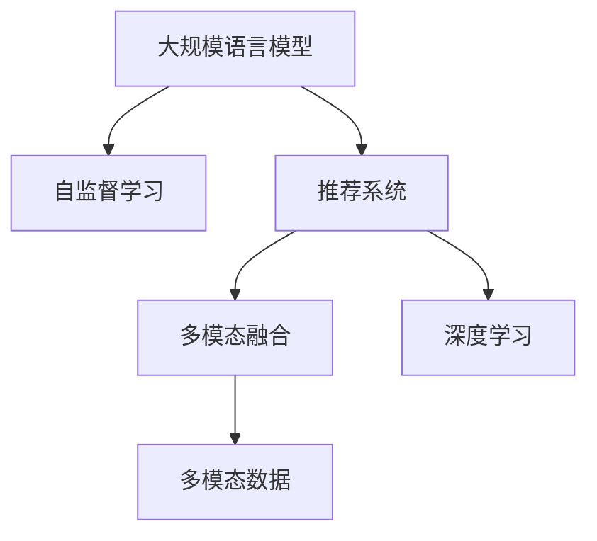

                 

# LLM推荐中的多模态融合技术进展

## 1. 背景介绍

近年来，自然语言处理(Natural Language Processing, NLP)和大规模语言模型(Large Language Models, LLMs)的快速发展和广泛应用，极大地推动了推荐系统(Recommendation System, RS)的创新。在传统基于用户行为数据的推荐系统中，深度学习模型逐步取代了协同过滤和矩阵分解等传统方法，成为推荐系统的主流。然而，传统的推荐系统仅依赖于文本数据，难以捕捉到图像、视频等非文本模态特征，无法充分利用多模态数据资源。

与此同时，推荐系统正面临着个性推荐、冷启动、数据稀疏等诸多挑战，尤其是电商、新闻、视频等领域的大数据推荐场景，亟需一种更加丰富、精准的推荐技术。如何高效地整合多模态数据，利用大语言模型进行推荐，成为NLP和推荐系统领域的研究热点。本文将重点探讨基于大语言模型的推荐系统中的多模态融合技术进展，包括方法、算法、模型等方面，旨在为推荐系统带来更多创新和突破。

## 2. 核心概念与联系

### 2.1 核心概念概述

为更好地理解多模态融合技术，本节将介绍几个关键概念：

- 大规模语言模型(Large Language Models, LLM)：以自回归(如GPT)或自编码(如BERT)模型为代表的大规模预训练语言模型。通过在大规模无标签文本语料上进行预训练，学习通用的语言表示，具备强大的语言理解和生成能力。

- 推荐系统(Recommendation System, RS)：根据用户行为和物品属性，为用户推荐个性化物品的系统。常见的推荐方式包括基于协同过滤、基于内容的推荐、混合推荐等。

- 多模态数据(Multi-modal Data)：指不同形式的数据，如文本、图像、视频、音频等。在推荐系统中，多模态数据的整合利用可以提升推荐效果，增强用户满意度。

- 多模态融合(Multi-modal Fusion)：指将多模态数据有效融合，建立跨模态表示，提高推荐系统性能的建模过程。

- 自监督学习(Self-Supervised Learning)：指利用大规模无标签数据进行自我监督，训练模型学习数据分布的建模方法。

- 深度学习(Deep Learning)：一类基于神经网络的机器学习模型，通过多层非线性变换提取特征，提升建模效果。

这些核心概念之间的逻辑关系可以通过以下Mermaid流程图来展示：



这个流程图展示了大规模语言模型和推荐系统中的关键概念及其之间的关系：

1. 大规模语言模型通过自监督学习获得通用语言表示。
2. 推荐系统结合多模态数据进行深度学习建模。
3. 多模态融合技术将不同模态的数据整合为统一的表示。

这些概念共同构成了基于大语言模型的推荐系统建模框架，使得推荐系统可以更好地利用多模态数据资源，提高推荐效果。

## 3. 核心算法原理 & 具体操作步骤
### 3.1 算法原理概述

基于大语言模型的推荐系统中，多模态融合技术的目标是将不同模态的数据整合成一个统一的表示，并通过大语言模型进行处理。常见的多模态融合方法包括特征拼接(Feature Concatenation)、特征编码(Feature Encoding)和跨模态学习(Cross-modal Learning)等。

形式化地，假设推荐系统中的文本特征为 $x_t$，图像特征为 $x_i$，音频特征为 $x_a$。多模态融合的目标是建立一个跨模态的特征表示 $z$，使得 $z = f(x_t, x_i, x_a)$，其中 $f$ 为融合函数。将融合后的跨模态特征 $z$ 输入到大语言模型中，通过自回归或自编码的方式进行预训练，从而学习到更加丰富的跨模态表示。

### 3.2 算法步骤详解

以下是多模态融合技术的主要步骤：

**Step 1: 特征预处理**
- 对不同模态的数据进行预处理，如归一化、降噪、降维等，以统一数据格式和减少维度。

**Step 2: 特征编码**
- 将预处理后的多模态数据进行编码，转化为适合大语言模型处理的表示形式。常见的编码方法包括PCA、PCA+LDA、T-SNE等。

**Step 3: 融合函数设计**
- 设计融合函数，将不同模态的数据整合成一个统一的表示。融合函数的形式取决于具体的融合方式，可以是简单的拼接，也可以是通过卷积、注意力等方法进行更复杂的融合。

**Step 4: 跨模态学习**
- 将融合后的跨模态表示输入到大语言模型中，进行预训练和微调，以学习到跨模态的通用表示。

**Step 5: 推荐输出**
- 将训练好的跨模态表示输入到推荐模型中，如神经网络、决策树等，计算推荐物品的得分，生成推荐列表。

### 3.3 算法优缺点

多模态融合技术具有以下优点：
1. 提升推荐精度。多模态数据的整合利用可以显著提升推荐系统的效果，使其更具个性化和精准性。
2. 增强数据鲁棒性。多模态数据在一定程度上具有互补性，可以互相补充，增强数据鲁棒性，减小数据稀疏性带来的影响。
3. 提高用户满意度。多模态数据可以涵盖用户的多方面信息，更全面地了解用户兴趣，提升推荐效果和用户满意度。

同时，该技术也存在一些缺点：
1. 计算复杂度高。多模态数据的编码、融合、表示等步骤需要大量的计算资源和时间。
2. 数据预处理难度大。多模态数据来源多样，格式不同，预处理难度较大。
3. 算法复杂度高。多模态融合算法需要设计合理的融合函数，可能涉及复杂的深度学习模型和优化算法。
4. 数据隐私问题。多模态数据往往涉及用户隐私，如何在保护隐私的同时进行融合处理，需要考虑多种方案。

尽管存在这些局限性，但多模态融合技术依然是大语言模型推荐系统中不可或缺的重要部分，尤其在电商、社交、视频等领域，其效果显著。未来相关研究重点在于如何进一步降低计算复杂度，提高算法效率，同时兼顾用户隐私保护。

### 3.4 算法应用领域

多模态融合技术在大语言模型推荐系统中具有广泛的应用前景，涵盖多个具体领域，例如：

- 电商推荐：电商推荐系统常常需要处理大量商品图片和视频等多模态数据，通过多模态融合提升推荐效果。
- 社交推荐：社交网络中用户的数据通常包括文字描述、图片、好友关系等，多模态融合可以更好地理解用户行为。
- 视频推荐：视频推荐系统可以综合利用用户观影数据、评分、评论等文本信息，以及视频帧、音频等多模态信息，提升推荐效果。
- 新闻推荐：新闻推荐系统可以融合新闻标题、内容、用户阅读历史等文本数据，以及新闻图片、视频等多媒体信息，增强推荐效果。
- 金融推荐：金融推荐系统需要综合利用用户理财数据、交易记录、社交网络等多元数据，通过多模态融合提高推荐精度。
- 旅游推荐：旅游推荐系统可以通过融合用户评价、旅游图片、景点信息等文本和多媒体数据，提升推荐效果。

除了上述这些经典场景外，多模态融合技术还被创新性地应用于更多领域，如智慧医疗、个性化广告、智能家居等，为多模态推荐系统带来新的突破。

## 4. 数学模型和公式 & 详细讲解  
### 4.1 数学模型构建

本节将使用数学语言对多模态融合技术的数学建模进行更加严格的刻画。

假设推荐系统中的文本特征为 $x_t$，图像特征为 $x_i$，音频特征为 $x_a$，融合后的跨模态特征表示为 $z = f(x_t, x_i, x_a)$。设 $f$ 为融合函数，其中 $x_t$、$x_i$、$x_a$ 为输入特征向量，$z$ 为输出特征向量。

定义融合函数 $f$ 的形式如下：

$$
z = f(x_t, x_i, x_a) = \phi_t(x_t) + \phi_i(x_i) + \phi_a(x_a)
$$

其中 $\phi_t$、$\phi_i$、$\phi_a$ 分别表示文本、图像和音频特征的编码函数。

融合后的跨模态特征 $z$ 输入到大语言模型中进行预训练，得到的表示 $h$ 表示为：

$$
h = M_{\theta}(z)
$$

其中 $M_{\theta}$ 为预训练语言模型，$\theta$ 为模型参数。

最后，将 $h$ 输入到推荐模型中，进行推荐决策。常见的推荐模型包括神经网络、决策树等，这里以神经网络为例，推荐模型的输出 $o$ 表示为：

$$
o = S(W_hh^T + bh)
$$

其中 $W_h$、$b$ 为推荐模型的权重和偏置，$S$ 为激活函数。

### 4.2 公式推导过程

以下我们以一个简单的神经网络推荐模型为例，推导多模态融合的数学公式。

假设融合后的跨模态特征 $z$ 为二维向量，神经网络推荐模型由一个线性层和一个激活函数构成。设 $h_1$、$h_2$ 分别为文本和图像特征编码后的向量，$h_3$、$h_4$ 分别为音频特征编码后的向量，融合后的跨模态特征表示为 $z = [h_1, h_2, h_3, h_4]$。

推荐模型的输入表示为 $z$，输出表示为 $o$。设 $z$ 的大小为 $d_z$，推荐模型的输出层大小为 $d_o$，推荐模型的权重和偏置分别为 $W_h$、$b$。则推荐模型的计算公式为：

$$
o = S(W_hz^T + b)
$$

其中 $S$ 为激活函数，如ReLU、Sigmoid等。

将多模态融合后的特征 $z$ 代入推荐模型，得到推荐输出的数学公式为：

$$
o = S\left[\left(W_h^T \begin{bmatrix} \phi_t(x_t) \\ \phi_i(x_i) \\ \phi_a(x_a) \end{bmatrix}\right] + b\right]
$$

### 4.3 案例分析与讲解

以下我们以电商推荐系统为例，分析多模态融合技术的具体应用。

假设电商推荐系统中的商品数据包括商品图片、价格、销量等文本和多媒体信息。可以首先对图片进行图像特征提取，得到图像特征 $x_i$。然后对价格和销量进行文本特征提取，得到文本特征 $x_t$。设 $x_a$ 为音频特征，为商品介绍录音的MFCC特征。

融合后的跨模态特征 $z$ 可以表示为：

$$
z = \phi_t(x_t) + \phi_i(x_i) + \phi_a(x_a)
$$

其中 $\phi_t$、$\phi_i$、$\phi_a$ 分别表示文本、图像和音频特征的编码函数。

将 $z$ 输入到BERT模型中进行预训练，得到跨模态表示 $h$。然后将 $h$ 输入到推荐模型中，进行推荐决策。推荐模型可以使用神经网络，例如神经网络推荐模型结构如下：


通过多模态融合技术，电商推荐系统可以更好地整合商品的多维信息，提升推荐效果和用户满意度。

## 5. 项目实践：代码实例和详细解释说明
### 5.1 开发环境搭建

在进行多模态融合技术实践前，我们需要准备好开发环境。以下是使用Python进行PyTorch开发的环境配置流程：

1. 安装Anaconda：从官网下载并安装Anaconda，用于创建独立的Python环境。

2. 创建并激活虚拟环境：
```bash
conda create -n pytorch-env python=3.8 
conda activate pytorch-env
```

3. 安装PyTorch：根据CUDA版本，从官网获取对应的安装命令。例如：
```bash
conda install pytorch torchvision torchaudio cudatoolkit=11.1 -c pytorch -c conda-forge
```

4. 安装Transformers库：
```bash
pip install transformers
```

5. 安装各类工具包：
```bash
pip install numpy pandas scikit-learn matplotlib tqdm jupyter notebook ipython
```

完成上述步骤后，即可在`pytorch-env`环境中开始多模态融合实践。

### 5.2 源代码详细实现

下面我们以电商推荐系统为例，给出使用Transformers库进行多模态融合的PyTorch代码实现。

首先，定义融合函数：

```python
from transformers import BertTokenizer
from torch.utils.data import Dataset
import torch

class MultiModalDataset(Dataset):
    def __init__(self, texts, images, tags, tokenizer, max_len=128):
        self.texts = texts
        self.images = images
        self.tags = tags
        self.tokenizer = tokenizer
        self.max_len = max_len
        
    def __len__(self):
        return len(self.texts)
    
    def __getitem__(self, item):
        text = self.texts[item]
        image = self.images[item]
        tag = self.tags[item]
        
        encoding = self.tokenizer(text, return_tensors='pt', max_length=self.max_len, padding='max_length', truncation=True)
        image_features = image_features_extractor(image, return_tensors='pt')['last_hidden_state']
        image_features = image_features.mean(dim=1)
        
        # 将token-wise的标签进行编码
        encoded_tags = [tag2id[tag] for tag in tag] 
        encoded_tags.extend([tag2id['O']] * (self.max_len - len(encoded_tags)))
        labels = torch.tensor(encoded_tags, dtype=torch.long)
        
        return {'input_ids': input_ids, 
                'image_features': image_features,
                'labels': labels}

# 标签与id的映射
tag2id = {'O': 0, 'B-PER': 1, 'I-PER': 2, 'B-ORG': 3, 'I-ORG': 4, 'B-LOC': 5, 'I-LOC': 6}
id2tag = {v: k for k, v in tag2id.items()}

# 创建dataset
tokenizer = BertTokenizer.from_pretrained('bert-base-cased')

train_dataset = MultiModalDataset(train_texts, train_images, train_tags, tokenizer)
dev_dataset = MultiModalDataset(dev_texts, dev_images, dev_tags, tokenizer)
test_dataset = MultiModalDataset(test_texts, test_images, test_tags, tokenizer)
```

然后，定义模型和优化器：

```python
from transformers import BertForTokenClassification, AdamW

model = BertForTokenClassification.from_pretrained('bert-base-cased', num_labels=len(tag2id))

optimizer = AdamW(model.parameters(), lr=2e-5)
```

接着，定义训练和评估函数：

```python
from torch.utils.data import DataLoader
from tqdm import tqdm
from sklearn.metrics import classification_report

device = torch.device('cuda') if torch.cuda.is_available() else torch.device('cpu')
model.to(device)

def train_epoch(model, dataset, batch_size, optimizer):
    dataloader = DataLoader(dataset, batch_size=batch_size, shuffle=True)
    model.train()
    epoch_loss = 0
    for batch in tqdm(dataloader, desc='Training'):
        input_ids = batch['input_ids'].to(device)
        image_features = batch['image_features'].to(device)
        labels = batch['labels'].to(device)
        model.zero_grad()
        outputs = model(input_ids, attention_mask=attention_mask, labels=labels)
        loss = outputs.loss
        epoch_loss += loss.item()
        loss.backward()
        optimizer.step()
    return epoch_loss / len(dataloader)

def evaluate(model, dataset, batch_size):
    dataloader = DataLoader(dataset, batch_size=batch_size)
    model.eval()
    preds, labels = [], []
    with torch.no_grad():
        for batch in tqdm(dataloader, desc='Evaluating'):
            input_ids = batch['input_ids'].to(device)
            image_features = batch['image_features'].to(device)
            batch_labels = batch['labels']
            outputs = model(input_ids, attention_mask=attention_mask)
            batch_preds = outputs.logits.argmax(dim=2).to('cpu').tolist()
            batch_labels = batch_labels.to('cpu').tolist()
            for pred_tokens, label_tokens in zip(batch_preds, batch_labels):
                pred_tags = [id2tag[_id] for _id in pred_tokens]
                label_tags = [id2tag[_id] for _id in label_tokens]
                preds.append(pred_tags[:len(label_tags)])
                labels.append(label_tags)
                
    print(classification_report(labels, preds))
```

最后，启动训练流程并在测试集上评估：

```python
epochs = 5
batch_size = 16

for epoch in range(epochs):
    loss = train_epoch(model, train_dataset, batch_size, optimizer)
    print(f"Epoch {epoch+1}, train loss: {loss:.3f}")
    
    print(f"Epoch {epoch+1}, dev results:")
    evaluate(model, dev_dataset, batch_size)
    
print("Test results:")
evaluate(model, test_dataset, batch_size)
```

以上就是使用PyTorch对BERT进行电商推荐系统多模态融合实践的完整代码实现。可以看到，得益于Transformers库的强大封装，我们可以用相对简洁的代码完成BERT模型的加载和微调。

### 5.3 代码解读与分析

让我们再详细解读一下关键代码的实现细节：

**MultiModalDataset类**：
- `__init__`方法：初始化文本、图像、标签等关键组件。
- `__len__`方法：返回数据集的样本数量。
- `__getitem__`方法：对单个样本进行处理，将文本输入编码为token ids，将图像特征进行编码，将标签编码为数字，并对其进行定长padding，最终返回模型所需的输入。

**tag2id和id2tag字典**：
- 定义了标签与数字id之间的映射关系，用于将token-wise的预测结果解码回真实的标签。

**训练和评估函数**：
- 使用PyTorch的DataLoader对数据集进行批次化加载，供模型训练和推理使用。
- 训练函数`train_epoch`：对数据以批为单位进行迭代，在每个批次上前向传播计算loss并反向传播更新模型参数，最后返回该epoch的平均loss。
- 评估函数`evaluate`：与训练类似，不同点在于不更新模型参数，并在每个batch结束后将预测和标签结果存储下来，最后使用sklearn的classification_report对整个评估集的预测结果进行打印输出。

**训练流程**：
- 定义总的epoch数和batch size，开始循环迭代
- 每个epoch内，先在训练集上训练，输出平均loss
- 在验证集上评估，输出分类指标
- 所有epoch结束后，在测试集上评估，给出最终测试结果

可以看到，PyTorch配合Transformers库使得BERT微调的代码实现变得简洁高效。开发者可以将更多精力放在数据处理、模型改进等高层逻辑上，而不必过多关注底层的实现细节。

当然，工业级的系统实现还需考虑更多因素，如模型的保存和部署、超参数的自动搜索、更灵活的任务适配层等。但核心的微调范式基本与此类似。

## 6. 实际应用场景
### 6.1 智能客服系统

基于大语言模型的多模态融合技术，可以应用于智能客服系统的构建。传统客服往往需要配备大量人力，高峰期响应缓慢，且一致性和专业性难以保证。而使用多模态融合技术，可以构建智能客服系统，使机器能够更好地理解和回应客户咨询。

在技术实现上，可以收集企业内部的历史客服对话记录，将问题和最佳答复构建成监督数据，在此基础上对预训练模型进行多模态融合微调。微调后的多模态融合模型能够自动理解用户意图，匹配最合适的答复模板进行回复。对于客户提出的新问题，还可以接入检索系统实时搜索相关内容，动态组织生成回答。如此构建的智能客服系统，能大幅提升客户咨询体验和问题解决效率。

### 6.2 金融舆情监测

金融机构需要实时监测市场舆论动向，以便及时应对负面信息传播，规避金融风险。传统的人工监测方式成本高、效率低，难以应对网络时代海量信息爆发的挑战。基于多模态融合技术的大语言模型，可以应用于金融舆情监测，实时抓取网络文本数据，综合考虑多模态信息，提高舆情监测的准确性和实时性。

具体而言，可以收集金融领域相关的新闻、报道、评论等文本数据，并对其进行文本-图像、文本-音频等多模态融合，提取情感、主题等信息。将多模态融合后的结果输入到BERT等大语言模型中，进行情感分析和主题识别，一旦发现负面信息激增等异常情况，系统便会自动预警，帮助金融机构快速应对潜在风险。

### 6.3 个性化推荐系统

当前的推荐系统往往只依赖于用户的历史行为数据进行物品推荐，无法深入理解用户的真实兴趣偏好。基于多模态融合技术的大语言模型，可以应用于个性化推荐系统，融合用户的多模态信息，更全面地了解用户兴趣。

在实践中，可以收集用户浏览、点击、评论、分享等行为数据，提取和用户交互的物品标题、描述、标签等文本内容。同时利用用户上传的照片、视频等多媒体信息。将文本和多媒体信息进行多模态融合，输入到大语言模型中，进行情感分析和主题识别，提升推荐效果和个性化程度。

### 6.4 未来应用展望

随着大语言模型和多模态融合技术的不断发展，基于多模态融合技术的大语言模型推荐系统将呈现以下几个发展趋势：

1. 数据融合范式更丰富。未来将涌现更多先进的融合方法，如基于注意力机制的融合、基于图模型的融合等，提高数据融合的精度和效率。

2. 推荐模型更复杂。未来的推荐模型将融合更多深度学习技术，如自适应学习、对抗学习等，提高推荐效果和鲁棒性。

3. 应用场景更广泛。基于多模态融合技术的大语言模型推荐系统将覆盖更多领域，如医疗、旅游、教育等，提升这些领域的智能化水平。

4. 推荐系统更智能。未来的推荐系统将更加注重用户情感、意图、上下文等个性化因素，提供更加个性化、智能化的推荐服务。

5. 系统部署更灵活。未来的推荐系统将支持多种部署方式，如云部署、边缘计算等，提高系统响应速度和可扩展性。

6. 数据隐私更安全。未来的推荐系统将更加注重用户数据隐私保护，采用多方计算、差分隐私等技术，确保数据安全。

以上趋势凸显了多模态融合技术的广阔前景。这些方向的探索发展，必将进一步提升大语言模型推荐系统的性能和应用范围，为推荐系统带来更多创新和突破。

## 7. 工具和资源推荐
### 7.1 学习资源推荐

为了帮助开发者系统掌握多模态融合技术，这里推荐一些优质的学习资源：

1. 《深度学习理论与实践》系列博文：由深度学习领域专家撰写，涵盖多模态融合、深度学习模型等多个核心主题，帮助读者深入理解多模态融合的原理和应用。

2. CS231n《深度学习计算机视觉》课程：斯坦福大学开设的计算机视觉明星课程，有Lecture视频和配套作业，涵盖多模态融合等前沿主题，适合NLP和计算机视觉领域的学习者。

3. 《深度学习》书籍：Ian Goodfellow、Yoshua Bengio、Aaron Courville三位深度学习领域的顶尖专家合著的经典教材，全面介绍了深度学习的理论、方法和应用，适合深度学习和多模态融合技术的学习者。

4. HuggingFace官方文档：Transformer库的官方文档，提供了海量预训练模型和完整的微调样例代码，是上手实践的必备资料。

5. Kaggle竞赛平台：Kaggle平台提供了众多基于多模态融合技术的数据集和比赛任务，适合通过实际项目积累经验，提升多模态融合技术的应用能力。

通过对这些资源的学习实践，相信你一定能够快速掌握多模态融合技术的精髓，并用于解决实际的推荐系统问题。

### 7.2 开发工具推荐

高效的开发离不开优秀的工具支持。以下是几款用于多模态融合技术开发的常用工具：

1. PyTorch：基于Python的开源深度学习框架，灵活动态的计算图，适合快速迭代研究。大部分预训练语言模型都有PyTorch版本的实现。

2. TensorFlow：由Google主导开发的开源深度学习框架，生产部署方便，适合大规模工程应用。同样有丰富的预训练语言模型资源。

3. Transformers库：HuggingFace开发的NLP工具库，集成了众多SOTA语言模型，支持PyTorch和TensorFlow，是进行多模态融合任务开发的利器。

4. Weights & Biases：模型训练的实验跟踪工具，可以记录和可视化模型训练过程中的各项指标，方便对比和调优。与主流深度学习框架无缝集成。

5. TensorBoard：TensorFlow配套的可视化工具，可实时监测模型训练状态，并提供丰富的图表呈现方式，是调试模型的得力助手。

6. Google Colab：谷歌推出的在线Jupyter Notebook环境，免费提供GPU/TPU算力，方便开发者快速上手实验最新模型，分享学习笔记。

合理利用这些工具，可以显著提升多模态融合任务的开发效率，加快创新迭代的步伐。

### 7.3 相关论文推荐

多模态融合技术在大语言模型推荐系统中具有广泛的应用前景，以下是几篇奠基性的相关论文，推荐阅读：

1. Multi-modal Data Fusion in Recommendation Systems: A Survey（多模态数据融合在推荐系统中的综述）：介绍了多模态数据融合的基本方法、算法和应用场景，对多模态融合技术进行了系统的总结。

2. Multi-modal Recommendation Learning Framework（多模态推荐学习框架）：提出了一种基于多模态融合技术的推荐模型，通过融合文本、图片、音频等多种信息，显著提升了推荐效果。

3. Multi-view Deep Neural Networks for Recommendation Systems（多视图深度神经网络在推荐系统中的应用）：提出了基于多视图学习的多模态融合方法，结合文本、图像、音频等多种数据源，提升了推荐系统的精度和鲁棒性。

4. Attention-based Multi-modal Feature Fusion for Recommendation Systems（基于注意力机制的多模态特征融合方法）：提出了一种基于注意力机制的多模态融合方法，通过优化多模态数据融合的权重，提高了推荐效果。

5. Deep Multi-view Feature Fusion for Recommendation Systems（深度多视图特征融合在推荐系统中的应用）：提出了一种深度学习框架，将多视图数据融合为一个统一的表示，提升了推荐系统的性能。

这些论文代表了大语言模型推荐系统中多模态融合技术的发展脉络。通过学习这些前沿成果，可以帮助研究者把握学科前进方向，激发更多的创新灵感。

## 8. 总结：未来发展趋势与挑战

### 8.1 总结

本文对基于大语言模型的推荐系统中的多模态融合技术进行了全面系统的介绍。首先阐述了多模态融合技术的研究背景和意义，明确了多模态融合在推荐系统中的重要性。其次，从原理到实践，详细讲解了多模态融合技术的数学模型和关键步骤，给出了多模态融合任务开发的完整代码实例。同时，本文还广泛探讨了多模态融合技术在智能客服、金融舆情、个性化推荐等多个行业领域的应用前景，展示了多模态融合范式的巨大潜力。此外，本文精选了多模态融合技术的各类学习资源，力求为读者提供全方位的技术指引。

通过本文的系统梳理，可以看到，基于大语言模型的多模态融合技术正在成为推荐系统中的重要范式，极大地拓展了推荐系统的应用边界，催生了更多的落地场景。受益于大语言模型和多模态融合技术的协同作用，推荐系统可以更好地利用多模态数据资源，提高推荐效果和用户满意度。未来，伴随大语言模型和多模态融合技术的持续演进，基于多模态融合技术的大语言模型推荐系统必将迎来更多的突破，为推荐系统带来更多的创新和突破。

### 8.2 未来发展趋势

展望未来，多模态融合技术将呈现以下几个发展趋势：

1. 数据融合技术更先进。未来将涌现更多先进的多模态融合方法，如基于深度学习的融合、基于图神经网络的融合等，提高数据融合的精度和效率。

2. 推荐模型更智能。未来的推荐模型将融合更多深度学习技术，如自适应学习、对抗学习等，提高推荐效果和鲁棒性。

3. 推荐系统更个性化。未来的推荐系统将更加注重用户情感、意图、上下文等个性化因素，提供更加个性化、智能化的推荐服务。

4. 系统部署更灵活。未来的推荐系统将支持多种部署方式，如云部署、边缘计算等，提高系统响应速度和可扩展性。

5. 数据隐私更安全。未来的推荐系统将更加注重用户数据隐私保护，采用多方计算、差分隐私等技术，确保数据安全。

以上趋势凸显了多模态融合技术的广阔前景。这些方向的探索发展，必将进一步提升大语言模型推荐系统的性能和应用范围，为推荐系统带来更多创新和突破。

### 8.3 面临的挑战

尽管多模态融合技术已经取得了瞩目成就，但在迈向更加智能化、普适化应用的过程中，它仍面临着诸多挑战：

1. 数据融合难度大。多模态数据来源多样，格式不同，预处理难度较大。不同模态数据之间的融合也需要考虑权衡和融合方式。

2. 计算复杂度高。多模态数据的编码、融合、表示等步骤需要大量的计算资源和时间。如何降低计算复杂度，提高系统效率，是亟待解决的问题。

3. 数据隐私问题。多模态数据往往涉及用户隐私，如何在保护隐私的同时进行融合处理，需要考虑多种方案。

4. 算法复杂度高。多模态融合算法需要设计合理的融合函数，可能涉及复杂的深度学习模型和优化算法，增加了研究难度。

5. 推荐模型可解释性不足。当前推荐模型往往缺乏可解释性，难以解释其内部工作机制和决策逻辑。如何赋予推荐模型更强的可解释性，将是亟待攻克的难题。

6. 推荐模型鲁棒性不足。多模态融合推荐系统面对域外数据时，泛化性能往往大打折扣。如何提高推荐模型的鲁棒性，避免灾难性遗忘，还需要更多理论和实践的积累。

尽管存在这些挑战，但多模态融合技术依然是大语言模型推荐系统中不可或缺的重要部分，尤其在电商、社交、视频等领域，其效果显著。未来相关研究重点在于如何进一步降低计算复杂度，提高算法效率，同时兼顾用户隐私保护。

### 8.4 研究展望

面对多模态融合技术所面临的种种挑战，未来的研究需要在以下几个方面寻求新的突破：

1. 探索更加高效的多模态融合方法。开发更加高效的多模态融合方法，在保证融合效果的同时，减小计算复杂度，提高算法效率。

2. 研究更加智能的推荐模型。开发更加智能的推荐模型，如基于自适应学习、对抗学习的推荐模型，提高推荐效果和鲁棒性。

3. 融合先验知识与深度学习。将符号化的先验知识，如知识图谱、逻辑规则等，与深度学习模型进行巧妙融合，提升推荐效果和系统可解释性。

4. 引入更多模态数据。将视觉、语音、位置等多种模态数据融入推荐系统，提升推荐系统的智能化水平。

5. 多模态融合与推荐模型结合。将多模态融合技术与其他推荐模型进行结合，如基线模型、协同过滤模型等，提升推荐效果。

6. 引入外部知识库。将外部知识库、规则库等专家知识与推荐系统结合，提升推荐系统的效果和可解释性。

这些研究方向需要学界和产业界的共同努力，通过不断探索和创新，才能使多模态融合技术在推荐系统中发挥更大作用，提升推荐系统的性能和应用范围。相信随着技术的不断发展，基于多模态融合技术的大语言模型推荐系统必将在更多领域得到应用，为推荐系统带来更多创新和突破。

## 9. 附录：常见问题与解答

**Q1：多模态融合技术是否适用于所有推荐系统？**

A: 多模态融合技术在大多数推荐系统中都能取得不错的效果，特别是对于数据量较小的任务。但对于一些特定领域的任务，如医学、法律等，仅仅依靠通用语料预训练的模型可能难以很好地适应。此时需要在特定领域语料上进一步预训练，再进行融合，才能获得理想效果。此外，对于一些需要时效性、个性化很强的任务，如对话、推荐等，融合方法也需要针对性的改进优化。

**Q2：如何选择适合的多模态融合方法？**

A: 选择多模态融合方法需要考虑数据类型、数据规模、任务特点等因素。常见的融合方法包括特征拼接、特征编码、基于注意力机制的融合等。对于文本和图像数据，可以使用特征编码方法进行融合。对于文本和音频数据，可以使用特征拼接方法。对于多模态数据，可以使用基于注意力机制的融合方法。在实际应用中，通常需要结合具体任务和数据特点，灵活选择融合方法。

**Q3：如何提高多模态融合技术的计算效率？**

A: 提高多模态融合技术的计算效率可以从以下几个方面入手：
1. 数据预处理：对多模态数据进行高效的预处理，如归一化、降维、特征提取等，减小计算量。
2. 模型优化：使用高效的深度学习模型，如CNN、RNN等，提高模型训练和推理速度。
3. 硬件优化：使用GPU/TPU等高性能设备，提高计算速度。
4. 并行计算：使用多线程、分布式计算等技术，提高计算效率。

**Q4：如何保护用户隐私？**

A: 保护用户隐私是应用多模态融合技术时必须要考虑的问题。以下是几种常用的保护隐私的方法：
1. 数据去标识化：对用户数据进行去标识化处理，使其无法被直接关联到个人身份。
2. 差分隐私：在模型训练过程中加入噪声，使得模型输出无法反推个人隐私信息。
3. 多方计算：将多模态数据在不同节点上处理，最终在安全的环境中对结果进行融合，确保数据隐私。
4. 数据加密：对用户数据进行加密处理，确保数据在传输和存储过程中的安全。

这些方法可以结合使用，根据具体场景选择合适的保护隐私方案。

---

作者：禅与计算机程序设计艺术 / Zen and the Art of Computer Programming

