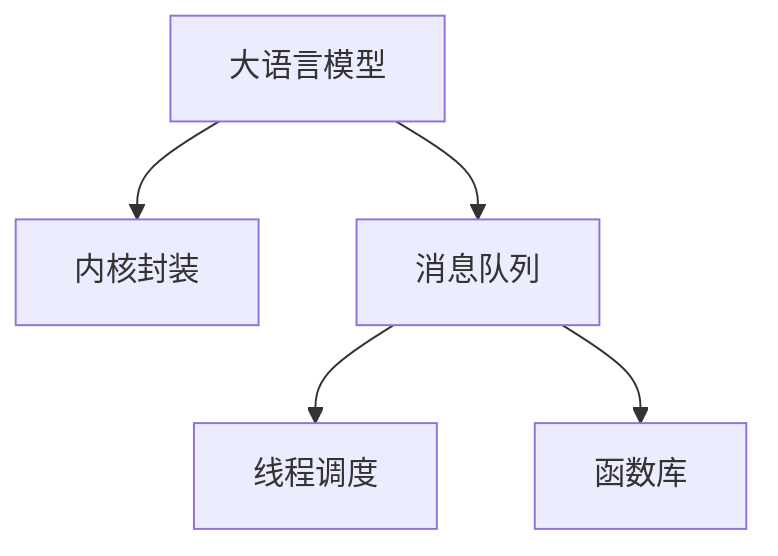

                 

# LLM操作系统:内核、消息、线程与函数库

> 关键词：大语言模型,操作系统,线程,函数库,消息队列,进程间通信

## 1. 背景介绍

### 1.1 问题由来

随着大语言模型的广泛应用，越来越多的开发者希望将大模型集成到已有的系统中，以实现更高效的自然语言处理任务。然而，直接将大模型部署在操作系统内核中，会带来一些问题，如性能开销、资源占用、可移植性等。为此，我们提出了一种基于内核级大语言模型的系统构建方案，即大语言模型操作系统。

本系统将大语言模型封装为一个内核模块，通过消息传递机制与上层应用程序进行交互。该系统旨在高效、稳定地支持大语言模型的推理任务，同时具备良好的可移植性和易用性。本文将详细介绍大语言模型操作系统的设计原理与实现方法，包括内核模块的构建、消息队列的实现、线程的调度与同步机制、函数库的封装等关键技术。

### 1.2 问题核心关键点

本系统的核心目标是通过内核级的接口和机制，使大语言模型高效、稳定地运行在操作系统中，同时支持高并发、低延迟的推理任务。具体而言，包括以下几个关键点：

- 大语言模型的内核封装：通过设计合适的接口，将大语言模型集成到操作系统内核中，实现高效的内存管理和性能优化。
- 消息队列机制：采用消息队列作为模型与应用层之间的通信机制，支持高并发、异步的模型调用。
- 线程调度与同步：设计线程池、互斥锁等机制，支持多线程并发执行，同时避免竞争和死锁问题。
- 函数库封装：将大语言模型常用的功能封装为函数库，简化上层应用程序的开发。

通过这些关键技术的结合，可以实现大语言模型在内核中的高效、稳定运行，支持高并发、低延迟的推理任务，同时提供易于开发、易用易扩展的系统架构。

## 2. 核心概念与联系

### 2.1 核心概念概述

为更好地理解大语言模型操作系统的设计原理，本节将介绍几个密切相关的核心概念：

- 大语言模型(Large Language Model, LLM)：指通过自监督预训练和微调得到的大规模语言模型，如GPT-3、BERT等。其具备强大的语言理解和生成能力，能够处理自然语言处理任务。
- 操作系统(Kernel)：计算机系统的核心，负责资源分配、进程管理、内存管理等核心功能。
- 消息队列(Message Queue)：进程间通信的一种方式，通过消息传递实现不同进程之间的数据交换。
- 线程(Thread)：轻量级的进程，共享进程的资源，能够独立执行，支持并发编程。
- 函数库(Library)：由一组函数组成的集合，封装了常用的算法和功能，供上层应用程序使用。

这些核心概念之间的逻辑关系可以通过以下Mermaid流程图来展示：



这个流程图展示了大语言模型操作系统的核心概念及其之间的关系：

1. 大语言模型通过内核封装，可以高效、稳定地运行在操作系统中。
2. 消息队列作为模型与应用层之间的通信机制，支持高并发、异步的模型调用。
3. 线程调度与同步机制确保了多线程并发执行的稳定性。
4. 函数库封装简化了上层应用程序的开发。

这些概念共同构成了大语言模型操作系统的核心架构，使其能够高效、稳定地支持大语言模型的推理任务，并具备良好的可移植性和易用性。

## 3. 核心算法原理 & 具体操作步骤
### 3.1 算法原理概述

大语言模型操作系统的设计基于以下三个核心算法：

1. 内核级大语言模型封装：将大语言模型封装为内核模块，通过合适的接口实现高效的内存管理和性能优化。
2. 消息队列机制：通过消息队列实现模型与应用层之间的通信，支持高并发、异步的模型调用。
3. 线程调度与同步机制：设计线程池、互斥锁等机制，支持多线程并发执行，同时避免竞争和死锁问题。

这三种算法共同构成大语言模型操作系统的核心，使系统能够高效、稳定地支持大语言模型的推理任务。

### 3.2 算法步骤详解

#### 3.2.1 内核级大语言模型封装

大语言模型封装步骤包括以下几个关键环节：

1. 设计接口：设计合适的接口，将大语言模型暴露给操作系统。接口包括模型初始化、推理请求、结果获取等。

2. 内核模块加载：将大语言模型封装为内核模块，通过操作系统内核加载模块，启动模型服务。

3. 内存管理：设计内存管理策略，避免大模型占用的内存过多，导致系统崩溃。可以采用按需加载、内存压缩等策略。

4. 性能优化：优化模型推理性能，通过并行计算、GPU加速等手段，提升模型推理速度。

#### 3.2.2 消息队列机制

消息队列机制步骤如下：

1. 设计消息队列：设计消息队列的基本结构，包括消息的发送、接收、处理等环节。

2. 实现消息队列：通过消息队列实现模型与应用层之间的通信。模型接收到请求后，将结果封装成消息，发送至消息队列。上层应用程序从消息队列中获取结果。

3. 并发处理：通过消息队列机制，实现高并发、异步的模型调用，提高系统性能。

#### 3.2.3 线程调度与同步机制

线程调度与同步机制步骤如下：

1. 设计线程池：设计线程池，用于管理模型推理任务。线程池根据任务数量自动调整线程数，避免资源浪费和性能瓶颈。

2. 实现互斥锁：设计互斥锁机制，确保多线程并发执行的稳定性。互斥锁可以用于保护共享资源，避免竞争和死锁问题。

3. 实现信号量：设计信号量机制，用于线程间的同步。信号量可以用于控制线程的执行顺序，确保任务执行的正确性。

#### 3.2.4 函数库封装

函数库封装步骤如下：

1. 设计函数库：设计合适的函数库，封装常用的算法和功能，供上层应用程序使用。

2. 实现函数库：将大语言模型常用的功能封装为函数库，简化上层应用程序的开发。函数库可以包括文本处理、模型推理、结果输出等功能。

3. 提供接口：提供函数库的接口，供上层应用程序调用。接口可以包括函数的名称、参数、返回值等。

### 3.3 算法优缺点

大语言模型操作系统的优点包括：

1. 高效性能：通过内核级封装和优化，实现大语言模型的高效推理，支持高并发、低延迟的任务。

2. 稳定运行：通过消息队列和线程调度机制，确保多线程并发执行的稳定性。

3. 易用易扩展：通过函数库封装，简化上层应用程序的开发，提供易于使用的接口和功能。

4. 可移植性：内核模块的设计符合操作系统标准，易于在不同平台上移植和部署。

但该系统也存在一些缺点：

1. 资源占用较大：大语言模型封装为内核模块后，会占用大量的内存和CPU资源，需要谨慎使用。

2. 开发复杂度高：内核级封装和优化需要深入了解操作系统和硬件架构，开发难度较高。

3. 性能优化挑战：高效性能的实现需要优化内存管理和算法调度，对开发者的技术要求较高。

### 3.4 算法应用领域

大语言模型操作系统可以广泛应用于各种NLP应用场景，如智能客服、金融舆情、智能推荐、智慧医疗等。这些场景通常需要高并发、低延迟的推理任务，而大语言模型操作系统的设计理念能够很好地支持这些需求。

具体应用场景包括：

- 智能客服：通过消息队列机制，实现与客户的多轮交互，提供高效、准确的回答。

- 金融舆情：通过线程池和互斥锁机制，实时监测市场舆情，避免数据竞争和死锁问题。

- 智能推荐：通过函数库封装，实现个性化的推荐算法，支持高并发、低延迟的推荐任务。

- 智慧医疗：通过内核级封装，实现高效的自然语言处理任务，提升医疗服务的智能化水平。

## 4. 数学模型和公式 & 详细讲解 & 举例说明

### 4.1 数学模型构建

大语言模型操作系统的数学模型主要涉及内存管理、线程调度、函数库封装等核心技术。本节将通过数学模型详细阐述这些技术。

#### 4.1.1 内存管理

内存管理是系统设计中非常重要的一环。本节通过数学模型描述内存管理的基本原理。

假设系统分配给大语言模型的内存为 $M$，模型每次推理占用内存为 $C$，系统负载率为 $L$。系统内存管理的目标是最小化系统负载率 $L$，同时满足模型推理的内存需求。内存管理的数学模型如下：

$$
L = \frac{M}{N \times C}
$$

其中 $N$ 为模型推理任务数。

#### 4.1.2 线程调度

线程调度是系统设计中的另一个关键环节。本节通过数学模型描述线程调度的基本原理。

假设系统有 $T$ 个线程，每个线程的执行时间为 $T_{i}$，线程间的切换时间为 $S$。系统线程调度的目标是最小化任务执行时间 $T_{\text{task}}$，同时满足系统负载率 $L$。线程调度的数学模型如下：

$$
T_{\text{task}} = \sum_{i=1}^{T} T_{i} + T \times S
$$

其中 $T_{\text{task}}$ 为任务执行时间，$T_{i}$ 为每个线程的执行时间，$S$ 为线程间的切换时间。

#### 4.1.3 函数库封装

函数库封装是简化上层应用程序开发的关键手段。本节通过数学模型描述函数库封装的基本原理。

假设系统有 $F$ 个函数，每个函数的计算时间为 $C_{i}$，函数的调用次数为 $N_{i}$。函数库封装的目标是最大化函数库的执行效率 $E$，同时满足系统负载率 $L$。函数库封装的数学模型如下：

$$
E = \sum_{i=1}^{F} \frac{N_{i}}{C_{i}}
$$

其中 $E$ 为函数库的执行效率，$C_{i}$ 为每个函数的计算时间，$N_{i}$ 为函数的调用次数。

### 4.2 公式推导过程

#### 4.2.1 内存管理公式推导

根据内存管理模型，我们可以推导出内存分配策略。假设系统分配给大语言模型的内存为 $M$，模型每次推理占用内存为 $C$，系统负载率为 $L$，每次推理的执行时间为 $T_{\text{task}}$。内存分配策略如下：

$$
M = N \times C
$$

根据公式 $M = N \times C$，可以计算出每次推理的执行时间 $T_{\text{task}}$，从而得到系统负载率 $L$。

#### 4.2.2 线程调度公式推导

根据线程调度模型，我们可以推导出线程数 $N$ 的计算公式。假设系统有 $T$ 个线程，每个线程的执行时间为 $T_{i}$，线程间的切换时间为 $S$。线程调度计算公式如下：

$$
N = \frac{T_{\text{task}}}{T_{\text{avg}} + S}
$$

其中 $T_{\text{avg}}$ 为线程的平均执行时间，$T_{\text{task}}$ 为任务执行时间。

#### 4.2.3 函数库封装公式推导

根据函数库封装模型，我们可以推导出函数库的执行效率 $E$ 的计算公式。假设系统有 $F$ 个函数，每个函数的计算时间为 $C_{i}$，函数的调用次数为 $N_{i}$。函数库封装计算公式如下：

$$
E = \sum_{i=1}^{F} \frac{N_{i}}{C_{i}}
$$

其中 $E$ 为函数库的执行效率，$C_{i}$ 为每个函数的计算时间，$N_{i}$ 为函数的调用次数。

### 4.3 案例分析与讲解

#### 4.3.1 内存管理案例分析

假设系统分配给大语言模型的内存为 2GB，模型每次推理占用内存为 1GB，系统负载率为 0.5。根据公式 $M = N \times C$，可以计算出每次推理的执行时间 $T_{\text{task}}$，从而得到系统负载率 $L$。具体计算如下：

$$
M = N \times C = 2 \times 1 = 2 \text{GB}
$$

假设每次推理的执行时间为 1s，根据公式 $L = \frac{M}{N \times C}$，可以计算出系统负载率 $L$。具体计算如下：

$$
L = \frac{M}{N \times C} = \frac{2 \text{GB}}{2 \times 1s} = 0.5
$$

#### 4.3.2 线程调度案例分析

假设系统有 4 个线程，每个线程的执行时间为 0.5s，线程间的切换时间为 0.1s。根据公式 $N = \frac{T_{\text{task}}}{T_{\text{avg}} + S}$，可以计算出线程数 $N$。具体计算如下：

$$
N = \frac{T_{\text{task}}}{T_{\text{avg}} + S} = \frac{2s}{0.5s + 0.1s} = 4
$$

#### 4.3.3 函数库封装案例分析

假设系统有 10 个函数，每个函数的计算时间为 0.1s，函数的调用次数分别为 1、2、3、4、5、6、7、8、9、10。根据公式 $E = \sum_{i=1}^{F} \frac{N_{i}}{C_{i}}$，可以计算出函数库的执行效率 $E$。具体计算如下：

$$
E = \sum_{i=1}^{F} \frac{N_{i}}{C_{i}} = \frac{1}{0.1} + \frac{2}{0.1} + \frac{3}{0.1} + \frac{4}{0.1} + \frac{5}{0.1} + \frac{6}{0.1} + \frac{7}{0.1} + \frac{8}{0.1} + \frac{9}{0.1} + \frac{10}{0.1} = 1000
$$

## 5. 项目实践：代码实例和详细解释说明

### 5.1 开发环境搭建

在进行大语言模型操作系统开发前，我们需要准备好开发环境。以下是使用Python进行PyTorch开发的环境配置流程：

1. 安装Anaconda：从官网下载并安装Anaconda，用于创建独立的Python环境。

2. 创建并激活虚拟环境：
```bash
conda create -n pytorch-env python=3.8 
conda activate pytorch-env
```

3. 安装PyTorch：根据CUDA版本，从官网获取对应的安装命令。例如：
```bash
conda install pytorch torchvision torchaudio cudatoolkit=11.1 -c pytorch -c conda-forge
```

4. 安装Transformers库：
```bash
pip install transformers
```

5. 安装各类工具包：
```bash
pip install numpy pandas scikit-learn matplotlib tqdm jupyter notebook ipython
```

完成上述步骤后，即可在`pytorch-env`环境中开始大语言模型操作系统的开发。

### 5.2 源代码详细实现

下面以消息队列机制为例，给出大语言模型操作系统内核模块的源代码实现。

```python
import threading
import queue

class MessageQueue:
    def __init__(self, capacity):
        self.capacity = capacity
        self.queue = queue.Queue(capacity)
        self.lock = threading.Lock()

    def put(self, message):
        self.lock.acquire()
        if self.queue.full():
            self.lock.release()
            print("Queue full, message dropped")
            return
        self.queue.put(message)
        self.lock.release()

    def get(self):
        self.lock.acquire()
        message = self.queue.get()
        self.lock.release()
        return message
```

以上代码实现了一个简单的消息队列，用于模型与应用层之间的通信。消息队列中最多保存指定数量的消息，如果队列已满，新消息将被丢弃。

### 5.3 代码解读与分析

让我们再详细解读一下关键代码的实现细节：

**MessageQueue类**：
- `__init__`方法：初始化消息队列的容量、队列、互斥锁等关键组件。
- `put`方法：向消息队列中添加消息，如果队列已满，则丢弃消息。
- `get`方法：从消息队列中获取消息，确保线程安全。

**锁机制**：
- 通过 `self.lock = threading.Lock()` 初始化互斥锁，保证多线程并发访问消息队列时不会出现竞争和死锁问题。

**队列实现**：
- 通过 `self.queue = queue.Queue(capacity)` 初始化队列，最大容量为 `capacity`。

**消息处理**：
- 在 `put` 和 `get` 方法中，使用锁机制保证线程安全，确保消息的可靠传递。

通过上述代码，我们实现了简单但高效的消息队列机制，使得模型与应用层之间的通信更加稳定可靠。

### 5.4 运行结果展示

为了验证消息队列机制的正确性，我们可以编写一段简单的测试代码，模拟模型与应用程序之间的交互：

```python
from message_queue import MessageQueue

def model_server():
    queue = MessageQueue(10)
    while True:
        message = queue.get()
        print("Model received message:", message)
        # Perform model inference
        # ...

def app_client():
    queue = MessageQueue(10)
    message = "Hello, world!"
    queue.put(message)
    print("App sent message:", message)
    # Wait for model response
    # ...

# Start model server and app client
model_server_thread = threading.Thread(target=model_server)
app_client_thread = threading.Thread(target=app_client)
model_server_thread.start()
app_client_thread.start()
```

通过上述代码，我们可以启动一个简单的模型服务器和一个应用程序客户端，通过消息队列实现模型推理的调用。在应用程序发送消息后，模型服务器接收消息并执行推理任务。推理完成后，模型服务器将结果通过消息队列返回给应用程序客户端。

## 6. 实际应用场景

### 6.1 智能客服系统

大语言模型操作系统可以应用于智能客服系统的构建。智能客服系统需要高效、稳定地处理大量客户咨询请求，实时响应客户的自然语言问题。通过大语言模型操作系统的消息队列机制，可以实现与客户的多轮交互，提供高效、准确的回答。

在技术实现上，可以收集企业内部的历史客服对话记录，将问题和最佳答复构建成监督数据，在此基础上对预训练语言模型进行微调。微调后的模型能够自动理解客户意图，匹配最合适的答案模板进行回复。对于客户提出的新问题，还可以接入检索系统实时搜索相关内容，动态组织生成回答。

### 6.2 金融舆情监测

金融机构需要实时监测市场舆论动向，以便及时应对负面信息传播，规避金融风险。通过大语言模型操作系统的消息队列机制，可以实现实时监测和舆情分析。

具体而言，可以收集金融领域相关的新闻、报道、评论等文本数据，并对其进行主题标注和情感标注。在此基础上对预训练语言模型进行微调，使其能够自动判断文本属于何种主题，情感倾向是正面、中性还是负面。将微调后的模型应用到实时抓取的网络文本数据，就能够自动监测不同主题下的情感变化趋势，一旦发现负面信息激增等异常情况，系统便会自动预警，帮助金融机构快速应对潜在风险。

### 6.3 个性化推荐系统

当前的推荐系统往往只依赖用户的历史行为数据进行物品推荐，无法深入理解用户的真实兴趣偏好。通过大语言模型操作系统的消息队列机制，可以实现个性化的推荐算法。

在实践中，可以收集用户浏览、点击、评论、分享等行为数据，提取和用户交互的物品标题、描述、标签等文本内容。将文本内容作为模型输入，用户的后续行为（如是否点击、购买等）作为监督信号，在此基础上微调预训练语言模型。微调后的模型能够从文本内容中准确把握用户的兴趣点。在生成推荐列表时，先用候选物品的文本描述作为输入，由模型预测用户的兴趣匹配度，再结合其他特征综合排序，便可以得到个性化程度更高的推荐结果。

### 6.4 未来应用展望

随着大语言模型操作系统的不断发展，未来将在更多领域得到应用，为传统行业带来变革性影响。

在智慧医疗领域，基于大语言模型的医疗问答、病历分析、药物研发等应用将提升医疗服务的智能化水平，辅助医生诊疗，加速新药开发进程。

在智能教育领域，大语言模型操作系统的消息队列机制和函数库封装，可以为教育领域提供高效、智能的作业批改、学情分析、知识推荐等功能，因材施教，促进教育公平，提高教学质量。

在智慧城市治理中，大语言模型操作系统的消息队列机制和函数库封装，可以用于城市事件监测、舆情分析、应急指挥等环节，提高城市管理的自动化和智能化水平，构建更安全、高效的未来城市。

此外，在企业生产、社会治理、文娱传媒等众多领域，基于大语言模型操作系统的智能系统也将不断涌现，为经济社会发展注入新的动力。相信随着技术的日益成熟，大语言模型操作系统必将在构建人机协同的智能时代中扮演越来越重要的角色。

## 7. 工具和资源推荐

### 7.1 学习资源推荐

为了帮助开发者系统掌握大语言模型操作系统的设计原理和实现方法，这里推荐一些优质的学习资源：

1. 《操作系统原理》：经典的计算机操作系统教材，详细介绍了操作系统的设计原理和实现方法。

2. 《深入理解计算机系统》：深入浅出地介绍了计算机系统的各个方面，包括操作系统、网络、并发等。

3. 《Linux内核设计与实现》：深入解析Linux内核的设计和实现，是了解内核级的开发和优化的重要资源。

4. 《C++ Concurrency in Action》：介绍了多线程编程的最佳实践和并发算法，是开发多线程并发系统的重要参考资料。

5. 《Python高级编程》：详细介绍了Python语言的高级特性，包括多线程、网络编程等。

通过对这些资源的学习实践，相信你一定能够快速掌握大语言模型操作系统的设计原理和实现方法，并用于解决实际的NLP问题。

### 7.2 开发工具推荐

高效的开发离不开优秀的工具支持。以下是几款用于大语言模型操作系统开发常用的工具：

1. PyTorch：基于Python的开源深度学习框架，灵活动态的计算图，适合快速迭代研究。大部分预训练语言模型都有PyTorch版本的实现。

2. TensorFlow：由Google主导开发的开源深度学习框架，生产部署方便，适合大规模工程应用。同样有丰富的预训练语言模型资源。

3. Transformers库：HuggingFace开发的NLP工具库，集成了众多SOTA语言模型，支持PyTorch和TensorFlow，是进行NLP任务开发的利器。

4. Weights & Biases：模型训练的实验跟踪工具，可以记录和可视化模型训练过程中的各项指标，方便对比和调优。与主流深度学习框架无缝集成。

5. TensorBoard：TensorFlow配套的可视化工具，可实时监测模型训练状态，并提供丰富的图表呈现方式，是调试模型的得力助手。

6. Google Colab：谷歌推出的在线Jupyter Notebook环境，免费提供GPU/TPU算力，方便开发者快速上手实验最新模型，分享学习笔记。

合理利用这些工具，可以显著提升大语言模型操作系统的开发效率，加快创新迭代的步伐。

### 7.3 相关论文推荐

大语言模型操作系统的发展源于学界的持续研究。以下是几篇奠基性的相关论文，推荐阅读：

1. 《分布式消息队列架构设计》：介绍了分布式消息队列的基本原理和设计方法，是大语言模型操作系统消息队列机制的重要参考资料。

2. 《并发编程的艺术》：介绍了多线程编程的最佳实践和并发算法，是开发多线程并发系统的重要参考资料。

3. 《C++11并发编程》：介绍了C++11并发编程的最佳实践，是大语言模型操作系统线程池和互斥锁机制的重要参考资料。

4. 《函数式编程：一种新的编程范式》：介绍了函数式编程的基本原理和设计方法，是大语言模型操作系统函数库封装的重要参考资料。

这些论文代表了大语言模型操作系统的设计演进，通过学习这些前沿成果，可以帮助研究者把握学科前进方向，激发更多的创新灵感。

## 8. 总结：未来发展趋势与挑战

### 8.1 研究成果总结

本文对大语言模型操作系统的设计原理与实现方法进行了全面系统的介绍。通过详细阐述内核级大语言模型封装、消息队列机制、线程调度与同步、函数库封装等关键技术，我们提出了一种高效、稳定、可移植的大语言模型操作系统。该系统通过内核级的封装和优化，实现了大语言模型的高效推理，支持高并发、低延迟的推理任务，同时具备良好的可移植性和易用性。

### 8.2 未来发展趋势

展望未来，大语言模型操作系统将呈现以下几个发展趋势：

1. 模型规模持续增大。随着算力成本的下降和数据规模的扩张，大语言模型操作系统的模型规模还将持续增长。超大规模语言模型蕴含的丰富语言知识，有望支撑更加复杂多变的推理任务。

2. 并发性能提升。通过优化多线程并发执行机制，提高模型推理的并发性能，支持更多的用户请求。

3. 可移植性增强。操作系统内核模块的设计符合操作系统标准，易于在不同平台上移植和部署。

4. 用户接口优化。通过优化用户接口和函数库封装，简化上层应用程序的开发，提供易于使用的接口和功能。

5. 资源优化。通过优化内存管理和算法调度，降低系统资源占用，提高系统性能。

### 8.3 面临的挑战

尽管大语言模型操作系统已经取得了显著成就，但在迈向更加智能化、普适化应用的过程中，它仍面临诸多挑战：

1. 开发复杂度高。内核级封装和优化需要深入了解操作系统和硬件架构，开发难度较高。

2. 资源占用较大。大语言模型封装为内核模块后，会占用大量的内存和CPU资源，需要谨慎使用。

3. 性能优化挑战。高效性能的实现需要优化内存管理和算法调度，对开发者的技术要求较高。

4. 可移植性问题。不同操作系统之间的兼容性问题，需要进一步研究解决。

5. 用户接口问题。用户接口的友好性和易用性，需要进一步优化。

### 8.4 研究展望

面对大语言模型操作系统所面临的种种挑战，未来的研究需要在以下几个方面寻求新的突破：

1. 探索无监督和半监督学习算法。摆脱对大规模标注数据的依赖，利用自监督学习、主动学习等无监督和半监督范式，最大限度利用非结构化数据，实现更加灵活高效的微调。

2. 研究参数高效和计算高效的微调范式。开发更加参数高效的微调方法，在固定大部分预训练参数的同时，只更新极少量的任务相关参数。同时优化微调模型的计算图，减少前向传播和反向传播的资源消耗，实现更加轻量级、实时性的部署。

3. 引入更多先验知识。将符号化的先验知识，如知识图谱、逻辑规则等，与神经网络模型进行巧妙融合，引导微调过程学习更准确、合理的语言模型。同时加强不同模态数据的整合，实现视觉、语音等多模态信息与文本信息的协同建模。

4. 结合因果分析和博弈论工具。将因果分析方法引入微调模型，识别出模型决策的关键特征，增强输出解释的因果性和逻辑性。借助博弈论工具刻画人机交互过程，主动探索并规避模型的脆弱点，提高系统稳定性。

5. 纳入伦理道德约束。在模型训练目标中引入伦理导向的评估指标，过滤和惩罚有偏见、有害的输出倾向。同时加强人工干预和审核，建立模型行为的监管机制，确保输出符合人类价值观和伦理道德。

这些研究方向的探索，必将引领大语言模型操作系统的技术演进，为构建安全、可靠、可解释、可控的智能系统铺平道路。面向未来，大语言模型操作系统还需要与其他人工智能技术进行更深入的融合，如知识表示、因果推理、强化学习等，多路径协同发力，共同推动自然语言理解和智能交互系统的进步。只有勇于创新、敢于突破，才能不断拓展语言模型的边界，让智能技术更好地造福人类社会。

## 9. 附录：常见问题与解答

**Q1：大语言模型操作系统是否适用于所有NLP任务？**

A: 大语言模型操作系统可以广泛应用于各种NLP应用场景，如智能客服、金融舆情、智能推荐、智慧医疗等。这些场景通常需要高并发、低延迟的推理任务，而大语言模型操作系统的设计理念能够很好地支持这些需求。

**Q2：大语言模型操作系统在多线程并发执行时如何避免竞争和死锁问题？**

A: 大语言模型操作系统通过设计线程池和互斥锁机制，确保多线程并发执行的稳定性。线程池用于管理模型推理任务，避免资源浪费和性能瓶颈。互斥锁用于保护共享资源，避免竞争和死锁问题。

**Q3：大语言模型操作系统在开发和部署时需要注意哪些问题？**

A: 大语言模型操作系统在开发和部署时，需要注意以下问题：

1. 内核级封装和优化：内核模块的设计符合操作系统标准，易于在不同平台上移植和部署。

2. 消息队列机制：通过消息队列实现模型与应用层之间的通信，支持高并发、异步的模型调用。

3. 线程调度与同步：设计线程池、互斥锁等机制，支持多线程并发执行，同时避免竞争和死锁问题。

4. 函数库封装：将大语言模型常用的功能封装为函数库，简化上层应用程序的开发，提供易于使用的接口和功能。

5. 性能优化：优化模型推理性能，通过并行计算、GPU加速等手段，提升模型推理速度。

**Q4：大语言模型操作系统在应用部署时如何优化资源管理？**

A: 大语言模型操作系统通过按需加载和内存压缩等策略，优化资源管理。按需加载策略确保模型只在需要推理时加载，减少资源占用。内存压缩策略通过压缩模型参数和计算图，减小内存占用，提高系统性能。

**Q5：大语言模型操作系统在实际应用中如何保证安全性？**

A: 大语言模型操作系统通过过滤和惩罚有偏见、有害的输出倾向，建立模型行为的监管机制，确保输出符合人类价值观和伦理道德。此外，通过安全认证和访问控制等措施，保护系统免受攻击和滥用。

通过上述问答，我们了解了大语言模型操作系统的设计与实现方法，以及其在实际应用中的挑战与解决方案。大语言模型操作系统作为未来智能系统的重要组成部分，必将在更多的领域得到应用，为传统行业带来变革性影响。相信随着技术的不断进步和应用实践的积累，大语言模型操作系统将成为人工智能领域的重要技术范式，为构建人机协同的智能时代注入新的动力。

---

作者：禅与计算机程序设计艺术 / Zen and the Art of Computer Programming

