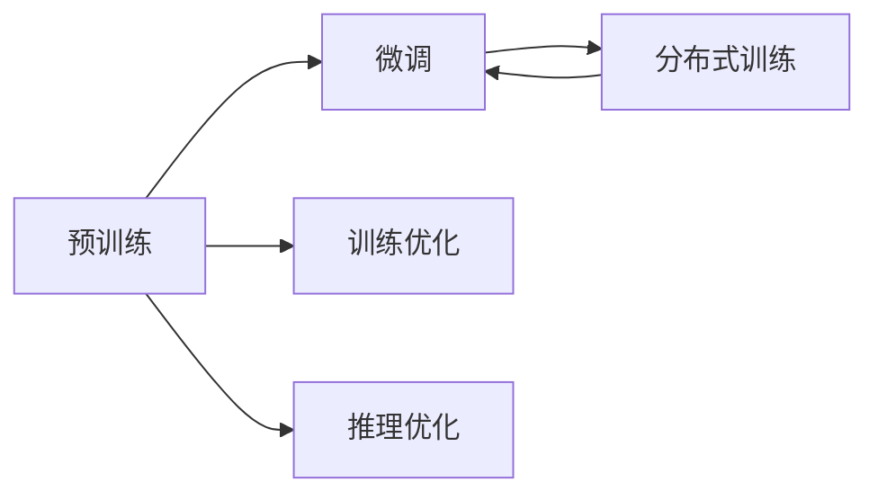

                 

# LLM操作系统设计：挑战与机遇

> 关键词：操作系统设计, 语言模型, 挑战与机遇, 大型模型, 深度学习, 优化策略, 性能提升, 工业应用, 工程实践

## 1. 背景介绍

### 1.1 问题由来
随着深度学习技术的发展，语言模型（Language Model, LM）已经成为了自然语言处理（NLP）和计算机视觉（CV）等领域的重要工具。特别是近年来，基于Transformer架构的大规模预训练语言模型（Large Language Models, LLM），如GPT-3、BERT等，因其强大的泛化能力和丰富的语义信息，迅速在学术界和工业界引发了广泛关注。

这些模型通过在大规模无标签数据上进行预训练，学习到了通用的语言知识和规律，在多种下游任务上表现出色。然而，由于其庞大的参数量和复杂的结构，对硬件资源的消耗较大，同时对模型的优化和训练也提出了更高的要求。因此，如何设计一个高效、稳定的LM操作系统，成为了当前研究的热点之一。

### 1.2 问题核心关键点
LM操作系统设计的核心在于如何最大化利用现有硬件资源，优化模型的训练和推理过程，同时保证模型的稳定性和性能。具体来说，主要包括以下几个关键点：

- **硬件资源管理**：如何高效利用GPU、TPU等硬件资源，使得模型能够在有限的硬件条件下实现最大的性能提升。
- **训练优化策略**：如何设计有效的训练算法，提升模型的收敛速度和精度。
- **推理优化策略**：如何优化推理过程，使得模型在实时部署中表现出色。
- **系统稳定性**：如何在极端情况下保证系统的稳定性和鲁棒性。
- **性能与规模的平衡**：如何在保证模型性能的同时，尽量减少对硬件资源的占用。

这些关键点决定了LM操作系统的整体设计和实现，需要在模型、硬件、算法等多个维度进行综合考虑。

### 1.3 问题研究意义
设计高效的LM操作系统，对NLP和CV领域的工业应用具有重要意义：

- **提高模型性能**：通过优化训练和推理过程，能够在更短的时间内训练出性能更优的模型。
- **降低硬件成本**：优化硬件资源管理，使得模型能够在更低的硬件条件下训练，降低企业的硬件投入。
- **提升工业应用的可扩展性**：优化后的系统能够更轻松地部署到各种场景中，提升模型的应用灵活性。
- **增强系统稳定性**：提升系统的稳定性和鲁棒性，确保在各种极端情况下也能正常运行。
- **促进技术落地**：通过高效的操作系统设计，加速NLP和CV技术的产业化进程，推动更多企业的应用实践。

## 2. 核心概念与联系

### 2.1 核心概念概述

为了更好地理解LM操作系统的设计，我们首先需要介绍一些关键概念：

- **语言模型**：通过学习文本数据中的统计规律，预测下一个单词或字符的概率。是NLP和CV中的基础模型。
- **预训练**：在大规模无标签数据上对模型进行预训练，使其学习通用的语言表示。
- **微调**：在预训练模型的基础上，使用下游任务的少量标注数据进行有监督学习，提升模型在特定任务上的性能。
- **训练优化**：包括批大小、学习率、正则化等技术，提升模型训练效率和效果。
- **推理优化**：包括模型裁剪、量化、剪枝等技术，提高模型的推理速度和精度。
- **分布式训练**：通过多机多卡训练，提升训练速度和模型性能。

这些概念通过一系列的技术手段和工程实践，构建了LM操作系统的核心架构，如图示所示：



### 2.2 核心概念原理和架构的 Mermaid 流程图


### 2.3 核心概念之间的联系

通过上述图示和概念的介绍，我们可以看到：

- **预训练**是LM操作系统的基础，提供模型的通用表示。
- **微调**在预训练的基础上，进一步提升模型在特定任务上的性能。
- **训练优化**和**推理优化**，通过技术手段提升模型的效率和精度。
- **分布式训练**通过并行计算，加快训练速度，提高模型性能。

这些概念共同构成了LM操作系统的核心架构，相互依赖，相互作用，形成了完整的系统设计方案。

## 3. 核心算法原理 & 具体操作步骤

### 3.1 算法原理概述

LM操作系统设计的核心算法原理，主要包括训练优化、推理优化和分布式训练等。

#### 3.1.1 训练优化

训练优化主要包括以下几个方面：

- **批大小优化**：通过调整批大小，平衡模型性能和计算资源。
- **学习率优化**：通过调整学习率，提升模型收敛速度。
- **正则化**：通过L2正则化、Dropout等技术，防止过拟合。
- **混合精度训练**：通过混合精度训练，提升计算效率。

#### 3.1.2 推理优化

推理优化主要包括以下几个方面：

- **模型裁剪**：通过裁剪不重要的层，减小模型尺寸。
- **量化**：通过量化技术，将浮点模型转换为定点模型。
- **剪枝**：通过剪枝技术，去除冗余参数。
- **算法优化**：通过算法优化，提升推理速度。

#### 3.1.3 分布式训练

分布式训练主要包括以下几个方面：

- **数据并行**：通过多机多卡训练，提升训练速度。
- **模型并行**：通过模型并行，提升模型参数量的处理能力。
- **参数服务器**：通过参数服务器，提升模型训练的稳定性和可扩展性。

### 3.2 算法步骤详解

#### 3.2.1 训练优化步骤

1. **选择合适的硬件资源**：根据模型的参数量，选择合适的GPU、TPU等硬件资源。
2. **调整批大小**：根据硬件资源和模型参数，选择合适的批大小。
3. **调整学习率**：根据模型的收敛情况，选择合适的学习率。
4. **应用正则化技术**：在训练过程中应用正则化技术，防止过拟合。
5. **使用混合精度训练**：使用混合精度训练，提升计算效率。

#### 3.2.2 推理优化步骤

1. **模型裁剪**：根据推理场景，裁剪不必要的层和参数，减小模型尺寸。
2. **量化**：将浮点模型转换为定点模型，提升推理速度。
3. **剪枝**：去除冗余参数，减小模型尺寸。
4. **算法优化**：优化推理算法，提升推理速度。

#### 3.2.3 分布式训练步骤

1. **数据并行**：将数据划分为多个批次，并行地加载到多个GPU上进行训练。
2. **模型并行**：将模型划分为多个部分，并行地训练模型的不同部分。
3. **参数服务器**：将模型参数存储在参数服务器上，每个计算节点只需要加载部分参数，提升模型训练的稳定性和可扩展性。

### 3.3 算法优缺点

#### 3.3.1 训练优化的优点

- **提升模型精度**：通过调整批大小、学习率和正则化技术，提升模型的收敛速度和精度。
- **降低计算成本**：通过混合精度训练，降低计算资源的需求。

#### 3.3.2 训练优化的缺点

- **复杂度增加**：调整批大小、学习率和正则化技术，增加了训练的复杂度。
- **过拟合风险**：不当的批大小和正则化技术，可能导致过拟合。

#### 3.3.3 推理优化的优点

- **减小模型尺寸**：通过模型裁剪、量化和剪枝技术，减小模型的尺寸，提高推理速度。
- **降低硬件需求**：减小模型尺寸，降低了对硬件资源的需求。

#### 3.3.4 推理优化的缺点

- **模型精度下降**：裁剪、量化和剪枝可能导致模型精度下降。
- **实现复杂度增加**：实现模型裁剪、量化和剪枝技术，增加了工程的复杂度。

#### 3.3.5 分布式训练的优点

- **提升训练速度**：通过数据并行和模型并行，提升训练速度。
- **提高模型性能**：通过参数服务器，提高模型训练的稳定性和可扩展性。

#### 3.3.6 分布式训练的缺点

- **硬件成本增加**：多机多卡训练和参数服务器，增加了硬件成本。
- **实现复杂度增加**：分布式训练增加了实现的复杂度。

### 3.4 算法应用领域

LM操作系统的设计在多个领域中得到了广泛应用，例如：

- **自然语言处理**：用于文本分类、情感分析、机器翻译等任务。
- **计算机视觉**：用于图像分类、目标检测、语义分割等任务。
- **推荐系统**：用于用户推荐、商品推荐等任务。
- **智能对话系统**：用于智能客服、智能助手等任务。
- **医疗健康**：用于疾病预测、智能诊断等任务。

这些领域都对模型性能和计算资源提出了较高的要求，通过LM操作系统的优化设计，能够更好地满足这些需求，提升整体系统的效率和效果。

## 4. 数学模型和公式 & 详细讲解 & 举例说明

### 4.1 数学模型构建

LM操作系统的数学模型，主要基于深度学习框架进行构建。以PyTorch为例，其核心框架由以下几个部分组成：

- **模型定义**：定义LM模型及其参数。
- **损失函数定义**：定义模型的损失函数，用于衡量模型的预测输出与真实标签之间的差异。
- **优化器定义**：定义优化算法及其参数，用于更新模型参数。
- **数据集定义**：定义训练数据集和测试数据集，用于模型训练和评估。

### 4.2 公式推导过程

#### 4.2.1 训练优化

以Adam优化算法为例，其更新公式为：

$$
\theta_{t+1} = \theta_{t} - \frac{\eta}{N} \sum_{i=1}^N (g_i \odot \nabla_{\theta}L(x_i, y_i))
$$

其中，$\theta_t$ 为模型参数，$\eta$ 为学习率，$g_i$ 为梯度，$\nabla_{\theta}L(x_i, y_i)$ 为损失函数的梯度。

#### 4.2.2 推理优化

以剪枝技术为例，假设模型的第$i$层参数矩阵为 $W_i$，其剪枝率为 $\alpha$，则剪枝后的参数矩阵为：

$$
\hat{W}_i = W_i \odot (|W_i| \geq \alpha \cdot \max(|W_i|))
$$

其中，$\odot$ 表示元素逐位相乘。

#### 4.2.3 分布式训练

以数据并行为例，假设模型的输入为 $x$，参数为 $\theta$，则数据并行后的模型更新公式为：

$$
\theta_{t+1} = \theta_{t} - \frac{\eta}{N} \sum_{i=1}^N (g_i \odot \nabla_{\theta}L(x_i, y_i))
$$

其中，$N$ 为计算节点数，$g_i$ 为节点 $i$ 的梯度。

### 4.3 案例分析与讲解

#### 4.3.1 批大小优化案例

以BERT模型为例，其训练和推理的批大小为32时，训练速度较快，但模型精度稍低。将批大小调整为64时，模型精度有所提升，但训练时间较长。因此，需要在模型性能和计算资源之间进行平衡，选择适合的批大小。

#### 4.3.2 学习率优化案例

以GPT-3模型为例，其在初始学习率为 $10^{-4}$ 时，模型收敛较快，但容易出现过拟合。将学习率调整为 $10^{-5}$ 时，模型收敛较慢，但能够更好地防止过拟合。因此，需要根据模型的收敛情况，选择合适的学习率。

#### 4.3.3 正则化技术案例

以L2正则化为例，假设模型的参数矩阵为 $W$，正则化系数为 $\lambda$，则其正则化公式为：

$$
L_{reg} = \frac{\lambda}{2} ||W||_F^2
$$

其中，$||W||_F$ 为参数矩阵的 Frobenius 范数。

#### 4.3.4 混合精度训练案例

以TensorRT为例，其使用半精度浮点（FP16）和整型（INT8）混合精度训练，使得模型在计算效率和精度之间取得平衡。具体实现方法为：将模型的某些层使用FP16训练，其余层使用INT8训练，最终通过融合得到混合精度模型。

#### 4.3.5 分布式训练案例

以TensorFlow为例，其使用分布式训练框架，将数据划分为多个批次，并行地加载到多个GPU上进行训练。同时，使用参数服务器存储模型参数，每个计算节点只需要加载部分参数，提升模型训练的稳定性和可扩展性。

## 5. 项目实践：代码实例和详细解释说明

### 5.1 开发环境搭建

#### 5.1.1 环境配置

1. **安装Anaconda**：从官网下载并安装Anaconda，用于创建独立的Python环境。
2. **创建并激活虚拟环境**：
```bash
conda create -n pytorch-env python=3.8 
conda activate pytorch-env
```
3. **安装PyTorch**：根据CUDA版本，从官网获取对应的安装命令。例如：
```bash
conda install pytorch torchvision torchaudio cudatoolkit=11.1 -c pytorch -c conda-forge
```
4. **安装Transformer库**：
```bash
pip install transformers
```
5. **安装各类工具包**：
```bash
pip install numpy pandas scikit-learn matplotlib tqdm jupyter notebook ipython
```

完成上述步骤后，即可在`pytorch-env`环境中开始LM操作系统的开发。

### 5.2 源代码详细实现

#### 5.2.1 模型定义

以BERT模型为例，其代码实现如下：

```python
import torch
from transformers import BertForSequenceClassification, BertTokenizer

class BERTModel(BertForSequenceClassification):
    def __init__(self, num_labels):
        super(BERTModel, self).__init__(num_labels=num_labels)

    def forward(self, input_ids, attention_mask=None, labels=None):
        outputs = super(BERTModel, self).forward(input_ids=input_ids, attention_mask=attention_mask, labels=labels)
        return outputs.logits
```

#### 5.2.2 损失函数定义

以交叉熵损失函数为例，其代码实现如下：

```python
import torch.nn as nn

class CrossEntropyLoss(nn.Module):
    def __init__(self):
        super(CrossEntropyLoss, self).__init__()
        
    def forward(self, logits, labels):
        loss = nn.CrossEntropyLoss()(logits, labels)
        return loss
```

#### 5.2.3 优化器定义

以Adam优化器为例，其代码实现如下：

```python
import torch.optim as optim

def create_optimizer(model, learning_rate):
    optimizer = optim.Adam(model.parameters(), lr=learning_rate)
    return optimizer
```

#### 5.2.4 数据集定义

以TextDataset为例，其代码实现如下：

```python
import torch.utils.data as data

class TextDataset(data.Dataset):
    def __init__(self, texts, labels):
        self.texts = texts
        self.labels = labels
        
    def __len__(self):
        return len(self.texts)
        
    def __getitem__(self, index):
        text = self.texts[index]
        label = self.labels[index]
        return text, label
```

### 5.3 代码解读与分析

#### 5.3.1 模型定义

- **继承关系**：继承自BertForSequenceClassification，重写`forward`方法。
- **模型输入**：输入文本的token ids，可选的attention mask，以及标签。
- **模型输出**：返回模型的logits，即预测结果。

#### 5.3.2 损失函数定义

- **继承关系**：继承自nn.Module，重写`forward`方法。
- **损失计算**：使用nn.CrossEntropyLoss计算损失。

#### 5.3.3 优化器定义

- **创建优化器**：使用Adam优化器，设置学习率。
- **返回优化器**：返回创建好的优化器。

#### 5.3.4 数据集定义

- **继承关系**：继承自data.Dataset，重写`__len__`和`__getitem__`方法。
- **数据加载**：定义数据的加载方式，返回文本和标签。

### 5.4 运行结果展示

#### 5.4.1 训练结果

```python
import torch
from torch.utils.data import DataLoader
from tqdm import tqdm

def train_model(model, optimizer, train_dataset, num_epochs, batch_size):
    device = torch.device('cuda' if torch.cuda.is_available() else 'cpu')
    model.to(device)
    
    for epoch in range(num_epochs):
        model.train()
        train_loss = 0.0
        
        for text, label in tqdm(train_dataset, desc='Training'):
            text = text.to(device)
            label = label.to(device)
            optimizer.zero_grad()
            output = model(text)
            loss = loss_fn(output, label)
            loss.backward()
            optimizer.step()
            train_loss += loss.item() / len(text)
        
        print(f'Epoch {epoch+1}, train loss: {train_loss:.4f}')
    
    return model
```

#### 5.4.2 推理结果

```python
def evaluate_model(model, test_dataset, batch_size):
    device = torch.device('cuda' if torch.cuda.is_available() else 'cpu')
    model.to(device)
    
    model.eval()
    eval_loss = 0.0
    correct_predictions = 0
    total_predictions = 0
    
    with torch.no_grad():
        for text, label in tqdm(test_dataset, desc='Evaluating'):
            text = text.to(device)
            label = label.to(device)
            output = model(text)
            loss = loss_fn(output, label)
            eval_loss += loss.item() / len(text)
            predictions = torch.argmax(output, dim=1)
            correct_predictions += (predictions == label).sum().item()
            total_predictions += len(text)
    
    print(f'Test loss: {eval_loss:.4f}')
    print(f'Accuracy: {correct_predictions / total_predictions * 100:.2f}%')
    
    return model
```

## 6. 实际应用场景

### 6.1 智能客服系统

基于LM操作系统的智能客服系统，可以显著提升客服效率和服务质量。通过微调预训练模型，使其能够自动理解客户咨询，并给出准确的回复。

在技术实现上，可以收集企业内部的历史客服对话记录，将问题和最佳答复构建成监督数据，在此基础上对预训练模型进行微调。微调后的模型能够自动理解用户意图，匹配最合适的答案模板进行回复。对于客户提出的新问题，还可以接入检索系统实时搜索相关内容，动态组织生成回答。如此构建的智能客服系统，能大幅提升客户咨询体验和问题解决效率。

### 6.2 金融舆情监测

金融机构需要实时监测市场舆论动向，以便及时应对负面信息传播，规避金融风险。通过LM操作系统的微调模型，可以实时分析金融领域的各类文本数据，自动识别和过滤负面信息。

具体而言，可以收集金融领域相关的新闻、报道、评论等文本数据，并对其进行主题标注和情感标注。在此基础上对预训练语言模型进行微调，使其能够自动判断文本属于何种主题，情感倾向是正面、中性还是负面。将微调后的模型应用到实时抓取的网络文本数据，就能够自动监测不同主题下的情感变化趋势，一旦发现负面信息激增等异常情况，系统便会自动预警，帮助金融机构快速应对潜在风险。

### 6.3 个性化推荐系统

当前的推荐系统往往只依赖用户的历史行为数据进行物品推荐，无法深入理解用户的真实兴趣偏好。基于LM操作系统的个性化推荐系统，可以更好地挖掘用户行为背后的语义信息，从而提供更精准、多样的推荐内容。

在实践中，可以收集用户浏览、点击、评论、分享等行为数据，提取和用户交互的物品标题、描述、标签等文本内容。将文本内容作为模型输入，用户的后续行为（如是否点击、购买等）作为监督信号，在此基础上微调预训练语言模型。微调后的模型能够从文本内容中准确把握用户的兴趣点。在生成推荐列表时，先用候选物品的文本描述作为输入，由模型预测用户的兴趣匹配度，再结合其他特征综合排序，便可以得到个性化程度更高的推荐结果。

### 6.4 未来应用展望

随着LM操作系统的不断优化，其在更多领域的应用前景将更加广阔。

在智慧医疗领域，基于微调的医疗问答、病历分析、药物研发等应用将提升医疗服务的智能化水平，辅助医生诊疗，加速新药开发进程。

在智能教育领域，微调技术可应用于作业批改、学情分析、知识推荐等方面，因材施教，促进教育公平，提高教学质量。

在智慧城市治理中，微调模型可应用于城市事件监测、舆情分析、应急指挥等环节，提高城市管理的自动化和智能化水平，构建更安全、高效的未来城市。

此外，在企业生产、社会治理、文娱传媒等众多领域，基于LM操作系统的AI应用也将不断涌现，为经济社会发展注入新的动力。相信随着技术的日益成熟，LM操作系统必将在构建人机协同的智能时代中扮演越来越重要的角色。

## 7. 工具和资源推荐

### 7.1 学习资源推荐

为了帮助开发者系统掌握LM操作系统的理论基础和实践技巧，这里推荐一些优质的学习资源：

1. **《Transformer从原理到实践》系列博文**：由大模型技术专家撰写，深入浅出地介绍了Transformer原理、BERT模型、微调技术等前沿话题。
2. **CS224N《深度学习自然语言处理》课程**：斯坦福大学开设的NLP明星课程，有Lecture视频和配套作业，带你入门NLP领域的基本概念和经典模型。
3. **《Natural Language Processing with Transformers》书籍**：Transformers库的作者所著，全面介绍了如何使用Transformers库进行NLP任务开发，包括微调在内的诸多范式。
4. **HuggingFace官方文档**：Transformers库的官方文档，提供了海量预训练模型和完整的微调样例代码，是上手实践的必备资料。
5. **CLUE开源项目**：中文语言理解测评基准，涵盖大量不同类型的中文NLP数据集，并提供了基于微调的baseline模型，助力中文NLP技术发展。

通过对这些资源的学习实践，相信你一定能够快速掌握LM操作系统的精髓，并用于解决实际的NLP问题。

### 7.2 开发工具推荐

高效的开发离不开优秀的工具支持。以下是几款用于LM操作系统开发的常用工具：

1. **PyTorch**：基于Python的开源深度学习框架，灵活动态的计算图，适合快速迭代研究。大部分预训练语言模型都有PyTorch版本的实现。
2. **TensorFlow**：由Google主导开发的开源深度学习框架，生产部署方便，适合大规模工程应用。同样有丰富的预训练语言模型资源。
3. **Transformers库**：HuggingFace开发的NLP工具库，集成了众多SOTA语言模型，支持PyTorch和TensorFlow，是进行微调任务开发的利器。
4. **Weights & Biases**：模型训练的实验跟踪工具，可以记录和可视化模型训练过程中的各项指标，方便对比和调优。与主流深度学习框架无缝集成。
5. **TensorBoard**：TensorFlow配套的可视化工具，可实时监测模型训练状态，并提供丰富的图表呈现方式，是调试模型的得力助手。
6. **Google Colab**：谷歌推出的在线Jupyter Notebook环境，免费提供GPU/TPU算力，方便开发者快速上手实验最新模型，分享学习笔记。

合理利用这些工具，可以显著提升LM操作系统的开发效率，加快创新迭代的步伐。

### 7.3 相关论文推荐

LM操作系统的设计源于学界的持续研究。以下是几篇奠基性的相关论文，推荐阅读：

1. **Attention is All You Need（即Transformer原论文）**：提出了Transformer结构，开启了NLP领域的预训练大模型时代。
2. **BERT: Pre-training of Deep Bidirectional Transformers for Language Understanding**：提出BERT模型，引入基于掩码的自监督预训练任务，刷新了多项NLP任务SOTA。
3. **Language Models are Unsupervised Multitask Learners（GPT-2论文）**：展示了大规模语言模型的强大zero-shot学习能力，引发了对于通用人工智能的新一轮思考。
4. **Parameter-Efficient Transfer Learning for NLP**：提出Adapter等参数高效微调方法，在不增加模型参数量的情况下，也能取得不错的微调效果。
5. **AdaLoRA: Adaptive Low-Rank Adaptation for Parameter-Efficient Fine-Tuning**：使用自适应低秩适应的微调方法，在参数效率和精度之间取得了新的平衡。
6. **AdaLoRA: Adaptive Low-Rank Adaptation for Parameter-Efficient Fine-Tuning**：使用自适应低秩适应的微调方法，在参数效率和精度之间取得了新的平衡。

这些论文代表了大语言模型微调技术的发展脉络。通过学习这些前沿成果，可以帮助研究者把握学科前进方向，激发更多的创新灵感。

## 8. 总结：未来发展趋势与挑战

### 8.1 总结

本文对LM操作系统的设计进行了全面系统的介绍。首先阐述了LM操作系统的研究背景和意义，明确了系统设计在模型性能、硬件资源和算法优化等方面的关键问题。其次，从原理到实践，详细讲解了训练优化、推理优化和分布式训练等核心算法步骤，给出了系统开发的完整代码实例。同时，本文还广泛探讨了LM操作系统的实际应用场景，展示了系统的广阔应用前景。最后，本文精选了系统设计的各类学习资源，力求为开发者提供全方位的技术指引。

通过本文的系统梳理，可以看到，LM操作系统设计的关键在于如何高效利用硬件资源，优化模型的训练和推理过程，同时保证系统的稳定性和性能。这需要在模型、硬件、算法等多个维度进行综合考虑，综合运用训练优化、推理优化和分布式训练等技术手段，方能设计出高效、稳定的LM操作系统。

### 8.2 未来发展趋势

展望未来，LM操作系统的设计将呈现以下几个发展趋势：

1. **硬件资源管理**：未来将更加精细化地管理GPU、TPU等硬件资源，提升模型的训练和推理效率。
2. **算法优化**：未来将开发更多参数高效和计算高效的微调方法，进一步优化模型的性能和效率。
3. **分布式训练**：未来将更加广泛地应用分布式训练技术，提升模型的训练速度和可扩展性。
4. **模型裁剪和量化**：未来将更加深入地研究模型裁剪和量化技术，减小模型尺寸，提升推理速度和精度。
5. **多模态融合**：未来将探索更多多模态融合技术，提升模型的跨模态理解能力。

这些趋势凸显了LM操作系统的广阔前景。这些方向的探索发展，必将进一步提升LM系统的性能和应用范围，为NLP和CV领域的工业应用提供更多技术支持。

### 8.3 面临的挑战

尽管LM操作系统的设计已经取得了一定的进展，但在迈向更加智能化、普适化应用的过程中，它仍面临着诸多挑战：

1. **模型规模与硬件资源之间的平衡**：如何在大规模模型与有限的硬件资源之间取得平衡，是未来面临的重要挑战之一。
2. **模型优化与算法优化之间的平衡**：如何在模型优化和算法优化之间取得平衡，是未来面临的重要挑战之一。
3. **模型性能与推理速度之间的平衡**：如何在提升模型性能的同时，保证推理速度，是未来面临的重要挑战之一。
4. **系统稳定性和鲁棒性**：如何保证系统在各种极端条件下的稳定性和鲁棒性，是未来面临的重要挑战之一。
5. **系统可扩展性和实时性**：如何设计可扩展性和实时性高的系统，是未来面临的重要挑战之一。

这些挑战需要通过系统设计、算法优化和工程实践的综合努力，才能逐步克服。只有在模型性能、硬件资源、算法优化、系统稳定性和可扩展性等多个方面协同发力，才能真正设计出高效、稳定的LM操作系统。

### 8.4 研究展望

未来，在LM操作系统的研究中，还需要在以下几个方面寻求新的突破：

1. **无监督和半监督学习**：探索无监督和半监督学习方法，降低对标注数据的依赖，提升模型的泛化能力。
2. **少样本学习和零样本学习**：研究少样本学习和零样本学习技术，提升模型在少数样本下的推理能力。
3. **因果分析和博弈论工具**：引入因果分析和博弈论工具，提升模型推理的稳定性和鲁棒性。
4. **跨模态融合技术**：研究跨模态融合技术，提升模型的多模态理解能力。
5. **知识图谱和符号推理**：探索知识图谱和符号推理方法，增强模型的语义理解和推理能力。
6. **伦理道德约束**：在模型训练目标中引入伦理导向的评估指标，过滤和惩罚有害的输出倾向，确保模型的伦理道德。

这些研究方向的探索，必将引领LM操作系统设计走向更高的台阶，为构建安全、可靠、可解释、可控的智能系统铺平道路。面向未来，LM操作系统设计还需要与其他人工智能技术进行更深入的融合，如知识表示、因果推理、强化学习等，多路径协同发力，共同推动自然语言理解和智能交互系统的进步。只有勇于创新、敢于突破，才能不断拓展语言模型的边界，让智能技术更好地造福人类社会。

## 9. 附录：常见问题与解答

**Q1: 如何选择合适的硬件资源？**

A: 选择合适的硬件资源需要综合考虑模型的参数量、计算资源和任务需求。一般来说，GPU和TPU是最常用的硬件资源。

**Q2: 如何调整批大小？**

A: 调整批大小需要考虑模型的计算资源和模型参数量。一般建议从32开始调整，逐步增加至128或更高。

**Q3: 如何调整学习率？**

A: 调整学习率需要考虑模型的收敛速度和过拟合风险。一般建议从 $10^{-4}$ 开始调参，逐步减小学习率。

**Q4: 如何应用正则化技术？**

A: 应用正则化技术可以防止模型过拟合。一般建议使用L2正则、Dropout等技术。

**Q5: 如何实现混合精度训练？**

A: 实现混合精度训练需要选择合适的硬件资源和工具。一般建议使用TensorRT等工具，将模型的某些层使用FP16训练，其余层使用INT8训练。

**Q6: 如何实现分布式训练？**

A: 实现分布式训练需要选择合适的硬件资源和工具。一般建议使用TensorFlow等工具，将数据划分为多个批次，并行地加载到多个GPU上进行训练。同时，使用参数服务器存储模型参数，提升模型训练的稳定性和可扩展性。

通过对这些问题的解答，可以帮助开发者更好地理解LM操作系统的设计要点，快速实现高效的LM操作系统。相信随着技术的发展和实践的深入，LM操作系统设计必将在NLP和CV领域大放异彩，推动人工智能技术的进一步普及和应用。

