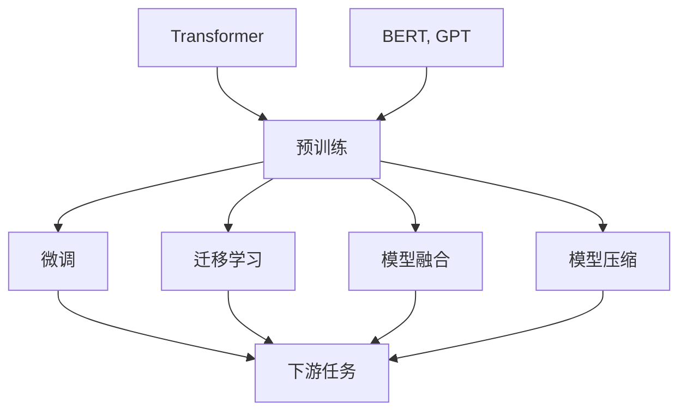

                 

# LLM生态演进:从芽到枝繁叶茂

> 关键词：
> - 大语言模型(Large Language Model, LLM)
> - 预训练(Pre-training)
> - 微调(Fine-tuning)
> - 迁移学习(Transfer Learning)
> - Transformer
> - BERT
> - GPT
> - GPT-3
> - 模型融合(Model Fusion)
> - 模型压缩(Model Compression)
> - 模型部署(Model Deployment)

## 1. 背景介绍

### 1.1 问题由来
近年来，人工智能（AI）领域的一项重大突破是大语言模型（Large Language Model, LLM）的问世。自AlphaGo击败人类世界围棋冠军以来，AI界对语言处理能力的要求不断提升，从简单的文本分类、问答系统发展到深度学习的神经网络模型。特别是Transformer架构的提出，大语言模型在自然语言处理（NLP）领域取得了革命性进展。

1.1.1 从深度学习到Transformer
传统的深度学习模型如卷积神经网络（CNN）、循环神经网络（RNN）虽然在图像处理、语音识别等任务上表现优异，但在语言理解方面存在瓶颈。2017年，Google提出Transformer模型，它通过自注意力机制，能够学习更丰富的上下文信息，显著提升了语言模型在理解语义、生成文本等方面的能力。Transformer的横空出世，标志着大语言模型时代的来临。

1.1.2 大模型的发展历程
从最初的BERT到GPT-2，再到当前火热的GPT-3和未来的GPT-4，大语言模型的参数量不断增加，模型规模日益增大。GPT-3以其庞大的参数量和先进的自适应算法，成为迄今为止性能最强的通用大模型。未来，随着技术的发展，大语言模型将更趋完善，应用于更多领域。

## 2. 核心概念与联系

### 2.1 核心概念概述

大语言模型（LLM）是一种基于Transformer架构的神经网络模型，通过大规模的预训练和微调，学习并掌握语言的复杂结构，能够在多个自然语言处理任务上表现优异。其核心组件包括：

- **预训练**：在大规模无标签文本数据上训练大模型，学习语言的通用表示。
- **微调**：通过有监督的训练，在大模型基础上对特定任务进行适配，提升模型在特定领域的性能。
- **迁移学习**：利用预训练模型在不同任务间迁移学习，以减少从头训练的成本和提高模型的泛化能力。
- **Transformer**：一种基于自注意力机制的神经网络架构，能够高效处理序列数据，适用于语言模型。
- **BERT、GPT**：当前最为流行的大语言模型之一，分别由Google和OpenAI提出，通过不同的预训练和微调策略，在各种NLP任务上取得优异性能。

### 2.2 核心概念的联系
核心概念之间的联系可以通过以下Mermaid流程图来展示：



此图展示了从预训练到微调的过程，以及Transformer和BERT/GPT模型在大语言模型生态中的核心地位。预训练和微调是实现迁移学习的重要步骤，Transformer和BERT/GPT模型作为基础架构，支持大规模模型的构建，并有助于模型融合和压缩等技术的发展。

## 3. 核心算法原理 & 具体操作步骤

### 3.1 算法原理概述

大语言模型的预训练和微调过程遵循以下原理：

1. **预训练**：在大规模无标签文本数据上，通过自监督学习任务如掩码语言模型（Masked Language Modeling, MLM）和下一句预测（Next Sentence Prediction, NSP），学习语言的基本规律和语义关系。
2. **微调**：在预训练模型的基础上，使用下游任务的少量标注数据，通过有监督学习优化模型在特定任务上的性能。

### 3.2 算法步骤详解

大语言模型的预训练和微调主要包括以下步骤：

1. **数据准备**：
   - 收集大规模无标签文本数据作为预训练数据集。
   - 为特定任务收集少量标注数据作为微调数据集。

2. **模型初始化**：
   - 使用预训练模型作为初始化参数。
   - 使用Transformer等架构，构建语言模型。

3. **预训练**：
   - 在大规模预训练数据集上进行自监督学习。
   - 通过掩码语言模型和下一句预测等任务，学习语言的通用表示。

4. **微调**：
   - 在微调数据集上进行有监督学习。
   - 添加任务适配层，如分类器或解码器。
   - 设置合适的优化器和超参数，进行梯度下降优化。

### 3.3 算法优缺点

大语言模型预训练和微调的优缺点如下：

**优点**：
- **效率高**：预训练模型在大量数据上学习语言规律，微调只需要在少量标注数据上调整模型参数。
- **泛化能力强**：预训练模型能够学习通用的语言知识，微调模型可以适应各种自然语言处理任务。
- **可扩展性强**：在大规模数据和计算资源支持下，预训练和微调过程可以不断优化和扩展。

**缺点**：
- **数据需求大**：预训练和微调需要大量数据，获取和标注成本高。
- **模型复杂**：大语言模型参数量巨大，计算资源消耗大。
- **解释性差**：黑盒模型难以解释决策过程，应用领域如医疗、金融等对模型的可解释性要求高。

### 3.4 算法应用领域

大语言模型预训练和微调技术已经广泛应用于自然语言处理（NLP）领域的各个方面，包括但不限于：

- **文本分类**：如情感分析、主题分类、文本聚类等。
- **命名实体识别**：识别文本中的人名、地名、机构名等特定实体。
- **问答系统**：对自然语言问题给出答案。
- **机器翻译**：将源语言文本翻译成目标语言。
- **摘要生成**：将长文本压缩成简短摘要。
- **对话系统**：使机器能够与人自然对话。

## 4. 数学模型和公式 & 详细讲解 & 举例说明

### 4.1 数学模型构建

大语言模型的预训练过程可以建模为自监督学习任务，如掩码语言模型（MLM）和下一句预测（NSP）。

**掩码语言模型（MLM）**：
- 对于输入序列 $x=[x_1, x_2, ..., x_n]$，随机掩盖部分单词，模型预测被掩盖的单词。
- 目标函数为：$P(x_{i}) = \prod_{i=1}^n P(x_i|x_1, x_2, ..., x_{i-1})$

**下一句预测（NSP）**：
- 对于输入序列 $(x, y)$，模型预测 $x$ 和 $y$ 是否为相邻的两个句子。
- 目标函数为：$P(y|x, x+y) = softmax([S(x), S(x+y)])$

### 4.2 公式推导过程

**掩码语言模型（MLM）的损失函数**：
$$
L_{MLM} = -\frac{1}{N}\sum_{i=1}^N \sum_{j=1}^n \log P(x_i|\{x_1, ..., x_{i-1}, \bar{x}_j, x_{i+1}, ..., x_n\})
$$

**下一句预测（NSP）的损失函数**：
$$
L_{NSP} = -\frac{1}{N}\sum_{i=1}^N \log P(y|x, x+y)
$$

### 4.3 案例分析与讲解

以BERT为例，其预训练过程包括以下步骤：

1. 将输入序列 $x$ 转化为特征表示 $Z$。
2. 掩盖部分单词，计算掩码概率 $P(\bar{x}_j|x_1, ..., x_{i-1}, \bar{x}_j, x_{i+1}, ..., x_n)$。
3. 计算NSP任务的预测概率 $P(y|x, x+y)$。
4. 计算总损失函数 $L = L_{MLM} + \lambda L_{NSP}$，其中 $\lambda$ 为NSP任务的权重。

## 5. 项目实践：代码实例和详细解释说明

### 5.1 开发环境搭建

为了搭建大语言模型的开发环境，需要以下步骤：

1. **环境配置**：安装Python、PyTorch、TensorFlow等深度学习框架，安装相关的NLP库，如NLTK、SpaCy等。
2. **数据准备**：收集预训练数据集和微调数据集，对数据进行预处理。
3. **模型初始化**：选择预训练模型，如BERT、GPT等，进行模型初始化。

### 5.2 源代码详细实现

以下是使用PyTorch实现BERT模型微调的代码示例：

```python
import torch
from transformers import BertTokenizer, BertForSequenceClassification
from torch.utils.data import Dataset, DataLoader

# 定义数据集
class CustomDataset(Dataset):
    def __init__(self, data, tokenizer, max_len):
        self.data = data
        self.tokenizer = tokenizer
        self.max_len = max_len

    def __len__(self):
        return len(self.data)

    def __getitem__(self, idx):
        sentence = self.data[idx]
        inputs = self.tokenizer.encode_plus(sentence, add_special_tokens=True, max_length=self.max_len, padding='max_length', return_tensors='pt', truncation=True)
        input_ids = inputs['input_ids']
        attention_mask = inputs['attention_mask']
        labels = torch.tensor([1 if sentence[0] == 'A' else 0])
        return {'input_ids': input_ids, 'attention_mask': attention_mask, 'labels': labels}

# 准备数据
tokenizer = BertTokenizer.from_pretrained('bert-base-uncased')
train_data = ['A positive sentence', 'A negative sentence']
dev_data = ['Another positive sentence', 'Another negative sentence']
test_data = ['Another positive sentence', 'Another negative sentence']

train_dataset = CustomDataset(train_data, tokenizer, max_len=128)
dev_dataset = CustomDataset(dev_data, tokenizer, max_len=128)
test_dataset = CustomDataset(test_data, tokenizer, max_len=128)

# 模型初始化
model = BertForSequenceClassification.from_pretrained('bert-base-uncased', num_labels=2)
device = torch.device('cuda') if torch.cuda.is_available() else torch.device('cpu')
model.to(device)

# 训练模型
optimizer = torch.optim.AdamW(model.parameters(), lr=2e-5)
model.train()
for epoch in range(10):
    for batch in DataLoader(train_dataset, batch_size=8):
        inputs = {key: val.to(device) for key, val in batch.items()}
        outputs = model(**inputs)
        loss = outputs.loss
        optimizer.zero_grad()
        loss.backward()
        optimizer.step()

# 评估模型
model.eval()
with torch.no_grad():
    dev_acc = 0
    for batch in DataLoader(dev_dataset, batch_size=8):
        inputs = {key: val.to(device) for key, val in batch.items()}
        outputs = model(**inputs)
        logits = outputs.logits
        predicted_labels = torch.argmax(logits, dim=1)
        dev_acc += (predicted_labels == batch['labels']).float().mean().item()
    print(f"Dev Acc: {dev_acc / len(dev_dataset)}")

# 测试模型
model.eval()
with torch.no_grad():
    test_acc = 0
    for batch in DataLoader(test_dataset, batch_size=8):
        inputs = {key: val.to(device) for key, val in batch.items()}
        outputs = model(**inputs)
        logits = outputs.logits
        predicted_labels = torch.argmax(logits, dim=1)
        test_acc += (predicted_labels == batch['labels']).float().mean().item()
    print(f"Test Acc: {test_acc / len(test_dataset)}")
```

### 5.3 代码解读与分析

- **数据集定义**：定义一个自定义数据集类 `CustomDataset`，继承 `torch.utils.data.Dataset`，实现 `__len__` 和 `__getitem__` 方法。
- **模型初始化**：使用 `transformers` 库中的 `BertForSequenceClassification` 类，初始化模型。
- **数据加载**：使用 `DataLoader` 对数据集进行批处理，方便模型的训练和推理。
- **训练模型**：使用 `AdamW` 优化器进行模型训练，每轮迭代一次，更新模型参数。
- **评估和测试**：在验证集和测试集上评估模型性能，计算准确率。

## 6. 实际应用场景

### 6.1 金融风控

在大规模金融数据上，大语言模型可以用于风险预测、欺诈检测、信用评估等任务。通过预训练模型学习金融领域的知识，再通过微调模型在特定任务上训练，提升模型的准确性和鲁棒性。

### 6.2 医疗诊断

在医疗领域，大语言模型可以辅助医生进行疾病诊断、药物推荐、症状分析等任务。通过预训练模型学习医学领域的知识，微调模型针对特定症状进行训练，提升诊断的准确性和速度。

### 6.3 智能客服

在客户服务领域，大语言模型可以用于智能客服系统的构建。通过预训练模型学习常见问题解答的语义理解，微调模型针对特定客户的咨询进行训练，提高回答的准确性和自然度。

## 7. 工具和资源推荐

### 7.1 学习资源推荐

- **《深度学习与自然语言处理》**：斯坦福大学课程，详细讲解NLP和深度学习的理论基础和实践技巧。
- **《Transformer》**：Transformer架构的介绍，包括BERT、GPT等模型的构建和应用。
- **《自然语言处理中的预训练和微调》**：介绍预训练和微调在NLP中的应用和实践。
- **《自然语言处理工具箱》**：提供丰富的预训练模型和微调样例代码。

### 7.2 开发工具推荐

- **PyTorch**：灵活高效的深度学习框架，支持大规模模型的训练和推理。
- **TensorFlow**：生产部署方便，适用于大规模工程应用。
- **transformers**：提供了丰富的预训练语言模型，方便微调任务的开发。
- **Weights & Biases**：实验跟踪工具，记录和可视化模型训练过程。
- **TensorBoard**：可视化工具，监控模型训练状态。

### 7.3 相关论文推荐

- **《BERT: Pre-training of Deep Bidirectional Transformers for Language Understanding》**：BERT模型的介绍和应用。
- **《GPT-3: Language Models are Unsupervised Multitask Learners》**：GPT-3模型的介绍和应用。
- **《Large-Scale Pretraining with Transformer-XL for Language Understanding》**：Transformer-XL模型的介绍和应用。

## 8. 总结：未来发展趋势与挑战

### 8.1 研究成果总结

大语言模型的预训练和微调技术已经在NLP领域取得显著成果，广泛应用于各类任务。其核心在于利用大规模数据和先进架构学习语言的基本规律和复杂关系，在特定任务上通过微调进行优化，提升模型的性能。

### 8.2 未来发展趋势

大语言模型的未来发展趋势主要包括以下几个方面：

- **模型规模更大**：随着计算资源的增加，预训练模型的规模将进一步扩大，学习更丰富的语言知识。
- **多模态融合**：将视觉、音频等多模态数据与文本数据结合，提升模型的理解能力。
- **自监督学习**：利用无标签数据进行自监督学习，减少对标注数据的依赖。
- **零样本和少样本学习**：通过提示学习等方法，提升模型在未见过的任务上的表现。
- **跨领域迁移**：将大模型的预训练知识迁移到其他领域，提升模型在不同领域的泛化能力。

### 8.3 面临的挑战

尽管大语言模型在NLP领域取得了显著进展，但在实际应用中也面临诸多挑战：

- **数据标注成本高**：获取高质量标注数据成本高，限制了大模型的应用范围。
- **模型复杂度高**：大模型的参数量巨大，训练和推理复杂度增加。
- **鲁棒性和泛化能力**：模型面对未知数据时，泛化能力不足，易受噪声和干扰影响。
- **可解释性差**：大模型决策过程难以解释，应用领域如医疗、金融等对模型的可解释性要求高。

### 8.4 研究展望

未来，大语言模型的预训练和微调技术需要在以下几个方面进行改进：

- **自监督学习和生成对抗网络**：利用无标签数据和生成对抗网络（GAN）进行自监督学习，提升模型的泛化能力。
- **多模态学习和跨领域迁移**：将视觉、音频等多模态数据与文本数据结合，提升模型的理解能力，并实现跨领域的知识迁移。
- **解释性增强**：开发可解释性强的模型，提升模型的可信任度和应用价值。
- **鲁棒性提升**：通过对抗训练和鲁棒性评估等方法，提升模型的鲁棒性和泛化能力。

## 9. 附录：常见问题与解答

### 9.1 如何优化大语言模型的预训练和微调过程？

- **数据增强**：通过对数据进行扩充和扰动，提升模型的泛化能力。
- **正则化**：使用L2正则、Dropout等方法，防止模型过拟合。
- **学习率调整**：根据模型的表现，动态调整学习率，避免学习率过大导致模型震荡。
- **模型压缩**：使用知识蒸馏、剪枝等方法，减小模型规模，提升推理效率。

### 9.2 大语言模型在实际应用中需要注意哪些问题？

- **数据隐私和安全**：保护用户数据隐私，避免模型泄漏敏感信息。
- **模型的可解释性和可信任度**：提升模型的可解释性，增强用户对模型的信任。
- **模型的鲁棒性和泛化能力**：通过对抗训练等方法，提升模型的鲁棒性和泛化能力。

### 9.3 如何评估大语言模型的性能？

- **准确率和召回率**：用于分类任务的评估指标。
- **F1分数和ROC曲线**：用于更复杂任务（如命名实体识别）的评估指标。
- **BLEU和ROUGE**：用于机器翻译和摘要生成的评估指标。

### 9.4 大语言模型在实际应用中面临的挑战有哪些？

- **数据获取和标注成本高**：获取高质量标注数据成本高，限制了大模型的应用范围。
- **模型复杂度高**：大模型的参数量巨大，训练和推理复杂度增加。
- **鲁棒性和泛化能力**：模型面对未知数据时，泛化能力不足，易受噪声和干扰影响。

### 9.5 如何提升大语言模型的性能？

- **数据增强**：通过对数据进行扩充和扰动，提升模型的泛化能力。
- **正则化**：使用L2正则、Dropout等方法，防止模型过拟合。
- **学习率调整**：根据模型的表现，动态调整学习率，避免学习率过大导致模型震荡。
- **模型压缩**：使用知识蒸馏、剪枝等方法，减小模型规模，提升推理效率。

作者：禅与计算机程序设计艺术 / Zen and the Art of Computer Programming

