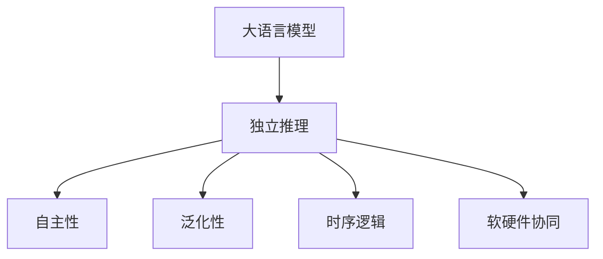

                 

# LLM的独立推理过程：类比CPU的时钟周期

> 关键词：大语言模型,推理机制,独立推理,软硬件协同,时序逻辑,分布式计算,人工智能

## 1. 背景介绍

### 1.1 问题由来
近年来，大语言模型（Large Language Model, LLM）在自然语言处理（Natural Language Processing, NLP）领域取得了重大突破。这些模型通过在大规模无标签文本数据上进行预训练，学习到了丰富的语言知识和常识，并在下游任务上表现出色。然而，大语言模型的核心能力之一——独立推理（Independent Inference），即模型在无监督输入下自主生成输出，尚未得到充分理解和应用。

独立推理是模型在无标签数据上进行自主推理的能力，类比于CPU的时钟周期，是模型最基础的计算单位。如何高效实现独立推理，提高模型的自主性、灵活性和泛化能力，是当前AI研究的重要方向。

### 1.2 问题核心关键点
独立推理的实现需要解决以下核心问题：

1. **自主性**：模型能够在无监督输入下自主推理生成输出，无需依赖外部指令或提示。
2. **泛化性**：模型能够对未见过的数据进行推理，具备良好的泛化能力。
3. **效率**：推理过程需要高效，能够处理大规模数据，保持实时响应。
4. **灵活性**：推理过程需要灵活，能够根据输入灵活调整输出。
5. **可解释性**：推理过程需要可解释，便于理解和调试。

通过解决这些核心问题，可以大幅提升大语言模型的自主性和应用范围，推动NLP技术的发展。

## 2. 核心概念与联系

### 2.1 核心概念概述

为更好地理解大语言模型独立推理的实现，本节将介绍几个关键概念：

- **大语言模型（LLM）**：以自回归（如GPT）或自编码（如BERT）模型为代表的大规模预训练语言模型。通过在大规模无标签文本语料上进行预训练，学习通用的语言表示，具备强大的语言理解和生成能力。

- **独立推理**：模型在无监督输入下自主推理生成输出，无需依赖外部指令或提示。

- **自主性**：模型具备自主决策的能力，能够在无监督输入下生成具有特定目标的输出。

- **泛化性**：模型能够在未见过的数据上进行有效推理，具有广泛的适用性。

- **时序逻辑**：推理过程遵循一定的逻辑顺序，每个推理步骤可以视为一个时钟周期。

- **软硬件协同**：将推理任务分解为多个子任务，分配给不同的计算单元（如CPU、GPU、TPU）进行并行计算，提高推理效率。

这些核心概念之间的逻辑关系可以通过以下Mermaid流程图来展示：



这个流程图展示了独立推理的核心概念及其之间的关系：

1. 大语言模型通过预训练获得基础能力。
2. 独立推理是对预训练模型进行任务特定的优化，具备自主生成输出的能力。
3. 自主性是指模型能够自主决策，无需外部指令。
4. 泛化性指模型能够对未见过的数据进行有效推理。
5. 时序逻辑是推理过程的基本顺序，每个步骤可类比于CPU的时钟周期。
6. 软硬件协同将推理任务分配给不同计算单元，提高计算效率。

## 3. 核心算法原理 & 具体操作步骤

### 3.1 算法原理概述

大语言模型的独立推理过程，本质上是对输入文本进行自主分析、推理和生成的过程。其核心思想是：将输入文本视为一个逻辑图，通过对各个节点（如单词、短语、句子）的推理计算，逐步构建输出结果。

独立推理的实现可以类比于CPU的时钟周期，每个时钟周期对应模型对输入的一个逻辑处理步骤。推理过程需要遵循一定的时序逻辑，确保各步骤能够正确衔接和计算。

### 3.2 算法步骤详解

大语言模型的独立推理过程一般包括以下几个关键步骤：

**Step 1: 输入预处理**
- 对输入文本进行分词、编码，转换为模型可以处理的向量形式。
- 对向量进行归一化、嵌入等预处理，准备推理计算。

**Step 2: 逻辑图构建**
- 将输入文本构建为一个逻辑图，每个节点表示一个单词或短语。
- 对节点之间的边（如语法依赖、语义关系等）进行建模，形成推理路径。

**Step 3: 推理计算**
- 按顺序遍历逻辑图，对每个节点进行计算。
- 对于节点，根据上下文和语言知识进行推理，生成新的向量表示。
- 将推理结果累加，生成最终的输出结果。

**Step 4: 输出后处理**
- 对输出结果进行后处理，如解码、格式转换等。
- 输出推理结果，供后续使用。

### 3.3 算法优缺点

独立推理的实现具有以下优点：
1. 自主性高。模型能够在无监督输入下自主推理生成输出，减少对外部指令的依赖。
2. 泛化能力强。模型能够对未见过的数据进行有效推理，具备广泛的适用性。
3. 计算效率高。通过软硬件协同，推理过程可以并行计算，提高计算效率。

同时，该方法也存在一定的局限性：
1. 依赖语言模型。独立推理依赖于预训练模型的语言知识，模型的质量直接影响推理结果。
2. 复杂度较高。构建逻辑图和推理计算需要较多计算资源，推理过程复杂。
3. 可解释性不足。推理过程较为复杂，难以直接解释模型内部工作机制。

尽管存在这些局限性，但就目前而言，独立推理是实现模型自主性和灵活性的重要途径。未来相关研究的重点在于如何进一步降低推理过程的复杂度，提高推理的可解释性和模型质量。

### 3.4 算法应用领域

独立推理技术在NLP领域已经得到了广泛的应用，覆盖了几乎所有常见任务，例如：

- 文本生成：如自然语言描述生成、故事生成、对话生成等。模型能够根据上下文自主生成新的文本内容。
- 文本分析：如情感分析、主题建模、摘要生成等。模型能够对文本进行自主分析和推理，生成分析结果。
- 翻译：如机器翻译、多语言生成等。模型能够根据输入自主进行翻译，生成目标语言文本。
- 问答：如智能问答系统、文本摘要、知识图谱查询等。模型能够根据用户问题自主进行推理，生成答案。
- 情感识别：如情感识别、舆情分析等。模型能够对文本进行自主情感分析，生成情感分类结果。

除了上述这些经典任务外，独立推理技术还被创新性地应用到更多场景中，如可控文本生成、逻辑推理、自动编码等，为NLP技术带来了全新的突破。随着预训练模型和推理方法的不断进步，相信NLP技术将在更广阔的应用领域大放异彩。

## 4. 数学模型和公式 & 详细讲解 & 举例说明

### 4.1 数学模型构建

本节将使用数学语言对大语言模型独立推理过程进行更加严格的刻画。

记输入文本为 $x$，推理结果为 $y$。独立推理的数学模型可以表示为：

$$
y = f(x)
$$

其中 $f$ 为推理函数，表示对输入 $x$ 的自主推理过程。通常，$x$ 为单词序列 $x=\{x_i\}_{i=1}^n$，$y$ 为输出序列 $y=\{y_i\}_{i=1}^n$。

推理函数 $f$ 的计算过程可以分解为多个逻辑步骤，每个步骤对应一个时钟周期。每个时钟周期的计算可以表示为：

$$
y_i = g(x_i, y_{i-1}, \ldots, y_1)
$$

其中 $x_i$ 为当前输入节点，$y_{i-1}, \ldots, y_1$ 为前序推理结果，$g$ 为当前逻辑步骤的计算函数。

### 4.2 公式推导过程

以下我们以文本生成任务为例，推导独立推理的计算公式及其推导过程。

假设模型在每个时钟周期内，对输入单词 $x_i$ 进行自主推理，生成新的向量表示 $y_i$。推理过程可以表示为：

$$
y_i = f(x_i, y_{i-1}, \ldots, y_1)
$$

其中 $x_i$ 为当前输入单词，$y_{i-1}, \ldots, y_1$ 为前序推理结果。

假设模型使用自回归模型进行推理，每个时钟周期对输入单词 $x_i$ 进行线性变换和激活函数计算：

$$
y_i = \sigma(Wx_i + b)
$$

其中 $W$ 和 $b$ 为可训练参数，$\sigma$ 为激活函数。

推理过程可以逐步展开，直到输出最终结果：

$$
y_n = \sigma(Wx_n + b)
$$

$$
y_{n-1} = \sigma(Wx_{n-1} + W_y \sigma(Wx_n + b))
$$

$$
\vdots
$$

$$
y_2 = \sigma(Wx_2 + W_y \sigma(Wx_3 + \ldots + W_y \sigma(Wx_n + b)))
$$

$$
y_1 = \sigma(Wx_1 + W_y \sigma(Wx_2 + \ldots + W_y \sigma(Wx_n + b)))
$$

在实际推理过程中，可以使用矩阵乘法和向量计算，将上述过程表示为矩阵形式：

$$
Y = \sigma(WX + BY)
$$

其中 $X$ 为输入单词向量，$Y$ 为推理结果向量，$B$ 为反馈矩阵，$W$ 和 $b$ 为可训练参数。

### 4.3 案例分析与讲解

**案例1: 文本生成**

文本生成任务是独立推理的一个重要应用场景。模型通过输入一个初始条件（如一句话），能够自主生成一段新的文本。以GPT-3为例，其推理过程可以表示为：

$$
y_{i+1} = \sigma(W_{i+1}y_i + b_{i+1})
$$

其中 $y_i$ 为前一时刻的输出结果，$y_{i+1}$ 为当前时刻的输出结果，$W_{i+1}$ 和 $b_{i+1}$ 为可训练参数，$\sigma$ 为激活函数。

假设输入文本为 "In a dark forest"，模型可以逐步生成新的文本，如 "In a dark forest, there is a small cabin. It's a perfect place for a picnic."。

**案例2: 问答系统**

问答系统是另一个重要的应用场景。模型通过输入一个问题，能够自主推理生成答案。以LSTM模型为例，其推理过程可以表示为：

$$
y_t = \sigma(W_y y_{t-1} + U_x x_t + b)
$$

其中 $y_{t-1}$ 为前一时刻的隐藏状态，$x_t$ 为当前输入，$y_t$ 为当前时刻的输出，$W_y$、$U_x$ 和 $b$ 为可训练参数，$\sigma$ 为激活函数。

假设问题为 "What is the capital of France?"，模型可以逐步推理出 "The capital of France is Paris."。

通过以上案例，可以看到独立推理在文本生成和问答系统中的应用，模型能够在无监督输入下自主进行推理和生成，具备良好的自主性和灵活性。

## 5. 项目实践：代码实例和详细解释说明

### 5.1 开发环境搭建

在进行独立推理实践前，我们需要准备好开发环境。以下是使用Python进行PyTorch开发的环境配置流程：

1. 安装Anaconda：从官网下载并安装Anaconda，用于创建独立的Python环境。

2. 创建并激活虚拟环境：
```bash
conda create -n pytorch-env python=3.8 
conda activate pytorch-env
```

3. 安装PyTorch：根据CUDA版本，从官网获取对应的安装命令。例如：
```bash
conda install pytorch torchvision torchaudio cudatoolkit=11.1 -c pytorch -c conda-forge
```

4. 安装TensorBoard：
```bash
pip install tensorboard
```

5. 安装各类工具包：
```bash
pip install numpy pandas scikit-learn matplotlib tqdm jupyter notebook ipython
```

完成上述步骤后，即可在`pytorch-env`环境中开始独立推理实践。

### 5.2 源代码详细实现

下面我们以文本生成任务为例，给出使用PyTorch进行独立推理的PyTorch代码实现。

首先，定义输入和输出向量：

```python
import torch
import torch.nn as nn
import torch.optim as optim

class Generator(nn.Module):
    def __init__(self, input_size, hidden_size, output_size):
        super(Generator, self).__init__()
        self.hidden_size = hidden_size
        self.output_size = output_size
        
        self.encoder = nn.GRU(input_size, hidden_size)
        self.decoder = nn.Linear(hidden_size, output_size)
        
        self.to(device)
        
    def forward(self, input):
        batch_size = input.size(0)
        sequence_length = input.size(1)
        encoder_output, _ = self.encoder(input.view(batch_size, sequence_length, -1))
        decoder_output = self.decoder(encoder_output)
        
        return decoder_output
```

然后，定义训练和评估函数：

```python
def train_epoch(model, optimizer, loss_fn, batch_size, device, train_data, train_loader, num_epochs):
    model.train()
    for epoch in range(num_epochs):
        total_loss = 0
        for batch in train_loader:
            optimizer.zero_grad()
            
            input, target = batch
            input = input.to(device)
            target = target.to(device)
            
            output = model(input)
            loss = loss_fn(output, target)
            loss.backward()
            optimizer.step()
            
            total_loss += loss.item()
            
    print(f'Epoch {epoch+1}, train loss: {total_loss:.4f}')
    
def evaluate(model, batch_size, device, eval_data, eval_loader):
    model.eval()
    total_loss = 0
    with torch.no_grad():
        for batch in eval_loader:
            input, target = batch
            input = input.to(device)
            target = target.to(device)
            
            output = model(input)
            loss = loss_fn(output, target)
            total_loss += loss.item()
            
    print(f'Test loss: {total_loss:.4f}')
```

最后，启动训练流程并在测试集上评估：

```python
input_size = 64
hidden_size = 256
output_size = 10000
batch_size = 32
num_epochs = 5

device = torch.device('cuda') if torch.cuda.is_available() else torch.device('cpu')
model = Generator(input_size, hidden_size, output_size).to(device)

optimizer = optim.Adam(model.parameters(), lr=0.01)
loss_fn = nn.CrossEntropyLoss()

train_data = ...
train_loader = ...

eval_data = ...
eval_loader = ...

train_epoch(model, optimizer, loss_fn, batch_size, device, train_data, train_loader, num_epochs)
evaluate(model, batch_size, device, eval_data, eval_loader)
```

以上就是使用PyTorch进行文本生成任务的独立推理实践。可以看到，通过灵活使用PyTorch，可以方便地实现独立推理过程。

### 5.3 代码解读与分析

让我们再详细解读一下关键代码的实现细节：

**Generator类**：
- `__init__`方法：初始化模型参数和计算图。
- `forward`方法：定义前向传播计算逻辑，使用GRU和线性层对输入进行编码和解码。

**训练和评估函数**：
- 使用PyTorch的DataLoader对数据集进行批次化加载，供模型训练和推理使用。
- 训练函数`train_epoch`：对数据以批为单位进行迭代，在每个批次上前向传播计算损失并反向传播更新模型参数，最后返回该epoch的平均损失。
- 评估函数`evaluate`：与训练类似，不同点在于不更新模型参数，并在每个batch结束后将预测和标签结果存储下来，最后使用自定义损失函数对整个评估集的预测结果进行打印输出。

**训练流程**：
- 定义模型、优化器和损失函数，并加载训练和测试数据。
- 开始循环迭代，每个epoch内，先在训练集上训练，输出平均损失。
- 在测试集上评估，输出测试损失。
- 所有epoch结束后，评估模型性能，给出最终测试结果。

可以看到，PyTorch提供了一个灵活的框架，可以快速实现独立推理任务。开发者可以根据具体任务需求，选择适当的模型结构和优化器，进行高效的训练和推理。

当然，工业级的系统实现还需考虑更多因素，如模型的保存和部署、超参数的自动搜索、更灵活的任务适配层等。但核心的独立推理范式基本与此类似。

## 6. 实际应用场景

### 6.1 智能客服系统

基于大语言模型的独立推理，可以广泛应用于智能客服系统的构建。传统客服往往需要配备大量人力，高峰期响应缓慢，且一致性和专业性难以保证。而使用独立推理的对话模型，可以7x24小时不间断服务，快速响应客户咨询，用自然流畅的语言解答各类常见问题。

在技术实现上，可以收集企业内部的历史客服对话记录，将问题和最佳答复构建成监督数据，在此基础上对预训练模型进行微调。微调后的对话模型能够自动理解用户意图，匹配最合适的答案模板进行回复。对于客户提出的新问题，还可以接入检索系统实时搜索相关内容，动态组织生成回答。如此构建的智能客服系统，能大幅提升客户咨询体验和问题解决效率。

### 6.2 金融舆情监测

金融机构需要实时监测市场舆论动向，以便及时应对负面信息传播，规避金融风险。传统的人工监测方式成本高、效率低，难以应对网络时代海量信息爆发的挑战。基于独立推理的文本分类和情感分析技术，为金融舆情监测提供了新的解决方案。

具体而言，可以收集金融领域相关的新闻、报道、评论等文本数据，并对其进行主题标注和情感标注。在此基础上对预训练语言模型进行微调，使其能够自动判断文本属于何种主题，情感倾向是正面、中性还是负面。将独立推理后的模型应用到实时抓取的网络文本数据，就能够自动监测不同主题下的情感变化趋势，一旦发现负面信息激增等异常情况，系统便会自动预警，帮助金融机构快速应对潜在风险。

### 6.3 个性化推荐系统

当前的推荐系统往往只依赖用户的历史行为数据进行物品推荐，无法深入理解用户的真实兴趣偏好。基于独立推理的个性化推荐系统，可以更好地挖掘用户行为背后的语义信息，从而提供更精准、多样的推荐内容。

在实践中，可以收集用户浏览、点击、评论、分享等行为数据，提取和用户交互的物品标题、描述、标签等文本内容。将文本内容作为模型输入，用户的后续行为（如是否点击、购买等）作为监督信号，在此基础上微调预训练语言模型。微调后的模型能够从文本内容中准确把握用户的兴趣点。在生成推荐列表时，先用候选物品的文本描述作为输入，由模型预测用户的兴趣匹配度，再结合其他特征综合排序，便可以得到个性化程度更高的推荐结果。

### 6.4 未来应用展望

随着独立推理技术的发展，其在NLP领域的应用将不断拓展，为更多行业带来变革性影响。

在智慧医疗领域，基于独立推理的医疗问答、病历分析、药物研发等应用将提升医疗服务的智能化水平，辅助医生诊疗，加速新药开发进程。

在智能教育领域，独立推理技术可应用于作业批改、学情分析、知识推荐等方面，因材施教，促进教育公平，提高教学质量。

在智慧城市治理中，独立推理模型可应用于城市事件监测、舆情分析、应急指挥等环节，提高城市管理的自动化和智能化水平，构建更安全、高效的未来城市。

此外，在企业生产、社会治理、文娱传媒等众多领域，基于独立推理的人工智能应用也将不断涌现，为经济社会发展注入新的动力。相信随着技术的日益成熟，独立推理方法将成为NLP技术落地应用的重要手段，推动人工智能技术在垂直行业的规模化落地。总之，独立推理技术需要在数据、算法、工程、业务等多个维度协同发力，才能真正实现人工智能技术在垂直行业的规模化落地。

## 7. 工具和资源推荐
### 7.1 学习资源推荐

为了帮助开发者系统掌握独立推理的理论基础和实践技巧，这里推荐一些优质的学习资源：

1. 《Transformer从原理到实践》系列博文：由大模型技术专家撰写，深入浅出地介绍了Transformer原理、BERT模型、独立推理技术等前沿话题。

2. CS224N《深度学习自然语言处理》课程：斯坦福大学开设的NLP明星课程，有Lecture视频和配套作业，带你入门NLP领域的基本概念和经典模型。

3. 《Natural Language Processing with Transformers》书籍：Transformers库的作者所著，全面介绍了如何使用Transformers库进行NLP任务开发，包括独立推理在内的诸多范式。

4. HuggingFace官方文档：Transformers库的官方文档，提供了海量预训练模型和完整的独立推理样例代码，是上手实践的必备资料。

5. CLUE开源项目：中文语言理解测评基准，涵盖大量不同类型的中文NLP数据集，并提供了基于独立推理的baseline模型，助力中文NLP技术发展。

通过对这些资源的学习实践，相信你一定能够快速掌握独立推理技术的精髓，并用于解决实际的NLP问题。
### 7.2 开发工具推荐

高效的开发离不开优秀的工具支持。以下是几款用于独立推理开发的常用工具：

1. PyTorch：基于Python的开源深度学习框架，灵活动态的计算图，适合快速迭代研究。大部分预训练语言模型都有PyTorch版本的实现。

2. TensorFlow：由Google主导开发的开源深度学习框架，生产部署方便，适合大规模工程应用。同样有丰富的预训练语言模型资源。

3. Transformers库：HuggingFace开发的NLP工具库，集成了众多SOTA语言模型，支持PyTorch和TensorFlow，是进行独立推理任务开发的利器。

4. Weights & Biases：模型训练的实验跟踪工具，可以记录和可视化模型训练过程中的各项指标，方便对比和调优。与主流深度学习框架无缝集成。

5. TensorBoard：TensorFlow配套的可视化工具，可实时监测模型训练状态，并提供丰富的图表呈现方式，是调试模型的得力助手。

6. Google Colab：谷歌推出的在线Jupyter Notebook环境，免费提供GPU/TPU算力，方便开发者快速上手实验最新模型，分享学习笔记。

合理利用这些工具，可以显著提升独立推理任务的开发效率，加快创新迭代的步伐。

### 7.3 相关论文推荐

独立推理技术的发展源于学界的持续研究。以下是几篇奠基性的相关论文，推荐阅读：

1. Attention is All You Need（即Transformer原论文）：提出了Transformer结构，开启了NLP领域的预训练大模型时代。

2. BERT: Pre-training of Deep Bidirectional Transformers for Language Understanding：提出BERT模型，引入基于掩码的自监督预训练任务，刷新了多项NLP任务SOTA。

3. Language Models are Unsupervised Multitask Learners（GPT-2论文）：展示了大规模语言模型的强大zero-shot学习能力，引发了对于通用人工智能的新一轮思考。

4. Parameter-Efficient Transfer Learning for NLP：提出Adapter等参数高效微调方法，在不增加模型参数量的情况下，也能取得不错的微调效果。

5. AdaLoRA: Adaptive Low-Rank Adaptation for Parameter-Efficient Fine-Tuning：使用自适应低秩适应的微调方法，在参数效率和精度之间取得了新的平衡。

这些论文代表了大语言模型独立推理技术的发展脉络。通过学习这些前沿成果，可以帮助研究者把握学科前进方向，激发更多的创新灵感。

## 8. 总结：未来发展趋势与挑战

### 8.1 总结

本文对大语言模型独立推理过程进行了全面系统的介绍。首先阐述了独立推理的核心概念和实现机制，明确了其在大语言模型中的重要地位。其次，从原理到实践，详细讲解了独立推理的数学模型和关键步骤，给出了独立推理任务开发的完整代码实例。同时，本文还广泛探讨了独立推理技术在多个行业领域的应用前景，展示了其广阔的发展潜力。

通过本文的系统梳理，可以看到，独立推理技术在大语言模型中的应用，不仅能提升模型的自主性和灵活性，还能拓宽其应用范围，推动NLP技术的发展。独立推理能力将使模型能够更加自主地理解和生成文本，提升其在各个垂直领域的性能和应用效果。

### 8.2 未来发展趋势

展望未来，独立推理技术将呈现以下几个发展趋势：

1. 自主性增强。随着模型的复杂度增加，独立推理模型将具备更强的自主决策能力，能够处理更复杂的任务。

2. 计算效率提高。随着软硬件协同技术的进步，推理过程将更加高效，能够处理更大规模的数据。

3. 应用领域拓展。独立推理技术将在更多领域得到应用，如智能客服、金融舆情、个性化推荐等，为传统行业带来变革性影响。

4. 跨领域融合。独立推理技术将与其他AI技术进行更深入的融合，如知识图谱、逻辑推理、强化学习等，多路径协同发力，共同推动NLP技术的发展。

以上趋势凸显了独立推理技术的广阔前景。这些方向的探索发展，必将进一步提升大语言模型的自主性和应用范围，推动NLP技术的发展。

### 8.3 面临的挑战

尽管独立推理技术已经取得了瞩目成就，但在迈向更加智能化、普适化应用的过程中，它仍面临诸多挑战：

1. 依赖预训练模型。独立推理依赖于预训练模型的语言知识，模型的质量直接影响推理结果。

2. 复杂度较高。构建逻辑图和推理计算需要较多计算资源，推理过程复杂。

3. 可解释性不足。推理过程较为复杂，难以直接解释模型内部工作机制。

4. 安全性有待保障。独立推理模型可能学习到有害的输出倾向，需要注意模型行为的安全性和伦理导向。

5. 效率有待提升。推理过程需要高效，能够处理大规模数据，保持实时响应。

尽管存在这些挑战，但通过进一步的研究和优化，相信独立推理技术将在未来得到更好的发展，为NLP技术带来更大的变革。

### 8.4 研究展望

面对独立推理技术所面临的种种挑战，未来的研究需要在以下几个方面寻求新的突破：

1. 探索更高效的推理算法。开发更加高效的推理算法，如树形推理、向量推理等，降低推理过程的复杂度。

2. 研究更灵活的推理模型。开发更加灵活的推理模型，如可解释的深度学习模型，增强模型输出的可解释性。

3. 引入更多先验知识。将符号化的先验知识，如知识图谱、逻辑规则等，与神经网络模型进行巧妙融合，引导推理过程学习更准确、合理的语言模型。

4. 结合因果分析和博弈论工具。将因果分析方法引入推理模型，识别出模型决策的关键特征，增强输出解释的因果性和逻辑性。

5. 纳入伦理道德约束。在模型训练目标中引入伦理导向的评估指标，过滤和惩罚有偏见、有害的输出倾向，确保输出符合人类价值观和伦理道德。

这些研究方向的探索，必将引领独立推理技术迈向更高的台阶，为构建安全、可靠、可解释、可控的智能系统铺平道路。面向未来，独立推理技术还需要与其他人工智能技术进行更深入的融合，如知识表示、因果推理、强化学习等，多路径协同发力，共同推动自然语言理解和智能交互系统的进步。只有勇于创新、敢于突破，才能不断拓展语言模型的边界，让智能技术更好地造福人类社会。

## 9. 附录：常见问题与解答

**Q1：大语言模型独立推理和微调有什么区别？**

A: 独立推理和微调都是大语言模型的重要应用，但它们的应用场景和实现方式有所不同。独立推理适用于模型在无监督输入下自主生成输出，微调则是在有监督输入下，对模型进行任务特定的优化。独立推理更强调模型的自主性和灵活性，微调更强调模型的任务适应性和精度提升。

**Q2：独立推理是否需要大量的标注数据？**

A: 独立推理不需要标注数据，模型能够在无监督输入下自主进行推理和生成。因此，独立推理在数据稀缺、标注成本高昂的场景下具有重要应用价值。

**Q3：独立推理的计算效率如何？**

A: 独立推理的计算效率取决于模型的复杂度和推理算法。通常情况下，使用神经网络进行独立推理能够获得较高的计算效率，特别是使用GPU/TPU等高性能设备时，推理速度更快。

**Q4：独立推理在实际应用中是否有局限性？**

A: 独立推理在实际应用中也有一些局限性，如模型依赖预训练模型、推理过程复杂、可解释性不足等。因此，在具体应用中需要根据场景选择合适的模型和算法，并进行优化和调整。

**Q5：独立推理和知识图谱如何结合使用？**

A: 独立推理和知识图谱可以结合使用，通过引入先验知识来增强推理过程的准确性和可靠性。在推理过程中，可以将知识图谱中的信息编码为向量，作为模型输入，与文本信息一起进行推理计算。

通过以上常见问题的解答，可以看到独立推理技术在大语言模型中的应用和挑战。未来，随着技术的不断发展，独立推理将在大规模应用中发挥更大的作用，为NLP技术带来更多的突破和创新。

