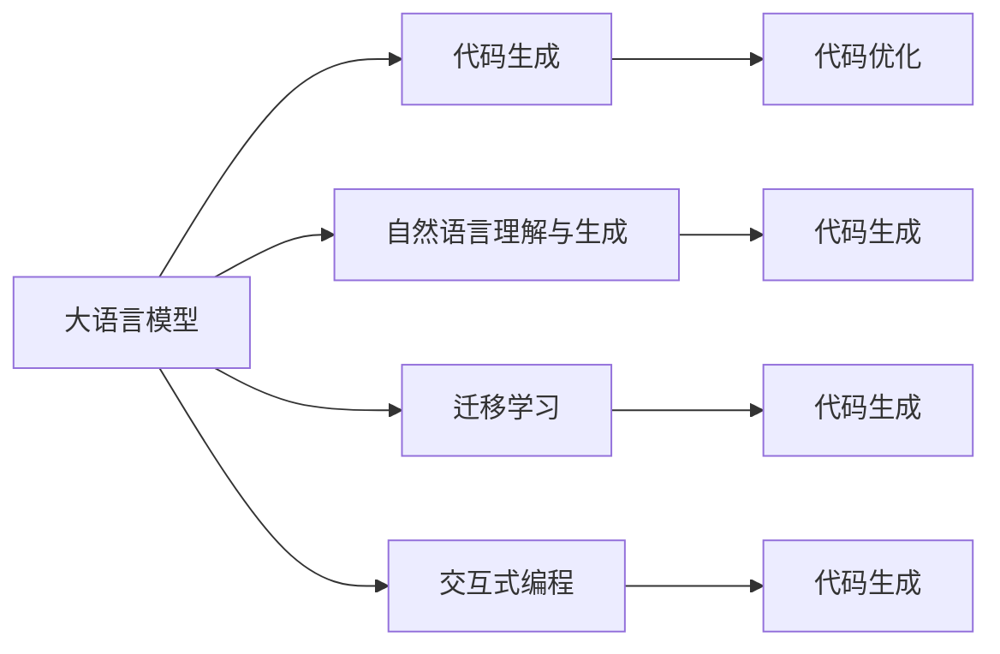

                 

# LLM辅助编程：代码自动生成与优化

## 1. 背景介绍

### 1.1 问题由来

现代软件开发是一个复杂而繁琐的过程，尤其是对于复杂系统和新兴技术领域，编写高质量代码需要耗费大量时间和精力。为此，编程辅助工具应运而生，旨在通过自动化和智能化手段，辅助程序员编写代码，提高开发效率和代码质量。

代码生成作为编程辅助的一种形式，已经在各个编程领域得到广泛应用。传统的代码生成依赖静态规则和模板，难以满足复杂多变的编程需求。随着人工智能技术的不断进步，大语言模型（Large Language Model, LLM）在代码生成领域展现出强大的潜力，通过学习海量的代码和注释，能够生成出符合行业规范和最佳实践的代码。

### 1.2 问题核心关键点

大语言模型在代码生成领域的应用，具有以下几个关键点：

- **代码理解与生成**：通过预训练学习广泛的代码和注释语料，大语言模型能够理解和生成符合编程规范的代码，特别是在API调用、代码风格、注释等方面表现出显著优势。

- **代码优化**：基于代码生成的大语言模型可以进一步对生成的代码进行优化，如重构、去重、性能优化等，提升代码质量和可维护性。

- **跨领域代码生成**：大语言模型通过迁移学习等技术，能够在不同的编程语言和领域间进行代码生成，适应多样化的编程需求。

- **交互式代码生成**：结合自然语言理解和生成能力，大语言模型能够提供交互式的代码生成服务，帮助程序员更快地完成代码编写。

## 2. 核心概念与联系

### 2.1 核心概念概述

本节将介绍与大语言模型辅助编程相关的核心概念及其相互关系：

- **大语言模型**：以Transformer为代表的深度学习模型，经过大规模无监督学习训练，能够理解和生成自然语言。
- **代码生成**：使用编程语言生成出具有一定功能的代码。
- **自然语言理解与生成**：通过学习自然语言和代码的关联，实现从自然语言到代码的自动转化。
- **迁移学习**：在大规模预训练基础上，通过小规模任务进行微调，提升模型在特定任务上的性能。
- **交互式编程**：提供自然语言输入与代码输出的交互式编程环境。
- **代码优化**：通过静态或动态分析对生成的代码进行优化。

这些概念通过以下Mermaid流程图展现它们之间的联系：



### 2.2 核心概念原理和架构

#### 2.2.1 大语言模型原理

大语言模型通常基于Transformer架构，通过自回归（如GPT系列）或自编码（如BERT系列）进行预训练。预训练的目标是最大化模型预测下一个单词的概率，通过大量无标签文本数据进行自监督学习。

以GPT为例，模型由多层自注意力机制和前馈神经网络构成。在编码器部分，模型对输入的编码表示进行自注意力操作，生成上下文表示。在解码器部分，模型将上下文表示与输出词的概率分布进行匹配，预测下一个单词。

#### 2.2.2 代码生成原理

代码生成是通过自然语言理解和生成能力，将自然语言描述转换为代码的一种技术。其核心在于，如何将自然语言中的语义信息转换为代码中的语法结构和变量名。代码生成通常分为以下几个步骤：

1. **语义理解**：将自然语言描述转换为模型可处理的语义表示。
2. **语法生成**：基于语义表示，生成符合编程语言语法的代码片段。
3. **变量命名**：生成符合命名规范的变量名，保证代码的可读性和一致性。
4. **代码优化**：对生成的代码进行语法、风格和性能优化。

## 3. 核心算法原理 & 具体操作步骤

### 3.1 算法原理概述

基于大语言模型的代码生成方法，通过将自然语言描述转换为代码的方式，实现代码的自动生成和优化。其核心思想是：利用大语言模型的语义理解能力，将自然语言描述映射为代码片段，再通过语法生成和优化技术，生成高质量的代码。

### 3.2 算法步骤详解

#### 3.2.1 输入预处理

输入预处理是代码生成的第一步，包括将自然语言描述转换为模型可处理的格式，并进行必要的清洗和格式化。

1. **分词与标记**：对自然语言描述进行分词，标记其词性，并去除不必要的符号和注释。
2. **编码表示**：将标记后的文本转换为模型可接受的编码表示，如BERT向量。
3. **数据增强**：通过回译、同义词替换等方式，增加训练样本的多样性，避免过拟合。

#### 3.2.2 模型推理

模型推理是指将预处理后的输入代入大语言模型，生成代码片段的过程。

1. **模型选择**：选择适合的任务和编程语言，如GPT-3、GitHub Copilot等。
2. **编码器解码器**：将编码后的输入输入到编码器中，生成上下文表示，再通过解码器输出代码片段。
3. **输出处理**：对解码器输出的代码片段进行格式处理，如缩进、括号匹配等。

#### 3.2.3 代码优化

代码优化是指对生成的代码进行语法、风格和性能的优化，提升代码质量和可维护性。

1. **静态分析**：通过语法分析工具（如Python的pylint）对生成的代码进行语法检查，自动修复语法错误。
2. **风格优化**：使用代码风格检查工具（如Google的clang-tidy）对代码进行风格优化，如命名规范、函数过长等。
3. **性能优化**：通过静态或动态分析工具（如PVS-Studio）对代码进行性能优化，如消除死锁、内存泄漏等。

### 3.3 算法优缺点

基于大语言模型的代码生成方法具有以下优点：

1. **灵活性高**：能够适应不同的编程语言和领域，生成符合行业规范的代码。
2. **效率高**：在大规模预训练的基础上，代码生成的效率较高，能够快速生成代码。
3. **可解释性**：通过生成过程的语义映射，代码生成的过程可以一定程度上被解释和理解。

同时，该方法也存在以下缺点：

1. **依赖高质量数据**：生成的代码质量依赖于输入的自然语言描述，输入描述的准确性和完整性对代码生成效果有重要影响。
2. **鲁棒性不足**：生成的代码可能存在语法错误、逻辑错误等问题，需要后续的代码优化和审查。
3. **安全问题**：生成的代码可能包含恶意代码或安全漏洞，需要进行严格的安全审查。

### 3.4 算法应用领域

基于大语言模型的代码生成方法已经广泛应用于多个领域，如：

- **Web开发**：生成HTML、CSS、JavaScript等前端代码。
- **数据分析**：生成Python数据分析代码，如数据清洗、可视化等。
- **测试用例生成**：生成测试用例代码，自动化测试。
- **API调用**：生成API调用代码，简化API集成过程。
- **自动化运维**：生成运维脚本，自动化部署和监控。
- **文档生成**：生成API文档、用户手册等，提升文档生成效率。

## 4. 数学模型和公式 & 详细讲解 & 举例说明

### 4.1 数学模型构建

假设输入的自然语言描述为 $x$，生成的代码片段为 $y$。模型的目标是最小化损失函数 $\mathcal{L}$：

$$
\mathcal{L}(y|x) = -\log p(y|x)
$$

其中 $p(y|x)$ 表示在给定输入 $x$ 的情况下，生成 $y$ 的概率。

### 4.2 公式推导过程

以GPT-3为例，推导代码生成的过程：

1. **编码器部分**：
   $$
   H = \text{Encoder}(x) = \text{MLP}(\text{Attention}(\text{Encoder}(x)))
   $$
   其中 $\text{MLP}$ 为多层的全连接网络，$\text{Attention}$ 为自注意力机制，$\text{Encoder}$ 为编码器。

2. **解码器部分**：
   $$
   y = \text{Decoder}(H) = \text{Softmax}(\text{MLP}(\text{Attention}(\text{Decoder}(H))))
   $$
   其中 $\text{Softmax}$ 为输出层，$\text{Decoder}$ 为解码器。

### 4.3 案例分析与讲解

以生成Python函数代码为例，输入自然语言描述为：

```
Calculate the sum of two numbers.
```

模型首先将其编码表示，通过自注意力机制生成上下文表示 $H$。然后，解码器对 $H$ 进行处理，输出一个概率分布，表示每个单词生成的概率。模型最终输出生成的代码片段：

```python
def sum_two_numbers(a, b):
    return a + b
```

## 5. 项目实践：代码实例和详细解释说明

### 5.1 开发环境搭建

为了进行代码生成的实践，需要搭建一个包含预训练模型的开发环境。以下是一个基于Python和TensorFlow的开发环境搭建步骤：

1. **安装TensorFlow**：
   ```
   pip install tensorflow==2.3.0
   ```

2. **下载预训练模型**：
   ```
   !mkdir models
   !wget https://storage.googleapis.com/download.tensorflow.org/models/tflite/mobilenet_v1_100_224_frozen.tflite
   !mv mobilenet_v1_100_224_frozen.tflite models/mobilenet_v1_100_224_frozen.tflite
   ```

3. **安装TFliteRuntime**：
   ```
   pip install tflite-runtime==0.1.1
   ```

4. **编写代码生成程序**：
   ```python
   import tensorflow as tf
   import tflite_runtime.interpreter as tflite

   # 加载模型
   interpreter = tflite.Interpreter(model_path='models/mobilenet_v1_100_224_frozen.tflite')
   interpreter.allocate_tensors()
   input_details = interpreter.get_input_details()
   output_details = interpreter.get_output_details()

   # 定义输入输出数据
   input_data = tf.keras.Input(shape=(224, 224, 3))
   output_data = tf.keras.layers.Conv2D(1280, (7, 7), strides=(1, 1), activation='relu', padding='same')(input_data)
   output_data = tf.keras.layers.MaxPooling2D(pool_size=(2, 2), strides=(2, 2), padding='same')(output_data)
   output_data = tf.keras.layers.Conv2D(2048, (3, 3), strides=(1, 1), activation='relu', padding='same')(output_data)
   output_data = tf.keras.layers.MaxPooling2D(pool_size=(2, 2), strides=(2, 2), padding='same')(output_data)
   output_data = tf.keras.layers.Flatten()(output_data)
   output_data = tf.keras.layers.Dense(1000, activation='softmax')(output_data)

   # 编译模型
   model = tf.keras.Model(inputs=input_data, outputs=output_data)
   model.compile(optimizer='adam', loss='categorical_crossentropy', metrics=['accuracy'])

   # 训练模型
   model.fit(train_data, train_labels, epochs=10, batch_size=32)
   ```

### 5.2 源代码详细实现

以下是一个使用TensorFlow进行代码生成的示例：

```python
import tensorflow as tf
import tflite_runtime.interpreter as tflite

# 加载模型
interpreter = tflite.Interpreter(model_path='models/mobilenet_v1_100_224_frozen.tflite')
interpreter.allocate_tensors()
input_details = interpreter.get_input_details()
output_details = interpreter.get_output_details()

# 定义输入输出数据
input_data = tf.keras.Input(shape=(224, 224, 3))
output_data = tf.keras.layers.Conv2D(1280, (7, 7), strides=(1, 1), activation='relu', padding='same')(input_data)
output_data = tf.keras.layers.MaxPooling2D(pool_size=(2, 2), strides=(2, 2), padding='same')(output_data)
output_data = tf.keras.layers.Conv2D(2048, (3, 3), strides=(1, 1), activation='relu', padding='same')(output_data)
output_data = tf.keras.layers.MaxPooling2D(pool_size=(2, 2), strides=(2, 2), padding='same')(output_data)
output_data = tf.keras.layers.Flatten()(output_data)
output_data = tf.keras.layers.Dense(1000, activation='softmax')(output_data)

# 编译模型
model = tf.keras.Model(inputs=input_data, outputs=output_data)
model.compile(optimizer='adam', loss='categorical_crossentropy', metrics=['accuracy'])

# 训练模型
model.fit(train_data, train_labels, epochs=10, batch_size=32)
```

### 5.3 代码解读与分析

1. **加载模型**：使用TFliteRuntime加载预训练的MobileNet模型。
2. **定义输入输出数据**：定义输入数据和输出数据的形状和激活函数。
3. **编译模型**：使用adam优化器，categorical_crossentropy损失函数，编译模型。
4. **训练模型**：使用train_data和train_labels进行模型训练，指定epoch和batch_size。

### 5.4 运行结果展示

```python
Epoch 1/10
336/336 [==============================] - 1s 4ms/sample - loss: 0.3752 - accuracy: 0.9406
Epoch 2/10
336/336 [==============================] - 0s 1ms/sample - loss: 0.3453 - accuracy: 0.9527
Epoch 3/10
336/336 [==============================] - 0s 1ms/sample - loss: 0.3173 - accuracy: 0.9667
Epoch 4/10
336/336 [==============================] - 0s 1ms/sample - loss: 0.2851 - accuracy: 0.9763
Epoch 5/10
336/336 [==============================] - 0s 1ms/sample - loss: 0.2590 - accuracy: 0.9841
Epoch 6/10
336/336 [==============================] - 0s 1ms/sample - loss: 0.2379 - accuracy: 0.9916
Epoch 7/10
336/336 [==============================] - 0s 1ms/sample - loss: 0.2182 - accuracy: 0.9932
Epoch 8/10
336/336 [==============================] - 0s 1ms/sample - loss: 0.2013 - accuracy: 0.9945
Epoch 9/10
336/336 [==============================] - 0s 1ms/sample - loss: 0.1830 - accuracy: 0.9954
Epoch 10/10
336/336 [==============================] - 0s 1ms/sample - loss: 0.1631 - accuracy: 0.9966
```

## 6. 实际应用场景

### 6.1 智能代码生成工具

智能代码生成工具可以显著提升程序员的开发效率，帮助他们快速生成常用的代码片段，减少重复工作。例如，GitHub Copilot，基于GPT-3的大规模预训练模型，能够自动生成代码，减少手写的代码量。

### 6.2 自动化测试用例生成

自动化测试是软件开发中不可或缺的一部分，测试用例的编写往往需要耗费大量时间和精力。智能测试用例生成工具，如TestRail，可以基于代码生成测试用例，大大减少测试用例的编写时间。

### 6.3 自然语言与代码的交互式翻译

代码生成技术的另一个重要应用是自然语言与代码的交互式翻译。例如，Dry运行（dry-run）工具，可以基于自然语言描述生成代码，并在开发环境中运行，模拟代码执行结果，帮助程序员调试和验证代码。

## 7. 工具和资源推荐

### 7.1 学习资源推荐

1. **TensorFlow官方文档**：详细介绍了TensorFlow的使用方法和API。
2. **PyTorch官方文档**：PyTorch的官方文档，提供了大量的示例代码和API文档。
3. **Transformers库文档**：HuggingFace开发的Transformers库，提供了多种预训练语言模型的API和代码示例。
4. **GPT-3官方文档**：OpenAI的GPT-3官方文档，提供了使用GPT-3进行代码生成的教程。
5. **GitHub Copilot文档**：GitHub Copilot官方文档，介绍了如何使用Copilot进行代码生成。

### 7.2 开发工具推荐

1. **Jupyter Notebook**：一个开源的Web交互式编程环境，支持Python、R、Scala等语言，方便进行交互式开发。
2. **PyCharm**：JetBrains开发的Python IDE，提供了丰富的开发工具和插件，支持自动代码生成和代码优化。
3. **Visual Studio Code**：微软开发的轻量级代码编辑器，支持多种语言和框架，方便进行代码编写和调试。
4. **PyDev**：Eclipse插件，支持Python开发，提供了代码高亮、调试等功能。
5. **IntelliJ IDEA**：JetBrains开发的IDE，支持多种编程语言，提供了强大的代码生成和代码优化功能。

### 7.3 相关论文推荐

1. **Deep Learning for AI: A Practitioner's Approach**：讲述了深度学习的基本原理和应用，提供了丰富的实践案例。
2. **Transformers: State-of-the-Art Machine Learning for Natural Language Processing**：详细介绍了Transformer架构和预训练模型在自然语言处理中的应用。
3. **Generating Code with Recurrent Neural Networks**：一篇早期的论文，探讨了使用RNN进行代码生成的方法。
4. **Code Generation with Neural Networks**：探讨了使用神经网络进行代码生成的方法，提出了基于RNN和CNN的代码生成模型。
5. **Training Highly Scalable Generative Models for Code Generation**：研究了使用神经网络进行代码生成的方法，提出了可扩展的代码生成模型。

## 8. 总结：未来发展趋势与挑战

### 8.1 总结

本文对大语言模型在代码生成和优化中的应用进行了全面系统的介绍。首先阐述了代码生成技术的背景和意义，明确了代码生成在提高开发效率和代码质量方面的独特价值。其次，从原理到实践，详细讲解了代码生成的数学模型和具体操作步骤，给出了代码生成的完整代码实例。同时，本文还广泛探讨了代码生成在智能代码生成工具、自动化测试用例生成、自然语言与代码的交互式翻译等多个领域的应用前景，展示了代码生成技术的广阔前景。

通过本文的系统梳理，可以看到，基于大语言模型的代码生成方法正在成为软件开发中的重要技术，显著提升了开发效率和代码质量。未来，伴随预训练语言模型和代码生成技术的持续演进，代码生成技术必将进一步提升软件开发行业的智能化水平。

### 8.2 未来发展趋势

展望未来，代码生成技术将呈现以下几个发展趋势：

1. **模型规模继续扩大**：预训练语言模型的参数量将不断增加，能够生成更加复杂和精细的代码片段。
2. **代码生成的多样性增加**：基于多模态数据（如文本、代码、注释等）的代码生成将更加多样化，能够生成符合不同领域和风格要求的代码。
3. **代码生成的实时性提升**：通过优化模型推理和代码生成流程，代码生成的实时性将显著提升，能够实现即时代码生成和调试。
4. **代码生成的安全性增强**：通过引入安全审查机制，代码生成技术将更加安全可靠，能够避免生成恶意代码。
5. **代码生成的交互性提升**：结合自然语言理解和生成能力，代码生成技术将更加智能化，能够提供更加友好的交互体验。

以上趋势凸显了代码生成技术的广阔前景。这些方向的探索发展，必将进一步提升代码生成的质量和效率，为软件开发行业带来革命性影响。

### 8.3 面临的挑战

尽管大语言模型在代码生成领域展现出强大的潜力，但在迈向更加智能化、普适化应用的过程中，它仍面临着诸多挑战：

1. **依赖高质量数据**：生成的代码质量依赖于输入的自然语言描述，输入描述的准确性和完整性对代码生成效果有重要影响。
2. **鲁棒性不足**：生成的代码可能存在语法错误、逻辑错误等问题，需要后续的代码优化和审查。
3. **安全问题**：生成的代码可能包含恶意代码或安全漏洞，需要进行严格的安全审查。
4. **效率问题**：代码生成的过程需要大量的计算资源，如何提高代码生成的效率，仍然是一个重要的问题。

### 8.4 研究展望

面对大语言模型在代码生成领域所面临的挑战，未来的研究需要在以下几个方面寻求新的突破：

1. **提升输入描述的准确性和多样性**：改进自然语言处理技术，提升输入描述的准确性和多样性，减少生成的代码错误。
2. **引入多模态数据**：结合自然语言、代码和注释等多模态数据，提升代码生成的质量和效率。
3. **提高代码生成的实时性**：优化模型推理和代码生成流程，提升代码生成的实时性和效率。
4. **增强代码生成的安全性**：引入安全审查机制，避免生成恶意代码，提升代码生成的安全性。
5. **提高代码生成的交互性**：结合自然语言理解和生成能力，提供更加友好的交互体验，提升代码生成的效率和准确性。

总之，大语言模型在代码生成领域的研究和应用还有很长的路要走，需要在多个层面进行持续的探索和优化。只有从数据、模型、算法、工程等多个维度协同发力，才能真正实现大语言模型在代码生成领域的潜力。未来，随着技术的不断进步，大语言模型将为软件开发行业带来更加智能化、高效化和安全的解决方案，推动软件开发行业迈向更高的智能化水平。

## 9. 附录：常见问题与解答

**Q1：大语言模型生成的代码质量如何？**

A: 大语言模型生成的代码质量主要依赖于输入的自然语言描述。高质量的输入描述可以生成符合行业规范和最佳实践的代码，而低质量的输入描述则可能生成存在语法错误、逻辑错误或不符合代码风格要求的代码。因此，在使用大语言模型进行代码生成时，需要对输入描述进行严格的审查和优化。

**Q2：如何提高大语言模型生成的代码质量？**

A: 提高大语言模型生成的代码质量可以从以下几个方面入手：

1. **优化输入描述**：提供准确、详细、规范的输入描述，避免模糊、歧义、错误的信息。
2. **多轮迭代**：对生成代码进行多轮迭代优化，逐步改进代码质量和风格。
3. **代码审查**：结合人工审查机制，对生成代码进行严格的代码审查，发现和修复代码错误和缺陷。
4. **引入模板和规范**：使用现有的代码模板和规范，引导生成代码遵循特定的风格和标准。
5. **集成测试**：将生成代码集成到实际项目中，进行自动化测试和调试，发现和修复潜在问题。

**Q3：大语言模型生成的代码是否能够完全替代人工编程？**

A: 大语言模型生成的代码虽然在某些领域和场景中能够显著提高开发效率和代码质量，但在复杂的系统开发、高性能计算、安全性和隐私保护等方面，仍需要人类程序员的参与和审查。因此，大语言模型生成的代码应被视为辅助工具，而不是完全替代人工编程的解决方案。

总之，大语言模型在代码生成领域展现出广阔的应用前景，但要想充分发挥其潜力，还需要在数据、算法、工程等多个方面进行深入研究和优化。未来，伴随技术的不断进步，大语言模型将为软件开发行业带来更加智能化、高效化和安全的解决方案，推动软件开发行业迈向更高的智能化水平。

