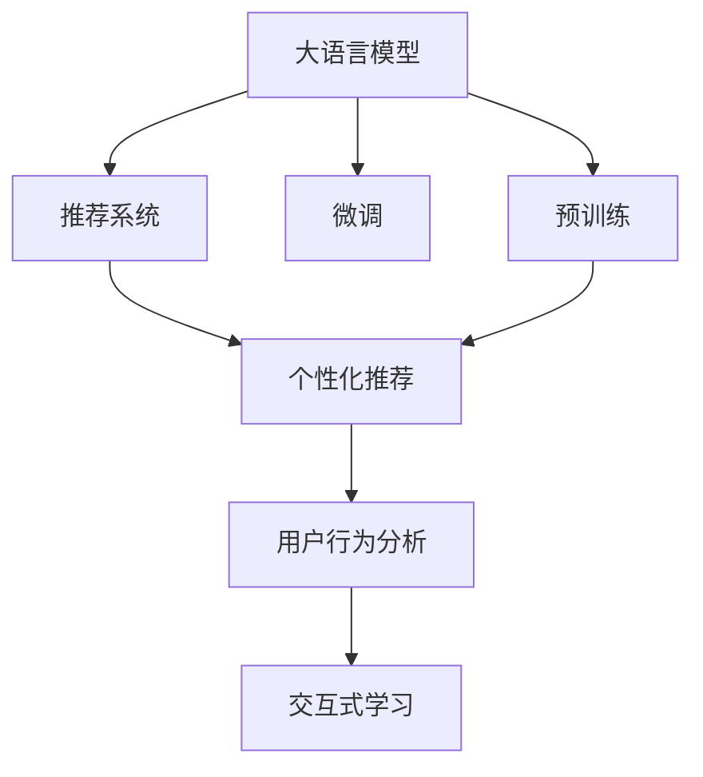

                 

# LLM驱动的个性化学习资源推荐

> 关键词：大语言模型(Large Language Model, LLM), 自然语言处理(Natural Language Processing, NLP), 推荐系统, 个性化推荐, 深度学习(Deep Learning), 用户行为分析, 交互式学习

## 1. 背景介绍

### 1.1 问题由来

随着互联网技术的普及和教育领域的数字化转型，个性化学习资源推荐系统成为了提升教育效果、优化学习体验的重要工具。传统推荐系统通常基于用户历史行为数据进行协同过滤或内容推荐，难以捕捉用户深层需求和个性化特征。而大语言模型(LLM)的兴起，为推荐系统带来了新的思路。

LLM通过在海量文本数据上预训练，学习到了丰富的语言知识和推理能力，具备了从文本中提取、理解和生成信息的能力。在个性化学习资源推荐场景下，LLM可以自动理解用户的查询需求和反馈信息，根据知识图谱、语义相似性等外部知识库，推荐出最适合的学习资源。

### 1.2 问题核心关键点

大语言模型在推荐系统中的应用，关键在于如何高效融合预训练知识和用户行为数据，实现更精准、个性化的推荐。具体来说：
1. 如何捕捉用户深层语义需求。通过微调LLM模型，使其能够理解自然语言查询背后的用户意图。
2. 如何利用多源数据融合推荐结果。通过用户行为数据、知识图谱、用户评价等多种信息源，进行多维度信息融合，提高推荐的准确性。
3. 如何确保推荐系统泛化性和鲁棒性。利用大模型强大的语言理解能力，避免模型过拟合，提升系统在不同场景下的表现。

## 2. 核心概念与联系

### 2.1 核心概念概述

为更好地理解基于LLM的个性化学习资源推荐方法，本节将介绍几个密切相关的核心概念：

- 大语言模型(Large Language Model, LLM)：如BERT、GPT等。通过在海量文本数据上预训练，学习到了通用的语言表示和知识。

- 自然语言处理(Natural Language Processing, NLP)：涉及文本处理、语言理解、语言生成等任务，是大语言模型的重要应用领域。

- 推荐系统(Recommendation System)：根据用户历史行为和偏好，自动推荐学习资源的系统。

- 个性化推荐：根据用户特定的兴趣、需求、学习进度等特征，定制个性化推荐结果。

- 深度学习(Deep Learning)：通过多层神经网络学习数据特征，广泛应用于图像、语音、文本等领域。

- 用户行为分析：对用户的操作行为、交互信息等进行分析，提取用户深层需求和特征。

- 交互式学习：通过用户与系统的实时交互，动态更新推荐结果，增强用户体验。

这些核心概念之间的逻辑关系可以通过以下Mermaid流程图来展示：



这个流程图展示了LLM在推荐系统中的应用流程：

1. 大语言模型通过预训练获得基础能力。
2. 微调模型以提升对用户需求的理解和匹配能力。
3. 结合推荐系统进行学习资源推荐。
4. 通过用户行为分析和交互式学习，动态更新推荐结果。

## 3. 核心算法原理 & 具体操作步骤
### 3.1 算法原理概述

基于LLM的个性化学习资源推荐，本质上是一个多源数据融合的协同过滤过程。其核心思想是：通过预训练语言模型，捕捉用户的深层语义需求，同时利用用户行为数据、知识图谱等外部信息源，进行多维度信息融合，生成个性化推荐结果。

具体来说，推荐系统的工作流程如下：

1. 用户输入查询语句，LLM模型对查询进行语义理解和特征提取。
2. 根据查询结果，LLM模型在知识图谱中查找相关学习资源。
3. 将用户行为数据、资源评价等维度信息进行融合，生成推荐结果。
4. 通过交互式学习，实时更新推荐模型，提升推荐精度。

### 3.2 算法步骤详解

基于LLM的个性化学习资源推荐一般包括以下几个关键步骤：

**Step 1: 准备数据集**
- 收集学习资源的文本描述、用户行为数据、知识图谱等，构建推荐数据集。
- 清洗、标注数据，确保数据质量和一致性。

**Step 2: 选择和微调预训练模型**
- 选择合适的预训练语言模型，如BERT、GPT等。
- 在目标数据集上进行微调，以提升对特定任务（如理解查询、匹配资源等）的适应能力。

**Step 3: 设计推荐目标函数**
- 定义推荐目标函数，通常使用交叉熵、均方误差等损失函数。
- 融合多源数据，如用户行为数据、资源评价、知识图谱等。

**Step 4: 优化推荐模型**
- 选择合适的优化算法，如Adam、SGD等。
- 设置超参数，如学习率、批大小、迭代轮数等。
- 应用正则化技术，如L2正则、Dropout等，防止过拟合。

**Step 5: 交互式学习与反馈**
- 设计交互界面，收集用户反馈信息。
- 根据反馈信息实时更新推荐模型，提高推荐精度。
- 周期性在目标数据集上评估模型性能，调整超参数。

**Step 6: 部署推荐系统**
- 将优化后的模型部署到生产环境，接收用户查询请求。
- 实时生成推荐结果，动态更新推荐库。

以上是基于LLM的个性化学习资源推荐的一般流程。在实际应用中，还需要针对具体任务的特点，对推荐过程的各个环节进行优化设计，如改进推荐目标函数，引入更多的正则化技术，搜索最优的超参数组合等，以进一步提升推荐效果。

### 3.3 算法优缺点

基于LLM的个性化学习资源推荐方法具有以下优点：
1. 深度语义理解。LLM能够从查询语句中提取深层语义信息，捕捉用户真实需求。
2. 多源数据融合。利用多种信息源进行综合推荐，提高推荐的准确性和泛化性。
3. 实时更新推荐。通过交互式学习，实时更新推荐模型，提升用户体验。
4. 泛化能力强。LLM具备强大的语言推理能力，可以在不同场景下保持较好的推荐性能。

同时，该方法也存在一定的局限性：
1. 计算资源消耗高。预训练和微调的计算成本较高，需要高性能硬件支持。
2. 数据隐私问题。收集用户行为数据和反馈信息时，需要确保数据隐私和安全。
3. 模型复杂度高。多源数据融合和实时交互增加了模型的复杂度，维护和调优难度增加。
4. 用户交互设计。设计高效、易用的交互界面，需要大量前期投入和迭代优化。

尽管存在这些局限性，但就目前而言，基于LLM的推荐方法仍然是最先进、最具有潜力的方法之一。未来相关研究的重点在于如何进一步降低计算成本，保护数据隐私，提升推荐系统交互性，以及实现更高效率的实时推荐。

### 3.4 算法应用领域

基于LLM的个性化学习资源推荐，已经在教育、职业培训、在线学习等多个领域得到了广泛应用，具体包括：

1. 在线课程推荐：根据用户的学习进度、兴趣和评价，推荐适合的学习资源。
2. 学科测验题目推荐：根据用户的学习水平和兴趣，推荐适合的测验题目，帮助用户掌握知识。
3. 学习路径规划：根据用户的学业目标和学习进度，推荐合理的学习路径和计划。
4. 学习资源评估：通过用户反馈信息，动态更新资源评价，提高推荐质量。
5. 个性化学习计划：根据用户的学习习惯和需求，定制个性化的学习计划，提升学习效率。
6. 学习资源广告推荐：根据用户的行为数据，推荐相关广告资源，增加平台收益。

除了上述这些经典应用外，LLM还可在更多场景中得到应用，如职业规划、专业课程推荐、知识图谱构建等，为教育技术创新和应用提供了新的思路。

## 4. 数学模型和公式 & 详细讲解 & 举例说明
### 4.1 数学模型构建

本节将使用数学语言对基于LLM的个性化学习资源推荐过程进行更加严格的刻画。

记用户查询为 $q \in V_Q$，学习资源为 $r \in V_R$，知识图谱为 $\mathcal{G}$。用户查询到学习资源的映射关系为 $f: V_Q \times V_R \rightarrow \mathbb{R}$。

定义推荐模型 $M$ 在用户查询 $q$ 上的预测结果为 $\hat{r} = M(q)$，其中 $\hat{r} \in V_R$。推荐目标函数为：

$$
\mathcal{L}(M) = \frac{1}{N} \sum_{(q,r) \in D} \ell(M(q),r)
$$

其中 $D$ 为推荐数据集，$N$ 为数据集大小，$\ell$ 为推荐损失函数，通常使用交叉熵损失或均方误差损失。

### 4.2 公式推导过程

以下我们以基于LLM的课程推荐为例，推导推荐目标函数的计算过程。

假设用户查询为 $q$，预训练语言模型在查询 $q$ 上的语义表示为 $q' = M(q)$，学习资源的语义表示为 $r' = M(r)$，其中 $M$ 为预训练语言模型。知识图谱中 $q$ 和 $r$ 之间的边权为 $w_{(q,r)}$。推荐目标函数为：

$$
\mathcal{L}(M) = \frac{1}{N} \sum_{(q,r) \in D} \ell(M(q),r) = \frac{1}{N} \sum_{(q,r) \in D} \log\sigma(-\text{KL}(q', r') w_{(q,r)})
$$

其中 $\text{KL}$ 为KL散度，$\sigma$ 为 sigmoid 函数。

该推荐函数考虑了用户查询和资源之间的语义相似性，同时利用知识图谱中的边权进行加权，确保推荐的合理性和多样性。在实际应用中，$\text{KL}$ 可以进一步扩展，引入更多外部信息源进行多源融合。

### 4.3 案例分析与讲解

为了更好地理解LLM在推荐系统中的应用，下面以一个具体的例子来展示其实际工作流程。

假设某在线教育平台收集了用户 $u_1$ 的学习数据和反馈信息，通过用户行为分析，获得了用户的深层语义需求 $q_1$。平台上的课程资源 $r_1$ 到 $r_4$ 的文本描述已经经过自然语言处理，转化为语义表示 $r_1'$ 到 $r_4'$。同时，平台构建了知识图谱，在 $q_1$ 和 $r_1$ 到 $r_4$ 之间建立了语义关系，边权分别为 $w_{(q_1,r_1)}$ 到 $w_{(q_1,r_4)}$。

假设平台的推荐目标函数为交叉熵损失，即：

$$
\mathcal{L}(M) = -\frac{1}{N} \sum_{(q,r) \in D} y\log(M(q)) + (1-y)\log(1-M(q))
$$

其中 $y$ 表示 $r$ 是否为用户 $u_1$ 学习过的课程。根据用户行为数据，假设 $y = [0,1,0,0]$，即用户只学习过课程 $r_2$。

根据推荐函数，计算用户 $u_1$ 在查询 $q_1$ 下的推荐结果：

$$
\hat{r} = \sigma(-\text{KL}(q_1', r_1')w_{(q_1,r_1)} - \text{KL}(q_1', r_2')w_{(q_1,r_2)} - \text{KL}(q_1', r_3')w_{(q_1,r_3)} - \text{KL}(q_1', r_4')w_{(q_1,r_4)}
$$

最后，根据计算结果，生成用户 $u_1$ 在查询 $q_1$ 下的推荐课程。

## 5. 项目实践：代码实例和详细解释说明
### 5.1 开发环境搭建

在进行推荐系统开发前，我们需要准备好开发环境。以下是使用Python进行PyTorch开发的环境配置流程：

1. 安装Anaconda：从官网下载并安装Anaconda，用于创建独立的Python环境。

2. 创建并激活虚拟环境：
```bash
conda create -n recsys-env python=3.8 
conda activate recsys-env
```

3. 安装PyTorch：根据CUDA版本，从官网获取对应的安装命令。例如：
```bash
conda install pytorch torchvision torchaudio cudatoolkit=11.1 -c pytorch -c conda-forge
```

4. 安装Transformers库：
```bash
pip install transformers
```

5. 安装各类工具包：
```bash
pip install numpy pandas scikit-learn matplotlib tqdm jupyter notebook ipython
```

完成上述步骤后，即可在`recsys-env`环境中开始推荐系统开发。

### 5.2 源代码详细实现

下面我们以基于LLM的课程推荐系统为例，给出使用Transformers库对BERT模型进行推荐开发的PyTorch代码实现。

首先，定义推荐系统的数据处理函数：

```python
from transformers import BertTokenizer
from torch.utils.data import Dataset
import torch

class CourseDataset(Dataset):
    def __init__(self, courses, tokenizer, max_len=128):
        self.courses = courses
        self.tokenizer = tokenizer
        self.max_len = max_len
        
    def __len__(self):
        return len(self.courses)
    
    def __getitem__(self, item):
        course = self.courses[item]
        encoding = self.tokenizer(course, return_tensors='pt', max_length=self.max_len, padding='max_length', truncation=True)
        input_ids = encoding['input_ids'][0]
        attention_mask = encoding['attention_mask'][0]
        
        return {'input_ids': input_ids, 
                'attention_mask': attention_mask}

# 创建dataset
tokenizer = BertTokenizer.from_pretrained('bert-base-cased')

train_dataset = CourseDataset(train_courses, tokenizer)
dev_dataset = CourseDataset(dev_courses, tokenizer)
test_dataset = CourseDataset(test_courses, tokenizer)
```

然后，定义模型和优化器：

```python
from transformers import BertForTokenClassification, AdamW

model = BertForTokenClassification.from_pretrained('bert-base-cased', num_labels=len(tag2id))

optimizer = AdamW(model.parameters(), lr=2e-5)
```

接着，定义训练和评估函数：

```python
from torch.utils.data import DataLoader
from tqdm import tqdm
from sklearn.metrics import classification_report

device = torch.device('cuda') if torch.cuda.is_available() else torch.device('cpu')
model.to(device)

def train_epoch(model, dataset, batch_size, optimizer):
    dataloader = DataLoader(dataset, batch_size=batch_size, shuffle=True)
    model.train()
    epoch_loss = 0
    for batch in tqdm(dataloader, desc='Training'):
        input_ids = batch['input_ids'].to(device)
        attention_mask = batch['attention_mask'].to(device)
        model.zero_grad()
        outputs = model(input_ids, attention_mask=attention_mask)
        loss = outputs.loss
        epoch_loss += loss.item()
        loss.backward()
        optimizer.step()
    return epoch_loss / len(dataloader)

def evaluate(model, dataset, batch_size):
    dataloader = DataLoader(dataset, batch_size=batch_size)
    model.eval()
    preds, labels = [], []
    with torch.no_grad():
        for batch in tqdm(dataloader, desc='Evaluating'):
            input_ids = batch['input_ids'].to(device)
            attention_mask = batch['attention_mask'].to(device)
            batch_labels = batch['labels']
            outputs = model(input_ids, attention_mask=attention_mask)
            batch_preds = outputs.logits.argmax(dim=2).to('cpu').tolist()
            batch_labels = batch_labels.to('cpu').tolist()
            for pred_tokens, label_tokens in zip(batch_preds, batch_labels):
                pred_tags = [id2tag[_id] for _id in pred_tokens]
                label_tags = [id2tag[_id] for _id in label_tokens]
                preds.append(pred_tags[:len(label_tags)])
                labels.append(label_tags)
                
    print(classification_report(labels, preds))
```

最后，启动训练流程并在测试集上评估：

```python
epochs = 5
batch_size = 16

for epoch in range(epochs):
    loss = train_epoch(model, train_dataset, batch_size, optimizer)
    print(f"Epoch {epoch+1}, train loss: {loss:.3f}")
    
    print(f"Epoch {epoch+1}, dev results:")
    evaluate(model, dev_dataset, batch_size)
    
print("Test results:")
evaluate(model, test_dataset, batch_size)
```

以上就是使用PyTorch对BERT进行课程推荐系统微调的完整代码实现。可以看到，得益于Transformers库的强大封装，我们可以用相对简洁的代码完成BERT模型的加载和微调。

### 5.3 代码解读与分析

让我们再详细解读一下关键代码的实现细节：

**CourseDataset类**：
- `__init__`方法：初始化课程描述、分词器等关键组件。
- `__len__`方法：返回数据集的样本数量。
- `__getitem__`方法：对单个样本进行处理，将课程描述输入编码为token ids，最终返回模型所需的输入。

**tag2id和id2tag字典**：
- 定义了标签与数字id之间的映射关系，用于将token-wise的预测结果解码回真实的标签。

**训练和评估函数**：
- 使用PyTorch的DataLoader对数据集进行批次化加载，供模型训练和推理使用。
- 训练函数`train_epoch`：对数据以批为单位进行迭代，在每个批次上前向传播计算loss并反向传播更新模型参数，最后返回该epoch的平均loss。
- 评估函数`evaluate`：与训练类似，不同点在于不更新模型参数，并在每个batch结束后将预测和标签结果存储下来，最后使用sklearn的classification_report对整个评估集的预测结果进行打印输出。

**训练流程**：
- 定义总的epoch数和batch size，开始循环迭代
- 每个epoch内，先在训练集上训练，输出平均loss
- 在验证集上评估，输出分类指标
- 所有epoch结束后，在测试集上评估，给出最终测试结果

可以看到，PyTorch配合Transformers库使得BERT微调的代码实现变得简洁高效。开发者可以将更多精力放在数据处理、模型改进等高层逻辑上，而不必过多关注底层的实现细节。

当然，工业级的系统实现还需考虑更多因素，如模型的保存和部署、超参数的自动搜索、更灵活的任务适配层等。但核心的微调范式基本与此类似。

## 6. 实际应用场景
### 6.1 智能教育平台

基于LLM的个性化学习资源推荐，可以广泛应用于智能教育平台的构建。传统教育平台往往难以精准匹配用户的学习需求，导致用户体验差、学习效果不佳。而使用微调后的推荐系统，能够根据用户的历史行为和查询需求，动态推荐最适合的学习资源，大大提升学习效率和效果。

在技术实现上，可以收集用户的学习历史、答题记录、评价反馈等数据，将查询语句和资源描述作为输入，进行预训练和微调。微调后的模型能够自动理解用户的学习进度和兴趣点，生成个性化推荐。对于用户提出的新查询，还可以接入检索系统实时搜索相关内容，动态生成推荐结果。如此构建的智能教育平台，能大幅提升用户的学习体验和效果。

### 6.2 在线课程市场

在线课程市场需要根据用户的学习行为和反馈信息，推荐最适合的课程资源。传统的基于协同过滤的推荐系统，难以处理新用户和新课程的推荐问题。而利用LLM进行课程推荐，可以基于用户查询和课程描述的语义匹配，快速推荐合适的课程，提高用户注册率和留存率。

在技术实现上，可以收集用户的行为数据（如浏览、购买等）和课程的评价、描述信息，进行预训练和微调。微调后的模型能够从用户的查询中提取语义信息，在知识图谱中查找相关的课程资源，生成推荐结果。对于用户的新查询，还可以利用知识图谱进行扩展搜索，提高推荐的多样性和准确性。

### 6.3 企业培训系统

企业培训系统需要根据员工的技能需求和学习进度，推荐合适的培训课程。传统的培训推荐系统通常依赖专家经验，难以覆盖广泛的培训资源。而基于LLM的推荐系统，能够自动分析员工的反馈信息和学习进度，动态推荐最适合的培训资源，提高培训效果和满意度。

在技术实现上，可以收集员工的学习数据和反馈信息，将课程描述和员工的学习需求作为输入，进行预训练和微调。微调后的模型能够从员工的查询中提取语义信息，在知识图谱中查找相关的培训课程，生成推荐结果。对于员工的定制需求，还可以实时搜索知识图谱，动态生成推荐列表。

### 6.4 未来应用展望

随着LLM和微调方法的不断发展，基于微调范式的推荐系统将在更多领域得到应用，为传统行业带来变革性影响。

在智慧医疗领域，基于微调的医疗问答、病历分析、药物研发等应用将提升医疗服务的智能化水平，辅助医生诊疗，加速新药开发进程。

在智能教育领域，微调技术可应用于作业批改、学情分析、知识推荐等方面，因材施教，促进教育公平，提高教学质量。

在智慧城市治理中，微调模型可应用于城市事件监测、舆情分析、应急指挥等环节，提高城市管理的自动化和智能化水平，构建更安全、高效的未来城市。

此外，在企业生产、社会治理、文娱传媒等众多领域，基于LLM的推荐系统也将不断涌现，为经济社会发展注入新的动力。相信随着技术的日益成熟，微调方法将成为推荐系统的核心范式，推动人工智能技术在垂直行业的规模化落地。总之，LLM驱动的个性化推荐系统必将在构建智能人机交互系统中扮演越来越重要的角色。

## 7. 工具和资源推荐
### 7.1 学习资源推荐

为了帮助开发者系统掌握基于LLM的个性化推荐理论基础和实践技巧，这里推荐一些优质的学习资源：

1. 《Reinforcement Learning for Recommender Systems》书籍：由Recommender Systems专家撰写，详细介绍了推荐系统中的强化学习、深度学习等前沿技术。

2. 《Deep Learning for Recommendation Engines》博客系列：由NLP与推荐系统专家撰写，深入浅出地介绍了深度学习在推荐系统中的应用。

3. CS441《推荐系统》课程：斯坦福大学开设的推荐系统课程，提供了丰富的理论和实践内容，适合入门学习。

4. Kaggle推荐系统竞赛：参与实战比赛，通过解决推荐系统中的实际问题，积累经验，提升技能。

5. MLConf、RecSys等会议论文：收集最新的研究进展和创新成果，了解领域前沿方向。

通过对这些资源的学习实践，相信你一定能够快速掌握基于LLM的个性化推荐系统的精髓，并用于解决实际的推荐问题。

### 7.2 开发工具推荐

高效的开发离不开优秀的工具支持。以下是几款用于LLM推荐系统开发的常用工具：

1. PyTorch：基于Python的开源深度学习框架，灵活动态的计算图，适合快速迭代研究。大部分预训练语言模型都有PyTorch版本的实现。

2. TensorFlow：由Google主导开发的开源深度学习框架，生产部署方便，适合大规模工程应用。同样有丰富的预训练语言模型资源。

3. Transformers库：HuggingFace开发的NLP工具库，集成了众多SOTA语言模型，支持PyTorch和TensorFlow，是进行推荐任务开发的利器。

4. Weights & Biases：模型训练的实验跟踪工具，可以记录和可视化模型训练过程中的各项指标，方便对比和调优。与主流深度学习框架无缝集成。

5. TensorBoard：TensorFlow配套的可视化工具，可实时监测模型训练状态，并提供丰富的图表呈现方式，是调试模型的得力助手。

6. Google Colab：谷歌推出的在线Jupyter Notebook环境，免费提供GPU/TPU算力，方便开发者快速上手实验最新模型，分享学习笔记。

合理利用这些工具，可以显著提升LLM推荐系统的开发效率，加快创新迭代的步伐。

### 7.3 相关论文推荐

LLM在推荐系统中的应用源于学界的持续研究。以下是几篇奠基性的相关论文，推荐阅读：

1. Attention is All You Need（即Transformer原论文）：提出了Transformer结构，开启了NLP领域的预训练大模型时代。

2. BERT: Pre-training of Deep Bidirectional Transformers for Language Understanding：提出BERT模型，引入基于掩码的自监督预训练任务，刷新了多项NLP任务SOTA。

3. Recommender Systems with Causal Contextual Bandits：提出了因果上下文强化学习推荐系统，提升了推荐的公平性和透明性。

4. Neural Collaborative Filtering：提出了基于神经网络的协同过滤推荐系统，将深度学习与推荐系统进行初步融合。

5. DeepWalk: A New Framework for Deep Learning Recommendations：提出了基于图神经网络的推荐系统，用于处理稀疏和复杂的数据结构。

这些论文代表了大语言模型在推荐系统中的应用范式，通过学习这些前沿成果，可以帮助研究者把握学科前进方向，激发更多的创新灵感。

## 8. 总结：未来发展趋势与挑战
### 8.1 总结

本文对基于LLM的个性化学习资源推荐方法进行了全面系统的介绍。首先阐述了LLM和推荐系统的发展背景和意义，明确了微调在提升推荐精度和泛化能力方面的独特价值。其次，从原理到实践，详细讲解了推荐系统的数学原理和关键步骤，给出了推荐任务开发的完整代码实例。同时，本文还广泛探讨了推荐系统在智能教育、在线课程、企业培训等多个领域的应用前景，展示了LLM推荐技术的巨大潜力。此外，本文精选了推荐技术的各类学习资源，力求为读者提供全方位的技术指引。

通过本文的系统梳理，可以看到，基于LLM的推荐方法正在成为推荐系统的重要范式，极大地拓展了推荐系统的应用边界，催生了更多的落地场景。受益于大规模语料的预训练，微调模型以更低的时间和标注成本，在小样本条件下也能取得不俗的效果，有力推动了推荐系统的产业化进程。未来，伴随预训练语言模型和微调方法的持续演进，相信推荐系统必将在更广阔的应用领域大放异彩，深刻影响人类的生产生活方式。

### 8.2 未来发展趋势

展望未来，基于LLM的个性化推荐系统将呈现以下几个发展趋势：

1. 模型规模持续增大。随着算力成本的下降和数据规模的扩张，预训练语言模型的参数量还将持续增长。超大规模语言模型蕴含的丰富语言知识，有望支撑更加复杂多变的推荐任务。

2. 推荐方法日趋多样。除了传统的协同过滤和基于内容推荐外，未来会涌现更多融合深度学习、强化学习等方法的推荐系统，提高推荐的个性化和多样性。

3. 推荐系统的普适性增强。随着预训练语言模型的发展，推荐系统能够更好地处理不同领域的推荐任务，从单一领域向多领域推荐系统演进。

4. 推荐系统从静态到动态。利用交互式学习和实时推荐技术，推荐系统能够根据用户反馈实时调整推荐策略，提高推荐精度和用户满意度。

5. 推荐系统的可解释性增强。通过引入因果推断和可解释性技术，推荐系统能够提供更清晰的推荐依据，增强用户信任和接受度。

以上趋势凸显了基于LLM的推荐系统的广阔前景。这些方向的探索发展，必将进一步提升推荐系统的性能和应用范围，为智能化人机交互系统的构建提供新的思路。

### 8.3 面临的挑战

尽管基于LLM的推荐系统已经取得了瞩目成就，但在迈向更加智能化、普适化应用的过程中，它仍面临着诸多挑战：

1. 计算资源消耗高。预训练和微调的计算成本较高，需要高性能硬件支持。

2. 数据隐私问题。收集用户行为数据和反馈信息时，需要确保数据隐私和安全。

3. 模型复杂度高。多源数据融合和实时交互增加了模型的复杂度，维护和调优难度增加。

4. 用户交互设计。设计高效、易用的交互界面，需要大量前期投入和迭代优化。

5. 推荐系统的稳定性和鲁棒性。LLM推荐系统需要在不同的用户和场景中保持较好的稳定性，避免因数据噪声或模型过拟合导致性能波动。

尽管存在这些挑战，但就目前而言，基于LLM的推荐方法仍然是最先进、最具有潜力的方法之一。未来相关研究的重点在于如何进一步降低计算成本，保护数据隐私，提升推荐系统交互性，以及实现更高效率的实时推荐。

### 8.4 研究展望

面对LLM推荐系统所面临的种种挑战，未来的研究需要在以下几个方面寻求新的突破：

1. 探索无监督和半监督推荐方法。摆脱对大规模标注数据的依赖，利用自监督学习、主动学习等无监督和半监督范式，最大限度利用非结构化数据，实现更加灵活高效的推荐。

2. 研究参数高效和计算高效的推荐范式。开发更加参数高效的推荐方法，在固定大部分预训练参数的同时，只更新极少量的任务相关参数。同时优化推荐模型的计算图，减少前向传播和反向传播的资源消耗，实现更加轻量级、实时性的部署。

3. 融合因果和对比学习范式。通过引入因果推断和对比学习思想，增强推荐系统建立稳定因果关系的能力，学习更加普适、鲁棒的语言表征，从而提升系统在不同场景下的表现。

4. 引入更多先验知识。将符号化的先验知识，如知识图谱、逻辑规则等，与神经网络模型进行巧妙融合，引导推荐过程学习更准确、合理的语言模型。同时加强不同模态数据的整合，实现视觉、语音等多模态信息与文本信息的协同建模。

5. 结合因果分析和博弈论工具。将因果分析方法引入推荐系统，识别出推荐决策的关键特征，增强推荐系统的稳定性和公平性。借助博弈论工具刻画人机交互过程，主动探索并规避推荐系统的脆弱点，提高系统稳定性。

6. 纳入伦理道德约束。在推荐目标中引入伦理导向的评估指标，过滤和惩罚有偏见、有害的推荐结果，确保推荐内容符合伦理道德。

这些研究方向的探索，必将引领基于LLM的推荐系统走向更高的台阶，为智能化人机交互系统的构建提供新的思路。面向未来，LLM驱动的推荐系统需要与其他人工智能技术进行更深入的融合，如知识表示、因果推理、强化学习等，多路径协同发力，共同推动推荐系统的进步。只有勇于创新、敢于突破，才能不断拓展推荐系统的边界，让智能技术更好地服务于人类社会。

## 9. 附录：常见问题与解答

**Q1：LLM驱动的推荐系统是否适用于所有推荐场景？**

A: 基于LLM的推荐系统在大多数推荐场景上都能取得不错的效果，特别是对于数据量较小的推荐任务。但对于一些特定领域的推荐，如医疗、法律等，仅仅依靠通用语料预训练的模型可能难以很好地适应。此时需要在特定领域语料上进一步预训练，再进行微调，才能获得理想效果。此外，对于一些需要时效性、个性化很强的任务，如对话、推荐等，微调方法也需要针对性的改进优化。

**Q2：微调过程中如何选择合适的学习率？**

A: 微调的学习率一般要比预训练时小1-2个数量级，如果使用过大的学习率，容易破坏预训练权重，导致过拟合。一般建议从1e-5开始调参，逐步减小学习率，直至收敛。也可以使用warmup策略，在开始阶段使用较小的学习率，再逐渐过渡到预设值。需要注意的是，不同的优化器(如AdamW、Adafactor等)以及不同的学习率调度策略，可能需要设置不同的学习率阈值。

**Q3：采用LLM推荐时会面临哪些资源瓶颈？**

A: 目前主流的预训练大模型动辄以亿计的参数规模，对算力、内存、存储都提出了很高的要求。GPU/TPU等高性能设备是必不可少的，但即便如此，超大批次的训练和推理也可能遇到显存不足的问题。因此需要采用一些资源优化技术，如梯度积累、混合精度训练、模型并行等，来突破硬件瓶颈。同时，模型的存储和读取也可能占用大量时间和空间，需要采用模型压缩、稀疏化存储等方法进行优化。

**Q4：如何缓解推荐过程中的过拟合问题？**

A: 过拟合是推荐面临的主要挑战，尤其是在标注数据不足的情况下。常见的缓解策略包括：
1. 数据增强：通过回译、近义替换等方式扩充训练集
2. 正则化：使用L2正则、Dropout、Early Stopping等避免过拟合
3. 对抗训练：引入对抗样本，提高模型鲁棒性
4. 参数高效微调：只调整少量参数(如Adapter、Prefix等)，减小过拟合风险
5. 多模型集成：训练多个推荐模型，取平均输出，抑制过拟合

这些策略往往需要根据具体任务和数据特点进行灵活组合。只有在数据、模型、训练、推理等各环节进行全面优化，才能最大限度地发挥LLM推荐系统的威力。

**Q5：推荐系统在落地部署时需要注意哪些问题？**

A: 将推荐系统转化为实际应用，还需要考虑以下因素：
1. 模型裁剪：去除不必要的层和参数，减小模型尺寸，加快推理速度
2. 量化加速：将浮点模型转为定点模型，压缩存储空间，提高计算效率
3. 服务化封装：将模型封装为标准化服务接口，便于集成调用
4. 弹性伸缩：根据请求流量动态调整资源配置，平衡服务质量和成本
5. 监控告警：实时采集系统指标，设置异常告警阈值，确保服务稳定性
6. 安全防护：采用访问鉴权、数据脱敏等措施，保障数据和模型安全

LLM推荐系统为推荐任务的开发提供了新的思路，但如何将强大的性能转化为稳定、高效、安全的业务价值，还需要工程实践的不断打磨。只有从数据、算法、工程、业务等多个维度协同发力，才能真正实现人工智能技术在垂直行业的规模化落地。总之，微调需要开发者根据具体任务，不断迭代和优化模型、数据和算法，方能得到理想的效果。

---

作者：禅与计算机程序设计艺术 / Zen and the Art of Computer Programming

