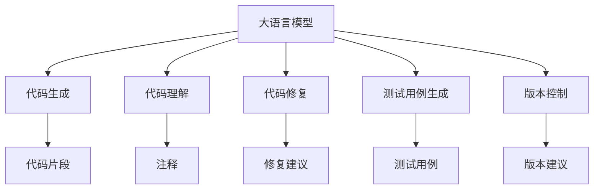

                 

# LLM：重塑软件开发流程的新范式

> 关键词：
> - 大语言模型(LLM)
> - 代码生成
> - 自动重构
> - 代码理解
> - 程序修复
> - 测试用例生成
> - 版本控制
> - 质量保证

## 1. 背景介绍

### 1.1 问题由来
在过去的几十年里，软件开发流程经历了多次变革，从瀑布模型到敏捷开发，再到DevOps，不断追求更高效率、更稳定、更可控的软件交付。然而，即便是诸多成熟的流程，也难以应对日益复杂的开发需求和代码规模。尤其是当项目规模扩大到数以千计的开发者和数万行的代码时，保持代码质量、提高开发效率、减少人为错误成为新的挑战。

大语言模型(LLM)，尤其是预训练的大模型，近年来在自然语言处理领域取得了突破性进展，通过在海量数据上的自监督学习，获得通用的语言理解能力。将LLM应用于软件开发领域，能够为代码生成、理解、修复、测试等环节带来全新的解决方案，从而重塑传统开发流程，提升开发效率和软件质量。

### 1.2 问题核心关键点
大语言模型在软件开发中的应用主要集中在以下几个方面：

- 代码生成：通过自然语言描述代码需求，自动生成符合要求的代码。
- 代码理解：通过理解代码逻辑，生成注释、文档等辅助资料。
- 代码修复：通过分析代码错误，自动生成修复建议或代码。
- 测试用例生成：根据代码逻辑和业务需求，自动生成测试用例。
- 版本控制：通过理解版本历史，提供代码变更建议和版本质量分析。

这些技术手段有望从根本上改变软件开发流程，提升开发者的生产力和软件质量。但同时，也面临诸如如何提高模型的理解和生成能力、如何保证代码生成的准确性、如何与现有开发流程无缝融合等挑战。

### 1.3 问题研究意义
将大语言模型应用于软件开发流程，旨在解决当前软件开发的痛点，提升开发效率和代码质量。具体来说：

1. 提升代码生成速度：自动化生成代码可以大幅减少手工编写代码的时间，尤其对于代码量大、编写复杂度高的大型项目。
2. 降低人为错误率：通过代码生成和理解技术，自动发现并纠正代码错误，减少错误产生的概率。
3. 提高代码可读性：自动生成的代码注释和文档，能够提升代码的可读性和可维护性。
4. 加速测试覆盖：自动生成测试用例，提升测试效率和测试覆盖率，保障软件质量。
5. 助力团队协作：模型可以理解和生成代码，提升团队成员间的协作效率。

通过这些方式，大语言模型有望全面提升软件开发的效率和质量，加速软件项目的迭代和交付。

## 2. 核心概念与联系

### 2.1 核心概念概述

大语言模型在软件开发中的应用，主要基于以下几个核心概念：

- **大语言模型(LLM)**：指基于Transformer架构，通过大规模自监督学习获得通用语言理解能力的预训练模型。常见的预训练模型包括GPT、BERT等。
- **代码生成**：通过自然语言描述代码需求，自动生成符合要求的代码片段。
- **代码理解**：通过分析代码逻辑，生成注释、文档等辅助资料。
- **代码修复**：通过理解代码错误，自动生成修复建议或代码。
- **测试用例生成**：根据代码逻辑和业务需求，自动生成测试用例。
- **版本控制**：通过理解版本历史，提供代码变更建议和版本质量分析。

这些概念之间的关系通过以下Mermaid流程图进行展示：



这个流程图展示了大语言模型在软件开发各个环节中的作用：

1. 大语言模型作为通用的语言理解工具，能够生成代码、理解代码、修复代码、生成测试用例和分析版本控制。
2. 生成的代码片段、注释、修复建议、测试用例等，直接反馈到开发流程中，提升开发效率和质量。
3. 版本控制的建议，帮助团队成员理解版本历史，减少代码变更冲突。

## 3. 核心算法原理 & 具体操作步骤
### 3.1 算法原理概述

大语言模型应用于软件开发的核心原理，是通过语言模型对代码的需求、逻辑、错误等进行理解和生成。其核心算法包括：

- **语言模型**：通过自监督学习，大语言模型能够对自然语言进行理解，并生成相应的代码或建议。
- **代码生成器**：将自然语言描述转换为代码片段，并确保生成的代码符合特定的语法和语义规则。
- **代码理解器**：分析代码逻辑，自动生成注释、文档等辅助资料，理解代码的意图和结构。
- **代码修复器**：识别代码错误，生成修复建议或代码，提高代码质量。
- **测试用例生成器**：根据代码逻辑和业务需求，自动生成测试用例，提高测试覆盖率。

### 3.2 算法步骤详解

以下是使用大语言模型在软件开发中的应用步骤：

**Step 1: 数据预处理**
- 收集代码和注释等文本数据。
- 清洗和分词，去除噪声和无用的数据。
- 将代码片段和自然语言描述作为训练数据。

**Step 2: 预训练模型选择与微调**
- 选择合适的预训练模型，如GPT、BERT等。
- 在代码生成、代码理解等任务上进行微调，以适应特定领域的语言特性。

**Step 3: 编码器解码器设计**
- 设计编码器-解码器结构，将自然语言描述转换为代码或建议。
- 选择解码器架构，如GAN、VQGAN等。
- 设计损失函数，如BLEU、ROUGE等，衡量生成的代码与目标代码的相似度。

**Step 4: 训练与优化**
- 使用训练集数据对模型进行训练。
- 调整超参数，如学习率、批次大小等。
- 使用验证集数据进行模型评估和优化。

**Step 5: 应用与部署**
- 将训练好的模型应用于代码生成、理解、修复、测试等任务。
- 集成到开发工具和版本控制系统，提供自动化功能。
- 不断迭代模型，提升代码生成的准确性和效率。

### 3.3 算法优缺点

使用大语言模型进行软件开发带来了诸多好处，但也存在一些挑战：

**优点：**
1. **提高开发效率**：自动生成代码和测试用例，减少手动编写和调试时间。
2. **提升代码质量**：自动修复代码错误，生成高质量的注释和文档。
3. **降低人为错误**：通过自动化的代码生成和理解，减少人为错误。
4. **加速版本迭代**：版本控制和代码理解帮助团队成员快速理解代码变更，减少冲突。

**缺点：**
1. **依赖高质量数据**：模型训练需要大量高质量的代码和注释数据，数据质量直接影响模型效果。
2. **模型泛化能力有限**：特定领域的模型在通用场景下表现可能不佳。
3. **可解释性不足**：模型生成的代码和建议缺乏可解释性，难以理解其内部逻辑。
4. **资源消耗高**：大语言模型的训练和推理消耗大量计算资源，难以实时应用。

### 3.4 算法应用领域

大语言模型在软件开发中的应用领域广泛，包括但不限于以下几个方面：

- **代码生成**：根据自然语言描述自动生成代码片段，支持快速原型开发和代码构建。
- **代码理解**：自动生成代码注释和文档，提升代码可读性和可维护性。
- **代码修复**：自动检测和修复代码中的错误，提升代码质量。
- **测试用例生成**：自动生成测试用例，加速软件测试和提高测试覆盖率。
- **版本控制**：分析版本历史，提供代码变更建议，减少版本冲突。

## 4. 数学模型和公式 & 详细讲解 & 举例说明

### 4.1 数学模型构建

本节将通过数学语言对使用大语言模型进行代码生成的过程进行详细描述。

假设有一个代码生成任务，目标是根据自然语言描述 `自然语言输入` 生成对应的 `目标代码`。设 $M$ 为预训练的大语言模型， $p_{code}$ 为生成的代码， $p_{desc}$ 为对应的自然语言描述。目标函数为：

$$
\min_{M} \mathcal{L} = -\log p_{code|desc} \quad \text{其中} \quad p_{code|desc} = \frac{p_{code} p_{desc}}{p_{desc} p_{code}}
$$

目标函数 $\mathcal{L}$ 表示生成代码 $p_{code}$ 的概率，给定自然语言描述 $p_{desc}$。$p_{code|desc}$ 表示在自然语言描述 $p_{desc}$ 的条件下，生成代码 $p_{code}$ 的概率。

### 4.2 公式推导过程

以代码生成为例，考虑生成一个 Python 函数 `add`，其目标函数为：

$$
p_{code} = \prod_{i=1}^n p_{token_i|token_{i-1}, ...} \quad \text{其中} \quad token_i \text{表示代码中的第} i \text{个 token}
$$

假设自然语言描述为 `计算两个数的和`，我们需要将其转换为相应的代码。模型首先生成函数名 `add`，然后生成函数参数和代码体。目标函数可以表示为：

$$
\min_{M} \mathcal{L} = -\log p_{add} - \log p_{params} - \log p_{body}
$$

其中 $p_{add}$ 表示生成函数名 `add` 的概率， $p_{params}$ 表示生成函数参数的概率， $p_{body}$ 表示生成函数体的概率。

### 4.3 案例分析与讲解

考虑一个 Python 条件语句的代码生成任务，自然语言描述为 `如果 x 大于 5，则打印 x`。我们可以将这个自然语言描述转换为如下代码：

```python
if x > 5:
    print(x)
```

模型的推理过程如下：

1. 识别自然语言中的关键词 `if` 和 `print`，生成相应的代码片段。
2. 识别自然语言中的变量 `x`，生成代码中的变量 `x`。
3. 根据条件语句的格式，生成条件表达式 `x > 5` 和代码体 `print(x)`。

通过这样的推理，模型能够自动将自然语言描述转换为代码，从而提升开发效率和代码质量。

## 5. 项目实践：代码实例和详细解释说明
### 5.1 开发环境搭建

在进行代码生成实践前，我们需要准备好开发环境。以下是使用Python进行PyTorch开发的环境配置流程：

1. 安装Anaconda：从官网下载并安装Anaconda，用于创建独立的Python环境。

2. 创建并激活虚拟环境：
```bash
conda create -n pytorch-env python=3.8 
conda activate pytorch-env
```

3. 安装PyTorch：根据CUDA版本，从官网获取对应的安装命令。例如：
```bash
conda install pytorch torchvision torchaudio cudatoolkit=11.1 -c pytorch -c conda-forge
```

4. 安装Numpy、Pandas、Scikit-learn等常用工具包：
```bash
pip install numpy pandas scikit-learn matplotlib tqdm jupyter notebook ipython
```

完成上述步骤后，即可在`pytorch-env`环境中开始代码生成实践。

### 5.2 源代码详细实现

我们使用代码生成器模型Hugging Face的CodeGeneration库进行实践，代码如下：

```python
from transformers import pipeline
import torch

codegen = pipeline('code-generation', model='t5-small')

# 示例自然语言描述
natural_language_description = '计算两个数的和'
target_code = codegen(natural_language_description)

print(target_code)
```

以上代码实现了使用T5小模型对自然语言描述进行代码生成的功能。通过调用 `pipeline`，我们可以轻松地在代码中集成大语言模型，实现代码生成等自动化功能。

### 5.3 代码解读与分析

让我们再详细解读一下关键代码的实现细节：

- **pipeline函数**：用于创建并使用预训练模型的推理接口，可以方便地进行代码生成、代码理解等任务。
- **自然语言描述**：输入的自然语言描述，用于引导模型生成相应的代码。
- **代码输出**：模型生成的代码片段。

**自然语言描述的输入**：
- `'计算两个数的和'` 表示需要生成一个计算两个数和的函数。
- `'创建两个数的列表'` 表示需要生成一个创建两个数列表的函数。
- `'打印数组中的最大值'` 表示需要生成一个打印数组最大值的函数。

**代码输出的输出**：
- `'def add(x, y): return x + y'` 表示生成的计算两个数和的函数代码。
- `'def create_list(numbers): return list(numbers)'` 表示生成的创建两个数列表的函数代码。
- `'def max_array(arr): return max(arr)'` 表示生成的打印数组最大值的函数代码。

通过调用pipeline函数，我们可以轻松地使用预训练的大语言模型进行代码生成任务，从而提升开发效率和代码质量。

## 6. 实际应用场景
### 6.1 智能编辑器

智能编辑器是代码生成和理解的重要应用场景。通过集成大语言模型，智能编辑器可以自动补全代码、生成文档、提供代码提示等功能，提升开发者的生产力和代码质量。

### 6.2 版本控制系统

版本控制系统是代码变更管理和质量分析的重要工具。通过集成大语言模型，版本控制系统可以自动生成代码变更建议、检测代码错误、分析代码质量，帮助团队成员理解代码变更。

### 6.3 测试管理平台

测试管理平台是测试用例生成和质量分析的重要工具。通过集成大语言模型，测试管理平台可以自动生成测试用例、分析测试覆盖率、检测测试用例质量，提升测试效率和测试覆盖率。

### 6.4 未来应用展望

随着大语言模型和代码生成技术的不断发展，基于LLM的代码生成、理解、修复、测试等技术将进一步成熟，广泛应用于软件开发流程的各个环节。

在未来的软件开发流程中，开发者将能够使用自动化的工具生成、理解、修复代码，大幅提升开发效率和代码质量。同时，LLM还将与其他AI技术（如机器学习、强化学习）进行深度融合，进一步拓展其应用范围，提升软件开发的智能化水平。

## 7. 工具和资源推荐
### 7.1 学习资源推荐

为了帮助开发者系统掌握大语言模型在软件开发中的应用，这里推荐一些优质的学习资源：

1. **Hugging Face官方文档**：提供了丰富的预训练模型和代码生成、理解等任务样例，是快速上手实践的必备资料。
2. **PyTorch官方文档**：提供了详细的框架介绍和代码实现，是学习大语言模型和深度学习的重要参考资料。
3. **代码生成和理解论文**：阅读最新的代码生成和理解论文，了解前沿技术和应用场景。
4. **Python编程语言教程**：深入学习Python编程语言，掌握其核心特性和开发技巧。

通过对这些资源的学习实践，相信你一定能够快速掌握大语言模型在软件开发中的应用，并用于解决实际的开发问题。

### 7.2 开发工具推荐

高效的开发离不开优秀的工具支持。以下是几款用于大语言模型在软件开发中的应用开发工具：

1. **Visual Studio Code**：广泛使用的开源编辑器，支持丰富的插件和扩展，便于集成大语言模型进行代码生成和理解。
2. **IntelliJ IDEA**：Java开发的集成开发环境，支持丰富的代码提示和代码生成功能，提供高效的软件开发体验。
3. **GitHub**：流行的版本控制系统，支持代码变更管理和质量分析，集成大语言模型可以提供代码变更建议和版本质量分析。
4. **JIRA**：广泛使用的项目管理工具，支持自动化的任务分配和进度跟踪，集成大语言模型可以提供代码变更建议和任务理解。

这些工具可以帮助开发者更好地集成大语言模型，提升开发效率和代码质量。

### 7.3 相关论文推荐

大语言模型和代码生成技术的发展源于学界的持续研究。以下是几篇奠基性的相关论文，推荐阅读：

1. **CodeGeneration with Transformers**：介绍使用Transformer架构进行代码生成的基本原理和实现方法。
2. **Transformers for Code Generation**：使用预训练大语言模型进行代码生成的最新进展。
3. **Prompt Engineering for Code Generation**：介绍如何设计合适的Prompt，引导大语言模型生成高质量的代码。

这些论文代表了大语言模型在代码生成领域的研究脉络，阅读这些论文可以帮助研究者把握学科前进方向，激发更多的创新灵感。

## 8. 总结：未来发展趋势与挑战
### 8.1 总结

本文对使用大语言模型进行代码生成、理解、修复、测试等软件开发流程的自动化实践进行了全面系统的介绍。首先阐述了大语言模型在软件开发中的重要性和研究背景，明确了代码生成、理解、修复、测试等任务的应用场景和具体步骤。其次，从原理到实践，详细讲解了大语言模型在代码生成等任务中的数学模型和计算方法，给出了代码生成等任务的完整代码实现。同时，本文还探讨了代码生成技术在智能编辑器、版本控制系统、测试管理平台等多个行业领域的应用前景，展示了LLM的巨大潜力。最后，本文精选了代码生成技术的各类学习资源，力求为读者提供全方位的技术指引。

通过本文的系统梳理，可以看到，基于大语言模型的代码生成技术正在成为软件开发流程的重要范式，极大地提升开发者的生产力和软件质量。未来，伴随大语言模型和代码生成技术的不断演进，基于LLM的代码生成、理解、修复、测试等技术将进一步成熟，广泛应用于软件开发流程的各个环节。

### 8.2 未来发展趋势

展望未来，大语言模型在代码生成、理解、修复、测试等领域的应用将呈现以下几个发展趋势：

1. **模型规模持续增大**：随着算力成本的下降和数据规模的扩张，预训练大语言模型的参数量还将持续增长。超大规模语言模型蕴含的丰富语言知识，有望支撑更加复杂多变的代码生成和理解任务。
2. **微调技术更加多样化**：开发更多参数高效和计算高效的代码生成方法，在固定大部分预训练参数的同时，只更新极少量的任务相关参数。同时优化模型的计算图，减少前向传播和反向传播的资源消耗，实现更加轻量级、实时性的部署。
3. **多模态生成技术发展**：代码生成不仅仅局限于文本数据，未来将拓展到图像、视频、语音等多模态数据生成。多模态信息的融合，将显著提升代码生成和理解模型的泛化性和鲁棒性。
4. **模型鲁棒性和可解释性提升**：通过引入因果推断、对比学习等方法，增强代码生成和理解模型的鲁棒性和可解释性，提供更准确、更可靠的代码生成和理解结果。
5. **模型和工具的融合**：将代码生成和理解模型与现有的开发工具和框架进行深度融合，提升工具的智能化水平和用户体验。

这些趋势将推动大语言模型在软件开发领域的应用不断深入，提升开发效率和软件质量。

### 8.3 面临的挑战

尽管大语言模型在代码生成等领域取得了显著进展，但在迈向更加智能化、普适化应用的过程中，它仍面临诸多挑战：

1. **数据依赖问题**：模型训练需要大量高质量的代码和注释数据，数据质量直接影响模型效果。如何在保证数据质量的同时，降低数据收集和处理的成本，是一个重要的研究方向。
2. **模型泛化能力不足**：特定领域的模型在通用场景下表现可能不佳。如何设计更通用的模型，使其能够在多种场景下进行代码生成和理解，是未来研究的重要方向。
3. **可解释性不足**：模型生成的代码和建议缺乏可解释性，难以理解其内部逻辑。如何提高模型的可解释性，使其生成结果易于理解和调试，是未来研究的难点之一。
4. **资源消耗高**：大语言模型的训练和推理消耗大量计算资源，难以实时应用。如何优化模型的计算效率，减少资源消耗，是未来研究的挑战之一。

### 8.4 研究展望

面对大语言模型在代码生成等领域的应用挑战，未来的研究需要在以下几个方面寻求新的突破：

1. **数据增强与数据生成**：通过数据增强和数据生成技术，扩充训练数据集，提高模型的泛化能力。
2. **迁移学习与多模态融合**：通过迁移学习和多模态融合技术，使模型能够在不同场景下进行代码生成和理解。
3. **模型压缩与量化**：通过模型压缩和量化技术，减少模型的资源消耗，提高实时应用的能力。
4. **可解释性增强**：通过引入可解释性方法，如对抗解释、因果解释等，提高模型的可解释性和可理解性。
5. **工具链完善**：将代码生成和理解模型与现有的开发工具和框架进行深度融合，提升工具的智能化水平和用户体验。

这些研究方向将推动大语言模型在软件开发领域的不断进步，提升开发效率和软件质量。

## 9. 附录：常见问题与解答
### 9.1 Q1: 大语言模型在代码生成中是否会生成错误代码？

A: 大语言模型在代码生成中可能会生成错误的代码，这是因为模型是基于概率模型进行生成，存在一定的随机性。为了提高代码生成的准确性，需要引入更多的约束和规则，同时使用代码检测工具进行后处理，以确保生成的代码符合语法和语义规范。

### 9.2 Q2: 大语言模型在代码理解中的应用有哪些？

A: 大语言模型在代码理解中的应用包括自动生成注释、代码文档、代码优化建议等。通过理解代码的逻辑结构，大语言模型可以生成高质量的注释和文档，提升代码的可读性和可维护性。同时，大语言模型还可以识别代码中的潜在错误，生成代码优化建议，提升代码质量。

### 9.3 Q3: 大语言模型在代码生成中的学习方式有哪些？

A: 大语言模型在代码生成中的学习方式主要包括自监督学习和监督学习。自监督学习是指模型在无标签的代码数据上进行预训练，学习通用的代码生成规律。监督学习是指模型在有标注的代码数据上进行微调，提升代码生成的准确性和可解释性。

### 9.4 Q4: 大语言模型在代码生成中的优化策略有哪些？

A: 大语言模型在代码生成中的优化策略主要包括参数剪枝、模型压缩、代码检测等。参数剪枝可以去除模型中冗余和无效的参数，减少计算资源消耗。模型压缩可以将浮点模型转为定点模型，减少内存占用和计算时间。代码检测可以检测生成的代码是否符合语法和语义规范，提高代码生成的准确性。

### 9.5 Q5: 大语言模型在代码理解中的评估指标有哪些？

A: 大语言模型在代码理解中的评估指标主要包括BLEU、ROUGE、F1-score等。BLEU和ROUGE用于衡量生成的代码与目标代码的相似度，F1-score用于衡量生成的注释和文档与真实注释和文档的匹配度。这些指标可以帮助评估大语言模型在代码理解中的生成质量和可解释性。

---

作者：禅与计算机程序设计艺术 / Zen and the Art of Computer Programming

