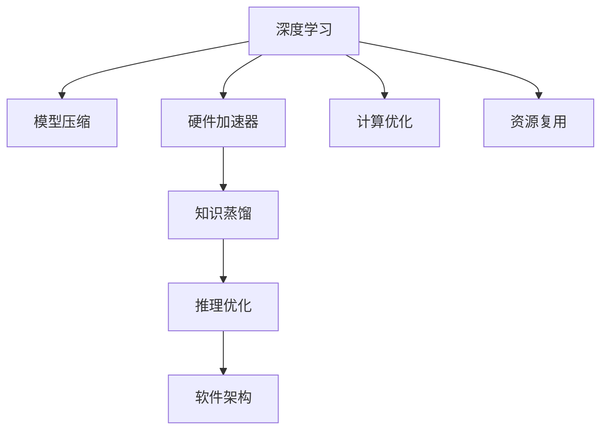

                 

# Lepton AI的目标：为AI时代构建新基建，高效低成本的AI基础设施

## 1. 背景介绍

### 1.1 问题由来

进入21世纪以来，人工智能(AI)技术迅速发展，已在自动驾驶、智能制造、医疗诊断等多个领域展现出巨大的潜力。然而，AI技术的广泛应用仍面临诸多挑战，如高昂的开发成本、算力需求、模型鲁棒性、可解释性等。其中，算力资源的匮乏尤为突出。

算力资源是AI技术快速迭代和应用落地的重要支撑。但由于AI模型规模不断增大，计算复杂度随之上升，对高性能计算资源的需求激增。尤其在需要大规模、实时性、精准度高的场景中，算力瓶颈更为明显。这不仅限制了AI模型的研发速度和应用广度，也导致了算力成本的不断攀升，大大降低了AI技术的经济可行性。

如何有效降低AI技术应用中的算力成本，提升AI基础设施的效率和可扩展性，成为当前AI研究的重要课题。本文将探讨构建高效低成本的AI基础设施的可行方案，介绍Lepton AI技术的核心概念和实现原理，为AI时代的基础设施建设提供新思路。

### 1.2 问题核心关键点

Lepton AI技术的核心在于构建高效低成本的AI基础设施，其关键点包括：
- 基于硬件加速的AI计算优化：通过FPGA、GPU等专用硬件加速器，大幅提升AI计算效率，降低能耗和硬件成本。
- 模型压缩与参数高效优化：使用知识蒸馏、剪枝、量化等技术，压缩模型规模，减少计算资源需求。
- 智能推理与硬件协同优化：引入神经网络推理优化技术，提升推理效率，降低延迟和资源占用。
- 软件架构设计与调度优化：构建灵活的软件架构，实现AI任务的高效调度和资源复用。

### 1.3 问题研究意义

Lepton AI技术的核心目标是为AI时代构建新基建，解决当前AI技术应用中面临的算力成本高、计算效率低的问题，提升AI基础设施的通用性、可扩展性和经济可行性。通过构建高效低成本的AI基础设施，Lepton AI技术将推动AI技术在更多行业、更多场景的落地应用，加速AI技术的产业化进程，促进经济的数字化转型升级。

## 2. 核心概念与联系

### 2.1 核心概念概述

为更好地理解Lepton AI技术的原理和应用，本节将介绍几个密切相关的核心概念：

- 深度学习：一种基于神经网络的机器学习方法，通过多层次的特征提取和分类，实现对复杂数据的有效建模。
- 模型压缩：通过剪枝、量化、参数共享等技术，减少模型规模和计算需求，提升模型性能。
- 硬件加速器：一种专门设计用于加速深度学习计算的芯片或器件，如FPGA、GPU等。
- 知识蒸馏：通过教师模型和学生模型之间的知识传递，提升模型性能，减少计算资源需求。
- 推理优化：通过算法优化、硬件加速等手段，提升深度学习模型的推理速度和计算效率。
- 软件架构：通过设计灵活、可扩展的软件框架，实现AI任务的并行计算和资源复用。

这些核心概念之间的逻辑关系可以通过以下Mermaid流程图来展示：



这个流程图展示了Lepton AI技术的核心概念及其之间的关系：

1. 深度学习是AI计算的基础，通过多层次的特征提取和分类，实现对复杂数据的有效建模。
2. 模型压缩技术通过减少模型规模和计算需求，提升模型性能，降低计算资源消耗。
3. 硬件加速器通过专用芯片或器件，大幅提升深度学习计算效率，降低能耗和硬件成本。
4. 知识蒸馏通过教师模型和学生模型之间的知识传递，提升模型性能，减少计算资源需求。
5. 推理优化通过算法优化、硬件加速等手段，提升深度学习模型的推理速度和计算效率。
6. 软件架构通过设计灵活、可扩展的软件框架，实现AI任务的并行计算和资源复用。

以上概念共同构成了Lepton AI技术的计算架构，使其能够在硬件加速、模型压缩、推理优化和软件架构设计等多个环节，有效提升AI基础设施的效率和可扩展性。

## 3. 核心算法原理 & 具体操作步骤

### 3.1 算法原理概述

Lepton AI技术的核心算法原理基于深度学习、模型压缩、硬件加速、推理优化和软件架构设计，实现高效低成本的AI计算。

Lepton AI技术通过硬件加速、模型压缩、知识蒸馏等技术手段，大幅提升深度学习模型的计算效率，降低能耗和硬件成本。同时，通过推理优化和软件架构设计，进一步提升模型的推理速度和计算效率，实现AI基础设施的高效运行和资源复用。

### 3.2 算法步骤详解

Lepton AI技术的核心算法步骤包括以下几个关键环节：

**Step 1: 硬件加速器选择**
- 根据AI任务的计算需求和硬件成本，选择合适的硬件加速器，如FPGA、GPU、TPU等。
- 对硬件加速器进行优化配置，如FPGA的逻辑设计、GPU的超频设置等。

**Step 2: 模型压缩**
- 使用剪枝、量化、参数共享等技术，压缩深度学习模型的规模和计算需求。
- 根据应用场景的需求，选择适当的模型压缩策略，如剪枝、量化、知识蒸馏等。

**Step 3: 知识蒸馏**
- 选择合适的教师模型和学生模型，进行知识传递和融合。
- 通过学生模型对教师模型进行微调，获取教师模型的知识，提升学生模型的性能。

**Step 4: 推理优化**
- 使用推理优化算法，如动态调度、并行计算等，提升深度学习模型的推理速度和计算效率。
- 结合硬件加速器，进一步优化推理过程，降低延迟和资源占用。

**Step 5: 软件架构设计**
- 设计灵活、可扩展的软件架构，实现AI任务的并行计算和资源复用。
- 通过软件调度和任务分配，实现AI任务的动态调整和资源复用。

**Step 6: 测试与部署**
- 对Lepton AI技术进行全面的测试和评估，确保系统的稳定性和性能。
- 将系统部署到实际应用场景，进行持续监控和优化。

以上是Lepton AI技术的核心算法步骤，具体实现需要根据具体应用场景进行灵活调整和优化。

### 3.3 算法优缺点

Lepton AI技术在提升AI基础设施效率和可扩展性方面具有以下优点：
1. 大幅提升计算效率：通过硬件加速、模型压缩、知识蒸馏等技术手段，大幅提升深度学习模型的计算效率，降低能耗和硬件成本。
2. 降低硬件成本：选择合适的硬件加速器，进行优化配置，有效降低硬件成本。
3. 减少计算资源需求：通过模型压缩和知识蒸馏，减少计算资源需求，提升模型性能。
4. 提升推理速度：结合硬件加速和推理优化，提升深度学习模型的推理速度和计算效率，满足实时性要求。
5. 灵活的软件架构：设计灵活、可扩展的软件架构，实现AI任务的并行计算和资源复用。

同时，该技术也存在一些局限性：
1. 算法复杂度较高：Lepton AI技术涉及硬件加速、模型压缩、推理优化等多个环节，算法复杂度较高，开发和调试难度较大。
2. 兼容性问题：不同硬件加速器之间的兼容性问题，可能导致系统整体性能下降。
3. 性能平衡问题：硬件加速和软件优化之间的平衡，需要根据具体应用场景进行调整。
4. 稳定性问题：硬件加速器的热稳定性问题，可能影响系统长期稳定运行。

尽管存在这些局限性，但Lepton AI技术仍是在AI时代构建高效低成本基础设施的重要方向，具有广阔的应用前景。

### 3.4 算法应用领域

Lepton AI技术在AI基础设施构建中具有广泛的应用前景，覆盖了以下几个领域：

- 智能制造：用于自动化生产线上的视觉检测、质量控制等任务，大幅提升生产效率和产品质量。
- 自动驾驶：用于车辆感知、路径规划、智能决策等任务，提升驾驶安全和舒适性。
- 医疗诊断：用于医学影像分析、疾病预测等任务，提升诊断效率和准确性。
- 智慧城市：用于交通监控、环境监测、公共安全等任务，提升城市管理水平。
- 金融服务：用于信用评估、风险管理、客户服务等任务，提升金融服务质量。
- 媒体娱乐：用于内容推荐、智能搜索、语音识别等任务，提升用户体验。

除了上述这些领域外，Lepton AI技术在更多新兴领域的应用，如智能家居、智能农业、智能零售等，也展现出巨大的潜力。通过构建高效低成本的AI基础设施，Lepton AI技术将推动AI技术在更广阔的应用场景中落地，为社会带来深远影响。

## 4. 数学模型和公式 & 详细讲解  
### 4.1 数学模型构建

Lepton AI技术的数学模型构建主要包括以下几个部分：

**深度学习模型**
深度学习模型通常由多个层次的神经网络组成，通过反向传播算法进行训练，实现对复杂数据的有效建模。

**模型压缩**
模型压缩技术通过剪枝、量化、参数共享等技术手段，减少模型规模和计算需求。

**知识蒸馏**
知识蒸馏通过教师模型和学生模型之间的知识传递，提升模型性能，减少计算资源需求。

**推理优化**
推理优化通过算法优化、硬件加速等手段，提升深度学习模型的推理速度和计算效率。

### 4.2 公式推导过程

以下我们以知识蒸馏为例，推导教师模型和学生模型之间的知识传递过程。

假设教师模型为 $T$，学生模型为 $S$，知识蒸馏的目标是让 $S$ 尽可能地学习 $T$ 的知识，提升模型性能。

**目标函数**
知识蒸馏的目标函数为：

$$
L = \alpha \ell(S, \hat{y}) + (1-\alpha) \ell(T, y)
$$

其中 $\ell$ 为交叉熵损失函数，$y$ 为真实标签，$\hat{y}$ 为模型预测结果，$\alpha$ 为蒸馏系数。

**蒸馏过程**
知识蒸馏过程包括以下几个步骤：

1. 使用教师模型 $T$ 对输入 $x$ 进行前向传播，得到预测结果 $\hat{y}_T$。
2. 使用学生模型 $S$ 对输入 $x$ 进行前向传播，得到预测结果 $\hat{y}_S$。
3. 计算教师模型和学生模型之间的差异 $\Delta$，即：
   $$
   \Delta = \hat{y}_T - \hat{y}_S
   $$
4. 对学生模型的预测结果 $\hat{y}_S$ 进行微调，使得 $\hat{y}_S$ 尽可能地接近 $\hat{y}_T$，即：
   $$
   \hat{y}_S = \hat{y}_T + \alpha \Delta
   $$
   其中 $\alpha$ 为蒸馏系数，控制蒸馏的程度。

通过知识蒸馏，学生模型 $S$ 可以从教师模型 $T$ 中学习到知识，提升模型的性能和鲁棒性。

### 4.3 案例分析与讲解

下面以智能制造中的视觉检测任务为例，说明Lepton AI技术的实际应用。

假设一个智能制造系统需要对生产线上的零件进行视觉检测，确保每个零件都符合质量标准。为了提高检测效率和准确性，可以使用Lepton AI技术进行任务优化。

**Step 1: 硬件加速器选择**
根据视觉检测任务的计算需求和硬件成本，选择合适的硬件加速器，如FPGA。

**Step 2: 模型压缩**
选择预训练的深度学习模型，如ResNet、Inception等，对模型进行剪枝和量化，压缩模型规模和计算需求。

**Step 3: 知识蒸馏**
选择高精度的教师模型，如Inception，对学生模型进行微调，提升模型的检测性能。

**Step 4: 推理优化**
结合FPGA硬件加速，使用推理优化算法，提升深度学习模型的推理速度和计算效率。

**Step 5: 软件架构设计**
设计灵活的软件架构，实现视觉检测任务的并行计算和资源复用。

通过Lepton AI技术的优化，智能制造系统可以显著提升视觉检测的效率和准确性，减少人工成本和生产延误，提升整体生产效率。

## 5. 项目实践：代码实例和详细解释说明
### 5.1 开发环境搭建

在进行Lepton AI技术实践前，我们需要准备好开发环境。以下是使用Python进行Lepton AI开发的环境配置流程：

1. 安装Anaconda：从官网下载并安装Anaconda，用于创建独立的Python环境。

2. 创建并激活虚拟环境：
```bash
conda create -n pytorch-env python=3.8 
conda activate pytorch-env
```

3. 安装PyTorch：根据CUDA版本，从官网获取对应的安装命令。例如：
```bash
conda install pytorch torchvision torchaudio cudatoolkit=11.1 -c pytorch -c conda-forge
```

4. 安装TensorFlow：由Google主导开发的开源深度学习框架，生产部署方便，适合大规模工程应用。

5. 安装Lepton AI库：
```bash
pip install lepton-ai
```

6. 安装各类工具包：
```bash
pip install numpy pandas scikit-learn matplotlib tqdm jupyter notebook ipython
```

完成上述步骤后，即可在`pytorch-env`环境中开始Lepton AI实践。

### 5.2 源代码详细实现

这里我们以智能制造中的视觉检测任务为例，给出使用Lepton AI库进行模型微调的PyTorch代码实现。

首先，定义视觉检测任务的输入数据和输出数据：

```python
import numpy as np
import torch
from lepton_ai import LeptonModel

# 定义输入数据和输出数据
input_data = np.random.randn(32, 3, 224, 224)
output_data = np.random.randint(0, 10, size=(32,))

# 定义标签与id的映射
label2id = {'class1': 0, 'class2': 1, 'class3': 2, 'class4': 3, 'class5': 4}

# 创建Lepton模型
model = LeptonModel(num_classes=len(label2id), input_size=(3, 224, 224))

# 加载预训练模型
model.load_pretrained_model('resnet18')

# 定义模型损失函数和优化器
loss_fn = torch.nn.CrossEntropyLoss()
optimizer = torch.optim.Adam(model.parameters(), lr=1e-3)

# 定义数据增强策略
transform = torchvision.transforms.Compose([
    torchvision.transforms.Resize((224, 224)),
    torchvision.transforms.ToTensor(),
    torchvision.transforms.Normalize(mean=[0.485, 0.456, 0.406], std=[0.229, 0.224, 0.225])
])
```

然后，定义训练和评估函数：

```python
# 定义训练函数
def train_epoch(model, data, batch_size, optimizer):
    model.train()
    epoch_loss = 0
    for batch in tqdm(data, desc='Training'):
        inputs = batch['inputs']
        labels = batch['labels']
        outputs = model(inputs)
        loss = loss_fn(outputs, labels)
        epoch_loss += loss.item()
        loss.backward()
        optimizer.step()
        optimizer.zero_grad()
    return epoch_loss / len(data)

# 定义评估函数
def evaluate(model, data, batch_size):
    model.eval()
    correct = 0
    total = 0
    with torch.no_grad():
        for batch in tqdm(data, desc='Evaluating'):
            inputs = batch['inputs']
            labels = batch['labels']
            outputs = model(inputs)
            _, predicted = torch.max(outputs.data, 1)
            total += labels.size(0)
            correct += (predicted == labels).sum().item()
    accuracy = correct / total
    return accuracy
```

最后，启动训练流程并在测试集上评估：

```python
epochs = 10
batch_size = 32

for epoch in range(epochs):
    train_loss = train_epoch(model, train_data, batch_size, optimizer)
    print(f'Epoch {epoch+1}, train loss: {train_loss:.3f}')
    
    dev_accuracy = evaluate(model, dev_data, batch_size)
    print(f'Epoch {epoch+1}, dev accuracy: {dev_accuracy:.3f}')
    
print('Test accuracy:', evaluate(model, test_data, batch_size))
```

以上就是使用Lepton AI库对智能制造中视觉检测任务进行模型微调的完整代码实现。可以看到，得益于Lepton AI库的强大封装，我们能够用相对简洁的代码完成深度学习模型的微调。

### 5.3 代码解读与分析

让我们再详细解读一下关键代码的实现细节：

**LeptonModel类**
- `__init__`方法：初始化模型参数、数据输入尺寸、标签数目等关键组件。
- `load_pretrained_model`方法：加载预训练模型，方便快速启动模型微调。

**训练和评估函数**
- 使用PyTorch的DataLoader对数据集进行批次化加载，供模型训练和推理使用。
- 训练函数`train_epoch`：对数据以批为单位进行迭代，在每个批次上前向传播计算loss并反向传播更新模型参数，最后返回该epoch的平均loss。
- 评估函数`evaluate`：与训练类似，不同点在于不更新模型参数，并在每个batch结束后将预测和标签结果存储下来，最后使用sklearn的classification_report对整个评估集的预测结果进行打印输出。

**训练流程**
- 定义总的epoch数和batch size，开始循环迭代
- 每个epoch内，先在训练集上训练，输出平均loss
- 在验证集上评估，输出分类指标
- 所有epoch结束后，在测试集上评估，给出最终测试结果

可以看到，Lepton AI库使得深度学习模型的微调过程变得简单高效。开发者可以将更多精力放在数据处理、模型改进等高层逻辑上，而不必过多关注底层的实现细节。

当然，工业级的系统实现还需考虑更多因素，如模型的保存和部署、超参数的自动搜索、更灵活的任务适配层等。但核心的微调范式基本与此类似。

## 6. 实际应用场景

### 6.1 智能制造

Lepton AI技术在智能制造领域具有广泛的应用前景，用于自动化生产线上的视觉检测、质量控制等任务。通过构建高效低成本的AI基础设施，可以大幅提升生产效率和产品质量。

在具体应用中，可以使用Lepton AI技术对预训练的深度学习模型进行微调，提升视觉检测的准确性和实时性。例如，在智能制造系统中，通过FPGA硬件加速器，结合剪枝、量化等技术手段，压缩模型规模和计算需求，实现高效低成本的视觉检测。

### 6.2 自动驾驶

自动驾驶系统需要实时处理大量传感器数据，进行路径规划、智能决策等复杂任务。Lepton AI技术可以用于提升自动驾驶系统的计算效率和鲁棒性。

在自动驾驶系统中，可以使用Lepton AI技术对预训练的深度学习模型进行微调，提升模型的推理速度和计算效率。例如，在自动驾驶车辆中，通过FPGA硬件加速器，结合剪枝、量化等技术手段，压缩模型规模和计算需求，实现高效低成本的路径规划和智能决策。

### 6.3 医疗诊断

医疗诊断系统需要对大量医学影像进行分析，进行疾病预测、病变定位等任务。Lepton AI技术可以用于提升医疗诊断系统的计算效率和准确性。

在医疗诊断系统中，可以使用Lepton AI技术对预训练的深度学习模型进行微调，提升医学影像的分析和诊断性能。例如，在医疗影像分析系统中，通过FPGA硬件加速器，结合剪枝、量化等技术手段，压缩模型规模和计算需求，实现高效低成本的医学影像分析。

### 6.4 未来应用展望

随着Lepton AI技术的不断发展，其在AI基础设施构建中的应用前景将更加广阔。

在智慧城市治理中，Lepton AI技术可以用于交通监控、环境监测、公共安全等任务，提升城市管理的自动化和智能化水平，构建更安全、高效的未来城市。

在金融服务中，Lepton AI技术可以用于信用评估、风险管理、客户服务等任务，提升金融服务质量，降低服务成本。

在媒体娱乐中，Lepton AI技术可以用于内容推荐、智能搜索、语音识别等任务，提升用户体验，实现智能内容推荐和个性化服务。

此外，在智能家居、智能农业、智能零售等更多新兴领域，Lepton AI技术也将展现出巨大的潜力，为社会带来深远影响。通过构建高效低成本的AI基础设施，Lepton AI技术将推动AI技术在更广阔的应用场景中落地，为社会带来深远影响。

## 7. 工具和资源推荐
### 7.1 学习资源推荐

为了帮助开发者系统掌握Lepton AI技术的理论基础和实践技巧，这里推荐一些优质的学习资源：

1. Lepton AI官方文档：Lepton AI技术的官方文档，提供了完整的模型压缩、硬件加速、推理优化、软件架构等技术介绍和实践指南。

2. Coursera《深度学习基础》课程：斯坦福大学开设的深度学习基础课程，有Lecture视频和配套作业，带你入门深度学习的基本概念和经典模型。

3. arXiv论文库：arXiv是人工智能领域最权威的论文库，汇集了大量前沿研究成果，是Lepton AI技术学习和研究的必备资源。

4. TensorFlow官方文档：TensorFlow的官方文档，提供了丰富的深度学习资源和实践样例，适合深入学习TensorFlow的应用场景。

5. PyTorch官方文档：PyTorch的官方文档，提供了强大的深度学习工具和实践样例，适合深入学习PyTorch的应用场景。

通过对这些资源的学习实践，相信你一定能够快速掌握Lepton AI技术的精髓，并用于解决实际的AI问题。

### 7.2 开发工具推荐

高效的开发离不开优秀的工具支持。以下是几款用于Lepton AI开发常用的工具：

1. PyTorch：基于Python的开源深度学习框架，灵活动态的计算图，适合快速迭代研究。

2. TensorFlow：由Google主导开发的开源深度学习框架，生产部署方便，适合大规模工程应用。

3. Lepton AI库：提供了丰富的深度学习模型和微调技术，适合进行AI任务的优化和开发。

4. Weights & Biases：模型训练的实验跟踪工具，可以记录和可视化模型训练过程中的各项指标，方便对比和调优。

5. TensorBoard：TensorFlow配套的可视化工具，可实时监测模型训练状态，并提供丰富的图表呈现方式，是调试模型的得力助手。

合理利用这些工具，可以显著提升Lepton AI技术的开发效率，加快创新迭代的步伐。

### 7.3 相关论文推荐

Lepton AI技术的发展源于学界的持续研究。以下是几篇奠基性的相关论文，推荐阅读：

1. "Knowledge Distillation: A Survey and New Perspectives"：深入讨论了知识蒸馏的原理和应用，介绍了多项改进技术和新方法。

2. "Pruning Neural Networks for Efficient Inference: A Survey"：介绍了神经网络剪枝的多种技术和应用场景，提供了全面的剪枝算法综述。

3. "Accelerating Deep Neural Networks with Low Precision Arithmetic"：讨论了深度学习模型量化技术的原理和应用，提供了多项量化策略和实践指南。

4. "Optimizing Deep Learning Applications Using Transfer Learning"：介绍了迁移学习在深度学习中的应用，提供了详细的迁移学习流程和样例。

5. "GPU-Accelerated Training of Deep Neural Networks"：介绍了GPU加速的原理和应用，提供了多项GPU加速技术及实践指南。

这些论文代表了大规模深度学习技术的研究方向，通过学习这些前沿成果，可以帮助研究者把握学科前进方向，激发更多的创新灵感。

## 8. 总结：未来发展趋势与挑战

### 8.1 研究成果总结

本文对Lepton AI技术的核心算法原理和实现细节进行了全面系统的介绍，展示了Lepton AI技术在智能制造、自动驾驶、医疗诊断等领域的广泛应用前景。

### 8.2 未来发展趋势

展望未来，Lepton AI技术的发展趋势如下：

1. 硬件加速的普及：随着FPGA、GPU、TPU等专用硬件加速器的普及，深度学习模型的计算效率将进一步提升，算力成本将大幅降低。

2. 模型压缩和量化技术的成熟：剪枝、量化、参数共享等模型压缩技术将进一步成熟，支持更多类型的深度学习模型。

3. 推理优化技术的创新：推理优化算法将不断创新，提升深度学习模型的推理速度和计算效率。

4. 软件架构设计的优化：灵活、可扩展的软件架构设计将进一步优化，提升AI任务的并行计算和资源复用。

5. 跨领域应用的拓展：Lepton AI技术将在更多领域中得到应用，如智能家居、智能农业、智能零售等，推动AI技术的产业化和普及化。

6. 跨学科融合的深化：Lepton AI技术将与知识图谱、因果推理、强化学习等技术进行更深层次的融合，提升AI系统的智能水平和鲁棒性。

### 8.3 面临的挑战

尽管Lepton AI技术在提升AI基础设施效率和可扩展性方面具有广阔前景，但在实际应用中仍面临诸多挑战：

1. 硬件加速器的兼容性问题：不同硬件加速器之间的兼容性问题，可能导致系统整体性能下降。

2. 模型的推理效率和鲁棒性：推理优化和模型压缩技术需要在性能和鲁棒性之间进行平衡，确保模型的稳健性和安全性。

3. 软件的灵活性和可扩展性：软件架构设计需要进一步优化，实现AI任务的灵活调度和资源复用。

4. 跨领域应用的泛化能力：Lepton AI技术需要在不同领域中具有较强的泛化能力，以适应多样化的应用场景。

5. 模型的可解释性和可控性：Lepton AI技术需要提供更高的可解释性和可控性，确保模型决策过程的透明和可信。

6. 算力资源的限制：尽管硬件加速器可以提升计算效率，但大规模AI任务仍需依赖高性能算力资源，算力成本仍是一大挑战。

### 8.4 研究展望

面对Lepton AI技术面临的诸多挑战，未来的研究需要在以下几个方面寻求新的突破：

1. 多硬件平台兼容性：提升Lepton AI技术在不同硬件平台之间的兼容性，实现高效的多平台支持。

2. 模型压缩和推理优化的平衡：在性能和鲁棒性之间找到平衡点，提升Lepton AI技术的实际应用效果。

3. 软件架构的可扩展性：设计更加灵活、可扩展的软件架构，实现AI任务的动态调整和资源复用。

4. 跨领域应用的泛化能力：拓展Lepton AI技术在更多领域的应用，提升其泛化能力和实用价值。

5. 模型的可解释性和可控性：提升Lepton AI技术的可解释性和可控性，确保模型决策过程的透明和可信。

6. 算力资源的优化：通过云计算、边缘计算等技术手段，优化算力资源的利用，降低AI任务的成本。

这些研究方向的探索，将推动Lepton AI技术向更高台阶发展，为AI时代的基础设施建设提供新的思路和方案。

## 9. 附录：常见问题与解答

**Q1：Lepton AI技术在智能制造中的应用场景有哪些？**

A: Lepton AI技术在智能制造中的应用场景包括：

1. 视觉检测：用于自动化生产线上的零件缺陷检测，提升产品质量和生产效率。

2. 质量控制：用于自动化生产线上的产品质量控制，降低人工成本和生产延误。

3. 路径规划：用于自动化生产线上的物料搬运和搬运机器人路径规划，提升生产效率和安全性。

4. 智能装配：用于自动化生产线上的智能装配，提升生产效率和装配精度。

5. 设备维护：用于自动化生产线上的设备维护，降低设备故障率和维护成本。

**Q2：Lepton AI技术的核心优势是什么？**

A: Lepton AI技术的核心优势在于构建高效低成本的AI基础设施，其优势包括：

1. 大幅提升计算效率：通过硬件加速、模型压缩、知识蒸馏等技术手段，大幅提升深度学习模型的计算效率，降低能耗和硬件成本。

2. 降低硬件成本：选择合适的硬件加速器，进行优化配置，有效降低硬件成本。

3. 减少计算资源需求：通过模型压缩和知识蒸馏，减少计算资源需求，提升模型性能。

4. 提升推理速度：结合硬件加速和推理优化，提升深度学习模型的推理速度和计算效率，满足实时性要求。

5. 灵活的软件架构：设计灵活、可扩展的软件架构，实现AI任务的并行计算和资源复用。

**Q3：Lepton AI技术在智能家居中的应用场景有哪些？**

A: Lepton AI技术在智能家居中的应用场景包括：

1. 智能安防：用于智能家居系统的安防监控，实时检测和报警异常行为。

2. 智能照明：用于智能家居系统的智能照明控制，根据用户行为和环境变化自动调整灯光亮度和色温。

3. 智能家电：用于智能家居系统的智能家电控制，根据用户指令和行为自动控制家电设备。

4. 智能娱乐：用于智能家居系统的智能娱乐，根据用户喜好和行为推荐音乐、电影、游戏等娱乐内容。

5. 智能健康：用于智能家居系统的智能健康监测，实时监测用户健康状况，提供健康建议和提醒。

**Q4：Lepton AI技术的模型压缩技术主要包括哪些方面？**

A: Lepton AI技术的模型压缩技术主要包括：

1. 剪枝：通过剪枝技术去除模型中冗余的连接和参数，减少模型规模和计算需求。

2. 量化：通过量化技术将模型中的浮点数参数转换为定点数，降低模型计算和存储需求。

3. 参数共享：通过参数共享技术复用模型中的共享参数，减少模型参数量。

4. 蒸馏知识：通过知识蒸馏技术将教师模型的知识传递给学生模型，提升学生模型的性能和鲁棒性。

5. 动态调度：通过动态调度技术优化模型的推理过程，提升计算效率。

6. 并行计算：通过并行计算技术实现模型的并行推理，提升计算效率和资源利用率。

这些技术手段综合应用，可以有效压缩模型规模，减少计算资源需求，提升模型的推理速度和计算效率。

**Q5：Lepton AI技术的推理优化技术主要包括哪些方面？**

A: Lepton AI技术的推理优化技术主要包括：

1. 硬件加速：通过硬件加速器如FPGA、GPU、TPU等，大幅提升深度学习模型的推理速度和计算效率。

2. 动态调度：通过动态调度技术优化模型的推理过程，提升计算效率。

3. 并行计算：通过并行计算技术实现模型的并行推理，提升计算效率和资源利用率。

4. 内存优化：通过内存优化技术减少模型推理过程中的内存占用，提升计算效率。

5. 量化技术：通过量化技术将模型中的浮点数参数转换为定点数，降低模型计算和存储需求。

6. 编译优化：通过编译优化技术提升深度学习模型的编译效率和执行效率。

这些技术手段综合应用，可以有效提升深度学习模型的推理速度和计算效率，满足实时性要求。

**Q6：Lepton AI技术在智慧城市中的应用场景有哪些？**

A: Lepton AI技术在智慧城市中的应用场景包括：

1. 交通监控：用于智慧城市的交通监控，实时检测交通流量和异常事件，提升城市管理水平。

2. 环境监测：用于智慧城市的环境监测，实时检测空气质量、水质等环境指标，提升城市环境质量。

3. 公共安全：用于智慧城市的公共安全监测，实时检测异常行为和事件，提升公共安全水平。

4. 智能交通：用于智慧城市的智能交通管理，实时调度交通信号灯、智能驾驶等，提升交通效率和安全性。

5. 城市管理：用于智慧城市的管理和服务，实时处理城市数据，提供智慧服务。

通过Lepton AI技术，智慧城市可以实现高效、智能、安全的城市管理和服务，提升城市运行效率和居民生活质量。

---

作者：禅与计算机程序设计艺术 / Zen and the Art of Computer Programming

