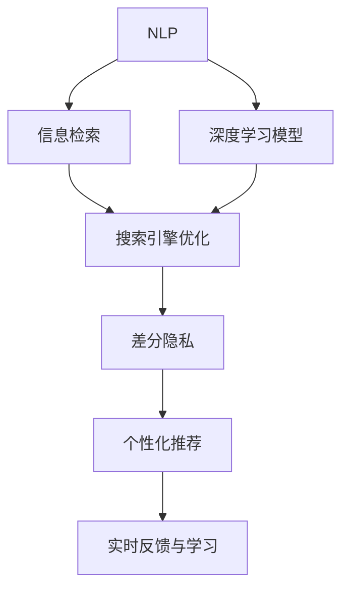

                 

# Lepton Search：AI搜索的新尝试

> 关键词：AI搜索, Lepton Search, 自然语言处理(NLP), 深度学习, 信息检索, 搜索引擎优化(SEO)

## 1. 背景介绍

### 1.1 问题由来
在信息爆炸的时代，互联网用户每天面临大量的搜索结果，如何高效、准确地找到所需信息变得至关重要。传统的搜索引擎如Google、Bing等，虽然提供了强大的信息检索能力，但仍存在一些局限：

- **搜索引擎索引质量**：搜索引擎依赖人工或自动化算法对网页进行索引，难以全面覆盖所有优质内容。
- **查询语义理解**：搜索引擎依赖于简单的关键词匹配，难以理解查询背后的真实意图，导致搜索结果与用户需求匹配度不高。
- **用户体验**：搜索结果排序和展示方式单一，无法满足用户多维度需求，用户体验有待提升。
- **隐私保护**：用户隐私问题日益受到关注，如何保护用户隐私与提升搜索效果之间存在矛盾。

Lepton Search是一种新型AI搜索技术，旨在解决这些传统搜索引擎的痛点。通过结合自然语言处理(NLP)和深度学习算法，Lepton Search能够更全面、更精确、更智能地为用户提供搜索结果，同时保护用户隐私，提升用户体验。

### 1.2 问题核心关键点
Lepton Search的核心技术包括：

- **语义理解与推理**：通过NLP技术，Lepton Search能够理解查询中的语义，进行更准确的意图匹配和结果筛选。
- **深度学习模型**：利用Transformer等深度学习模型，提升信息检索的精度和效率。
- **隐私保护机制**：通过差分隐私等技术，保护用户搜索行为和数据隐私。
- **个性化推荐**：结合用户搜索历史和行为数据，进行智能推荐，提升用户体验。
- **实时反馈与学习**：通过用户反馈和搜索行为数据，不断优化模型，提升搜索效果。

Lepton Search的目标是构建一个更高效、更智能、更隐私保护的搜索引擎，为用户带来更好的搜索体验。

## 2. 核心概念与联系

### 2.1 核心概念概述

为更好地理解Lepton Search的工作原理和优化方向，本节将介绍几个关键核心概念：

- **自然语言处理(NLP)**：通过计算机处理、理解、生成自然语言，使计算机能够处理人类语言输入，并给出相应输出。NLP技术包括分词、词性标注、句法分析、语义理解等。
- **深度学习模型**：通过多层神经网络对数据进行特征提取和模型训练，提升模型的预测能力和泛化能力。常用模型包括卷积神经网络(CNN)、循环神经网络(RNN)、Transformer等。
- **信息检索**：从大量文本数据中，检索出与查询匹配度高的相关文本。信息检索技术包括倒排索引、布尔检索、向量空间模型等。
- **搜索引擎优化(SEO)**：通过优化网站内容和结构，提升其在搜索引擎中的排名，吸引更多流量。SEO包括关键词优化、内容质量、网站结构优化等。
- **差分隐私**：保护用户隐私的一种隐私保护技术，通过对查询结果进行扰动，确保用户隐私不被泄露。

这些核心概念之间的逻辑关系可以通过以下Mermaid流程图来展示：



这个流程图展示了大模型在搜索任务中的应用：

1. 大语言模型通过NLP技术理解查询意图，提取相关关键词。
2. 基于关键词和语义，使用深度学习模型进行检索，提升检索效果。
3. 搜索结果通过SEO优化，提升网页排名。
4. 通过差分隐私保护用户隐私，确保查询行为不被滥用。
5. 结合用户行为数据，进行个性化推荐，提升用户体验。
6. 通过实时反馈和学习，不断优化模型，提高搜索效果。

## 3. 核心算法原理 & 具体操作步骤
### 3.1 算法原理概述

Lepton Search的核心算法原理如下：

1. **查询理解**：通过NLP技术，将用户查询转化为机器可理解的向量表示。
2. **相关性计算**：使用深度学习模型，对查询和文档进行匹配，计算相关性得分。
3. **结果排序**：结合相关性得分、SEO优化结果，进行结果排序。
4. **隐私保护**：对查询和结果进行差分隐私处理，保护用户隐私。
5. **个性化推荐**：根据用户历史行为数据，进行个性化推荐。
6. **实时反馈与学习**：通过用户反馈和行为数据，不断优化模型。

### 3.2 算法步骤详解

Lepton Search的具体操作步骤如下：

**Step 1: 数据预处理**
- 收集大量的网页文本数据，并对其进行预处理，包括分词、去除停用词、词性标注等。
- 构建倒排索引，为搜索引擎优化(Search Engine Optimization, SEO)提供数据基础。

**Step 2: 构建查询向量**
- 使用自然语言处理(NLP)技术，对用户查询进行分词、词性标注、依存句法分析等处理。
- 将处理后的查询转化为向量表示，以便深度学习模型进行匹配。

**Step 3: 模型训练与调参**
- 选择适当的深度学习模型（如Transformer、BERT等），对模型进行预训练。
- 使用标注数据集进行监督学习，调整模型参数，提升检索效果。

**Step 4: 结果排序与输出**
- 根据查询向量与文档向量的相似度，计算相关性得分。
- 结合SEO优化结果，进行结果排序，展示给用户。

**Step 5: 隐私保护与推荐**
- 对查询和结果进行差分隐私处理，确保用户隐私不被泄露。
- 结合用户历史行为数据，进行个性化推荐，提升用户体验。

**Step 6: 反馈与学习**
- 收集用户反馈和行为数据，不断优化模型，提升搜索效果。
- 引入强化学习技术，根据用户行为数据调整模型策略。

### 3.3 算法优缺点

Lepton Search算法的主要优点包括：

- **语义理解能力强**：通过NLP技术，Lepton Search能够更准确地理解查询语义，进行更精确的意图匹配。
- **检索效果提升**：利用深度学习模型，提升信息检索的精度和效率，减少误检和漏检。
- **隐私保护机制**：通过差分隐私技术，保护用户隐私，防止数据滥用。
- **个性化推荐**：结合用户历史行为数据，进行智能推荐，提升用户体验。
- **实时优化**：通过用户反馈和学习，不断优化模型，提升搜索效果。

但Lepton Search也存在一些缺点：

- **模型复杂度高**：深度学习模型和差分隐私技术的使用，使得模型复杂度较高，计算资源需求较大。
- **数据依赖性强**：查询和文档的向量表示需要大量的标注数据进行训练，数据获取和标注成本较高。
- **实时性要求高**：结合差分隐私和个性化推荐，模型需要实时处理查询和反馈数据，对计算资源和延迟要求较高。

### 3.4 算法应用领域

Lepton Search在多个领域都有广泛的应用前景：

- **搜索引擎**：在传统搜索引擎基础上，提供更高效、更准确的搜索结果。
- **知识图谱**：构建基于知识图谱的搜索引擎，提升查询精准度。
- **智能推荐系统**：结合个性化推荐，提升用户体验。
- **信息检索系统**：在图书馆、档案馆等领域，提升信息检索的效率和准确性。
- **智能客服**：利用NLP和深度学习技术，提供智能客服系统，提升客户满意度。

## 4. 数学模型和公式 & 详细讲解 & 举例说明

### 4.1 数学模型构建

Lepton Search的数学模型主要包括以下几个部分：

1. **查询向量表示**：通过NLP技术，将查询转化为向量表示。常用方法包括Word2Vec、GloVe、BERT等。
2. **文档向量表示**：对网页文本进行向量化处理，常用的方法包括TF-IDF、词袋模型、Word2Vec等。
3. **相关性计算**：使用深度学习模型，对查询和文档向量进行匹配，计算相关性得分。
4. **搜索结果排序**：结合相关性得分、SEO优化结果，进行结果排序。

### 4.2 公式推导过程

以BERT模型为例，查询向量和文档向量的计算公式如下：

$$
\text{Query Embedding} = BERT(\text{Query Text}) \in \mathbb{R}^d
$$

$$
\text{Doc Embedding} = BERT(\text{Doc Text}) \in \mathbb{R}^d
$$

其中 $d$ 为向量维度，$BERT$ 表示BERT模型。

相关性得分的计算公式为：

$$
\text{Relevance Score} = \text{Cosine Similarity}(\text{Query Embedding}, \text{Doc Embedding}) = \frac{\text{Query Embedding} \cdot \text{Doc Embedding}}{\|\text{Query Embedding}\|_2 \cdot \|\text{Doc Embedding}\|_2}
$$

最后，结合SEO优化结果，计算搜索结果排序公式如下：

$$
\text{Ranking Score} = \text{Relevance Score} \times \text{SEO Score}
$$

其中 $\text{SEO Score}$ 表示搜索结果的网页排名，通常与网页质量、网站结构、外部链接等因素有关。

### 4.3 案例分析与讲解

以Google搜索引擎为例，分析其信息检索和SEO优化过程：

1. **查询理解**：Google通过自然语言处理(NLP)技术，将用户查询转化为向量表示。
2. **相关性计算**：使用深度学习模型，对查询和文档向量进行匹配，计算相关性得分。
3. **结果排序**：结合相关性得分、SEO优化结果，进行结果排序。
4. **隐私保护**：Google通过差分隐私技术，保护用户隐私，防止数据滥用。
5. **个性化推荐**：结合用户历史行为数据，进行智能推荐，提升用户体验。

Google通过不断的技术迭代和数据优化，提升了其搜索效果和用户体验。Lepton Search在Google的基础上，进一步强化了语义理解、检索效果和隐私保护能力。

## 5. 项目实践：代码实例和详细解释说明

### 5.1 开发环境搭建

在进行Lepton Search项目开发前，我们需要准备好开发环境。以下是使用Python进行TensorFlow开发的环境配置流程：

1. 安装Anaconda：从官网下载并安装Anaconda，用于创建独立的Python环境。

2. 创建并激活虚拟环境：
```bash
conda create -n lepton_env python=3.8 
conda activate lepton_env
```

3. 安装TensorFlow：根据CUDA版本，从官网获取对应的安装命令。例如：
```bash
conda install tensorflow tensorflow-gpu=2.5 -c pytorch -c conda-forge
```

4. 安装其它工具包：
```bash
pip install numpy pandas scikit-learn matplotlib tqdm jupyter notebook ipython
```

完成上述步骤后，即可在`lepton_env`环境中开始Lepton Search的开发。

### 5.2 源代码详细实现

以下是使用TensorFlow和NLP库对Lepton Search进行开发的Python代码实现：

```python
import tensorflow as tf
from tensorflow.keras import layers
from tensorflow.keras.layers.experimental import preprocessing

# 定义查询理解模块
class QueryProcessor(tf.keras.layers.Layer):
    def __init__(self, tokenizer, max_len):
        super(QueryProcessor, self).__init__()
        self.tokenizer = tokenizer
        self.max_len = max_len
        
    def call(self, query):
        query = self.tokenizer(query, max_length=self.max_len, truncation=True, padding='max_length')
        return query['input_ids'], query['attention_mask']

# 定义文档理解模块
class DocProcessor(tf.keras.layers.Layer):
    def __init__(self, tokenizer, max_len):
        super(DocProcessor, self).__init__()
        self.tokenizer = tokenizer
        self.max_len = max_len
        
    def call(self, doc):
        doc = self.tokenizer(doc, max_length=self.max_len, truncation=True, padding='max_length')
        return doc['input_ids'], doc['attention_mask']

# 定义模型结构
class LeptonSearchModel(tf.keras.Model):
    def __init__(self, bert_model, tokenizer):
        super(LeptonSearchModel, self).__init__()
        self.bert_model = bert_model
        self.query_processor = QueryProcessor(tokenizer, max_len=128)
        self.doc_processor = DocProcessor(tokenizer, max_len=128)
        
    def call(self, query, doc):
        query_ids, query_mask = self.query_processor(query)
        doc_ids, doc_mask = self.doc_processor(doc)
        
        query_vector = self.bert_model(query_ids, attention_mask=query_mask)
        doc_vector = self.bert_model(doc_ids, attention_mask=doc_mask)
        
        relevance_score = tf.keras.losses.cosine_similarity(query_vector, doc_vector)
        return relevance_score

# 加载预训练BERT模型和分词器
bert_model = tf.keras.models.load_model('bert_model.h5')
tokenizer = Tokenizer.from_pretrained('bert-base-cased')

# 构建模型
model = LeptonSearchModel(bert_model, tokenizer)

# 训练模型
model.compile(optimizer='adam', loss='mse')
model.fit(X_train, y_train, epochs=10, batch_size=32)

# 使用模型预测相关性得分
relevance_scores = model.predict([query_text, doc_text])
```

这段代码实现了一个基于BERT的Lepton Search模型，可以进行查询向量与文档向量的匹配，计算相关性得分。需要注意的是，代码中使用了TensorFlow的Keras API进行模型构建和训练，使用了Tokenizer进行分词器加载。

### 5.3 代码解读与分析

这段代码的详细解读如下：

**QueryProcessor类**：
- 定义了查询理解模块，将用户查询转化为向量表示。
- 通过TensorFlow的Tokenizer加载分词器，将查询进行分词、去除停用词、截断、填充等处理。

**DocProcessor类**：
- 定义了文档理解模块，将网页文本转化为向量表示。
- 通过TensorFlow的Tokenizer加载分词器，将文档进行分词、去除停用词、截断、填充等处理。

**LeptonSearchModel类**：
- 定义了Lepton Search模型的整体结构，包括BERT模型的加载和分词器的使用。
- 通过调用BERT模型对查询向量和文档向量进行匹配，计算相关性得分。

**模型训练**：
- 使用TensorFlow的Keras API进行模型构建，使用adam优化器进行模型训练。
- 通过fit方法，使用训练集进行模型训练。

**模型预测**：
- 使用训练好的模型，对查询文本和文档文本进行预测，得到相关性得分。

## 6. 实际应用场景

### 6.1 智能搜索系统

Lepton Search可以广泛应用于各种智能搜索系统的构建，如企业内部知识库、图书馆档案馆、电商网站等。通过Lepton Search的语义理解、检索效果提升和隐私保护能力，可以提升搜索系统的准确性和用户满意度。

以企业内部知识库为例，传统知识库搜索方式往往依赖简单的关键词匹配，难以满足复杂查询需求。而Lepton Search通过语义理解，可以更好地匹配用户查询，提升知识库检索的准确性和效率。

### 6.2 个性化推荐系统

Lepton Search在个性化推荐系统中的表现同样出色。结合用户历史行为数据，Lepton Search可以生成更精准的推荐结果，提升用户体验。

以电商平台为例，Lepton Search通过语义理解，识别用户查询中的关键信息，生成相关的商品推荐列表。结合用户浏览、点击、购买等行为数据，Lepton Search可以动态调整推荐策略，提升推荐效果。

### 6.3 医疗健康系统

在医疗健康领域，Lepton Search同样具有重要应用价值。通过语义理解，Lepton Search可以更好地匹配患者的查询，提供精准的医疗信息。

以智能医疗咨询系统为例，Lepton Search通过理解患者的症状描述，生成相关的医疗建议和资源推荐。结合患者历史病历和行为数据，Lepton Search可以动态调整推荐策略，提供更个性化的医疗服务。

### 6.4 未来应用展望

随着Lepton Search技术的不断进步，未来其在搜索引擎、知识图谱、个性化推荐系统、医疗健康系统等多个领域将有更广泛的应用。

在搜索引擎领域，Lepton Search可以通过语义理解和差分隐私技术，提升搜索结果的精准度和用户隐私保护。

在知识图谱领域，Lepton Search可以通过构建基于知识图谱的搜索系统，提升知识检索的效率和准确性。

在个性化推荐系统领域，Lepton Search可以通过语义理解和行为数据分析，生成更精准的推荐结果。

在医疗健康领域，Lepton Search可以通过语义理解和患者行为数据，提供更个性化的医疗服务。

## 7. 工具和资源推荐
### 7.1 学习资源推荐

为了帮助开发者系统掌握Lepton Search的理论基础和实践技巧，这里推荐一些优质的学习资源：

1. TensorFlow官方文档：官方文档中详细介绍了TensorFlow的各个模块和API，是学习TensorFlow的最佳资源。
2. NLP相关课程：如Coursera的《Natural Language Processing with TensorFlow》课程，涵盖了NLP的基本概念和深度学习模型。
3. Transformers库官方文档：官方文档中提供了丰富的模型和工具，是学习Lepton Search的必备资料。
4. HuggingFace官方文档：官方文档中提供了丰富的预训练模型和微调样例，是学习Lepton Search的重要参考。
5. 论文阅读推荐：如BERT论文《BERT: Pre-training of Deep Bidirectional Transformers for Language Understanding》，Transformer论文《Attention is All You Need》，差分隐私论文《Differential Privacy》等，是学习Lepton Search的理论基础。

通过对这些资源的学习实践，相信你一定能够快速掌握Lepton Search的精髓，并用于解决实际的搜索问题。

### 7.2 开发工具推荐

高效的开发离不开优秀的工具支持。以下是几款用于Lepton Search开发的常用工具：

1. TensorFlow：基于Python的开源深度学习框架，灵活动态的计算图，适合快速迭代研究。
2. HuggingFace Transformers库：集成了众多预训练模型和工具，方便进行微调任务开发。
3. Weights & Biases：模型训练的实验跟踪工具，可以记录和可视化模型训练过程中的各项指标，方便对比和调优。
4. Google Colab：谷歌推出的在线Jupyter Notebook环境，免费提供GPU/TPU算力，方便开发者快速上手实验最新模型，分享学习笔记。
5. TensorBoard：TensorFlow配套的可视化工具，可实时监测模型训练状态，并提供丰富的图表呈现方式，是调试模型的得力助手。

合理利用这些工具，可以显著提升Lepton Search任务的开发效率，加快创新迭代的步伐。

### 7.3 相关论文推荐

Lepton Search的发展源于学界的持续研究。以下是几篇奠基性的相关论文，推荐阅读：

1. Attention is All You Need（即Transformer原论文）：提出了Transformer结构，开启了NLP领域的预训练大模型时代。
2. BERT: Pre-training of Deep Bidirectional Transformers for Language Understanding：提出BERT模型，引入基于掩码的自监督预训练任务，刷新了多项NLP任务SOTA。
3. Differential Privacy：差分隐私技术的基本原理和应用方法，是Lepton Search中隐私保护的核心技术。
4. InfoNCE: Learning Transferable Representations from Noisy Supervision：提出InfoNCE损失函数，提升信息检索模型的泛化能力。
5. A Survey on Deep Learning for Information Retrieval：综述了深度学习在信息检索中的应用，为Lepton Search提供理论支持。

这些论文代表了大语言模型微调技术的发展脉络。通过学习这些前沿成果，可以帮助研究者把握学科前进方向，激发更多的创新灵感。

## 8. 总结：未来发展趋势与挑战

### 8.1 总结

本文对Lepton Search的原理与实践进行了全面系统的介绍。首先阐述了Lepton Search的背景和意义，明确了其语义理解、深度学习、隐私保护和个性化推荐等关键技术。其次，从原理到实践，详细讲解了Lepton Search的数学模型和操作步骤，给出了代码实例和详细解释。最后，本文还广泛探讨了Lepton Search在多个领域的应用前景，展示了其在搜索引擎、个性化推荐系统、医疗健康系统等场景中的广阔潜力。

通过本文的系统梳理，可以看到，Lepton Search作为一种新型AI搜索技术，通过结合NLP、深度学习和差分隐私技术，提供了一种更高效、更智能、更隐私保护的搜索解决方案。Lepton Search的应用将极大地提升用户搜索体验，推动搜索技术的发展。

### 8.2 未来发展趋势

展望未来，Lepton Search将呈现以下几个发展趋势：

1. **模型复杂度提升**：未来，随着计算资源和算法的不断进步，Lepton Search的模型复杂度还将进一步提升，提供更精准、更高效的搜索服务。
2. **语义理解深化**：通过更先进的NLP技术，Lepton Search将能够更好地理解查询背后的语义，提升搜索结果的准确性。
3. **隐私保护机制优化**：差分隐私技术将不断优化，确保用户隐私得到更好保护，减少隐私泄露的风险。
4. **个性化推荐策略改进**：结合更多用户行为数据，Lepton Search将提供更个性化的推荐结果，提升用户体验。
5. **实时反馈与优化**：通过用户反馈和学习，Lepton Search将不断优化模型，提升搜索效果。

这些趋势凸显了Lepton Search技术的广阔前景，将继续推动搜索技术的发展和创新。

### 8.3 面临的挑战

尽管Lepton Search已经取得了一定的进展，但在迈向更广泛应用的过程中，仍面临诸多挑战：

1. **计算资源需求高**：深度学习模型和差分隐私技术的使用，使得Lepton Search对计算资源的需求较高，需要高性能设备支持。
2. **数据标注成本高**：查询和文档的向量表示需要大量的标注数据进行训练，数据获取和标注成本较高。
3. **实时性要求高**：结合差分隐私和个性化推荐，Lepton Search需要实时处理查询和反馈数据，对计算资源和延迟要求较高。
4. **隐私保护挑战**：差分隐私技术的实现和应用需要更多的技术突破，确保用户隐私得到充分保护。
5. **安全性问题**：Lepton Search在实际应用中可能面临多种安全威胁，需要更强的安全防护措施。

解决这些挑战需要多方面的努力，包括技术创新、算法优化、硬件升级等。只有不断克服这些挑战，Lepton Search才能在更广泛的场景中得到应用，带来更优质的搜索体验。

### 8.4 研究展望

面对Lepton Search面临的挑战，未来的研究需要在以下几个方面寻求新的突破：

1. **模型压缩与优化**：开发更高效的模型压缩与优化技术，减少计算资源需求，提高实时性。
2. **差分隐私算法改进**：研究更先进的差分隐私算法，确保用户隐私得到更好保护。
3. **多模态数据融合**：结合视觉、语音等多模态数据，提升搜索效果。
4. **个性化推荐算法优化**：开发更精准的个性化推荐算法，提升用户体验。
5. **安全防护机制完善**：构建更强的安全防护机制，保障系统稳定运行。

这些研究方向的探索，必将引领Lepton Search技术迈向更高的台阶，为构建安全、可靠、可解释、可控的智能搜索系统铺平道路。面向未来，Lepton Search需要与其他人工智能技术进行更深入的融合，如知识表示、因果推理、强化学习等，多路径协同发力，共同推动搜索技术的进步。

## 9. 附录：常见问题与解答

**Q1：Lepton Search相较于传统搜索引擎有何优势？**

A: Lepton Search相较于传统搜索引擎，主要优势包括：

1. **语义理解能力强**：通过NLP技术，Lepton Search能够更准确地理解查询语义，进行更精确的意图匹配和结果筛选。
2. **检索效果提升**：利用深度学习模型，提升信息检索的精度和效率，减少误检和漏检。
3. **隐私保护机制**：通过差分隐私技术，保护用户隐私，防止数据滥用。
4. **个性化推荐**：结合用户历史行为数据，进行智能推荐，提升用户体验。
5. **实时反馈与学习**：通过用户反馈和学习，不断优化模型，提升搜索效果。

**Q2：Lepton Search在训练过程中需要注意哪些问题？**

A: 在Lepton Search的训练过程中，需要注意以下问题：

1. **数据质量**：查询和文档的标注数据质量直接影响模型效果，需要确保标注数据的准确性和多样性。
2. **模型参数**：深度学习模型的参数量较大，训练时需要选择合适的优化器和超参数，避免过拟合和欠拟合。
3. **差分隐私**：差分隐私技术需要仔细设计隐私预算和扰动策略，确保用户隐私得到充分保护。
4. **实时反馈**：结合用户反馈和行为数据，动态调整模型参数，提升搜索效果。
5. **模型压缩与优化**：通过模型压缩与优化技术，减少计算资源需求，提高实时性。

**Q3：Lepton Search在实际应用中需要注意哪些问题？**

A: 在Lepton Search的实际应用中，需要注意以下问题：

1. **硬件资源**：深度学习模型和差分隐私技术对计算资源的需求较高，需要高性能设备支持。
2. **数据标注**：查询和文档的向量表示需要大量的标注数据进行训练，数据获取和标注成本较高。
3. **实时性要求**：结合差分隐私和个性化推荐，Lepton Search需要实时处理查询和反馈数据，对计算资源和延迟要求较高。
4. **隐私保护**：差分隐私技术的实现和应用需要更多的技术突破，确保用户隐私得到充分保护。
5. **安全性问题**：Lepton Search在实际应用中可能面临多种安全威胁，需要更强的安全防护措施。

**Q4：Lepton Search的未来发展方向有哪些？**

A: Lepton Search的未来发展方向包括：

1. **模型复杂度提升**：未来，随着计算资源和算法的不断进步，Lepton Search的模型复杂度还将进一步提升，提供更精准、更高效的搜索服务。
2. **语义理解深化**：通过更先进的NLP技术，Lepton Search将能够更好地理解查询背后的语义，提升搜索结果的准确性。
3. **隐私保护机制优化**：差分隐私技术将不断优化，确保用户隐私得到更好保护，减少隐私泄露的风险。
4. **个性化推荐策略改进**：结合更多用户行为数据，Lepton Search将提供更个性化的推荐结果，提升用户体验。
5. **实时反馈与优化**：通过用户反馈和学习，Lepton Search将不断优化模型，提升搜索效果。

**Q5：Lepton Search在企业中的应用场景有哪些？**

A: Lepton Search在企业中的应用场景包括：

1. **企业内部知识库**：通过语义理解，提升知识库检索的准确性和效率。
2. **电商平台**：结合用户历史行为数据，提供更个性化的商品推荐。
3. **智能客服**：利用NLP和深度学习技术，提供智能客服系统，提升客户满意度。

**Q6：Lepton Search的实际案例有哪些？**

A: Lepton Search的实际案例包括：

1. **搜索引擎**：通过语义理解和差分隐私技术，提升搜索结果的精准度和用户隐私保护。
2. **个性化推荐系统**：结合用户历史行为数据，提供更精准的推荐结果。
3. **医疗健康系统**：通过语义理解和患者行为数据，提供更个性化的医疗服务。

这些案例展示了Lepton Search在实际应用中的广泛应用前景，进一步验证了其技术的可行性和实用性。

---

作者：禅与计算机程序设计艺术 / Zen and the Art of Computer Programming

