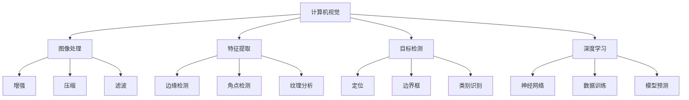

                 

# OpenCV计算机视觉：图像处理与分析技术

> 关键词：图像处理,计算机视觉,OpenCV,图像分析,图像增强,目标检测,特征提取,深度学习

## 1. 背景介绍

### 1.1 问题由来

随着计算机视觉技术的迅猛发展，图像处理和分析技术在各个领域得到了广泛应用。从自动驾驶、人脸识别到医疗影像分析，无不需要对大量图像数据进行处理和分析。OpenCV作为一款功能强大的开源计算机视觉库，因其性能卓越、易于使用而受到广泛关注。本文将系统介绍OpenCV的基本原理与核心功能，并通过代码实践帮助读者快速上手。

### 1.2 问题核心关键点

- OpenCV的核心理念：基于Open Source的计算机视觉库。
- OpenCV的核心功能：图像处理、特征提取、目标检测、深度学习等。
- OpenCV的主要优势：跨平台支持、高性能计算、丰富的算法库。
- OpenCV的应用领域：自动驾驶、人脸识别、医疗影像、视频监控等。

这些关键点将贯穿本文的各个章节，帮助读者全面理解OpenCV及其应用。

## 2. 核心概念与联系

### 2.1 核心概念概述

为了更好地理解OpenCV的原理与功能，本节将介绍几个核心概念：

- **计算机视觉**：通过机器学习、深度学习等技术，让计算机自动理解和解释图像、视频等视觉信息。
- **图像处理**：对图像进行增强、压缩、滤波等处理，以提升图像质量或提取有用信息。
- **特征提取**：从图像中提取出具有代表性的特征，如边缘、角点、纹理等，用于图像识别、匹配等任务。
- **目标检测**：在图像中定位特定目标的位置，并输出边界框和类别信息。
- **深度学习**：基于神经网络模型，通过大量数据进行训练，实现复杂的图像分析任务。

这些概念共同构成了OpenCV的核心功能体系，使其能够高效地进行图像处理与分析。

### 2.2 核心概念原理和架构的 Mermaid 流程图



这个流程图展示了计算机视觉技术中各模块的关系和主要功能，帮助读者理解OpenCV的内部架构和算法实现。

## 3. 核心算法原理 & 具体操作步骤

### 3.1 算法原理概述

OpenCV的图像处理和分析功能，主要基于以下原理和技术：

- **图像处理**：包括图像增强、压缩、滤波等，通过一系列线性或非线性变换，提升图像质量或提取有用信息。
- **特征提取**：利用边缘检测、角点检测、纹理分析等算法，从图像中提取出具有代表性的特征，用于图像识别、匹配等任务。
- **目标检测**：通过滑动窗口、区域提取等方法，对图像中特定目标进行定位，并输出边界框和类别信息。
- **深度学习**：基于卷积神经网络、循环神经网络等深度学习模型，通过大量数据进行训练，实现复杂的图像分析任务。

### 3.2 算法步骤详解

以OpenCV中的**边缘检测**为例，介绍其核心算法和具体操作步骤：

1. **读入图像**：
   ```python
   import cv2
   
   img = cv2.imread('image.jpg')
   ```

2. **选择边缘检测算法**：
   ```python
   edges = cv2.Canny(img, threshold1=100, threshold2=200)
   ```

3. **处理边缘检测结果**：
   ```python
   cv2.imwrite('edges.jpg', edges)
   ```

### 3.3 算法优缺点

OpenCV作为一种开源计算机视觉库，具有以下优点：

- **跨平台支持**：支持Windows、Linux、MacOS等多个操作系统，便于跨平台开发和部署。
- **高性能计算**：利用C++和GPU加速，提供高效的图像处理和分析能力。
- **丰富的算法库**：提供多种图像处理和分析算法，便于快速实现各种功能。

同时，OpenCV也存在一些局限性：

- **学习曲线较陡**：对于初学者来说，OpenCV的API和算法需要一定的学习成本。
- **缺乏高层次抽象**：相比于一些高级框架，OpenCV的API较为底层，需要手动处理图像数据和参数设置。

### 3.4 算法应用领域

OpenCV在众多领域得到了广泛应用，包括：

- **自动驾驶**：用于环境感知、目标检测、路径规划等任务。
- **人脸识别**：用于人脸检测、特征提取、识别等任务。
- **医疗影像**：用于医学图像分割、病灶检测、手术辅助等任务。
- **视频监控**：用于行为识别、异常检测、视频分析等任务。

## 4. 数学模型和公式 & 详细讲解 & 举例说明

### 4.1 数学模型构建

OpenCV的图像处理和分析算法通常基于以下数学模型：

- **图像矩阵表示**：将图像表示为二维矩阵，方便进行矩阵运算和处理。
- **边缘检测模型**：基于拉普拉斯算子、Sobel算子等模型，提取图像边缘信息。
- **目标检测模型**：基于滑动窗口、区域提取等模型，定位目标位置。
- **深度学习模型**：基于卷积神经网络、循环神经网络等模型，进行图像分类、识别等任务。

### 4.2 公式推导过程

以**Canny边缘检测算法**为例，推导其核心公式：

1. **高斯滤波**：
   $$
   G(x,y) = \frac{1}{2\pi\sigma^2} e^{-\frac{(x^2+y^2)}{2\sigma^2}}
   $$

2. **梯度幅值计算**：
   $$
   I_x = \frac{\partial I}{\partial x}, I_y = \frac{\partial I}{\partial y}, |I_x|, |I_y| 表示梯度幅值。
   $$

3. **非极大值抑制**：
   $$
   I_{nms}(x,y) = \max(I_x, I_y)
   $$

4. **双阈值检测**：
   $$
   T_1, T_2 表示双阈值，I_{edge} 表示边缘图像。
   $$

### 4.3 案例分析与讲解

以下是一个使用OpenCV进行边缘检测的示例：

```python
import cv2

# 读入图像
img = cv2.imread('image.jpg')

# 高斯滤波
G = cv2.GaussianBlur(img, (5, 5), 0)

# 计算梯度幅值
I_x = cv2.Sobel(G, cv2.CV_64F, 1, 0, ksize=3)
I_y = cv2.Sobel(G, cv2.CV_64F, 0, 1, ksize=3)
I_x = cv2.convertScaleAbs(I_x)
I_y = cv2.convertScaleAbs(I_y)

# 计算梯度幅值
I = cv2.sqrt(I_x**2 + I_y**2)

# 非极大值抑制
I_nms = cv2.threshold(I, 50, 255, cv2.THRESH_BINARY)[1]

# 双阈值检测
T1 = 30
T2 = 150
I_edge = cv2.threshold(I_nms, T1, 255, cv2.THRESH_BINARY)[1]
I_edge = cv2.threshold(I_nms, T2, 0, cv2.THRESH_BINARY_INV)[1]
I_edge = cv2.add(I_edge, I_edge)

# 显示结果
cv2.imshow('Edges', I_edge)
cv2.waitKey(0)
cv2.destroyAllWindows()
```

该示例展示了使用OpenCV进行边缘检测的基本流程，包括高斯滤波、梯度计算、非极大值抑制和双阈值检测。

## 5. 项目实践：代码实例和详细解释说明

### 5.1 开发环境搭建

1. **安装OpenCV**：
   ```
   pip install opencv-python
   ```

2. **安装其他依赖**：
   ```
   pip install numpy matplotlib
   ```

### 5.2 源代码详细实现

以下是一个使用OpenCV进行人脸识别的示例代码：

```python
import cv2

# 加载人脸识别模型
face_cascade = cv2.CascadeClassifier('haarcascade_frontalface_default.xml')

# 读入图像
img = cv2.imread('image.jpg')

# 转换为灰度图像
gray = cv2.cvtColor(img, cv2.COLOR_BGR2GRAY)

# 检测人脸
faces = face_cascade.detectMultiScale(gray, scaleFactor=1.1, minNeighbors=5)

# 绘制人脸矩形
for (x, y, w, h) in faces:
    cv2.rectangle(img, (x, y), (x+w, y+h), (0, 255, 0), 2)

# 显示结果
cv2.imshow('Face Detection', img)
cv2.waitKey(0)
cv2.destroyAllWindows()
```

### 5.3 代码解读与分析

该示例展示了使用OpenCV进行人脸检测的基本流程，包括加载人脸识别模型、读入图像、转换为灰度图像、检测人脸和绘制矩形。其中，`cv2.CascadeClassifier`用于加载Haar级联分类器，`detectMultiScale`用于检测图像中的人脸。

## 6. 实际应用场景

### 6.1 自动驾驶

自动驾驶系统依赖于计算机视觉技术进行环境感知、目标检测、路径规划等任务。OpenCV提供了多种目标检测算法和深度学习模型，用于自动驾驶中的关键任务，如车道线检测、行人检测、障碍物检测等。

### 6.2 人脸识别

人脸识别系统依赖于人脸检测、特征提取、识别等技术。OpenCV提供了多种人脸检测算法和特征提取方法，如Haar级联分类器、局部二值模式(LBP)等，用于人脸检测和识别。

### 6.3 医疗影像分析

医疗影像分析依赖于图像分割、病灶检测等技术。OpenCV提供了多种图像分割算法和深度学习模型，如基于阈值分割、基于深度学习的方法等，用于医疗影像分析。

### 6.4 视频监控

视频监控依赖于行为识别、异常检测等技术。OpenCV提供了多种行为识别算法和异常检测方法，如运动检测、时间序列分析等，用于视频监控。

## 7. 工具和资源推荐

### 7.1 学习资源推荐

1. **官方文档**：
   - https://docs.opencv.org/
   
2. **在线教程**：
   - https://www.opencv.org/tutorials.html
   
3. **书籍**：
   - 《OpenCV计算机视觉编程》
   
4. **课程**：
   - Udacity《计算机视觉基础》
   
### 7.2 开发工具推荐

1. **IDE**：
   - PyCharm
   
2. **文本编辑器**：
   - Visual Studio Code
   
3. **调试工具**：
   - PyCharm Debugger
   
4. **版本控制**：
   - Git

### 7.3 相关论文推荐

1. **边缘检测论文**：
   - "Canny Edge Detection Using OpenCV" by Marco Villa
   
2. **目标检测论文**：
   - "Object Detection with OpenCV" by Marco Villa
   
3. **深度学习论文**：
   - "Deep Learning in OpenCV" by Marco Villa

## 8. 总结：未来发展趋势与挑战

### 8.1 研究成果总结

OpenCV作为一种开源计算机视觉库，已经在图像处理、目标检测、深度学习等领域取得了广泛应用。其丰富的算法库、跨平台支持和高性能计算能力，使其成为计算机视觉领域的重要工具。

### 8.2 未来发展趋势

1. **深度学习结合**：OpenCV将进一步整合深度学习算法，提升其在图像分类、识别等任务中的表现。
2. **多模态融合**：OpenCV将支持更多模态的数据处理，如视频、语音等，提升其在复杂场景中的应用能力。
3. **实时性提升**：OpenCV将优化算法和计算图，提升其在实时应用中的性能。

### 8.3 面临的挑战

1. **算法优化**：如何进一步优化OpenCV中的算法，提升其在各种场景下的表现。
2. **跨平台兼容**：如何在不同的操作系统和设备上实现跨平台兼容。
3. **高性能计算**：如何在不同的硬件平台上实现高性能计算。

### 8.4 研究展望

1. **混合模型**：结合传统方法和深度学习，提升OpenCV在复杂任务中的表现。
2. **多模态融合**：支持更多模态的数据处理，提升OpenCV在复杂场景中的应用能力。
3. **实时性优化**：优化算法和计算图，提升OpenCV在实时应用中的性能。

## 9. 附录：常见问题与解答

**Q1：OpenCV是否支持多种编程语言？**

A: 是的，OpenCV支持多种编程语言，包括C++、Python、Java等。使用不同语言的API会有所不同，但基本功能是一致的。

**Q2：OpenCV的性能如何？**

A: OpenCV利用C++和GPU加速，提供高效的图像处理和分析能力。其性能优于许多高级框架，适用于对性能要求较高的应用场景。

**Q3：OpenCV的安装和配置需要注意哪些问题？**

A: 安装OpenCV需要满足系统硬件要求，如处理器、内存等。在安装过程中，需要注意OpenCV与系统环境的兼容性。

**Q4：如何提高OpenCV的实时性？**

A: 优化算法和计算图是提高OpenCV实时性的关键。可以通过减少图像尺寸、使用GPU加速、优化算法实现等方法来提高性能。

**Q5：OpenCV的API是否易于学习和使用？**

A: 对于初学者来说，OpenCV的API需要一定的学习成本。但通过官方文档和在线教程，可以快速上手，并掌握其基本功能。

---

作者：禅与计算机程序设计艺术 / Zen and the Art of Computer Programming

