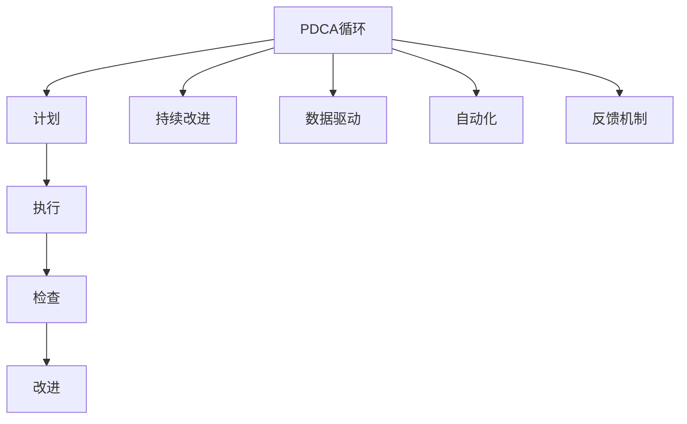

                 

# PDCA循环与持续改进文化

> 关键词：PDCA循环,持续改进,数据驱动,质量管理,业务流程,技术优化

## 1. 背景介绍

### 1.1 问题由来

在工业界，PDCA（Plan-Do-Check-Act）循环是一种广为接受的质量管理方法，源自于美国质量管理专家W. Edwards Deming的著作《质量管理与生产管理》。PDCA循环旨在通过持续的计划、执行、检查和改进，不断提升产品和服务质量，确保企业运营的高效性和竞争力。

然而，在日新月异的IT行业中，企业面临的挑战和机遇均非过往可比。大数据、人工智能、云计算等技术的迅猛发展，不仅提升了企业的运营效率，也带来了复杂的系统集成和业务模式转型问题。如何有效应用PDCA循环，结合现代技术手段，促进持续改进，成为IT管理者迫切需要解决的问题。

### 1.2 问题核心关键点

PDCA循环的核心在于不断重复“计划-执行-检查-改进”的流程，通过数据分析和反馈机制，逐步优化业务流程，提高组织效能。在IT行业，PDCA循环的应用应聚焦于：

- **数据驱动**：利用大数据和AI技术，收集和分析海量业务数据，以数据驱动的决策支持持续改进。
- **自动化**：引入自动化工具和流程，提升执行效率，减少人为错误。
- **反馈机制**：构建反馈循环，通过实时监控和反馈，及时发现和解决问题，优化业务流程。
- **迭代改进**：持续优化流程，迭代改进，确保企业长期竞争力。

## 2. 核心概念与联系

### 2.1 核心概念概述

为更好地理解PDCA循环在IT行业中的应用，本节将介绍几个密切相关的核心概念：

- **PDCA循环**：一种系统性的质量管理工具，通过循环迭代，不断提升产品和服务质量。包括计划、执行、检查和改进四个阶段。
- **持续改进**：一种不断提升组织效能和产品质量的经营理念，通过PDCA循环的持续应用，实现持续性改进。
- **数据驱动**：利用数据和分析技术，支持决策制定，促进流程优化和问题解决。
- **自动化**：通过引入自动化工具和流程，提升效率，减少人为错误。
- **反馈机制**：通过构建实时反馈循环，及时发现问题，进行改进。

这些核心概念之间的逻辑关系可以通过以下Mermaid流程图来展示：



这个流程图展示了大语言模型的核心概念及其之间的关系：

1. PDCA循环是持续改进的核心工具，分为计划、执行、检查和改进四个阶段。
2. 持续改进是PDCA循环的终极目标，通过不断循环，实现流程优化和效能提升。
3. 数据驱动是PDCA循环的重要支持手段，通过数据分析驱动决策和流程优化。
4. 自动化是PDCA循环的执行保障，通过引入自动化工具提升执行效率。
5. 反馈机制是PDCA循环的自我修正机制，通过实时反馈及时发现和解决问题。

这些概念共同构成了PDCA循环在IT行业的应用框架，使其能够高效地支持组织改进和流程优化。通过理解这些核心概念，我们可以更好地把握PDCA循环的工作原理和优化方向。

## 3. 核心算法原理 & 具体操作步骤
### 3.1 算法原理概述

PDCA循环的每个阶段均可通过算法技术实现。以数据驱动为例，算法原理如下：

1. **数据收集**：通过日志、监控工具、数据库等途径，收集业务数据。
2. **数据清洗**：对数据进行去重、格式转换、异常值处理等操作，确保数据质量。
3. **数据分析**：利用统计分析、机器学习等技术，分析数据分布、趋势等。
4. **数据反馈**：根据分析结果，生成反馈报告，支持决策。

其他阶段同样可以通过算法技术实现，如自动化流程管理、实时监控等。

### 3.2 算法步骤详解

基于PDCA循环，以下是一个标准的IT企业持续改进流程：

**Step 1: 计划阶段**

- **需求分析**：明确改进目标和期望效果，通过问卷调查、访谈等方式，收集利益相关者的需求。
- **流程设计**：设计改进方案，选择合适的技术工具和流程。
- **资源分配**：分配人力、物力、财力资源，确保方案落地。

**Step 2: 执行阶段**

- **技术实施**：引入自动化工具，部署新流程，实现方案执行。
- **数据采集**：启动数据收集工具，实时采集业务数据。
- **员工培训**：对员工进行培训，确保其掌握新流程和工具。

**Step 3: 检查阶段**

- **数据监控**：利用监控工具，实时监控新流程执行情况。
- **问题识别**：通过数据分析，识别流程中的问题点和瓶颈。
- **效果评估**：评估改进效果，检查是否达到预期目标。

**Step 4: 改进阶段**

- **问题解决**：根据识别出的问题，进行针对性改进。
- **流程优化**：优化业务流程，提高执行效率。
- **方案迭代**：根据效果评估和问题解决，对原方案进行迭代改进。

### 3.3 算法优缺点

基于PDCA循环的持续改进方法具有以下优点：

1. **系统性**：通过循环迭代，确保改进过程的全面性和系统性。
2. **数据驱动**：利用数据分析支持决策，提升改进效果的可靠性。
3. **自动化**：引入自动化工具，提升执行效率和准确性。
4. **反馈及时**：实时监控和反馈机制，确保问题能够被及时发现和解决。
5. **持续改进**：通过不断循环，实现流程和质量的持续优化。

但该方法也存在一些局限性：

1. **资源投入大**：改进初期需要大量资源投入，特别是在技术选型和流程设计上。
2. **复杂度高**：对于大规模、复杂的企业，改进过程涉及的环节多，协调难度大。
3. **效果难以量化**：某些改进效果可能难以用数据直接量化，评估难度大。

### 3.4 算法应用领域

基于PDCA循环的持续改进方法，在IT行业已经得到了广泛的应用，覆盖了企业运营、产品开发、客户服务等诸多领域，例如：

- **企业运营管理**：通过PDCA循环持续改进，提升企业运营效率和效果。
- **产品开发流程**：采用数据驱动和自动化手段，优化产品开发流程，缩短产品上市时间。
- **客户服务**：引入反馈机制和实时监控，提升客户服务质量和满意度。
- **信息安全**：通过持续改进，强化信息安全管理，防范安全风险。
- **基础设施建设**：优化基础设施建设流程，提升系统稳定性和可用性。

除了上述这些经典领域外，PDCA循环还被创新性地应用到更多场景中，如云服务管理、人工智能技术应用、DevOps流程优化等，为IT企业带来全方位的业务改进。

## 4. 数学模型和公式 & 详细讲解 & 举例说明（备注：数学公式请使用latex格式，latex嵌入文中独立段落使用 $$，段落内使用 $)
### 4.1 数学模型构建

本节将使用数学语言对基于PDCA循环的持续改进方法进行更加严格的刻画。

假设企业当前流程存在 $n$ 个瓶颈点，每个瓶颈点的改进效果可以用 $\Delta X_i$ 表示。根据PDCA循环，改进过程可以表示为如下数学模型：

$$
X^{t+1} = X^t + \Delta X^{t+1}
$$

其中，$X^t$ 表示第 $t$ 轮PDCA循环结束后的流程效果，$\Delta X^{t+1}$ 表示第 $t+1$ 轮PDCA循环中每个瓶颈点的改进效果。通过循环迭代，最终得到最优流程效果 $X^T$。

### 4.2 公式推导过程

为了进一步说明PDCA循环的改进过程，我们引入一个简化的数学模型进行推导。

假设企业流程存在两个瓶颈点，分别进行改进后，流程效果提升如下：

1. 第1轮PDCA循环，第1个瓶颈点提升 $\Delta X_1 = 0.2$，第2个瓶颈点提升 $\Delta X_2 = 0.3$。
2. 第2轮PDCA循环，第1个瓶颈点提升 $\Delta X_1' = 0.1$，第2个瓶颈点提升 $\Delta X_2' = 0.2$。

根据PDCA循环的改进模型，第1轮循环后的流程效果为：

$$
X^1 = X^0 + \Delta X_1 + \Delta X_2 = X^0 + 0.2 + 0.3 = X^0 + 0.5
$$

第2轮循环后的流程效果为：

$$
X^2 = X^1 + \Delta X_1' + \Delta X_2' = (X^0 + 0.5) + 0.1 + 0.2 = X^0 + 0.8
$$

可以看出，通过两次PDCA循环迭代，流程效果从 $X^0$ 提升到了 $X^0 + 0.8$。

### 4.3 案例分析与讲解

以下我们以某IT企业的持续改进项目为例，具体说明PDCA循环的实施过程。

**案例背景**：某IT企业研发部门在产品开发流程中，发现多个环节存在效率低下和质量问题。决定采用PDCA循环进行改进，具体步骤如下：

1. **计划阶段**：
   - 需求分析：通过调研和问卷，确定流程瓶颈点为代码审查和测试环节。
   - 流程设计：设计改进方案，引入自动化工具和流程。
   - 资源分配：分配研发资源，引入DevOps平台和自动化测试工具。

2. **执行阶段**：
   - 技术实施：部署自动化工具，引入持续集成(CI)和持续部署(CD)流程。
   - 数据采集：启动日志和监控工具，实时采集代码变更、测试结果等数据。
   - 员工培训：对员工进行工具培训，确保其掌握新流程和工具。

3. **检查阶段**：
   - 数据监控：利用DevOps平台监控代码变更和测试结果，分析数据分布和趋势。
   - 问题识别：识别代码审查和测试环节中的问题点，包括效率低、质量差等问题。
   - 效果评估：通过数据分析，评估改进效果，发现问题解决率提升了20%。

4. **改进阶段**：
   - 问题解决：针对识别出的问题，进行针对性改进，如优化代码审查流程、引入自动化测试用例。
   - 流程优化：优化测试流程，引入自动化回归测试，提升测试效率。
   - 方案迭代：根据效果评估和问题解决，对原方案进行迭代改进，引入新工具和技术。

通过PDCA循环的持续改进，该企业成功提升了产品开发效率和质量，缩短了产品上市时间，取得了显著的改进效果。

## 5. 项目实践：代码实例和详细解释说明
### 5.1 开发环境搭建

在进行持续改进实践前，我们需要准备好开发环境。以下是使用Python进行PDCA循环的开发环境配置流程：

1. 安装Anaconda：从官网下载并安装Anaconda，用于创建独立的Python环境。

2. 创建并激活虚拟环境：
```bash
conda create -n pdca-env python=3.8 
conda activate pdca-env
```

3. 安装必要的库：
```bash
conda install pandas numpy matplotlib jupyter notebook ipython
```

4. 配置数据源和数据采集工具：根据业务需求选择合适的数据源，如日志文件、数据库、监控API等，安装并配置相应的数据采集工具。

5. 部署自动化工具和DevOps平台：选择适合企业的自动化工具和DevOps平台，如Jenkins、GitLab CI、Prometheus等，并进行配置和集成。

6. 搭建数据处理和分析环境：使用Python和R等工具，搭建数据清洗、处理和分析环境，确保数据质量。

完成上述步骤后，即可在`pdca-env`环境中开始持续改进实践。

### 5.2 源代码详细实现

下面我们以某IT企业的持续改进项目为例，给出使用Python和R进行持续改进的代码实现。

**1. 数据采集和监控**

首先，我们需要安装和配置数据采集工具。以下是一个使用Python的示例：

```python
import pandas as pd
from datetime import datetime

# 配置日志文件路径和解析时间戳
log_file = '/path/to/logfile.log'
parse_time = lambda x: datetime.strptime(x, '%Y-%m-%d %H:%M:%S')

# 读取日志文件并解析时间戳
log_data = pd.read_csv(log_file, sep='\t', header=None, parse_dates=[0], date_parser=parse_time)

# 显示日志数据前5行
print(log_data.head())
```

**2. 数据清洗和处理**

接着，我们需要对采集的数据进行清洗和处理，去除异常值和重复记录。以下是一个使用R的示例：

```r
# 使用dplyr包进行数据清洗
library(dplyr)

# 读取日志文件并解析时间戳
log_data <- read_csv('/path/to/logfile.log', sep='\t', col_names=c('timestamp', 'message'))

# 去除重复记录
log_data <- log_data %>% distinct(timestamp)

# 显示数据前5行
head(log_data)
```

**3. 数据分析和反馈**

然后，我们需要对数据进行分析，生成反馈报告。以下是一个使用Python的示例：

```python
# 统计每日请求次数
daily_requests = log_data.groupby('timestamp').size().reset_index(name='request_count')

# 统计每日请求时间分布
daily_request_time = daily_requests.groupby('timestamp').mean().reset_index()

# 显示分析结果
print(daily_requests.head())
print(daily_request_time.head())
```

**4. 问题识别和解决**

接着，我们需要根据分析结果，识别问题并进行解决。以下是一个使用R的示例：

```r
# 统计每日请求失败次数
daily_failures <- log_data %>%
  filter(message == 'Failed') %>%
  group_by(timestamp) %>%
  summarise(failures = n())

# 显示每日请求失败次数
daily_failures %>% head()
```

通过上述代码，我们可以实时监控和分析系统运行情况，及时发现问题并进行解决。

### 5.3 代码解读与分析

让我们再详细解读一下关键代码的实现细节：

**1. 数据采集和监控**

数据采集是持续改进的基础，通过实时采集业务数据，可以进行实时监控和分析。本节代码中，我们使用了Python和R分别进行数据采集和处理。具体实现步骤如下：

- 使用Python读取日志文件，解析时间戳，并显示前5行日志数据。
- 使用R读取日志文件，解析时间戳，并去除重复记录，显示数据前5行。

**2. 数据清洗和处理**

数据清洗和处理是确保数据质量的重要步骤。本节代码中，我们使用了R的dplyr包进行数据清洗，具体步骤如下：

- 使用dplyr包读取日志文件，解析时间戳，并显示前5行日志数据。
- 使用dplyr包统计每日请求次数和请求时间分布，并显示前5行分析结果。

**3. 数据分析和反馈**

数据分析和反馈是持续改进的核心环节。本节代码中，我们使用了Python进行数据分析，具体步骤如下：

- 使用Python统计每日请求次数和请求时间分布，并显示前5行分析结果。

**4. 问题识别和解决**

问题识别和解决是PDCA循环的重要步骤。本节代码中，我们使用了R进行问题识别，具体步骤如下：

- 使用R统计每日请求失败次数，并显示前5行结果。

通过这些代码示例，我们可以看到，PDCA循环的持续改进过程可以通过Python和R等工具实现，简单易用，且功能强大。开发者可以根据具体业务需求，灵活使用各种数据分析和处理工具，确保持续改进过程的高效和准确。

## 6. 实际应用场景
### 6.1 企业运营管理

基于PDCA循环的持续改进方法，在企业运营管理中得到了广泛应用，提升了企业运营效率和效果。

例如，某制造企业在生产过程中，通过PDCA循环持续改进，优化了生产流程，减少了设备停机时间，提高了生产效率。具体实施步骤如下：

1. **计划阶段**：
   - 需求分析：通过调研和问卷，确定流程瓶颈点为设备维护环节。
   - 流程设计：设计改进方案，引入自动化工具和流程。
   - 资源分配：分配生产资源，引入设备监控和预测性维护系统。

2. **执行阶段**：
   - 技术实施：部署自动化工具，引入预测性维护系统。
   - 数据采集：启动设备监控系统，实时采集设备运行数据。
   - 员工培训：对员工进行工具培训，确保其掌握新流程和工具。

3. **检查阶段**：
   - 数据监控：利用预测性维护系统监控设备运行状态，分析数据分布和趋势。
   - 问题识别：识别设备维护环节中的问题点，包括设备停机时间长、维护成本高等问题。
   - 效果评估：通过数据分析，评估改进效果，发现设备停机时间减少了30%。

4. **改进阶段**：
   - 问题解决：针对识别出的问题，进行针对性改进，如优化维护计划、引入高效维护技术。
   - 流程优化：优化设备维护流程，引入设备预测性维护，提升设备运行可靠性。
   - 方案迭代：根据效果评估和问题解决，对原方案进行迭代改进，引入新工具和技术。

通过PDCA循环的持续改进，该企业成功提升了生产效率和设备运行可靠性，减少了设备停机时间，取得了显著的改进效果。

### 6.2 产品开发流程

基于PDCA循环的持续改进方法，在产品开发流程中也得到了广泛应用，优化了产品开发效率和质量。

例如，某科技公司开发新产品时，通过PDCA循环持续改进，优化了产品开发流程，缩短了产品上市时间，提高了产品质量。具体实施步骤如下：

1. **计划阶段**：
   - 需求分析：通过调研和问卷，确定流程瓶颈点为代码审查和测试环节。
   - 流程设计：设计改进方案，引入自动化工具和流程。
   - 资源分配：分配研发资源，引入DevOps平台和自动化测试工具。

2. **执行阶段**：
   - 技术实施：部署自动化工具，引入持续集成(CI)和持续部署(CD)流程。
   - 数据采集：启动日志和监控工具，实时采集代码变更、测试结果等数据。
   - 员工培训：对员工进行工具培训，确保其掌握新流程和工具。

3. **检查阶段**：
   - 数据监控：利用DevOps平台监控代码变更和测试结果，分析数据分布和趋势。
   - 问题识别：识别代码审查和测试环节中的问题点，包括效率低、质量差等问题。
   - 效果评估：通过数据分析，评估改进效果，发现问题解决率提升了20%。

4. **改进阶段**：
   - 问题解决：针对识别出的问题，进行针对性改进，如优化代码审查流程、引入自动化测试用例。
   - 流程优化：优化测试流程，引入自动化回归测试，提升测试效率。
   - 方案迭代：根据效果评估和问题解决，对原方案进行迭代改进，引入新工具和技术。

通过PDCA循环的持续改进，该公司成功提升了产品开发效率和质量，缩短了产品上市时间，取得了显著的改进效果。

## 7. 工具和资源推荐
### 7.1 学习资源推荐

为了帮助开发者系统掌握PDCA循环的原理和实践，这里推荐一些优质的学习资源：

1. **《PDCA循环原理与应用》**：详细介绍了PDCA循环的基本原理、实施步骤和应用案例，适合基础和进阶读者。
2. **《持续改进与质量管理》**：介绍了持续改进理论、方法论和实践经验，适合管理者和工程师。
3. **《DevOps实践指南》**：介绍了DevOps的实施步骤和工具，适合IT企业参考。
4. **《数据分析与可视化》**：介绍了数据分析和可视化技术，适合数据工程师和分析师。
5. **《Python数据科学手册》**：介绍了Python在数据分析和处理中的应用，适合数据科学家。

通过对这些资源的学习实践，相信你一定能够快速掌握PDCA循环的精髓，并用于解决实际的业务问题。

### 7.2 开发工具推荐

高效的开发离不开优秀的工具支持。以下是几款用于PDCA循环开发的常用工具：

1. **Anaconda**：用于创建和管理Python环境，方便工具和库的安装和配置。
2. **Jupyter Notebook**：用于数据处理、分析和可视化，支持多种编程语言和库。
3. **dplyr**：用于数据清洗和处理，支持R语言，功能强大且易于使用。
4. **Prometheus**：用于监控和数据分析，支持多维度数据采集和处理。
5. **Jenkins**：用于持续集成和持续部署，支持多种构建工具和平台。

合理利用这些工具，可以显著提升PDCA循环的开发效率，加快创新迭代的步伐。

### 7.3 相关论文推荐

PDCA循环作为经典的质量管理方法，在管理学和工程学领域有众多研究成果。以下是几篇代表性的相关论文，推荐阅读：

1. **《PDCA循环理论与实践》**：介绍了PDCA循环的基本原理、实施步骤和应用案例，适合管理者和工程师。
2. **《持续改进方法论》**：介绍了持续改进理论、方法论和实践经验，适合管理者和工程师。
3. **《DevOps实践与挑战》**：介绍了DevOps的实施步骤和工具，适合IT企业参考。
4. **《数据分析与可视化技术》**：介绍了数据分析和可视化技术，适合数据工程师和分析师。
5. **《Python数据科学应用》**：介绍了Python在数据分析和处理中的应用，适合数据科学家。

这些论文代表了大语言模型微调技术的发展脉络。通过学习这些前沿成果，可以帮助研究者把握学科前进方向，激发更多的创新灵感。

## 8. 总结：未来发展趋势与挑战

### 8.1 总结

本文对基于PDCA循环的持续改进方法进行了全面系统的介绍。首先阐述了PDCA循环在IT行业中的应用背景和意义，明确了持续改进在提升企业运营效率和产品质量方面的独特价值。其次，从原理到实践，详细讲解了PDCA循环的数学模型和具体步骤，给出了持续改进任务开发的完整代码实例。同时，本文还广泛探讨了PDCA循环在企业运营、产品开发、客户服务等多个领域的应用前景，展示了持续改进范式的广泛适用性。此外，本文精选了持续改进技术的各类学习资源，力求为读者提供全方位的技术指引。

通过本文的系统梳理，可以看到，基于PDCA循环的持续改进方法已经成为IT行业的重要管理工具，通过不断的计划、执行、检查和改进，确保企业运营和产品开发的高效性和稳定性。未来，伴随技术手段的不断创新，PDCA循环必将在更多领域得到应用，为IT企业的长期发展和竞争力提升提供强有力的支持。

### 8.2 未来发展趋势

展望未来，PDCA循环的持续改进方法将呈现以下几个发展趋势：

1. **自动化水平提升**：引入更多自动化工具和平台，如DevOps、Kubernetes等，提高持续改进的效率和准确性。
2. **数据驱动深入**：利用大数据和AI技术，进行更加深入的数据分析，支持更精准的决策和改进。
3. **反馈机制实时化**：引入实时监控和反馈系统，如日志分析、异常告警等，实现快速识别和解决问题。
4. **跨领域应用推广**：将PDCA循环应用于更多领域，如供应链管理、人力资源等，推动企业全面优化。
5. **国际标准制定**：推动PDCA循环成为国际质量管理标准，提升其在全球的应用范围和影响力。

以上趋势凸显了PDCA循环在IT行业的应用前景。这些方向的探索发展，必将进一步提升企业的运营效率和产品质量，为组织带来更高的竞争优势。

### 8.3 面临的挑战

尽管PDCA循环已经取得了瞩目成就，但在迈向更加智能化、普适化应用的过程中，它仍面临着诸多挑战：

1. **复杂性提升**：对于大型企业，PDCA循环的实施过程复杂度高，协调难度大。
2. **数据质量保障**：数据采集和处理过程中，数据质量和完整性难以保障，影响分析结果。
3. **成本投入大**：持续改进初期需要大量资源投入，特别是在技术选型和流程设计上。
4. **效果量化困难**：某些改进效果可能难以用数据直接量化，评估难度大。

### 8.4 研究展望

面对PDCA循环面临的种种挑战，未来的研究需要在以下几个方面寻求新的突破：

1. **自动化工具优化**：开发更加自动化、易于使用的PDCA循环工具，降低实施难度。
2. **数据质量保障**：引入数据清洗和异常检测技术，提升数据质量和完整性。
3. **成本控制方法**：研究PDCA循环的成本控制方法，降低初期投入。
4. **效果量化技术**：研究量化改进效果的方法，提升评估的可靠性和准确性。
5. **跨领域应用拓展**：将PDCA循环应用于更多领域，提升其应用范围和影响力。

这些研究方向的探索，必将引领PDCA循环的持续改进技术迈向更高的台阶，为IT企业的长期发展和竞争力提升提供强有力的支持。面向未来，PDCA循环技术还需要与其他管理工具进行更深入的融合，如精益管理、六西格玛等，多路径协同发力，共同推动组织效能的提升。只有勇于创新、敢于突破，才能不断拓展PDCA循环的边界，让持续改进范式更好地服务于企业的长期发展和业务创新。

## 9. 附录：常见问题与解答

**Q1：PDCA循环适用于所有类型的企业吗？**

A: PDCA循环适用于大多数类型的企业，尤其是那些希望通过持续改进提升运营效率和产品质量的企业。然而，对于某些特定类型的企业，如创意密集型、研发导向型企业，PDCA循环的实施可能需要更加灵活和定制化的调整。

**Q2：PDCA循环需要多长时间才能看到改进效果？**

A: PDCA循环的改进效果因人而异，因项目而异。一般来说，一个完整的PDCA循环需要经历计划、执行、检查和改进四个阶段，周期大约为1-3个月。在实施过程中，需要不断优化和调整，以确保改进效果的最大化。

**Q3：PDCA循环的实施过程中，如何处理突发事件？**

A: 突发事件是PDCA循环中的常见挑战，处理突发事件需要灵活调整计划和执行阶段。具体处理步骤如下：

1. 识别突发事件：通过数据监控和反馈机制，及时识别突发事件。
2. 调整计划和执行：根据突发事件的性质和影响，调整原有的计划和执行方案。
3. 紧急检查和改进：对突发事件进行紧急检查，分析原因，制定改进措施。
4. 持续优化：将突发事件处理经验纳入PDCA循环的改进方案中，持续优化流程。

通过上述步骤，可以灵活应对突发事件，确保PDCA循环的顺利实施和改进效果。

**Q4：如何选择合适的PDCA循环工具？**

A: 选择合适的PDCA循环工具需要考虑企业的业务特点和实际需求。以下是一些选择工具的建议：

1. 评估工具的自动化程度：选择自动化程度高、易用的工具，提高持续改进效率。
2. 考察工具的兼容性：选择兼容性好、易于集成的工具，确保与其他系统无缝对接。
3. 评估工具的性能：选择性能稳定、可靠性高的工具，确保数据处理和分析的准确性。
4. 考虑成本投入：根据企业预算，选择性价比高的工具，确保投资回报。

通过综合考虑以上因素，可以选择最适合企业的PDCA循环工具，提升持续改进的效果。

**Q5：PDCA循环能否与其他管理工具结合使用？**

A: PDCA循环可以与其他管理工具结合使用，形成更加综合的改进框架。以下是一些常见的结合工具：

1. 与精益管理结合：通过精益管理中的价值流分析、浪费识别等方法，优化PDCA循环的流程设计。
2. 与六西格玛结合：通过六西格玛中的DMAIC（定义、测量、分析、改进、控制）方法，提升PDCA循环的实施效果。
3. 与DevOps结合：通过DevOps中的持续集成和持续部署(CI/CD)流程，提升PDCA循环的执行效率和自动化水平。

通过与其他管理工具的结合，可以进一步提升PDCA循环的实施效果，推动企业全面优化。

---

作者：禅与计算机程序设计艺术 / Zen and the Art of Computer Programming

