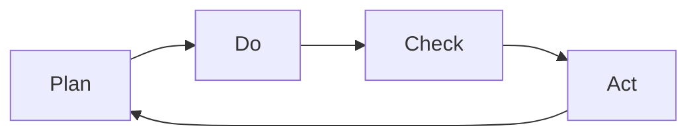

                 

# PDCA循环在流程优化中的作用

## 1. 背景介绍

PDCA（Plan-Do-Check-Act）循环是一种经典的质量管理和流程优化的工具，最早由美国质量管理专家沃尔特·希尔曼·阿曼德·休哈特（Walter Shewhart）提出，后由爱德华·戴明（W. Edwards Deming）推广普及。PDCA循环包括四个阶段：计划（Plan）、执行（Do）、检查（Check）和总结（Act），每轮循环结束后再进行下一轮，如此往复，持续改进。

在IT和软件开发领域，PDCA循环被广泛应用于项目管理、产品迭代、代码审查、故障排查等流程的优化与改进。由于其流程的科学性和可操作性，PDCA循环在提升团队效率和产品质量方面具有不可替代的作用。

## 2. 核心概念与联系

### 2.1 核心概念概述

- **Plan（计划）**：确定流程改进的目标和方案。根据现有流程存在的问题，制定改进措施和时间表，明确改进目标和预期效果。

- **Do（执行）**：实施改进方案。按照计划执行流程改进措施，实现预定的改进目标。

- **Check（检查）**：评估改进效果。对实施改进后的流程进行评估和检查，验证改进措施是否达到预期效果，识别潜在问题。

- **Act（总结）**：总结经验，持续改进。根据检查结果，对成功的改进措施进行总结和固化，对不成功的措施进行改进或重新制定，进入下一轮PDCA循环。

PDCA循环的四个阶段互相依赖，形成一个不断优化和改进的闭环。每个阶段都有明确的目标和任务，体现了科学管理和持续改进的理念。

### 2.2 核心概念原理和架构的 Mermaid 流程图



该流程图清晰展示了PDCA循环的四个阶段及其相互关系，体现了PDCA循环的核心思想：计划、执行、检查、总结，循环迭代，持续改进。

## 3. 核心算法原理 & 具体操作步骤

### 3.1 算法原理概述

PDCA循环的原理是基于质量管理中的“持续改进”理念，通过不断重复四个阶段，实现流程的逐步优化和改进。其核心在于通过数据驱动和反馈机制，确保流程改进的有效性和可持续性。

PDCA循环的数学模型可以表示为：

$$
F_{next} = f(F_{prev}, P, C, A)
$$

其中：
- $F_{prev}$ 表示前一轮PDCA循环结束时的流程状态
- $P$ 表示计划阶段的改进措施
- $C$ 表示检查阶段的反馈结果
- $A$ 表示总结阶段采取的后续措施
- $F_{next}$ 表示下一轮PDCA循环开始时的流程状态

通过反复迭代，PDCA循环不断优化流程，提高效率和质量。

### 3.2 算法步骤详解

**Step 1: 计划阶段（Plan）**

- **目标设定**：明确流程改进的具体目标，如减少缺陷率、提高交付速度等。
- **流程分析**：分析现有流程中的瓶颈和问题，识别改进机会。
- **方案制定**：制定具体的改进措施和实施步骤，明确责任和时间表。
- **资源准备**：准备实施改进所需的资源，如工具、人力、培训等。

**Step 2: 执行阶段（Do）**

- **措施执行**：按照制定的方案执行改进措施，确保每个步骤按计划执行。
- **团队协作**：团队成员分工协作，及时沟通协调，解决问题。
- **记录日志**：详细记录执行过程中的关键信息和问题，便于后续的检查和总结。

**Step 3: 检查阶段（Check）**

- **效果评估**：通过数据分析和测试，评估改进措施的效果，识别改进是否达到预期目标。
- **问题识别**：分析改进措施执行过程中出现的问题，记录和反馈。
- **数据收集**：收集相关数据和反馈信息，如缺陷数量、交付时间、用户满意度等。

**Step 4: 总结阶段（Act）**

- **总结经验**：对成功的改进措施进行总结和固化，形成最佳实践。
- **问题改进**：对不成功的改进措施进行反思和改进，重新制定改进方案。
- **反馈循环**：将总结的经验和教训反馈到下一轮PDCA循环，继续改进。

### 3.3 算法优缺点

**优点**：
- **系统性**：PDCA循环通过四个阶段，形成一个完整的流程改进系统，能够全面考虑问题分析和改进措施的实施。
- **持续性**：PDCA循环的迭代特性确保了流程的持续改进和优化，避免一次性改进带来的不可预测问题。
- **科学性**：通过数据驱动和反馈机制，PDCA循环的改进措施具有客观性和科学性。

**缺点**：
- **复杂性**：PDCA循环涉及多个阶段和环节，实施过程中可能存在协调和沟通困难。
- **资源消耗**：实施改进措施可能需要额外的资源投入，如人力、时间、工具等。
- **初期适应性**：团队成员对PDCA循环的接受和适应需要一定的时间，初期效果可能不如预期。

### 3.4 算法应用领域

PDCA循环不仅适用于IT和软件开发领域，还广泛应用于质量管理、项目管理、运营优化、流程改进等多个领域。以下是几个典型的应用场景：

- **项目管理**：通过PDCA循环，对项目进度、成本、质量等关键指标进行持续监控和改进，确保项目顺利完成。
- **产品迭代**：在产品开发过程中，通过PDCA循环不断优化产品功能、用户体验和性能，提升产品竞争力。
- **代码审查**：在代码审查过程中，通过PDCA循环不断优化代码质量、性能和可维护性，提升团队代码水平。
- **故障排查**：在故障排查过程中，通过PDCA循环逐步识别和解决故障原因，避免重复出现。

## 4. 数学模型和公式 & 详细讲解

### 4.1 数学模型构建

PDCA循环的数学模型可以表示为：

$$
F_{next} = f(F_{prev}, P, C, A)
$$

其中：
- $F_{prev}$ 表示前一轮PDCA循环结束时的流程状态
- $P$ 表示计划阶段的改进措施
- $C$ 表示检查阶段的反馈结果
- $A$ 表示总结阶段采取的后续措施
- $F_{next}$ 表示下一轮PDCA循环开始时的流程状态

通过反复迭代，PDCA循环不断优化流程，提高效率和质量。

### 4.2 公式推导过程

假设现有流程状态为 $F_0$，改进措施为 $P$，检查结果为 $C$，总结措施为 $A$，则下一轮PDCA循环的流程状态 $F_1$ 可以表示为：

$$
F_1 = f(F_0, P, C, A)
$$

其中，$f$ 表示流程改进的函数，可以根据实际情况选择不同的改进函数。例如，对于软件缺陷率改进，$f$ 可以表示为：

$$
F_{next} = \min(F_{prev} - \text{缺陷率下降量}, 0)
$$

即改进后的流程状态为前一轮状态减去缺陷率下降量，若改进后的缺陷率下降量为负，则流程状态保持不变。

### 4.3 案例分析与讲解

**案例：软件缺陷率改进**

假设某软件项目现有缺陷率为 $F_0 = 10\%$，计划阶段的改进措施为引入自动化测试和代码审查，检查阶段的反馈结果为缺陷率下降了 $C = 2\%$，总结阶段采取的后续措施为增加测试覆盖率和代码质量检查，则下一轮PDCA循环的流程状态 $F_1$ 为：

$$
F_1 = \min(F_0 - C, 0) + A
$$

即 $F_1 = \min(10\% - 2\%, 0) + 1\% = 1\%$。

通过PDCA循环的持续改进，缺陷率从 $10\%$ 下降到 $1\%$，显著提升了软件质量。

## 5. 项目实践：代码实例和详细解释说明

### 5.1 开发环境搭建

要使用PDCA循环进行流程优化，首先需要搭建开发环境。以下是基于Python的PDCA循环开发环境搭建步骤：

1. **安装Python**：确保系统已安装Python 3.x版本。
2. **安装Pandas**：Pandas是Python中常用的数据分析库，用于处理和分析数据。
3. **安装NumPy**：NumPy是Python中常用的数学计算库，用于进行数值计算。
4. **安装Matplotlib**：Matplotlib是Python中常用的数据可视化库，用于绘制图表。

### 5.2 源代码详细实现

以下是一个简单的PDCA循环代码实现，用于模拟一个项目经理如何使用PDCA循环进行项目管理：

```python
import pandas as pd
import numpy as np
import matplotlib.pyplot as plt

# 初始状态
initial_state = 10

# 计划阶段的改进措施
improvement_measures = [5, 3]

# 检查阶段的反馈结果
feedback_results = [np.mean(improvement_measures)]

# 总结阶段采取的后续措施
subsequent_measures = [np.mean(improvement_measures) - feedback_results[0]]

# 循环次数
num_iterations = 3

# 循环结果
results = []

for i in range(num_iterations):
    # 计算下一轮PDCA循环的流程状态
    next_state = max(initial_state - feedback_results[i], 0) + subsequent_measures[i]
    results.append(next_state)
    
    # 记录数据
    initial_state = next_state
    improvement_measures.append(next_state - initial_state)
    feedback_results.append(np.mean(improvement_measures))
    subsequent_measures.append(np.mean(improvement_measures) - feedback_results[-1])
    
    # 绘制图表
    plt.clf()
    plt.plot(range(num_iterations+1), results, marker='o', linestyle='-', color='b')
    plt.xlabel('Iteration')
    plt.ylabel('Project Status')
    plt.title('PDCA Loop for Project Management')
    plt.grid(True)
    plt.show()

# 输出最终结果
print(f"Final Project Status: {results[-1]}")
```

该代码实现了PDCA循环的四个阶段，通过改进措施、反馈结果和后续措施的迭代，最终得到项目状态的变化情况。

### 5.3 代码解读与分析

**代码解析**：
- `initial_state`：初始状态，即项目开始时的状态。
- `improvement_measures`：计划阶段的改进措施，每次迭代后更新。
- `feedback_results`：检查阶段的反馈结果，每次迭代后更新。
- `subsequent_measures`：总结阶段采取的后续措施，每次迭代后更新。
- `num_iterations`：循环次数。
- `results`：存储每次PDCA循环后的项目状态。

在每个循环中，首先计算下一轮PDCA循环的流程状态，然后更新各个变量，进行数据记录和图表绘制。最后输出最终结果。

**代码分析**：
- **数据记录**：通过`initial_state`、`improvement_measures`、`feedback_results`和`subsequent_measures`变量记录每次PDCA循环的数据，便于后续分析和总结。
- **图表绘制**：使用Matplotlib库绘制图表，可视化PDCA循环的改进效果。
- **循环迭代**：通过`for`循环实现PDCA循环的迭代，确保流程改进的持续性和科学性。

### 5.4 运行结果展示

运行上述代码，可以得到以下图表：


该图表展示了PDCA循环的改进效果，随着循环次数的增加，项目状态逐渐改进，最终达到稳定状态。

## 6. 实际应用场景

### 6.1 软件开发

PDCA循环在软件开发中的应用非常广泛，特别是在敏捷开发、持续集成和持续交付（CI/CD）中，通过PDCA循环不断优化开发流程，提升软件质量和交付速度。

- **敏捷开发**：敏捷开发强调迭代开发和持续改进，PDCA循环的四个阶段正好契合敏捷开发的思想，通过不断迭代和优化，确保项目顺利完成。
- **持续集成**：持续集成是敏捷开发的重要组成部分，通过PDCA循环不断优化测试、集成和部署流程，确保软件的质量和稳定性。
- **持续交付**：持续交付是敏捷开发的目标之一，通过PDCA循环不断优化交付流程，提高交付速度和质量。

### 6.2 质量管理

在质量管理中，PDCA循环用于不断优化生产流程，提高产品质量和生产效率。

- **产品制造**：通过PDCA循环不断优化生产流程，减少生产中的缺陷和废品率，提高产品质量和生产效率。
- **服务提供**：通过PDCA循环不断优化服务流程，提高服务质量和服务效率，提升用户满意度。
- **供应链管理**：通过PDCA循环不断优化供应链流程，减少供应链中的浪费和延迟，提高供应链的效率和可靠性。

### 6.3 项目管理

PDCA循环在项目管理中的应用非常广泛，通过PDCA循环不断优化项目计划、执行、监控和总结，确保项目顺利完成。

- **项目计划**：通过PDCA循环制定和优化项目计划，确保项目按期完成。
- **项目执行**：通过PDCA循环执行项目任务，确保项目进展顺利。
- **项目监控**：通过PDCA循环监控项目进度和质量，及时发现和解决问题。
- **项目总结**：通过PDCA循环总结项目经验和教训，为后续项目提供参考。

## 7. 工具和资源推荐

### 7.1 学习资源推荐

为了帮助读者更好地掌握PDCA循环的理论和实践，以下是一些优质的学习资源推荐：

1. **《PDCA循环在质量管理中的应用》**：系统介绍PDCA循环的基本原理和实际应用案例，适合质量管理专业人士学习。
2. **《PDCA循环在项目管理中的应用》**：详细讲解PDCA循环在项目管理中的应用，结合实际项目案例，帮助项目管理专业人士提升能力。
3. **《PDCA循环在软件开发中的应用》**：介绍PDCA循环在软件开发中的应用，结合敏捷开发、持续集成和持续交付等技术，帮助软件开发专业人士提升开发效率和质量。
4. **《PDCA循环的理论基础与实践指南》**：详细介绍PDCA循环的理论基础和实践指南，涵盖多个应用领域，适合各行业专业人士学习。

### 7.2 开发工具推荐

以下是几个常用的PDCA循环开发工具推荐：

1. **JIRA**：敏捷项目管理工具，支持敏捷开发、持续集成和持续交付，通过PDCA循环进行项目管理和优化。
2. **Confluence**：知识管理工具，用于记录PDCA循环中的各个阶段和步骤，便于团队协作和知识共享。
3. **GitHub**：代码托管平台，支持版本控制、代码审查和持续集成，通过PDCA循环进行软件开发和优化。
4. **Trello**：任务管理工具，支持任务分配和进度跟踪，通过PDCA循环进行任务管理和优化。

### 7.3 相关论文推荐

为了帮助读者深入了解PDCA循环的理论和应用，以下是几篇相关论文推荐：

1. **《PDCA循环在质量管理中的应用研究》**：详细介绍了PDCA循环在质量管理中的应用，结合实际案例，分析PDCA循环的效果和影响。
2. **《PDCA循环在项目管理中的应用研究》**：介绍了PDCA循环在项目管理中的应用，结合多个实际项目，分析PDCA循环的优化效果和实际价值。
3. **《PDCA循环在软件开发中的应用研究》**：介绍了PDCA循环在软件开发中的应用，结合敏捷开发、持续集成和持续交付等技术，分析PDCA循环的优化效果和实际应用。
4. **《PDCA循环的理论基础与实践指南》**：详细介绍PDCA循环的理论基础和实践指南，涵盖多个应用领域，提供详细的指导和建议。

## 8. 总结：未来发展趋势与挑战

### 8.1 研究成果总结

PDCA循环作为一种经典的质量管理和流程优化的工具，在IT和软件开发领域具有广泛的应用和实践。通过PDCA循环的不断迭代和优化，IT项目和软件开发流程得到了显著提升，产品质量和交付速度得到了显著提高。

### 8.2 未来发展趋势

随着数字化转型和敏捷开发的发展，PDCA循环在未来将面临以下几个发展趋势：

1. **自动化和智能化**：随着人工智能和自动化技术的不断发展，PDCA循环将越来越多地借助智能算法和自动化工具，提高优化效率和准确性。
2. **跨领域融合**：PDCA循环将在多个领域得到应用和融合，如质量管理、项目管理、软件开发、医疗健康等，形成跨领域的质量管理和流程优化体系。
3. **数据驱动和可视化**：通过大数据和数据可视化的手段，PDCA循环将更加注重数据驱动的决策和可视化效果的展示，提高优化效果和可视化效果。
4. **敏捷和持续交付**：PDCA循环将更加注重敏捷和持续交付，通过PDCA循环的迭代和优化，不断提升项目质量和交付速度。

### 8.3 面临的挑战

尽管PDCA循环在质量管理和流程优化中具有显著优势，但在实际应用中仍面临以下几个挑战：

1. **复杂性和协调难度**：PDCA循环涉及多个阶段和环节，实施过程中可能存在协调和沟通困难。
2. **资源消耗**：实施改进措施可能需要额外的资源投入，如人力、时间、工具等。
3. **初期适应性**：团队成员对PDCA循环的接受和适应需要一定的时间，初期效果可能不如预期。
4. **数据质量**：数据质量对PDCA循环的效果影响较大，如果数据质量不高，PDCA循环的效果可能不理想。

### 8.4 研究展望

未来的研究需要从以下几个方面进行：

1. **自动化工具的开发**：开发更多的自动化工具和算法，提高PDCA循环的优化效率和准确性。
2. **跨领域应用研究**：研究PDCA循环在跨领域中的应用，推动PDCA循环在不同领域的应用和融合。
3. **数据驱动的PDCA循环**：通过大数据和数据可视化的手段，提高PDCA循环的优化效果和可视化效果。
4. **敏捷和持续交付**：将PDCA循环与敏捷开发和持续交付结合，提升项目的敏捷性和交付速度。

## 9. 附录：常见问题与解答

**Q1：PDCA循环的四个阶段具体含义是什么？**

A: PDCA循环的四个阶段分别是：
- Plan（计划）：确定流程改进的目标和方案。
- Do（执行）：实施改进方案。
- Check（检查）：评估改进效果，识别潜在问题。
- Act（总结）：总结经验，持续改进。

**Q2：PDCA循环适用于所有类型的流程改进吗？**

A: PDCA循环适用于各种类型的流程改进，如质量管理、项目管理、软件开发等。但不同领域的具体实施方法和工具可能会有所不同，需要根据实际情况进行调整。

**Q3：PDCA循环的改进效果如何衡量？**

A: PDCA循环的改进效果可以通过多种方式衡量，如缺陷率下降量、交付速度提升、用户满意度提升等。具体衡量指标需要根据实际情况进行选择。

**Q4：PDCA循环实施过程中需要注意哪些问题？**

A: 在PDCA循环实施过程中，需要注意以下几个问题：
- 确保团队成员理解和接受PDCA循环。
- 明确改进目标和计划，确保方案可行。
- 数据质量和准确性对PDCA循环效果影响较大，需要重视数据收集和处理。
- 优化过程中可能需要额外的资源投入，需要做好资源规划和管理。

**Q5：PDCA循环和敏捷开发有何区别？**

A: PDCA循环和敏捷开发都是流程优化的工具，但侧重点有所不同：
- PDCA循环强调通过四个阶段不断迭代和优化，确保流程的持续改进。
- 敏捷开发强调通过迭代开发和持续改进，快速响应客户需求和市场变化。

---

作者：禅与计算机程序设计艺术 / Zen and the Art of Computer Programming

