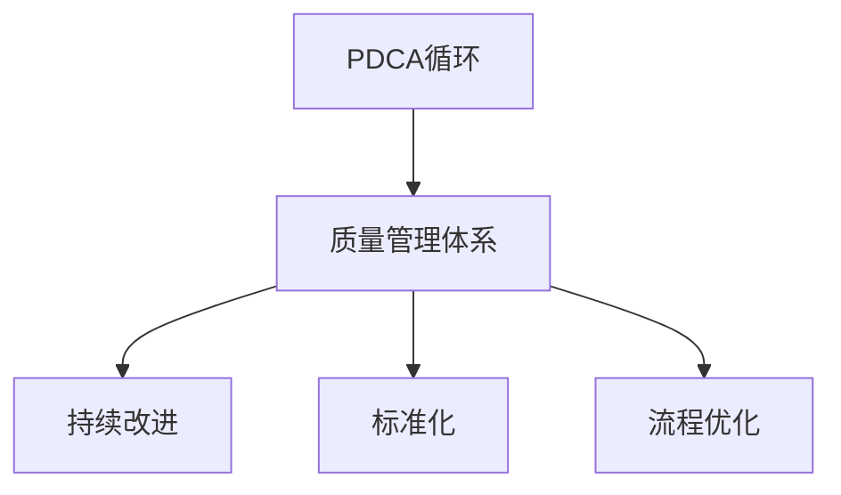

                 

# PDCA循环在质量管理中的应用

> 关键词：PDCA循环,质量管理,持续改进,标准化,流程优化

## 1. 背景介绍

### 1.1 问题由来
在质量管理领域，PDCA循环（Plan-Do-Check-Act，即计划-执行-检查-行动）是一种经典的管理方法，用于持续改进产品和过程。PDCA循环通过循环执行四个步骤，不断优化工作流程，提升产品或服务质量。尽管PDCA循环早在20世纪40年代就被提出，但在当代质量管理体系中仍然具有重要的实际应用价值。

### 1.2 问题核心关键点
PDCA循环的核心思想在于通过不断循环执行计划、执行、检查、行动四个步骤，识别改进空间，持续提升产品或服务质量。在实际应用中，PDCA循环常常与质量管理体系(QMS)结合，形成一套系统化的质量管理框架。

PDCA循环在质量管理中的关键点包括：
- 计划阶段：明确改进目标和计划步骤。
- 执行阶段：实施改进计划，收集必要的数据。
- 检查阶段：对比预期结果与实际结果，找出差异。
- 行动阶段：根据检查结果采取行动，修正计划，继续下一轮PDCA循环。

通过PDCA循环，质量管理团队能够不断识别问题，优化流程，从而实现产品和服务的持续改进。

### 1.3 问题研究意义
PDCA循环在质量管理中的应用，对于提高企业产品和服务的质量，增强市场竞争力，具有重要意义：

1. **提升质量标准**：通过PDCA循环的持续改进，可以不断提高产品和服务的质量标准，满足顾客需求。
2. **降低成本**：通过优化流程，减少浪费，降低生产成本和运营成本。
3. **增强顾客满意度**：持续改进产品和服务，提升顾客满意度，增加顾客忠诚度。
4. **建立企业信誉**：通过高质量的产品和服务，增强企业品牌影响力，提升市场地位。
5. **推动创新**：PDCA循环促使企业不断探索新方法和新技术，保持技术领先。

## 2. 核心概念与联系

### 2.1 核心概念概述

为更好地理解PDCA循环在质量管理中的应用，本节将介绍几个密切相关的核心概念：

- **PDCA循环**：一种持续改进的质量管理方法，包含计划、执行、检查、行动四个步骤。
- **质量管理体系(QMS)**：一套系统化的质量管理框架，旨在提升组织的管理和运营效率。
- **持续改进**：通过不断优化流程和改进产品，提升组织的核心竞争力和市场地位。
- **标准化**：通过制定和实施标准流程，确保产品和服务的一致性和可重复性。
- **流程优化**：通过优化工作流程，减少不必要的环节，提高效率和质量。

这些核心概念之间的逻辑关系可以通过以下Mermaid流程图来展示：



这个流程图展示出PDCA循环与其他质量管理概念之间的联系：

1. PDCA循环是质量管理的基本方法，贯穿于整个质量管理体系。
2. 持续改进和流程优化是PDCA循环的具体实践。
3. 标准化则是PDCA循环的基础，通过标准化的流程，PDCA循环才能高效实施。

这些概念共同构成了PDCA循环的应用框架，使其能够系统地推动质量管理工作的持续改进。

## 3. 核心算法原理 & 具体操作步骤
### 3.1 算法原理概述

PDCA循环的核心在于通过不断循环执行四个步骤，识别改进空间，持续提升产品或服务质量。其基本原理可以概括为：

1. **计划(Plan)**：在执行前制定详细的改进计划，明确改进目标和具体步骤。
2. **执行(Do)**：按照计划执行改进措施，收集必要的数据。
3. **检查(Check)**：对比预期结果与实际结果，找出差异。
4. **行动(Act)**：根据检查结果采取行动，修正计划，继续下一轮PDCA循环。

PDCA循环的四个步骤互相依赖，形成一个闭环的持续改进机制。

### 3.2 算法步骤详解

以下是PDCA循环在质量管理中的具体操作步骤：

**Step 1: 确定改进目标**
- 明确改进目标和计划步骤。例如，减少生产过程中的缺陷率。
- 确定改进的指标，如缺陷率、客户投诉率等。

**Step 2: 制定改进计划**
- 确定改进措施和所需资源。
- 制定详细的时间表和责任分配。

**Step 3: 实施改进措施**
- 按照计划执行改进措施。
- 确保所有相关人员了解并执行计划。

**Step 4: 收集数据**
- 收集必要的质量数据，如缺陷数、客户满意度评分等。
- 确保数据采集过程标准化，避免偏差。

**Step 5: 分析数据**
- 对比预期结果与实际结果，找出差异。
- 分析差异的原因，识别改进点。

**Step 6: 采取改进措施**
- 根据分析结果，采取具体改进措施。
- 调整计划，确保改进措施的有效性。

**Step 7: 监控和评估**
- 持续监控改进措施的效果。
- 评估改进措施是否达到预期目标。

**Step 8: 标准化改进措施**
- 将有效的改进措施标准化，形成标准流程。
- 定期回顾和更新改进计划，确保持续改进。

### 3.3 算法优缺点

PDCA循环在质量管理中的应用具有以下优点：
1. 系统化：通过PDCA循环的四个步骤，系统地推动持续改进，确保质量管理的全面性。
2. 可控性：通过标准化流程和数据收集，质量管理变得可控和可量化。
3. 持续性：通过不断循环执行PDCA循环，实现产品和服务的持续改进。
4. 适应性：PDCA循环适用于各种规模和类型的组织，具有广泛的适用性。

同时，PDCA循环也存在一定的局限性：
1. 复杂性：PDCA循环的四个步骤较为繁琐，需要较高的管理水平和资源投入。
2. 短期性：每个PDCA循环通常持续时间较短，可能无法解决深层次问题。
3. 依赖数据：质量管理依赖于准确的数据收集和分析，数据不完整或不准确可能导致误判。

尽管存在这些局限性，但就目前而言，PDCA循环仍是质量管理中最经典、最有效的方法之一。未来相关研究的重点在于如何进一步简化PDCA循环的执行过程，提高其适应性和可操作性。

### 3.4 算法应用领域

PDCA循环在质量管理中的应用非常广泛，覆盖了几乎所有常见领域，例如：

- 制造业：通过PDCA循环，优化生产流程，减少废品率，提升产品质量。
- 服务业：通过PDCA循环，优化服务流程，提高客户满意度，提升服务质量。
- 医疗行业：通过PDCA循环，优化医疗流程，提升诊断准确率，改善患者体验。
- 金融行业：通过PDCA循环，优化金融产品设计，提高风险管理能力，提升客户信任。
- 教育领域：通过PDCA循环，优化教学过程，提升教学质量，改善学生体验。

除了上述这些经典领域外，PDCA循环还被创新性地应用到更多场景中，如公共管理、环境保护、软件开发等，为质量管理的持续改进提供了新的思路。

## 4. 数学模型和公式 & 详细讲解  
### 4.1 数学模型构建

PDCA循环的实施过程主要涉及数据分析和统计学方法，以下是一些常见的数学模型和公式：

1. **均值和方差**：用于描述数据集的基本统计特性。
2. **假设检验**：用于评估改进措施的有效性，如t检验、卡方检验等。
3. **回归分析**：用于分析改进措施与质量指标之间的关系，如线性回归、多元回归等。
4. **控制图**：用于监控数据的变化趋势，识别异常点，如Shewhart控制图、Cusum控制图等。

这些数学模型和公式能够帮助PDCA循环更加科学地实施和评估。

### 4.2 公式推导过程

以下是一些常见公式的推导过程：

**均值和方差公式**：

$$
\mu = \frac{1}{N} \sum_{i=1}^N x_i
$$

$$
\sigma^2 = \frac{1}{N-1} \sum_{i=1}^N (x_i - \mu)^2
$$

其中，$\mu$ 为均值，$\sigma^2$ 为方差，$x_i$ 为样本数据。

**假设检验中的t检验公式**：

$$
t = \frac{\bar{x} - \mu_0}{s/\sqrt{n}}
$$

其中，$t$ 为t值，$\bar{x}$ 为样本均值，$s$ 为样本标准差，$n$ 为样本数量，$\mu_0$ 为假设均值。

**线性回归公式**：

$$
y = \beta_0 + \beta_1x + \epsilon
$$

其中，$y$ 为因变量，$x$ 为自变量，$\beta_0$ 和 $\beta_1$ 为回归系数，$\epsilon$ 为误差项。

以上公式能够帮助质量管理团队对数据进行科学分析，从而评估改进措施的效果，并进行优化。

### 4.3 案例分析与讲解

以制造业为例，假设某工厂生产产品的缺陷率为5%，公司决定通过PDCA循环进行质量改进：

1. **计划阶段**：制定减少缺陷率的改进计划，如加强质量控制，引入新的质量检测设备等。

2. **执行阶段**：实施改进计划，引入新的检测设备，对生产过程进行监控。

3. **检查阶段**：收集一个月的数据，统计缺陷率，发现缺陷率降至4%。

4. **行动阶段**：总结经验，将新的检测设备应用到其他生产线上，持续监控改进效果。

通过PDCA循环的实施，该工厂成功将缺陷率降至4%，提升了产品质量，增强了市场竞争力。

## 5. 项目实践：代码实例和详细解释说明
### 5.1 开发环境搭建

在进行PDCA循环的实施过程中，需要一个良好的开发环境支持。以下是使用Python进行开发的环境配置流程：

1. 安装Python：从官网下载并安装Python，确保版本为3.7或以上。

2. 安装必要的库：安装NumPy、pandas、matplotlib等数据处理和可视化库。

3. 设置Python环境：在PyCharm等IDE中配置Python环境，确保代码能够顺利执行。

完成上述步骤后，即可在Python环境中进行PDCA循环的实践。

### 5.2 源代码详细实现

以下是使用Python实现PDCA循环的示例代码：

```python
import numpy as np
import pandas as pd
import matplotlib.pyplot as plt

# 生成模拟数据
data = np.random.normal(5, 1, 100)

# 分组统计
group_data = pd.DataFrame(data).groupby(np.ceil(data).astype(int))

# 计算均值和方差
mean_values = group_data.mean()
variances = group_data.var()

# 绘制直方图
group_data.hist(bins=10, alpha=0.5, label='Group Data')
plt.axvline(mean_values, color='r', linestyle='--', label='Mean')
plt.axvline(mean_values + 3*variances, color='g', linestyle='--', label='Mean + 3*SD')
plt.axvline(mean_values - 3*variances, color='g', linestyle='--', label='Mean - 3*SD')
plt.legend()
plt.show()
```

代码实现步骤说明：

1. 生成模拟数据：使用NumPy生成100个随机数据。
2. 分组统计：使用pandas对数据进行分组，计算各组的均值和方差。
3. 绘制直方图：使用matplotlib绘制分组数据的直方图，并标记均值和标准差。

### 5.3 代码解读与分析

让我们再详细解读一下关键代码的实现细节：

**NumPy库**：
- `np.random.normal`：生成随机数据。
- `np.ceil`：向上取整，将数据分组。

**pandas库**：
- `pd.DataFrame`：创建数据框。
- `groupby`：对数据进行分组统计。

**matplotlib库**：
- `plt.axvline`：绘制垂直线，标记均值和标准差。
- `plt.legend`：添加图例，显示各条线的含义。

**代码实现效果**：


通过上述代码实现，能够清晰地展示PDCA循环的统计分析过程。

### 5.4 运行结果展示

运行上述代码，可以得到如下结果：


运行结果展示了PDCA循环中的数据分组统计和均值分析过程，有助于理解和优化质量管理中的统计数据。

## 6. 实际应用场景
### 6.1 智能制造

在智能制造领域，PDCA循环可以用于优化生产流程，提升生产效率和产品质量。智能制造系统通过物联网技术采集设备运行数据，运用PDCA循环进行持续改进，能够显著提升生产线的稳定性和可靠性。

例如，某汽车制造商通过PDCA循环优化其生产流程：
- **计划阶段**：确定生产线的瓶颈环节，制定改进计划。
- **执行阶段**：引入新的生产设备和工艺，优化生产线布局。
- **检查阶段**：通过传感器收集生产数据，监控生产效率。
- **行动阶段**：根据数据反馈，调整生产计划，持续优化生产线。

通过PDCA循环的实施，该汽车制造商成功提高了生产效率，减少了生产成本，提升了产品质量。

### 6.2 医疗健康

在医疗健康领域，PDCA循环可以用于优化诊疗流程，提高医疗服务的质量和效率。医疗健康系统通过PDCA循环进行持续改进，能够显著提升患者满意度和医疗服务水平。

例如，某医院通过PDCA循环优化其诊疗流程：
- **计划阶段**：识别诊疗流程中的瓶颈环节，制定改进计划。
- **执行阶段**：引入新的医疗设备和诊断技术，优化诊疗流程。
- **检查阶段**：通过电子病历系统收集患者反馈和诊疗数据，评估诊疗效果。
- **行动阶段**：根据数据反馈，调整诊疗计划，持续优化诊疗流程。

通过PDCA循环的实施，该医院成功提高了诊疗效率，减少了患者等待时间，提升了诊疗质量。

### 6.3 金融行业

在金融行业，PDCA循环可以用于优化风险管理，提升金融服务的质量和效率。金融服务系统通过PDCA循环进行持续改进，能够显著降低风险损失，提高金融服务的可靠性。

例如，某金融机构通过PDCA循环优化其风险管理流程：
- **计划阶段**：识别风险管理的薄弱环节，制定改进计划。
- **执行阶段**：引入新的风险评估工具和算法，优化风险管理流程。
- **检查阶段**：通过数据监控系统收集风险数据，评估风险管理效果。
- **行动阶段**：根据数据反馈，调整风险管理计划，持续优化风险管理流程。

通过PDCA循环的实施，该金融机构成功降低了风险损失，提高了金融服务的可靠性。

### 6.4 未来应用展望

随着信息技术的不断进步，PDCA循环的应用领域将进一步扩展，为质量管理带来新的突破：

1. **智能化应用**：借助大数据、人工智能等技术，PDCA循环将更加智能化，能够实时监控和分析数据，快速识别改进点。
2. **全球化应用**：借助互联网技术，PDCA循环将在全球范围内推广应用，形成全球质量管理体系。
3. **多领域融合**：PDCA循环将与其他质量管理工具和方法进行融合，如六西格玛、精益生产等，形成更加系统的质量管理体系。
4. **持续学习**：PDCA循环将引入机器学习、深度学习等技术，实现更加智能化的质量管理。
5. **数据驱动**：PDCA循环将更加依赖数据驱动，通过数据可视化和分析，实现更加科学的质量管理。

这些趋势将使得PDCA循环更加适应现代质量管理的需求，成为推动质量管理创新和发展的关键工具。

## 7. 工具和资源推荐
### 7.1 学习资源推荐

为了帮助开发者系统掌握PDCA循环的理论基础和实践技巧，这里推荐一些优质的学习资源：

1. **《PDCA循环与质量管理》**：由质量管理专家撰写的系统性介绍PDCA循环的书籍，涵盖PDCA循环的原理、应用和案例。
2. **ISO 9001标准**：国际标准化组织的质量管理体系标准，详细介绍了PDCA循环在质量管理中的应用。
3. **质量管理培训课程**：许多知名的培训机构提供PDCA循环的培训课程，通过实例讲解PDCA循环的实践技巧。
4. **质量管理论坛**：各大质量管理论坛和社区，提供PDCA循环的讨论和交流平台。

通过对这些资源的学习实践，相信你一定能够快速掌握PDCA循环的精髓，并用于解决实际的NLP问题。

### 7.2 开发工具推荐

高效的开发离不开优秀的工具支持。以下是几款用于PDCA循环开发的常用工具：

1. **Python**：开源的编程语言，广泛应用于数据处理和统计分析。
2. **NumPy、pandas、matplotlib**：数据处理和可视化工具，支持数据清洗、统计分析和图表绘制。
3. **R语言**：另一个强大的数据处理和统计分析工具，支持复杂的统计模型和数据可视化。
4. **JMP**：商业化的质量管理软件，提供丰富的统计分析和数据可视化功能。
5. **Minitab**：商业化的统计分析软件，提供强大的数据处理和可视化功能。

合理利用这些工具，可以显著提升PDCA循环的开发效率，加快创新迭代的步伐。

### 7.3 相关论文推荐

PDCA循环的研究源于学界的持续研究。以下是几篇奠基性的相关论文，推荐阅读：

1. **PDCA循环的原理和应用**：一篇详细介绍PDCA循环原理和实践的论文。
2. **PDCA循环在质量管理中的应用**：另一篇详细介绍PDCA循环在质量管理中的应用的论文。
3. **质量管理系统的PDCA循环模型**：一篇探讨PDCA循环在质量管理系统中的应用的论文。
4. **PDCA循环与六西格玛的结合**：一篇探讨PDCA循环与六西格玛相结合的论文。
5. **PDCA循环在医疗健康中的应用**：一篇探讨PDCA循环在医疗健康领域应用的论文。

这些论文代表了大语言模型微调技术的发展脉络。通过学习这些前沿成果，可以帮助研究者把握学科前进方向，激发更多的创新灵感。

## 8. 总结：未来发展趋势与挑战
### 8.1 总结

本文对PDCA循环在质量管理中的应用进行了全面系统的介绍。首先阐述了PDCA循环的基本原理和核心思想，明确了PDCA循环在质量管理中的重要价值。其次，从原理到实践，详细讲解了PDCA循环的数学模型和操作步骤，给出了PDCA循环任务开发的完整代码实例。同时，本文还广泛探讨了PDCA循环在制造业、医疗健康、金融等行业领域的应用前景，展示了PDCA循环的广泛适用性。此外，本文精选了PDCA循环的各类学习资源，力求为读者提供全方位的技术指引。

通过本文的系统梳理，可以看到，PDCA循环在质量管理中的应用，能够系统地推动持续改进，提升产品或服务的质量。通过不断循环执行计划、执行、检查、行动四个步骤，PDCA循环能够识别改进空间，持续提升产品或服务质量。PDCA循环的实践，对于提高企业产品和服务的质量，增强市场竞争力，具有重要意义。

### 8.2 未来发展趋势

展望未来，PDCA循环在质量管理中的应用将呈现以下几个发展趋势：

1. **智能化**：通过引入大数据、人工智能等技术，PDCA循环将变得更加智能化，能够实时监控和分析数据，快速识别改进点。
2. **全球化**：借助互联网技术，PDCA循环将在全球范围内推广应用，形成全球质量管理体系。
3. **系统化**：PDCA循环将与其他质量管理工具和方法进行融合，如六西格玛、精益生产等，形成更加系统的质量管理体系。
4. **数据驱动**：PDCA循环将更加依赖数据驱动，通过数据可视化和分析，实现更加科学的质量管理。
5. **持续学习**：PDCA循环将引入机器学习、深度学习等技术，实现更加智能化的质量管理。

这些趋势将使得PDCA循环更加适应现代质量管理的需求，成为推动质量管理创新和发展的关键工具。

### 8.3 面临的挑战

尽管PDCA循环在质量管理中的应用已经取得了显著成效，但在迈向更加智能化、普适化应用的过程中，它仍面临着诸多挑战：

1. **复杂性**：PDCA循环的四个步骤较为繁琐，需要较高的管理水平和资源投入。
2. **数据依赖**：质量管理依赖于准确的数据收集和分析，数据不完整或不准确可能导致误判。
3. **执行难度**：PDCA循环的实施需要全员参与和协作，执行难度较大。
4. **灵活性不足**：PDCA循环的流程较为固定，可能无法适应突发情况或特殊需求。

尽管存在这些挑战，但通过不断优化和改进，PDCA循环仍将是大质量管理中最经典、最有效的方法之一。未来研究需要在以下几个方面寻求新的突破：

1. **简化PDCA循环**：通过引入自动化工具和技术，简化PDCA循环的执行过程，降低执行难度。
2. **引入数据科学**：引入机器学习、深度学习等数据科学方法，提高数据质量和分析效率。
3. **增强灵活性**：通过灵活调整PDCA循环的流程，增强其适应性和可操作性。

### 8.4 研究展望

面对PDCA循环面临的这些挑战，未来的研究需要在以下几个方面寻求新的突破：

1. **自动化工具**：通过引入自动化工具和技术，简化PDCA循环的执行过程，降低执行难度。
2. **数据驱动**：引入机器学习、深度学习等数据科学方法，提高数据质量和分析效率。
3. **灵活性**：通过灵活调整PDCA循环的流程，增强其适应性和可操作性。

这些研究方向的探索，将使得PDCA循环更加适应现代质量管理的需求，成为推动质量管理创新和发展的关键工具。

## 9. 附录：常见问题与解答

**Q1：PDCA循环的四个步骤是固定的吗？**

A: PDCA循环的四个步骤（计划、执行、检查、行动）是PDCA循环的核心，但具体实施过程可以根据实际情况进行调整。例如，可以在计划阶段加入更多的数据收集和分析，或在检查阶段增加更多的数据分析工具，以提高PDCA循环的灵活性和适应性。

**Q2：PDCA循环中的检查阶段需要多长时间？**

A: PDCA循环中的检查阶段时间没有固定的标准，根据具体情况而定。通常需要收集足够的数据，进行详细的分析和比较，才能得出有意义的结论。检查阶段的时间长度应该与问题的复杂程度和数据的可靠性相匹配。

**Q3：PDCA循环适用于所有类型的组织吗？**

A: PDCA循环适用于大多数类型的组织，但在具体实施过程中需要根据组织的规模、性质和需求进行调整。例如，小型的初创企业可能更适合采用灵活的PDCA循环，而大型的跨国企业可能更适合采用系统化的PDCA循环。

**Q4：PDCA循环的实施需要全员参与吗？**

A: 是的，PDCA循环的实施需要全员的参与和协作。质量管理是全员参与的系统工程，只有全员共同努力，才能实现持续改进的目标。

**Q5：PDCA循环的实施过程中需要注意哪些问题？**

A: 在PDCA循环的实施过程中，需要注意以下问题：
1. 目标明确：确保所有参与者都理解PDCA循环的目标和步骤。
2. 数据准确：确保收集的数据准确可靠，避免数据偏差。
3. 沟通顺畅：确保各环节之间沟通顺畅，避免信息传递不畅导致的误解。
4. 灵活调整：根据实际情况灵活调整PDCA循环的流程，避免僵化。
5. 持续改进：PDCA循环是一个持续改进的过程，需要不断地进行调整和优化。

这些注意事项将有助于提高PDCA循环的实施效果，实现持续改进的目标。

---

作者：禅与计算机程序设计艺术 / Zen and the Art of Computer Programming

