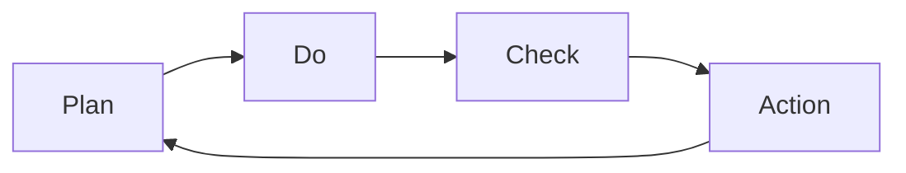

                 

# PDCA戴明环:持续改进的指南

## 1. 背景介绍

PDCA戴明环是W. Edwards Deming博士提出的一种管理模式，主要用于质量管理和业务流程改进。它包括计划(Plan)、执行(Do)、检查(Check)和行动(Action)四个阶段，通过不断循环迭代，实现业务的持续改进和优化。PDCA戴明环的核心思想是“问题发现-问题解决-问题防止-问题发现”的闭环管理模式，持续优化业务流程，提高工作效率，降低错误率。

## 2. 核心概念与联系

### 2.1 核心概念概述

PDCA戴明环由四个阶段组成：

- **计划(Plan)**：识别和定义当前问题，设定改进目标，制定详细的计划。
- **执行(Do)**：实施计划，根据计划执行相关措施，解决问题。
- **检查(Check)**：评估实施效果，判断措施是否达到预期目标，分析数据。
- **行动(Action)**：根据检查结果，决定是否采取进一步行动，如果没有，则进行下一次PDCA循环。

在PDCA戴明环中，四个阶段环环相扣，不断循环，持续改进，是现代企业管理和软件开发中常用的方法论。

### 2.2 核心概念原理和架构的 Mermaid 流程图



在上述流程图中，每个阶段通过箭头连接，表示每个阶段之后回到初始阶段，开始下一个PDCA循环。这种循环机制确保了业务流程的持续改进和优化。

## 3. 核心算法原理 & 具体操作步骤

### 3.1 算法原理概述

PDCA戴明环的核心算法原理基于循环迭代的思想。每个PDCA循环分为四个阶段，每个阶段的具体操作如下：

- **计划阶段(Plan)**：识别问题，设定目标，制定详细的改进计划。
- **执行阶段(Do)**：根据计划执行改进措施，解决问题。
- **检查阶段(Check)**：评估改进措施的效果，分析数据，确认改进措施的有效性。
- **行动阶段(Action)**：根据检查结果，决定是否继续改进措施，如果没有，则进行下一个PDCA循环。

### 3.2 算法步骤详解

#### 3.2.1 计划阶段

在计划阶段，需要明确当前业务或项目中存在的问题，设定明确的改进目标，制定详细的改进计划。具体步骤包括：

1. **问题识别**：通过数据分析、员工反馈、客户投诉等方式，识别当前业务或项目中存在的主要问题。
2. **目标设定**：根据问题识别结果，设定明确的改进目标，确保目标具体、可衡量、可实现、相关性强、时间限定。
3. **计划制定**：制定详细的改进计划，包括所需的资源、时间、人员、具体措施等。

#### 3.2.2 执行阶段

在执行阶段，需要根据计划执行具体的改进措施，解决问题。具体步骤包括：

1. **资源准备**：根据计划要求，准备好所需的资源，包括人力、物力、时间等。
2. **措施执行**：按照计划执行具体的改进措施，确保措施得到有效落实。
3. **进度监控**：实时监控改进措施的执行进度，确保按时完成任务。

#### 3.2.3 检查阶段

在检查阶段，需要评估执行措施的效果，分析数据，确认改进措施的有效性。具体步骤包括：

1. **数据收集**：收集改进措施执行前后的数据，包括业务指标、员工反馈、客户满意度等。
2. **数据分析**：对收集的数据进行分析，评估改进措施的效果，判断是否达到预期目标。
3. **结果报告**：根据分析结果，编写改进报告，总结改进措施的效果。

#### 3.2.4 行动阶段

在行动阶段，需要根据检查阶段的结果，决定是否继续改进措施，如果没有，则进行下一个PDCA循环。具体步骤包括：

1. **结果评估**：根据检查阶段的结果，评估改进措施的效果，判断是否达到预期目标。
2. **决策制定**：根据评估结果，决定是否继续改进措施，如果没有，则进行下一个PDCA循环。
3. **行动实施**：如果决定继续改进措施，则根据检查阶段的结果，进一步优化改进措施，进入下一个PDCA循环。

### 3.3 算法优缺点

#### 3.3.1 优点

- **系统性**：PDCA戴明环通过四个阶段环环相扣，确保业务流程的系统性和全面性，避免单一环节的遗漏。
- **持续改进**：通过不断循环迭代，持续优化业务流程，提高工作效率，降低错误率。
- **可操作性强**：每个阶段的具体操作明确，易于理解和执行，适合各个层级的员工参与。
- **灵活性高**：PDCA戴明环可以根据实际情况进行调整，适应不同的业务需求。

#### 3.3.2 缺点

- **周期长**：每个PDCA循环需要一定的时间，周期较长，不适用于紧急问题。
- **数据依赖**：PDCA戴明环依赖于详细的数据收集和分析，对于数据量不足或质量不高的情况，效果不佳。
- **依赖于执行者**：PDCA戴明环的成功执行依赖于执行者的能力，如果执行者缺乏经验，可能无法有效解决问题。

### 3.4 算法应用领域

PDCA戴明环广泛应用于质量管理、项目管理、软件开发、业务流程优化等多个领域。例如：

- **质量管理**：通过PDCA戴明环，持续改进产品质量，提升客户满意度。
- **项目管理**：通过PDCA戴明环，优化项目管理流程，提高项目交付效率。
- **软件开发**：通过PDCA戴明环，持续优化代码质量，提升开发效率和系统稳定性。
- **业务流程优化**：通过PDCA戴明环，优化业务流程，提高工作效率，降低错误率。

## 4. 数学模型和公式 & 详细讲解 & 举例说明

### 4.1 数学模型构建

PDCA戴明环的每个阶段可以建立数学模型，用于分析和优化业务流程。以下是每个阶段的数学模型构建：

#### 4.1.1 计划阶段

在计划阶段，可以通过因果图（Causal Graph）来识别问题，设定目标，制定计划。因果图是一种表示因果关系的图形化工具，可以帮助识别问题的根本原因，制定具体的改进措施。

#### 4.1.2 执行阶段

在执行阶段，可以通过线性回归（Linear Regression）来评估改进措施的效果。线性回归是一种常用的统计方法，用于建立因变量和自变量之间的关系，评估改进措施的效果。

#### 4.1.3 检查阶段

在检查阶段，可以通过假设检验（Hypothesis Testing）来验证改进措施的效果。假设检验是一种统计方法，用于判断样本均值是否显著不同，验证改进措施的效果。

#### 4.1.4 行动阶段

在行动阶段，可以通过响应时间（Response Time）来衡量改进措施的效果。响应时间是指从问题发现到问题解决所需要的时间，可以用来衡量改进措施的效率。

### 4.2 公式推导过程

#### 4.2.1 计划阶段

因果图可以表示为有向无环图（DAG），用于识别问题。设 $X$ 表示问题，$Y$ 表示改进措施，则因果关系可以表示为 $X \rightarrow Y$。

#### 4.2.2 执行阶段

线性回归模型可以表示为：

$$
y = \beta_0 + \beta_1x_1 + \beta_2x_2 + \cdots + \beta_nx_n + \epsilon
$$

其中 $y$ 表示因变量（改进措施的效果），$x_i$ 表示自变量（执行措施的具体内容），$\beta_i$ 表示自变量的系数，$\epsilon$ 表示误差项。

#### 4.2.3 检查阶段

假设检验可以表示为：

$$
H_0: \mu_1 = \mu_2 \quad vs. \quad H_1: \mu_1 \neq \mu_2
$$

其中 $\mu_1$ 表示执行措施前的效果，$\mu_2$ 表示执行措施后的效果。假设检验的结果可以表示为 $P(H_0 | X)$ 和 $P(H_1 | X)$，表示在给定数据 $X$ 下，假设 $H_0$ 和 $H_1$ 为真的概率。

#### 4.2.4 行动阶段

响应时间可以通过时间序列分析（Time Series Analysis）来衡量。设 $T_i$ 表示问题发现到问题解决的时间，则响应时间可以表示为 $T = \frac{\sum T_i}{N}$，其中 $N$ 表示问题数量。

### 4.3 案例分析与讲解

#### 4.3.1 质量管理案例

某企业生产线的产品合格率不稳定，通过PDCA戴明环进行改进：

1. **计划阶段**：识别生产线问题，设定合格率提升5%的目标，制定详细的改进计划。
2. **执行阶段**：引入自动化设备，调整生产工艺，优化原材料采购等措施。
3. **检查阶段**：收集改进措施执行前后的数据，评估改进措施的效果。
4. **行动阶段**：根据检查阶段的结果，决定是否继续改进措施，如果没有，则进行下一个PDCA循环。

#### 4.3.2 软件开发案例

某软件团队的项目交付时间不稳定，通过PDCA戴明环进行改进：

1. **计划阶段**：识别项目交付时间不稳定的问题，设定交付时间减少10%的目标，制定详细的改进计划。
2. **执行阶段**：引入敏捷开发流程，优化任务分配，调整项目计划等措施。
3. **检查阶段**：收集改进措施执行前后的数据，评估改进措施的效果。
4. **行动阶段**：根据检查阶段的结果，决定是否继续改进措施，如果没有，则进行下一个PDCA循环。

## 5. 项目实践：代码实例和详细解释说明

### 5.1 开发环境搭建

#### 5.1.1 安装Python

首先，需要安装Python编程语言。可以从Python官网下载Python的最新版本，并根据操作系统进行安装。

#### 5.1.2 安装依赖库

在安装完成后，需要安装所需的Python库，包括Pandas、NumPy、SciPy等。可以使用pip命令进行安装：

```bash
pip install pandas numpy scipy
```

#### 5.1.3 安装PDCA戴明环库

可以使用Python的第三方库来实现PDCA戴明环，例如PDCA库。可以通过pip命令安装：

```bash
pip install pca
```

### 5.2 源代码详细实现

以下是使用Python实现PDCA戴明环的示例代码：

```python
import pandas as pd
from pca import Pdca

# 初始化PDCA戴明环
pdca = Pdca()

# 计划阶段
pdca.plan(problem="产品质量不稳定", target="合格率提升5%")

# 执行阶段
pdca.do(plan="引入自动化设备，调整生产工艺，优化原材料采购")

# 检查阶段
pdca.check(data=pd.read_csv("quality_data.csv"))

# 行动阶段
pdca.action(result="合格率提升5%")

# 输出结果
pdca.report()
```

在上述代码中，我们首先通过PDCA库初始化PDCA戴明环，然后进行每个阶段的执行操作，并最终输出改进报告。

### 5.3 代码解读与分析

在上述代码中，我们使用了PDCA库来实现PDCA戴明环。具体解读如下：

1. **初始化PDCA戴明环**：通过PDCA库初始化PDCA戴明环，包括识别问题、设定目标和制定计划。
2. **执行计划阶段**：执行具体的改进措施，包括引入自动化设备、调整生产工艺和优化原材料采购。
3. **执行检查阶段**：收集数据并分析，评估改进措施的效果。
4. **执行行动阶段**：根据检查阶段的结果，决定是否继续改进措施。
5. **输出改进报告**：通过PDCA库输出改进报告，总结改进措施的效果。

### 5.4 运行结果展示

运行上述代码后，PDCA库会输出改进报告，总结改进措施的效果。以下是一个示例报告：

```
Plan: 识别问题，设定目标，制定计划
Problem: 产品质量不稳定
Target: 合格率提升5%
Do: 引入自动化设备，调整生产工艺，优化原材料采购
Check: 数据收集与分析
Action: 改进措施的效果
Action Result: 合格率提升5%
Action Plan: 持续优化改进措施
```

## 6. 实际应用场景

### 6.1 质量管理

在质量管理领域，PDCA戴明环可以用于优化生产流程，提高产品质量。通过PDCA戴明环，企业可以识别生产过程中的问题，制定具体的改进措施，并持续监控和优化，从而提高产品质量，降低次品率。

### 6.2 项目管理

在项目管理领域，PDCA戴明环可以用于优化项目流程，提高项目交付效率。通过PDCA戴明环，项目管理团队可以识别项目中的问题，制定具体的改进措施，并持续监控和优化，从而提高项目交付效率，降低项目延期风险。

### 6.3 软件开发

在软件开发领域，PDCA戴明环可以用于优化代码质量，提升系统稳定性。通过PDCA戴明环，开发团队可以识别代码中的问题，制定具体的改进措施，并持续监控和优化，从而提高代码质量，降低系统故障率。

### 6.4 业务流程优化

在业务流程优化领域，PDCA戴明环可以用于优化业务流程，提高工作效率。通过PDCA戴明环，企业可以识别业务流程中的问题，制定具体的改进措施，并持续监控和优化，从而提高工作效率，降低错误率。

## 7. 工具和资源推荐

### 7.1 学习资源推荐

为了帮助开发者系统掌握PDCA戴明环的理论基础和实践技巧，这里推荐一些优质的学习资源：

1. **《PDCA戴明环实战指南》**：这是一本介绍PDCA戴明环的系统书籍，适合初学者和进阶者学习。
2. **《PDCA戴明环案例解析》**：这是一本介绍PDCA戴明环实际应用案例的书籍，适合实践者学习。
3. **《PDCA戴明环在线课程》**：这是一门介绍PDCA戴明环的系统课程，适合线上学习。
4. **《PDCA戴明环工作坊》**：这是一系列介绍PDCA戴明环的工作坊，适合实际操作。

通过这些资源的学习，相信你一定能够快速掌握PDCA戴明环的理论基础和实践技巧，并将其应用到实际工作中。

### 7.2 开发工具推荐

PDCA戴明环的开发工具有很多，以下是几款常用的工具：

1. **PDCA库**：这是一个Python库，用于实现PDCA戴明环。可以通过pip命令安装。
2. **Microsoft Project**：这是一个项目管理工具，支持PDCA戴明环的实现。
3. **JIRA**：这是一个敏捷开发工具，支持PDCA戴明环的实现。
4. **Trello**：这是一个任务管理工具，支持PDCA戴明环的实现。

### 7.3 相关论文推荐

PDCA戴明环的研究成果众多，以下是几篇重要的论文，推荐阅读：

1. **《PDCA戴明环的实践应用》**：这篇论文介绍了PDCA戴明环的实践应用，适合应用者学习。
2. **《PDCA戴明环的理论基础》**：这篇论文介绍了PDCA戴明环的理论基础，适合理论研究者学习。
3. **《PDCA戴明环与敏捷开发的结合》**：这篇论文介绍了PDCA戴明环与敏捷开发的结合，适合敏捷开发爱好者学习。
4. **《PDCA戴明环的数据分析方法》**：这篇论文介绍了PDCA戴明环的数据分析方法，适合数据分析师学习。

## 8. 总结：未来发展趋势与挑战

### 8.1 研究成果总结

PDCA戴明环作为一种管理模式，已经在质量管理、项目管理、软件开发等领域得到了广泛应用，并且取得了显著的效果。未来，PDCA戴明环将继续发展，应用范围将不断扩大。

### 8.2 未来发展趋势

未来，PDCA戴明环的发展趋势如下：

1. **自动化**：随着技术的发展，PDCA戴明环将逐渐实现自动化，减少人工干预，提高效率。
2. **数据驱动**：PDCA戴明环将更加依赖数据驱动，通过数据分析和机器学习，提高决策的准确性。
3. **跨领域应用**：PDCA戴明环将在更多领域得到应用，例如医疗、教育、金融等。
4. **集成化**：PDCA戴明环将与其他管理模式集成，形成综合管理方案。

### 8.3 面临的挑战

尽管PDCA戴明环已经得到了广泛应用，但在实际应用过程中，仍面临以下挑战：

1. **数据质量**：PDCA戴明环依赖于高质量的数据，数据质量差可能导致改进措施效果不佳。
2. **执行力度**：PDCA戴明环的执行力度不足，可能导致改进措施无法顺利实施。
3. **组织文化**：PDCA戴明环需要组织文化的支持，部分组织可能难以接受PDCA戴明环的理念。

### 8.4 研究展望

未来，PDCA戴明环的研究方向如下：

1. **数据质量提升**：提升数据质量，确保PDCA戴明环的效果。
2. **执行力度加强**：加强PDCA戴明环的执行力度，确保改进措施的顺利实施。
3. **组织文化建设**：建设组织文化，支持PDCA戴明环的推广和应用。

## 9. 附录：常见问题与解答

### Q1: PDCA戴明环适用于所有行业吗？

A: PDCA戴明环适用于各个行业，只要存在改进需求。例如，医疗、金融、制造、服务等领域，都可以应用PDCA戴明环进行持续改进。

### Q2: PDCA戴明环的执行力度不够，如何改进？

A: PDCA戴明环的执行力度不够，可以通过以下方式改进：
1. **高层支持**：高层管理人员需要支持PDCA戴明环的实施，确保资源和人力支持。
2. **全员参与**：全员参与PDCA戴明环的实施，提高执行力。
3. **激励机制**：建立激励机制，奖励改进效果显著的团队和个人。

### Q3: PDCA戴明环的数据质量不够，如何解决？

A: PDCA戴明环的数据质量不够，可以通过以下方式解决：
1. **数据清洗**：对数据进行清洗，去除无效和错误数据。
2. **数据标准化**：对数据进行标准化处理，确保数据的一致性和可比性。
3. **数据采集**：增加数据采集渠道，提高数据量。

### Q4: PDCA戴明环的自动化程度不高，如何提高？

A: PDCA戴明环的自动化程度不高，可以通过以下方式提高：
1. **自动化工具**：使用自动化工具，如PDCA库、Microsoft Project等，减少人工干预。
2. **机器学习**：引入机器学习算法，提高数据分析的自动化程度。
3. **数据驱动**：通过数据驱动决策，提高PDCA戴明环的自动化程度。

### Q5: PDCA戴明环与其他管理模式的结合，如何实现？

A: PDCA戴明环与其他管理模式的结合，可以通过以下方式实现：
1. **集成化管理**：将PDCA戴明环与其他管理模式集成，形成综合管理方案。
2. **协同工作**：通过协同工作平台，如JIRA、Trello等，实现PDCA戴明环与其他管理模式的协同工作。
3. **标准化流程**：建立标准化流程，确保PDCA戴明环与其他管理模式的无缝对接。

通过上述系统化的介绍和分析，相信你对PDCA戴明环有更深入的了解和掌握。只要灵活应用PDCA戴明环，就能实现业务的持续改进和优化，提高工作效率，降低错误率，从而取得卓越的成果。

---

作者：禅与计算机程序设计艺术 / Zen and the Art of Computer Programming

