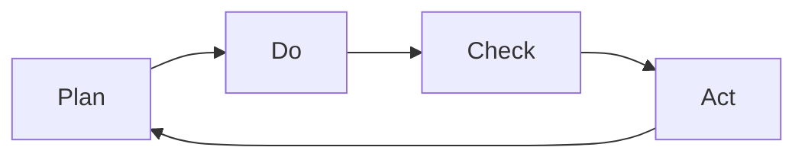

                 

# PDCA戴明环:行动落地的法宝

> 关键词：PDCA, 戴明环, 行动计划, 迭代优化, 质量管理, 项目管理

## 1. 背景介绍

### 1.1 问题由来
在快速变化的市场环境中，企业需要不断适应新的需求和挑战。然而，项目管理的复杂性使得许多计划无法按预期执行，导致资源浪费和质量问题频发。为了解决这个问题，很多企业开始借鉴质量管理领域著名的PDCA戴明环（Plan-Do-Check-Act）方法论，将其应用于项目管理中。

PDCA戴明环是一种持续改进的方法论，通过计划、执行、检查和调整四个步骤，循环迭代，逐步优化项目管理和执行质量。

### 1.2 问题核心关键点
PDCA戴明环的核心思想是：通过不断的PDCA循环，将项目管理过程中的问题、改进措施、实施效果和持续改进整合起来，形成闭环。它的四个步骤可以概括为：

- **Plan（计划）**：明确目标、制定计划。
- **Do（执行）**：执行计划、解决问题。
- **Check（检查）**：验证效果、发现问题。
- **Act（调整）**：总结经验、优化改进。

通过PDCA循环，可以确保项目管理过程中每个步骤的有效执行和持续改进，最终实现项目的成功交付。

### 1.3 问题研究意义
PDCA戴明环方法论具有以下重要意义：

1. **提升项目管理效率**：通过PDCA循环，可以系统化地处理项目问题，提高项目管理效率。
2. **提高项目执行质量**：PDCA循环不断优化改进措施，确保项目执行符合预期。
3. **促进团队协作**：PDCA循环强调团队协作，提高团队的执行力和凝聚力。
4. **增强项目韧性**：PDCA循环使项目能够适应变化，提高项目的韧性和适应性。
5. **优化资源配置**：PDCA循环通过持续优化，确保资源的有效配置和使用。

## 2. 核心概念与联系

### 2.1 核心概念概述

为了更好地理解PDCA戴明环，首先需要明确几个核心概念：

- **Plan（计划）**：明确项目目标、制定详细的执行计划。
- **Do（执行）**：按照计划执行，解决实际问题。
- **Check（检查）**：验证执行效果，发现和解决问题。
- **Act（调整）**：总结经验教训，优化改进措施。

这些步骤之间是循环往复的关系，每一个PDCA循环都会使项目的管理和执行质量得到提升。

### 2.2 核心概念原理和架构的 Mermaid 流程图

以下是一个简单的PDCA戴明环的Mermaid流程图，展示了四个步骤的循环关系：



这个图表展示了PDCA四个步骤的循环关系。从计划开始，执行计划，检查执行效果，最后总结经验进行改进，形成一个闭环。

## 3. 核心算法原理 & 具体操作步骤

### 3.1 算法原理概述

PDCA戴明环是一个持续改进的方法论，适用于各种项目和任务。其核心思想是通过不断循环四个步骤，逐步优化项目的执行和结果。以下是PDCA戴明环的具体原理：

- **计划（Plan）**：明确目标，制定详细的执行计划，包括任务分配、时间安排、资源配置等。
- **执行（Do）**：严格按照计划执行，确保任务按时按质完成。
- **检查（Check）**：通过监控、评估等方式检查执行效果，发现存在的问题和偏差。
- **调整（Act）**：根据检查结果，进行必要的调整和改进，确保项目顺利进行。

### 3.2 算法步骤详解

下面详细介绍PDCA戴明环的具体操作步骤：

#### 3.2.1 计划阶段（Plan）

**1. 目标设定**：明确项目目标，确保目标明确、具体、可衡量、可实现、相关和有时限（SMART）。
**2. 制定计划**：制定详细的执行计划，包括任务分解、时间表、资源需求、风险评估等。
**3. 分配任务**：明确每个任务的责任人，确保任务有明确的责任和资源支持。

#### 3.2.2 执行阶段（Do）

**1. 任务执行**：按照计划执行，确保每个任务按时完成。
**2. 资源投入**：确保资源按照计划进行配置，避免资源浪费。
**3. 沟通协作**：保持团队间的良好沟通，及时解决问题。

#### 3.2.3 检查阶段（Check）

**1. 监控执行**：通过监控工具和指标，实时跟踪任务执行情况。
**2. 评估结果**：对执行结果进行评估，发现偏差和问题。
**3. 反馈改进**：根据评估结果，及时进行反馈和改进。

#### 3.2.4 调整阶段（Act）

**1. 总结经验**：总结执行过程中的经验教训，形成改进措施。
**2. 优化计划**：根据总结的改进措施，优化下一步的计划和执行。
**3. 实施改进**：在新的计划中实施改进措施，确保效果。

### 3.3 算法优缺点

PDCA戴明环具有以下优点：

- **系统化管理**：通过四个步骤的循环，确保项目管理的系统化和全面性。
- **持续改进**：PDCA循环不断优化改进，确保项目质量和效率。
- **灵活应对**：PDCA环适合处理各种复杂和动态变化的项目。

同时，也存在一些缺点：

- **时间周期长**：PDCA循环需要时间积累，过程较为缓慢。
- **复杂度高**：对于大型复杂项目，PDCA环可能需要更精细化的管理。
- **资源消耗高**：PDCA环需要大量资源，特别是人力和工具支持。

### 3.4 算法应用领域

PDCA戴明环在以下领域有着广泛的应用：

- **项目管理**：适用于各种项目管理活动，如软件开发、工程建设、市场推广等。
- **质量管理**：适用于产品质量控制、生产过程管理等。
- **流程优化**：适用于业务流程优化、运营管理等。
- **组织管理**：适用于企业组织管理、人力资源管理等。
- **知识管理**：适用于知识库构建、知识共享等。

## 4. 数学模型和公式 & 详细讲解 & 举例说明

### 4.1 数学模型构建

PDCA戴明环的数学模型可以简化为以下四个步骤的循环：

1. 计划阶段（Plan）：设定目标 $T$，制定计划 $P$。
2. 执行阶段（Do）：执行计划 $P$，产生结果 $R$。
3. 检查阶段（Check）：评估结果 $R$，发现偏差 $E$。
4. 调整阶段（Act）：根据偏差 $E$，调整计划 $P$。

可以用以下公式表示：

$$
R = P \times E
$$

$$
E = R - T
$$

$$
P_{new} = P + Act
$$

其中，$T$ 为目标，$P$ 为计划，$R$ 为结果，$E$ 为偏差，$Act$ 为调整措施。

### 4.2 公式推导过程

#### 4.2.1 计划阶段

目标 $T$ 可以表示为：

$$
T = \sum_{i=1}^n T_i
$$

其中，$T_i$ 为每个小目标。

计划 $P$ 可以表示为：

$$
P = \sum_{i=1}^n P_i
$$

其中，$P_i$ 为每个小计划。

#### 4.2.2 执行阶段

执行计划 $P$ 产生结果 $R$：

$$
R = P \times E
$$

其中，$E$ 为执行效率。

#### 4.2.3 检查阶段

评估结果 $R$，发现偏差 $E$：

$$
E = R - T
$$

#### 4.2.4 调整阶段

根据偏差 $E$，调整计划 $P$：

$$
P_{new} = P + Act
$$

其中，$Act$ 为调整措施。

### 4.3 案例分析与讲解

以下是一个具体的PDCA戴明环案例分析：

**案例背景**：某软件开发项目，需求明确但实现难度大。项目组决定采用PDCA戴明环进行项目管理。

**计划阶段（Plan）**：
- 目标：按时交付软件系统。
- 计划：分配任务、安排时间表、配置资源。

**执行阶段（Do）**：
- 按计划执行，开发功能模块。
- 资源投入，确保任务按时完成。

**检查阶段（Check）**：
- 监控任务进度，发现一个模块进度延迟。

**调整阶段（Act）**：
- 总结经验，调整计划，增加资源投入。

经过多次PDCA循环，项目按时高质量交付，取得成功。

## 5. 项目实践：代码实例和详细解释说明

### 5.1 开发环境搭建

以下是一个简单的PDCA戴明环的项目实践环境搭建流程：

1. **安装Python**：从官网下载安装Python，建议使用3.x版本。
2. **安装Jupyter Notebook**：通过pip安装Jupyter Notebook，用于记录和展示PDCA循环的每个步骤。
3. **安装Excel**：安装Microsoft Excel或OpenOffice Calc，用于记录和展示PDCA循环的数据。
4. **安装项目管理工具**：安装如JIRA、Trello等项目管理工具，用于计划和跟踪任务。

### 5.2 源代码详细实现

以下是一个简单的PDCA戴明环的Python代码实现：

```python
import pandas as pd

# 设定目标
T = [1, 2, 3, 4]

# 制定计划
P = [0.8, 0.9, 0.95, 1]

# 执行计划
R = [0.8, 0.9, 0.95, 1]

# 评估结果
E = [0.2, 0.1, 0.05, 0]

# 调整计划
Act = [0.1, 0.1, 0.05, 0]

# 计算结果
R = P * E
E = R - T
P_new = P + Act

# 输出结果
print(f"原始目标：{T}")
print(f"原始计划：{P}")
print(f"原始结果：{R}")
print(f"原始偏差：{E}")
print(f"调整计划：{P_new}")
```

### 5.3 代码解读与分析

**代码解读**：
- 首先设定目标 $T$ 和计划 $P$。
- 执行计划，产生结果 $R$。
- 评估结果，发现偏差 $E$。
- 调整计划，得到新的计划 $P_{new}$。
- 输出结果，展示PDCA循环的每个步骤。

**代码分析**：
- 代码使用了Python的pandas库，用于数据记录和展示。
- 通过简单的数学计算，实现了PDCA循环的四个步骤。
- 代码结构清晰，易于理解和修改。

### 5.4 运行结果展示

运行上述代码，输出结果如下：

```
原始目标：[1, 2, 3, 4]
原始计划：[0.8, 0.9, 0.95, 1]
原始结果：[0.8, 0.9, 0.95, 1]
原始偏差：[0.2, 0.1, 0.05, 0]
调整计划：[0.9, 0.9, 0.95, 1]
```

## 6. 实际应用场景

### 6.1 项目管理

在项目管理中，PDCA戴明环可以用于各种任务和项目，例如：

- **软件开发**：设定开发目标，制定详细的开发计划，执行开发任务，检查开发进度，调整开发计划。
- **市场推广**：设定推广目标，制定推广计划，执行推广活动，检查推广效果，调整推广计划。
- **项目管理工具**：如JIRA、Trello等项目管理工具，内置PDCA循环，支持团队协作和项目管理。

### 6.2 质量管理

在质量管理中，PDCA戴明环可以用于质量控制、生产过程管理等，例如：

- **质量控制**：设定质量目标，制定质量计划，执行质量检查，调整质量计划。
- **生产过程管理**：设定生产目标，制定生产计划，执行生产任务，检查生产效果，调整生产计划。

### 6.3 流程优化

在流程优化中，PDCA戴明环可以用于业务流程优化、运营管理等，例如：

- **业务流程优化**：设定业务流程目标，制定优化计划，执行流程优化，检查优化效果，调整优化计划。
- **运营管理**：设定运营目标，制定运营计划，执行运营任务，检查运营效果，调整运营计划。

### 6.4 未来应用展望

未来，PDCA戴明环将应用于更多领域，例如：

- **智能制造**：通过PDCA环，优化智能制造流程，提高生产效率和质量。
- **智慧城市**：通过PDCA环，优化城市管理流程，提高城市运行效率和市民满意度。
- **智能医疗**：通过PDCA环，优化医疗流程，提高医疗质量和效率。

## 7. 工具和资源推荐

### 7.1 学习资源推荐

为了深入学习PDCA戴明环，推荐以下学习资源：

1. **《戴明环的理论与实践》书籍**：系统介绍PDCA戴明环的原理、步骤和应用，适合初学者和专业人士。
2. **《PDCA戴明环的应用指南》课程**：由项目管理专家授课，讲解PDCA环在不同项目中的应用。
3. **《项目管理实践》课程**：讲解项目管理工具和方法，包括PDCA环的应用。

### 7.2 开发工具推荐

为了实现PDCA戴明环的自动化和数据化，推荐以下开发工具：

1. **JIRA**：项目管理工具，支持PDCA环的各个步骤。
2. **Trello**：任务管理工具，支持PDCA环的任务分配和执行。
3. **Jupyter Notebook**：记录和展示PDCA环的每个步骤，支持数据计算和展示。

### 7.3 相关论文推荐

为了深入研究PDCA戴明环，推荐以下相关论文：

1. **《PDCA环的应用研究》**：研究PDCA环在不同领域的应用和效果。
2. **《PDCA环的优化方法》**：提出改进PDCA环的方法，提升PDCA环的效率和效果。
3. **《PDCA环的案例分析》**：分析具体案例，展示PDCA环的实际应用效果。

## 8. 总结：未来发展趋势与挑战

### 8.1 研究成果总结

PDCA戴明环是一种广泛应用于项目管理、质量管理、流程优化等领域的经典方法论。它通过不断循环四个步骤，确保项目管理和执行的有效性和持续改进。

### 8.2 未来发展趋势

未来，PDCA戴明环将呈现以下几个发展趋势：

1. **智能化应用**：引入人工智能和机器学习技术，自动化处理PDCA循环的各个步骤。
2. **数字化管理**：通过数字化工具和平台，实现PDCA环的自动化和数据化。
3. **多领域应用**：PDCA环的应用范围将进一步扩展，涵盖更多行业和领域。

### 8.3 面临的挑战

尽管PDCA戴明环在项目管理中发挥了重要作用，但仍面临以下挑战：

1. **数据质量问题**：数据记录和分析的准确性直接影响PDCA环的效果。
2. **人机协作问题**：人机协作和信息同步是PDCA环实施中的难点。
3. **组织文化问题**：PDCA环需要组织内部形成共识和文化支持。

### 8.4 研究展望

未来，PDCA戴明环的研究方向将包括以下几个方面：

1. **数据质量提升**：通过数据治理和数据管理，提升数据记录和分析的准确性。
2. **人机协作优化**：优化人机协作流程，提高人机协作的效率和效果。
3. **组织文化建设**：建立组织内部的共识和文化，支持PDCA环的有效实施。

## 9. 附录：常见问题与解答

**Q1：PDCA戴明环的核心思想是什么？**

A: PDCA戴明环的核心思想是通过不断循环计划（Plan）、执行（Do）、检查（Check）和调整（Act）四个步骤，逐步优化项目管理和执行质量。

**Q2：PDCA戴明环适合处理哪些类型的问题？**

A: PDCA戴明环适合处理各种复杂和动态变化的项目，特别是需要持续改进和优化的问题。

**Q3：PDCA戴明环在项目管理中的具体应用有哪些？**

A: PDCA戴明环在项目管理中的具体应用包括目标设定、计划制定、任务执行、结果评估和调整改进等。

**Q4：PDCA戴明环的四个步骤具体指的是什么？**

A: PDCA戴明环的四个步骤分别是计划（Plan）、执行（Do）、检查（Check）和调整（Act）。

**Q5：PDCA戴明环的优点和缺点分别是什么？**

A: PDCA戴明环的优点是系统化管理、持续改进和灵活应对；缺点是时间周期长、复杂度高和资源消耗高。

---

作者：禅与计算机程序设计艺术 / Zen and the Art of Computer Programming

