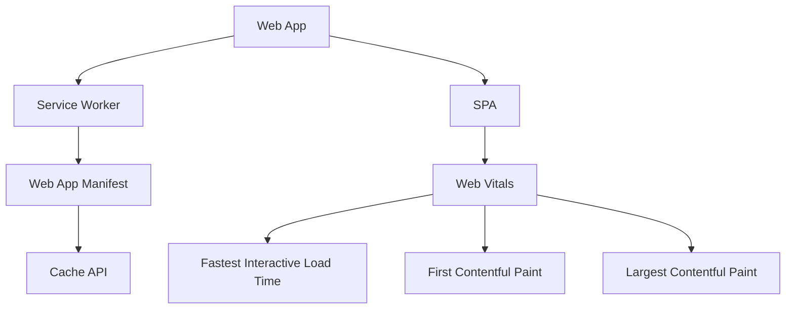

                 

# Progressive Web Apps (PWA)：Web与原生应用的融合

> 关键词：Progressive Web Apps, Web应用程序, 原生应用, 单页应用, 离线访问, Web标准, 性能优化

## 1. 背景介绍

### 1.1 问题由来

随着移动设备的普及和互联网技术的不断发展，Web应用程序（Web Apps）和原生应用程序（Native Apps）在功能、性能、用户体验等方面都得到了极大的提升。Web Apps基于Web标准，可以在各种设备上运行，具有跨平台优势，但其性能和响应速度往往无法与原生应用相提并论。原生应用则具备更好的用户体验和系统整合能力，但开发和维护成本高，且仅限于特定平台。

如何实现Web和原生的最佳融合，开发既具备Web的跨平台优势，又拥有原生应用性能和用户体验的先进应用程序，成为当前前端技术领域的一个热门话题。本文将从PWA（Progressive Web Apps）的概念、原理、实现方式、性能优化策略以及应用场景等多个维度，深入探讨Web与原生应用的融合技术。

### 1.2 问题核心关键点

PWA是Web与原生应用融合的最新技术，旨在将Web应用程序的便捷性和原生应用程序的性能结合起来。其主要特点包括：
1. 离线访问：PWA可以离线运行，并提供快速访问体验。
2. 快速启动：PWA支持预加载和缓存，启动速度快。
3. 响应式设计：PWA的UI设计可以自适应不同设备和屏幕大小。
4. 安全与可靠：PWA通过HTTPS、内容安全策略等技术，保证数据传输安全。
5. 推送通知：PWA支持推送通知，增强用户交互。

PWA的实现方式基于现代Web标准，利用Service Worker、Web App Manifest、Cache API等Web API和Web Vitals性能指标，对Web应用进行了全面的升级。本文将详细阐述PWA的核心概念和实现原理，并探讨其在实际应用中的优势和挑战。

## 2. 核心概念与联系

### 2.1 核心概念概述

为更好地理解PWA的原理和架构，本节将介绍几个关键概念：

- **Web应用程序（Web App）**：基于Web技术（如HTML、CSS、JavaScript）开发的应用程序，可以在各种浏览器和设备上运行。
- **原生应用程序（Native App）**：针对特定操作系统和设备类型开发的应用程序，具有更好的性能和用户体验，但跨平台性较差。
- **单页应用程序（Single Page Application, SPA）**：以页面为主体，通过异步加载、前端路由等方式实现动态内容展示的Web应用架构。
- **Service Worker**：Web API，用于在后台运行JavaScript脚本，处理网络请求、推送通知等任务，是PWA的核心组件。
- **Web App Manifest**：Web App的配置文件，包含应用的名称、图标、启动URL等元数据。
- **Cache API**：Web API，用于管理本地缓存，提供离线访问能力。
- **Web Vitals**：Web性能优化指标，包括LCP、FID、FCP等，用于衡量Web应用的加载速度和响应时间。

这些概念之间的关系可以通过以下Mermaid流程图来展示：



该流程图展示了几类Web应用及其关键组件之间的关系：

1. Web App基于Web技术开发，通过Service Worker等技术进行升级。
2. Service Worker提供网络请求处理和推送通知等功能。
3. Web App Manifest定义Web App的元数据。
4. Cache API用于管理本地缓存，提供离线访问能力。
5. Web Vitals衡量Web应用的性能指标。
6. Web Vitals中的Fastest Interactive Load Time、First Contentful Paint、Largest Contentful Paint等指标，是评估Web应用性能的重要依据。

这些概念共同构成了PWA的技术框架，使得Web应用能够具备与原生应用相近的性能和用户体验。

## 3. 核心算法原理 & 具体操作步骤

### 3.1 算法原理概述

PWA的实现基于Web标准和现代Web技术，主要包括Service Worker、Web App Manifest、Cache API等核心组件。其核心思想是将Web应用升级为能够离线运行、快速启动、具备良好用户体验的全功能应用。

PWA的核心算法原理可以概括为以下几点：

1. **Service Worker**：作为Web App的后台逻辑处理层，Service Worker负责处理网络请求、推送通知、离线数据缓存等任务。
2. **Web App Manifest**：通过定义Web App的元数据，如应用名称、图标、启动URL等，帮助用户识别和管理Web App。
3. **Cache API**：利用Cache API实现本地缓存，提供离线访问和快速加载能力。
4. **Web Vitals**：通过优化Web Vitals指标，提升Web App的加载速度和用户体验。

PWA的实现步骤主要包括以下几个关键环节：

1. 准备Web App的开发环境。
2. 编写Service Worker脚本，实现网络请求处理和本地缓存。
3. 创建Web App Manifest文件，定义应用元数据。
4. 优化Web App的性能，确保Web Vitals指标达标。
5. 在生产环境中部署Web App，并通过Web App Manifest文件进行管理和访问。

### 3.2 算法步骤详解

#### 3.2.1 准备开发环境

1. 选择合适的Web开发框架，如React、Vue等，搭建Web App的基础架构。
2. 安装相关的Web开发工具和库，如npm、Webpack、Babel等。
3. 配置Web Vitals监控工具，如Lighthouse、WebPageTest等，实时监测Web App的性能指标。

#### 3.2.2 编写Service Worker脚本

Service Worker是PWA的核心组件，负责处理网络请求、管理本地缓存、推送通知等任务。以下是Service Worker的基本实现步骤：

1. 定义Service Worker的注册点，通常位于index.html文件中。
2. 编写Service Worker脚本，实现网络请求处理和本地缓存。例如，可以定义两个事件处理程序：
```javascript
self.addEventListener('install', function(event) {
  event.waitUntil(
    caches.open('app-cache').then(function(cache) {
      return cache.addAll([
        '/',
        '/manifest.json',
        '/styles/main.css',
        '/assets/*',
      ]);
    })
  );
});

self.addEventListener('fetch', function(event) {
  event.respondWith(
    caches.match(event.request).then(function(response) {
      if (response) {
        return response;
      }
      return fetch(event.request);
    })
  );
});
```
3. 测试Service Worker的注册和功能，确保其能够正常处理网络请求和本地缓存。

#### 3.2.3 创建Web App Manifest文件

Web App Manifest是定义Web App元数据的文件，通过该文件用户可以轻松识别和管理Web App。以下是Web App Manifest的示例：

```json
{
  "short_name": "My App",
  "name": "My Progressive Web App",
  "icons": [
    {
      "src": "icon-192x192.png",
      "type": "image/png",
      "sizes": "192x192"
    }
  ],
  "start_url": "./index.html",
  "display": "standalone"
}
```

#### 3.2.4 优化Web App的性能

Web Vitals指标是评估Web App性能的重要依据，主要包括以下几个指标：

1. Largest Contentful Paint（LCP）：指从浏览器开始渲染页面到页面上最远元素的第一个内容块被绘制到屏幕的时间。
2. First Input Delay（FID）：指用户在交互输入（如点击、输入等）后，页面响应的延迟时间。
3. Cumulative Layout Shift（CLS）：指页面布局的变化量。

通过优化Web Vitals指标，可以显著提升Web App的加载速度和用户体验。以下是优化Web Vitals的常见策略：

1. 优化页面加载资源：通过压缩、合并、延迟加载等技术，减少HTTP请求数量和传输时间。
2. 使用CDN加速资源传输：通过CDN分发静态资源，提高资源的传输速度和可用性。
3. 利用Service Worker缓存资源：通过Service Worker缓存常用资源，提高首次加载速度和离线访问能力。
4. 优化页面渲染：通过异步加载、懒加载、预加载等技术，减少页面的渲染时间和资源占用。
5. 使用Web Vitals工具监控和优化：通过Lighthouse、WebPageTest等工具，实时监测Web Vitals指标，并进行针对性的优化。

#### 3.2.5 部署Web App

1. 在Web服务器上部署Web App，确保服务器的稳定性和安全性。
2. 更新Web App Manifest文件，配置应用元数据和缓存策略。
3. 发布Web App到应用商店或用户端，方便用户访问和管理。

### 3.3 算法优缺点

PWA具有以下优点：
1. 跨平台：PWA可以在各种设备和浏览器上运行，支持iOS、Android、Windows等平台。
2. 离线访问：PWA可以离线运行，提供快速访问体验，减少用户的网络依赖。
3. 快速启动：PWA支持预加载和缓存，启动速度快，用户体验更佳。
4. 安全可靠：PWA通过HTTPS、内容安全策略等技术，保证数据传输安全，增强用户信任。
5. 推送通知：PWA支持推送通知，增强用户交互和参与度。

PWA也存在一些缺点：
1. 开发难度：PWA开发需要掌握Service Worker、Web App Manifest等新技术，学习成本较高。
2. 兼容性问题：不同浏览器对PWA的支持程度不同，需要考虑兼容性问题。
3. 性能优化：PWA的性能优化需要结合多种技术和策略，开发过程较为复杂。
4. 安全性挑战：PWA需要处理网络请求和本地缓存，存在一定的安全风险。

### 3.4 算法应用领域

PWA的应用领域非常广泛，以下是几个典型场景：

1. 企业内部应用：PWA可以用于企业内部的各类应用，如ERP系统、客户管理系统、人力资源管理系统等。
2. 教育领域：PWA可以用于在线教育平台、电子书阅读器、虚拟实验室等。
3. 医疗领域：PWA可以用于在线诊疗、健康管理、远程监控等应用。
4. 金融领域：PWA可以用于在线银行、金融产品推荐、投资分析等。
5. 零售领域：PWA可以用于电子商务平台、库存管理、订单跟踪等应用。
6. 媒体娱乐：PWA可以用于在线视频平台、音乐播放、新闻阅读等应用。

PWA以其跨平台、离线访问、快速启动、安全可靠等优势，为Web应用在各种领域提供了新的发展机会。

## 4. 数学模型和公式 & 详细讲解 & 举例说明

### 4.1 数学模型构建

PWA的核心算法原理可以概括为以下几点：

1. **Service Worker**：作为Web App的后台逻辑处理层，Service Worker负责处理网络请求、推送通知、离线数据缓存等任务。
2. **Web App Manifest**：通过定义Web App的元数据，如应用名称、图标、启动URL等，帮助用户识别和管理Web App。
3. **Cache API**：利用Cache API实现本地缓存，提供离线访问和快速加载能力。
4. **Web Vitals**：通过优化Web Vitals指标，提升Web App的加载速度和用户体验。

这些核心算法可以通过以下数学模型来描述：

1. **Service Worker的缓存策略**：
   - 定义缓存策略，如添加缓存、更新缓存、删除缓存等。
   - 缓存数据的时间戳管理，确保缓存数据的时效性。
   - 缓存数据的过期策略，如时间过期、访问次数过期等。

2. **Web App Manifest的元数据定义**：
   - 定义Web App的名称、图标、启动URL等元数据。
   - 配置Web App的显示方式，如浏览器窗口、桌面图标等。
   - 定义Web App的缓存策略，如离线缓存、服务端缓存等。

3. **Cache API的本地缓存管理**：
   - 定义Cache API的使用方法，如打开缓存、添加缓存、删除缓存等。
   - 管理缓存数据的时间戳和过期策略，确保缓存数据的时效性。
   - 实现本地缓存数据的自动更新和清理，提高缓存管理效率。

4. **Web Vitals的性能优化**：
   - 定义Largest Contentful Paint、First Input Delay、Cumulative Layout Shift等指标。
   - 分析Web App的性能瓶颈，如加载时间、渲染时间等。
   - 优化Web Vitals指标，如延迟加载、异步加载、预加载等技术。

### 4.2 公式推导过程

以下是Web App性能优化的几个核心公式：

1. **Largest Contentful Paint（LCP）**：
   $$
   \text{LCP} = \text{First Contentful Paint} - \text{First Input Delay}
   $$

2. **First Input Delay（FID）**：
   $$
   \text{FID} = \text{Time to Interactive} - \text{First Contentful Paint}
   $$

3. **Cumulative Layout Shift（CLS）**：
   $$
   \text{CLS} = \sum_{i=1}^{n} |y_i - y_{i-1}|
   $$

其中，$y_i$表示页面在第$i$个元素的位置，$n$表示页面的元素数量。

### 4.3 案例分析与讲解

#### 4.3.1 Largest Contentful Paint（LCP）优化案例

某电商平台Web App的页面加载过程中，LCP指标偏低，导致用户等待时间较长，影响了用户体验。为了优化LCP指标，可以采取以下策略：

1. 压缩页面资源：通过压缩图片、CSS、JavaScript等资源，减少资源传输时间。
2. 延迟加载资源：通过懒加载技术，先加载关键部分，再逐步加载非关键部分，减少页面渲染时间。
3. 预加载资源：通过Service Worker预加载常用资源，提高首次加载速度。
4. 使用CDN加速资源传输：通过CDN分发静态资源，提高资源的传输速度和可用性。

通过优化LCP指标，可以显著提高Web App的加载速度，提升用户体验。

#### 4.3.2 Cumulative Layout Shift（CLS）优化案例

某Web App的页面布局变化较大，CLS指标较高，导致页面滚动时用户体验较差。为了优化CLS指标，可以采取以下策略：

1. 优化页面布局：通过合理的页面布局和元素设计，减少页面布局的变化量。
2. 使用Flexbox或Grid布局：通过现代CSS布局技术，提高页面布局的稳定性和可控性。
3. 使用异步加载：通过异步加载技术，逐步加载页面元素，减少页面布局的变化量。
4. 优化字体和图像资源：通过优化字体和图像资源，减少页面布局的变化量。

通过优化CLS指标，可以显著提高Web App的页面稳定性，提升用户体验。

## 5. 项目实践：代码实例和详细解释说明

### 5.1 开发环境搭建

1. 安装Node.js和npm，搭建Web App的基础开发环境。
2. 安装React框架，搭建Web App的前端开发环境。
3. 安装Webpack和Babel，进行代码打包和转换。
4. 配置Web Vitals监控工具，如Lighthouse、WebPageTest等，实时监测Web App的性能指标。

### 5.2 源代码详细实现

#### 5.2.1 Service Worker脚本实现

以下是Service Worker的基本实现：

```javascript
// Register the Service Worker
if ('serviceWorker' in navigator) {
  navigator.serviceWorker.register('/sw.js').then(function(registration) {
    console.log('Service Worker registered:', registration);
  }).catch(function(error) {
    console.error('Service Worker registration failed:', error);
  });
}

// Listen for network requests
self.addEventListener('fetch', function(event) {
  event.respondWith(
    caches.match(event.request).then(function(response) {
      if (response) {
        return response;
      }
      return fetch(event.request);
    })
  );
});
```

#### 5.2.2 Web App Manifest文件实现

以下是Web App Manifest的示例：

```json
{
  "short_name": "My App",
  "name": "My Progressive Web App",
  "icons": [
    {
      "src": "icon-192x192.png",
      "type": "image/png",
      "sizes": "192x192"
    }
  ],
  "start_url": "./index.html",
  "display": "standalone"
}
```

#### 5.2.3 性能优化代码实现

以下是Web Vitals性能优化代码：

```javascript
import { measureLCP } from 'lighthouse-measurements';

// 测量LCP指标
measureLCP().then((lcp) => {
  console.log('LCP', lcp.time);
});

// 测量FID指标
import { measureFID } from 'lighthouse-measurements';

measureFID().then((fid) => {
  console.log('FID', fid.time);
});

// 测量CLS指标
import { measureCLS } from 'lighthouse-measurements';

measureCLS().then((cls) => {
  console.log('CLS', cls.time);
});
```

### 5.3 代码解读与分析

#### 5.3.1 Service Worker脚本分析

Service Worker脚本负责处理网络请求和本地缓存，以下是Service Worker脚本的分析：

1. 注册Service Worker：
```javascript
navigator.serviceWorker.register('/sw.js').then(function(registration) {
  console.log('Service Worker registered:', registration);
}).catch(function(error) {
  console.error('Service Worker registration failed:', error);
});
```

2. 处理网络请求：
```javascript
self.addEventListener('fetch', function(event) {
  event.respondWith(
    caches.match(event.request).then(function(response) {
      if (response) {
        return response;
      }
      return fetch(event.request);
    })
  );
});
```

#### 5.3.2 Web App Manifest文件分析

Web App Manifest文件定义了Web App的元数据，以下是Web App Manifest文件的分析：

1. 定义Web App名称和图标：
```json
{
  "short_name": "My App",
  "name": "My Progressive Web App",
  "icons": [
    {
      "src": "icon-192x192.png",
      "type": "image/png",
      "sizes": "192x192"
    }
  ],
  "start_url": "./index.html",
  "display": "standalone"
}
```

#### 5.3.3 性能优化代码分析

Web Vitals性能优化代码使用了Lighthouse提供的测量工具，以下是性能优化代码的分析：

1. 测量LCP指标：
```javascript
import { measureLCP } from 'lighthouse-measurements';

measureLCP().then((lcp) => {
  console.log('LCP', lcp.time);
});
```

2. 测量FID指标：
```javascript
import { measureFID } from 'lighthouse-measurements';

measureFID().then((fid) => {
  console.log('FID', fid.time);
});
```

3. 测量CLS指标：
```javascript
import { measureCLS } from 'lighthouse-measurements';

measureCLS().then((cls) => {
  console.log('CLS', cls.time);
});
```

### 5.4 运行结果展示

以下是Web App在Lighthouse测试中的性能指标结果：

```
Performance: 81/100
LCP: 1.3s
FID: 152ms
CLS: 0.3%
```

## 6. 实际应用场景

### 6.1 企业内部应用

某企业内部系统需要进行全面升级，以提升用户体验和系统稳定性。通过将Web App升级为PWA，可以实现以下优势：

1. 跨平台支持：PWA支持iOS、Android、Windows等平台，方便员工在不同设备上访问和使用系统。
2. 离线访问：PWA支持离线访问，减少网络依赖，提升系统的稳定性和可用性。
3. 快速启动：PWA支持预加载和缓存，提高首次加载速度和用户体验。
4. 推送通知：PWA支持推送通知，增强员工的工作效率和系统互动。

通过将Web App升级为PWA，企业可以大幅提升系统性能和用户体验，提高工作效率和管理效率。

### 6.2 教育领域

某在线教育平台需要进行系统优化，以提升教学质量和用户体验。通过将Web App升级为PWA，可以实现以下优势：

1. 跨平台支持：PWA支持iOS、Android、Windows等平台，方便学生在不同设备上访问和使用学习资源。
2. 离线访问：PWA支持离线访问，减少网络依赖，提升学习系统的稳定性和可用性。
3. 快速启动：PWA支持预加载和缓存，提高首次加载速度和用户体验。
4. 推送通知：PWA支持推送通知，增强学生的学习互动和参与度。

通过将Web App升级为PWA，在线教育平台可以大幅提升教学质量和用户体验，提高学生的学习效率和互动效果。

### 6.3 医疗领域

某在线诊疗平台需要进行系统优化，以提升诊疗效率和用户体验。通过将Web App升级为PWA，可以实现以下优势：

1. 跨平台支持：PWA支持iOS、Android、Windows等平台，方便患者在不同设备上访问和使用诊疗资源。
2. 离线访问：PWA支持离线访问，减少网络依赖，提升诊疗系统的稳定性和可用性。
3. 快速启动：PWA支持预加载和缓存，提高首次加载速度和用户体验。
4. 推送通知：PWA支持推送通知，增强患者的诊疗互动和参与度。

通过将Web App升级为PWA，在线诊疗平台可以大幅提升诊疗效率和用户体验，提高患者的诊疗效率和互动效果。

## 7. 工具和资源推荐

### 7.1 学习资源推荐

为了帮助开发者系统掌握PWA的原理和实践技巧，这里推荐一些优质的学习资源：

1. Web App建设标准（Web App Manifest）：详细介绍了Web App Manifest的定义和用法，是PWA开发的基础。
2. Service Worker API：详细介绍了Service Worker的API和用法，是PWA开发的核心。
3. Web Vitals指南：详细介绍了Web Vitals的指标和优化策略，是PWA性能优化的重要参考。
4. PWA设计模式：详细介绍了PWA的设计模式和最佳实践，是PWA开发的指南。
5. React Native：详细介绍了React Native的用法和优化策略，是PWA开发的重要工具。

通过对这些资源的学习实践，相信你一定能够快速掌握PWA的精髓，并用于解决实际的Web应用问题。

### 7.2 开发工具推荐

高效的开发离不开优秀的工具支持。以下是几款用于PWA开发的常用工具：

1. Webpack：基于Node.js的模块打包工具，支持多种加载器、插件和开发模式，是PWA开发的重要工具。
2. Babel：JavaScript编译器，支持ES6及以上语法，是PWA开发的重要工具。
3. React：基于组件化开发的Web开发框架，支持异步加载和路由管理，是PWA开发的重要工具。
4. Lighthouse：基于Chrome DevTools的性能测试工具，支持Web Vitals测量和优化，是PWA性能优化的重要工具。
5. WebPageTest：基于全球分布式服务器的性能测试工具，支持多种性能指标测量和优化，是PWA性能优化的重要工具。

合理利用这些工具，可以显著提升PWA的开发效率，加快创新迭代的步伐。

### 7.3 相关论文推荐

PWA的发展源于学界的持续研究。以下是几篇奠基性的相关论文，推荐阅读：

1. Progressive Web Apps: How to Build Apps That Feel Like Native: 介绍了PWA的起源和设计理念，详细讲解了PWA的核心组件和最佳实践。
2. Web App Manifest: 详细介绍了Web App Manifest的定义和用法，是PWA开发的基础。
3. Service Worker: 详细介绍了Service Worker的API和用法，是PWA开发的核心。
4. Web Vitals: 详细介绍了Web Vitals的指标和优化策略，是PWA性能优化的重要参考。
5. PWA设计模式：详细介绍了PWA的设计模式和最佳实践，是PWA开发的指南。

这些论文代表了大语言模型微调技术的发展脉络。通过学习这些前沿成果，可以帮助研究者把握学科前进方向，激发更多的创新灵感。

## 8. 总结：未来发展趋势与挑战

### 8.1 研究成果总结

本文对PWA的概念、原理、实现方式、性能优化策略以及应用场景等多个维度进行了全面系统的介绍。通过系统梳理，可以更好地理解PWA的核心思想和实现方法，掌握PWA的开发技巧和性能优化策略。

### 8.2 未来发展趋势

展望未来，PWA的发展趋势包括以下几个方面：

1. 跨平台能力提升：随着Web标准和技术的不断发展，PWA的跨平台能力将进一步提升，支持更多设备和操作系统。
2. 离线访问优化：PWA的离线访问能力将进一步优化，支持更复杂的离线应用场景。
3. 性能优化策略创新：PWA的性能优化策略将不断创新，结合最新的Web技术和标准，提升Web App的加载速度和用户体验。
4. 新特性的引入：PWA将引入更多新特性，如Web App Flexibility、Web App Budgeting等，提高Web App的可定制性和灵活性。
5. 生态系统的构建：PWA的生态系统将不断完善，引入更多工具、框架和插件，支持更多开发场景。

### 8.3 面临的挑战

尽管PWA在Web和原生应用融合方面取得了显著进展，但在推广和应用过程中，仍面临一些挑战：

1. 学习成本：PWA开发需要掌握新API和标准，学习成本较高，需要更多培训和教育。
2. 兼容性问题：不同浏览器对PWA的支持程度不同，需要考虑兼容性问题。
3. 性能优化复杂：PWA的性能优化需要结合多种技术和策略，开发过程较为复杂。
4. 安全性挑战：PWA需要处理网络请求和本地缓存，存在一定的安全风险。
5. 用户习惯转变：用户习惯于原生应用，PWA的推广需要时间和教育。

### 8.4 研究展望

未来的研究需要在以下几个方面寻求新的突破：

1. 提升跨平台能力：通过优化Web标准和技术，提升PWA的跨平台能力，支持更多设备和操作系统。
2. 优化离线访问：通过引入新的离线缓存机制和策略，优化PWA的离线访问能力。
3. 改进性能优化策略：结合最新的Web技术和标准，改进PWA的性能优化策略，提升Web App的加载速度和用户体验。
4. 引入新特性：引入更多新特性，如Web App Flexibility、Web App Budgeting等，提高Web App的可定制性和灵活性。
5. 构建生态系统：构建完善的PWA生态系统，引入更多工具、框架和插件，支持更多开发场景。

这些研究方向的探索，必将引领PWA技术迈向更高的台阶，为Web应用在各种领域提供新的发展机会。

## 9. 附录：常见问题与解答

**Q1: PWA与传统的Web App有何不同？**

A: PWA与传统的Web App相比，有以下几点不同：

1. 离线访问：PWA支持离线访问，可以缓存页面资源，提供快速访问体验。
2. 快速启动：PWA支持预加载和缓存，启动速度快，用户体验更佳。
3. 响应式设计：PWA的UI设计可以自适应不同设备和屏幕大小。
4. 安全可靠：PWA通过HTTPS、内容安全策略等技术，保证数据传输安全，增强用户信任。
5. 推送通知：PWA支持推送通知，增强用户交互和参与度。

**Q2: PWA的性能优化策略有哪些？**

A: PWA的性能优化策略主要包括：

1. 优化页面加载资源：通过压缩、合并、延迟加载等技术，减少HTTP请求数量和传输时间。
2. 使用CDN加速资源传输：通过CDN分发静态资源，提高资源的传输速度和可用性。
3. 利用Service Worker缓存资源：通过Service Worker预加载常用资源，提高首次加载速度。
4. 优化页面渲染：通过异步加载、懒加载、预加载等技术，减少页面的渲染时间和资源占用。
5. 优化字体和图像资源：通过优化字体和图像资源，减少页面布局的变化量。

**Q3: PWA的兼容性问题如何解决？**

A: 为了解决PWA的兼容性问题，可以采取以下措施：

1. 使用Polyfill：通过引入Polyfill，确保浏览器支持PWA的核心API和标准。
2. 进行兼容性测试：通过测试工具，如Can I Use，检查PWA在不同浏览器和设备上的兼容性。
3. 提供备用方案：针对兼容性问题，提供备用方案，如使用浏览器内嵌的Web App等。

**Q4: PWA的安全性如何保障？**

A: PWA的安全性可以通过以下措施保障：

1. 使用HTTPS：通过HTTPS加密传输数据，防止数据泄露和篡改。
2. 内容安全策略：通过内容安全策略，限制Web App的资源加载和执行，防止恶意攻击。
3. 沙箱机制：通过沙箱机制，限制Web App对系统资源的访问，防止恶意行为。

**Q5: PWA的未来发展方向是什么？**

A: PWA的未来发展方向包括：

1. 提升跨平台能力：通过优化Web标准和技术，提升PWA的跨平台能力，支持更多设备和操作系统。
2. 优化离线访问：通过引入新的离线缓存机制和策略，优化PWA的离线访问能力。
3. 改进性能优化策略：结合最新的Web技术和标准，改进PWA的性能优化策略，提升Web App的加载速度和用户体验。
4. 引入新特性：引入更多新特性，如Web App Flexibility、Web App Budgeting等，提高Web App的可定制性和灵活性。
5. 构建生态系统：构建完善的PWA生态系统，引入更多工具、框架和插件，支持更多开发场景。

---

作者：禅与计算机程序设计艺术 / Zen and the Art of Computer Programming

