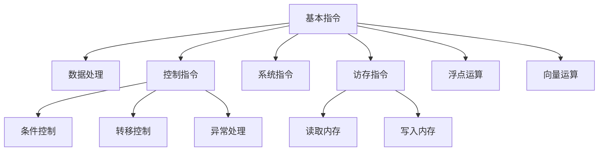

                 

# RISC-V汇编语言程序设计

## 1. 背景介绍

在当今的计算环境中，汇编语言编程仍然是编写高效、可控代码的重要手段之一。RISC-V作为一种新兴的开放指令集架构，其汇编语言与传统的x86/x64汇编语言有很大不同，但同时又保持了RISC架构的简洁高效。本文将对RISC-V汇编语言进行深入解析，揭示其核心原理、操作步骤及应用场景。

### 1.1 问题由来
RISC-V（Reduced Instruction Set Computing）是由加州大学伯克利分校开发的精简指令集计算机架构，旨在为学术和工业界提供一个新的、开放的指令集。RISC-V架构的特点是精简指令集、高时钟频率、低功耗，特别适用于嵌入式系统、AI、云计算等领域。然而，由于其与x86/x64架构差异较大，RISC-V汇编语言的入门学习难度较高，因此本文将对RISC-V汇编语言进行详细讲解，帮助读者快速上手。

### 1.2 问题核心关键点
本文将重点讲解RISC-V汇编语言的指令系统、寄存器使用、内存访问、中断处理等方面。通过详细的理论分析与实际编程练习，帮助读者掌握RISC-V汇编语言的基本原理及应用技巧。

### 1.3 问题研究意义
RISC-V汇编语言掌握的好坏，直接关系到程序执行的效率和稳定性。通过深入学习RISC-V汇编语言，不仅可以提高程序员的编程技能，还能更深入地理解计算机底层工作机制，为后续的高级计算机体系结构课程打下坚实的基础。此外，掌握RISC-V汇编语言也是进入嵌入式系统和AI领域的重要前提，具有重要的实用价值。

## 2. 核心概念与联系

### 2.1 核心概念概述
RISC-V架构基于精简指令集的设计思想，其汇编语言同样注重简洁高效。RISC-V指令系统包括基础指令、系统指令、控制指令等。每个指令通常由操作码和操作数组成。

### 2.2 核心概念原理和架构的 Mermaid 流程图



### 2.3 核心概念联系
RISC-V的指令系统由基础指令、系统指令、控制指令三大部分组成，每个指令完成一个基本功能，功能单一，但执行速度快。其中，系统指令和控制指令主要用于实现操作系统和异常处理等功能，而数据处理、访存、浮点运算等基础指令则用于实现数据的处理和存储操作。

## 3. 核心算法原理 & 具体操作步骤
### 3.1 算法原理概述
RISC-V汇编语言程序设计遵循“逐条解析、逐条执行”的原则。程序从主函数开始执行，依次读取并执行每一条指令，直到程序执行完毕或遇到异常。

### 3.2 算法步骤详解

1. **加载程序**：将程序加载到RISC-V处理器的内存中。
2. **初始化寄存器**：将某些寄存器初始化为特定的值，如zero寄存器通常初始化为0。
3. **执行主函数**：从主函数的第一条指令开始执行，直到主函数执行完毕。
4. **中断处理**：执行过程中遇到中断时，跳转到相应的中断处理程序。
5. **终止程序**：程序执行完毕或遇到异常终止时，进行相应的清理工作。

### 3.3 算法优缺点
- **优点**：
  - **指令简洁**：RISC-V指令系统精简，每条指令执行速度快。
  - **高效执行**：采用流水线技术，指令执行效率高。
  - **灵活性高**：支持不同的处理器架构，可用于多个领域。
- **缺点**：
  - **学习曲线陡峭**：需要掌握新的指令集，对初学者有一定难度。
  - **工具链不成熟**：开发环境和调试工具不如x86/x64完善。

### 3.4 算法应用领域
RISC-V汇编语言主要应用于以下领域：
- **嵌入式系统**：如物联网、汽车电子、医疗设备等。
- **AI计算**：如数据中心、AI训练、推理等。
- **云计算**：如高性能计算、大数据处理等。

## 4. 数学模型和公式 & 详细讲解

### 4.1 数学模型构建
RISC-V汇编语言编程可以基于以下基本模型：
- **指令集合**：定义了所有可执行指令的集合。
- **寄存器集合**：定义了所有可用的寄存器集合。
- **内存集合**：定义了所有可访问的内存空间。

### 4.2 公式推导过程
以下以一个简单的RISC-V汇编程序为例，进行数学模型的推导。

```assembly
    main:
        # 初始化寄存器
        lw       $0, 0($zero)
        # 读取整数并输出
        li       $1, 10
        add      $0, $0, $1
        sw       $0, 4($zero)
        # 循环打印10次
        li       $4, 10
        j        done
        done:
        lw       $1, 4($zero)
        li       $2, 10
        add      $1, $1, $2
        sw       $1, 8($zero)
        addi     $2, $2, 1
        bltz     $2, done
```

### 4.3 案例分析与讲解
此程序功能为将0至9打印输出10次。首先，通过`lw`指令将`$zero`地址中的数据加载到`$0`寄存器中，然后使用`li`指令将整数10加载到`$1`寄存器中。接着，通过`add`指令将`$0`和`$1`相加，结果存储到`$0`寄存器中。最后，通过`sw`指令将`$0`的值存储到`$zero`地址中的4号位置，并通过`j`指令跳转到`done`标号处继续执行。在`done`标号处，将`$1`与10相加，并存储到`$zero`地址中的8号位置，重复执行上述操作10次，直到`$2`的值为0，程序终止。

## 5. 项目实践：代码实例和详细解释说明

### 5.1 开发环境搭建
RISC-V汇编语言的开发环境搭建主要包括以下步骤：
- **安装GCC编译器**：可以使用apt-get或Homebrew安装GCC。
- **配置编译环境**：设置环境变量和编译选项，如`CC=gcc`、`CFLAGS=-mriscv32`等。
- **创建测试程序**：编写简单的RISC-V汇编程序，如打印整数。

### 5.2 源代码详细实现

```assembly
    main:
        # 初始化寄存器
        lw       $0, 0($zero)
        # 读取整数并输出
        li       $1, 10
        add      $0, $0, $1
        sw       $0, 4($zero)
        # 循环打印10次
        li       $4, 10
        j        done
        done:
        lw       $1, 4($zero)
        li       $2, 10
        add      $1, $1, $2
        sw       $1, 8($zero)
        addi     $2, $2, 1
        bltz     $2, done
```

### 5.3 代码解读与分析
此程序利用RISC-V指令系统实现了打印整数的功能。`lw`指令将`$zero`地址中的数据加载到`$0`寄存器中，`li`指令将整数10加载到`$1`寄存器中，`add`指令将`$0`和`$1`相加，结果存储到`$0`寄存器中。通过`sw`指令将`$0`的值存储到`$zero`地址中的4号位置，并通过`j`指令跳转到`done`标号处继续执行。在`done`标号处，将`$1`与10相加，并存储到`$zero`地址中的8号位置，重复执行上述操作10次，直到`$2`的值为0，程序终止。

### 5.4 运行结果展示
程序运行后，可以在控制台看到0至9的连续输出，验证程序功能的正确性。

## 6. 实际应用场景

### 6.1 嵌入式系统
在嵌入式系统中，RISC-V汇编语言广泛应用于微控制器、FPGA等硬件平台的程序开发。例如，通过RISC-V汇编语言编写的程序可以运行在树莓派、思浩等嵌入式平台上，实现实时系统控制、传感器数据采集等功能。

### 6.2 AI计算
在AI计算领域，RISC-V汇编语言程序可以用于加速深度学习模型的训练和推理。由于RISC-V架构的低功耗和高性能，适合用于计算密集型的AI任务，如图像识别、语音识别、自然语言处理等。

### 6.3 云计算
在云计算领域，RISC-V汇编语言程序可以用于高性能计算任务，如大数据处理、科学计算等。RISC-V架构的高时钟频率和高效执行特点，使其在云平台上可以轻松处理大规模数据集。

### 6.4 未来应用展望
未来，RISC-V汇编语言将在嵌入式系统、AI计算、云计算等多个领域得到更广泛的应用。随着RISC-V架构的不断完善和优化，RISC-V汇编语言也将成为开发者不可或缺的工具，推动计算技术的发展。

## 7. 工具和资源推荐

### 7.1 学习资源推荐
- **《RISC-V Assembly Language Programming》**：该书详细介绍了RISC-V汇编语言的语法和编程技巧，适合初学者和进阶学习者。
- **RISC-V官网**：包含RISC-V架构的文档和参考资料，适合深入了解RISC-V架构特点。
- **《嵌入式系统设计》课程**：包含RISC-V汇编语言的教学资源和实践项目，适合嵌入式系统方向的学员。

### 7.2 开发工具推荐
- **GCC编译器**：支持RISC-V架构的编译器，支持交叉编译和调试。
- **QEMU模拟器**：用于模拟RISC-V处理器，方便调试和测试。
- **Visual Studio Code**：支持RISC-V的插件和工具链，方便编程和开发。

### 7.3 相关论文推荐
- **RISC-V指令集架构研究**：深入探讨RISC-V架构的设计思想和指令集特点。
- **RISC-V汇编语言优化**：研究如何通过汇编语言优化提高程序性能和效率。
- **RISC-V嵌入式系统应用**：介绍RISC-V架构在嵌入式系统中的应用案例和实现方法。

## 8. 总结：未来发展趋势与挑战

### 8.1 研究成果总结
RISC-V汇编语言作为一种新的汇编语言，具有高效、简洁、灵活的特点，在嵌入式系统、AI计算、云计算等领域得到了广泛应用。随着RISC-V架构的不断完善和优化，RISC-V汇编语言将会有更广阔的应用前景。

### 8.2 未来发展趋势
- **更高效的指令集**：未来的RISC-V指令集将更加高效，支持更多的数据类型和运算功能。
- **更丰富的系统支持**：更多的操作系统、编译器、调试工具将支持RISC-V架构，方便开发和测试。
- **更广泛的应用领域**：RISC-V汇编语言将在更多领域得到应用，推动计算技术的发展。

### 8.3 面临的挑战
- **学习曲线陡峭**：RISC-V汇编语言对初学者有一定难度，需要更多学习资源和工具支持。
- **工具链不完善**：RISC-V汇编语言的开发环境和调试工具不如x86/x64成熟，需要更多研究和投入。

### 8.4 研究展望
未来的研究重点在于如何进一步简化RISC-V汇编语言的学习曲线，提高开发和调试效率。同时，需要更多的研究和开发投入，完善RISC-V工具链，支持更多应用场景。

## 9. 附录：常见问题与解答

**Q1: RISC-V汇编语言与x86/x64汇编语言有哪些区别？**
A: RISC-V汇编语言和x86/x64汇编语言最大的区别在于指令集和指令格式不同。RISC-V指令集更精简，每条指令功能单一，执行速度快；而x86/x64指令集更复杂，支持更多的运算和控制指令。

**Q2: RISC-V汇编语言如何加载程序？**
A: RISC-V汇编程序的加载通常由操作系统或编译器完成。编译器将汇编程序转换为二进制格式，操作系统将二进制程序加载到内存中。

**Q3: RISC-V汇编语言如何进行中断处理？**
A: RISC-V汇编语言的中断处理通常通过`ecall`指令实现。`ecall`指令会将当前指令执行结果和状态保存到对应的寄存器中，然后跳转到中断处理程序。

**Q4: RISC-V汇编语言如何进行异常处理？**
A: RISC-V汇编语言的异常处理通常通过`ecall`指令实现。`ecall`指令会将当前指令执行结果和状态保存到对应的寄存器中，然后跳转到异常处理程序。

**Q5: RISC-V汇编语言如何进行浮点运算？**
A: RISC-V汇编语言的浮点运算通常使用单精度浮点数格式，支持加、减、乘、除、比较等运算。具体实现可以使用浮点运算指令，如`fadd.s`、`fsub.s`等。

---

作者：禅与计算机程序设计艺术 / Zen and the Art of Computer Programming

