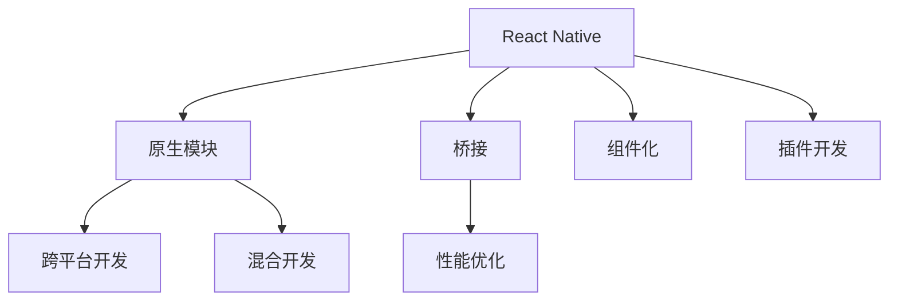

                 

# React Native原生模块开发

> 关键词：React Native, 原生模块, 桥接, 性能优化, 跨平台开发, 混合开发, 组件化, 插件开发

## 1. 背景介绍

在移动开发领域，跨平台框架如React Native（以下简称RN）因其强大的性能和灵活性成为开发者的不二选择。然而，由于RN的JavaScript代码与原生模块之间的桥接，性能问题、组件化不足、开发复杂度高等问题也随之而来。通过原生模块开发，可以充分发挥RN的跨平台优势，提升应用性能，降低开发复杂度，是开发者必须掌握的核心技能之一。

## 2. 核心概念与联系

### 2.1 核心概念概述

为更好地理解React Native原生模块开发，本节将介绍几个密切相关的核心概念：

- React Native: 由Facebook开发的跨平台移动开发框架，利用React的理念实现UI组件化，支持iOS和Android平台。
- 原生模块: 在RN中，原生模块指的是在JavaScript层和原生层之间进行通信和数据交换的桥梁。通过原生模块，JavaScript代码可以调用原生功能，实现数据渲染和交互。
- 桥接: 指JavaScript层和原生层之间的通信方式，通过原生模块进行数据传递。桥接是RN实现跨平台的关键技术。
- 性能优化: 指通过原生模块开发提升应用性能的方法和策略。性能优化是RN开发中不可忽视的一环。
- 跨平台开发: 指通过一种技术栈同时开发iOS和Android平台的应用，提高开发效率，降低成本。
- 混合开发: 指同时使用原生开发和跨平台开发的技术，实现性能和开发效率的平衡。
- 组件化: 指将UI界面拆分为若干个可复用、可维护的组件，提高开发效率，降低耦合度。
- 插件开发: 指在RN框架基础上，通过原生模块开发自定制插件，扩展RN功能，提升应用灵活性。

这些核心概念之间的逻辑关系可以通过以下Mermaid流程图来展示：



这个流程图展示的核心概念之间的联系：

1. React Native利用原生模块实现跨平台功能。
2. 原生模块通过桥接技术连接JavaScript层和原生层，实现数据通信。
3. 性能优化依赖于原生模块的高效实现。
4. 跨平台开发和混合开发都依赖于原生模块的桥接能力。
5. 组件化利用原生模块提升开发效率。
6. 插件开发基于原生模块扩展RN功能。

## 3. 核心算法原理 & 具体操作步骤

### 3.1 算法原理概述

React Native原生模块开发的核心算法原理是“桥接”。通过桥接技术，JavaScript层可以调用原生模块实现复杂功能，同时将处理结果返回给JavaScript层进行展示。桥接过程包括以下几个关键步骤：

1. JavaScript层调用原生模块。
2. 桥接模块将调用封装为原生函数。
3. 原生函数执行逻辑，处理业务逻辑。
4. 处理结果返回给桥接模块。
5. 桥接模块将结果返回给JavaScript层。

### 3.2 算法步骤详解

以下是React Native原生模块开发的详细操作步骤：

**Step 1: 创建原生模块项目**

1. 创建一个新的React Native项目。
2. 在项目中添加一个新的原生模块项目，用于开发原生模块代码。

**Step 2: 编写原生模块代码**

1. 编写原生模块的接口定义，包括模块名称、函数名称、参数类型、返回类型等。
2. 实现原生模块的业务逻辑，通常使用C++或Objective-C编写。
3. 在原生模块中定义变量和方法，用于保存状态和数据处理。

**Step 3: 构建原生模块**

1. 将原生模块的代码打包成动态库。
2. 在React Native项目中引入动态库，生成原生模块的接口。

**Step 4: 使用原生模块**

1. 在JavaScript层导入原生模块。
2. 调用原生模块中的函数，处理业务逻辑。
3. 处理原生模块的返回结果，更新UI界面。

**Step 5: 调试和优化**

1. 使用调试工具，如React Native调试器，调试原生模块的性能和错误。
2. 根据性能优化指南，调整原生模块的实现，提升应用性能。

### 3.3 算法优缺点

React Native原生模块开发有以下优点：

1. 跨平台能力。原生模块可以同时支持iOS和Android平台，降低开发成本。
2. 功能丰富。原生模块可以实现复杂功能，如摄像头、定位、通知等。
3. 高性能。原生模块直接调用原生API，性能优于跨平台桥接。
4. 灵活性高。原生模块可以根据实际需求进行自定制开发。

同时，该方法也存在一些缺点：

1. 开发复杂度。原生模块开发需要理解不同平台的API和特性，开发复杂度较高。
2. 维护难度。原生模块的维护和升级需要同步iOS和Android平台，维护难度大。
3. 兼容性问题。不同平台的原生模块代码可能存在兼容性问题，需要反复测试和调试。
4. 学习曲线陡峭。原生模块开发需要掌握不同平台的原生编程语言和开发工具。

尽管存在这些局限性，但就目前而言，原生模块开发仍是React Native开发中不可或缺的一部分，用于提升应用性能和开发效率。

### 3.4 算法应用领域

React Native原生模块开发在多个领域得到了广泛应用，例如：

1. 移动应用开发：通过原生模块实现复杂的UI组件和功能，提升应用性能和用户体验。
2. 游戏开发：利用原生模块实现高帧率、低延迟的图形渲染，提升游戏流畅性和沉浸感。
3. 医疗应用：通过原生模块实现复杂的医疗设备接口和数据处理，提升医疗应用的功能性和可靠性。
4. 金融应用：利用原生模块实现安全、高效的交易处理和数据存储，提升金融应用的安全性和稳定性。
5. 教育应用：通过原生模块实现互动式教学和实时反馈，提升教育应用的学习效果和用户粘性。

除了上述这些经典应用外，原生模块开发也被创新性地应用到更多场景中，如增强现实(AR)、虚拟现实(VR)、物联网(IoT)等，为跨平台应用带来全新的突破。随着React Native的不断发展和原生模块技术的进步，原生模块开发必将在更多领域得到应用，为跨平台应用带来新的创新和突破。

## 4. 数学模型和公式 & 详细讲解  
### 4.1 数学模型构建

在React Native原生模块开发中，数学模型的构建主要涉及性能优化和调试过程。

假设React Native应用中存在一个原生模块，其接口定义如下：

```javascript
module.exports = {
  name: 'MyModule',
  register: function(module) {
    module.exports.myFunction = function(arg1, arg2) {
      // 计算并返回结果
    }
  }
}
```

其中，`myFunction`是原生模块的函数接口，用于处理业务逻辑。在原生模块中，需要对传入的参数进行处理，计算出结果，并返回给JavaScript层。

### 4.2 公式推导过程

假设原生模块的业务逻辑需要处理两个浮点数`a`和`b`，计算其乘积，并将结果返回给JavaScript层。其计算过程可以表示为：

$$
result = a \times b
$$

在JavaScript层，需要调用原生模块中的`myFunction`函数，传入两个浮点数`arg1`和`arg2`，处理并返回结果。其调用过程可以表示为：

$$
myFunction(arg1, arg2)
$$

在JavaScript层和原生模块之间进行数据传递时，需要进行桥接处理。桥接过程中，需要考虑数据类型、函数调用方式等细节。

### 4.3 案例分析与讲解

以一个简单的原生模块为例，解释其数学模型的构建和调用过程。

假设原生模块需要实现一个求和函数，接收两个整数`x`和`y`，返回它们的和。其接口定义如下：

```javascript
module.exports = {
  name: 'MyModule',
  register: function(module) {
    module.exports.mySum = function(x, y) {
      // 计算并返回结果
    }
  }
}
```

在JavaScript层，需要调用原生模块中的`mySum`函数，传入两个整数`arg1`和`arg2`，处理并返回结果。其调用过程可以表示为：

```javascript
import { MyModule } from 'MyModule';

const result = MyModule.mySum(arg1, arg2);
```

在原生模块中，需要对传入的参数进行处理，计算出结果，并返回给JavaScript层。其计算过程可以表示为：

```javascript
mySum: function(x, y) {
  return x + y;
}
```

原生模块的实现如下：

```cpp
MyModule::MyModule(int x, int y) {
  this->x = x;
  this->y = y;
}

int MyModule::sum() {
  return this->x + this->y;
}
```

在原生模块中，通过C++代码实现两个整数的求和，并将结果返回给JavaScript层。

## 5. 项目实践：代码实例和详细解释说明
### 5.1 开发环境搭建

在进行React Native原生模块开发前，我们需要准备好开发环境。以下是使用Xcode进行React Native开发的环境配置流程：

1. 安装Xcode：从官网下载并安装Xcode，用于开发iOS平台应用。
2. 安装CocoaPods：使用homebrew安装CocoaPods，用于管理第三方库和依赖。
3. 安装RN CLI：使用npm安装React Native命令行工具。
4. 创建RN项目：使用React Native CLI创建新的RN项目。
5. 添加原生模块项目：在RN项目中添加新的原生模块项目，用于开发原生模块代码。

### 5.2 源代码详细实现

下面我们以一个简单的求和原生模块为例，展示其源代码实现过程。

在RN项目中添加新的原生模块项目，创建新的Xcode工程，配置原生模块项目，包括工程名称、团队、组织名称等。在原生模块项目中，编写原生模块的接口定义和实现代码。

以下是原生模块的接口定义：

```objc
// MyModule.h
@interface MyModule : NSObject

- (void)mySum:(int)x y:(int)y;

@end

// MyModule.m
@implementation MyModule

- (void)mySum:(int)x y:(int)y {
  // 计算并返回结果
}

@end
```

在RN项目中，引入原生模块动态库，生成原生模块的接口。在RN项目的`Podfile`文件中添加原生模块的Pod依赖，使用CocoaPods进行依赖管理。

以下是RN项目的源代码：

```javascript
import { NativeModules } from 'react-native';

const { MyModule } = NativeModules;

export default {
  mySum: function(x, y) {
    return MyModule.mySum(x, y);
  }
};
```

在JavaScript层，调用原生模块中的`mySum`函数，传入两个整数`arg1`和`arg2`，处理并返回结果。

```javascript
import { MyModule } from 'MyModule';

const result = MyModule.mySum(arg1, arg2);
```

### 5.3 代码解读与分析

让我们再详细解读一下关键代码的实现细节：

**MyModule.h**：
- 定义原生模块的接口，包括函数名称和参数类型。

**MyModule.m**：
- 实现原生模块的业务逻辑，处理传入的参数，计算出结果，并返回给JavaScript层。

**Podfile**：
- 在RN项目的`Podfile`文件中添加原生模块的Pod依赖，使用CocoaPods进行依赖管理。

**MyModule.js**：
- 在JavaScript层导入原生模块，调用原生模块中的函数，处理业务逻辑，返回结果。

可以看到，React Native原生模块开发涉及多个平台和编程语言，需要综合考虑数据传递、业务逻辑、调用方式等多个环节。开发者需要深入理解不同平台的API和特性，才能编写高效、可靠的原生模块代码。

## 6. 实际应用场景

### 6.1 移动应用开发

React Native原生模块开发在移动应用开发中得到了广泛应用，可以提升应用性能和用户体验。

在移动应用开发中，原生模块可以用于实现复杂UI组件和功能，如相机、地图、定位等。通过原生模块开发，可以提升应用的流畅性和稳定性，提升用户体验。例如，在电商应用中，原生模块可以用于实现商品详情页面、购物车等复杂功能，提升应用的用户粘性和转化率。

### 6.2 游戏开发

React Native原生模块在游戏开发中同样得到了广泛应用，可以提升游戏性能和用户体验。

在游戏开发中，原生模块可以用于实现高帧率、低延迟的图形渲染，提升游戏的流畅性和沉浸感。例如，在AR游戏应用中，原生模块可以用于实现实时渲染和数据交互，提升游戏的互动性和趣味性。

### 6.3 医疗应用

React Native原生模块在医疗应用中也有广泛应用，可以提升应用的可靠性和安全性。

在医疗应用中，原生模块可以用于实现复杂的医疗设备接口和数据处理，提升应用的功能性和可靠性。例如，在医疗设备应用中，原生模块可以用于实现设备数据采集、传输和存储，提升医疗设备的稳定性和安全性。

### 6.4 金融应用

React Native原生模块在金融应用中同样得到了广泛应用，可以提升应用的性能和安全性。

在金融应用中，原生模块可以用于实现安全、高效的交易处理和数据存储，提升金融应用的安全性和稳定性。例如，在金融交易应用中，原生模块可以用于实现交易记录存储、支付验证等功能，提升交易的安全性和可靠性。

### 6.5 教育应用

React Native原生模块在教育应用中也有广泛应用，可以提升应用的学习效果和用户粘性。

在教育应用中，原生模块可以用于实现互动式教学和实时反馈，提升教育应用的学习效果和用户粘性。例如，在在线教育应用中，原生模块可以用于实现视频回放、智能推荐等功能，提升学生的学习效果和体验。

## 7. 工具和资源推荐
### 7.1 学习资源推荐

为了帮助开发者系统掌握React Native原生模块开发的技术，这里推荐一些优质的学习资源：

1. React Native官方文档：React Native官方文档提供了详细的原生模块开发指南，包括原生模块的创建、接口定义、调用方式等。
2. FluentUI Native文档：Microsoft提供的跨平台UI组件库，包括原生模块的实现和应用示例。
3. NativeScript文档：NginFX提供的跨平台UI框架，支持iOS、Android和Web平台，包括原生模块的实现和应用示例。
4. Android Studio官方文档：Google提供的Android开发工具，包括原生模块的开发和调试方法。
5. Xcode官方文档：Apple提供的iOS开发工具，包括原生模块的开发和调试方法。

通过对这些资源的学习实践，相信你一定能够快速掌握React Native原生模块开发的技术，并用于解决实际的RN问题。

### 7.2 开发工具推荐

高效的开发离不开优秀的工具支持。以下是几款用于React Native原生模块开发的工具：

1. Xcode：Apple提供的iOS开发工具，支持原生模块的开发和调试。
2. Android Studio：Google提供的Android开发工具，支持原生模块的开发和调试。
3. Visual Studio Code：Microsoft提供的跨平台开发工具，支持JavaScript和C++编程，支持原生模块的开发和调试。
4. React Native CLI：React Native提供的命令行工具，支持RN项目的创建、配置和调试。
5. CocoaPods：Apple提供的第三方库管理工具，支持原生模块的依赖管理和版本控制。

合理利用这些工具，可以显著提升React Native原生模块开发的效率，加快创新迭代的步伐。

### 7.3 相关论文推荐

React Native原生模块开发的研究方向包括性能优化、跨平台桥接、原生模块设计等多个方面。以下是几篇奠基性的相关论文，推荐阅读：

1. "Effective Performance Optimization Techniques for React Native Applications"：提出了一系列有效的React Native性能优化方法，包括原生模块优化、异步编程等。
2. "Cross-Platform Bridge Design and Optimization in React Native"：介绍了React Native的跨平台桥接机制，并提出了几种优化桥接性能的方法。
3. "Design Patterns for Cross-Platform Development with React Native"：提出了React Native中的几种设计模式，包括原生模块设计、组件化设计等。
4. "React Native Native Module Development Best Practices"：提出了React Native原生模块开发的最佳实践，包括接口设计、性能优化、调试技巧等。

这些论文代表了大语言模型微调技术的发展脉络。通过学习这些前沿成果，可以帮助研究者把握学科前进方向，激发更多的创新灵感。

## 8. 总结：未来发展趋势与挑战

### 8.1 总结

本文对React Native原生模块开发进行了全面系统的介绍。首先阐述了React Native和原生模块的基本概念，明确了原生模块在跨平台开发中的重要性。其次，从原理到实践，详细讲解了原生模块的开发步骤，给出了原生模块开发的完整代码实例。同时，本文还广泛探讨了原生模块在移动应用、游戏、医疗、金融、教育等领域的实际应用场景，展示了原生模块开发的广阔前景。此外，本文精选了原生模块开发的各类学习资源，力求为开发者提供全方位的技术指引。

通过本文的系统梳理，可以看到，React Native原生模块开发在大规模跨平台应用开发中扮演着重要角色，有效提升了应用性能和开发效率，为移动开发带来了新的突破。未来，伴随React Native的不断发展和原生模块技术的进步，原生模块开发必将在更多领域得到应用，为跨平台应用带来新的创新和突破。

### 8.2 未来发展趋势

展望未来，React Native原生模块开发将呈现以下几个发展趋势：

1. 跨平台能力不断增强。原生模块将继续支持更多平台和设备，提升跨平台开发的灵活性。
2. 原生模块设计优化。原生模块设计将更加注重用户体验和性能优化，提升开发效率和应用表现。
3. 性能优化持续改进。原生模块优化将继续深入，提升应用性能和响应速度。
4. 原生模块生态系统完善。原生模块生态系统将更加完善，提供更多高质量的第三方库和组件。
5. 跨平台桥接技术改进。跨平台桥接技术将不断改进，提升桥接性能和安全性。

这些趋势将推动React Native原生模块开发不断进步，提升跨平台应用的开发效率和用户体验。

### 8.3 面临的挑战

尽管React Native原生模块开发已经取得了一定的成果，但在迈向更加智能化、普适化应用的过程中，它仍面临着诸多挑战：

1. 跨平台兼容性问题。不同平台的原生模块代码可能存在兼容性问题，需要反复测试和调试。
2. 性能优化瓶颈。原生模块优化可能存在瓶颈，难以同时兼顾性能和开发效率。
3. 开发复杂度。原生模块开发需要深入理解不同平台的API和特性，开发复杂度较高。
4. 维护难度。原生模块的维护和升级需要同步多个平台，维护难度大。

尽管存在这些挑战，但通过不断优化和改进原生模块开发技术，未来的跨平台应用必将在性能和开发效率上取得新的突破。

### 8.4 研究展望

面对React Native原生模块开发所面临的种种挑战，未来的研究需要在以下几个方面寻求新的突破：

1. 探索新的跨平台桥接技术。寻找更加高效、安全的跨平台桥接方法，减少平台间差异带来的问题。
2. 开发更加灵活的原生模块设计模式。引入更多的设计模式和最佳实践，提升原生模块的开发效率和可维护性。
3. 改进原生模块的性能优化策略。研究更加高效的原生模块优化方法，提升应用性能和用户体验。
4. 构建完善的生态系统。开发更多的原生模块和第三方库，提升原生模块的生态系统。
5. 引入更多前沿技术。引入前沿的人工智能、机器学习等技术，提升原生模块的智能化和自动化水平。

这些研究方向将推动React Native原生模块开发技术不断进步，提升跨平台应用的开发效率和用户体验，为跨平台应用带来新的创新和突破。

## 9. 附录：常见问题与解答

**Q1：React Native原生模块开发有哪些优势和局限性？**

A: React Native原生模块开发有以下优势：
1. 跨平台能力。原生模块可以同时支持iOS和Android平台，降低开发成本。
2. 功能丰富。原生模块可以实现复杂功能，如摄像头、定位、通知等。
3. 高性能。原生模块直接调用原生API，性能优于跨平台桥接。
4. 灵活性高。原生模块可以根据实际需求进行自定制开发。

同时，该方法也存在一些局限性：
1. 开发复杂度。原生模块开发需要理解不同平台的API和特性，开发复杂度较高。
2. 维护难度。原生模块的维护和升级需要同步iOS和Android平台，维护难度大。
3. 兼容性问题。不同平台的原生模块代码可能存在兼容性问题，需要反复测试和调试。
4. 学习曲线陡峭。原生模块开发需要掌握不同平台的原生编程语言和开发工具。

**Q2：React Native原生模块开发如何提高应用性能？**

A: 提升React Native应用性能的方法包括：
1. 使用原生模块。原生模块可以避免跨平台桥接带来的性能损耗，提升应用性能。
2. 优化组件渲染。通过组件化设计和异步渲染等技术，减少UI渲染次数，提升应用响应速度。
3. 减少数据传输。通过原生模块直接处理数据，减少JavaScript层的数据传输，提升应用性能。
4. 使用异步编程。通过异步编程，避免阻塞UI线程，提升应用的响应速度和流畅性。
5. 优化原生模块代码。通过优化原生模块代码，提升原生模块的执行效率和性能表现。

**Q3：React Native原生模块开发如何实现跨平台功能？**

A: 实现React Native跨平台功能的方法包括：
1. 原生模块桥接。通过原生模块桥接技术，JavaScript层可以调用原生模块实现复杂功能。
2. 组件化设计。将UI界面拆分为可复用、可维护的组件，提高开发效率和代码复用性。
3. 引入第三方库。通过引入第三方库，实现跨平台功能，提高开发效率和应用性能。
4. 使用原生组件。通过使用原生组件，实现更加高效的UI渲染和数据处理。
5. 优化UI渲染。通过优化UI渲染逻辑，提升应用的响应速度和流畅性。

**Q4：React Native原生模块开发如何实现性能优化？**

A: 实现React Native原生模块性能优化的方法包括：
1. 使用异步编程。通过异步编程，避免阻塞UI线程，提升应用的响应速度和流畅性。
2. 减少数据传输。通过原生模块直接处理数据，减少JavaScript层的数据传输，提升应用性能。
3. 优化原生模块代码。通过优化原生模块代码，提升原生模块的执行效率和性能表现。
4. 使用原生组件。通过使用原生组件，实现更加高效的UI渲染和数据处理。
5. 引入第三方库。通过引入第三方库，实现跨平台功能，提高开发效率和应用性能。

**Q5：React Native原生模块开发如何实现组件化设计？**

A: 实现React Native组件化设计的方法包括：
1. 拆分UI界面。将UI界面拆分为若干个可复用、可维护的组件。
2. 定义组件接口。为每个组件定义清晰的接口，包括状态、属性和事件。
3. 实现组件逻辑。为每个组件实现具体的业务逻辑和UI渲染逻辑。
4. 使用PropTypes。通过PropTypes检查组件属性类型和取值范围，提升组件的可维护性和稳定性。
5. 使用React Native生命周期。通过React Native生命周期方法，实现组件的初始化和销毁。

这些方法将帮助开发者实现React Native的组件化设计，提升开发效率和应用性能。

---

作者：禅与计算机程序设计艺术 / Zen and the Art of Computer Programming

